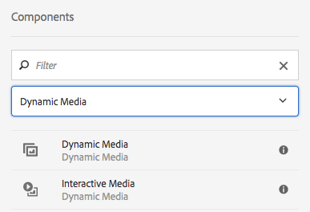

# Aggiunta di risorse Dynamic Media alle pagine {#adding-dynamic-media-assets-to-pages}

Per aggiungere la funzionalità Dynamic Media alle risorse utilizzate sui siti web, puoi aggiungere il componente **Dynamic Media** o **File multimediali interattivi** direttamente sulla pagina. A tale scopo, entra in modalità Layout e attiva i componenti per contenuti multimediali dinamici. Quindi, potrai aggiungere questi componenti alla pagina e fornire così risorse al componente. I componenti Elemento multimediale dinamico e File multimediali interattivi sono intelligenti: sanno se aggiungi un&#39;immagine o un video e le opzioni disponibili cambiano di conseguenza.

Se utilizzi AEM come WCM, aggiungi direttamente alla pagina le risorse Dynamic Media. Se ti avvali di una terza parte per WCM, puoi [collegare](linking-urls-to-yourwebapplication.md) o [incorporare](embed-code.md) le risorse. Per un sito web dinamico di terze parti, consulta la sezione [Distribuzione di immagini ottimizzate in un sito dinamico](responsive-site.md).

>[!NOTE]
>
>È necessario pubblicare le risorse prima di aggiungerle alle pagine di AEM. Consulta [Pubblicazione di risorse Dynamic Media](publishing-dynamicmedia-assets.md).

## Aggiunta di un componente Dynamic Media a una pagina {#adding-a-dynamic-media-component-to-a-page}

L’aggiunta di un componente Dynamic Media a una pagina equivale all’aggiunta di un componente a qualsiasi pagina. I componenti Dynamic Media sono descritti in dettaglio nelle sezioni seguenti.

>[!NOTE]
>
>Se in una pagina web è presente un componente Dynamic Media a cui accede un utente con autorizzazioni di sola lettura, le interruzioni di pagina e il rendering dei componenti non vengono eseguiti correttamente. Il motivo è che la pagina viene ricostruita per garantire che le proprietà dei componenti siano corrette e che tutte le risorse e le configurazioni di riferimento siano accessibili. Viene quindi eseguito di nuovo il rendering della pagina, causando l’interruzione dei componenti; non è possibile eseguire nuovamente il rendering del rispettivo codice componente sulla pagina a causa dell’accesso in sola lettura dell’utente.
>  
>Per evitare questo problema, accertati che gli utenti AEM Sites dispongano delle autorizzazioni necessarie per accedere alle risorse.

1. In AEM, apri la pagina in cui desideri aggiungere il Componente elementi multimediali dinamici.
1. Nel pannello a sinistra della pagina (potrebbe essere necessario attivare o disattivare la visualizzazione del pannello laterale), fai clic sull&#39;icona **[!UICONTROL Componenti]** .
1. Nell&#39;elenco a discesa dell&#39;intestazione **[!UICONTROL Componenti]**, selezionare **[!UICONTROL Dynamic Media]**. Se non è disponibile alcun elenco di componenti Dynamic Media, è probabile che sia necessario abilitare i componenti Dynamic Media che si desidera utilizzare. Consulta [Abilitazione dei componenti Dynamic Media](#enabling-dynamic-media-components).

   

1. Trascina un componente Dynamic Media da utilizzare nella pagina nella posizione desiderata.
1. Passa il puntatore del mouse direttamente sul componente. Quando un componente è circondato da una casella blu, tocca una volta per visualizzare la barra degli strumenti del componente. Toccare l&#39;icona **[!UICONTROL Configurazione]** (chiave inglese).
1. [Modifica i ](#dynamic-media-components) componenti come necessario e fai clic sul segno di spunta per salvare le modifiche.

### Abilitazione dei componenti Dynamic Media {#enabling-dynamic-media-components}

Se non è disponibile alcun componente Dynamic Media da aggiungere a una pagina, è probabile che sia necessario prima abilitare i componenti da utilizzare.

1. In AEM, apri la pagina in cui desideri aggiungere il Componente elementi multimediali dinamici.
1. Sul lato sinistro della barra degli strumenti vicino alla parte superiore della pagina, tocca l’icona Informazioni pagina , quindi tocca **[!UICONTROL Modifica modello]** dall’elenco a discesa.

   

1. Sul lato destro della barra degli strumenti vicino alla parte superiore della pagina, dall’elenco a discesa tocca **[!UICONTROL Struttura]**.

   

1. Nella parte inferiore della pagina, tocca **[!UICONTROL Contenitore di layout]** per aprire la relativa barra degli strumenti, quindi tocca l’icona Criterio .
1. Nella pagina **[!UICONTROL Contenitore di layout]** , sotto l’intestazione **[!UICONTROL Proprietà]** , accertati che sia selezionata la scheda **[!UICONTROL Componenti consentiti]** .

   

1. Scorri fino a visualizzare **[!UICONTROL Dynamic Media]**.
1. Tocca l’icona > a sinistra di **[!UICONTROL Dynamic Media]** per espandere l’elenco, seleziona i componenti Dynamic Media da abilitare.

   

1. Nell’angolo in alto a destra della pagina **[!UICONTROL Contenitore di layout]**, tocca l’icona Fine (segno di spunta).

1. Sul lato destro della barra degli strumenti vicino alla parte superiore della pagina, dall’elenco a discesa tocca **[!UICONTROL Contenuto iniziale]**, quindi [aggiungi un componente Dynamic Media a una pagina](#adding-a-dynamic-media-component-to-a-page) come di consueto.

## Localizzazione dei componenti Dynamic Media {#localizing-dynamic-media-components}

Puoi localizzare i componenti Dynamic Media in uno dei due modi seguenti:

* In una pagina web di Sites, apri **[!UICONTROL Proprietà]** e seleziona la scheda **[!UICONTROL Avanzate]**. Scegli la lingua desiderata per la localizzazione.

   

* Dal selettore del sito, seleziona la pagina o il gruppo di pagine desiderato. Tocca **[!UICONTROL Proprietà]** e seleziona la scheda **[!UICONTROL Avanzate]** . Scegli la lingua desiderata per la localizzazione.

   >[!NOTE]
   >
   >Al momento non tutte le lingue disponibili nel menu **[!UICONTROL Lingua]** dispongono di token assegnati.

## Componenti Dynamic Media {#dynamic-media-components}

Dynamic Media e File multimediali interattivi sono disponibili nella scheda [!UICONTROL Dynamic Media] in [!UICONTROL Componenti]. Puoi utilizzare un componente [!UICONTROL File multimediali interattivi] per tutte le risorse interattive, come per esempio video, immagini interattive o inserzioni carosello. Per tutti gli altri componenti dinamici, si consiglia di utilizzare il componente elementi multimediali dinamici.

>[!NOTE]
>
>Questi componenti non sono disponibili per impostazione predefinita e devono essere resi disponibili tramite l’editor modelli prima dell’utilizzo. [Una volta resi ](/help/sites-authoring/templates.md#editing-templates-template-authors) disponibili nell’editor modelli, puoi aggiungere i componenti alla pagina come faresti con qualsiasi altro componente AEM.

### Componente elementi multimediali dinamici {#dynamic-media-component}

Il componente Dynamic Media è intelligente: a seconda che si aggiunga un’immagine o un video, sono disponibili varie opzioni. Il componente supporta i predefiniti per immagini e i visualizzatori basati su immagini, come set di immagini, set di rotazione, set di file multimediali diversi e video. Inoltre, il visualizzatore è reattivo. In altre parole, le dimensioni dello schermo cambiano automaticamente in base alle dimensioni dello schermo. Tutti i visualizzatori sono visualizzatori HTML5.

>[!NOTE]
>
>Se è presente un componente Dynamic Media, un componente File multimediali interattivi o entrambi in una pagina web a cui si accede da un utente con autorizzazioni di sola lettura, le interruzioni di pagina e il rendering dei componenti non vengono eseguiti correttamente. Il motivo è che la pagina viene ricostruita per garantire che le proprietà dei componenti siano corrette e che tutte le risorse e le configurazioni di riferimento siano accessibili. Viene quindi eseguito di nuovo il rendering della pagina, causando l’interruzione dei componenti; non è possibile eseguire nuovamente il rendering del rispettivo codice componente sulla pagina a causa dell’accesso in sola lettura dell’utente.
>  
>Per evitare questo problema, accertati che gli utenti AEM Sites dispongano delle autorizzazioni necessarie per accedere alle risorse.

>[!NOTE]
>
>Quando aggiungi il Componente elementi multimediali dinamici e le **[!UICONTROL Impostazioni elemento multimediale dinamico]** sono vuote o non è possibile aggiungere correttamente una risorsa, controlla quanto segue:
>
>* È stato [abilitato Elemento multimediale dinamico](config-dynamic.md). Dynamic Media è disattivato per impostazione predefinita.
>* L&#39;immagine è in formato TIFF piramidale. Le immagini importate prima dell&#39;attivazione dell’elemento multimediale dinamico non hanno un file TIFF piramidale.

>

#### Quando si lavora con le immagini {#when-working-with-images}

Il componente elementi multimediali dinamici consente di aggiungere immagini dinamiche, compresi set di immagini, set di rotazione e set di file multimediali diversi. È possibile ingrandire, ridurre e, se applicabile, ruotare un&#39;immagine all&#39;interno di un set 360 gradi, o selezionare un&#39;immagine da un altro tipo di set.

È possibile anche configurare il predefinito visualizzatore, il predefinito immagine o il formato immagine direttamente nel componente. Per rendere un&#39;immagine reattiva è possibile impostare i punti di interruzione o applicare un predefinito immagine reattiva.

È necessario modificare le seguenti impostazioni Dynamic Media facendo clic sull&#39;icona **[!UICONTROL Modifica]** nel componente e quindi **[!UICONTROL Impostazioni Dynamic Media]**.

>[!NOTE]
>
>Per impostazione predefinita, il componente immagine Dynamic Media è adattivo. Se desideri impostarne una dimensione fissa, impostala nel componente nella scheda **[!UICONTROL Avanzate]** con le impostazioni **[!UICONTROL Larghezza]** e **[!UICONTROL Altezza]** .

* **[!UICONTROL Visualizzatore]**
predefinitoSeleziona un predefinito visualizzatore esistente dal menu a discesa. Se il predefinito per visualizzatori che cerchi non è visibile, potrebbe essere necessario renderlo visibile. Consulta Gestione dei predefiniti per visualizzatori. Non è possibile selezionare un predefinito per visualizzatori se si utilizza un predefinito per immagini, e viceversa.
Questa è l&#39;unica opzione disponibile se stai visualizzando set di immagini, set di rotazione o set di file multimediali diversi. Anche i predefiniti per visualizzatori sono avanzati: vengono visualizzati solo i predefiniti per visualizzatori pertinenti.

* **[!UICONTROL I modificatori]**
ViewerViewer assumono la forma di coppia nome=valore con un &amp; delimiter e consentono di modificare i visualizzatori come descritto nella Guida di riferimento visualizzatori. Un esempio di modificatore di visualizzatore è posterimage=img.jpg&amp;caption=text.vtt,1 che imposta un’immagine diversa per la miniatura del video e associa un file di sottotitoli/sottotitoli codificati al video.

* **[!UICONTROL Preimpostazione immagineSeleziona un predefinito immagine esistente dal menu a discesa.]**
Se il predefinito per immagini che cerchi non è visibile, potrebbe essere necessario renderlo visibile. Consulta Gestione dei predefiniti per immagini. Non è possibile selezionare un predefinito per visualizzatori se si utilizza un predefinito per immagini, e viceversa.
Questa è l&#39;unica opzione disponibile se stai visualizzando set di immagini, set di rotazione o set di file multimediali diversi.

* **[!UICONTROL Modificatori]**
immagineÈ possibile applicare effetti immagine fornendo ulteriori comandi immagine. Questi sono descritti in Predefiniti immagini e nella documentazione di riferimento Image Serving Command.
Questa è l&#39;unica opzione disponibile se stai visualizzando set di immagini, set di rotazione o set di file multimediali diversi.

* ****
Punti di interruzioneSe utilizzi questa risorsa su un sito reattivo, devi aggiungere i punti di interruzione immagine. I punti di interruzione immagine devono essere separati da virgole (,). Questa opzione funziona quando non è stata definita alcuna altezza o larghezza in un predefinito immagine.
Questa è l&#39;unica opzione disponibile se stai visualizzando set di immagini, set di rotazione o set di file multimediali diversi.
Puoi modificare le seguenti Impostazioni avanzate facendo clic su **[!UICONTROL Modifica]** nel componente.

* ****
TitoloModifica il titolo dell’immagine.

* **[!UICONTROL Testo Alt]**
Aggiungi un titolo all’immagine per gli utenti che hanno disattivato la grafica.
Questa è l&#39;unica opzione disponibile se stai visualizzando set di immagini, set di rotazione o set di file multimediali diversi.

* **[!UICONTROL URL, Apri]**
inPuoi impostare una risorsa per aprire un collegamento. Imposta l’URL e in Apri in indica se desideri aprirlo nella stessa finestra o in una nuova finestra.
Questa è l&#39;unica opzione disponibile se stai visualizzando set di immagini, set di rotazione o set di file multimediali diversi.

* **** Larghezza  ****
altezzaImmetti il valore in pixel se vuoi che l&#39;immagine sia di dimensioni fisse. Lasciando vuoti questi valori, la risorsa viene resa adattiva.

#### Quando esegui operazioni con i Video {#when-working-with-video}

Utilizza il componente Dynamic Media per aggiungere video dinamici alle pagine web. Quando modifichi il componente puoi scegliere di usare un predefinito visualizzatore video predefinita per la riproduzione del video nella pagina.

È necessario modificare le seguenti impostazioni Dynamic Media facendo clic su **[!UICONTROL Modifica]** nel componente.

>[!NOTE]
>
>Per impostazione predefinita, il componente video elementi multimediali dinamici è adattivo. Se vuoi impostarne una dimensione fissa, impostala nel componente con la scheda **[!UICONTROL Larghezza]** e **[!UICONTROL Altezza]** nella scheda [!UICONTROL Avanzate] .

* **[!UICONTROL Visualizzatore]**
predefinitoSeleziona un predefinito visualizzatore video dal menu a discesa. Se il predefinito per visualizzatori che cerchi non è visibile, potrebbe essere necessario renderlo visibile. Consulta Gestione dei predefiniti per visualizzatori. 

* **[!UICONTROL I modificatori]**
ViewerViewer assumono la forma di coppia nome=valore con un &amp; delimiter e consentono di modificare i visualizzatori come descritto nella Guida di riferimento visualizzatori di Adobe. Un esempio di modificatore di visualizzatore è posterimage=img.jpg&amp;caption=text.vtt,1

   Con i modificatori visualizzatore, ad esempio, puoi effettuare le seguenti operazioni:

   * Associare un file di didascalia a un video [didascalia.](https://experienceleague.adobe.com/docs/dynamic-media-developer-resources/library/viewers-aem-assets-dmc/video/command-reference-url-video/r-html5-video-viewer-url-caption.html)
   * Associa un file di navigazione a un video [di navigazione.](https://experienceleague.adobe.com/docs/dynamic-media-developer-resources/library/viewers-aem-assets-dmc/video/command-reference-url-video/r-html5-video-viewer-url-navigation.html)

Puoi modificare le seguenti [!UICONTROL Impostazioni avanzate] facendo clic su **[!UICONTROL Modifica]** nel componente.

* ****
TitoloModifica il titolo del video.

* **** Larghezza  ****
altezzaImmetti il valore in pixel se vuoi che il video sia di dimensioni fisse. Se questi valori vengono lasciati vuoti, la risorsa sarà adattiva.

#### Quando si lavora con Smart Crop {#when-working-with-smart-crop}

Utilizza il componente Dynamic Media per aggiungere le risorse immagine ritaglio avanzato alle pagine web. Quando modifichi il componente puoi scegliere di usare un predefinito visualizzatore video predefinita per la riproduzione del video nella pagina.

Vedere anche [Profili immagine](image-profiles.md).

Per modificare le seguenti [!UICONTROL Impostazioni Dynamic Media], fai clic su **[!UICONTROL Modifica]** nel componente.

>[!NOTE]
>
>Per impostazione predefinita, il componente immagine Dynamic Media è adattivo. Se vuoi impostarne una dimensione fissa, lo puoi fare nella scheda [!UICONTROL Avanzate] del componente, alle voci **[!UICONTROL Larghezza]** e **[!UICONTROL Altezza]**.

* **[!UICONTROL Modificatori]**
immagineÈ possibile applicare effetti immagine fornendo ulteriori comandi immagine. Questi sono descritti in Predefiniti immagini e nella documentazione di riferimento Image Serving Command.
Questa è l&#39;unica opzione disponibile se stai visualizzando set di immagini, set di rotazione o set di file multimediali diversi.

È possibile modificare le seguenti impostazioni **[!UICONTROL Avanzate]** facendo clic su **[!UICONTROL Modifica]** nel componente.

* ****
TitoloModifica il titolo dell’immagine Ritaglio avanzato.

* **[!UICONTROL Testo Alt]**
Aggiungi un titolo all’immagine di ritaglio avanzato per gli utenti che hanno disattivato la grafica.
Questa è l&#39;unica opzione disponibile se stai visualizzando set di immagini, set di rotazione o set di file multimediali diversi.

* **[!UICONTROL URL, Apri]**
inPuoi impostare una risorsa per aprire un collegamento. Imposta l’URL e in Apri in indica se desideri aprirlo nella stessa finestra o in una nuova finestra.
Questa è l&#39;unica opzione disponibile se stai visualizzando set di immagini, set di rotazione o set di file multimediali diversi.

* **** Altezza e  ****
larghezzaImmetti il valore in pixel se vuoi che l’immagine di ritaglio avanzato sia di dimensioni fisse. Se questi valori vengono lasciati vuoti, la risorsa sarà adattiva.

### Componente File multimediali interattivi {#interactive-media-component}

Il Componente File multimediali interattivi è adatto per le risorse che dispongono di interattività, come punti attivi o mappe immagine. Se disponi di un&#39;immagine, un video interattivo o un banner carosello, utilizza il componente File multimediali interattivi.

Il componente File multimediali interattivi è intelligente: a seconda che si aggiunga un’immagine o un video, sono disponibili varie opzioni. Inoltre, il visualizzatore è reattivo: le dimensioni dello schermo cambiano automaticamente in base alle dimensioni reali dello stesso. Tutti i visualizzatori sono visualizzatori HTML5.

>[!NOTE]
>
>Se è presente un componente Dynamic Media, un componente File multimediali interattivi o entrambi in una pagina web a cui si accede da un utente con autorizzazioni di sola lettura, le interruzioni di pagina e il rendering dei componenti non vengono eseguiti correttamente. Il motivo è che la pagina viene ricostruita per garantire che le proprietà dei componenti siano corrette e che tutte le risorse e le configurazioni di riferimento siano accessibili. Viene quindi eseguito di nuovo il rendering della pagina, causando l’interruzione dei componenti; non è possibile eseguire nuovamente il rendering del rispettivo codice componente sulla pagina a causa dell’accesso in sola lettura dell’utente.
> 
>Per evitare questo problema, accertati che gli utenti AEM Sites dispongano delle autorizzazioni necessarie per accedere alle risorse.

È possibile modificare le seguenti impostazioni **[!UICONTROL Generali]**, facendo clic su **[!UICONTROL Modifica]** nel componente.

* **[!UICONTROL Visualizzatore]**
predefinitoSeleziona un predefinito visualizzatore esistente dal menu a discesa. Se il predefinito per visualizzatori che cerchi non è visibile, potrebbe essere necessario renderlo visibile. I predefiniti per visualizzatori devono essere pubblicati prima di poter essere utilizzati. Consulta Gestione dei predefiniti per visualizzatori. 

* ****
TitoloModifica il titolo del video.

* **** Larghezza  ****
altezzaImmetti il valore in pixel se vuoi che il video sia di dimensioni fisse. Se questi valori vengono lasciati vuoti, la risorsa sarà adattiva.

È possibile modificare le seguenti impostazioni **[!UICONTROL Aggiungi al carrello]**, facendo clic su **[!UICONTROL Modifica]** nel componente.

* **[!UICONTROL Mostra]**
risorsa prodotto Per impostazione predefinita, questo valore è selezionato. La risorsa di prodotto mostra un&#39;immagine del prodotto in base a quanto definito nel modulo Commerce. Rimuovi il segno di spunta per non visualizzare la risorsa di prodotto.

* **[!UICONTROL Mostra]**
prezzo prodotto Per impostazione predefinita, questo valore è selezionato. Prezzo del prodotto mostra il prezzo dell&#39;elemento in base a quanto definito nel modulo Commerce. Rimuovi il segno di spunta per non visualizzare il prezzo del prodotto.

* **[!UICONTROL Mostra]**
modulo prodotto per impostazione predefinita, questo valore non è selezionato. Il Modulo del prodotto include tutte le varianti del prodotto, come la dimensione e il colore. Rimuovi il segno di spunta per non visualizzare le varianti prodotto.

### Componente Elemento multimediale panoramico {#panoramic-media-component}

Il componente Elemento multimediale panoramico è per le risorse che sono immagini panoramiche sferiche. Tali immagini offrono un&#39;esperienza di visualizzazione a 360° di una stanza, proprietà, posizione o paesaggio. Affinché un&#39;immagine si qualifichi come panorama sferico, deve avere uno O entrambi i seguenti elementi:

* Rapporto di formato 2:1.
* Etichettate con le parole chiave &quot;equirettangolare&quot; o (&quot;sferico&quot; + &quot;panorama&quot;) o (&quot;sferico&quot; + &quot;panoramico&quot;). Consulta [Uso dei tag](/help/sites-authoring/tags.md).

Sia le proporzioni che i criteri delle parole chiave si applicano alle risorse panoramiche della pagina dei dettagli delle risorse che il componente WCM &quot;Elemento multimediale panoramico&quot;.

Per modificare l’impostazione seguente, tocca **[!UICONTROL Configura]** nel componente.

* **[!UICONTROL Visualizzatore]**
predefinitoSeleziona un visualizzatore esistente dal menu a discesa Predefinito visualizzatore .

Se il predefinito per visualizzatori che stai cercando non è visibile, assicurati che sia pubblicato. È necessario pubblicare i predefiniti visualizzatore prima di poterli utilizzare. Consulta [Gestione dei predefiniti per visualizzatori](managing-viewer-presets.md). 

### Utilizzo di HTTP/2 per la distribuzione delle risorse Dynamic Media {#using-http-to-delivery-dynamic-media-assets}

HTTP/2 è il nuovo protocollo web aggiornato che migliora il modo in cui i browser e i server comunicano. Fornisce un trasferimento più rapido delle informazioni e riduce la quantità di potenza di elaborazione necessaria. La distribuzione delle risorse Dynamic Media può ora avvenire tramite HTTP/2, garantendo tempi di risposta e caricamento migliori.

Per informazioni dettagliate su come iniziare a utilizzare HTTP/2 con il tuo account Dynamic Media, consulta [Distribuzione di contenuti HTTP2](http2.md) .

>[!MORELIKETHIS]
>
>* [Informazioni sulla gestione del colore con AEM Dynamic Media](https://helpx.adobe.com/experience-manager/kt/assets/using/dynamic-media-color-management-technical-video-setup.html)
>* [Utilizzo di miniature video personalizzate con Dynamic Media AEM](https://helpx.adobe.com/experience-manager/kt/assets/using/dynamic-media-video-thumbnails-feature-video-use.html)
>* [Informazioni sul Visualizzatore risorse con AEM Dynamic Media](https://helpx.adobe.com/experience-manager/kt/assets/using/dynamic-media-viewer-feature-video-understand.html)
>* [Utilizzo di video interattivi con AEM Dynamic Media](https://helpx.adobe.com/experience-manager/kt/assets/using/dynamic-media-interactive-video-feature-video-use.html)
>* [Utilizzo del lettore video in AEM Dynamic Media](https://helpx.adobe.com/experience-manager/kt/assets/using/dynamic-media-video-player-feature-video-use.html)
>* [Utilizzo della nitidezza delle immagini con AEM Dynamic Media](https://helpx.adobe.com/experience-manager/6-4/assets/using/best-practices-for-optimizing-the-quality-of-your-images.html)

