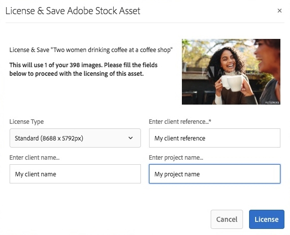
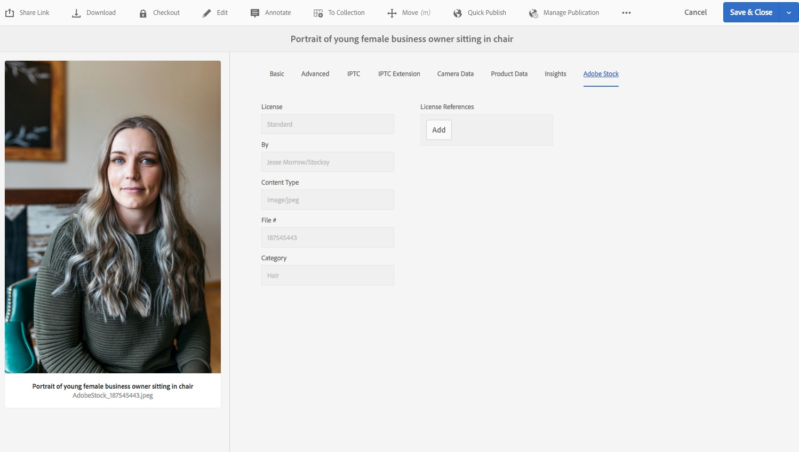

# Utilizzo [!DNL Adobe Stock] risorse in [!DNL Adobe Experience Manager Assets] {#use-adobe-stock-assets-in-aem-assets}

>[!CAUTION]
>
>AEM 6.4 ha raggiunto la fine del supporto esteso e questa documentazione non viene più aggiornata. Per maggiori dettagli, consulta la nostra [periodi di assistenza tecnica](https://helpx.adobe.com/it/support/programs/eol-matrix.html). Trova le versioni supportate [qui](https://experienceleague.adobe.com/docs/).

Le organizzazioni possono integrare le proprie [!DNL Adobe Stock] piano aziendale con [!DNL Experience Manager Assets] per garantire che le risorse concesse in licenza siano ampiamente disponibili per i loro progetti creativi e di marketing, con le potenti funzionalità di gestione delle risorse di [!DNL Experience Manager].

[!DNL Adobe Stock] Il servizio consente a designer e aziende di accedere a milioni di foto, vettoriali, illustrazioni, video, modelli e risorse 3D di alta qualità, curate e prive di royalty, per tutti i loro progetti creativi. [!DNL Experience Manager] gli utenti possono trovare, visualizzare in anteprima e concedere in licenza rapidamente [!DNL Adobe Stock] risorse salvate in [!DNL Experience Manager], senza lasciare [!DNL Experience Manager] interfaccia.

## Prerequisiti {#prerequisites}

L&#39;integrazione richiede un [piano Adobe Stock aziendale](https://stockenterprise.adobe.com/) e [!DNL Experience Manager] 6.4 con almeno Service Pack 2 implementato. Per [!DNL Experience Manager] 6.4 dettagli del service pack, vedi questi [note sulla versione](/help/release-notes/sp-release-notes.md).

## Integrare [!DNL Experience Manager] e [!DNL Adobe Stock] {#integrate-aem-and-adobe-stock}

Per consentire la comunicazione tra [!DNL Experience Manager] e [!DNL Adobe Stock], crea una configurazione IMS e un’ [!DNL Adobe Stock] configurazione in [!DNL Experience Manager].

>[!NOTE]
>
>Solo [!DNL Experience Manager] amministratori e [!DNL Admin Console] gli amministratori di un&#39;organizzazione possono eseguire l&#39;integrazione in quanto richiede privilegi di amministratore.

### Creare una configurazione IMS {#create-an-ims-configuration}

1. In [!DNL Experience Manager] interfaccia utente, passa a **[!UICONTROL Strumenti]** > **[!UICONTROL Sicurezza]** > **[!UICONTROL Configurazioni Adobe IMS]**. Fai clic su **[!UICONTROL Crea]** e seleziona **[!UICONTROL Soluzione cloud]** > **[!UICONTROL Adobe Stock]**.
1. Riutilizzare un certificato esistente o selezionare **[!UICONTROL Crea nuovo certificato]**.
1. Fai clic su **[!UICONTROL Crea certificato]**. Una volta creata, scarica la chiave pubblica. Fai clic su **[!UICONTROL Avanti]**. Lascia la [!UICONTROL Configurazione dell’account tecnico Adobe IMS] viene visualizzata una schermata con i valori richiesti a breve.
1. Accesso [Console Adobe Developer](https://console.adobe.io). Assicurati che il tuo account disponga delle autorizzazioni di amministratore per l’organizzazione per la quale è richiesta l’integrazione.
1. Fai clic su **[!UICONTROL Crea nuovo progetto]** e fai clic su **[!UICONTROL Aggiungi API]**. Seleziona **[!UICONTROL Adobe Stock]** dall’elenco delle API disponibili. Seleziona [!UICONTROL OAUTH 2.0 Web].
1. Fornire **[!UICONTROL URI di reindirizzamento predefinito]** e **[!UICONTROL Pattern URI di reindirizzamento]** valori. Fai clic su **[!UICONTROL Salva API configurata]**. Copia l&#39;ID e il segreto generati.
1. In [!UICONTROL Configurazione dell’account tecnico Adobe IMS] fornire i valori nelle caselle con titolo **[!UICONTROL Titolo]**, **[!UICONTROL Server autorizzazioni]**, **[!UICONTROL Chiave API]**, **[!UICONTROL Segreto client]** e **[!UICONTROL Payload]**. Per informazioni dettagliate su questi valori, vedi [Avvio rapido autenticazione JWT](https://www.adobe.io/authentication/auth-methods.html#!AdobeDocs/adobeio-auth/master/JWT/JWT.md).

<!-- TBD: Update the URL when the new URL is available. Logged issue github.com/AdobeDocs/adobeio-auth/issues/63.
-->

### Crea [!DNL Adobe Stock] configurazione in [!DNL Experience Manager] {#create-adobe-stock-configuration-in-aem}

1. In [!DNL Experience Manager] interfaccia utente, passa a **[!UICONTROL Strumenti]** > **[!UICONTROL Cloud Services]** > **[!UICONTROL Adobe Stock]**.
1. Fai clic su **[!UICONTROL Crea]** per creare una configurazione e associarla alla configurazione IMS esistente. Seleziona `PROD` come parametro di ambiente.
1. In **[!UICONTROL Percorso risorse in licenza]** lasciare una posizione così com&#39;è. Non modificare la posizione in cui si desidera memorizzare il [!DNL Adobe Stock] risorse.
1. Completa la creazione aggiungendo tutte le proprietà richieste. Fai clic su **[!UICONTROL Salva e chiudi]**.
1. Aggiungi [!DNL Experience Manager] utenti o gruppi che possono concedere la licenza per le risorse.

>[!NOTE]
>
>Se sono presenti più [!DNL Adobe Stock] configurazioni, seleziona la configurazione desiderata nel pannello Preferenze utente (**[!UICONTROL AEM]** > **[!UICONTROL Icona utente]** > **[!UICONTROL Preferenze utente]** > **[!UICONTROL Configurazione Stock]**).

## Utilizzare e gestire [!DNL Adobe Stock] risorse in [!DNL Experience Manager] {#usemanage}

Utilizzando questa funzionalità, le organizzazioni possono consentire agli utenti di utilizzare [!DNL Adobe Stock] risorse in [!DNL Experience Manager Assets]. Da all’interno di [!DNL Experience Manager] interfaccia utente, gli utenti possono cercare [!DNL Adobe Stock] e crea una licenza per le risorse richieste.

Una volta [!DNL Adobe Stock] la risorsa dispone di una licenza in [!DNL Experience Manager], può essere utilizzato e gestito come una tipica risorsa. In [!DNL Experience Manager], gli utenti possono cercare e visualizzare in anteprima le risorse; copiare e pubblicare le risorse; condividere le risorse su [!DNL Brand Portal]; accedere alle risorse e utilizzarle tramite [!DNL Experience Manager] app desktop; e così via.

*Figura: Cerca [!DNL Adobe Stock] risorse e filtrare i risultati dal [!DNL Experience Manager] interfaccia.*

**A.**[!DNL Adobe Stock] Cerca risorse simili a quelle di chi è fornito l’ID **B.** Cerca risorse corrispondenti alla tua selezione di forma o orientamento. **C.** Cerca uno o più dei tipi di risorse supportati **D.** Apri o comprimi il riquadro Filtri **E.** Procurati la licenza relativa e salva la risorsa selezionata in [!DNL Experience Manager]**F.**[!DNL Experience Manager] Salva la risorsa in applicando la filigrana **G.**[!DNL Adobe Stock] Sul sito web di , esplora le risorse simili a quella selezionata **H.**[!DNL Adobe Stock] Visualizza le risorse selezionate sul sito web di **I.** Numero di risorse selezionate proveniente dai risultati della ricerca **J.** Passaggio tra la vista a schede e la vista a elenco

### Trovare risorse {#find-assets}

Le [!DNL Experience Manager] gli utenti possono cercare le risorse in entrambi, [!DNL Experience Manager] e [!DNL Adobe Stock]. Quando il percorso di ricerca non è limitato a [!DNL Adobe Stock], i risultati della ricerca da [!DNL Experience Manager] e [!DNL Adobe Stock] vengono visualizzati.

* Per cercare [!DNL Adobe Stock] risorse, fai clic su **[!UICONTROL Navigazione]** > **[!UICONTROL Risorse]** > **[!UICONTROL Ricerca in Adobe Stock]**.

* Per cercare risorse in diversi modi [!DNL Adobe Stock] e [!DNL Experience Manager Assets], fai clic su ricerca .

In alternativa, inizia a digitare `Location: Adobe Stock` nella barra di ricerca da selezionare [!DNL Adobe Stock] risorse. [!DNL Experience Manager] offre funzionalità di filtro avanzate per le risorse ricercate, che consentono agli utenti di accedere rapidamente da zero alle risorse richieste utilizzando i filtri, ad esempio i tipi di risorse supportate, l’orientamento dell’immagine e lo stato con licenza.

>[!NOTE]
>
>Risorse cercate da [!DNL Adobe Stock] vengono visualizzati solo in [!DNL Experience Manager]. [!DNL Adobe Stock] le risorse vengono recuperate e memorizzate in [!DNL Experience Manager] archivio solo dopo un utente [salva una risorsa](/help/assets/aem-assets-adobe-stock.md#saveassets) o [concede e salva una risorsa](/help/assets/aem-assets-adobe-stock.md#licenseassets). Risorse già memorizzate in [!DNL Experience Manager] vengono visualizzati ed evidenziati per semplificare il riferimento e l’accesso. Inoltre, il [!DNL Stock] le risorse vengono salvate con alcuni metadati aggiuntivi per indicare l’origine come [!DNL Stock].

*Figura: Filtri di ricerca in [!DNL Experience Manager] e evidenziato [!DNL Adobe Stock] risorse nei risultati della ricerca.*

### Salvare e visualizzare le risorse richieste {#saveassets}

Seleziona una risorsa da salvare in [!DNL Experience Manager]. Fai clic su [!UICONTROL Salva] nella barra degli strumenti nella parte superiore e fornisci il nome e la posizione della risorsa. Le risorse senza licenza vengono salvate localmente con una filigrana.

La prossima volta che cerchi le risorse, le risorse salvate vengono evidenziate con un contrassegno, per indicare che sono disponibili in [!DNL Experience Manager Assets].

>[!NOTE]
>
>Le risorse aggiunte di recente visualizzano un nuovo badge invece del badge License .

### Risorse di licenza {#licenseassets}

Gli utenti possono concedere licenze [!DNL Adobe Stock] le risorse utilizzando la quota delle loro [!DNL Adobe Stock] piano aziendale. Quando si concede la licenza a una risorsa, questa viene salvata senza filigrana ed è disponibile per la ricerca e l’utilizzo in [!DNL Experience Manager Assets].

*Figura: Finestra di dialogo per la licenza e il salvataggio [!DNL Adobe Stock] risorse in [!DNL Experience Manager Assets].*

### Accedere a metadati e proprietà delle risorse {#access-metadata-and-asset-properties}

Gli utenti possono accedere ai metadati e visualizzarli in anteprima, tra cui [!DNL Adobe Stock] proprietà dei metadati per le risorse salvate in [!DNL Experience Manager]e aggiungi **[!UICONTROL Riferimenti della licenza]** per una risorsa. Tuttavia, gli aggiornamenti al riferimento della licenza non vengono sincronizzati tra [!DNL Experience Manager] e [!DNL Adobe Stock] sito web.

Gli utenti possono visualizzare le proprietà sia delle risorse con licenza che di quelle senza licenza.

*Figura: Visualizzare e accedere ai metadati e ai riferimenti di licenza delle risorse salvate.*

## Limitazioni note {#known-limitations}

* **L&#39;avviso dell&#39;immagine editoriale non viene visualizzato**: Quando si concede in licenza un&#39;immagine, gli utenti non possono verificare se un&#39;immagine è di utilizzo solo editoriale. Per evitare possibili abusi, gli amministratori possono disattivare l’accesso alle risorse editoriali dall’Admin Console.

* **Visualizzazione del tipo di licenza errato**: È possibile che venga visualizzato un tipo di licenza errato in [!DNL Experience Manager] per una risorsa. Gli utenti possono accedere al [!DNL Adobe Stock] per visualizzare il tipo di licenza.

* **I campi e i metadati di riferimento non sono sincronizzati**: Quando un utente aggiorna un campo di riferimento della licenza, le informazioni di riferimento della licenza vengono aggiornate in [!DNL Experience Manager] ma non sul [!DNL Adobe Stock] sito web. Analogamente, se l’utente aggiorna i campi di riferimento nella [!DNL Adobe Stock] sito web, gli aggiornamenti non sono sincronizzati in [!DNL Experience Manager].

>[!MORELIKETHIS]
>
>* [Esercitazione video sull’utilizzo [!DNL Adobe Stock] risorse con [!DNL Experience Manager Assets]](https://experienceleague.adobe.com/docs/experience-manager-learn/assets/creative-workflows/adobe-stock.html)
>* [[!DNL Adobe Stock] aiuto per il piano aziendale](https://helpx.adobe.com/enterprise/admin-guide.html/enterprise/using/adobe-stock-enterprise.ug.html)
>* [[!DNL Adobe Stock] Domande frequenti](https://helpx.adobe.com/stock/faq.html)

