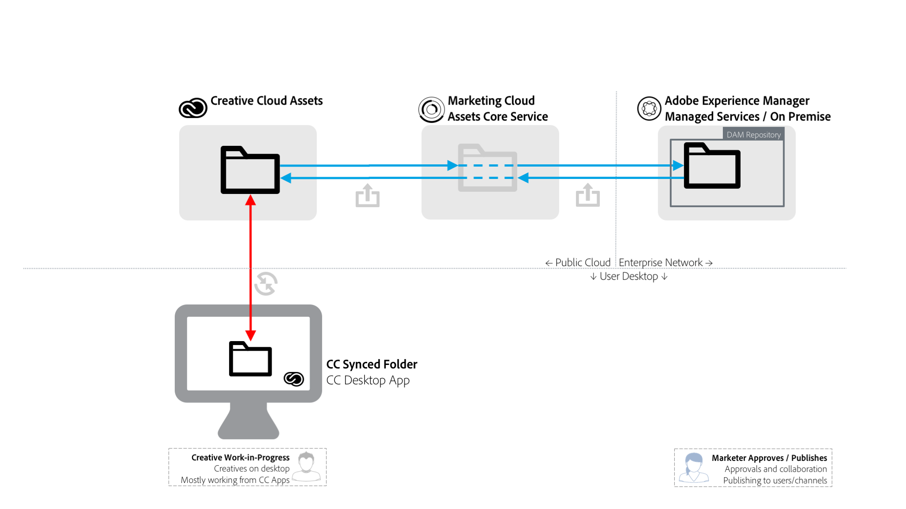

# Best practice per la condivisione di cartelle da AEM a Creative Cloud {#aem-to-creative-cloud-folder-sharing-best-practices}

>[!CAUTION]
>
>La funzione di condivisione delle cartelle AEM su Creative Cloud è obsoleta. Adobe consiglia vivamente di utilizzare funzionalità più recenti, come [Adobe Asset Link](https://helpx.adobe.com/it/enterprise/using/adobe-asset-link.html) o l’app [desktop](https://helpx.adobe.com/experience-manager/desktop-app/aem-desktop-app.html)AEM. Scopri di più nelle best practice per l’integrazione con [AEM e Creative Cloud](/help/assets/aem-cc-integration-best-practices.md).

 Adobe Experience Manager (AEM) può essere configurato per consentire agli utenti di AEM Assets di condividere cartelle con utenti Creative Cloud, in modo che siano disponibili come cartelle condivise nel servizio Creative Cloud Assets. La funzione può essere utilizzata per scambiare file tra team creativi e utenti AEM Assets, soprattutto quando gli utenti creativi non hanno accesso all’istanza AEM Assets (non si trovano sulla rete aziendale).

Questo tipo di integrazione può essere utilizzato in entrambi i casi di utilizzo, soprattutto quando si lavora con utenti che non hanno accesso diretto ai AEM Assets:

* Condivisione di una serie di risorse specifiche da AEM Assets con utenti di Creative Cloud Files (ad esempio, una serie di risorse creative e approvate per il lavoro di progettazione di una nuova attività di marketing)
* Ricezione di nuovi file da parte degli utenti di Creative Cloud.

>[!NOTE]
>
>Prima di leggere questo documento, puoi consultare le best practice [generali per l’integrazione con](aem-cc-integration-best-practices.md) AEM e Creative Cloud per una panoramica di livello superiore dell’argomento.

## Panoramica {#overview}

La condivisione di cartelle su AEM per Creative Cloud si basa sulla condivisione lato server di cartelle e file tra AEM Assets e account Creative Cloud. I professionisti creativi, che utilizzano l’applicazione desktop Creative Cloud sui propri desktop, possono inoltre rendere le cartelle condivise disponibili direttamente sui propri dischi utilizzando la tecnologia Adobe CreativeSync.

Il diagramma seguente fornisce una panoramica dell&#39;integrazione.

L&#39;integrazione include i seguenti elementi:

* **Server** AEM Assets implementato nella rete aziendale (servizi gestiti o locali): La condivisione delle cartelle viene avviata qui.
* **servizio** di base Risorse Adobe Marketing Cloud: Agisce come intermediario tra i servizi di archiviazione AEM e Creative Cloud. L&#39;amministratore della società che utilizza l&#39;integrazione deve stabilire una relazione di trust tra l&#39;organizzazione Marketing Cloud e l&#39;istanza AEM Assets. Inoltre, [definiscono un elenco di collaboratori](https://docs.adobe.com/content/help/en/core-services/interface/assets/t-admin-add-cc-user.html)di Creative Cloud approvati, che gli utenti di AEM Assets possono condividere anche le cartelle per ulteriore sicurezza.
* **Servizi** Web Creative Cloud Assets (interfaccia utente Web per l&#39;archiviazione e Creative Cloud Files): Questo è il punto in cui utenti Creative Cloud specifici, con cui è stata condivisa una cartella di AEM Assets, possono accettare l&#39;invito e visualizzare la cartella nell&#39;archivio del loro account Creative Cloud.
* **Applicazione** desktop Creative Cloud: (Facoltativo) Consente l&#39;accesso diretto a cartelle/file condivisi dal desktop dell&#39;utente creativo tramite sincronizzazione con l&#39;archiviazione Creative Cloud Assets.

## Caratteristiche e limitazioni {#characteristics-and-limitations}

* **Propagazione unidirezionale delle modifiche:** Le modifiche ai file vengono propagate in una sola direzione, dal sistema (AEM o Creative Cloud Assets), in cui la risorsa è stata creata originariamente (caricata). L&#39;integrazione non fornisce una sincronizzazione bidirezionale completamente automatizzata tra i due sistemi.

* **Gestione versioni:**

   * AEM crea solo versioni di una risorsa in base agli aggiornamenti se il file è stato creato in AEM e vi viene aggiornato.
   * Creative Cloud Assets offre una propria funzione [di controllo delle](https://helpx.adobe.com/creative-cloud/help/versioning-faq.html) versioni, con targeting per gli aggiornamenti di Work In Progress (praticamente, memorizza gli aggiornamenti fino a 10 giorni)

* **Limiti di spazio:** Le dimensioni e i volumi di file scambiati sono limitati dalla quota [specifica di Risorse](https://helpx.adobe.com/creative-cloud/kb/file-storage-quota.html) Creative Cloud per gli utenti creativi (dipende dal livello di iscrizione) e da un limite di 5 GB per la dimensione massima dei file. Lo spazio è inoltre limitato dalla quota di risorse di cui dispone l’organizzazione nel servizio di base  risorse di Adobe Marketing Cloud.

* **Requisiti di spazio:** Anche i file nelle cartelle condivise devono essere memorizzati fisicamente in AEM e quindi nell’account Creative Cloud, con una copia memorizzata nella cache nel servizio di base Marketing Cloud Assets.
* **Rete e larghezza di banda:** I file in cartelle condivise e tutti gli aggiornamenti devono essere trasportati attraverso la rete tra i sistemi. Devi accertarti che siano condivisi solo i file e gli aggiornamenti rilevanti.
* **Tipo** cartella: La condivisione di una cartella di risorse di tipo `sling:OrderedFolder`non è supportata. Se desiderate condividere una cartella, quando la create in AEM Assets, non selezionate l’opzione Ordinato.

## Best practices {#best-practices}

Le best practice per sfruttare AEM per la condivisione di cartelle in Creative Cloud includono:

* **Considerazioni sul volume:** La condivisione delle cartelle AEM/Creative Cloud deve essere utilizzata per condividere un numero minore di file, ad esempio relativi a una campagna o un&#39;attività specifica. Per condividere set di risorse più grandi, come tutte le risorse approvate nell’organizzazione, utilizzate altri metodi di distribuzione (ad esempio, AEM Assets Brand Portal) o l’app desktop AEM.
* **Evitate la condivisione di gerarchie profonde:** La condivisione funziona in modo ricorsivo e non consente la condivisione selettiva. In genere, per la condivisione devono essere prese in considerazione solo le cartelle prive di sottocartelle o con una gerarchia molto bassa, come 1 livello di sottocartella.
* **Cartelle separate per la condivisione unidirezionale:** Le cartelle devono essere utilizzate separatamente per condividere le risorse finali dai AEM Assets ai file di Creative Cloud e per condividere le risorse pronte per la creazione dai file di Creative Cloud ai AEM Assets. Insieme a una buona convenzione di denominazione per queste cartelle, crea un ambiente di lavoro facile da capire per AEM Assets e utenti Creative Cloud.
* **Evitare WIP nella cartella condivisa:** La cartella condivisa non deve essere utilizzata per Work in Progress. Per eseguire il lavoro che richiede frequenti modifiche al file, usate una cartella separata in Creative Cloud Files.
* **Avvia nuovo lavoro all&#39;esterno della cartella condivisa:** Le nuove progettazioni (file creativi) devono essere avviate nella cartella WIP separata in Creative Cloud Files e, quando sono pronte per essere condivise con gli utenti AEM Assets, devono essere spostate o salvate nella cartella condivisa.
* **Semplificazione della struttura di condivisione:** Per una configurazione operativa più gestibile, pensate a semplificare la struttura di condivisione. Invece di condividere con tutti gli utenti creativi, le cartelle AEM Assets devono essere condivise solo con i rappresentanti del team, come un direttore creativo o un responsabile del team. Dal lato creativo, il manager riceve le risorse finali, decide sulle assegnazioni di lavoro e lascia che i progettisti lavorino nei propri account Creative Cloud sulle risorse WIP. Possono utilizzare le funzioni di collaborazione di Creative Cloud per coordinare il lavoro e infine selezionare e inserire le risorse pronte per la condivisione verso AEM Assets nella cartella condivisa pronta per la creazione.

Nel diagramma seguente è illustrata una configurazione di esempio per la creazione di nuove progettazioni basate sulle risorse finali esistenti dai AEM Assets.

