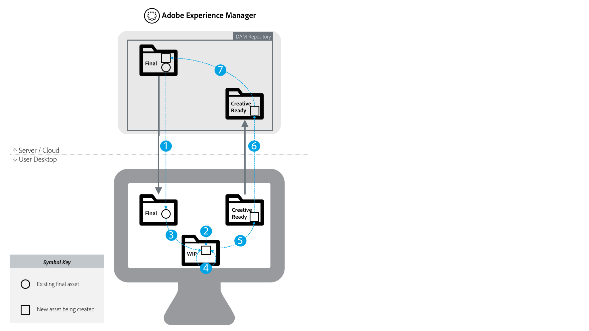

# Best practice per l&#39;integrazione di AEM e Creative Cloud {#aem-and-creative-cloud-integration-best-practices}

<!-- TBD: Reconcile with 6.5 article that's ahead of this article now in terms of content streamlining and structuring.
-->

Adobe Experience Manager Assets è una soluzione di gestione delle risorse digitali (DAM) che può essere integrata con Adobe Creative Cloud per aiutare gli utenti DAM a collaborare con i team creativi, semplificando la collaborazione nel processo di creazione dei contenuti.

Adobe Creative Cloud offre ai team creativi un ecosistema di soluzioni e servizi per aiutarli a creare risorse digitali. Include applicazioni desktop e mobili, servizi cloud come l&#39;archiviazione con sincronizzazione desktop o esperienza Web, nonché marketplace come  Adobe Stock.

Continua a leggere per scoprire quali integrazioni scegliere tra desktop e DAM di livello Enterprise in base al tuo caso di utilizzo e quali sono le best practice associate ai flussi di lavoro di collegamento.

>[!NOTE]
>
>AEM per Creative Cloud la condivisione delle cartelle è obsoleta e non è più inclusa in questa guida.  Adobe consiglia di utilizzare funzionalità più recenti, come [collegamento](https://helpx.adobe.com/it/enterprise/using/adobe-asset-link.html) risorse Adobe o l’app [desktop](https://docs.adobe.com/content/help/it-IT/experience-manager-desktop-app/using/introduction.html) AEM per fornire agli utenti creativi l’accesso alle risorse gestite in AEM.

## Esigenze di collaborazione tra creativi, esperti di marketing e utenti DAM {#collaboration-needs-of-creatives-marketers-and-dam-users}

| Requisiti | Caso di utilizzo | Superfici interessate |
|---|---|---|
| Esperienza semplificata per i creativi su desktop | Semplificate l&#39;accesso alle risorse da un DAM ( AEM Assets) per i creativi professionisti o, più in generale, per gli utenti desktop che lavorano nelle applicazioni native per la creazione di risorse. Hanno bisogno di un modo semplice e semplice per scoprire, usare (aprire), modificare e salvare le modifiche in AEM, nonché caricare nuovi file. | desktop Win o Mac; Creative Cloud di app |
| Fornire risorse pronte all’uso di alta qualità da  Adobe Stock | Gli esperti di marketing contribuiscono ad accelerare il processo di creazione dei contenuti fornendo assistenza per l&#39;origine e l&#39;individuazione delle risorse. I creativi professionisti usano le risorse approvate direttamente dai loro strumenti creativi. |  AEM Assets;  mercato Adobe Stock; campi di metadati |
| Distribuire e condividere le risorse per organizzazioni | I dipartimenti interni/le filiali locali e i partner esterni, i distributori e le agenzie utilizzano le risorse approvate condivise dall&#39;organizzazione madre. L’organizzazione intende condividere in modo sicuro e senza soluzione di continuità le risorse create per un riutilizzo più ampio. | Portale del marchio, Contenuti di condivisione delle risorse |

## Offerte  Adobe per supportare le esigenze di collaborazione {#adobe-offerings-to-support-the-collaboration-need}

| Proposta di valore per le persone coinvolte |  offerta Adobe | Superfici interessate |
|---|---|---|
| Gli utenti creativi scoprono le risorse da AEM, le aprono e le usano, le modificano e caricano le modifiche in AEM, nonché caricano nuovi file in AEM, senza uscire dalle app di Creative Cloud. | [Adobe Asset Link](https://helpx.adobe.com/it/enterprise/using/adobe-asset-link.html) | Photoshop,  Illustrator e  InDesign |
| Gli utenti aziendali semplificano l’apertura e l’utilizzo delle risorse, la modifica e il caricamento delle modifiche in AEM e il caricamento di nuovi file in AEM dall’ambiente desktop. Utilizzano un&#39;integrazione generica per aprire qualsiasi tipo di risorsa nell&#39;applicazione desktop nativa, inclusi quelli non  Adobe. | [App desktop AEM](https://docs.adobe.com/content/help/en/experience-manager-desktop-app/using/using.html) | AEM app desktop su Windows e Mac desktop |
| Gli esperti di marketing e gli utenti aziendali possono scoprire, visualizzare in anteprima, concedere in licenza e salvare le risorse Adobe Stock  e gestirle direttamente dall’AEM. Le risorse concesse in licenza e salvate offrono  metadati Adobe Stock selezionati per una migliore governance. | [Integrazione  Experience Manager e  Adobe Stock](aem-assets-adobe-stock.md) | AEM interfaccia Web |

Questo articolo si concentra principalmente sui primi due aspetti delle esigenze di collaborazione. La distribuzione e l’approvvigionamento delle risorse su scala viene brevemente citata come caso d’uso. Per tali esigenze, valuta prodotti come Adobe Brand Portal o Asset Share Commons. Alternate solutions such as [Brand Portal](https://helpx.adobe.com/it/experience-manager/brand-portal/user-guide.html), solutions that can be built based on [Asset Share Commons](https://adobe-marketing-cloud.github.io/asset-share-commons/) components, [Link Share](/help/assets/link-sharing.md), using [Experience Manager Assets](/help/assets/managing-assets-touch-ui.md) should be reviewed based on specific requirement.

<!-- 
## Terms and definitions {#terms-and-definitions}

The terms used in this document may have a different meaning in other contexts. In particular, the following terms pertaining to the digital asset lifecycle are used when referring to workflows between a creative professional's desktop and DAM:

* **Work-in-progress or creative work-in-progress (WIP):** A phase in asset lifecycle where an asset undergoes multiple changes and is typically not yet ready to be shared with broader teams.
* **Creative-ready assets:** Assets that are ready to be shared with a broader team, or have been  selected / approved  by the creative team for sharing with marketing or LOB teams.
* **Asset approvals:** The approval process that runs for assets already uploaded to DAM, which typically includes brand approvals, legal approvals, and so on.
* **Final asset:** An asset that has gone through all  approvals/metadata  tagging and is ready to be used by the broader team. Such an asset is stored in DAM and made available to all (or all interested) users. It can be used in marketing channels or by creative teams to create designs.
* **Minor asset  update/change:** A quick and small change to a digital asset. It is often made in response to a retouching or minor editing request, asset review, or approval (for example, reposition, change text size, adjust saturation/brightness, color, and so on).
* **Major asset  update/change:** A change to a digital asset that requires considerable work, and sometimes must be done over a longer period of time. It typically includes multiple changes. The asset must be saved multiple times while being updated. Major asset updates typically cause the asset to enter a WIP stage.
* **DAM:** Digital asset management. In this document, it is synonymous with AEM Experience Manager Assets, unless specifically mentioned otherwise.
* **Creative user:** A creative professional, who creates digital assets using Creative Cloud apps and services. In some cases, a creative user may be a member of a creative team who may use Creative Cloud, but does not create digital assets (like a creative director or creative team manager).
* **DAM user:** A typical user of a DAM system. Depending on the organization, a DAM user can be a marketing or a non-marketing user, for example a Line-of-Business (LOB) user, librarian, sales person, and so on.
-->

### Mappatura dei casi di utilizzo

| Caso di utilizzo | App desktop AEM | Condivisione delle cartelle | Altre soluzioni |
|---|---|---|---|
| Condivisione di un numero inferiore di risorse DAM con un utente Creative | ✔✔ | ✔ |  |
| Condivisione di un numero maggiore (2) di risorse DAM con un utente Creative | ✔✔ | ✘ | [Brand Portal](https://docs.adobe.com/content/help/it-IT/experience-manager-brand-portal/using/home.html)   [Condivisione risorse](assets-finder-editor.md) |
| Condivisione di risorse DAM con utenti che hanno accesso a DAM | ✔✔ | ✔ | [Condivisione collegamenti](link-sharing.md) |
| Condivisione di risorse DAM con utenti che non hanno accesso a DAM | ✘ | ✔✔ | [Brand Portal](https://docs.adobe.com/content/help/it-IT/experience-manager-brand-portal/using/home.html)   [Condivisione risorse](assets-finder-editor.md) |
| Salvataggio di un numero/volume di risorse inferiore in DAM | ✔✔ | ✔ | [Caricamento interfaccia Web](managing-assets-touch-ui.md) |
| Salva un numero maggiore di risorse in DAM (3) | ✔✔ | ✘ | [Interfaccia Web Carica](managing-assets-touch-ui.md) script   personalizzati / strumento |
| Migrazione di un numero elevato di risorse a DAM | ✘ | ✘ | [Guida alla migrazione](assets-migration-guide.md) |
| Aprire rapidamente una risorsa sul desktop | ✔✔ | ✘ |  |
| Apertura e modifica rapida delle risorse sul desktop | ✔✔ | ✘ |  |

La legenda dei simboli:

* ③ ✔: soluzione preferenziale
* ③: soluzione accettabile
* ✘: non deve essere utilizzato per il caso d&#39;uso

Ulteriori osservazioni:

* (1) Numero inferiore di risorse: ad esempio, un piccolo gruppo di risorse correlate a un progetto o una campagna
* (2) Numero maggiore di attività: ad esempio, tutte le risorse approvate nell&#39;organizzazione
* (3) Utilizzare AEM funzione cartella di caricamento app desktop

Per supportare i casi di utilizzo della distribuzione delle risorse, è necessario considerare altre soluzioni:

* [Portale](https://helpx.adobe.com/it/experience-manager/brand-portal/user-guide.html) del marchio per un componente aggiuntivo SaaS configurabile per  AEM Assets per la pubblicazione delle risorse.
* Le soluzioni personalizzate vengono create in base al codice di base di [Asset Share Commons](https://adobe-marketing-cloud.github.io/asset-share-commons/) .
* AEM condivisione [di](/help/assets/link-sharing.md) collegamenti per condividere risorse ad hoc tramite i collegamenti.
* [interfaccia](/help/assets/managing-assets-touch-ui.md) Web AEM Assets con aree per soggetti esterni protette dalla configurazione del controllo AEM accesso e con le necessarie regolazioni di configurazione IT/rete, per consentire a questi utenti esterni di accedere a AEM.

## Concetti chiave e casi di utilizzo {#key-concepts-and-use-cases}

### Glossario dei termini comuni {#glossary-of-common-terms}

* **Work-in-progress o creative work-in-progress (WIP):** una fase del ciclo di vita delle risorse in cui una risorsa subisce più modifiche e, in genere, non è ancora pronta per essere condivisa con team più grandi.
* **Creative-ready assets (Risorse pronte per i creativi):** risorse pronte per essere condivise con un team più ampio oppure che sono state selezionate o approvate dal team creativo per la condivisione con i team di marketing o LOB.
* **Asset approvals (Approvazioni risorse):** il processo di approvazione che viene eseguito per le risorse già caricate in DAM, che, in genere, include approvazioni del marchio, approvazioni legali e così via.
* **Final asset (Risorsa finale):** una risorsa che ha superato tutte le approvazioni/assegnazione tag dei metadati ed è pronta per essere utilizzata dal team più ampio. Tale risorsa viene memorizzata in DAM, per poi essere resa disponibile a tutti gli utenti (o a tutti gli interessati). Può essere utilizzata nei canali di marketing o dai team creativi per la creazione di design.
* **Minor asset update/change (Aggiornamento/modifica risorsa secondaria):** una modifica rapida e piccola a una risorsa digitale. Spesso viene effettuata in risposta a una richiesta di ritocco o di modifica minore, a una revisione delle risorse o all’approvazione (ad esempio: riposizionamento, modifica dimensioni del testo, regolazione di saturazione/luminosità, colore e così via).
* **Major asset update/change (Aggiornamento/modifica risorsa principale):** un passaggio a una risorsa digitale che richiede un lavoro considerevole e che a volte deve essere effettuato in un periodo di tempo più lungo. Generalmente include più modifiche. La risorsa deve essere salvata più volte durante l’aggiornamento. In genere, gli aggiornamenti principali delle risorse fanno sì che la risorsa entri in una fase WIP.
* **DAM:** gestione delle risorse digitali. In questo documento, è sinonimo di AEM Experience Manager Assets, a meno che non venga espressamente indicato altrimenti.
* **Creative user (Utente creativo):** un professionista che crea risorse digitali utilizzando le app e i servizi Creative Cloud. In alcuni casi, è possibile che un utente creativo sia membro di un team creativo che utilizza Creative Cloud, ma che non crea risorse digitali, ad esempio un direttore creativo o un manager del team creativo.
* **DAM user (Utente DAM)**: utente tipico di un sistema DAM. A seconda dell’organizzazione, un utente DAM può essere di marketing o non, come un utente Line-of-Business (LOB), un bibliotecario, un venditore e così via.

### Considerazioni sull&#39;utilizzo dell&#39;integrazione AEM e Creative Cloud {#considerations-when-using-aem-and-creative-cloud-integration}

* Consultate Best practice per le app [desktop](https://docs.adobe.com/content/help/en/experience-manager-desktop-app/using/troubleshoot.html#best-practices-to-prevent-troubles)
* Consultate Integrazione [Adobe Stock](aem-assets-adobe-stock.md)
* Consultate [collegamento Adobe risorse](https://helpx.adobe.com/it/enterprise/using/adobe-asset-link.html)

Questo è un breve riepilogo delle best practice per l&#39;integrazione  Experience Manager e Creative Cloud. Leggi il resto del documento per avere una comprensione dettagliata di questi.

* **For creative users, working in Photoshop, InDesign, or Illustrator (Per gli utenti creativi che lavorano in Photoshop, InDesign o Illustrator)**: Adobe Asset Link offre la migliore esperienza utente possibile, inclusa la gestione del Work-in-progress sulle risorse estratte da AEM
* **For simplifying access to assets from desktop for any generic file format or application (Per semplificare l’accesso alle risorse dal desktop per qualsiasi formato di file o applicazione di tipo generico):** utilizza l’app desktop AEM
* **Understand why and when to store assets in DAM (Scopri perché e quando archiviare le risorse in DAM)**: aggiornamenti da rendere disponibili al team più ampio della tua organizzazione
* **Mind the volume of assets shared (Considera il volume di risorse condivise):** se il caso d’uso è la distribuzione delle risorse, la governance e la sicurezza potrebbero diventare gli aspetti più importanti. Valuta l’utilizzo di strumenti creati per il lavoro in scala, come Brand Portal.
* **Understand asset lifecycle (Informazioni sul ciclo di vita delle risorse):** scopri come le risorse vengono gestite dai diversi team all’interno dell’organizzazione
* **Handle frequent saves to assets with care (Gestisci con attenzione i salvataggi frequenti nelle risorse):** Adobe Asset Link si occupa di questo aspetto con PS, AI, ID. Per altre applicazioni, non eseguire le attività WIP in cartelle condivise o mappate, a meno che non ti servano tutte le modifiche all’interno di DAM

### Accesso  risorse Adobe Stock da  AEM Assets {#access-to-adobe-stock-assets-from-aem-assets}

[L&#39;integrazione](/help/assets/aem-assets-adobe-stock.md) AEM e  Adobe Stock consente AEM utenti di cercare, visualizzare in anteprima, concedere in licenza e salvare risorse da  Adobe Stock in AEM. Le risorse Adobe Stock  in licenza e salvate hanno selezionato i metadati Stock, che possono essere utilizzati per la ricerca con altri filtri.

Alcuni punti importanti su questa integrazione:

* Quando le risorse  stock di Adobe vengono salvate in AEM, diventano un normale AEM Assets , con file binari salvati nel repository AEM. Alcuni metadati relativi a  Adobe Stock vengono salvati per la risorsa in AEM, altrimenti il processo di assimilazione sarà simile a quello di qualsiasi altro file. Ad esempio, se i tag avanzati sono attivi, al momento del salvataggio vengono aggiunti a tali risorse.
* La risorsa salvata in AEM è una copia, non un collegamento in  Adobe Stock.

**Utilizzo delle risorse salvate da  Adobe Stock in AEM in Creative Cloud**. Questa integrazione è indipendente dal collegamento  risorsa Adobe, ma  collegamento risorsa Adobe riconosce tali risorse salvate da Stock in questo modo e visualizza metadati aggiuntivi e l’icona Stock su tali risorse in  Adobe’interfaccia utente dell’estensione Collegamento risorsa  in Photoshop,  Illustrator o  InDesign. I file sono disponibili per la navigazione, l’apertura e così via, perché sono normali risorse AEM salvate in AEM.
Gli utenti creativi che lavorano nelle app di Creative Cloud con ’estensione Collegamento risorse di Adobe presente, oltre a poter accedere alle risorse già concesse in licenza da  Adobe Stock in AEM, possono anche utilizzare il pannello Creative Cloud librerie per cercare, visualizzare in anteprima e concedere  licenza risorse Adobe Stock.
Le risorse da  Adobe Stock con licenza e salvate in AEM diventano disponibili per i team più grandi che accedono  distribuzione AEM Assets, mentre le risorse per la licenza creativa da  Adobe Stock tramite il pannello Creative Cloud Librerie le rendono disponibili a se stesse solo per impostazione predefinita nel loro account di Creative Cloud.

<!-- 
TBD: A condensed version of the below content is better placed in the Adobe DAM article.
-->

## Memorizzazione delle risorse in un DAM {#about-storing-assets-in-a-dam}

Per progettare un flusso di lavoro efficiente tra i team creativi e di marketing/line-of-business (LOB) e scegliere le migliori funzionalità di supporto, è importante comprendere quando e perché le risorse vengono memorizzate in DAM.

### Perché le risorse sono memorizzate in DAM {#why-assets-are-stored-in-dam}

La memorizzazione delle risorse in DAM le rende facilmente accessibili e accessibili. Garantisce che le risorse possano essere sfruttate da numerosi utenti in tutta l&#39;organizzazione o l&#39;ecosistema, compresi partner, clienti e così via.

La maggior parte delle organizzazioni sceglie di archiviare solo le risorse rilevanti per i processi di marketing/LOB a valle (la pubblicazione su canali come i canali Web tramite  AEM Sites o altri canali serviti da Adobe Experience Cloud - Marketing Cloud,  Advertising Cloud, e misurati da  Analytics Cloud, fornendo a utenti/partner e così via). Inoltre, le organizzazioni memorizzano le risorse che possono essere sottoposte a un processo di revisione/approvazione in DAM. In questo modo, DAM memorizza principalmente le risorse che hanno alte probabilità di essere sfruttate ed evita di archiviare le risorse inutilizzate.

La memorizzazione delle risorse è inoltre soggetta a considerazioni tecniche e di utilizzo delle risorse. DAM offre servizi aggiuntivi sulle risorse memorizzate, come l’estrazione di metadati, il controllo delle versioni, la generazione di anteprime/transcodifica, la gestione dei riferimenti e l’aggiunta di informazioni sul controllo degli accessi. Questi servizi richiedono tempo e risorse aggiuntive per l&#39;infrastruttura.

Spesso, non è consigliabile memorizzare tutte le risorse e gli aggiornamenti. Ad esempio, se gli aggiornamenti a risorse specifiche sono di scarsa qualità e consumano risorse eccessive, le risorse potrebbero non essere memorizzate in DAM.

### Quando le risorse vengono memorizzate in DAM {#when-assets-are-stored-in-dam}

I team creativi (e le organizzazioni) solitamente non sono interessati a memorizzare le risorse in ogni fase del ciclo di vita delle risorse. Ad esempio, evitano di memorizzare le risorse nei seguenti casi:

* Risorse che devono ancora essere completate o che devono essere sperimentate
* Risorse che non superano il ciclo di revisione del team creativo/interno
* Rispetto alla risorsa in questione, la squadra ha candidati migliori per rappresentare il proprio lavoro a squadre esterne

In genere, le risorse delle classi seguenti vengono memorizzate in DAM:

* Attività che hanno raggiunto una certa scadenza e sono considerate pronte per essere condivise
* Risorse preselezionate dal team creativo
* Formati di risorse specifici utilizzabili o richiesti dal marketing, a seconda di un contratto o contratto specifico (ad esempio, file JPG convertiti da file RAW, TIFF/immagini da originali PSD)

### Quando vengono memorizzati gli aggiornamenti delle risorse in DAM {#when-updates-to-assets-are-stored-in-dam}

Di regola, solo gli aggiornamenti alle risorse rilevanti per il più ampio set di utenti DAM devono essere memorizzati in DAM. Essa garantisce che gli utenti (funzioni di marketing e simili) vedano solo le versioni rilevanti nella timeline delle risorse DAM.

In genere, le modifiche sono correlate alle tappe principali del ciclo di vita delle risorse. Ad esempio, la risorsa creativa iniziale o un aggiornamento ufficiale basato su richiesta/revisione fornita dal team creativo devono essere memorizzati e dotati di versione in DAM.

L&#39;aggiornamento del team creativo per la revisione da parte del team marketing dopo una richiesta di modifica della risorsa esistente in DAM è un esempio di aggiornamento rilevante. Deve essere memorizzato e conservato in DAM per ulteriori riferimenti o per ripristinare la versione precedente.

Di seguito sono riportati alcuni esempi di aggiornamenti generalmente non rilevanti:

* Versioni precedenti delle risorse caricate prima che siano pronte per la revisione del marketing
* Frequenti modifiche creative alla risorsa nella fase di lavoro in corso prima che il team creativo decida che la risorsa è pronta

### Accesso utente a DAM {#user-access-to-dam}

 AEM Assets supporta due tipi di utenti in base al loro accesso alla distribuzione AEM Assets . In genere, gli utenti all&#39;interno della rete aziendale (firewall) hanno accesso diretto a DAM. Gli altri utenti esterni alla rete aziendale non avrebbero accesso diretto. Il tipo di utente determina quali integrazioni possono essere utilizzate dal punto di vista tecnico.

#### Utenti creativi con accesso diretto a DAM {#creative-users-with-direct-access-to-dam}

In genere, i team creativi interni o le agenzie/i professionisti creativi caricati sulla rete interna hanno accesso all&#39;istanza DAM, incluso AEM accesso.

In questi casi, AEM&#39;app desktop consente di accedere facilmente alle risorse finali/approvate e di salvare le risorse pronte per la creazione in DAM.

#### Utenti creativi senza accesso a DAM {#creative-users-without-access-to-dam}

Le agenzie esterne e i freelance senza accesso diretto all’istanza DAM possono richiedere l’accesso alle risorse approvate o desiderano aggiungere nuove progettazioni al DAM.

In questi casi, potete sfruttare l&#39;integrazione AEM/Creative Cloud per migliorare il flusso di lavoro. Il prerequisito è che gli utenti creativi abbiano un Adobe ID  e un account di Creative Cloud con un servizio di storage.

Utilizzate le seguenti strategie per fornire l&#39;accesso alle risorse finali/approvate:

* Per consentire l’accesso a un gran numero di risorse: Utilizzate [Portale](https://helpx.adobe.com/it/experience-manager/brand-portal/user-guide.html)marchio AEM Assets o l&#39;implementazione di Condivisione  risorse da parte del cliente sull&#39;infrastruttura AEM pubblicazione

* Per consentire l’accesso ad alcune risorse: AEM condivisione delle cartelle con Adobe Creative Cloud può essere utilizzata in aggiunta  AEM Assets Brand Portal o Asset Share. Nota: esistono alcune limitazioni relative a questa integrazione, descritte più dettagliatamente in questo articolo.

### Use Cases {#use-cases}

I seguenti casi di utilizzo descrivono vari tipi di flussi di lavoro tra DAM e desktop di designer.

#### Creare nuove progettazioni utilizzando le risorse di DAM {#creating-new-designs-using-assets-from-dam}

Il diagramma seguente illustra il ciclo di vita delle risorse digitali. che mostra in che modo gli utenti creativi e gli utenti DAM (addetti al marketing, utenti LOB) sfruttano le risorse esistenti e le utilizzano per creare più risorse e inviarle per l’approvazione.

Il ciclo di vita della risorsa include le seguenti fasi:

1. Condividi le risorse approvate su desktop creativo: Le risorse finali da DAM sono disponibili per gli utenti creativi (su desktop)
1. Create un nuovo progetto (risorsa digitale creativa): Un nuovo file viene memorizzato nell&#39;area di lavoro in corso (WIP).
1. Utilizzate (inserite) le risorse approvate in una nuova progettazione: L&#39;utente creativo produce una nuova risorsa utilizzando le risorse approvate esistenti nelle app di Creative Cloud
1. Salvataggio frequente degli aggiornamenti WIP: L&#39;utente creativo esegue un&#39;iterazione rapida e salva il file con frequenza. A questo punto, l&#39;utente creativo può collaborare con altri utenti, ma gli aggiornamenti salvati di frequente non sono di solito di interesse per gli utenti DAM.
1. La risorsa raggiunge lo stato di disponibilità creativa e viene salvata nella cartella Creative Ready
1. Aggiornamento risorsa: Un aggiornamento di risorse o un nuovo file è disponibile per gli utenti in DAM
1. La risorsa viene messa in produzione: Si tratta di un processo DAM, che a seconda dell’organizzazione può comprendere l’assegnazione di tag, le approvazioni e la modifica del controllo di accesso. A questo punto, la risorsa è considerata finale e può essere utilizzata da team più ampi che sfruttano DAM. Può essere utilizzato anche dagli utenti creativi per creare altre risorse.

Seguono alcune raccomandazioni generali su come gestire le risorse attraverso questo processo:

* Per i file WIP, utilizzare un&#39;area/sistema di storage dedicato, ad esempio la cartella sincronizzata Adobe Creative Cloud Assets: Gli aggiornamenti frequenti non rilevanti per gli utenti DAM sono gestiti al meglio da un sistema dedicato e non da  AEM Assets. Le risorse WIP possono essere sincronizzate sul disco locale utilizzando l&#39;applicazione desktop Adobe Creative Cloud, salvate sullo storage locale e così via.
* Per le risorse finali e le risorse caricate in DAM, usate cartelle/condivisioni separate: per maggiore chiarezza, le risorse finali devono avere una propria cartella mappata/condivisa (esempio finale precedente) e le risorse da caricare nuovamente in DAM devono avere una propria (&quot;Creative Ready&quot;)

#### Modifica delle risorse esistenti gestite in DAM {#changing-existing-assets-managed-in-dam}

In alcuni casi, le risorse in DAM potrebbero richiedere delle modifiche. Alcuni esempi:

* Richiesta di modifiche nelle risorse dalla revisione e approvazione effettuate in  AEM Assets
* Aggiornamenti principali alle risorse finali esistenti
* Modifiche rapide a un file esistente (soprattutto prima che venga approvato definitivamente)

In tali casi, AEM&#39;app desktop fornisce il modo più semplice per eseguire queste operazioni.

Ecco il flusso di eventi rappresentati nel diagramma:

<!-- TBD for formatting. 
This article will get fixed automatically when 6.5 content is ported to it.
And 6.5 content will be ported after updating it for AEM desktop app 2.0 best practices.
And it will be updated for DA2.0 best practices after 6.5 repo is available for writers to edit content in.
-->

* **1:** Condividete la risorsa da DAM su desktop o apritela direttamente sul desktop nell’applicazione desiderata (ad esempio,  Adobe Photoshop e così via). È consigliabile bloccare il file.
* **2:** Aggiornamento secondario: Modificate il file e salvate le modifiche.
* Flusso alternativo al passaggio 2

   * **A:** Aggiornamento principale: Se il file richiede un insieme elaborato di modifiche, deve essere salvato in modo intermittente e copiato in una cartella o area WIP.
   * **B:** Il lavoro continua sul file nelle cartelle WIP. Le modifiche salvate non vengono sincronizzate con la versione in DAM
   * **C:** Al termine degli aggiornamenti, il file viene copiato o salvato nella cartella mappata

* **3:** Gli aggiornamenti delle risorse si riflettono in DAM. Per sbloccare la risorsa, archiviatela.
* **4:** Il bene viene messo in produzione.

Di seguito sono riportati alcuni consigli generali su come gestire le risorse nel corso di questo processo:

* Evitate di salvare direttamente un file aperto da una condivisione di rete mappata da AEM&#39;app desktop, a meno che le modifiche apportate al file non siano di dimensioni ridotte.
* Copiate il file in una cartella WIP separata se desiderate apportare ulteriori modifiche, salvarlo in modo intermittente o collaborare con il team Creative.

#### Caricamento in blocco su DAM {#bulk-upload-to-dam}

In alcuni scenari potrebbe essere necessario caricare simultaneamente un numero maggiore di file in DAM, ad esempio:

* Caricamento dei risultati di fotoscatti o di progetti più grandi
* Caricamento delle risorse fornite dalle agenzie creative
* Caricamento delle risorse selezionate da un set più grande se la selezione viene effettuata al di fuori di DAM

Questa descrizione fa riferimento al caricamento di file in modo operativo (ad esempio, ogni settimana, o con tutte le foto, ecc.), come parte normale del flusso di lavoro dell&#39;utente desktop. Le migrazioni di risorse di grandi dimensioni non sono incluse in questa sezione.

Per caricare le risorse in massa, potete sfruttare le seguenti funzionalità:

* Per caricare cartelle grandi o gerarchiche, utilizzate AEM&#39;app desktop, che fornisce una funzione di caricamento [delle](https://helpx.adobe.com/experience-manager/desktop-app/aem-desktop-app.html#bulkupload) cartelle. Potete anche caricare strutture di cartelle gerarchiche. Le risorse vengono caricate in background e, di conseguenza, non sono collegate a una sessione del browser Web
* Se desiderate caricare alcuni file da una singola cartella, trascinateli direttamente dal desktop all’interfaccia utente Web o utilizzate l’opzione Crea nell’interfaccia  Web di AEM Assets.

>[!NOTE]
>
>A seconda delle esigenze aziendali, potete anche utilizzare il caricatore personalizzato.

#### Gestione delle risorse digitali direttamente dal desktop {#managing-digital-assets-directly-from-desktop}

Se utilizzate Condivisione file di rete per gestire le risorse digitali, l&#39;utilizzo della condivisione di rete mappata AEM&#39;app desktop potrebbe essere considerato un utile sostituto. Quando si passa da condivisioni di file di rete, AEM&#39;interfaccia utente Web fornisce un set completo di funzionalità di gestione delle risorse digitali che vanno ben oltre quanto possibile su una condivisione di rete (ricerca, raccolte, metadati, collaborazione, anteprime, ecc.) e AEM&#39;app desktop fornisce un collegamento pratico per collegare l&#39;archivio DAM lato server al lavoro sul desktop.

Evitate di utilizzare AEM&#39;app desktop per gestire le risorse direttamente nella condivisione di rete di  AEM Assets. Ad esempio, evitate di utilizzare AEM&#39;app desktop per spostare/copiare più file. Utilizzate invece l&#39;interfaccia utente Web  AEM Assets per trascinare le cartelle dal Finder/Esplora risorse alla condivisione di rete o utilizzate la funzione di caricamento  cartelle AEM Assets.

#### Asset migration {#asset-migration}

Per pianificare ed eseguire la migrazione delle risorse dal sistema esistente a un nuovo sistema o per migrare un grande volume di risorse memorizzate sui server, consulta la Guida alla [migrazione](/help/assets/assets-migration-guide.md). AEM&#39;app desktop e le AEM per Creative Cloud integrazioni di  non supportano tali migrazioni. A causa dell’elevato volume di risorse da assimilare e dei requisiti aggiuntivi relativi alla mappatura dei metadati, alla trasformazione e all’assimilazione, le migrazioni devono essere gestite mediante strumenti e approcci diversi.

>[!MORELIKETHIS]
>
>* [Adobe Asset Link](https://helpx.adobe.com/in/enterprise/using/adobe-asset-link.html)
>* [Best practice per AEM app desktop](https://docs.adobe.com/content/help/en/experience-manager-desktop-app/using/archive/best-practices-for-v1.html)
>* [AEM Brand Portal](https://docs.adobe.com/content/help/en/experience-manager-brand-portal/using/introduction/brand-portal.html)
>* [Integrazione AEM e  Adobe Stock](aem-assets-adobe-stock.md)

