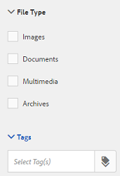

# Modelli per risorse {#asset-templates}

I modelli di risorse sono una classe speciale di risorse che facilita la ridefinizione rapida dei contenuti ricchi di immagini per i supporti digitali e di stampa. Un modello di risorsa include due parti: la sezione relativa ai messaggi fissi e la sezione modificabile.

La sezione per la messaggistica fissa può contenere contenuti proprietari, ad esempio il logo del marchio e informazioni sul copyright, che vengono disattivate per la modifica. La sezione modificabile può contenere contenuti visivi e testuali in campi che possono essere modificati per personalizzare la messaggistica.

La flessibilità di apportare modifiche limitate e al tempo stesso la sicurezza dei sistemi di digital signage rende i modelli delle risorse gli elementi di base ideali per un rapido adattamento dei contenuti e la loro distribuzione, in quanto artefatti di contenuti per varie funzioni. La ridefinizione dei contenuti consente di ridurre i costi di gestione dei canali digitali e di stampa e di fornire esperienze complete e coerenti su questi canali.

In qualità di addetto al marketing, puoi archiviare e gestire i modelli all’interno di AEM Assets e utilizzare un singolo modello di base per creare più esperienze di stampa personalizzate con facilità. Puoi creare diversi tipi di materiale collaterale di marketing, inclusi opuscoli, volantini, cartoline, biglietti da visita e così via, per trasmettere in modo lucido il messaggio di marketing ai clienti. È inoltre possibile assemblare uscite di stampa multipagina da uscite di stampa nuove o esistenti. Soprattutto, è possibile fornire simultaneamente esperienze digitali e di stampa con facilità, per offrire agli utenti un&#39;esperienza coerente e integrata.

Anche se i modelli di risorse sono per lo più file InDesign, la competenza in InDesign non ostacola la creazione di artefatti stellari. Non è necessario mappare i campi del modello InDesign con i campi di prodotto che altrimenti saranno necessari per la creazione dei cataloghi. È possibile modificare i modelli in modalità WYSIWYG direttamente nell’interfaccia web. Tuttavia, affinché InDesign possa elaborare le modifiche, è innanzitutto necessario configurare AEM Assets per l’integrazione con il server InDesign.

La possibilità di modificare i modelli di InDesign dall’interfaccia web aiuta a favorire una maggiore collaborazione tra il personale creativo e il personale di marketing, riducendo al contempo i tempi di commercializzazione per le iniziative di promozione locali.

Con i modelli di risorse puoi effettuare le seguenti operazioni:

* Modificare i campi del modello modificabili dall’interfaccia Web
* Controllare lo stile di base del testo, ad esempio le dimensioni del font, lo stile e il testo a livello di tag
* Modificare le immagini all’interno del modello utilizzando Selettore contenuto
* Anteprima delle modifiche apportate al modello
* Unire più file modello per creare un artefatto a più pagine

Quando scegli un modello per il tuo materiale collaterale, AEM Assets crea una copia del modello che puoi modificare. Il modello originale viene mantenuto, in modo che il digital signage rimanga intatto e possa essere riutilizzato per garantire la coerenza del marchio.

È possibile esportare il file aggiornato all’interno della cartella principale nei seguenti formati:

* INDD
* PDF
* JPG

È inoltre possibile scaricare l&#39;output in questi formati sul sistema locale.

## Creare un contratto di garanzia {#creating-a-collateral}

Considera uno scenario in cui desideri creare materiale collaterale stampabile digitale, come opuscoli, volantini e annunci per una prossima campagna e condividerlo con outlet store a livello globale. La creazione di materiale collaterale basato su un modello consente di offrire un&#39;esperienza cliente unificata su tutti i canali. I designer possono creare i modelli delle campagne (a pagina singola o a più pagine) utilizzando una soluzione creativa, ad esempio InDesign, e caricare i modelli in AEM Assets per te. Prima di creare una garanzia collaterale, fai caricare e rendere disponibili in Experience Manager uno o più modelli INDD.

1. Tocca o fai clic sul logo AEM, quindi tocca o fai clic su **[!UICONTROL Risorse]** nella pagina Navigazione.
1. Dalle opzioni, scegli **[!UICONTROL Modelli]**.

   

1. Tocca o fai clic su **[!UICONTROL Crea]**, quindi scegli dal menu il materiale collaterale da creare. Ad esempio, scegli **[!UICONTROL Brochure]**.

   

1. Avere uno o più modelli INDD caricati e disponibili in Experience Manager in anticipo. Scegli un modello per la tua brochure e tocca o fai clic su **[!UICONTROL Avanti]**.

   

1. Specifica un nome e una descrizione facoltativa per la brochure.

   

1. (Facoltativo) Tocca o fai clic sull’icona **[!UICONTROL Tag]** accanto al campo **[!UICONTROL Tag]** e seleziona uno o più tag per la brochure. Tocca o fai clic su **[!UICONTROL Conferma]** per confermare la selezione.

   

1. Fai clic su **[!UICONTROL Crea]**. Un dialogo conferma la creazione di una nuova brochure. Tocca o fai clic su **[!UICONTROL Apri]** per aprire la brochure in modalità di modifica.

   

   In alternativa, chiudi la finestra di dialogo e passa alla cartella nella pagina Modelli con cui hai iniziato per visualizzare la brochure creata. Il tipo di materiale collaterale viene visualizzato sulla sua miniatura nella vista a schede. Ad esempio, in questo caso, la Brochure viene visualizzata sulla miniatura.

   

## Modificare un contratto di garanzia {#editing-a-collateral}

È possibile modificare un materiale collaterale immediatamente dopo averlo creato. In alternativa, puoi aprirlo dalla pagina Modelli o dalla pagina della risorsa.

1. Per aprire il materiale collaterale per l&#39;editing, effettuare una delle seguenti operazioni:

   * Apri la garanzia (in questo caso la brochure) creata nel passaggio 7 di [Creazione di un collaterale](asset-templates.md#creating-a-collateral).
   * Dalla pagina Modelli, accedi alla cartella in cui hai creato il materiale collaterale e tocca o fai clic sull’azione rapida Modifica sulla miniatura di un materiale collaterale.
   * Nella pagina delle risorse per il materiale collaterale, tocca o fai clic sull’icona Modifica nella barra degli strumenti.
   * Seleziona il materiale collaterale e tocca o fai clic sull’icona Modifica nella barra degli strumenti.

   

   Il cercatore di risorse e l’editor di testo vengono visualizzati a sinistra della pagina. L’editor di testo è aperto per impostazione predefinita.

   È possibile utilizzare l’editor di testo per modificare il testo che si desidera visualizzare nel campo di testo. Puoi modificare le dimensioni, lo stile, il colore del font e il testo a livello di tag.

   Utilizzando il ricerca risorse, puoi sfogliare o cercare immagini in AEM Assets e sostituire le immagini modificabili nel modello con immagini di tua scelta.

   

   I modificabili vengono visualizzati a destra. Affinché un campo possa essere modificato in AEM Assets, i campi corrispondenti nel modello devono essere taggati in InDesign. In altre parole, devono essere rese modificabili in InDesign.

   

   >[!NOTE]
   >
   >Assicurati che l’istanza AEM sia integrata con un server InDesign per consentire ad AEM Assets di estrarre dati dal modello di InDesign e renderli disponibili per la modifica. Per informazioni dettagliate, consulta [Integrazione di AEM Assets con InDesign Server](indesign.md).

1. Per modificare il testo in un campo modificabile, tocca o fai clic sul campo di testo dall’elenco dei campi modificabili e modifica il testo nel campo.

   

   È possibile modificare le proprietà del testo, ad esempio lo stile del font, il colore e le dimensioni utilizzando le opzioni disponibili.

1. Tocca o fai clic sull’icona **[!UICONTROL Anteprima]** per visualizzare l’anteprima delle modifiche apportate al testo.

   

1. Per scambiare un’immagine, tocca o fai clic sull’icona **[!UICONTROL Asset Finder]** .

   

1. Seleziona il campo immagine dall’elenco dei campi modificabili, quindi trascina l’immagine desiderata dal selettore delle risorse al campo modificabile.

   

   Puoi anche cercare le immagini utilizzando parole chiave, tag e in base al loro stato di pubblicazione. Puoi sfogliare l’archivio AEM Assets e passare alla posizione dell’immagine desiderata.

   

1. Tocca o fai clic sull&#39;icona **[!UICONTROL Anteprima]** per visualizzare l&#39;anteprima dell&#39;immagine.

   

1. Per modificare una pagina specifica in un materiale collaterale multipagina, utilizza il navigatore pagina in basso.

   

1. Tocca o fai clic sull’icona **[!UICONTROL Anteprima]** sulla barra degli strumenti per visualizzare in anteprima tutte le modifiche. Tocca o fai clic su **[!UICONTROL Fine]** per salvare le modifiche apportate al materiale collaterale.

   >[!NOTE]
   >
   >Le icone Preview (Anteprima) e Done (Fine) sono abilitate solo quando i campi immagine modificabili all&#39;interno del materiale collaterale non contengono icone mancanti. Se le icone del tuo materiale collaterale mancano, è perché AEM non è in grado di risolvere le immagini nel modello di InDesign. Di solito, AEM non è in grado di risolvere le immagini nei seguenti casi:
   >
   >* Le immagini non vengono incorporate nel modello InDesign sottostante
   >* Le immagini sono collegate dal file system locale

   >
   >Per abilitare AEM risolvere le immagini, procedi come segue:
   >
   >* Incorpora le immagini durante la creazione di modelli di InDesign (consulta [Informazioni sui collegamenti e sugli elementi grafici incorporati](https://helpx.adobe.com/indesign/using/graphics-links.html)).
   >* AEM al file system locale, quindi mappa le icone mancanti con le risorse AEM esistenti.

   >
   >Per ulteriori informazioni sull&#39;utilizzo dei documenti InDesign, vedere [Procedure consigliate per l&#39;utilizzo dei documenti InDesign in AEM](https://helpx.adobe.com/experience-manager/kb/best-practices-idd-docs-aem.html).

1. Per generare un rendering PDF per la brochure, seleziona l’opzione Acrobat nella finestra di dialogo, quindi fai clic su **[!UICONTROL Continua]**.
1. Il materiale collaterale viene creato nella cartella con cui hai iniziato. Per visualizzare le rappresentazioni, apri le risorse e scegli **[!UICONTROL Rappresentazioni]** dall&#39;elenco di Navigazione globale.

   

1. Tocca o fai clic sul rendering PDF dall’elenco delle rappresentazioni per scaricare il file PDF. Apri il file PDF per esaminare il materiale collaterale.

   

## Unisci garanzia {#merge-collateral}

1. Tocca o fai clic su **[!UICONTROL Strumenti > Risorse]**.
1. Dalle opzioni, scegli **[!UICONTROL Modelli]**.
1. Tocca o fai clic su **[!UICONTROL Crea]** e scegli **[!UICONTROL Unisci]** dal menu.

   

1. Nella pagina Unione modelli , tocca o fai clic sull’icona Unisci .

   

1. Passa alla posizione del materiale collaterale da unire e tocca o fai clic sulle miniature del materiale collaterale da unire per selezionarle.

   

   Puoi anche cercare i modelli dalla casella OmniSearch.

   

   Puoi sfogliare l’archivio o le raccolte AEM Assets, passare alla posizione dei modelli desiderati, quindi selezionarli per l’unione.

   

   Puoi applicare vari filtri per cercare i modelli desiderati. Ad esempio, è possibile cercare modelli in base al tipo di file o ai tag.

   

1. Tocca o fai clic su **[!UICONTROL Avanti]** nella barra degli strumenti.
1. Nella schermata **[!UICONTROL Anteprima e riordino]**, ridisponi i modelli, se necessario, e visualizza in anteprima la selezione dei modelli da unire. Quindi, tocca o fai clic su **[!UICONTROL Avanti]** nella barra degli strumenti.

   

1. Nella schermata Configura modello, specifica un nome per il materiale collaterale. Facoltativamente, specifica i tag che ritieni appropriati. Se si desidera esportare l&#39;output in formato PDF, selezionare l&#39;opzione **[!UICONTROL Acrobat (.PDF)]**. Per impostazione predefinita, il materiale collaterale viene esportato in formato JPG e InDesign. Per modificare la miniatura di visualizzazione del materiale collaterale multipagina, tocca o fai clic su **[!UICONTROL Cambia miniatura]**.

   

1. Tocca o fai clic su **[!UICONTROL Salva]**, quindi tocca o fai clic su **[!UICONTROL OK]** nella finestra di dialogo per chiudere la finestra di dialogo. Il materiale collaterale multipagina viene creato nella cartella con cui hai iniziato.

   >[!NOTE]
   >
   >Non è possibile modificare un materiale collaterale unito in un secondo momento o utilizzarlo per creare altro materiale collaterale.
