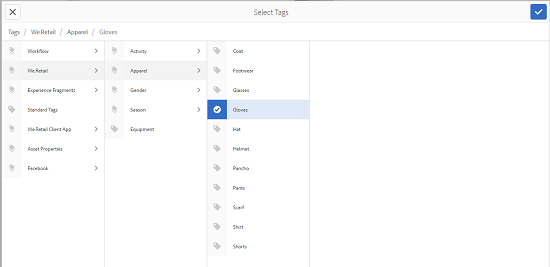
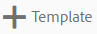

# Modelli per risorse {#asset-templates}

I modelli di risorse sono una classe speciale di risorse che semplificano la ridefinizione rapida dei contenuti visivamente avanzati per i supporti digitali e di stampa. Un modello di risorsa include due parti: la sezione relativa ai messaggi fissi e la sezione modificabile.

La sezione relativa ai messaggi fissi può contenere contenuti proprietari, ad esempio il logo del marchio e le informazioni sul copyright, che sono disattivati per la modifica. La sezione modificabile può contenere contenuti visivi e testuali in campi che possono essere modificati per personalizzare i messaggi.

Grazie alla flessibilità di apportare modifiche limitate e al contempo alla protezione dei segnali globali, i modelli di risorse sono gli elementi base ideali per l’adattamento e la distribuzione rapida dei contenuti come artefatti di varie funzioni. La ridefinizione dei contenuti consente di ridurre i costi per la gestione dei canali digitali e per la stampa e di offrire esperienze complete e coerenti su questi canali.

Gli esperti di marketing possono archiviare e gestire i modelli all&#39;interno  AEM Assets e utilizzare un singolo modello di base per creare più esperienze di stampa personalizzate con facilità. Puoi creare diversi tipi di materiale collaterale di marketing, inclusi brochure, volantini, cartoline, biglietti da visita e così via, per trasmettere in modo chiaro il messaggio di marketing ai clienti. È inoltre possibile assemblare output di stampa di più pagine da uscite di stampa esistenti o nuove. Soprattutto, è possibile distribuire simultaneamente esperienze digitali e di stampa con facilità, offrendo agli utenti un&#39;esperienza coerente e integrata.

Anche se i modelli di risorse sono per lo più file  InDesign, l’esperienza  InDesign non è un ostacolo alla creazione di artefatti stellari. Non è necessario mappare i campi del modello di InDesign  con i campi di prodotto che altrimenti sarebbero necessari per la creazione di cataloghi. Potete modificare i modelli in modalità WYSIWYG direttamente sull&#39;interfaccia Web. Tuttavia, affinché  InDesign possa elaborare le modifiche, è innanzitutto necessario configurare  AEM Assets per l’integrazione con  server InDesign.

La possibilità di modificare  modelli InDesign dall&#39;interfaccia Web favorisce una maggiore collaborazione tra il personale Creative e Marketing, riducendo al contempo il tempo necessario per immettere sul mercato le iniziative di promozione locali.

Con i modelli di risorse potete effettuare le seguenti operazioni:

* Modificare i campi dei modelli modificabili dall&#39;interfaccia Web
* Controllare lo stile di base del testo, ad esempio dimensione del font, stile e tipo a livello di tag
* Modificare le immagini all’interno del modello utilizzando il selettore dei contenuti
* Anteprima delle modifiche apportate al modello
* Unire più file modello per creare un artefatto con più pagine

Quando scegli un modello per la tua offerta,  AEM Assets crea una copia del modello che puoi modificare. Il modello originale viene mantenuto, in modo da garantire che il digital signage rimanga intatto e possa essere riutilizzato per garantire la coerenza del marchio.

Potete esportare il file aggiornato all’interno della cartella principale nei seguenti formati:

* INDD
* PDF
* JPG

È inoltre possibile scaricare l&#39;output in questi formati nel sistema locale.

## Creare una garanzia {#creating-a-collateral}

Considerate uno scenario in cui desiderate creare materiale collaterale stampabile digitale, come brochure, volantini e annunci pubblicitari per una campagna imminente e condividetelo con gli outlet store a livello globale. La creazione di materiale collaterale basato su un modello consente di offrire un&#39;esperienza cliente unificata tra i canali. I progettisti possono creare i modelli delle campagne (pagina singola o pagina multipla) utilizzando una soluzione creativa, come  InDesign, e caricare i modelli  AEM Assets per voi. Prima di creare una garanzia collaterale, è necessario caricare e rendere disponibili in  Experience Manager uno o più modelli INDD.

1. Tocca o fai clic sul logo AEM, quindi tocca o fai clic su **[!UICONTROL Risorse]** nella pagina di navigazione.
1. Tra le opzioni, scegliete **[!UICONTROL Modelli]**.

   

1. Tocca o fai clic su **[!UICONTROL Crea]**, quindi dal menu scegli il materiale collaterale da creare. Ad esempio, scegliete **[!UICONTROL Brochure]**.

   

1. Accertatevi che uno o più modelli INDD siano caricati e disponibili in  Experience Manager in anticipo. Scegliete un modello per la brochure e toccate o fate clic su **[!UICONTROL Avanti]**.

   

1. Specificate un nome e una descrizione facoltativa per la brochure.

   

1. (Facoltativo) Tocca o fai clic sull’icona **[!UICONTROL Tag]** accanto al campo **[!UICONTROL Tag]** e seleziona uno o più tag per la brochure. Tocca o fai clic su **[!UICONTROL Conferma]** per confermare la selezione.

   

1. Fai clic su **[!UICONTROL Crea]**. Una finestra di dialogo conferma la creazione di una nuova brochure. Tocca o fai clic su **[!UICONTROL Apri]** per aprire la brochure in modalità di modifica.

   

   In alternativa, chiudete la finestra di dialogo e individuate la cartella nella pagina Modelli con cui avete iniziato a visualizzare la brochure creata. Il tipo di materiale collaterale viene visualizzato sulla relativa miniatura nella vista a schede. Ad esempio, in questo caso, la brochure viene visualizzata sulla miniatura.

   

## Modificare una garanzia {#editing-a-collateral}

È possibile modificare un materiale collaterale immediatamente dopo averlo creato. In alternativa, potete aprirlo dalla pagina Modelli o dalla pagina della risorsa.

1. Per aprire il materiale collaterale per la modifica, effettuate una delle seguenti operazioni:

   * Aprire la documentazione (in questo caso la brochure) creata nel passaggio 7 di [Creazione di una garanzia](asset-templates.md#creating-a-collateral).
   * Dalla pagina Modelli, andate a una cartella in cui avete creato il materiale collaterale e toccate o fate clic sull&#39;azione rapida Modifica sulla miniatura di un materiale collaterale.
   * Nella pagina della risorsa per il materiale collaterale, tocca o fai clic sull’icona Modifica dalla barra degli strumenti.
   * Selezionate le risorse, quindi toccate o fate clic sull’icona Modifica dalla barra degli strumenti.

   

   A sinistra della pagina vengono visualizzati il cercatore di risorse e l’editor di testo. L&#39;editor di testo è aperto per impostazione predefinita.

   È possibile utilizzare l&#39;editor di testo per modificare il testo che si desidera visualizzare nel campo di testo. Potete modificare la dimensione del font, lo stile, il colore e il tipo a livello di tag.

   Utilizzando lo strumento di ricerca delle risorse, potete cercare o individuare le immagini in  AEM Assets e sostituire le immagini modificabili nel modello con immagini di vostra scelta.

   

   I modificabili sono visualizzati a destra. Affinché un campo possa essere modificato in  AEM Assets, è necessario che il campo corrispondente nel modello sia contrassegnato  InDesign. In altre parole, devono essere resi modificabili in  InDesign.

   

   >[!NOTE]
   >
   >Assicuratevi che l’istanza AEM sia integrata con un server di InDesign  per consentire  AEM Assets di estrarre i dati dal modello di InDesign  e renderlo disponibile per la modifica. Per informazioni dettagliate, consultate [Integrazione  AEM Assets con  InDesign Server](indesign.md).

1. Per modificare il testo in un campo modificabile, toccate o fate clic sul campo di testo nell’elenco dei campi modificabili e modificate il testo nel campo.

   

   È possibile modificare le proprietà del testo, ad esempio lo stile del font, il colore e le dimensioni utilizzando le opzioni disponibili.

1. Toccate o fate clic sull’icona **[!UICONTROL Anteprima]** per visualizzare l’anteprima delle modifiche di testo.

   

1. Per sostituire un’immagine, toccate o fate clic sull’icona di **[!UICONTROL Asset Finder]** .

   

1. Selezionate il campo immagine dall’elenco dei campi modificabili, quindi trascinate l’immagine desiderata dal selettore delle risorse al campo modificabile.

   

   Potete anche cercare le immagini usando parole chiave, tag e in base al loro stato di pubblicazione. Potete sfogliare l’archivio di AEM Assets  e individuare la posizione dell’immagine desiderata.

   

1. Tocca o fai clic sull’icona **[!UICONTROL Anteprima]** per visualizzare l’immagine in anteprima.

   

1. Per modificare una pagina specifica in un materiale collaterale composto da più pagine, utilizzate il navigatore pagina nella parte inferiore.

   

1. Tocca o fai clic sull’icona **[!UICONTROL Anteprima]** sulla barra degli strumenti per visualizzare in anteprima tutte le modifiche. Tocca o fai clic su **[!UICONTROL Fine]** per salvare le modifiche apportate al materiale collaterale.

   >[!NOTE]
   >
   >Le icone Anteprima e Fine sono abilitate solo quando i campi immagine modificabili all’interno della risorsa collaterale non presentano icone mancanti. Se vi sono icone mancanti nella risorsa collaterale, è perché AEM non è in grado di risolvere le immagini nel modello di InDesign . In genere, AEM non è in grado di risolvere le immagini nei seguenti casi:
   >
   >* Le immagini non vengono incorporate nel modello di InDesign  sottostante
   >* Le immagini sono collegate dal file system locale

   >
   >Per AEM la risoluzione delle immagini, effettuate le seguenti operazioni:
   >
   >* Incorporare le immagini durante la creazione di modelli di InDesign  (consultate [I collegamenti e gli elementi grafici](https://helpx.adobe.com/indesign/using/graphics-links.html)incorporati).
   >* AEM al file system locale, quindi mappate le icone mancanti con le risorse AEM esistenti.

   >
   >Per ulteriori informazioni sull&#39;uso  documenti InDesign, vedere [Best practice per l&#39;utilizzo  documenti InDesign in AEM](https://helpx.adobe.com/experience-manager/kb/best-practices-idd-docs-aem.html).

1. Per generare una rappresentazione PDF per la brochure, selezionate l’opzione  Acrobat nella finestra di dialogo, quindi fate clic su **[!UICONTROL Continua]**.
1. Il materiale collaterale viene creato nella cartella con cui avete iniziato. Per visualizzare i rendering, aprite il materiale collaterale e scegliete **[!UICONTROL Rendering]** dall’elenco di navigazione globale.

   

1. Tocca o fai clic sulla rappresentazione PDF dall’elenco delle rappresentazioni per scaricare il file PDF. Aprire il file PDF per esaminare le risorse.

   

## Unisci garanzia {#merge-collateral}

1. Tocca o fai clic su **[!UICONTROL Strumenti > Risorse]**.
1. Tra le opzioni, scegliete **[!UICONTROL Modelli]**.
1. Toccate o fate clic su **[!UICONTROL Crea]** e scegliete **[!UICONTROL Unisci]** dal menu.

   

1. Nella pagina Unione modelli, tocca o fai clic sull&#39;icona Unisci.

   

1. Passate alla posizione del materiale collaterale da unire e toccate le miniature del materiale collaterale da unire per selezionarlo.

   

   Potete anche cercare i modelli dalla casella di ricerca Omni.

   

   Potete sfogliare l&#39;archivio di AEM Assets  o le raccolte, individuare la posizione dei modelli desiderati e selezionarli per l&#39;unione.

   

   Potete applicare vari filtri per cercare nei modelli desiderati. Ad esempio, potete cercare i modelli in base al tipo di file o ai tag.

   

1. Tocca o fai clic su **[!UICONTROL Avanti]** dalla barra degli strumenti.
1. Nella schermata **[!UICONTROL Anteprima e riordina]** , se necessario ridisponete i modelli e visualizzate l’anteprima della selezione di modelli da unire. Quindi, fate clic o toccate **[!UICONTROL Avanti]** dalla barra degli strumenti.

   

1. Nella schermata Configura modello, specificate un nome per il materiale collaterale. Facoltativamente, potete specificare i tag desiderati. Se si desidera esportare l&#39;output in formato PDF, selezionare l&#39;opzione **[!UICONTROL Acrobat (.PDF)]** . Per impostazione predefinita, il materiale collaterale viene esportato in formato JPG e  InDesign. Per modificare la miniatura di visualizzazione per le risorse a più pagine collaterali, toccate o fate clic su **[!UICONTROL Cambia miniatura]**.

   

1. Click/tap **[!UICONTROL Save]** and then click/tap **[!UICONTROL OK]** in the dialog to close the dialog. Il materiale collaterale multipagina viene creato nella cartella con cui avete iniziato.

   >[!NOTE]
   >
   >Non è possibile modificare un materiale collaterale unito in un secondo momento o utilizzarlo per creare altre risorse.

