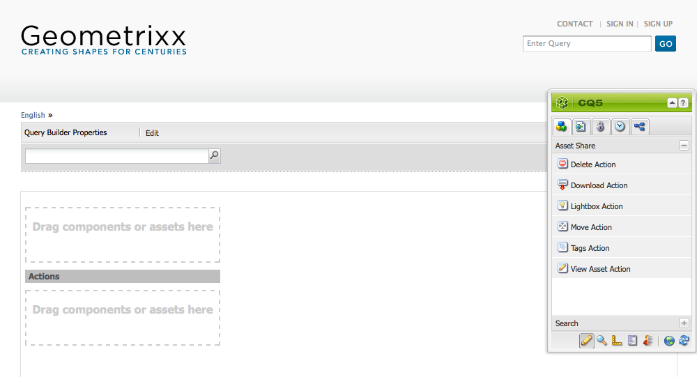
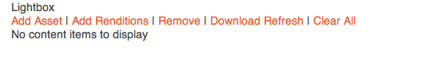
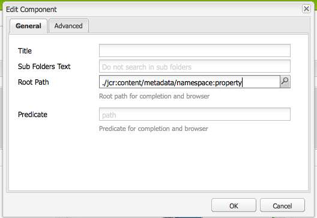
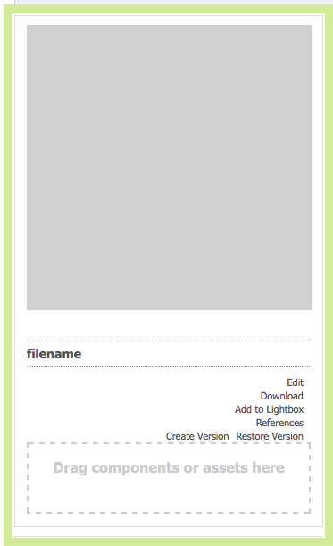

# Creare e configurare le pagine dell’Editor risorse {#creating-and-configuring-asset-editor-pages}

>[!CAUTION]
>
>AEM 6.4 ha raggiunto la fine del supporto esteso e questa documentazione non viene più aggiornata. Per maggiori dettagli, consulta la nostra [periodi di assistenza tecnica](https://helpx.adobe.com/it/support/programs/eol-matrix.html). Trova le versioni supportate [qui](https://experienceleague.adobe.com/docs/).

Questo documento descrive quanto segue:

* Perché creare pagine Asset Editor personalizzate.
* Creazione e personalizzazione di pagine Asset Editor , ovvero pagine WCM che consentono di visualizzare e modificare i metadati ed eseguire azioni sulla risorsa.
* Come modificare più risorse contemporaneamente.

>[!NOTE]
>
>Condivisione risorse è disponibile come implementazione di riferimento open source. Vedi [Asset Share Commons](https://adobe-marketing-cloud.github.io/asset-share-commons/) . Non è ufficialmente supportato.

## Perché creare e configurare le pagine dell’Editor risorse? {#why-create-and-configure-asset-editor-pages}

La gestione delle risorse digitali viene utilizzata in sempre più scenari. Quando si passa da una soluzione su piccola scala per un piccolo gruppo di utenti con una formazione professionale, ad esempio fotografi o tassonomisti, a gruppi di utenti più grandi e diversificati, ad esempio utenti aziendali, autori WCM, giornalisti e così via, la potente interfaccia utente di [!DNL Adobe Experience Manager Assets] gli utenti professionali possono fornire troppe informazioni e le parti interessate iniziano a richiedere specifiche interfacce utente o applicazioni per accedere alle risorse digitali rilevanti per loro.

Queste applicazioni incentrate sulle risorse possono essere semplici gallerie fotografiche in una Intranet dove i dipendenti possono caricare foto da visite a fiere commerciali o da un centro stampa in un sito web rivolto al pubblico, come l&#39;esempio fornito con Geometrixx. Le applicazioni incentrate sulle risorse possono anche estendersi a soluzioni complete, inclusi carrelli, checkout e processi di verifica.

La creazione di un’applicazione incentrata sulle risorse diventa in larga misura un processo di configurazione che non richiede la codifica, che include solo la conoscenza dei gruppi di utenti e delle loro esigenze, nonché la conoscenza dei metadati utilizzati. Applicazioni incentrate sulle risorse create con [!DNL Assets] sono estensibili: con un lavoro di codifica moderato è possibile creare componenti riutilizzabili per la ricerca, la visualizzazione e la modifica delle risorse.

Applicazione incentrata sulle risorse in [!DNL Experience Manager] è costituito da una pagina Asset Editor che può essere utilizzata per ottenere una visualizzazione dettagliata di una risorsa specifica. Una pagina Asset Editor consente anche di modificare i metadati, purché l’utente che accede alla risorsa disponga delle autorizzazioni necessarie.

## Creare e configurare una pagina Condivisione risorse {#creating-and-configuring-an-asset-share-page}

È possibile personalizzare la funzionalità del Finder di DAM e creare pagine con tutte le funzionalità necessarie, denominate pagine di Condivisione risorse. Per creare una nuova pagina Condivisione risorse, è necessario aggiungere la pagina utilizzando il modello Condivisione risorse di Geometrixx , quindi personalizzare le azioni eseguibili dagli utenti in quella pagina, determinare in che modo i visualizzatori visualizzano le risorse e decidere in che modo gli utenti possono creare le query.

Di seguito sono riportati alcuni casi d’uso per la creazione di una pagina Condivisione risorse personalizzata:

* Centro Stampa per i giornalisti
* Motore di ricerca immagini per utenti aziendali interni
* Database delle immagini per gli utenti del sito web
* Interfaccia per l’assegnazione tag ai file multimediali per gli editor di metadati

### Creare una pagina Condivisione risorse {#creating-an-asset-share-page}

Per creare una nuova pagina Condivisione risorse, puoi crearla quando lavori su siti web o da Gestione risorse digitali.

>[!NOTE]
>
>Per impostazione predefinita, quando crei una pagina Condivisione risorse da **Nuovo** nel manager delle risorse digitali, vengono creati automaticamente un visualizzatore di risorse e un editor risorse.

Per creare una nuova pagina Condivisione risorse nel **Siti Web** console:

1. In **[!UICONTROL Siti Web]** , accedi al punto in cui desideri creare una pagina di condivisione risorse e fai clic su **[!UICONTROL Nuovo]**.

1. Seleziona la **[!UICONTROL Condivisione risorse]** e fai clic su **[!UICONTROL Crea]**. La nuova pagina viene creata e la pagina di condivisione delle risorse è elencata nella **[!UICONTROL Siti Web]** scheda .

La pagina di base creata utilizzando il modello Condivisione risorse DAM di Geometrixx si presenta come segue:

Per personalizzare la pagina Condivisione risorse, puoi utilizzare gli elementi della barra laterale e modificare le proprietà del generatore di query. La pagina **[!UICONTROL Geometrixx Press Centre]** è una versione personalizzata di una pagina basata su questo modello:

Per creare una nuova pagina di condivisione risorse tramite Gestione risorse digitali:

1. Nel gestore di risorse digitali, in **[!UICONTROL Nuovo]**, seleziona **[!UICONTROL Nuova condivisione risorse]**.
1. In **[!UICONTROL Titolo]**, immetti il nome della pagina di condivisione risorse. Se lo desideri, immetti un nome per l’URL.

   

1. Fai doppio clic sulla pagina di condivisione delle risorse per aprirla e configurarla.

   

   Per impostazione predefinita, quando crei una pagina Condivisione risorse da **[!UICONTROL Nuovo]**, vengono creati automaticamente un visualizzatore risorse e un editor risorse .

#### Personalizzare le azioni {#customizing-actions}

È possibile determinare le azioni che gli utenti possono eseguire sulle risorse digitali selezionate in base a una selezione di azioni predefinite.

Per aggiungere azioni alla pagina Condivisione risorse:

1. Nella pagina Condivisione risorse da personalizzare, fai clic su **[!UICONTROL Azioni]** nella barra laterale.

   Sono disponibili le seguenti azioni:
   

| Azione | Descrizione |
|---|---|
| [!UICONTROL Azione elimina] | Gli utenti possono eliminare le risorse selezionate. |
| [!UICONTROL Azione di download] | Consente agli utenti di scaricare le risorse selezionate sui propri computer. |
| [!UICONTROL Azione Lightbox] | Salva le risorse in una &quot;Lightbox&quot; in cui puoi eseguire altre azioni. Questa funzione è utile quando si lavora con risorse su più pagine. La Lightbox può essere utilizzata anche come carrello per le risorse. |
| [!UICONTROL Azione spostamento] | Gli utenti possono spostare la risorsa in un’altra posizione |
| [!UICONTROL Azione tag] | Consente agli utenti di aggiungere tag alle risorse selezionate |
| [!UICONTROL Azione visualizza risorsa] | Apre la risorsa nell’editor Risorse per la manipolazione degli utenti. |

1. Trascina l’azione appropriata nella **Azioni** nella pagina. In questo modo viene creato un pulsante utilizzato per eseguire l’azione.

   

#### Determinare la modalità di presentazione dei risultati di ricerca {#determining-how-search-results-are-presented}

È possibile determinare il modo in cui i risultati vengono visualizzati da un elenco predefinito di obiettivi.

Per modificare la modalità di visualizzazione dei risultati della ricerca:

1. Nella pagina Condivisione risorse da personalizzare, fai clic su **[!UICONTROL Ricerca]**.

   

1. Trascinare l&#39;obiettivo appropriato al centro superiore della pagina. Nel Press Center le ottiche sono già disponibili. Premere l&#39;icona dell&#39;obiettivo appropriata per visualizzare i risultati della ricerca come desiderato.

Sono disponibili le seguenti ottiche:

| Obiettivo | Descrizione |
|---|---|
| **[!UICONTROL Vista elenco]** | Presenta le risorse in modo elenco con i relativi dettagli. |
| **[!UICONTROL Vista mosaico]** | Presenta le risorse in modo mosaico. |

#### Vista mosaico {#mosaic-lens}

#### Vista elenco {#list-lens}

#### Personalizzare Query Builder {#customizing-the-query-builder}

Il generatore di query consente di immettere i termini di ricerca e creare contenuti per la pagina Condivisione risorse. Quando modifichi il generatore di query, puoi anche determinare quanti risultati di ricerca vengono visualizzati per pagina, quale editor di risorse viene aperto quando fai doppio clic su una risorsa, il percorso ricercato dalla query e personalizza i tipi di nodo.

Per personalizzare il generatore di query:

1. Nella pagina Condivisione risorse da personalizzare, fai clic su **[!UICONTROL Modifica]** in Query Builder. Per impostazione predefinita, la **[!UICONTROL Generale]** viene visualizzata la scheda .

1. Seleziona il numero di risultati per pagina, il percorso dell’editor risorse (se disponi di un editor risorse personalizzato) e il titolo Azioni.

   

1. Fai clic sul pulsante **[!UICONTROL Percorsi]** scheda . Immettere uno o più percorsi che verranno eseguiti dalla ricerca. Questi percorsi vengono sovrascritti se l’utente utilizza il predicato Percorsi .

   

1. Immetti un altro tipo di nodo, se desiderato.

1. In **[!UICONTROL URL di Query Builder]** è possibile sovrascrivere o avvolgere il generatore di query e inserire i nuovi URL del servlet con il componente Query Builder esistente. In **[!UICONTROL URL feed]** Puoi anche sovrascrivere l’URL feed.

   

1. In **[!UICONTROL Testo]** immettere il testo che si desidera visualizzare per i risultati e i numeri di pagina dei risultati. Fai clic su **[!UICONTROL OK]** una volta completate le modifiche.

   

#### Aggiungi predicati {#adding-predicates}

[!DNL Experience Manager Assets] include una serie di predicati che è possibile aggiungere alla pagina Condivisione risorse. Questi consentono agli utenti di limitare ulteriormente le ricerche. In alcuni casi, possono sovrascrivere un parametro del generatore di query (ad esempio, il parametro Path).

Per aggiungere predicati:

1. Nella pagina Condivisione risorse da personalizzare, fai clic su **[!UICONTROL Ricerca]**.

   

1. Trascina i predicati appropriati nella pagina Condivisione risorse sotto il generatore di query. In questo modo vengono creati i campi appropriati.

   

   Sono disponibili i seguenti predicati:

| Predicato | Descrizione |
|---|---|
| **[!UICONTROL Predicato data]** | Consente agli utenti di cercare le risorse modificate prima e dopo determinate date. |
| **[!UICONTROL Predicato opzioni]** | Il proprietario del sito può specificare una proprietà da cercare (come nel predicato proprietà, ad esempio cq:tags) e una struttura di contenuto per popolare le opzioni da (ad esempio la struttura tag). In questo modo si genera un elenco di opzioni in cui gli utenti possono selezionare i valori (tag) che la proprietà selezionata (proprietà tag) deve avere. Questo predicato consente di creare controlli elenco come l’elenco di tag, tipi di file, orientamenti immagine e così via. È ideale per un set fisso di opzioni. |
| **[!UICONTROL Predicato percorso]** | Consente agli utenti di definire il percorso e le sottocartelle, se necessario. |
| **[!UICONTROL Predicato proprietà]** | Il proprietario del sito specifica una proprietà da cercare, ad esempio tiff:ImageLength e l&#39;utente può quindi immettere un valore, ad esempio 800. Questo restituisce tutte le immagini con un&#39;altezza di 800 pixel. predicato utile se la proprietà può avere valori arbitrari. |

Per ulteriori informazioni, consulta la sezione [predicare javadocs](https://helpx.adobe.com/experience-manager/6-4/sites/developing/using/reference-materials/javadoc/com/day/cq/search/eval/package-summary.html).

1. Per configurare ulteriormente il predicato, fai doppio clic su di esso. Ad esempio, quando apri il predicato Percorso, devi assegnare il percorso principale.

   

## Creare e configurare una pagina Asset Editor {#creating-and-configuring-an-asset-editor-page}

Puoi personalizzare l’editor delle risorse per determinare come gli utenti possono visualizzare e modificare le risorse digitali. A questo scopo, crea una nuova pagina Asset Editor e personalizza le visualizzazioni e le azioni che gli utenti possono eseguire su tale pagina.

>[!NOTE]
>
>Se desideri aggiungere campi personalizzati all’editor risorse DAM, aggiungi nuovi nodi cq:Widget a `/apps/dam/content/asseteditors.`

### Creare la pagina Editor risorse {#creating-the-asset-editor-page}

Durante la creazione della pagina Editor risorse, è buona norma creare la pagina direttamente sotto la pagina Condivisione risorse.

Per creare una pagina Editor risorse:

1. In **[!UICONTROL Siti Web]** , passa al punto in cui desideri creare una pagina dell’editor risorse e fai clic su **[!UICONTROL Nuovo]**.

1. Seleziona **[!UICONTROL Editor risorse di Geometrixx]** e fai clic su **[!UICONTROL Crea]**. La nuova pagina viene creata e la pagina viene elencata nel **[!UICONTROL Siti Web]** scheda .

La pagina di base creata utilizzando il modello Editor risorse di Geometrixx si presenta così:

Per personalizzare la pagina Editor risorse, utilizza gli elementi della barra laterale. La pagina Editor risorse a cui si accede dal **[!UICONTROL Geometrixx Press Centre]** è una versione personalizzata di una pagina basata su questo modello:

#### Impostare quale Editor risorse apre da una pagina Condivisione risorse {#setting-which-asset-editor-opens-from-an-asset-share-page}

Dopo aver creato la pagina Asset Editor personalizzata, è necessario assicurarsi che quando si fa doppio clic sulle risorse, la Condivisione risorse personalizzata creata apra le risorse nella pagina Editor personalizzata.

Per impostare la pagina Editor risorse:

1. Nella pagina Condivisione risorse, fai clic su **[!UICONTROL Modifica]** accanto a Query Builder.

   

1. Fai clic sul pulsante **[!UICONTROL Generale]** se non è già selezionata.

1. In **[!UICONTROL Percorso di Asset Editor]** , immetti il percorso dell’editor risorse in cui desideri aprire le risorse nella pagina Condivisione risorse e fai clic su **[!UICONTROL OK]**.

   

#### Aggiungere componenti dell’Editor risorse {#adding-asset-editor-components}

Puoi determinare le funzionalità di un editor risorse aggiungendo componenti alla pagina.

Per aggiungere componenti dell’editor risorse:

1. Nella pagina Editor risorse da personalizzare, seleziona **[!UICONTROL Editor risorse]** nella barra laterale. Vengono visualizzati tutti i componenti dell’editor risorse disponibili.

   >[!NOTE]
   >
   >Ciò che è possibile personalizzare dipende dai componenti disponibili. Per abilitare i componenti, passa alla modalità Progettazione e seleziona i componenti necessari.

1. Trascina i componenti dalla barra laterale all’editor risorse e apporta eventuali modifiche nelle finestre di dialogo dei componenti. I componenti sono descritti nella tabella seguente e descritti nelle istruzioni dettagliate che seguono.

   >[!NOTE]
   >
   >Durante la progettazione della pagina dell’editor risorse, puoi creare componenti che sono di sola lettura o modificabili. Gli utenti sanno che è possibile modificare un campo se nel componente è presente un’immagine di una matita. Per impostazione predefinita, la maggior parte dei componenti è impostata come di sola lettura.

   | Componente | Descrizione |
   |---|---|
   | **[!UICONTROL Modulo metadati] e [!UICONTROL Campo di testo metadati]** | Consente di aggiungere metadati aggiuntivi a una risorsa ed eseguire un’azione, ad esempio l’invio, sulla risorsa. |
   | **[!UICONTROL Risorse secondarie]** | Consente di personalizzare le risorse secondarie. |
   | **Tag** | Consente agli utenti di selezionare e aggiungere tag a una risorsa. |
   | **[!UICONTROL Miniatura]** | Mostra una miniatura della risorsa, il suo nome file e consente di aggiungere un testo alternativo. Puoi aggiungere anche le azioni dell’editor risorse qui. |
   | **[!UICONTROL Titolo]** | Visualizza il titolo della risorsa, che può essere personalizzato. |

   

#### Modulo metadati e campo di testo - Configurazione del componente Visualizza metadati {#metadata-form-and-text-field-configuring-the-view-metadata-component}

Il modulo metadati è un modulo che include un’azione iniziale e finale. Nel mezzo, immetti **[!UICONTROL Testo]** campi. Vedi [Forms](../sites-authoring/default-components.md) per ulteriori informazioni sull’utilizzo dei moduli.

1. Crea un’azione iniziale facendo clic su **[!UICONTROL Modifica]** nell’area Inizio del modulo. Se necessario, è possibile immettere un titolo Casella. Per impostazione predefinita, il titolo Casella è **[!UICONTROL Metadati]**. Selezionare la casella di controllo Convalida client se si desidera generare il codice client java-script per la convalida.

   

1. Crea un&#39;azione Fine facendo clic su **[!UICONTROL Modifica]** nell’area Fine del modulo. Ad esempio, puoi creare un **[!UICONTROL Invia]** per consentire agli utenti di inviare le modifiche ai metadati. Facoltativamente, puoi aggiungere un **[!UICONTROL Reimposta]** che ripristina lo stato originale dei metadati.

   

1. Tra **[!UICONTROL Inizio modulo]** e **Fine modulo**, trascinare i campi di testo metadati sul modulo. Gli utenti compilano i metadati in questi campi di testo, sui quali possono inviare o completare un’altra azione.

1. Fare doppio clic sul nome del campo, ad esempio **Titolo** per aprire il campo metadati e apportare modifiche. In **[!UICONTROL Generale]** della scheda [!UICONTROL Modifica componente] finestra, è possibile definire lo spazio dei nomi e l’etichetta del campo, nonché il tipo, ad esempio, `dc:title`.

   

   Vedi [Personalizzazione ed estensione [!DNL Assets]](extending-assets.md) per informazioni sulla modifica dei namespace disponibili nel modulo metadati.

1. Fai clic sul pulsante **[!UICONTROL Vincoli]** scheda . Qui è possibile selezionare se un campo è obbligatorio e, se necessario, aggiungere eventuali vincoli.

   

1. Fai clic sul pulsante **[!UICONTROL Visualizzazione]** scheda . In questo caso, puoi immettere una nuova larghezza e un nuovo numero di righe per il campo metadati. Seleziona la **Campo di sola lettura** per consentire agli utenti di modificare i metadati.

   

   Esempio di modulo metadati con vari campi:

   

Nella pagina Asset Editor , gli utenti possono quindi immettere i valori nei campi di metadati (se modificabili) ed eseguire l’azione finale (ad esempio, l’invio delle modifiche).

#### Risorse secondarie {#sub-assets}

Il componente Risorse secondarie permette di visualizzare e selezionare le risorse secondarie. È possibile determinare quali nomi vengono visualizzati sotto la [risorsa principale](assets.md#what-are-digital-assets) e risorse secondarie.

Fai doppio clic sul componente Risorse secondarie per aprire la finestra di dialogo delle risorse secondarie, in cui puoi modificare i titoli della risorsa principale e di tutte le risorse secondarie. I valori predefiniti vengono visualizzati sotto il campo corrispondente.

Di seguito è riportato un esempio di un componente Sub Assets popolato:

Ad esempio, se selezioni una risorsa secondaria, tieni presente che il componente visualizza la pagina appropriata e che il titolo della casella cambia da Risorse secondarie a Limitazioni.

#### Tag {#tags}

Il componente Tag è un componente che consente agli utenti di assegnare tag esistenti a una risorsa, in modo da facilitarne l’organizzazione e il recupero in un secondo momento. Puoi rendere il componente di sola lettura, in modo che gli utenti non possano aggiungere tag, ma solo visualizzarli.

Fai doppio clic sul componente Tag per aprire la finestra di dialogo dei tag in cui puoi modificare il titolo da Tag, se desiderato, e in cui puoi selezionare i namespace allocati. Per rendere modificabile questo campo, cancella la **Nascondi modifica** casella di controllo pulsante. Per impostazione predefinita, i tag sono modificabili.

Se gli utenti possono modificare i tag, possono fare clic sulla matita per aggiungere tag selezionandoli dal menu a discesa Tag .

Di seguito è riportato un componente Tag compilato:

#### Miniatura  {#thumbnail}

Il componente Miniatura è il punto in cui la risorsa visualizza la miniatura selezionata (per molti dei formati in cui la miniatura viene estratta automaticamente). Inoltre, il componente visualizza il nome del file e [azioni modificabili](assets-finder-editor.md#adding-asset-editor-actions).

Fai doppio clic sul componente miniatura per aprire la finestra di dialogo miniatura in cui puoi modificare il testo alt. Per impostazione predefinita, il testo alternativo della miniatura è impostato su **[!UICONTROL Fai clic per scaricare]** risorsa.

Esempio di un componente Miniatura popolato:

#### Titolo {#title}

Il componente Titolo visualizza il titolo della risorsa e una descrizione.

Per impostazione predefinita è in modalità di sola lettura e gli utenti non possono modificarla. Per renderlo modificabile, fai doppio clic sul componente e cancella il **Pulsante Nascondi modifica** casella di controllo. Inoltre, immetti un titolo per più risorse.

Se è possibile modificare il Titolo, è possibile aggiungere un titolo e una descrizione facendo clic sulla matita per aprire la **Proprietà risorsa** finestra. Inoltre, puoi attivare e disattivare la risorsa selezionando la data e l’ora.

Quando gli utenti modificano il titolo facendo clic sull’icona a forma di matita, possono modificare il **Titolo**, **Descrizione** e immetti **On** e **Tempi di disattivazione** per attivare e disattivare la risorsa.

Di seguito è riportato un esempio di componente Titolo popolato:

#### Aggiungere azioni Editor risorse {#adding-asset-editor-actions}

È possibile determinare le azioni che gli utenti possono eseguire sulle risorse digitali selezionate in base a una selezione di azioni predefinite.

Per aggiungere azioni alla pagina Editor risorse:

1. Nella pagina Editor risorse da personalizzare, fai clic su **[!UICONTROL Editor risorse]** nella barra laterale. 

   

   Sono disponibili le seguenti azioni:

   | Azione | Descrizione |
   |---|---|
   | [!UICONTROL Download] | Consente agli utenti di scaricare le risorse selezionate sui propri computer. |
   | [!UICONTROL Editor] | Consente agli utenti di modificare un’immagine (modifica interattiva) |
   | [!UICONTROL Lightbox] | Salva le risorse in una &quot;Lightbox&quot; in cui puoi eseguire altre azioni. Questa funzione è utile quando si lavora con risorse su più pagine. |
   | [!UICONTROL Blocco] | Consente agli utenti di bloccare una risorsa. Questa funzionalità non è abilitata per impostazione predefinita e deve essere abilitata nell’elenco dei componenti. |
   | [!UICONTROL Riferimenti] | Fai clic su questo pulsante per visualizzare le pagine in cui viene utilizzata la risorsa. |
   | [!UICONTROL Controllo delle versioni] | Consente di creare e ripristinare le versioni di una risorsa. |

1. Trascina l’azione appropriata nella **Azioni** nella pagina. In questo modo viene creato un pulsante utilizzato per eseguire l’azione.

## Modificare più risorse con la pagina Editor risorse {#multi-editing-assets-with-the-asset-editor-page}

Con [!DNL Assets] puoi apportare modifiche a più risorse contemporaneamente. Dopo aver selezionato le risorse, puoi modificarle simultaneamente:

* Tag
* Metadati

Per modificare più risorse con la pagina Editor risorse:

1. Apri la Geometrixx **[!UICONTROL Press Centre]** page at `http://localhost:4502/content/geometrixx/en/company/press.html`.
1. Seleziona le risorse:

   * su Windows: `Ctrl + click` ciascuna risorsa.
   * su Mac: `Cmd + click` ciascuna risorsa.

   Per selezionare un intervallo di risorse: fai clic sulla prima risorsa, quindi `Shift + click` l’ultima risorsa.

1. Fai clic su **[!UICONTROL Modifica metadati]** in **Azioni** (parte sinistra della pagina).

1. Il Geometrixx **[!UICONTROL Editor risorse del centro stampa]** viene aperta in una nuova scheda. I metadati delle risorse vengono visualizzati come segue:

   * Un tag , che non si applica a tutte le risorse, ma solo a alcune, viene visualizzato in corsivo.
   * Un tag applicato a tutte le risorse viene visualizzato con un font normale.
   * Metadati diversi dai tag: il valore del campo viene visualizzato solo se è lo stesso per tutte le risorse selezionate.

1. Fai clic su **[!UICONTROL Scarica]** per scaricare un file ZIP contenente i rendering originali delle risorse.
1. Fai clic sull’icona della matita accanto alla **[!UICONTROL Tag]** per modificare i tag:

   * Un tag che non si applica a tutte le risorse, ma solo a alcune ha uno sfondo grigio.
   * Un tag applicato a tutte le risorse ha uno sfondo bianco.

   Operazioni disponibili:

   * Fai clic sul pulsante `x` per rimuovere il tag di tutte le risorse.
   * Fai clic sul pulsante `+` per aggiungere il tag a tutte le risorse.
   * Fai clic sul pulsante `arrow` e seleziona un tag per aggiungere un nuovo tag a tutte le risorse.

   Fai clic su **[!UICONTROL OK]** per scrivere le modifiche al modulo. La scatola accanto alla **Tag** viene selezionato automaticamente.

1. Modificare il campo Descrizione . Ad esempio, impostalo su: `This is a common description`. Quando un campo viene modificato, il relativo valore sovrascrive i valori esistenti delle risorse selezionate al momento dell’invio del modulo. La casella accanto al campo viene selezionata automaticamente quando il campo viene modificato.

   `This is a common description`

   Quando un campo viene modificato, il relativo valore sovrascrive i valori esistenti delle risorse selezionate al momento dell’invio del modulo.

   Nota: la casella accanto al campo viene selezionata automaticamente quando il campo viene modificato.

1. Fai clic su **[!UICONTROL Aggiorna metadati]** per inviare il modulo e salvare le modifiche per tutte le risorse. Vengono modificati solo i metadati controllati.
