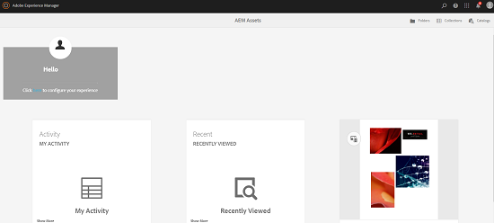

#  esperienza della home page di AEM Assets {#aem-assets-home-page-experience}

Personalizzate la home page di  AEM Assets per un&#39;esperienza ricca di schermata di benvenuto, con un&#39;istantanea delle attività recenti intorno alle risorse.

La home page di Adobe Experience Manager (AEM) Assets offre un’esperienza sulla schermata di benvenuto ricca e personalizzata, che include un’istantanea delle attività recenti, come le risorse che sono state visualizzate o caricate di recente.

Per impostazione predefinita, la home page delle risorse è disattivata. Per attivarla, effettuare le seguenti operazioni:

1. Per accedere AEM Gestione configurazione, fate clic su **[!UICONTROL Strumenti > Operazione > Console]** Web.
1. Aprite il servizio **Day CQ DAM Event Recorder** .
1. Selezionate **[!UICONTROL Abilita questo servizio]** per abilitare la registrazione dell&#39;attività.

   

1. Dall’elenco Tipi **** evento, selezionate gli eventi da registrare e salvate le modifiche.

   >[!CAUTION]
   >
   >Abilitando le opzioni di visualizzazione delle risorse, dei progetti visualizzati e delle raccolte, il numero di eventi registrati aumenta notevolmente.

1. Aprite il servizio Flag **[!UICONTROL di funzionalità della home page della risorsa]** DAM da Configuration Manager `https://[AEM_server]:[port]/system/console/configMgr`.
1. Selezionate l’opzione **[!UICONTROL isEnabled.name]** per attivare la funzione Pagina iniziale risorse. Salva le modifiche.

   

1. Aprite la finestra di dialogo Preferenze **** utente e selezionate **[!UICONTROL Abilita pagina]** iniziale risorse. Salva le modifiche.

   

Dopo aver attivato la home page delle risorse, passa all’interfaccia utente delle risorse dalla pagina di navigazione.

Toccate o fate clic su **[!UICONTROL Fate clic qui per configurare il collegamento]** dell&#39;esperienza per aggiungere il vostro nome utente, l&#39;immagine di sfondo e l&#39;immagine del profilo.

La home page delle risorse include le seguenti sezioni:

* Sezione Benvenuti
* Sezione Widget

**Sezione Benvenuti**

Se il vostro profilo esiste, nella sezione Benvenuti viene visualizzato un messaggio di benvenuto indirizzato a voi. Inoltre, mostra l&#39;immagine del profilo e un&#39;immagine di benvenuto (se già configurata).

Se il profilo è incompleto, nella sezione Benvenuti vengono visualizzati un messaggio di benvenuto generico e un segnaposto per l&#39;immagine del profilo.

**Sezione Widget**

Questa sezione viene visualizzata sotto la sezione Benvenuti e presenta i widget out-of-the-box nelle seguenti sezioni:

* Attività
* Recente
* Scopri

**Attività**: In questa sezione, il widget **Attività** personale visualizza le attività recenti svolte dall’utente che ha eseguito l’accesso con risorse (incluse le risorse senza rappresentazioni), ad esempio caricamenti di risorse, download, creazione di risorse, modifiche, commenti, annotazioni e condivisioni.

**Recente**: Il widget **Visualizzato** di recente in questa sezione visualizza le entità a cui l&#39;utente ha effettuato l&#39;accesso di recente, comprese cartelle, raccolte e progetti.

**Scopri**: Il **nuovo** widget in questa sezione visualizza le risorse e le rappresentazioni recentemente caricate nell’istanza AEM Assets .

Per abilitare la rimozione dei dati dell&#39;attività utente, abilita il servizio **di rimozione eventi** DAM da Configuration Manager. Dopo aver attivato questo servizio, le attività dell&#39;utente connesso che superano un numero specificato vengono eliminate dal sistema.

La schermata introduttiva fornisce strumenti di navigazione semplici, ad esempio icone sulla barra degli strumenti per accedere a cartelle, raccolte e cataloghi.

>[!NOTE]
>
>Se si abilitano i servizi Day CQ DAM Event Recorder e DAM Event Purge, le operazioni di scrittura su JCR e l&#39;indicizzazione delle ricerche aumentano notevolmente il carico sul server AEM. Il carico aggiuntivo sul server AEM può influire sulle prestazioni.

>[!CAUTION]
>
>L’acquisizione, il filtro e l’eliminazione delle attività utente richieste per la pagina iniziale della risorsa comportano un sovraccarico delle prestazioni. Pertanto, gli amministratori devono configurare la pagina principale in modo efficace per gli utenti target.
>
> Adobe consiglia agli amministratori e agli utenti che eseguono operazioni in blocco di evitare di utilizzare la funzione Pagina iniziale risorsa per impedire l’aumento delle attività degli utenti. Inoltre, gli amministratori possono escludere le attività di registrazione per utenti specifici configurando **Day CQ DAM Event Recorder** da Configuration Manager.
>
>Se utilizzate la funzione,  Adobe consiglia di pianificare la frequenza di eliminazione in base al carico del server.
