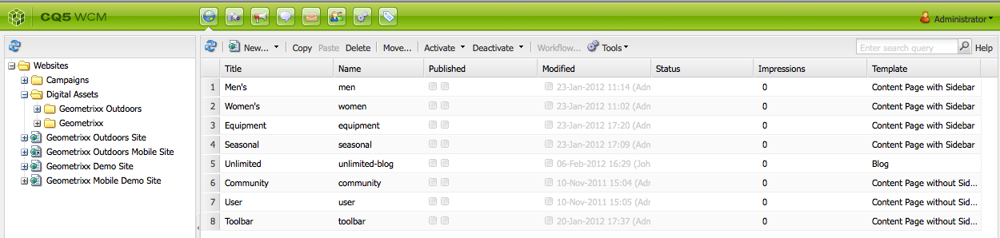
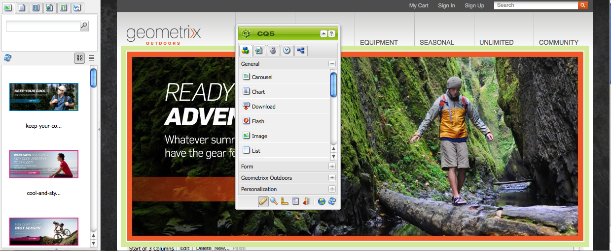

# Informazioni su  AEM Assets {#about-assets}

Assets è uno strumento Digital Asset Management (DAM) completamente integrato con la piattaforma AEM e consente alla tua azienda di condividere e distribuire risorse digitali. Gli utenti di un’organizzazione possono gestire e archiviare immagini, video, documenti, clip audio e contenuti multimediali come file Flash, per poi accedervi e utilizzarli sul Web, in documenti stampati e per la distribuzione digitale.

## What is Digital Asset Management (DAM)? {#what-is-digital-asset-management}

Assets consente di condividere e distribuire le risorse digitali chiave di un’organizzazione in tutta l’azienda. Gli utenti di un’organizzazione possono archiviare, gestire e accedere a risorse digitali come immagini, elementi grafici, audio, video e documenti tramite un’interfaccia Web (o una cartella CIFS o WebDAV).

AEM Assets, completamente integrato in AEM, consente di effettuare le seguenti operazioni:

* Aggiungere e condividere immagini, documenti, file audio e video in diversi formati.
* Gestire le risorse raggruppandole in base a tag, lightbox o stelle (preferiti). Aggiungere note alle risorse.
* Trovare risorse cercando il nome dei file, l’intero testo dei documenti in base a data, tipo di documento e tag.
* Aggiungere o modificare le informazioni sui metadati per le risorse. La versione dei metadati viene adeguata automaticamente alla relativa risorsa. È possibile importare o esportare i metadati delle risorse.
* Utilizzare funzioni di modifica delle immagini come il ridimensionamento e l’aggiunta di filtri. È possibile importare ed esportare contemporaneamente più risorse digitali utilizzando una cartella WebDAV o CIFS.
* Utilizzare flussi di lavoro e notifiche per consentire l’elaborazione e il download simultanei di qualsiasi insieme di risorse e gestire i diritti di accesso alle risorse.

###  AEM Assets è completamente integrato con AEM funzionalità WCM {#aem-assets-fully-integrated-in-cq-wcm}

 AEM Assets è completamente integrato con CQ WCM e la funzionalità è disponibile tramite l’icona DAM:

<!-- TBD: Update image for branding -->

 

Le risorse gestite in CQ DAM sono quindi accessibili tramite Content Finder di WCM:

<!-- TBD: Update image for branding -->

>[!NOTE]
>
>La navigazione di base dell&#39;interfaccia utente è la stessa del resto del AEM. Per ulteriori informazioni, vedere [Panoramica della console](/help/sites-authoring/qg-page-authoring.md) GUI.

### Gestione delle risorse digitali e componente Immagine {#digital-asset-management-versus-image-component}

Per determinare se inserire un’immagine in  AEM Assets o usare il componente Immagine, considera il ciclo di vita dell’immagine:

* Se l’immagine ha lo stesso ciclo di vita della pagina, utilizza il componente Immagine.
* Se l’immagine presenta un ciclo di vita separato, ad esempio se devi utilizzare l’immagine due volte o all’esterno di WCM, utilizza AEM Assets.

## Cosa sono le risorse digitali? {#what-are-digital-assets}

Una risorsa è un documento digitale, un’immagine, un video o un file audio (o parte di esso) che può avere più rappresentazioni e risorse secondarie (ad esempio, livelli in un file Photoshop, diapositive in un file PowerPoint, pagine in un pdf, file in un file ZIP).

Una risorsa, in pratica, è composta da un file binario, da metadati, da rappresentazioni e da risorse secondarie. Consulta la [Guida alle prestazioni di DAM](/help/sites-deploying/assets-performance-sizing.md) per informazioni dettagliate.

>[!CAUTION]
>
>Il caricamento e/o la modifica di un grande volume di risorse (in particolare immagini) può influire sulle prestazioni dell’istanza CQ.

### AEM Assets terminology {#aem-assets-terminology}

Quando lavori con risorse digitali in AEM, è importante comprendere la seguente terminologia:

* **Raccolta:** Una raccolta di risorse, basata sulla posizione fisica (cartella), sulle proprietà comuni (cartella di ricerca salvata) o sulla selezione dell’utente (cartelle lightbox).

* **Metadati:** Le risorse dispongono di metadati; ad esempio autore, data di scadenza, informazioni DRM (Digital Rights Management) e così via. I metadati disponibili dipendono dalle autorizzazioni di accesso. AEM Assets offre e supporta i seguenti schemi di metadati di uso comune:

   * **Dublin Core**: inclusi autore, descrizione, data, oggetto e così via.
   * **IPTC**: compresi evento, modello, posizione e così via.
   * **WCM**: incluse le proprietà della pagina, il tempo di attivazione e disattivazione e così via.

* **Assegnazione tag:** Le risorse possono essere classificate e con tag. Consulta Utilizzo dei tag e Gestione dei tag.

* **Rappresentazioni:** Una rappresentazione è la rappresentazione binaria di una risorsa. Le risorse dispongono sempre di una rappresentazione principale, cioè quella del file caricato. Possono disporre di diverse rappresentazioni aggiuntive create, ad esempio, dai passaggi personalizzati del flusso di lavoro o durante il caricamento di una risorsa. Le rappresentazioni possono essere di dimensioni diverse, con diverse risoluzioni, con filigrana aggiunta o altre caratteristiche modificate.

* **Versioni:** Quando si crea una versione, viene creata un&#39;istantanea delle risorse digitali in un momento specifico. Se necessario, puoi ripristinare le risorse alle versioni precedenti. See [versioning in AEM Assets](managing-assets-touch-ui.md#asset-versioning).

* **Risorse secondarie:** Le risorse secondarie sono risorse che costituiscono una risorsa, ad esempio i livelli di un file Adobe Photoshop  o le pagine di un file PDF. In AEM Assets, le risorse secondarie vengono gestite in modo analogo alle risorse.

### Come lavorare con le risorse {#how-to-work-with-assets}

È possibile intervenire su una risorsa o una raccolta eseguendo specifiche azioni per creare o modificare risorse, raccolte e rappresentazioni. Molte delle azioni di base eseguite sulle risorse (caricamento, eliminazione, aggiornamento, salvataggio di risorse secondarie) attivano flussi di lavoro preconfigurati. Questi vengono automaticamente attivati in AEM Assets e sono descritti dettagliatamente nei gestori di contenuti multimediali di AEM Assets.

Le operazioni che puoi eseguire con questi flussi di lavoro preconfigurati sono:

* Salvate la risorsa nella directory archivio o eliminatela.
* Estrarre e salvare i metadati della risorsa; i singoli elementi di metadati vengono salvati come XMP.
* Generazione di rappresentazioni e miniature per la risorsa; compresi, se necessario, il ridimensionamento e il ritaglio automatici.
* Se necessario, transcodificate la risorsa. Ad esempio, i video per dispositivi mobili e Web sono codificati con 24 fotogrammi al secondo, quelli per il download con 30 fotogrammi al secondo. L’audio per dispositivi mobili e Web è codificato a 128 kbps, quello per il download a 192 kbps.

Ovviamente, puoi applicare i flussi di lavoro anche manualmente. Per un elenco dei flussi di lavoro predefiniti, consulta [Gestori di contenuti multimediali di AEM Assets ](media-handlers.md).

## AEM DAM e AEM MediaLibrary {#cq-dam-vs-cq-medialibrary}

See [AEM DAM and AEM MediaLibrary](medialibrary.md) for information on the differences.
