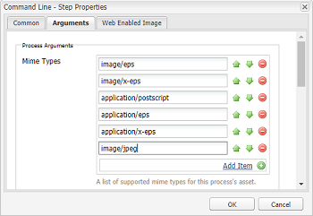

# Installa e configura ImageMagick per lavorare con [!DNL Experience Manager Assets] {#install-and-configure-imagemagick-to-work-with-aem-assets}

>[!CAUTION]
>
>AEM 6.4 ha raggiunto la fine del supporto esteso e questa documentazione non viene più aggiornata. Per maggiori dettagli, consulta la nostra [periodi di assistenza tecnica](https://helpx.adobe.com/it/support/programs/eol-matrix.html). Trova le versioni supportate [qui](https://experienceleague.adobe.com/docs/).

ImageMagick è un plug-in software per creare, modificare, comporre o convertire immagini bitmap. Può leggere e scrivere immagini in vari formati (oltre 200) tra cui PNG, JPEG, JPEG-2000, GIF, TIFF, DPX, EXR, WebP, Postscript, PDF e SVG. Utilizza ImageMagick per ridimensionare, capovolgere, speculare, ruotare, distorcere, inclinare e trasformare le immagini. È inoltre possibile regolare i colori dell&#39;immagine, applicare vari effetti speciali o disegnare testo, linee, poligoni, ellissi e curve utilizzando ImageMagick.

Utilizza il gestore di contenuti multimediali Adobe Experience Manager dalla riga di comando per elaborare le immagini tramite ImageMagick. Per lavorare con vari formati di file utilizzando ImageMagick, vedi [Best practice per i formati di file risorse](assets-file-format-best-practices.md). Per informazioni su tutti i formati di file supportati, consulta [Formati supportati da Assets](assets-formats.md).

Per elaborare file di grandi dimensioni utilizzando ImageMagick, considera requisiti di memoria più elevati del solito, modifiche potenziali richieste ai criteri di IM e l&#39;impatto complessivo sulle prestazioni. I requisiti di memoria dipendono da vari fattori come la risoluzione, la profondità di bit, il profilo colore e il formato file. Se si intende elaborare file di grandi dimensioni utilizzando ImageMagick, eseguire correttamente il benchmark del [!DNL Experience Manager] server. Alla fine vengono fornite alcune risorse utili.

>[!NOTE]
>
>Se utilizzi [!DNL Experience Manager] in Adobe Managed Services (AMS), contatta l’Assistenza clienti Adobe se intendi elaborare molti file PSD o PSB di grandi dimensioni. Experience Manager potrebbe non elaborare file PSB ad altissima risoluzione con una risoluzione superiore a 30000x23000 pixel.

## Installa ImageMagick {#installing-imagemagick}

Sono disponibili più versioni di file di installazione ImageMagic per vari sistemi operativi. Utilizzare la versione appropriata per il sistema operativo in uso.

1. Scarica il [File di installazione di ImageMagick](https://www.imagemagick.org/script/download.php) per il sistema operativo in uso.
1. Per installare ImageMagick sul disco che ospita il [!DNL Experience Manager] server, avviare il file di installazione.

1. Impostare la variabile del percorso Ambiente sulla directory di installazione ImageMagic.
1. Per verificare se l&#39;installazione è riuscita, esegui la `identify -version` comando.

## Imposta il passaggio del processo della riga di comando {#set-up-the-command-line-process-step}

Puoi impostare il passaggio del processo della riga di comando per il tuo caso d’uso specifico. Esegui questi passaggi per generare un’immagine capovolta e miniature (140x100, 48x48, 319x319 e 1280x1280) ogni volta che aggiungi un file immagine JPEG a `/content/dam` sulla [!DNL Experience Manager] server:

1. Sulla [!DNL Experience Manager] , passa alla console Flusso di lavoro (`https://[aem_server]:[Port]/workflow`) e apri la **[!UICONTROL Risorsa di aggiornamento DAM]** modello di flusso di lavoro.
1. Da **[!UICONTROL Risorsa di aggiornamento DAM]** modello di flusso di lavoro, apri **[!UICONTROL Miniature EPS (con tecnologia ImageMagick)]** passo.
1. In **[!UICONTROL Scheda Argomenti]**, aggiungi `image/jpeg` al **[!UICONTROL Tipi di mime]** elenco.

   

1. In **[!UICONTROL Comandi]** immettere il comando seguente:

   `convert ./${filename} -flip ./${basename}.flipped.jpg`

1. Seleziona la **[!UICONTROL Elimina rappresentazione generata]** e **[!UICONTROL Genera rappresentazione web]** bandiere.

   

1. In **[!UICONTROL Immagine abilitata per il web]** specifica i dettagli del rendering con dimensioni 1280x1280 pixel. Inoltre, specifica i *mage/jpeg* in **[!UICONTROL Mimetype]** scatola.

   

1. Tocca o fai clic su **[!UICONTROL OK]** per salvare le modifiche.

   >[!NOTE]
   >
   >La `convert` Impossibile eseguire il comando con alcune versioni di Windows (ad esempio Windows SE), perché è in conflitto con il parametro nativo `convert` Utilità che fa parte dell&#39;installazione di Windows. In questo caso, indicare il percorso completo per l&#39;utilità ImageMagick. Ad esempio, specifica
   >
   >`"C:\Program Files\ImageMagick-6.8.9-Q16\convert.exe" -define jpeg:size=319x319 ./${filename} -thumbnail 319x319 cq5dam.thumbnail.319.319.png`

1. Apri **[!UICONTROL Miniature del processo]** e aggiungi il tipo MIME `image/jpeg` sotto **[!UICONTROL Ignora tipi mime]**.

   

1. In **[!UICONTROL Immagine abilitata per il web]** , aggiungi il tipo MIME `image/jpeg` in **[!UICONTROL Ignora elenco]**. Tocca o fai clic su **[!UICONTROL OK]** per salvare le modifiche.

   

1. Salva il flusso di lavoro.
1. Per verificare se ImageMagic è in grado di elaborare correttamente le immagini, carica un&#39;immagine JPG in [!DNL Assets]. Verifica se per essa vengono generate un’immagine capovolta e le relative rappresentazioni.

## Riduzione delle vulnerabilità relative alla sicurezza {#mitigating-security-vulnerabilities}

L’utilizzo di ImageMagick per elaborare le immagini presenta diverse vulnerabilità di sicurezza. Ad esempio, l’elaborazione di immagini inviate dall’utente comporta il rischio di esecuzione di codice remoto.

Inoltre, vari plug-in per l’elaborazione delle immagini dipendono dalla libreria ImageMagick, compresi, tra l’altro, l’immagine di PHP, il rmagick e il fermacarte di Ruby e l’immagine di Node.js.

Se utilizzi ImageMagick o una libreria interessata, Adobe consiglia di attenuare le vulnerabilità note eseguendo almeno una delle seguenti attività (ma preferibilmente entrambe):

1. Verifica che tutti i file di immagine inizino con il previsto [&quot;byte magici&quot;](https://en.wikipedia.org/wiki/List_of_file_signatures) corrispondente ai tipi di file immagine supportati prima di inviarli a ImageMagick per l’elaborazione.
1. Utilizza un file dei criteri per disabilitare i codificatori ImageMagick vulnerabili. La policy globale di ImageMagick si trova all&#39;indirizzo `/etc/ImageMagick`.

>[!MORELIKETHIS]
>
>* [Procedure consigliate per l’elaborazione di vari formati di file tramite [!DNL Assets]](assets-file-format-best-practices.md)
>* [Opzioni della riga di comando per ImageMagick](https://www.imagemagick.org/script/command-line-options.php)
>* [Esempi di utilizzo di ImageMagick di base e avanzati](https://www.imagemagick.org/Usage/)
>* [Ottimizzazione delle prestazioni delle risorse per ImageMagick](performance-tuning-guidelines.md)
>* [Elenco completo dei formati di file supportati da [!DNL Assets]](assets-formats.md)
>* [Comprendere i formati di file e i costi di memoria delle immagini](https://www.scantips.com/basics1d.html)

