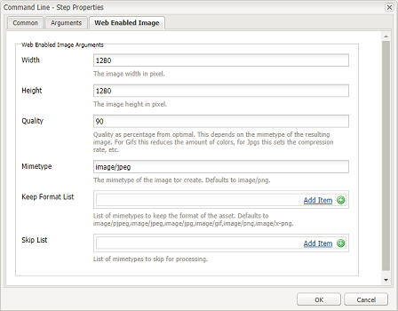

# Installazione e configurazione di ImageMagick per l&#39;utilizzo con  AEM Assets {#install-and-configure-imagemagick-to-work-with-aem-assets}

ImageMagick è un plug-in software per creare, modificare, comporre o convertire immagini bitmap. Può leggere e scrivere immagini in vari formati (oltre 200), tra cui PNG, JPEG, JPEG-2000, GIF, TIFF, DPX, EXR, WebP, Postscript, PDF e SVG. ImageMagick consente di ridimensionare, riflettere, ruotare, distorcere, inclinare e trasformare le immagini. Con ImageMagick potete anche regolare i colori delle immagini, applicare vari effetti speciali o disegnare testo, linee, poligoni, ellissi e curve.

Usate il gestore di supporti Adobe Experience Manager (AEM) dalla riga di comando per elaborare le immagini tramite ImageMagick. Per utilizzare vari formati di file con ImageMagick, consultare le procedure ottimali per i formati di file [Risorse](assets-file-format-best-practices.md). Per ulteriori informazioni su tutti i formati di file supportati, vedere [Formati di risorse supportati](assets-formats.md).

Per elaborare file di grandi dimensioni con ImageMagick, considerate requisiti di memoria superiori a quelli usuali, modifiche potenziali richieste ai criteri IM e l&#39;impatto complessivo sulle prestazioni. I requisiti di memoria dipendono da vari fattori come risoluzione, profondità di bit, profilo colore e formato file. Se intendete elaborare file molto grandi utilizzando ImageMagick, eseguite correttamente il benchmark del server AEM. Alla fine vengono fornite alcune risorse utili.

>[!NOTE]
>
>Se utilizzi AEM su Adobe Managed Services (AMS), rivolgiti all&#39;Assistenza clienti  Adobe se intendi elaborare molti file PSD o PSB di grandi dimensioni.  Experience Manager potrebbe non essere in grado di elaborare file PSB ad alta risoluzione con una risoluzione superiore a 30000 x 23000 pixel.

## Installazione di ImageMagick {#installing-imagemagick}

Sono disponibili diverse versioni dei file di installazione ImageMagic per vari sistemi operativi. Utilizzate la versione appropriata per il sistema operativo in uso.

1. Scaricate i file di installazione [ImageMagick ](https://www.imagemagick.org/script/download.php) appropriati per il sistema operativo in uso.
1. Per installare ImageMagick sul disco che ospita il server di AEM, avviate il file di installazione.

1. Impostate la variabile del percorso Ambiente sulla directory di installazione di ImageMagic.
1. Per verificare se l&#39;installazione è riuscita, eseguire il comando `identify -version`.

## Impostare il passaggio della riga di comando {#set-up-the-command-line-process-step}

È possibile impostare il passaggio della riga di comando per il caso di utilizzo specifico. Effettuate le seguenti operazioni per generare un’immagine e miniature capovolte (140x100, 48x48, 319x319 e 1280x1280) ogni volta che aggiungete un file immagine JPEG a `/content/dam` nel server AEM:

1. Sul server AEM, accedete alla console Flusso di lavoro (`https://[aem_server]:[Port]/workflow`) e aprite il modello di flusso di lavoro **[!UICONTROL Aggiorna risorsa DAM]**.
1. Dal modello di flusso di lavoro **[!UICONTROL DAM Update Asset]**, aprite le miniature EPS (con ImageMagick)]**.**[!UICONTROL 
1. Nella scheda **[!UICONTROL Argomenti]**, aggiungere `image/jpeg` all&#39;elenco **[!UICONTROL Tipi mime]**.

   

1. Nella casella **[!UICONTROL Comandi]**, immettere il comando seguente:

   `convert ./${filename} -flip ./${basename}.flipped.jpg`

1. Selezionare i flag **[!UICONTROL Elimina rappresentazione generata]** e **[!UICONTROL Genera rappresentazione Web]**.

   

1. Nella scheda **[!UICONTROL Immagine abilitata per il Web]**, specificate i dettagli per la rappresentazione con dimensioni 1280x1280 pixel. Inoltre, specificate i *mage/jpeg* nella casella **[!UICONTROL Mimetype]**.

   

1. Toccate/fate clic su **[!UICONTROL OK]** per salvare le modifiche.

   >[!NOTE]
   >
   >Il comando `convert` potrebbe non essere eseguito con alcune versioni di Windows (ad esempio, Windows SE), in quanto è in conflitto con l&#39;utility `convert` nativa che fa parte dell&#39;installazione di Windows. In questo caso, indicare il percorso completo per l&#39;utilità ImageMagick. Ad esempio, specificate
   >
   >`"C:\Program Files\ImageMagick-6.8.9-Q16\convert.exe" -define jpeg:size=319x319 ./${filename} -thumbnail 319x319 cq5dam.thumbnail.319.319.png`

1. Aprire il passaggio **[!UICONTROL Miniature processo]** e aggiungere il tipo MIME `image/jpeg` in **[!UICONTROL Skip Mime Types]**.

   

1. Nella scheda **[!UICONTROL Immagine abilitata per il Web]**, aggiungere il tipo MIME `image/jpeg` in **[!UICONTROL Skip List]**. Toccate/fate clic su **[!UICONTROL OK]** per salvare le modifiche.

   

1. Salvare il flusso di lavoro.
1. Per verificare se ImageMagic è in grado di elaborare correttamente le immagini, caricate un’immagine JPG in  AEM Assets. Verificate se per l&#39;immagine capovolta e le rappresentazioni sono generate.

## Riduzione delle vulnerabilità di sicurezza {#mitigating-security-vulnerabilities}

L’utilizzo di ImageMagick per elaborare le immagini presenta diverse vulnerabilità di sicurezza. Ad esempio, l’elaborazione di immagini inviate dall’utente comporta il rischio di esecuzione di codice remoto (RCE).

Inoltre, diversi plug-in per l’elaborazione delle immagini dipendono dalla libreria ImageMagick, tra cui, tra l’altro, l’immagine di PHP, il clip di immagini rmagick e il clip di carta di Ruby e l’immagine di Node.js.

Se si utilizza ImageMagick o una libreria interessata,  Adobe consiglia di attenuare le vulnerabilità note eseguendo almeno una delle seguenti operazioni (preferibilmente entrambe):

1. Verificate che tutti i file di immagine inizino con i [&quot;byte magici&quot;](https://en.wikipedia.org/wiki/List_of_file_signatures) che corrispondono ai tipi di file di immagine supportati prima di inviarli a ImageMagick per l&#39;elaborazione.
1. Usate un file di criteri per disabilitare i codificatori ImageMagick vulnerabili. Il criterio globale per ImageMagick è disponibile all&#39;indirizzo `/etc/ImageMagick`.

>[!MORELIKETHIS]
>
>* [Procedure ottimali per l&#39;elaborazione di vari formati di file tramite  AEM Assets](assets-file-format-best-practices.md)
>* [Opzioni della riga di comando per ImageMagick](https://www.imagemagick.org/script/command-line-options.php)
>* [Esempi di base e avanzati di utilizzo di ImageMagick](https://www.imagemagick.org/Usage/)
>* [Ottimizzazione delle prestazioni delle risorse per ImageMagick](performance-tuning-guidelines.md)
>* [Elenco completo dei formati di file supportati da  AEM Assets](assets-formats.md)
>* [Comprendere i formati di file e i costi di memoria delle immagini](https://www.scantips.com/basics1d.html)

