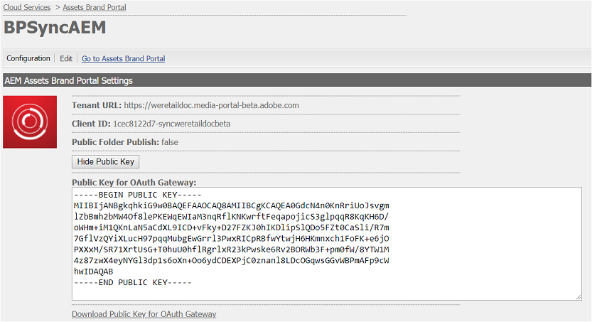
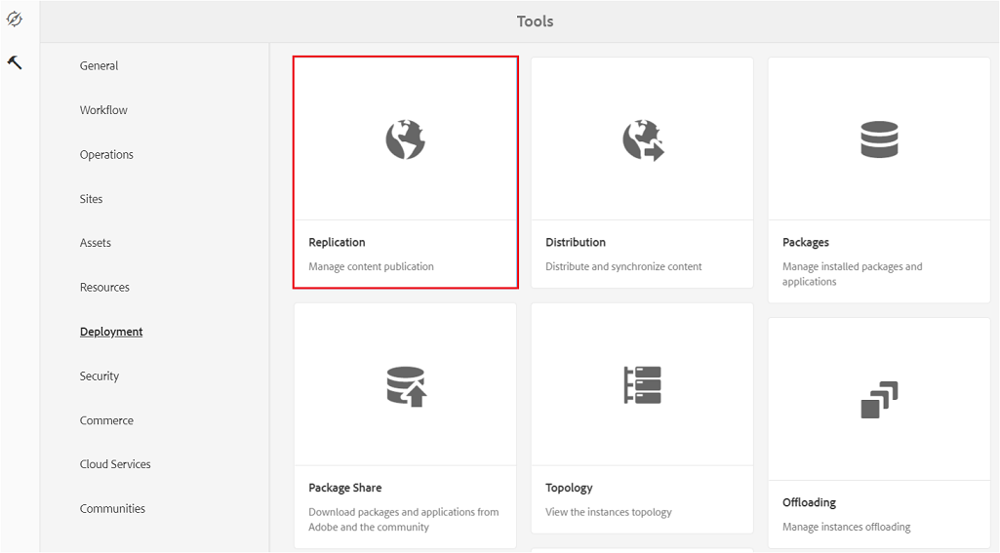

# Configurare l’integrazione di AEM Assets con Brand Portal {#configure-aem-assets-integration-with-brand-portal}

Scopri come integrare AEM Assets con il Portale del marchio per pubblicare risorse e raccolte nel Portale del marchio.

Se sei un cliente del Portale del marchio Adobe Experience Manager (AEM) Assets, puoi integrare AEM Assets con il Portale del marchio per abilitare la pubblicazione delle risorse sul Portale del marchio. Potete configurare questa integrazione tramite l&#39;interfaccia Adobe.io.

> [!Note]
>
>Adobe consiglia di effettuare l’aggiornamento ad AEM 6.4.1.0 o versione successiva per garantire che AEM Assets Brand Portal sia integrato con AEM Assets. Una limitazione in AEM 6.4 genera un errore durante la configurazione dell&#39;integrazione con Brand Portal e la replica non riesce.

Innanzitutto, create un&#39;applicazione, che include un meccanismo di autenticazione, nel gateway pubblico di Marketing Cloud. Quindi, crea un profilo nell’istanza di Risorse AEM utilizzando l’ID applicazione ottenuto dal gateway.

Utilizzate questa configurazione per pubblicare le risorse da AEM Assets al Brand Portal. Sul back-end, il server AEM autentica il tuo profilo con il gateway e quindi integra AEM Assets con il Brand Portal.

>[!NOTE]
>
>L’interfaccia utente per la configurazione delle integrazioni di autenticazione è ospitata in [https://legacy-oauth.cloud.adobe.io/](https://legacy-oauth.cloud.adobe.io/), precedentemente ospitata in [https://marketing.adobe.com/developer/](https://marketing.adobe.com/developer/).

## Creare un&#39;applicazione JWT {#create-jwt-application}

1. Accedete a [https://legacy-oauth.cloud.adobe.io/](https://legacy-oauth.cloud.adobe.io/) con il vostro Adobe ID. Si accede alla pagina Applicazioni  JWT.

   >[!NOTE]
   >
   >Potete creare un ID applicazione solo se siete l&#39;amministratore di sistema della vostra organizzazione. Tenant è il nome tecnico dell&#39;organizzazione registrata con Adobe Marketing Cloud.

2. Selezionate **[!UICONTROL Aggiungi applicazione]** per creare un&#39;applicazione.
3. Specificate un nome **** applicazione e una **[!UICONTROL descrizione]** facoltativa.
4. Dall’elenco **[!UICONTROL Organizzazione]** , selezionate l’organizzazione per la quale desiderate sincronizzare le risorse.
5. Nell&#39;elenco **[!UICONTROL Ambito]** , selezionare **[!UICONTROL dam-read]**, **[!UICONTROL dam-sync]**, **[!UICONTROL dam-write]** e **[!UICONTROL cc-share]**.
6. Toccate o fate clic su **[!UICONTROL Aggiungi]**. Viene creata un&#39;applicazione del servizio JWT. Potete modificare l’applicazione e salvare.
7. Copiate l&#39;ID applicazione generato per la nuova applicazione.

   >[!NOTE]
   >
   >Assicuratevi di non copiare inavvertitamente il segreto dell’applicazione invece dell’ID applicazione.

## Creare una nuova configurazione cloud {#create-a-new-cloud-configuration}

1. Dalla pagina di **[!UICONTROL navigazione]** dell’istanza locale di Risorse AEM, tocca o fai clic sull’icona **[!UICONTROL Strumenti]** a sinistra.

   

2. Navigate to **[!UICONTROL Cloud Services > Legacy Cloud Services]**.

   

3. Nella pagina Servizi  cloud, individua il servizio **[!UICONTROL Assets Brand Portal]** in **[!UICONTROL Adobe Experience Cloud]**.

   

4. Toccate o fate clic sul collegamento **[!UICONTROL Configura ora]** sotto il servizio per visualizzare la finestra di dialogo [Crea configurazione] .
5. Nella finestra di dialogo [!UICONTROL Crea configurazione] , specificate un titolo e un nome per la nuova configurazione e toccate o fate clic su **[!UICONTROL Crea]**.

   

6. Nella finestra di dialogo Replica [!UICONTROL Brand Portal di] AEM Assets, specifica l’URL della tua organizzazione nel campo URL  tenant.
7. Nel campo ID  client, incollate l&#39;ID applicazione che avete copiato alla fine della procedura [Creare un&#39;applicazione](#create-jwt-application). Fai clic su **[!UICONTROL OK]**. 

   

8. Per rendere le risorse (pubblicate da AEM) disponibili al pubblico per gli utenti generali di Brand Portal, abilitate la casella di controllo Pubblica **[!UICONTROL cartella]** pubblica.

   >[!NOTE]
   >
   >L’opzione per attivare la pubblicazione **[!UICONTROL delle cartelle]** pubbliche è disponibile a partire da AEM 6.3.2.1.

9. Dalla pagina Configurazione [!UICONTROL Brand Portal, toccate/fate clic su] Visualizza chiave **** pubblica per visualizzare la chiave pubblica generata per la vostra istanza.

   

   In alternativa, fai clic su **[!UICONTROL Scarica chiave pubblica per Gateway]** OAuth per scaricare il file contenente la chiave pubblica. Quindi, aprite il file per visualizzare la chiave pubblica.

## Abilita integrazione {#enable-integration}

1. Visualizzare la chiave pubblica utilizzando uno dei seguenti metodi menzionati nell&#39;ultimo passaggio della procedura [Aggiungere una nuova configurazione a Marketing Cloud](#create-a-new-cloud-configuration).

   * Fate clic sul pulsante **[!UICONTROL Visualizza chiave]** pubblica per visualizzare il tasto.
   * Aprite il file scaricato contenente la chiave.

2. Aprite l&#39;interfaccia Marketing Cloud Developer Connection e fate clic sull&#39;applicazione creata in [Creare un&#39;applicazione](#create-jwt-application).
3. Incolla la chiave pubblica nel campo **[!UICONTROL Chiave]** pubblica dell&#39;interfaccia di configurazione
4. Tap/click **[!UICONTROL Save]**. Viene visualizzato un messaggio di conferma dell’aggiornamento dell’applicazione.

## Verificare l&#39;integrazione {#test-the-integration}

1. Dalla pagina di **[!UICONTROL navigazione]** dell’istanza locale di Risorse AEM, fai clic sull’icona **[!UICONTROL Strumenti]** a sinistra.

   

2. Passare a **[!UICONTROL Distribuzione > Replica]**.

   

3. Nella pagina [!UICONTROL Replica] , toccate o fate clic su **[!UICONTROL Agenti sull’autore]**.

   

4. Per verificare la connessione tra AEM Author e Brand Portal, aprite uno dei quattro agenti di replica e fate clic su **[!UICONTROL Verifica connessione]**.

   >[!NOTE]
   >
   >Gli agenti di replica lavorano in parallelo e condividono la distribuzione dei processi in modo uniforme, aumentando la velocità di pubblicazione di quattro volte la velocità originale. Una volta configurato il servizio cloud, non è richiesta ulteriore configurazione per abilitare gli agenti di replica attivati per impostazione predefinita per abilitare la pubblicazione parallela di più risorse.

   >[!NOTE]
   >
   >Evitare di disattivare gli agenti di replica, in quanto potrebbe causare errori di replica di alcune risorse.

   

5. Esaminate la parte inferiore dei risultati del test per verificare che la replica sia riuscita.

   

Una volta completata la replica, potete pubblicare risorse, cartelle e raccolte in Brand Portal. Per informazioni dettagliate, consultate:

* [Pubblicare risorse e cartelle su Brand Portal](brand-portal-publish-folder.md)
* [Pubblicare raccolte nel portale dei marchi](brand-portal-publish-collection.md)

## Publish assets to Brand Portal {#publish-assets-to-brand-portal}

Una volta completata la replica, potete pubblicare risorse, cartelle e raccolte in Brand Portal. Per pubblicare le risorse su Brand Portal, effettuate le seguenti operazioni:

>[!NOTE]
>
>Adobe consiglia la pubblicazione scaglionata, preferibilmente nelle ore non di picco, in modo che l’autore di AEM non occupi risorse in eccesso.

1. Dalla console Risorse, passa il mouse sulle risorse desiderate e seleziona l’opzione **[!UICONTROL Pubblica]** dalle azioni rapide.

   In alternativa, selezionate le risorse da pubblicare nel Brand Portal.

   

2. Per pubblicare le risorse su Brand Portal, sono disponibili due opzioni:
   * [Pubblicare immediatamente le risorse](#publish-now)
   * [Pubblicare le risorse in un secondo momento](#publish-later)

### Pubblica subito le risorse {#publish-now}

Per pubblicare le risorse selezionate in Brand Portal, effettuate una delle seguenti operazioni:

* Dalla barra degli strumenti, selezionate Pubblicazione **** rapida. Dal menu, selezionate **[!UICONTROL Pubblica su Brand Portal]**.

* Dalla barra degli strumenti, selezionate **[!UICONTROL Gestisci pubblicazione]**.

   1. Quindi, dall’ **[!UICONTROL azione]** , selezionate **[!UICONTROL Pubblica su Brand Portal]**, quindi, in **[!UICONTROL Pianificazione]** , selezionate **[!UICONTROL Ora]**. Tap/ click **[!UICONTROL Next].**

   2. In **[!UICONTROL Ambito]**, conferma la selezione e tocca o fai clic su **[!UICONTROL Pubblica su Brand Portal]**.

Viene visualizzato un messaggio che informa che le risorse sono state messe in coda per la pubblicazione sul Brand Portal. Effettuate l’accesso all’interfaccia del Portale marchio per visualizzare le risorse pubblicate.

### Pubblicare le risorse in un secondo momento {#publish-later}

Per pianificare la pubblicazione delle risorse su Brand Portal in una data o un’ora successiva:

1. Dopo aver selezionato le risorse o le cartelle da pubblicare, selezionate **[!UICONTROL Gestisci pubblicazione]** dalla barra degli strumenti nella parte superiore.
2. Nella pagina **[!UICONTROL Gestisci pubblicazione]** , selezionate **[!UICONTROL Pubblica su Brand Portal]** dall’ **[!UICONTROL azione]** e selezionate **[!UICONTROL Più tardi]** da **[!UICONTROL Pianificazione]**.

   

3. Selezionate una data **[!UICONTROL di]** attivazione e specificate l&#39;ora. Tap/ click **[!UICONTROL Next]**.
4. Selezionate una data **[!UICONTROL di]** attivazione e specificate l&#39;ora. Tap/ click **[!UICONTROL Next]**.
5. Specificate un titolo del flusso di lavoro in **[!UICONTROL Flussi di lavoro]**. Toccate o fate clic su **[!UICONTROL Pubblica più tardi]**.

   

A questo punto, accedete a Brand Portal per verificare se le risorse pubblicate sono disponibili nell’interfaccia di Brand Portal.

