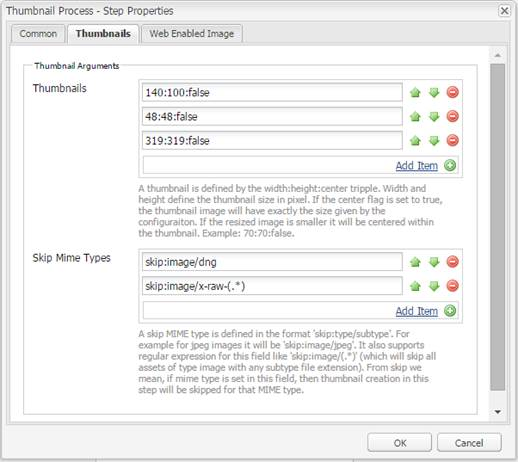

# Usa Camera Raw per elaborare le immagini {#camera-raw-support}

>[!CAUTION]
>
>AEM 6.4 ha raggiunto la fine del supporto esteso e questa documentazione non viene più aggiornata. Per maggiori dettagli, consulta la nostra [periodi di assistenza tecnica](https://helpx.adobe.com/it/support/programs/eol-matrix.html). Trova le versioni supportate [qui](https://experienceleague.adobe.com/docs/).

È possibile abilitare il supporto Camera Raw per elaborare formati di file non elaborati, come CR2, NEF e RAF, ed eseguire il rendering delle immagini in formato JPEG. La funzionalità è supportata in Adobe Experience Manager Assets tramite l’ [pacchetto Camera Raw](https://experience.adobe.com/#/downloads/content/software-distribution/en/aem.html?package=/content/software-distribution/en/details.html/content/dam/aem/public/adobe/packages/aem630/product/assets/aem-assets-cameraraw-pkg) disponibile da Distribuzione di software.

>[!NOTE]
>
>La funzionalità supporta solo rappresentazioni di JPEG. È supportato su Windows a 64 bit, Mac OS e RHEL 7.x.

Per abilitare il supporto Camera Raw in Adobe Experience Manager Assets, effettua le seguenti operazioni:

1. Scarica la [pacchetto Camera Raw](https://experience.adobe.com/#/downloads/content/software-distribution/en/aem.html?package=/content/software-distribution/en/details.html/content/dam/aem/public/adobe/packages/aem630/product/assets/aem-assets-cameraraw-pkg) dalla Distribuzione di software.

1. Accesso `https://[aem_server]:[port]/workflow`. Apri **[!UICONTROL Risorsa di aggiornamento DAM]** workflow.

1. Apri **[!UICONTROL Miniature del processo]** passo.

1. Fornisci la seguente configurazione nel **[!UICONTROL Miniature]** scheda:

   * **[!UICONTROL Miniature]**: `140:100:false, 48:48:false, 319:319:false`
   * **[!UICONTROL Ignora tipi MIME]**: `skip:image/dng, skip:image/x-raw-(.*)`

   

1. In **[!UICONTROL Immagine abilitata per il web]** nella scheda **[!UICONTROL Ignora elenco]** campo , specifica `audio/mpeg, video/(.*), image/dng, image/x-raw-(.*)`.

   

1. Dal pannello laterale, aggiungi la **[!UICONTROL Gestore Camera Raw/DNG]** sotto **[!UICONTROL Creazione di miniature]** passo.

1. In **[!UICONTROL Gestore Camera Raw/DNG]** aggiungi la seguente configurazione nel **[!UICONTROL Argomenti]** scheda:

   * **[!UICONTROL Tipi di mime]**: `image/dng` e `image/x-raw-(.*)`
   * **[!UICONTROL Comando]**:

      * `DAM_Raw_Converter ${directory}/${filename} ${directory} cq5dam.web.1280.1280.jpeg 1280 1280`
      * `DAM_Raw_Converter ${directory}/${filename} ${directory} cq5dam.thumbnail.319.319.jpeg 319 319`
      * `DAM_Raw_Converter ${directory}/${filename} ${directory} cq5dam.thumbnail.140.100.jpeg 140 100`
      * `DAM_Raw_Converter ${directory}/${filename} ${directory} cq5dam.thumbnail.48.48.jpeg 48 48`

   

1. Fai clic su **[!UICONTROL Salva]**.

>[!NOTE]
>
>Assicurati che la configurazione di cui sopra sia la stessa del **[!UICONTROL Esempio di risorsa di aggiornamento DAM con passaggio di gestione Camera Raw e DNG]** configurazione.

È ora possibile importare file non elaborati della fotocamera in [!DNL Experience Manager] Risorse. Dopo aver installato il pacchetto Camera Raw e configurato il flusso di lavoro richiesto, **[!UICONTROL Regolazione immagine]** nell’elenco dei riquadri laterali viene visualizzata l’opzione .

*Figura: Opzioni nel riquadro laterale*

*Figura: Utilizza l’opzione per apportare modifiche leggere alle immagini*

Dopo aver salvato le modifiche a un&#39;immagine Camera Raw, viene eseguito un nuovo rendering `AdjustedPreview.jpg` viene generato per l’immagine. Per altri tipi di immagini, tranne Camera Raw, le modifiche vengono applicate a tutte le rappresentazioni.

## Best practice, problemi noti e limitazioni {#best-practices}

La funzionalità presenta le seguenti limitazioni:

* La funzionalità supporta solo rappresentazioni di JPEG. È supportato su Windows a 64 bit, Mac OS e RHEL 7.x.
* Il write-back di metadati non è supportato per i formati RAW e DNG.
* La libreria Camera Raw presenta limitazioni rispetto ai pixel totali che può elaborare alla volta. Attualmente, può elaborare un massimo di 65000 pixel sul lato lungo di un file o 512 MP qualunque sia il criterio che viene rilevato per primo.
