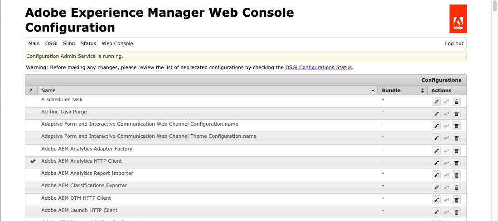

# Configurazione di Dynamic Media - Modalità Scene7 {#configuring-dynamic-media-scene-mode}

>[!CAUTION]
>
>AEM 6.4 ha raggiunto la fine del supporto esteso e questa documentazione non viene più aggiornata. Per maggiori dettagli, consulta la nostra [periodi di assistenza tecnica](https://helpx.adobe.com/it/support/programs/eol-matrix.html). Trova le versioni supportate [qui](https://experienceleague.adobe.com/docs/).

Se utilizzi Adobe Experience Manager configurato per ambienti diversi, ad esempio sviluppo, staging e produzione live, devi configurare Cloud Services Dynamic Media per ogni ambiente.

## Diagramma dell&#39;architettura di Dynamic Media - Modalità Scene7 {#architecture-diagram-of-dynamic-media-scene-mode}

Il diagramma dell&#39;architettura seguente descrive il funzionamento della modalità Dynamic Media - Scene7.

Con la nuova architettura, Experience Manager è responsabile delle risorse primarie e delle sincronizzazioni con Dynamic Media per l’elaborazione e la pubblicazione delle risorse:

1. Quando la risorsa principale viene caricata in Experience Manager, viene replicata in Dynamic Media. A questo punto, Dynamic Media gestisce l’elaborazione e la generazione di rendering delle risorse, ad esempio la codifica video e le varianti dinamiche di un’immagine.
1. Dopo la generazione dei rendering, Experience Manager può accedere in modo sicuro e visualizzare in anteprima i rendering Dynamic Media remoti (nessun file binario viene inviato nuovamente all’istanza di Experience Manager).
1. Quando il contenuto è pronto per essere pubblicato e approvato, attiva il servizio Dynamic Media per inviare contenuti ai server di consegna e memorizzare in cache il contenuto nella rete CDN.


## Abilitazione di Dynamic Media in modalità Scene7 {#enabling-dynamic-media-in-scene-mode}

[Dynamic Media](https://www.adobe.com/marketing-cloud/enterprise-content-management/dynamic-media.html) è disabilitata per impostazione predefinita. Per sfruttare le funzionalità di Dynamic Media, è necessario abilitarle.

>[!WARNING]
>
>Dynamic Media - La modalità Scene7 è per *Solo istanza di authoring di Experience Manager*. Di conseguenza, configura `runmode=dynamicmedia_scene7`sull’istanza di authoring di Experience Manager, *not* l’istanza Publish di Experience Manager.

Per abilitare Dynamic Media, è necessario avviare Experience Manager utilizzando `dynamicmedia_scene7` modalità di esecuzione dalla riga di comando immettendo quanto segue in una finestra terminale (la porta di esempio utilizzata è 4502):

```shell
java -Xms4096m -Xmx4096m -Doak.queryLimitInMemory=500000 -Doak.queryLimitReads=500000 -jar cq-quickstart-6.4.0.jar -gui -r author,dynamicmedia_scene7 -p 4502
```

## (Facoltativo) Migrazione di predefiniti e configurazioni Dynamic Media da 6.3 a 6.4 Zero Downtime {#optional-migrating-dynamic-media-presets-and-configurations-from-to-zero-downtime}

Se aggiorni Experience Manager Dynamic Media dalla versione 6.3 alla versione 6.4 (che include la possibilità di eseguire nessuna implementazione di inattività), esegui il seguente comando curl per migrare tutti i predefiniti e le configurazioni da `/etc` a `/conf` in CRXDE Lite.

>[!NOTE]
>
>Se esegui l’istanza di Experience Manager in modalità di compatibilità, ovvero se hai installato il pacchetto di compatibilità, non è necessario eseguire questi comandi.

Per migrare i predefiniti e le configurazioni personalizzati da `/etc` a `/conf`, esegui il seguente comando curl Linux®:

`curl -u admin:admin http://localhost:4502/libs/settings/dam/dm/presets.migratedmcontent.json`

Per tutti gli aggiornamenti, con o senza il pacchetto di compatibilità, puoi copiare i predefiniti visualizzatore preconfigurati eseguendo il seguente comando:

`curl -u admin:admin http://localhost:4502/libs/settings/dam/dm/presets/viewer.pushviewerpresets`

## (Facoltativo) Installazione del feature pack 18912 per la migrazione di massa delle risorse {#installing-feature-pack}

Il Feature Pack 18912 consente di caricare in massa le risorse tramite FTP oppure di migrare, ad Experience Manager, le risorse da Dynamic Media - Modalità ibrida o Dynamic Media Classic in modalità Dynamic Media - Scene7. È disponibile da Adobe Professional Services.

Vedi [Installazione del feature pack 18912 per la migrazione di massa delle risorse](bulk-ingest-migrate.md) per ulteriori informazioni.

## Configurazione dei Cloud Services Dynamic Media {#configuring-dynamic-media-cloud-services}

Modificare la password prima di configurare Cloud Services Dynamic Media. Dopo aver ricevuto l&#39;e-mail di provisioning con le credenziali Dynamic Media, devi [accedere](https://experienceleague.adobe.com/docs/dynamic-media-classic/using/intro/dynamic-media-classic-desktop-app.html#system-requirements-dmc-app) all&#39;applicazione desktop Dynamic Media Classic per modificare la password. La password fornita nell&#39;e-mail di provisioning è generata dal sistema e destinata solo a essere una password temporanea. È importante aggiornare la password in modo che il Cloud Service Dynamic Media sia configurato con le credenziali corrette.

>[!NOTE]
>
>Per impostazione predefinita, il percorso di configurazione per i Cloud Services è `/content/dam`. Qualsiasi altro percorso di configurazione non è supportato dalla modalità Dynamic Media - Scene7.

**Per configurare Cloud Services Dynamic Media:**

1. Nell’istanza di authoring di Experience Manager, tocca il logo Experience Manager per accedere alla console di navigazione globale e tocca l’icona Strumenti , quindi tocca **[!UICONTROL Cloud Services]** > **[!UICONTROL Configurazione Dynamic Media]**.
1. Nella pagina Browser configurazione Dynamic Media, nel riquadro a sinistra, tocca **[!UICONTROL globale]** e toccare **[!UICONTROL Crea]**. Non toccare o selezionare l’icona della cartella a sinistra di [!UICONTROL globale].
1. Sulla [!UICONTROL Crea configurazione Dynamic Media] , inserisci un titolo, l’indirizzo e-mail e la password dell’account Dynamic Media. Seleziona la tua area geografica. Queste informazioni vengono fornite per Adobe nel messaggio e-mail di provisioning. Se non hai ricevuto l’e-mail, contatta l’Assistenza clienti di Adobe.

   Tocca **[!UICONTROL Connessione a Dynamic Media]**.

   >[!NOTE]
   >
   >Dopo aver ricevuto l’e-mail di provisioning con le credenziali Dynamic Media, apri la [applicazione desktop Dynamic Media Classic](https://experienceleague.adobe.com/docs/dynamic-media-classic/using/getting-started/signing-out.html#getting-started), quindi accedi al tuo account aziendale per modificare la tua password. La password fornita nell&#39;e-mail di provisioning è generata dal sistema e destinata solo a essere una password temporanea. È importante aggiornare la password in modo che il Cloud Service Dynamic Media sia configurato con le credenziali corrette.

1. Se la connessione ha esito positivo, puoi anche impostare quanto segue:

   * **[!UICONTROL Azienda]** - il nome dell&#39;account Dynamic Media.

      >[!IMPORTANT]
      >
      >In un’istanza di Experience Manager è supportata una sola configurazione Dynamic Media in Cloud Services; non aggiungere più di una configurazione. Configurazioni Dynamic Media multiple su un&#39;istanza di Experience Manager è *not* supportato o consigliato dall’Adobe.<!-- CQDOC-19579 and CQDOC-19612 -->
   * **[!UICONTROL Percorso cartella principale della società]** - Percorso della cartella principale della tua azienda.
   * **[!UICONTROL Pubblicazione delle risorse]** - l&#39;opzione **[!UICONTROL Immediatamente]** significa che quando le risorse vengono caricate, il sistema le acquisisce e fornisce l’URL/da incorporare immediatamente. Non è necessario alcun intervento degli utenti per pubblicare le risorse. Opzione **[!UICONTROL All&#39;attivazione]** significa che devi pubblicare esplicitamente la risorsa prima prima di fornire un collegamento URL/Incorpora .
   * **[!UICONTROL Server di anteprima protetto]** - consente di specificare il percorso URL del server di anteprima delle rappresentazioni protette. In altre parole, dopo la generazione delle rappresentazioni, Experience Manager può accedere in modo sicuro e visualizzare in anteprima le rappresentazioni Dynamic Media remote (nessun file binario viene inviato nuovamente all’istanza di Experience Manager).

      A meno che non si disponga di una disposizione speciale per utilizzare il server della propria azienda o un server speciale, Adobe consiglia di utilizzare l&#39;impostazione predefinita.
   >[!NOTE]
   >
   >In DMS7 non è supportato il controllo delle versioni. Inoltre, l’attivazione ritardata si applica solo se l’opzione **[!UICONTROL Pubblica risorse]** della pagina Modifica configurazione Dynamic Media è impostata su **[!UICONTROL All’attivazione]** e soltanto fino alla prima attivazione della risorsa.
   >
   >Dopo l’attivazione di una risorsa, tutti gli aggiornamenti vengono immediatamente pubblicati in tempo reale su S7 Delivery.

   

1. Tocca **[!UICONTROL Salva]**.
1. Per visualizzare in anteprima in modo sicuro il contenuto Dynamic Media prima della pubblicazione, è necessario &quot;inserire nell&#39;elenco Consentiti&quot; l’istanza di authoring di Experience Manager per connettersi a Dynamic Media:

   * Apri [applicazione desktop Dynamic Media Classic](https://experienceleague.adobe.com/docs/dynamic-media-classic/using/getting-started/signing-out.html#getting-started), quindi accedi al tuo account. Le credenziali e i dettagli di accesso sono stati forniti da Adobe al momento del provisioning. Se non si dispone di tali informazioni, contattare il supporto tecnico.
   * Nella barra di navigazione in alto a destra della pagina, tocca **[!UICONTROL Configurazione]** > **[!UICONTROL Impostazione applicazione]** > **[!UICONTROL Pubblica installazione]** > **[!UICONTROL Server immagini]**.
   * Nella pagina Pubblica su Image Server, seleziona l’elenco a discesa Contesto pubblicazione **[!UICONTROL Test Image Serving]**.
   * Per il filtro indirizzi client, tocca **[!UICONTROL Aggiungi]**.
   * Per abilitare (attivare) l’indirizzo, selezionare la casella di controllo. Immetti l’indirizzo IP dell’istanza di authoring di Experience Manager (non dell’IP di Dispatcher).
   * Tocca **[!UICONTROL Salva]**.

La configurazione di base è terminata. è possibile utilizzare la modalità Dynamic Media - Scene7.

Se desideri personalizzare ulteriormente la configurazione, puoi facoltativamente completare una qualsiasi delle attività in [(Facoltativo) Configurazione delle impostazioni avanzate in modalità Dynamic Media - Scene7](#optional-configuring-advanced-settings-in-dynamic-media-scene-mode).

## (Facoltativo) Configurazione delle impostazioni avanzate in modalità Dynamic Media - Scene7 {#optional-configuring-advanced-settings-in-dynamic-media-scene-mode}

Se desideri personalizzare ulteriormente la configurazione e l’impostazione della modalità Dynamic Media - Scene7 o ottimizzarne le prestazioni, puoi completare una o più delle seguenti attività facoltative:

* [(Facoltativo) Configurazione e configurazione di Dynamic Media - Impostazioni della modalità Scene7](#optional-setup-and-configuration-of-dynamic-media-scene-mode-settings-p)

* [(Facoltativo) Ottimizzazione delle prestazioni di Dynamic Media - Modalità Scene7](#optional-tuning-the-performance-of-dynamic-media-scene-mode)
* [(Facoltativo) Filtraggio delle risorse per la replica](#optional-filtering-assets-for-replication)

### (Facoltativo) Configurazione e configurazione di Dynamic Media - Impostazioni della modalità Scene7</p> {#optional-setup-and-configuration-of-dynamic-media-scene-mode-settings-p}

Quando sei in **dynamicmedia_scene7** in modalità di esecuzione, è possibile utilizzare l&#39;interfaccia utente di Dynamic Media Classic per modificare le impostazioni di Dynamic Media.

Per alcune delle attività di cui sopra è necessario aprire la [applicazione desktop Dynamic Media Classic](https://experienceleague.adobe.com/docs/dynamic-media-classic/using/getting-started/signing-out.html#getting-started), quindi accedi al tuo account.

Le attività di configurazione e configurazione sono:

* [Configurazione pubblicazione per Image Server](#publishing-setup-for-image-server)
* [Configurazione delle impostazioni generali dell&#39;applicazione](#configuring-application-general-settings)
* [Configurazione della gestione del colore](#configuring-color-management)
* [Modifica dei tipi MIME per i formati supportati](#editing-mime-types-for-supported-formats)
* [Aggiunta di tipi MIME per i formati non supportati](#adding-mime-types-for-unsupported-formats)
* [Creazione di predefiniti per set di batch per generare automaticamente set di immagini e set 360 gradi](#creating-batch-set-presets-to-auto-generate-image-sets-and-spin-sets)

#### Configurazione pubblicazione per Image Server {#publishing-setup-for-image-server}

Le impostazioni di Configurazione pubblicazione determinano il modo in cui le risorse vengono distribuite per impostazione predefinita da Dynamic Media. Se non viene specificata alcuna impostazione, Dynamic Media distribuisce una risorsa in base alle impostazioni predefinite definite in Configurazione pubblicazione. Ad esempio, una richiesta di fornire un’immagine che non include un attributo di risoluzione genera un’immagine con l’impostazione Risoluzione oggetto predefinita.

Per configurare l&#39;impostazione di pubblicazione: in Dynamic Media Classic, tocca **[!UICONTROL Configurazione]** > **[!UICONTROL Impostazione applicazione]** > **[!UICONTROL Pubblica installazione]** > **[!UICONTROL Server immagini]**.

La schermata Image Server stabilisce le impostazioni predefinite per la distribuzione delle immagini. Per una descrizione di ciascuna impostazione, consulta l’interfaccia utente .

* **[!UICONTROL Attributi della richiesta]** - Queste impostazioni impongono limiti alle immagini che possono essere consegnate dal server.
* **[!UICONTROL Attributi di richiesta predefiniti]** - Queste impostazioni riguardano l&#39;aspetto predefinito delle immagini.
* **[!UICONTROL Attributi comuni delle miniature]** - Queste impostazioni riguardano l&#39;aspetto predefinito delle immagini in miniatura.
* **[!UICONTROL Valori predefiniti per i campi del catalogo]** - Queste impostazioni si riferiscono alla risoluzione e al tipo di miniatura predefinita delle immagini.
* **[!UICONTROL Attributi di gestione del colore]** - Queste impostazioni determinano quali profili di colore ICC vengono utilizzati.
* **[!UICONTROL Attributi di compatibilità]** - Questa impostazione consente di trattare i paragrafi iniziali e finali nei livelli di testo come nella versione 3.6 per garantire la compatibilità con le versioni precedenti.
* **[!UICONTROL Supporto per la localizzazione]** - Queste impostazioni consentono di gestire più attributi internazionali. Consente inoltre di specificare una stringa di mappa delle impostazioni internazionali in modo da definire le lingue che si desidera supportare per le varie descrizioni a comparsa nei visualizzatori. Per ulteriori informazioni sulla configurazione del supporto per la localizzazione, vedi [Considerazioni importanti durante l’implementazione del supporto per la localizzazione](https://experienceleague.adobe.com/docs/dynamic-media-classic/using/setup/publish-setup.html#image-server).

#### Configurazione delle impostazioni generali dell&#39;applicazione {#configuring-application-general-settings}

Per aprire [!UICONTROL Impostazioni generali dell&#39;applicazione] nella barra di navigazione globale di Dynamic Media Classic, tocca **[!UICONTROL Configurazione]** > **[!UICONTROL Impostazione applicazione]** > **[!UICONTROL Impostazioni generali]**.

**[!UICONTROL Server]** - Al momento del provisioning dell’account, Dynamic Media fornisce automaticamente i server assegnati alla tua azienda. Questi server vengono utilizzati per creare stringhe URL per il sito Web e le applicazioni. Queste chiamate URL sono specifiche del tuo account. Non modificare nessuno dei nomi dei server, a meno che non venga esplicitamente richiesto dal supporto Experience Manager.

**[!UICONTROL Sovrascrivi immagini]** - Dynamic Media non consente a due file di avere lo stesso nome. L&#39;ID URL di ogni elemento (il nome del file meno l&#39;estensione) deve essere univoco. Queste opzioni specificano come vengono caricate le risorse sostitutive: se sostituiscono l&#39;originale o diventano duplicati. Le risorse duplicate vengono rinominate con un &quot;-1&quot; (ad esempio, chair.tif viene rinominato chair-1.tif). Queste opzioni interessano le risorse caricate in una cartella diversa dall’originale o le risorse con un’estensione di nome file diversa dall’originale (ad esempio JPG, TIF o PNG).

* **[!UICONTROL Sovrascrivi nella cartella corrente, nome/estensione dell&#39;immagine di base]** - Questa opzione è la regola più rigida per la sostituzione. Richiede di caricare l&#39;immagine di sostituzione nella stessa cartella dell&#39;originale e che l&#39;immagine di sostituzione abbia la stessa estensione del nome file dell&#39;originale. Se tali requisiti non sono soddisfatti, viene creato un duplicato.

>[!NOTE]
>
>Per mantenere la coerenza con l’Experience Manager, seleziona **[!UICONTROL Sovrascrivi nella cartella corrente, nome/estensione dell&#39;immagine di base]**.

* **[!UICONTROL Sovrascrivi in qualsiasi cartella, stesso nome/estensione della risorsa di base]** - Richiede che l&#39;immagine sostitutiva abbia la stessa estensione del nome del file dell&#39;immagine originale (ad esempio, `chair.jpg` sostituisce `chair.jpg` e non `chair.tif`). Tuttavia, puoi caricare l’immagine di sostituzione in una cartella diversa dall’originale. L&#39;immagine aggiornata si trova nella nuova cartella; non è più possibile trovare il file nella posizione originale.
* **[!UICONTROL Sovrascrivi in qualsiasi cartella, lo stesso nome della risorsa di base indipendentemente dall’estensione]** - Questa opzione è la regola di sostituzione più inclusiva. Puoi caricare un’immagine sostitutiva in una cartella diversa dall’originale, caricare un file con un’estensione diversa del nome del file e sostituire il file originale. Se il file originale si trova in una cartella diversa, l&#39;immagine sostitutiva si trova nella nuova cartella in cui è stata caricata.

**[!UICONTROL Profili colore predefiniti]** - Vedi [Configurazione della gestione del colore](#configuring-color-management) per ulteriori informazioni.

>[!NOTE]
>
>Per impostazione predefinita, il sistema mostra 15 rappresentazioni quando selezioni **[!UICONTROL Rappresentazioni]** e 15 predefiniti visualizzatore quando fai clic su **[!UICONTROL Visualizzatori]** nella vista Dettaglio della risorsa. Puoi aumentare questo limite. Vedi [Aumento del numero di predefiniti immagine da visualizzare](managing-image-presets.md#increasing-or-decreasing-the-number-of-image-presets-that-display) o [Aumento del numero di predefiniti visualizzatore](managing-viewer-presets.md#increasing-the-number-of-viewer-presets-that-display).

#### Configurazione della gestione del colore {#configuring-color-management}

La gestione del colore dei contenuti multimediali dinamici consente di colorare le risorse corrette. Con la correzione del colore, le risorse acquisite mantengono lo spazio colore (RGB, CMYK, Grigio) e il profilo colore incorporato. Quando si richiede un rendering dinamico, il colore dell&#39;immagine viene corretto nello spazio colore di destinazione utilizzando l&#39;output CMYK, RGB o Grigio. Vedi [Configurazione dei predefiniti per immagini](managing-image-presets.md).

**Per configurare le proprietà colore predefinite per abilitare la correzione del colore durante la richiesta delle immagini:**

1. Apri [applicazione desktop Dynamic Media Classic](https://experienceleague.adobe.com/docs/dynamic-media-classic/using/getting-started/signing-out.html#getting-started), quindi accedi al tuo account utilizzando le credenziali fornite durante il provisioning. Passa a **[!UICONTROL Configurazione]** > **[!UICONTROL Impostazione applicazione]**.
1. Espandi l’area **[!UICONTROL Publish Setup (Impostazione pubblicazione)]** e seleziona **[!UICONTROL Image Server]**. Per le istanze di pubblicazione, imposta **[!UICONTROL Contesto di pubblicazione]** su **[!UICONTROL Image Server]**.
1. Scorri fino alla proprietà da modificare. Ad esempio, una proprietà in **[!UICONTROL Attributi di gestione del colore]** area.

   È possibile impostare le seguenti proprietà di correzione del colore:

   * [!UICONTROL Spazio colore predefinito CMYK] - Nome del profilo colore CMYK predefinito
   * [!UICONTROL Spazio colore predefinito su scala di grigi] - Nome del profilo colore grigio predefinito
   * [!UICONTROL Spazio colore predefinito di RGB] - Nome del profilo colore predefinito di RGB
   * [!UICONTROL Intento di rendering della conversione del colore] - Specifica l&#39;intento di rendering. I valori accettabili sono `perceptual`, `relative` `colometric`, `saturation`e `absolute colometric`. L&#39;Adobe raccomanda `relative` come impostazione predefinita.

1. Tocca **[!UICONTROL Salva]**.

Ad esempio, puoi impostare **[!UICONTROL Spazio colore predefinito RGB]** su `sRGB` e **[!UICONTROL Spazio colore predefinito CMYK]** su `WebCoated`.

In questo modo si effettua quanto segue:

* Abilita la correzione del colore per le immagini RGB e CMYK.
* Si presume che le immagini di RGB prive di un profilo colore siano presenti nel `sRGB` spazio colore.
* Si presume che le immagini CMYK prive di un profilo colore siano in `WebCoated` spazio colore.
* Rendering dinamico che restituisce l’output di RGB, lo restituisce nel `sRGB` spazio colore.
* Rendering dinamici che restituiscono l’output CMYK, lo restituisce nel `WebCoated` spazio colore.

#### Modifica dei tipi MIME per i formati supportati {#editing-mime-types-for-supported-formats}

Puoi definire quali tipi di risorse vengono elaborati da Dynamic Media e personalizzare parametri avanzati di elaborazione delle risorse. Ad esempio, puoi specificare i parametri di elaborazione delle risorse per effettuare le seguenti operazioni:

* Converti un Adobe PDF in una risorsa eCatalog.
* Converti un documento Adobe Photoshop (.PSD) in una risorsa modello banner per la personalizzazione.
* Rasterizza un file Adobe Illustrator (.AI) o un file di PostScript® incapsulato Adobe Photoshop (.EPS).
* [Profili video](/help/assets/video-profiles.md) e [Profili immagine](/help/assets/image-profiles.md) può essere utilizzato rispettivamente per definire l’elaborazione di video e immagini.

Vedi [Caricamento delle risorse](managing-assets-touch-ui.md#uploading-assets).

**Per modificare i tipi di mime per i formati supportati:**

1. Ad Experience Manager, tocca il logo Experience Manager per accedere alla console di navigazione globale, quindi tocca il **[!UICONTROL Strumenti]** (martello) e passa a **[!UICONTROL Generale]** > **[!UICONTROL CRXDE Lite]**.
1. Nella barra a sinistra, passa a quanto segue:

   `/conf/global/settings/cloudconfigs/dmscene7/jcr:content/mimeTypes`

   

1. Sotto la `mimeTypes` seleziona un tipo di mime.
1. Sul lato destro della pagina CRXDE Lite, nella parte inferiore:

   * fai doppio clic sul pulsante **[!UICONTROL abilitato]** campo . Per impostazione predefinita, tutti i tipi di MIME delle risorse sono abilitati (impostati su **[!UICONTROL true]**), il che significa che le risorse vengono sincronizzate in Dynamic Media per l’elaborazione. Per escludere l’elaborazione di questo tipo di MIME delle risorse, modifica questa impostazione in **[!UICONTROL false]**.
   * doppio clic **[!UICONTROL jobParam]** per aprire il relativo campo di testo associato. Vedi [Tipi mime supportati](assets-formats.md#supported-mime-types) per un elenco dei valori dei parametri di elaborazione consentiti che è possibile utilizzare per un determinato tipo di MIME.

1. Effettua una delle operazioni seguenti:

   * Ripeti i passaggi 3-4 per modificare altri tipi di mime.
   * Nella barra dei menu della pagina CRXDE Lite, tocca **[!UICONTROL Salva tutto]**.

1. Nell’angolo in alto a sinistra della pagina, tocca **[!UICONTROL CRXDE Lite]** per tornare all&#39;Experience Manager.

#### Aggiunta di tipi MIME personalizzati per i formati non supportati {#adding-custom-mime-types-for-unsupported-formats}

In Experience Manager Assets puoi aggiungere tipi MIME personalizzati per i formati non supportati. Per fare in modo che qualsiasi nuovo nodo aggiunto in CRXDE Lite non venga eliminato ad Experience Manager, sposta il tipo MIME prima di **[!UICONTROL image_]** e il relativo valore abilitato è impostato su **[!UICONTROL false]**.

**Per aggiungere tipi MIME personalizzati per i formati non supportati:**

1. Ad Experience Manager, fai clic su **[!UICONTROL Strumenti]** > **[!UICONTROL Operazioni]** > **[!UICONTROL Console web]**.

   

1. Viene visualizzata una nuova scheda del browser **[!UICONTROL Configurazione della console Web di Adobe Experience Manager]** pagina.

   

1. Nella pagina , scorri verso il basso fino al nome **[!UICONTROL Servizio Adobe CQ Scene7 Asset MIME type]**. A destra del nome, tocca **[!UICONTROL Modifica i valori di configurazione]** (icona a forma di matita).

   

1. Sulla **[!UICONTROL Servizio Adobe CQ Scene7 Asset MIME type]** pagina, fai clic sull’icona del segno più `+`. La posizione nella tabella in cui fai clic sul segno più per aggiungere il nuovo tipo di MIME è insignificante.

   

1. Tipo `DWG=image/vnd.dwg` nel campo di testo vuoto appena aggiunto.

   L&#39;esempio `DWG=image/vnd.dwg` è solo a scopo dimostrativo. Il tipo MIME che aggiungi qui può essere qualsiasi altro formato non supportato.

   

1. Nell’angolo inferiore destro della pagina, fai clic su **[!UICONTROL Salva]**.

   A questo punto, è possibile chiudere la scheda del browser con la pagina di configurazione della console Web di Adobe Experience Manager aperta.

1. Torna alla scheda del browser con la console di Experience Manager aperta.

1. Ad Experience Manager, fai clic su **[!UICONTROL Strumenti]** > **[!UICONTROL Generale]** > **[!UICONTROL CRXDE Lite]**.

   

1. Nella barra a sinistra, passa a quanto segue:

   `conf/global/settings/cloudconfigs/dmscene7/jcr:content/mimeTypes`

1. Trascina il tipo di mime `image_vnd.dwg` e rilasciarlo direttamente sopra `image_` nell&#39;albero.

   

1. Con il tipo mime `image_vnd.dwg` ancora selezionato nell&#39;albero, dal **[!UICONTROL Proprietà]** nella scheda **[!UICONTROL abilitato]** riga, sotto **[!UICONTROL Valore]** intestazione di colonna, fai doppio clic sul valore per aprire la **[!UICONTROL Valore]** elenco a discesa.

1. Tipo `false` nel campo (o seleziona `false` dall’elenco a discesa).

   

1. Fai clic su nell’angolo in alto a sinistra della pagina CRXDE Lite **[!UICONTROL Salva tutto]**.

#### Creazione di predefiniti per set di batch per generare automaticamente set di immagini e set 360 gradi {#creating-batch-set-presets-to-auto-generate-image-sets-and-spin-sets}

Utilizza i predefiniti per set di batch per automatizzare la creazione di set di immagini o set 360 gradi durante il caricamento delle risorse in Dynamic Media.

Innanzitutto, definisci la convenzione di denominazione per il raggruppamento delle risorse in un set. Puoi quindi creare un set di batch predefinito, denominato in modo univoco e autonomo, che definisce come creare il set utilizzando immagini che corrispondono alle convenzioni di denominazione definite nella ricetta preimpostata.

Quando carichi dei file, Dynamic Media crea automaticamente un set con tutti i file che corrispondono alla convenzione di denominazione definita nei predefiniti attivi.

**Configurazione della denominazione predefinita**

Crea una convenzione di denominazione predefinita utilizzata in qualsiasi ricetta predefinita per set di batch. La convenzione di denominazione predefinita selezionata nella definizione dei predefiniti per set di batch è probabilmente tutto ciò di cui la tua azienda ha bisogno per generare i set di batch. Viene creato un predefinito per set di batch per utilizzare la convenzione di denominazione predefinita definita dall’utente. È possibile creare un numero illimitato di predefiniti per set di batch con convenzioni di denominazione alternative e personalizzate necessarie per un determinato set di contenuti nei casi in cui vi sia un’eccezione alla denominazione predefinita definita dall’azienda.

Sebbene non sia necessario impostare una convenzione di denominazione predefinita per utilizzare le funzionalità di preimpostazione di set di batch, è possibile utilizzarla per definire tutti gli elementi della convenzione di denominazione che si desidera raggruppare in un set. In questo modo è possibile semplificare la creazione dei set di batch.

In alternativa, puoi utilizzare **[!UICONTROL Visualizza codice]** senza campi modulo disponibili. In questa visualizzazione puoi creare le definizioni delle convenzioni di denominazione utilizzando esclusivamente espressioni regolari.

Sono disponibili due elementi per definizione, **[!UICONTROL Corrispondenza]** e **[!UICONTROL Nome base]**. Questi campi consentono di definire tutti gli elementi di una convenzione di denominazione e identificare la parte della convenzione utilizzata per denominare il set in cui sono contenuti. La convenzione di denominazione individuale di un’azienda può utilizzare una o più righe di definizione per ciascuno di questi elementi. Utilizza altrettante righe per la tua definizione univoca e raggruppatele in elementi distinti. Ad esempio, Immagine principale, elemento colore, elemento visualizzazione alternativa e elemento campione.

**Per configurare la denominazione predefinita:**

1. Apri [applicazione desktop Dynamic Media Classic](https://experienceleague.adobe.com/docs/dynamic-media-classic/using/getting-started/signing-out.html#getting-started), quindi accedi al tuo account.

   Le credenziali e i dettagli di accesso sono stati forniti da Adobe al momento del provisioning. Se non si dispone di tali informazioni, contattare il supporto tecnico.

1. Nella barra di navigazione vicino alla parte superiore della pagina, tocca **[!UICONTROL Configurazione]** > **[!UICONTROL Impostazione applicazione]** > **[!UICONTROL Predefiniti set di batch]** > **[!UICONTROL Denominazione predefinita]**.
1. Per specificare come visualizzare e immettere le informazioni di ciascun elemento, seleziona **[!UICONTROL Visualizza modulo]** o **[!UICONTROL Visualizza codice]**.

   È possibile selezionare la **[!UICONTROL Visualizza codice]** casella di controllo per visualizzare la creazione del valore dell’espressione regolare accanto alle selezioni del modulo. È possibile immettere o modificare questi valori per definire gli elementi della convenzione di denominazione, se la visualizzazione del modulo vi limita per qualsiasi motivo. Se i valori non possono essere analizzati nella visualizzazione modulo, i campi modulo diventano inattivi.

   >[!NOTE]
   >
   >I campi modulo disattivati non eseguono alcuna convalida per verificare che le espressioni regolari siano corrette. Vengono visualizzati i risultati dell’espressione regolare che si sta creando per ogni elemento dopo la riga Risultato. L’espressione regolare completa è visibile nella parte inferiore della pagina.

1. Espandi ogni elemento in base alle esigenze e immetti le convenzioni di denominazione che desideri utilizzare.
1. Se necessario, effettuare una delle seguenti operazioni:

   * Tocca **[!UICONTROL Aggiungi]** per aggiungere un’altra convenzione di denominazione per un elemento.
   * Tocca **[!UICONTROL Rimuovi]** per eliminare una convenzione di denominazione per un elemento.

1. Effettua una delle operazioni seguenti:

   * Tocca **[!UICONTROL Salva con nome]** e digita un nome per il predefinito.
   * Tocca **[!UICONTROL Salva]** se stai modificando un predefinito esistente.

**Creazione di un predefinito per set di batch**

Dynamic Media utilizza i predefiniti per set di batch per organizzare le risorse in set di immagini (immagini alternative, opzioni colore, 360 giri) da visualizzare nei visualizzatori. I predefiniti per set di batch vengono eseguiti automaticamente insieme ai processi di caricamento delle risorse in Dynamic Media.

Puoi creare, modificare e gestire i predefiniti per set di batch. Esistono due forme di definizioni di predefiniti per set di batch: uno per una convenzione di denominazione predefinita impostata e uno per convenzioni di denominazione personalizzate create al volo.

È possibile utilizzare il metodo campo modulo per definire un predefinito per set di batch o il metodo del codice, che consente di utilizzare espressioni regolari. Come in Denominazione predefinita, puoi scegliere [!UICONTROL Visualizza codice] allo stesso tempo definisci nel [!UICONTROL Visualizzazione a forma di modulo] e utilizza espressioni regolari per creare le definizioni. In alternativa, puoi deselezionare entrambe le visualizzazioni per utilizzare esclusivamente l’una o l’altra.

**Per creare un predefinito per set di batch:**

1. Apri [applicazione desktop Dynamic Media Classic](https://experienceleague.adobe.com/docs/dynamic-media-classic/using/getting-started/signing-out.html#getting-started), quindi accedi al tuo account.

   Le credenziali e i dettagli di accesso sono stati forniti da Adobe al momento del provisioning. Se non si dispone di tali informazioni, contattare il supporto tecnico.

1. Nella barra di navigazione vicino alla parte superiore della pagina, tocca **[!UICONTROL Configurazione]** > **[!UICONTROL Impostazione applicazione]** > **[!UICONTROL Predefiniti set di batch]** > **[!UICONTROL Preimpostazione set di batch]**.

   [!UICONTROL Visualizza modulo], nell&#39;angolo superiore destro del [!UICONTROL Dettagli] è la visualizzazione predefinita.

1. Nel pannello Elenco predefiniti, tocca **[!UICONTROL Aggiungi]** per attivare i campi di definizione nel **[!UICONTROL Dettagli]** sul lato destro dello schermo.
1. In **[!UICONTROL Dettagli]** nel pannello **[!UICONTROL Nome predefinito]** campo , digita un nome per il predefinito.
1. In **[!UICONTROL Tipo set di batch]** seleziona un tipo di predefinito dal menu a discesa.
1. Effettua una delle operazioni seguenti:

   * Se utilizzi una convenzione di denominazione predefinita impostata in precedenza in **[!UICONTROL Impostazione applicazione]** > **[!UICONTROL Predefiniti set di batch]** > **[!UICONTROL Denominazione predefinita]**, espandi **[!UICONTROL Convenzioni di denominazione delle risorse]** e quindi nella **[!UICONTROL Denominazione dei file]** elenco a discesa, tocca **[!UICONTROL Predefinito]**.
   * Per definire una nuova convenzione di denominazione durante la configurazione del predefinito, **[!UICONTROL Convenzioni di denominazione delle risorse]** e quindi nella **[!UICONTROL Denominazione dei file]** elenco a discesa, tocca **[!UICONTROL Personalizzato]**.

1. Per [!UICONTROL Ordine di sequenza], definisci l’ordine in cui vengono visualizzate le immagini dopo il raggruppamento del set in Dynamic Media.

   Per impostazione predefinita, le risorse vengono ordinate in modo alfanumerico. Tuttavia, per definire l’ordine è possibile utilizzare un elenco di espressioni regolari separate da virgola.

1. Per **[!UICONTROL Imposta denominazione]** e **[!UICONTROL Convenzione sulla creazione]**, specifica il suffisso o il prefisso al nome di base definito nella **[!UICONTROL Convenzione per la denominazione delle risorse]**. Inoltre, definisci dove viene creato il set all’interno della struttura di cartelle Dynamic Media.

   Se definisci un numero elevato di set, tenili separati dalle cartelle contenenti le risorse stesse. Ad esempio, crea una cartella Set di immagini e inserisci qui i set generati.

1. In **[!UICONTROL Dettagli]** pannello, tocco **[!UICONTROL Salva]**.
1. Tocca **[!UICONTROL Attivo]** accanto al nuovo nome predefinito.

   L’attivazione del predefinito assicura che quando carichi le risorse in Dynamic Media, il Batch Set Preset venga applicato per generare il set.

**Creazione di un set di batch predefinito per la generazione automatica di un set 360 gradi 2D**

È possibile utilizzare il tipo di set di batch **[!UICONTROL Set 360 gradi con più assi]** per creare una ricetta che automatizza la generazione di set 360 gradi 2D. Il raggruppamento delle immagini utilizza espressioni regolari Riga e Colonna in modo che le risorse immagine siano correttamente allineate nella posizione corrispondente nell’array multidimensionale. Non esiste un numero minimo o massimo di righe o colonne che è necessario avere in un set 360 gradi a più assi.

Ad esempio, supponi di voler creare un set 360 gradi con più assi denominato `spin-2dspin`. Hai un set di immagini per set 360 gradi che contengono tre righe, con 12 immagini per riga. Le immagini vengono denominate come segue:

```
spin-01-01 
 spin-01-02 
 … 
 spin-01-12 
 spin-02-01 
 … 
 spin-03-12
```

Con queste informazioni, [!UICONTROL Tipo set di batch] la ricetta può essere creata come segue:


Il raggruppamento per la parte del nome della risorsa condivisa del set 360 gradi viene aggiunto al **[!UICONTROL Corrispondenza]** (come evidenziato). La parte variabile del nome della risorsa, contenente la riga e la colonna, viene aggiunta rispettivamente ai campi **[!UICONTROL Riga]** e **[!UICONTROL Colonna]**.

Quando il set 360 gradi viene caricato e pubblicato, si attiva il nome della ricetta del set 360 gradi 2D che è elencato in **[!UICONTROL Predefiniti set di batch]** in **[!UICONTROL Opzioni processo di caricamento]** finestra di dialogo.

**Per creare un Batch Set Preset per la generazione automatica di un Set 360 gradi 2D:**

1. Apri [applicazione desktop Dynamic Media Classic](https://experienceleague.adobe.com/docs/dynamic-media-classic/using/getting-started/signing-out.html#getting-started), quindi accedi al tuo account.

   Le credenziali e i dettagli di accesso sono stati forniti da Adobe al momento del provisioning. Se non si dispone di tali informazioni, contattare il supporto tecnico.

1. Nella barra di navigazione vicino alla parte superiore della pagina, tocca **[!UICONTROL Configurazione]** > **[!UICONTROL Impostazione applicazione]** > **[!UICONTROL Predefiniti set di batch]** > **[!UICONTROL Preimpostazione set di batch]**.

   [!UICONTROL Visualizza modulo], nell&#39;angolo superiore destro del [!UICONTROL Dettagli] è la visualizzazione predefinita.

1. In **[!UICONTROL Elenco predefiniti]** pannello, tocco **[!UICONTROL Aggiungi]** per attivare i campi di definizione nel **[!UICONTROL Dettagli]** sul lato destro dello schermo.
1. In **[!UICONTROL Dettagli]** nel pannello [!UICONTROL Nome predefinito] campo , digita un nome per il predefinito.
1. In **[!UICONTROL Tipo set di batch]** menu a discesa, seleziona **[!UICONTROL Set di risorse]**.
1. In **[!UICONTROL Sottotipo]** elenco a discesa, seleziona **[!UICONTROL Set 360 gradi con più assi]**.
1. Espandi **[!UICONTROL Convenzioni di denominazione delle risorse]** e quindi nella **[!UICONTROL Denominazione dei file]** elenco a discesa, tocca **[!UICONTROL Personalizzato]**.
1. Utilizza gli attributi **[!UICONTROL Match (Corrispondenza)]** e, facoltativamente, **[!UICONTROL Nome base]** per definire un’espressione regolare per la denominazione delle risorse dell’immagine che compongono il raggruppamento.

   Ad esempio, l’espressione regolare Corrispondenza letterale potrebbe avere l’aspetto seguente:

   `(w+)-w+-w+`

1. Espandi **[!UICONTROL Posizione colonna riga]**, quindi definisci il formato del nome per la posizione della risorsa immagine all’interno della matrice Set 360 gradi 2D.

   Utilizzare le parentesi per abbracciare la posizione della riga o della colonna nel nome del file.

   Ad esempio, per l’espressione regolare riga, potrebbe essere simile al seguente:

   `\w+-R([0-9]+)-\w+`

   oppure

   `\w+-(\d+)-\w+`

   Per l’espressione regolare della colonna, potrebbe essere simile al seguente:

   `\w+-\w+-C([0-9]+)`

   oppure

   `\w+-\w+-C(\d+)`

   Tieni presente che queste espressioni sono esempi solo a scopo dimostrativo. Puoi creare l’espressione regolare in base alle tue esigenze.

   >[!NOTE]
   >
   >Se la combinazione di espressioni regolari per riga e colonna non è in grado di determinare la posizione della risorsa all’interno della matrice del set 360 gradi multidimensionale, la risorsa non viene aggiunta al set e viene registrato un errore.

1. Per **[!UICONTROL Imposta denominazione]** e **[!UICONTROL Convenzione sulla creazione]**, specifica il suffisso o il prefisso al nome di base definito nella **[!UICONTROL Convenzione per la denominazione delle risorse]**.

   Inoltre, definisci dove viene creato il set 360 gradi all’interno della struttura delle cartelle Dynamic Media Classic.

   Se definisci un numero elevato di set, tenili separati dalle cartelle contenenti le risorse stesse. Ad esempio, crea una cartella Set 360 gradi in cui inserire i set generati.

1. In **[!UICONTROL Dettagli]** pannello, tocco **[!UICONTROL Salva]**.
1. Tocca **[!UICONTROL Attivo]** accanto al nuovo nome predefinito.

   L’attivazione del predefinito assicura che quando carichi le risorse in Dynamic Media, il Batch Set Preset venga applicato per generare il set.

### (Facoltativo) Ottimizzazione delle prestazioni di Dynamic Media - Modalità Scene7 {#optional-tuning-the-performance-of-dynamic-media-scene-mode}

Per mantenere la modalità Dynamic Media - Scene7 in esecuzione senza problemi, l&#39;Adobe consiglia i seguenti suggerimenti per l&#39;ottimizzazione delle prestazioni/della scalabilità di sincronizzazione:

* Aggiornamento dei parametri di processo predefiniti per l&#39;elaborazione di diversi formati di file.
* Aggiornamento dei thread di lavoro predefiniti del flusso di lavoro Granite (risorse video) in coda.
* Aggiornamento dei thread di lavoro temporanei di coda predefiniti del flusso di lavoro Granite (immagini e risorse non video).
* Aggiornamento delle connessioni di caricamento massime nel server Dynamic Media Classic.

#### Aggiornamento dei parametri di processo predefiniti per l&#39;elaborazione di diversi formati di file

Puoi ottimizzare i parametri dei processi per velocizzarne l’elaborazione quando carichi i file. Ad esempio, se carichi i file PSD ma non desideri elaborarli come modelli, puoi impostare l’estrazione del livello su false (disattivato). In questo caso, il parametro del processo di sintonizzazione viene visualizzato come segue: `process=None&createTemplate=false`.

Se desideri attivare la creazione di modelli, utilizza i seguenti parametri: `process=MaintainLayers&layerNaming=AppendName&createTemplate=true`.

<!-- REMOVED BASED ON CQDOC-17657 You can tune job parameters for faster processing when you upload files. For example, if you are uploading PSD files, but do not want to process them as templates, you can set layer extraction to false (off). In such case, the tuned job parameter would appear as `process=None&createTemplate=false`. -->

Adobe consiglia di utilizzare i seguenti parametri di processo &quot;ottimizzati&quot; per i file PDF, PostScript® e PSD:

<!-- OLD PDF JOB PARAMETERS `pdfprocess=Rasterize&resolution=150&colorspace=Auto&pdfbrochure=false&keywords=false&links=false` -->

<!-- OLD POSTSCRIPT JOB PARAMETERS `psprocess=Rasterize&psresolution=150&pscolorspace=Auto&psalpha=false&psextractsearchwords=false&aiprocess=Rasterize&airesolution=150&aicolorspace=Auto&aialpha=false` -->

| Tipo di file | Parametri di lavoro consigliati |
| ---| ---|
| PDF | `pdfprocess=Thumbnail&resolution=150&colorspace=Auto&pdfbrochure=false&keywords=false&links=false` |
| PostScript® | `psprocess=Rasterize&psresolution=150&pscolorspace=Auto&psalpha=false&psextractsearchwords=false&aiprocess=Thumbnail&airesolution=150&aicolorspace=Auto&aialpha=false` |
| PSD | `process=None&layerNaming=AppendName&anchor=Center&createTemplate=false&extractText=false&extendLayers=false` |

<!-- CQDOC-17657 for PSD entry in table above -->

Per aggiornare uno qualsiasi di questi parametri, segui i passaggi descritti in [Abilitazione del supporto per i parametri di processo di caricamento di Assets/Dynamic Media Classic basati su tipi MIME](/help/sites-administering/scene7.md#enabling-mime-type-based-assets-scene-upload-job-parameter-support).

#### Aggiornamento della coda del flusso di lavoro transitorio di Granite {#updating-the-granite-transient-workflow-queue}

La coda del flusso di lavoro di transito Granite viene utilizzata per **[!UICONTROL Risorsa di aggiornamento DAM]** workflow. In Dynamic Media viene utilizzato per l’acquisizione e l’elaborazione delle immagini.

**Per aggiornare la coda del flusso di lavoro transitorio di Granite:**

1. Passa a [https://&lt;server>/system/console/configMgr](http://localhost:4502/system/console/configMgr) e cerca **[!UICONTROL Coda: Coda flusso di lavoro transitorio di Granite]**.

   >[!NOTE]
   >
   >È necessaria una ricerca di testo invece di un URL diretto perché il PID OSGi viene generato in modo dinamico.

1. In **[!UICONTROL Processi paralleli massimi]** modifica il numero nel valore desiderato.

   È possibile aumentare **[!UICONTROL Processi paralleli massimi]** per supportare adeguatamente il caricamento di file pesanti in Dynamic Media. Il valore esatto dipende dalla capacità hardware. In alcuni scenari, ad esempio una migrazione iniziale o un caricamento in serie una tantum, puoi utilizzare un valore elevato. Tuttavia, l’utilizzo di un valore elevato (come il doppio del numero di core) può avere effetti negativi su altre attività simultanee. Di conseguenza, verifica e regola il valore in base al tuo caso d’uso specifico.

<!--    By default, the maximum number of parallel jobs depends on the number of available CPU cores. For example, on a 4-core server, it assigns 2 worker threads. (A value between 0.0 and 1.0 is ratio based, or any numbers greater than 1 will assign the number of worker threads.)

   Adobe recommends that 32 **[!UICONTROL Maximum Parallel Jobs]** be configured to adequately support heavy upload of files to Dynamic Media Classic. -->


1. Tocca **[!UICONTROL Salva]**.

#### Aggiornamento della coda del flusso di lavoro Granite {#updating-the-granite-workflow-queue}

La coda del flusso di lavoro Granite viene utilizzata per i flussi di lavoro non transitori. In Dynamic Media, elaborava i video con il **[!UICONTROL Codifica video Dynamic Media]** workflow.

**Per aggiornare la coda del flusso di lavoro Granite:**

1. Passa a `https://<server>/system/console/configMgr` e cerca **[!UICONTROL Coda: Coda flusso di lavoro Granite]**.

   >[!NOTE]
   >
   >È necessaria una ricerca di testo invece di un URL diretto perché il PID OSGi viene generato in modo dinamico.

1. In **[!UICONTROL Processi paralleli massimi]** modifica il numero nel valore desiderato.

   Per impostazione predefinita, il numero massimo di processi paralleli dipende dal numero di core della CPU disponibili. Ad esempio, su un server di base 4, assegna due thread di lavoro. Un valore compreso tra 0,0 e 1,0 è basato sul rapporto o qualsiasi numero maggiore di uno assegna il numero di thread di lavoro.

   Per la maggior parte dei casi d’uso, è sufficiente l’impostazione predefinita 0,5.

   

1. Tocca **[!UICONTROL Salva]**.

#### Aggiornamento della connessione di caricamento Scene7 {#updating-the-scene-upload-connection}

L’impostazione Scene7 Upload Connection sincronizza Experience Manager Assets con i server Dynamic Media Classic.

**Per aggiornare la connessione di caricamento Scene7:**

1. Accedi a `https://<server>/system/console/configMgr/com.day.cq.dam.scene7.impl.Scene7UploadServiceImpl`
1. In [!UICONTROL Numero di connessioni] e/o [!UICONTROL Timeout processo attivo] modifica il numero come desiderato.

   La **[!UICONTROL Numero di connessioni]** controlla il numero massimo di connessioni HTTP consentite, ad Experience Manager per il caricamento su Dynamic Media; in genere, il valore predefinito di dieci connessioni è sufficiente.

   La **[!UICONTROL Timeout processo attivo]** determina il tempo di attesa per le risorse Dynamic Media caricate da pubblicare nel server di consegna. Per impostazione predefinita, questo valore è di 2100 secondi o 35 minuti.

   Per la maggior parte dei casi d’uso, è sufficiente impostare 2100.

   

1. Tocca **[!UICONTROL Salva]**.

### (Facoltativo) Filtraggio delle risorse per la replica {#optional-filtering-assets-for-replication}

In implementazioni non Dynamic Media, puoi replicare *tutto* risorse (sia immagini che video) dall’ambiente Authoring di Experience Manager al nodo Publish di Experience Manager. Questo flusso di lavoro è necessario perché anche i server di pubblicazione Experience Manager distribuiscono le risorse.

Tuttavia, nelle implementazioni di Dynamic Media, poiché le risorse vengono distribuite tramite il Cloud Service, non è necessario replicare le stesse risorse nei nodi di pubblicazione di Experience Manager. Questo flusso di lavoro &quot;pubblicazione ibrida&quot; evita costi di storage aggiuntivi e tempi di elaborazione più lunghi per la replica delle risorse. Altri contenuti, come le pagine del sito, continuano a essere serviti dai nodi di pubblicazione di Experience Manager.

I filtri forniscono un modo per *escludere* risorse dalla replica nel nodo Publish di Experience Manager.

#### Utilizzo di filtri risorse predefiniti per la replica {#using-default-asset-filters-for-replication}

Se utilizzi Dynamic Media per l’imaging, il video o entrambi, puoi utilizzare i filtri predefiniti forniti da Adobe così come sono. I seguenti filtri sono attivi per impostazione predefinita:

<table> 
 <tbody> 
  <tr> 
   <td> </td> 
   <td><strong>Filtro</strong></td> 
   <td><strong>Tipo mime</strong></td> 
   <td><strong>Rappresentazioni</strong></td> 
  </tr> 
  <tr> 
   <td>Consegna immagini Dynamic Media</td> 
   <td><p>filter-images</p> <p>set di filtri</p> <p> </p> </td> 
   <td><p>Inizia con <strong>immagine/</strong></p> <p>Contiene <strong>applicazione/</strong> e termina con <strong>set</strong>.</p> </td> 
   <td>Le "immagini filtro" predefinite (applicabili alle risorse di immagini singole, comprese le immagini interattive) e i "set di filtri" (applicabili ai set 360 gradi, ai set di immagini, ai set di file multimediali diversi e ai set di caroselli) consentono di: 
    <ul> 
     <li>Escludere dalla replica le rappresentazioni originali dell'immagine e dell'immagine statica.</li> 
    </ul> </td> 
  </tr> 
  <tr> 
   <td>Distribuzione video Dynamic Media</td> 
   <td>filter-video</td> 
   <td>Inizia con <strong>video/</strong></td> 
   <td>Il "filtro-video" preconfigurato: 
    <ul> 
     <li>Escludi dalla replica le rappresentazioni video originali e le miniature statiche.<br /> <br /> </li> 
    </ul> </td> 
  </tr> 
 </tbody> 
</table>

>[!NOTE]
>
>I filtri si applicano ai tipi MIME e non possono essere specifici del percorso.

#### Personalizzazione dei filtri delle risorse per la replica {#customizing-asset-filters-for-replication}

1. Ad Experience Manager, tocca il logo Experience Manager per accedere alla console di navigazione globale e tocca il **[!UICONTROL Strumenti]** e passa a **[!UICONTROL Generale]** > **[!UICONTROL CRXDE Lite]**.
1. Nella struttura ad albero delle cartelle a sinistra, passa a `/etc/replication/agents.author/publish/jcr:content/damRenditionFilters` per rivedere i filtri.

   

1. Per definire il tipo di MIME per il filtro, potete individuare il tipo di MIME come segue:

   Nella barra a sinistra, espandi **[!UICONTROL content]** > **[!UICONTROL diga]** > **[!UICONTROL &lt;`locate_your_asset`>]** > **[!UICONTROL jcr:content]** > **[!UICONTROL metadati]** e quindi, nella tabella a destra, individua **[!UICONTROL dc:format]**.

   L’immagine seguente è un esempio del percorso di una risorsa a dc:format.

   

   Tieni presente che `dc:format` per la risorsa `Fiji Red.jpg` è `image/jpeg`.

   Per applicare questo filtro a tutte le immagini, indipendentemente dal formato, imposta il valore su `image/*` dove `*` è un&#39;espressione regolare applicata a tutte le immagini di qualsiasi formato.

   Affinché il filtro si applichi solo alle immagini del tipo JPEG, immetti un valore di `image/jpeg`.

1. Definisci quali rappresentazioni desideri includere o escludere dalla replica.

   I caratteri utilizzabili per filtrare la replica includono:

   <table> 
    <tbody> 
    <tr> 
    <td><strong>Carattere da utilizzare</strong></td> 
    <td><strong>Filtrare le risorse per la replica</strong></td> 
    </tr> 
    <tr> 
    <td>*</td> 
    <td>Carattere jolly<br /> </td> 
    </tr> 
    <tr> 
    <td>+</td> 
    <td>Include le risorse per la replica.</td> 
    </tr> 
    <tr> 
    <td>-</td> 
    <td>Esclude le risorse dalla replica.</td> 
    </tr> 
    </tbody> 
   </table>

   Passa a **content/dam/&lt;`locate your asset`>/jcr:content/renditions**.

   L’immagine seguente è un esempio delle rappresentazioni di una risorsa.

   

   Se si desidera replicare solo l&#39;originale, si immetterà `+original`.
