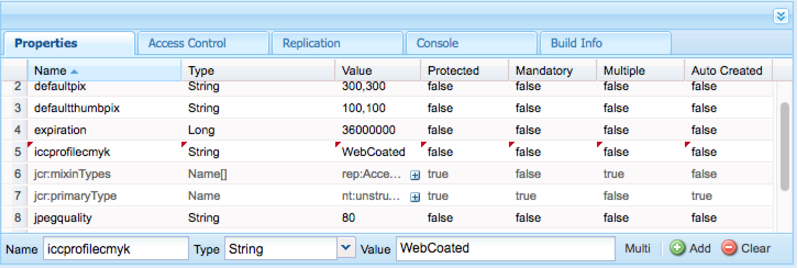

# Configurazione di Dynamic Media - Modalità ibrida {#configuring-dynamic-media-hybrid-mode}

Dynamic Media - L&#39;ibrido deve essere abilitato e configurato per l&#39;uso. A seconda del caso d’uso, Dynamic Media dispone di diverse configurazioni [](#supported-dynamic-media-configurations)supportate.

>[!NOTE]
>
>Se intendete configurare ed eseguire Dynamic Media in modalità di esecuzione di Scene7, consultate [Configurazione di Dynamic Media - modalità](config-dms7.md)Scene7.
>
>Per configurare ed eseguire Dynamic Media in modalità ibrida, segui le istruzioni riportate in questa pagina.

Ulteriori informazioni sull’utilizzo dei [video](video.md) in Dynamic Media.

Se utilizzate  Adobe Experience Manager impostato per ambienti diversi, ad esempio uno per lo sviluppo, uno per l&#39;staging e uno per la produzione live, dovete configurare i servizi Dynamic Media Cloud per ciascuno di questi ambienti.

In caso di problemi con la configurazione Dynamic Media, è importante verificare i file di registro specifici per i supporti dinamici. Questi vengono installati automaticamente quando si abilita il supporto dinamico:

* `s7access.log`
* `ImageServing.log`

Sono documentati nel [monitoraggio e nella manutenzione dell’istanza](/help/sites-deploying/monitoring-and-maintaining.md)AEM.

La pubblicazione e la distribuzione ibride è una funzione fondamentale del Adobe Experience Manager Dynamic Media che si aggiunge a . La pubblicazione ibrida consente di distribuire risorse Dynamic Media, come immagini, set e video, dal cloud anziché dai nodi di pubblicazione AEM.

Altri contenuti, come visualizzatori Dynamic Media, pagine del sito e contenuti statici, continueranno a essere distribuiti dai nodi di pubblicazione di AEM.

Se siete clienti di Dynamic Media, dovete utilizzare la distribuzione ibrida come meccanismo di distribuzione per tutti i contenuti Dynamic Media.

## Architettura di pubblicazione ibrida per i video {#hybrid-publishing-architecture-for-videos}


## Architettura di pubblicazione ibrida per le immagini {#hybrid-publishing-architecture-for-images}


## Configurazioni Dynamic Media supportate {#supported-dynamic-media-configurations}

Le attività di configurazione che seguono fanno riferimento ai seguenti termini:

| **Termine** | **Dynamic Media abilitato** | **Descrizione** |
|---|---|---|
| Nodo autore AEM | Simbolo di spunta bianco in un cerchio verde | Il nodo dell&#39;autore che si distribuisce in locale o tramite i servizi gestiti. |
| Nodo di pubblicazione AEM | &quot;X&quot; bianco in un quadrato rosso. | Il nodo di pubblicazione che si distribuisce in locale o tramite i servizi gestiti. |
| Nodo pubblicazione Servizio immagini | Segno di spunta bianco in un cerchio verde. | Il nodo di pubblicazione eseguito sui centri dati gestiti da Adobe. Si riferisce all’URL del servizio immagini. |

Potete scegliere di implementare Dynamic Media solo per l&#39;imaging, solo per i video, oppure per l&#39;imaging e il video. Per determinare i passaggi per la configurazione di Dynamic Media per lo scenario specifico, fare riferimento alla tabella seguente.

<table> 
 <tbody> 
  <tr> 
   <td><strong>Scenario</strong></td> 
   <td><strong>Come funziona</strong></td> 
   <td><strong>Passaggi di configurazione</strong></td> 
  </tr> 
  <tr> 
   <td>Distribuire SOLO immagini in produzione</td> 
   <td>Le immagini vengono distribuite tramite server nei centri dati di Adobe in tutto il mondo e quindi memorizzate nella cache da un CDN per prestazioni scalabili e portata globale.</td> 
   <td> 
    <ol> 
     <li>Nel nodo <strong>di creazione</strong> di AEM, <a href="#enabling-dynamic-media">abilitate i contenuti multimediali</a>dinamici.</li> 
     <li>Configurare l'imaging in <a href="#configuring-dynamic-media-cloud-services">Dynamic Media Cloud Services</a>.</li> 
     <li><a href="#configuring-image-replication">Configurare la replica</a>delle immagini.</li> 
     <li><a href="#replicating-catalog-settings">Replicare le impostazioni</a>del catalogo.</li> 
     <li><a href="#replicating-viewer-presets">Replicare i predefiniti</a>per visualizzatori.</li> 
     <li><a href="#using-default-asset-filters-for-replication">Utilizzate i filtri risorse predefiniti per la replica</a>.</li> 
     <li><a href="#configuring-dynamic-media-image-server-settings">Configurare le impostazioni</a>di Dynamic Media Image Server.</li> 
     <li><a href="#delivering-assets">Distribuite le risorse</a>.</li> 
    </ol> </td> 
  </tr> 
  <tr> 
   <td>Distribuite SOLO immagini in fase di pre-produzione (sviluppatori, QE, stage e così via).</td> 
   <td>Le immagini vengono distribuite tramite il nodo di pubblicazione AEM. In questo caso, poiché il traffico è minimo, non è necessario distribuire le immagini al centro dati di Adobe. Un ulteriore vantaggio è rappresentato dal fatto che questo consente un'anteprima sicura dei contenuti prima del lancio della produzione</td> 
   <td> 
    <ol> 
     <li>Nel nodo <strong>di creazione</strong> di AEM, <a href="#enabling-dynamic-media">abilitate i contenuti multimediali</a>dinamici.</li> 
     <li>Nel nodo <strong>di pubblicazione</strong> AEM, <a href="#enabling-dynamic-media">abilita il supporto</a>dinamico.</li> 
     <li><a href="#replicating-viewer-presets">Replicare i predefiniti</a>per visualizzatori.</li> 
     <li>Impostate il filtro <a href="#setting-up-asset-filters-for-imaging-in-non-production-deployments">risorse per le immagini</a>non di produzione.</li> 
     <li><a href="#configuring-dynamic-media-image-server-settings">Configurare le impostazioni di Dynamic Media Image Server.</a></li> 
     <li><a href="#delivering-assets">Distribuite le risorse.</a></li> 
    </ol> </td> 
  </tr> 
  <tr> 
   <td>Distribuire SOLO video in qualsiasi ambiente (Produzione, Sviluppo, QE, Stage e così via)</td> 
   <td>I video vengono distribuiti e memorizzati nella cache da un CDN per garantire prestazioni scalabili e raggiungere un livello globale. L’immagine poster del video (miniatura del video che viene visualizzata prima dell’avvio della riproduzione) verrà inviata dall’istanza di pubblicazione AEM.</td> 
   <td> 
    <ol> 
     <li>Nel nodo <strong>di creazione</strong> di AEM, <a href="#enabling-dynamic-media">abilitate i contenuti multimediali</a>dinamici.</li> 
     <li>Nel nodo di <strong>pubblicazione</strong> AEM, <a href="#enabling-dynamic-media">abilitate i contenuti multimediali</a> dinamici (l’istanza di pubblicazione serve l’immagine poster del video e fornisce i metadati per la riproduzione video).</li> 
     <li>Configurare i video in <a href="#configuring-dynamic-media-cloud-services">Dynamic Media Cloud Services.</a></li> 
     <li><a href="#replicating-viewer-presets">Replicare i predefiniti</a>per visualizzatori.</li> 
     <li>Impostate il filtro <a href="#setting-up-asset-filters-for-video-only-deployments">delle risorse solo</a>per il video.</li> 
     <li><a href="#delivering-assets">Distribuite le risorse.</a></li> 
    </ol> </td> 
  </tr> 
  <tr> 
   <td>Trasmissione di immagini e video in produzione</td> 
   <td><p>I video vengono distribuiti e memorizzati nella cache da un CDN per garantire prestazioni scalabili e raggiungere un livello globale. Le immagini e le immagini poster video vengono trasmesse attraverso i server dei centri dati mondiali di Adobe e quindi memorizzate nella cache da un CDN per prestazioni scalabili e portata globale.</p> <p>Consultare le sezioni precedenti per configurare l'immagine o il video nella fase di pre-produzione. </p> </td> 
   <td> 
    <ol> 
     <li>Nel nodo <strong>di creazione</strong> di AEM, <a href="#enabling-dynamic-media">abilitate i contenuti multimediali</a>dinamici.</li> 
     <li>Configurare i video in <a href="#configuring-dynamic-media-cloud-services">Dynamic Media Cloud Services.</a></li> 
     <li>Configurare l'imaging in <a href="#configuring-dynamic-media-cloud-services">Dynamic Media Cloud Services.</a></li> 
     <li><a href="#configuring-image-replication">Configurare la replica</a>delle immagini.</li> 
     <li><a href="#replicating-catalog-settings">Replicare le impostazioni</a>del catalogo.</li> 
     <li><a href="#replicating-viewer-presets">Replicare i predefiniti</a>per visualizzatori.</li> 
     <li><a href="#using-default-asset-filters-for-replication">Utilizzate i filtri risorse predefiniti per la replica.</a></li> 
     <li><a href="#configuring-dynamic-media-image-server-settings">Configurare le impostazioni di Dynamic Media Image Server.</a></li> 
     <li><a href="#delivering-assets">Distribuite le risorse.</a></li> 
    </ol> </td> 
  </tr> 
 </tbody> 
</table>

## Abilitazione di Dynamic Media {#enabling-dynamic-media}

[Per impostazione predefinita, i contenuti multimediali](https://www.adobe.com/solutions/web-experience-management/dynamic-media.html) dinamici sono disattivati. Per sfruttare le funzionalità di Dynamic Media, è necessario abilitare i contenuti multimediali dinamici utilizzando la modalità di esecuzione **[!UICONTROL per i contenuti multimediali]** dinamici, come si farebbe ad esempio con la modalità di esecuzione della **[!UICONTROL pubblicazione]** . Prima di attivare l&#39;opzione, verificare i requisiti [tecnici](/help/sites-deploying/technical-requirements.md#requirements-for-aem-dynamic-media-add-on).

>[!NOTE]
>
>L’attivazione di contenuti multimediali dinamici tramite la modalità di esecuzione sostituisce le funzionalità di AEM 6.1 e AEM 6.0, in cui sono stati abilitati i contenuti multimediali dinamici impostando il flag **[!UICONTROL dynamicMediaEnabled]** su **[!UICONTROL true]**. Questo flag non dispone di funzionalità in AEM 6.2 e versioni successive. Inoltre, non è necessario riavviare il servizio QuickStart per abilitare i contenuti multimediali dinamici.

Attivando Dynamic Media, le funzioni per i contenuti multimediali dinamici saranno disponibili nell’interfaccia utente e ogni risorsa immagine caricata riceverà una `cqdam.pyramid.tiff` rappresentazione utilizzata per distribuire rapidamente rappresentazioni dinamiche delle immagini. Tali PTIFF presentano notevoli vantaggi, tra cui (1) la possibilità di gestire una sola immagine principale e generare al volo rappresentazioni illimitate senza ulteriore spazio di archiviazione e (2) la possibilità di utilizzare visualizzazioni interattive quali zoom, scorrimento, rotazione e così via.

Per utilizzare Dynamic Media Classic (Scene7) in AEM, non è necessario abilitare Dynamic Media a meno che non si utilizzi uno scenario [](/help/sites-administering/scene7.md#aem-scene-integration-versus-dynamic-media)specifico. Dynamic Media è disattivato a meno che non si attivi il supporto dinamico in modalità di esecuzione.

Per abilitare il supporto dinamico, è necessario abilitare la modalità di esecuzione del supporto dinamico dalla riga di comando o dal nome del file quickstart.

**Per abilitare i contenuti multimediali** dinamici:

1. Nella riga di comando, all’avvio dell’avvio rapido, effettuate le seguenti operazioni:

   * Aggiungete **[!UICONTROL un file dinamico]** alla fine della riga di comando all&#39;avvio del file JAR.

   ```shell
   java -Xmx4096m -Doak.queryLimitInMemory=500000 -Doak.queryLimitReads=500000 -jar cq-quickstart-6.4.0.jar -r dynamicmedia
   ```

   Se state pubblicando su s7delivery, dovete includere anche i seguenti argomenti di trustStore:

   ```
   -Djavax.net.ssl.trustStore=<absoluteFilePath>/customerTrustStoreFileName>
   
    -Djavax.net.ssl.trustStorePassword=<passwordForTrustStoreFile>
   ```

1. Richiedete `http://localhost:4502/is/image` e accertatevi che Image Server sia in esecuzione.

   >[!NOTE]
   >
   >Per risolvere i problemi con Dynamic Media, consulta i seguenti file di registro nella directory **[!UICONTROL crx-quickstart/logs/]** :
   >
   >* ImageServer-&lt;PortId>-&lt;yyyy>&lt;mm>&lt;dd>.log - Il registro ImageServer fornisce informazioni statistiche e analitiche utilizzate per analizzare il comportamento del processo ImageServer interno.

      Esempio di nome file di registro di Image Server: `ImageServer-57346-2019-07-25.log`
   * s7access-&lt;yyyy>&lt;mm>&lt;dd>.log - Il registro di accesso s7access registra ogni richiesta inoltrata ad Dynamic Media attraverso `/is/image` e `/is/content`.
   Questi registri vengono utilizzati solo quando Dynamic Media è abilitato. non sono inclusi nel pacchetto **Scarica completo** generato dalla pagina **[!UICONTROL system/console/status-Bundlelist]** ; quando chiamate l&#39;Assistenza clienti in caso di problemi con Dynamic Media, aggiungete entrambi i registri al problema.

### Se AEM è stato installato su una porta o un percorso contestuale diverso... {#if-you-installed-aem-to-a-different-port-or-context-path}

Se state distribuendo [AEM a un server](/help/sites-deploying/application-server-install.md) applicazione e Dynamic Media è abilitato, dovete configurare il dominio **autonomo** nell&#39;esternalizzatore. In caso contrario, la generazione di miniature per le risorse non funzionerà correttamente per le risorse multimediali dinamiche.

Inoltre, se si esegue QuickStart su una porta o un percorso contestuale diverso, è necessario modificare anche il dominio **autonomo** .

Quando Dynamic Media è abilitato, le rappresentazioni di miniature statiche per le risorse di immagini vengono generate tramite Dynamic Media. Affinché la generazione delle miniature funzioni correttamente per i contenuti multimediali dinamici, AEM deve effettuare una richiesta URL a se stesso e deve conoscere sia il numero di porta che il percorso contestuale.

In AEM:

* Il dominio **autonomo** nell&#39; [esternalizzatore](/help/sites-developing/externalizer.md) viene utilizzato per recuperare sia il numero di porta che il percorso contestuale.
* Se non è configurato alcun dominio **autonomo** , il numero di porta e il percorso del contesto vengono recuperati dal servizio Jetty HTTP.

In una distribuzione AEM QuickStart WAR, non è possibile derivare il numero di porta e il percorso contestuale, pertanto è necessario configurare un dominio **autonomo** . Consulta la documentazione [di](/help/sites-developing/externalizer.md) esternalizer su come configurare il dominio **autonomo** .

>[!NOTE]
In una distribuzione [autonoma](/help/sites-deploying/deploy.md)AEM Quickstart, non è necessario configurare un dominio **autonomo** perché il numero di porta e il percorso del contesto possono essere configurati automaticamente. Tuttavia, se tutte le interfacce di rete sono disattivate, è necessario configurare il dominio **autonomo** .

## Disattivazione di Dynamic Media  {#disabling-dynamic-media}

I contenuti multimediali dinamici non sono attivati per impostazione predefinita. Tuttavia, se in precedenza avete attivato i contenuti multimediali dinamici, potrebbe essere necessario disattivarli in un secondo momento.

Per disattivare il supporto dinamico dopo averlo attivato, rimuovete il flag **[!UICONTROL -r della modalità di esecuzione del supporto]** dinamico.

**Per disattivare Dynamic Media dopo che è stato abilitato**:

1. Nella riga di comando, quando si avvia l&#39;avvio rapido, è possibile effettuare una delle seguenti operazioni:

   * Non aggiungere `-r dynamicmedia` alla riga di comando quando si avvia il file JAR.

   ```shell
   java -Xmx4096m -Doak.queryLimitInMemory=500000 -Doak.queryLimitReads=500000 -jar cq-quickstart-6.4.0.jar
   ```

1. Richiesta `http://localhost:4502/is/image`. Viene visualizzato un messaggio che informa che Dynamic Media è disattivato.

   >[!NOTE]
   Una volta disattivata la modalità di esecuzione di Dynamic Media, il passaggio del flusso di lavoro che genera il `qdam.pyramid.tiff` rendering viene ignorato automaticamente. In questo modo viene disattivato anche il supporto delle rappresentazioni dinamiche e altre funzionalità di Dynamic Media.
   Inoltre, se la modalità di esecuzione di Dynamic Media è disattivata dopo la configurazione del server AEM, tutte le risorse caricate in tale modalità di esecuzione non sono più valide.

## (Facoltativo) Migrazione dei predefiniti e delle configurazioni Dynamic Media da 6.3 a 6.4 senza interruzioni {#optional-migrating-dynamic-media-presets-and-configurations-from-to-zero-downtime}

Se state effettuando l&#39;aggiornamento di AEM Dynamic Media da 6.3 a 6.4, che ora include la possibilità di installare fino a zero tempi di inattività (nota anche come &quot;consenso esplicito&quot;), è necessario eseguire il seguente comando curl per migrare tutti i predefiniti e le configurazioni da `/etc` a `/conf` in CRXDE Lite.

**Nota**: Se si esegue l’istanza di AEM in modalità di compatibilità, ovvero se è installata la compatibilità, non è necessario eseguire questi comandi.

Per migrare i predefiniti e le configurazioni personalizzati da `/etc` a `/conf`, eseguite il seguente comando curl Linux:

`curl -u admin:admin http://localhost:4502/libs/settings/dam/dm/presets.migratedmcontent.json`

Per tutti gli aggiornamenti, con o senza il pacchetto di compatibilità, potete copiare i predefiniti per visualizzatori forniti con il prodotto eseguendo il comando seguente:

`curl -u admin:admin http://localhost:4502/libs/settings/dam/dm/presets/viewer.pushviewerpresets`

## Configurazione della replica delle immagini {#configuring-image-replication}

La distribuzione delle immagini Dynamic Media funziona pubblicando le risorse di immagine, comprese le miniature video, dai AEM Author e replicandole al servizio di replica su richiesta di Adobe (l&#39;URL del servizio di replica). Le risorse vengono quindi distribuite tramite il servizio di distribuzione delle immagini su richiesta (l’URL del servizio immagini).

È necessario effettuare le seguenti operazioni:

1. [Configurare l&#39;autenticazione](#setting-up-authentication).
1. [Configurare l&#39;agente](#configuring-the-replication-agent)di replica.

Replication Agent pubblica risorse Dynamic Media come immagini, metadati video e set nel servizio immagini ospitato da Adobe. L&#39;agente di replica non è abilitato per impostazione predefinita.

Dopo aver configurato l&#39;agente di replica, è necessario [convalidare e verificare che sia stato configurato](#validating-the-replication-agent-for-dynamic-media)correttamente. In questa sezione vengono descritte le seguenti procedure.

>[!NOTE]
Il limite di memoria predefinito per la creazione PTIFF è di 3 GB per tutti i flussi di lavoro. Ad esempio, potete elaborare un’immagine che richiede 3 GB di memoria mentre altri flussi di lavoro vengono messi in pausa oppure potete elaborare 10 immagini in parallelo che richiedono 300 MB di memoria ciascuno.
Il limite di memoria è configurabile e deve essere adattato alla disponibilità delle risorse di sistema e al tipo di contenuto immagine in elaborazione. Se disponete di risorse molto grandi e di memoria sufficiente sul sistema, potete aumentare questo limite per garantire che le immagini vengano elaborate in parallelo.
Un&#39;immagine che richiede più del limite massimo di memoria verrà rifiutata.
Per modificare il limite di memoria per la creazione PTIFF, accedete a **[!UICONTROL Strumenti > Operazioni > Console Web > Adobe CQ Scene7 PTiffManager]** e modificate il `maxMemory` valore.

### Impostazione dell&#39;autenticazione {#setting-up-authentication}

Per replicare le immagini nel servizio di distribuzione delle immagini Dynamic Media, è necessario impostare l&#39;autenticazione di replica per l&#39;autore. A tal fine, è possibile ottenere un KeyStore e salvarlo nell&#39;utente di replica **[!UICONTROL multimediale]** dinamica e configurarlo. L&#39;amministratore della società avrebbe dovuto ricevere un&#39;e-mail di benvenuto con il file KeyStore e le credenziali necessarie durante il processo di provisioning. In caso contrario, contatta l&#39;Assistenza clienti.

**Per impostare l&#39;autenticazione**:

1. Se non disponi già di questo tipo, contatta l’Assistenza clienti per il tuo file e la password KeyStore. Fa parte del provisioning e associa le chiavi al tuo account.
1. In AEM, tap the AEM logo to access the global navigation console, then tap **[!UICONTROL Tools > Security > Users]**.
1. Nella pagina Gestione utente, accedete all’utente di replica **[!UICONTROL per contenuti multimediali]** dinamici e toccate per aprirlo.

   

1. Nella pagina Modifica impostazioni utente per la replica di contenuti multimediali dinamici, toccate la scheda **[!UICONTROL Keystore]** , quindi toccate **[!UICONTROL Crea archivio]** chiavi.

   

1. Immettete una password e confermate la password nella finestra di dialogo **[!UICONTROL Imposta password]** accesso archivio chiavi.

   >[!NOTE]
   Ricordate la password immessa. Sarà necessario immetterlo nuovamente quando si configura **[!UICONTROL Replication Agent]** in un secondo momento.

   

1. Nella pagina **[!UICONTROL Modifica impostazioni utente per la replica]** dinamica dei contenuti multimediali, espandete l’area file **** Aggiungi chiave privata da KeyStore e aggiungete quanto segue (consultate le immagini seguenti):

   * Nel campo **[!UICONTROL Nuovo alias]** , immettere il nome di un alias che verrà utilizzato successivamente nella configurazione di replica; ad esempio, **replica**.
   * Toccate File **** KeyStore. Andate al file KeyStore fornito da Adobe, selezionatelo, quindi toccate **[!UICONTROL Apri]**.
   * Nel campo Password **[!UICONTROL file]** KeyStore, immettere la password del file KeyStore. Questa _non_ è la password KeyStore creata nel passaggio 5, ma è la password del file KeyStore fornita da Adobe nel messaggio e-mail di benvenuto inviato al momento del provisioning. Se non hai ricevuto una password per il file KeyStore, contatta l’Assistenza clienti Adobe.
   * Nel campo Password **[!UICONTROL chiave]** privata, immettete la password della chiave privata (potrebbe essere la stessa password della chiave privata fornita nel passaggio precedente). Adobe fornisce la password della chiave privata nel messaggio e-mail di benvenuto che vi è stato inviato durante il provisioning. Se non hai ricevuto una password per la chiave privata, contatta l’Assistenza clienti Adobe.
   * Nel campo Alias **[!UICONTROL chiave]** privata, immettere l&#39;alias della chiave privata. Esempio, `companyname-alias`. Adobe fornisce l’alias della chiave privata nel messaggio e-mail di benvenuto che vi è stato inviato durante il provisioning. Se non hai ricevuto un alias di chiave privata, contatta l’Assistenza clienti Adobe.

   

1. Toccate **[!UICONTROL Salva e chiudi]** per salvare le modifiche a questo utente.

   Quindi, è necessario [configurare l&#39;agente di replica.](#configuring-the-replication-agent)

### Configurazione dell&#39;agente di replica {#configuring-the-replication-agent}

1. In AEM, toccate il logo AEM per accedere alla console di navigazione globale, quindi toccate **[!UICONTROL Strumenti > Distribuzione > Replica > Agenti all’autore]**.
1. Nella pagina Agenti dell’autore, toccate Replica immagine ibrida **[!UICONTROL Dynamic Media (s7delivery)]**.
1. Toccate **[!UICONTROL Modifica]**.
1. Toccate la scheda **[!UICONTROL Impostazioni]** , quindi immettete quanto segue:

   * **[!UICONTROL Abilitato]** - Selezionare questa casella di controllo per abilitare l&#39;agente di replica.
   * **[!UICONTROL Regione]** - Impostare sulla regione appropriata: Nord America, Europa o Asia
   * **[!UICONTROL ID]** tenant: questo valore è il nome della società/tenant che viene pubblicato nel servizio di replica. Questo valore è l&#39;ID tenant fornito da Adobe nel messaggio e-mail di benvenuto che vi è stato inviato durante il provisioning. Se non hai ricevuto questa notifica, contatta l’Assistenza clienti Adobe.
   * **[!UICONTROL Alias]** archivio chiavi - Questo valore è uguale al valore** Nuovo alias** impostato durante la generazione della chiave in [Impostazione autenticazione](#setting-up-authentication); ad esempio, `replication`. (vedere il passaggio 7 in [Impostazione dell&#39;autenticazione](#setting-up-authentication).)
   * **[!UICONTROL Password]** archivio chiavi - Si tratta della password KeyStore creata quando hai toccato **[!UICONTROL Create KeyStore]**. Adobe non fornisce questa password. Vedere il passaggio 5 della [configurazione dell&#39;autenticazione](#setting-up-authentication).

   L&#39;immagine seguente mostra l&#39;agente di replica con dati di esempio:

   

1. Toccate **[!UICONTROL OK]**.

### Validating the Replication Agent for Dynamic Media {#validating-the-replication-agent-for-dynamic-media}

To validate the replication agent for dynamic media, do the following:

Toccate **[!UICONTROL Test della connessione]**. Esempio di output:

```shell
11.03.2016 10:57:55 - Transferring content for ReplicationAction{type=TEST, path[0]='/content/dam', time=1457722675402, userId='admin', revision='null'}
11.03.2016 10:57:55 - * Auth User: replication-receiver
11.03.2016 10:57:55 - * HTTP Version: 1.1
11.03.2016 10:57:55 - * Using OAuth 2.0 Authorization Grants
11.03.2016 10:57:55 - * OAuth 2.0 User: dynamic-media-replication
11.03.2016 10:57:55 - * OAuth 2.0 Token: '*****' initialized
11.03.2016 10:57:55 - Publishing: POST[https://replicate-na.assetsadobe.com:8580/is-publish/publish-receiver?Cmd=Test&RootId=xfpuu-6613]
11.03.2016 10:57:55 - Publish response: OK[]
11.03.2016 10:57:55 - Transfer succeeded in 141 ms for ReplicationAction{type=TEST, path[0]='/content/dam', time=1457722675402, userId='admin', revision='null'}
-------------------------------------------------------------------------------------------------------------------------------
Replication test succeeded
```

>[!NOTE]
You can also check by doing one of the following:
* Controllate i registri di replica per essere certi che la risorsa sia replicata.
* Publish an image. Tap the image and select **[!UICONTROL Viewers]** in drop-down menu. Selezionate un predefinito per visualizzatori, quindi toccate **[!UICONTROL URL]**, quindi copiate e incollate l’URL nel browser per verificare che sia visibile l’immagine.


### Autenticazione risoluzione dei problemi {#troubleshooting-authentication}

When setting up authentication, here are some issues you may run into with their solutions. Before checking these, make sure you have set up replication.

#### Problem: HTTP Status Code 401 with Message - Authorization Required {#problem-http-status-code-with-message-authorization-required}

Questo problema può essere causato da un errore durante la configurazione di KeyStore per `dynamic-media-replication` l&#39;utente.

```shell
Replication test to s7delivery:https://s7bern.macromedia.com:8580/is-publish/
17.06.2016 18:54:43 - Transferring content for ReplicationAction{type=TEST, path[0]='/content/dam', time=1466214883309, userId='admin', revision='null'}
17.06.2016 18:54:43 - * Auth User: replication-receiver
17.06.2016 18:54:43 - * HTTP Version: 1.1
17.06.2016 18:54:43 - * Using OAuth 2.0 Authorization Grants
17.06.2016 18:54:43 - * OAuth 2.0 User: dynamic-media-replication
17.06.2016 18:54:43 - No OAuth token available. OAuth not initialized
17.06.2016 18:54:43 - * Using Client Auth SSL alias - replication-alias *
17.06.2016 18:54:43 - Publishing: POST[https://<localhost>:8580/is-publish//publish-receiver?Cmd=Test&RootId=brough]
17.06.2016 18:54:43 - Transfer failed for ReplicationAction{type=TEST, path[0]='/content/dam', time=1466214883309, userId='admin', revision='null'}. java.io.IOException: Failed to execute request
'https://<localhost>:8580/is-publish//publish-receiver?Cmd=Test&RootId=brough':
 Server returned status code 401 with message: Authorization required.
17.06.2016 18:54:43 - Error while replicating: com.day.cq.replication.ReplicationException: Transfer failed for ReplicationAction{type=TEST, path[0]='/content/dam', time=1466214883309,
 userId='admin', revision='null'}. java.io.IOException: Failed to execute request
'https://<localhost>:8580/is-publish//publish-receiver?Cmd=Test&RootId=brough':
 Server returned status code 401 with message: Authorization required.
```

**Solution**: Check that the `KeyStore` is saved to **[!UICONTROL dynamic-media-replication]** user and is provided with the correct password.

#### Problem: Could Not Decrypt Key - Could Not Decrypt Data {#problem-could-not-decrypt-key-could-not-decrypt-data}

```xml
Replication test to s7delivery:https://<localhost>:8580/is-publish/
17.06.2016 19:00:16 - Transferring content for ReplicationAction{type=TEST, path[0]='/content/dam', time=1466215216662, userId='admin', revision='null'}
17.06.2016 19:00:16 - * Auth User: replication-receiver
17.06.2016 19:00:16 - * HTTP Version: 1.1
17.06.2016 19:00:16 - * Using OAuth 2.0 Authorization Grants
17.06.2016 19:00:16 - * OAuth 2.0 User: dynamic-media-replication
17.06.2016 19:00:16 - No OAuth token available. OAuth not initialized
17.06.2016 19:00:16 - * Using Client Auth SSL alias - replication-alias *
17.06.2016 19:00:16 - Transfer failed for ReplicationAction{type=TEST, path[0]='/content/dam', time=1466215216662, userId='admin', revision='null'}. java.lang.SecurityException: java.security.UnrecoverableKeyException: Could not decrypt key: Could not decrypt data.
```

**Soluzione**: Controllare la password. The password saved in the replication agent is not the same password that was used to create keystore.

#### Problem: InvalidAlgorithmParameterException {#problem-invalidalgorithmparameterexception}

This issue is caused by a configuration error in your AEM Author instance. Il processo Java sull&#39;Autore non ottiene il risultato corretto `javax.net.ssl.trustStore`. Questo errore viene visualizzato nel registro di replica:

```shell
14.04.2016 09:37:43 - Transfer failed for ReplicationAction{type=TEST, path[0]='/content/dam', time=1460651862089, userId='admin', revision='null'}. java.io.IOException: Failed to execute request 'https://<localhost>:8580/is-publish/publish-receiver?Cmd=Test&RootId=rbrough-osx2': java.lang.RuntimeException: Unexpected error: java.security.InvalidAlgorithmParameterException: the trustAnchors parameter must be non-empty
14.04.2016 09:37:43 - Error while replicating: com.day.cq.replication.ReplicationException: Transfer failed for ReplicationAction{type=TEST, path[0]='/content/dam', time=1460651862089, userId='admin', revision='null'}. java.io.IOException: Failed to execute request 'https://<localhost>:8580/is-publish/publish-receiver?Cmd=Test&RootId=rbrough-osx2': java.lang.RuntimeException: Unexpected error: java.security.InvalidAlgorithmParameterException: the trustAnchors parameter must be non-empty
```

Oppure nel registro degli errori:

```shell
07.25.2019 12:00:59.893 *ERROR* [sling-threadpool-db2763bb-bc50-4bb5-bb64-10a09f432712-(apache-sling-job-thread-pool)-90-com_day_cq_replication_job_s7delivery(com/day/cq/replication/job/s7delivery)] com.day.cq.replication.Agent.s7delivery.queue Error during processing of replication.
 
java.io.IOException: Failed to execute request 'https://replicate-na.assetsadobe.com:8580/is-publish/publish-receiver?Cmd=Test&RootId=rbrough-osx': java.lang.RuntimeException: Unexpected error: java.security.InvalidAlgorithmParameterException: the trustAnchors parameter must be non-empty
        at com.scene7.is.catalog.service.publish.atomic.PublishingServiceHttp.executePost(PublishingServiceHttp.scala:195)
```

**Solution**: Make sure the java process on the AEM Author has the system property **-Djavax.net.ssl.trustStore=** set to a valid truststore.

#### Problema: KeyStore non è configurato o non è inizializzato {#problem-keystore-is-either-not-set-up-or-it-is-not-initialized}

Questo problema può essere causato da una correzione, o da un pacchetto di funzioni che sovrascrive il nodo **[!UICONTROL dynamic-media-user]** o **[!UICONTROL keystore]** .

Esempio di registro della replica:

```shell
Replication test to s7delivery:https://replicate-na.assetsadobe.com/is-publish
02.08.2016 14:37:44 - Transferring content for ReplicationAction{type=TEST, path[0]='/content/dam', time=1470173864834, userId='admin', revision='null'}
02.08.2016 14:37:44 - * Auth User: replication-receiver
02.08.2016 14:37:44 - * HTTP Version: 1.1
02.08.2016 14:37:44 - * Using OAuth 2.0 Authorization Grants
02.08.2016 14:37:44 - * OAuth 2.0 User: dynamic-media-replication
02.08.2016 14:37:44 - Transfer failed for ReplicationAction{type=TEST, path[0]='/content/dam', time=1470173864834, userId='admin', revision='null'}. com.adobe.granite.keystore.KeyStoreNotInitialisedException: Uninitialised key store for user dynamic-media-replication
```

**Soluzione**:

1. Passate alla pagina Gestione **** utente:

   `localhost:4502/libs/granite/security/content/useradmin.html`
1. Nella pagina Gestione **** utente, accedete all’utente di replica **[!UICONTROL multimediale]** dinamica, quindi toccate per aprirlo.
1. Toccate la scheda **[!UICONTROL KeyStore]** . Se viene visualizzato il pulsante **[!UICONTROL Crea archivio]** chiavi, è necessario ripristinare i passaggi in [Impostazione autenticazione](#setting-up-authentication) precedente.
1. Se è stato necessario ripristinare la configurazione di **[!UICONTROL KeyStore]** , potrebbe essere necessario [configurare nuovamente Replication Agent](config-dynamic.md#configuring-the-replication-agent) .

   Riconfigurare l&#39;agente di replica s7delivery.

   `localhost:4502/etc/replication/agents.author/s7delivery.html`

1. Toccate **[!UICONTROL Test connessione]** per verificare la validità della configurazione.

#### Problema: L&#39;agente di pubblicazione utilizza SSL invece di OAuth {#problem-publish-agent-is-using-ssl-instead-of-oauth}

Questo problema può essere causato da una correzione rapida o da un pacchetto di funzioni che non è stato installato correttamente o ha sovrascritto le impostazioni.

Esempio di registro replicato:

```shell
01.08.2016 18:42:59 - Transferring content for ReplicationAction{type=TEST, path[0]='/content/dam', time=1470073379634, userId='admin', revision='null'}
01.08.2016 18:42:59 - * Auth User: replication-receiver
01.08.2016 18:42:59 - * HTTP Version: 1.1
01.08.2016 18:42:59 - * Using Client Auth SSL alias - replication-receiver *
01.08.2016 18:42:59 - Publishing: POST[https://replicate-eu.assetsadobe2.com:443/is-publish/publish-receiver?Cmd=Test&RootId=altayerstaging]
01.08.2016 18:42:59 - Transfer failed for ReplicationAction{type=TEST, path[0]='/content/dam', time=1470073379634, userId='admin', revision='null'}. java.io.IOException: Failed to execute request 'https://replicate-eu.assetsadobe2.com:443/is-publish/publish-receiver?Cmd=Test&RootId=rbroughstaging': Server returned status code 401 with message: Authorization required.
01.08.2016 18:42:59 - Error while replicating: com.day.cq.replication.ReplicationException: Transfer failed for ReplicationAction{type=TEST, path[0]='/content/dam', time=1470073379634, userId='admin', revision='null'}. java.io.IOException: Failed to execute request 'https://replicate-eu.assetsadobe2.com:443/is-publish/publish-receiver?Cmd=Test&RootId=rbroughstaging': Server returned status code 401 with message: Authorization required.
```

**Soluzione:**

1. In AEM, tocca **[!UICONTROL Strumenti > Generale > CRXDE Lite]**.

   `localhost:4502/crx/de/index.jsp`

1. Passare al nodo **[!UICONTROL s7delivery Replication Agent]** .

   `localhost:4502/crx/de/index.jsp#/etc/replication/agents.author/s7delivery/jcr:content`

1. Aggiungete questa impostazione all&#39;agente di replica (booleano con valore impostato su **[!UICONTROL True]**):

   `enableOauth=true`

1. Nell’angolo in alto a sinistra della pagina, toccate **[!UICONTROL Salva tutto]**.

### Verifica della configurazione {#testing-your-configuration}

Adobe consiglia di eseguire un test end-to-end della configurazione.

Prima di iniziare il test, accertatevi di aver già eseguito le operazioni seguenti:

* Sono Stati Aggiunti Predefiniti Per Immagini.
* Configurare la configurazione **Dynamic Media (pre 6.3)** in **[!UICONTROL Cloud Services]**. L’URL del servizio immagini è richiesto per questo test

Per verificare la configurazione:

1. Caricate una risorsa immagine. (In Risorse, tocca **[!UICONTROL Crea > File]** e seleziona il file.)
1. Attendere il completamento del flusso di lavoro.
1. Pubblicate la risorsa immagine. Selezionate la risorsa e toccate Pubblicazione **** rapida.
1. Per passare alle rappresentazioni dell’immagine, aprite l’immagine e toccate **[!UICONTROL Rappresentazioni]**.

   

1. Selezionare una rappresentazione dinamica.
1. Toccate **[!UICONTROL URL]** per ottenere l’URL per la risorsa.
1. Passate all’URL selezionato e verificate se l’immagine si comporta come previsto.

Un altro modo per verificare che le risorse siano state distribuite è aggiungere all’URL req=exists.

## Configuring Dynamic Media Cloud Services {#configuring-dynamic-media-cloud-services}

Il servizio Dynamic Media Cloud supporta servizi cloud come la pubblicazione ibrida e la distribuzione di immagini e video, analisi video e codifica video, tra le altre cose.

Come parte della configurazione, è necessario immettere un ID registrazione, un URL del servizio video, un URL del servizio immagini, un URL del servizio di replica e impostare l&#39;autenticazione. Avreste dovuto ricevere tutte queste informazioni come parte del processo di provisioning dell&#39;account. Se non avete ricevuto queste informazioni, contattate l&#39;amministratore  Adobe Experience Manager o il supporto tecnico Adobe per ottenere le informazioni.

>[!NOTE]
Prima di configurare i servizi Dynamic Media Cloud, accertatevi che l’istanza di pubblicazione sia configurata. È inoltre necessario disporre della replica impostata prima di configurare i servizi Dynamic Media Cloud.

**Per configurare i servizi** cloud per contenuti multimediali dinamici:

1. In AEM, tocca il logo AEM per accedere alla console di navigazione globale e tocca **[!UICONTROL Strumenti > Servizi cloud > Configurazione Dynamic Media (Pre-6.3)]**.
1. Nella pagina Browser **[!UICONTROL configurazione]** Dynamic Media, nel riquadro a sinistra, selezionate **[!UICONTROL globale]**, quindi toccate **[!UICONTROL Crea]**.
1. Nella finestra di dialogo **[!UICONTROL Crea configurazione]** Dynamic Media, digitare un titolo nel campo **[!UICONTROL Titolo]** .
1. Se state configurando Dynamic Media per il video,

   * Nel campo ID **** registrazione, digitate il vostro ID registrazione.
   * Nel campo URL **[!UICONTROL del servizio]** video, immettete l’URL del servizio video per Dynamic Media Gateway.

1. Se state configurando Dynamic Media per l&#39;imaging, nel campo URL **[!UICONTROL del servizio]** immagini immettete l&#39;URL del servizio immagine per Dynamic Media Gateway.
1. Toccate **[!UICONTROL Salva]** per tornare alla pagina del browser di configurazione Dynamic Media.
1. Toccate il logo AEM per accedere alla console di navigazione globale.

## Configurazione del reporting video {#configuring-video-reporting}

È possibile configurare il reporting video per più installazioni di AEM utilizzando la modalità ibrida Dynamic Media.

**Quando utilizzare:** Al momento della configurazione della configurazione **[!UICONTROL Dynamic Media (pre 6.3)]**, vengono avviate numerose funzioni, tra cui la generazione di rapporti video. La configurazione crea una suite di rapporti in una società Analytics  regione. Se configurate più nodi Autore, create una suite di rapporti separata per ciascuno di essi. Di conseguenza, i dati di reporting non sono coerenti tra le installazioni. Inoltre, se ogni nodo Autore fa riferimento allo stesso server di pubblicazione ibrida, l’ultima installazione di Author modifica la suite di rapporti di destinazione per tutti i rapporti video. Questo problema sovraccarica il sistema Analytics  con troppe suite di rapporti.

**Guida introduttiva:** Configurate il reporting video completando le tre attività seguenti.

1. Create un pacchetto di [!DNL Video Analytics] predefiniti dopo aver configurato **[!UICONTROL Dynamic Media Configuration (Pre 6.3)]** sul primo nodo Author. Questa attività iniziale è importante perché consente a una nuova configurazione di continuare a utilizzare la stessa suite di rapporti.
1. Installate il pacchetto di [!DNL Video Analytics] predefiniti in qualsiasi ***nuovo*** nodo Author ***prima*** di configurare la configurazione Dynamic Media (Pre 6.3).

1. Verificate ed eseguite il debug dell&#39;installazione del pacchetto.

### Creazione di un pacchetto di [!DNL Video Analytics] predefiniti dopo la configurazione del primo nodo Autore {#creating-a-video-analytics-preset-package-after-configuring-the-first-author-node}

Al termine di questa attività, sarà disponibile un file di pacchetto contenente i [!DNL Video Analytics] predefiniti. Questi predefiniti contengono una suite di rapporti, il server di tracciamento, lo spazio dei nomi di tracciamento e l&#39;ID organizzazione Marketing Cloud, se disponibile.

1. Se non lo avete ancora fatto, configurate Configurazione **[!UICONTROL Dynamic Media (Pre 6.3)]**.
1. (Facoltativo) Visualizzare e copiare l’ID **[!UICONTROL della suite di]** rapporti (è necessario avere accesso al JCR). Pur non avendo l&#39;ID **[!UICONTROL della suite di]** rapporti, la convalida risulta più semplice.
1. Create un pacchetto utilizzando **[!UICONTROL Gestione]** pacchetti.
1. Modificate il pacchetto per includere un filtro.

   In AEM: `/conf/global/settings/dam/dm/presets/analytics/jcr:content/userdata`

1. Create il pacchetto.
1. Scaricate o condividete il pacchetto di [!DNL Video Analytics] predefiniti in modo che possa essere condiviso con i nuovi nodi Autore successivi.

### Installazione del pacchetto [!DNL Video Analytics] predefinito prima di configurare altri nodi Author {#installing-the-video-analytics-preset-package-before-you-configure-additional-author-nodes}

Accertatevi di completare questa attività _prima_ di configurare la configurazione di **[!UICONTROL Dynamic Media (precedente alla 6.3)]**. In caso contrario, verrà creata un&#39;altra suite di rapporti inutilizzata. Inoltre, anche se il reporting video continuerà a funzionare correttamente, la raccolta di dati non è ottimizzata.

Accertatevi che il pacchetto di [!DNL Video Analytics] predefiniti dal primo nodo Autore sia accessibile sul nuovo nodo Autore.

1. Caricate il pacchetto di [!DNL Video Analytics] predefiniti creato in precedenza in **[!UICONTROL Package Manager]**.
1. Installate il pacchetto di [!DNL Video Analytics] predefiniti.
1. Configure **[!UICONTROL Dynamic Media Configuration (Pre 6.3)]**.

### Verifica e debug dell&#39;installazione del pacchetto {#verifying-and-debugging-the-package-installation}

1. Per verificare e, se necessario, eseguire il debug dell&#39;installazione del pacchetto, effettuate una delle seguenti operazioni:

   * **Controllare il[!DNL Video Analytics]predefinito tramite JCR** Per controllare il [!DNL Video Analytics] predefinito tramite JCR, è necessario avere accesso a **[!UICONTROL CRXDE Lite]**.

      AEM - In **[!UICONTROL CRXDE Lite]**, passa a `/conf/global/settings/dam/dm/presets/analytics/jcr:content/userdata  `

      È `http://localhost:4502/crx/de/index.jsp#/conf/global/settings/dam/dm/presets/analytics/jcr%3Acontent/userdata`

      Se non disponete dell&#39;accesso a **[!UICONTROL CRXDE Lite]** sul nodo Author, potete controllare il predefinito tramite il server Publish.

   * **Controllare il[!DNL Video Analytics]predefinito tramite il server immagini**

      You can validate the [!DNL Video Analytics] preset directly by making an Image Server `req=userdata` request.

      Ad esempio, per visualizzare il [!DNL Video Analytics] predefinito sul nodo Autore, potete effettuare la seguente richiesta:

      `http://localhost:4502/is/image/conf/global/settings/dam/dm/presets/analytics?req=userdata`

      Per convalidare il predefinito sui server di pubblicazione, potete effettuare una richiesta diretta simile al server di pubblicazione. Le risposte sono le stesse sui nodi Autore e Pubblica. La risposta è simile alla seguente:

      ```
      marketingCloudOrgId=0FC4E86B573F99CC7F000101
       reportSuite=aemaem6397618-2018-05-23
       trackingNamespace=aemvideodal
       trackingServer=aemvideodal.d2.sc.omtrdc.net
      ```

   * **Controllare il[!DNL Video Analytics]predefinito tramite lo strumento Video Reporting Tool in AEM**

      Toccate **[!UICONTROL Strumenti > Risorse > Reporting video]** `http://localhost:4502/mnt/overlay/dam/gui/content/s7dam/videoreports/videoreport.html`

      Se viene visualizzato il seguente messaggio di errore, la suite di rapporti è disponibile ma non viene compilata. Questo errore è corretto, e lo si desidera, in una nuova installazione prima che il sistema raccolga i dati.

      
   Per generare i dati di reporting, caricate e pubblicate un video. Usate **[!UICONTROL Copia URL]** ed eseguite il video almeno una volta.

   Tenete presente che potrebbero essere necessarie fino a 12 ore prima che i dati di reporting vengano compilati a partire dall’utilizzo del visualizzatore video.

   Se si verifica un errore e la suite di rapporti non è impostata correttamente, viene visualizzato il seguente avviso.

   

   Questo errore viene visualizzato anche se Video Reporting viene eseguito prima di configurare i servizi di configurazione **[!UICONTROL Dynamic Media (Pre 6.3)]** .

### Risoluzione dei problemi relativi alla configurazione di reporting video {#troubleshooting-the-video-reporting-configuration}

* Durante l&#39;installazione, talvolta le connessioni al server API Analytics  si disattivano. L&#39;installazione ripete la connessione 20 volte, ma non riesce. Quando si verifica questa situazione, il file di registro registra più errori. Cerca `SiteCatalystReportService`.
* Se prima non installi il pacchetto di [!DNL Video Analytics] predefiniti, puoi creare una nuova suite di rapporti.
* L’aggiornamento da AEM 6.3 a AEM 6.4 o AEM 6.4.1, quindi la configurazione di **[!UICONTROL Dynamic Media (precedente alla 6.3)]**, crea comunque una suite di rapporti. Questo problema è noto e dovrebbe essere risolto per AEM 6.4.2.

### Informazioni sul [!DNL Video Analytics] predefinito {#about-the-video-analytics-preset}

Il [!DNL Video Analytics] predefinito, noto anche semplicemente come predefinito di analisi, viene memorizzato accanto ai predefiniti per visualizzatori in Dynamic Media. È sostanzialmente lo stesso di un predefinito per visualizzatori, ma con le informazioni utilizzate per configurare il reporting AppMeasurement e Video Heartbeat.

Le proprietà del predefinito sono le seguenti:

* **[!UICONTROL reportSuite]**
* **[!UICONTROL trackingServer]**
* **[!UICONTROL trackingNamespace]**
* **[!UICONTROL marketingCloudOrgId]** (non presente nelle versioni AEM precedenti)

AEM 6.4 e versioni successive salvano questo predefinito in `/conf/global/settings/dam/dm/presets/analytics/jcr:content/userdata`

## Replicating Catalog Settings {#replicating-catalog-settings}

È necessario pubblicare le impostazioni predefinite del catalogo come parte del processo di configurazione tramite JCR. Per replicare le impostazioni del catalogo:

1. In una finestra Terminal, eseguire le operazioni seguenti:

   `curl -u admin:admin localhost:4502/libs/settings/dam/dm/presets/viewer.pushviewerpresets`

1. In AEM, andate alla seguente posizione in **[!UICONTROL CRXDE Lite]** (richiede privilegi di amministratore):

   `https://<server>:<port>/crx/de/index.jsp#/conf/global/settings/dam/dm/imageserver/`

1. Toccate la scheda **[!UICONTROL Replica]** .
1. Toccate **[!UICONTROL Replica]**.

## Replica dei predefiniti per visualizzatori {#replicating-viewer-presets}

Per distribuire una risorsa con un predefinito per visualizzatori, dovete replicare o pubblicare il predefinito per visualizzatori. (All viewer presets must be activated _and_ replicated to obtain the URL or embed code for an asset.) Per ulteriori informazioni, consultate Predefiniti [per visualizzatori di](managing-viewer-presets.md#publishing-viewer-presets) pubblicazione.

>[!NOTE]
By default, the system shows a variety of renditions when you select **[!UICONTROL Renditions]** and a variety of viewer presets when you select **[!UICONTROL Viewers]** in the asset&#39;s detail view. È possibile aumentare o diminuire il numero visualizzato. See [Increasing the number of image presets that display](/help/assets/managing-image-presets.md#increasing-or-decreasing-the-number-of-image-presets-that-display) or [Increasing the number of viewer presets that display](/help/assets/managing-viewer-presets.md#increasing-the-number-of-viewer-presets-that-display).

## Filtrare le risorse per la replica {#filtering-assets-for-replication}

In non-Dynamic Media deployments, you replicate _all_ assets (both images and video) from your AEM author environment to the AEM publish node. This workflow is necessary because the AEM publish servers also deliver the assets.

However, in Dynamic Media deployments, because assets are delivered by way of the cloud, there is no need to replicate those same assets to AEM publish nodes. Tale flusso di lavoro &quot;ibrido per la pubblicazione&quot; evita costi di archiviazione aggiuntivi e tempi di elaborazione più lunghi per la replica delle risorse. Altri contenuti, come visualizzatori Dynamic Media, pagine del sito e contenuti statici, continuano a essere distribuiti dai nodi di pubblicazione di AEM.

Besides replicating the assets, the following non-assets are also replicated:

* Configurazione Dynamic Media Delivery: `/conf/global/settings/dam/dm/imageserver/configuration/jcr:content/settings`
* Predefiniti immagini: `/conf/global/settings/dam/dm/presets/macros`
* Predefiniti visualizzatore: `/conf/global/settings/dam/dm/presets/viewer`

I filtri forniscono un modo per _escludere_ la replica delle risorse nel nodo di pubblicazione AEM.

### Utilizzo dei filtri risorse predefiniti per la replica {#using-default-asset-filters-for-replication}

Se si utilizza Dynamic Media per 1) immagini in produzione __ o 2) immagini e video, è possibile utilizzare i filtri predefiniti forniti così come sono. Per impostazione predefinita, sono attivi i seguenti filtri:

<table> 
 <tbody> 
  <tr> 
   <td> </td> 
   <td><strong>Filtro</strong></td> 
   <td><strong>Tipo mime</strong></td> 
   <td><strong>Rappresentazioni</strong></td> 
  </tr> 
  <tr> 
   <td>Distribuzione delle immagini Dynamic Media</td> 
   <td><p>filter-images</p> <p>set di filtri</p> <p> </p> </td> 
   <td><p>Inizia con <strong>image/</strong></p> <p>Contiene <strong>applicazione/</strong> e termina con <strong>set</strong>.</p> </td> 
   <td>The out-of-the-box "filter-images" (applies to single images assets, including interactive images) and "filter-sets" (applies to Spin Sets, Image Sets, Mixed Media Sets, and Carousel Sets) will: 
    <ul> 
     <li>Include PTIFF images and Metadata for replication (Any rendition starting with <strong>cqdam</strong>).</li> 
     <li>Escludete dalla replica le rappresentazioni originali dell’immagine e dell’immagine statica.</li> 
    </ul> </td> 
  </tr> 
  <tr> 
   <td>Distribuzione video Dynamic Media</td> 
   <td>filter-video</td> 
   <td>Inizia con <strong>video/</strong></td> 
   <td>The out-of-the-box "filter-video" will: 
    <ul> 
     <li>Include proxy video renditions, video thumbnail/poster image, metadata (both at parent video and video renditions) for replication (Any rendition starting with <strong>cqdam</strong>).</li> 
     <li>Escludete dalla replica le rappresentazioni video e le miniature statiche originali.<br /> <br /> <strong>Note:</strong> The proxy video renditions do not contain binaries, but instead are just node properties. Pertanto, non vi è alcun impatto sulle dimensioni del repository dell'editore.</li> 
    </ul> </td> 
  </tr> 
  <tr> 
   <td>Dynamic Media Classic (Scene7) integration</td> 
   <td><p>filter-images</p> <p>set di filtri</p> <p>filter-video</p> </td> 
   <td><p>Inizia con <strong>image/</strong></p> <p>Contiene <strong>applicazione/</strong> e termina con <strong>set</strong>.</p> <p>Starts with <strong>video/</strong></p> </td> 
   <td><p>Configurate l’URI di trasporto in modo che punti al server di pubblicazione AEM invece dell’URL del servizio di replica di Adobe Dynamic Media Cloud. Setting up this filter will allow Dynamic Media Classic to deliver assets instead of the AEM publish instance.</p> <p>I "filtri-immagini" integrati, i "set-filtri" e i "filtri-video" consentiranno di:</p> 
    <ul> 
     <li>Includete immagini PTIFF, rappresentazioni video proxy e metadati per la replica. However, because they do not exist in the JCR-for those running AEM - Dynamic Media Classic integration-it effectively does nothing.</li> 
     <li>Exclude from replication the original image, static image renditions, original video, and static thumbnail renditions. Dynamic Media Classic distribuirà invece risorse per immagini e video.</li> 
    </ul> </td> 
  </tr> 
 </tbody> 
</table>

>[!NOTE]
I filtri si applicano ai tipi mime e non possono essere specifici per un percorso.

### Impostazione dei filtri risorse per le distribuzioni solo video {#setting-up-asset-filters-for-video-only-deployments}

Se utilizzate Dynamic Media solo per i video, effettuate le seguenti operazioni per impostare i filtri delle risorse per la replica:

1. In AEM, toccate il logo AEM per accedere alla console di navigazione globale e toccate **[!UICONTROL Strumenti > Distribuzione > Replica > Agenti all’autore]**.
1. Nella pagina Agenti della pagina di creazione, toccate Agente **[!UICONTROL predefinito (pubblicazione)]**.
1. Toccate **[!UICONTROL Modifica]**.
1. Nella finestra di dialogo Impostazioni **** agente, nella scheda [!UICONTROL Impostazioni] , selezionare **[!UICONTROL Abilitato]** per attivare l&#39;agente.
1. Toccate **[!UICONTROL OK]**.
1. In AEM, tocca **[!UICONTROL Strumenti > Generale > CRXDE Lite]**.
1. Nella struttura di cartelle a sinistra, individuate `/etc/replication/agents.author/dynamic_media_replication/jcr:content/damRenditionFilters`
1. Individuate [!UICONTROL filter-video], fate clic con il pulsante destro del mouse su di esso e selezionate **[!UICONTROL Copia]**.
1. Nella struttura di cartelle a sinistra, individuate `/etc/replication/agents.author/publish`
1. Individuate [!UICONTROL jcr:content], fate clic con il pulsante destro del mouse su di esso e selezionate **[!UICONTROL Incolla]**.

In questo modo l’istanza di pubblicazione AEM viene impostata per distribuire l’immagine poster video e i metadati video richiesti per la riproduzione, mentre il video stesso viene distribuito dal servizio cloud Dynamic Media. Il filtro escluderà dalla replica anche le rappresentazioni video e le miniature statiche originali, che non sono necessarie nell’istanza di pubblicazione.

### Impostazione di filtri risorse per l’imaging nelle distribuzioni non di produzione {#setting-up-asset-filters-for-imaging-in-non-production-deployments}

Se utilizzate Dynamic Media per l&#39;imaging nelle distribuzioni non di produzione, eseguite i seguenti passaggi per configurare i filtri delle risorse per la replica:

1. In AEM, toccate il logo AEM per accedere alla console di navigazione globale e toccate **[!UICONTROL Strumenti > Distribuzione > Replica > Agenti all’autore]**.
1. Nella pagina Agenti della pagina di creazione, toccate Agente **[!UICONTROL predefinito (pubblicazione)]**.
1. Toccate **[!UICONTROL Modifica]**.
1. Nella finestra di dialogo Impostazioni **** agente, nella scheda **[!UICONTROL Impostazioni]** , selezionare **[!UICONTROL Abilitato]** per attivare l&#39;agente.
1. Toccate **[!UICONTROL OK]**.
1. In AEM, tocca **[!UICONTROL Strumenti > Generale > CRXDE Lite]**.
1. Nella struttura di cartelle a sinistra, individuate `/etc/replication/agents.author/dynamic_media_replication/jcr:content/damRenditionFilters`

   

1. Individuate **[!UICONTROL le immagini]** del filtro, fate clic con il pulsante destro del mouse su di esso e selezionate **[!UICONTROL Copia]**.
1. Nella struttura di cartelle a sinistra, individuate `/etc/replication/agents.author/publish`
1. Locate **[!UICONTROL jcr:content]**, right-click it and select **[!UICONTROL Create > Create Node]**. Enter the name `damRenditionFilters` of type `nt:unstructured`.
1. Individuare [!UICONTROL `damRenditionFilters`], fare clic con il pulsante destro del mouse e selezionare **[!UICONTROL Incolla]**.

This sets up the AEM publish instance to deliver the images to your non-production environment. The filter will also exclude from replication the original image and static renditions, which are not needed on the publish instance.

>[!NOTE]
If there are many different filters in an author, each agent needs a different user assigned to it. The granite code enforces one-filter-per-user model. Always have a different user for each filter set up.
If you are using more than one filter on a server—for example, one filter for replication to publish and a second filter for s7delivery—then you need to ensure that these two filters have a different **userId** assigned to them in the **[!UICONTROL jcr:content]** node. See the image that follows:


### Personalizzazione dei filtri delle risorse per la replica {#customizing-asset-filters-for-replication}

Per personalizzare facoltativamente i filtri delle risorse per la replica:

1. In AEM, toccate il logo AEM per accedere alla console di navigazione globale e toccate **[!UICONTROL Strumenti > Generale > CRXDE Lite]**.
1. Nella struttura delle cartelle a sinistra, individuate `/etc/replication/agents.author/dynamic_media_replication/jcr:content/damRenditionFilters` i filtri.

   

1. Per definire il tipo di mime per il filtro, potete individuare il tipo mime nel modo seguente:

   Nella barra a sinistra, espandete **[!UICONTROL content > dam > &lt;`locate_your_asset`> > jcr:content > metadata]**, quindi nella tabella individuate `dc:format`.

   L’elemento grafico seguente è un esempio del percorso di una risorsa `dc:format`.

   

   Tenere presente che `dc:format` la risorsa `Fiji Red.jpg` è `image/jpeg`.

   Affinché questo filtro possa essere applicato a tutte le immagini, indipendentemente dal loro formato, impostate il valore su `image/*` dove `*` è un&#39;espressione regolare applicata a tutte le immagini di qualsiasi formato.

   Per applicare il filtro solo alle immagini di tipo JPEG, specificate un valore di `image/jpeg`.

1. Definite le rappresentazioni da includere o escludere dalla replica.

   I caratteri utilizzabili per filtrare la replica includono quanto segue:

<table> 
 <tbody> 
  <tr> 
   <td><strong>Carattere da usare</strong></td> 
   <td><strong>Filtrare le risorse per la replica</strong></td> 
  </tr> 
  <tr> 
   <td>*</td> 
   <td>Carattere jolly<br /> </td> 
  </tr> 
  <tr> 
   <td>+</td> 
   <td>Include le risorse per la replica.</td> 
  </tr> 
  <tr> 
   <td>-</td> 
   <td>Esclude le risorse dalla replica.</td> 
  </tr> 
 </tbody> 
</table>

Accedi a `content/dam/<locate_your_asset>/jcr:content/renditions`.

L’elemento grafico seguente è un esempio delle rappresentazioni di una risorsa.


Utilizzando l&#39;esempio precedente, se si desidera solo replicare il PTIFF (TIFF piramidale), è possibile immettere `+cqdam,*` che include tutte le rappresentazioni con cui iniziare `cqdam`. Nell&#39;esempio, la rappresentazione è `cqdam.pyramid.tiff`.

Se si voleva solo replicare l&#39;originale, allora si entrava `+original`.

## Configurazione delle impostazioni di Dynamic Media Image Server {#configuring-dynamic-media-image-server-settings}

La configurazione di Dynamic Media Image Server comporta la modifica del bundle Adobe CQ Scene7 Image Server e del bundle Adobe CQ Scene7 PlatformServer.

>[!NOTE]
Dynamic Media works out-of-the-box [after it is enabled](#enabling-dynamic-media). Tuttavia, potete scegliere di configurare Dynamic Media Image Server in modo che soddisfi determinate specifiche o requisiti.

**Prerequisito**: _Prima_ di configurare Dynamic Media Image Server, verificare che la VM di Windows includa un&#39;installazione delle librerie Microsoft Visual C++. Le librerie sono necessarie per eseguire Dynamic Media Image Server. È possibile [scaricare Microsoft Visual C++ 2010 Redistributable Package (x64) qui](https://www.microsoft.com/en-us/download/details.aspx?id=14632).

**Per configurare le impostazioni** di Dynamic Media Image Server:

1. Nell’angolo in alto a sinistra di AEM, toccate **[!UICONTROL Adobe Experience Manager]** per accedere alla console di navigazione globale, quindi toccate **[!UICONTROL Strumenti > Operazioni > Console]** Web.
1. Nella **[!UICONTROL pagina Configurazione]** console Web del Adobe Experience Manager, toccate **[!UICONTROL OSGi > Configurazione]** per elencare tutti i bundle attualmente in esecuzione in AEM.

   I server di distribuzione Dynamic Media si trovano sotto i seguenti nomi nell&#39;elenco:

   * **[!UICONTROL Adobe CQ Scene7 Image Server]**
   * **[!UICONTROL Adobe CQ Scene7 PlatformServer]**

1. Nell’elenco dei bundle, a destra di **[!UICONTROL Adobe CQ Scene7 ImageServer]**, toccate l’icona **[!UICONTROL Modifica]** .
1. Nella finestra di dialogo **[!UICONTROL Adobe CQ Scene7 ImageServer]** , impostate i seguenti valori di configurazione:

   >[!NOTE]
   Nella maggior parte dei casi, non è necessario modificare i valori predefiniti. Tuttavia, se modificate i valori predefiniti, è necessario riavviare il bundle per rendere effettive le modifiche.

<table> 
 <tbody> 
  <tr> 
   <td><strong>Proprietà</strong></td> 
   <td><strong>Valore predefinito</strong></td> 
   <td><strong>Descrizione</strong></td> 
  </tr> 
  <tr> 
   <td>TcpPort.name</td> 
   <td><code><em>empty</em></code></td> 
   <td>Port number to use for communication with the ImageServer process. By default free port is automatically detected.</td> 
  </tr> 
  <tr> 
   <td>AllowRemoteAccess.name</td> 
   <td><code><em>empty</em></code></td> 
   <td><p>Allow or disallow remote access to ImageServer process. If false, the image server listens only on localhost.</p> <p>Default externalizer settings that point to the localhost need to specify the actual domain or IP address of the specific VM instance. Il motivo è che il localhost potrebbe puntare al sistema padre della VM.</p> <p>Domains or IP addresses for the VM may need to have a host file entry so that it can resolve itself.</p> </td> 
  </tr> 
  <tr> 
   <td>MaxRenderRongPixels</td> 
   <td>16 MPixels</td> 
   <td>Maximum size in megapixels that is rendered.</td> 
  </tr> 
  <tr> 
   <td>MaxMessageSize</td> 
   <td>16 MBytes</td> 
   <td>Dimensione massima del messaggio in megabyte consegnato.</td> 
  </tr> 
  <tr> 
   <td>RandomAccessUrlTimeout</td> 
   <td>20</td> 
   <td>Timeout value for how long in seconds the ImageServer will wait for the JCR to respond to a ranged tile request.</td> 
  </tr> 
  <tr> 
   <td>WorkerThreads</td> 
   <td>10</td> 
   <td>Number of worker threads.</td> 
  </tr> 
 </tbody> 
</table>

1. Tap **[!UICONTROL Save]**.
1. In the list of bundles, to the right of **[!UICONTROL Adobe CQ Scene7 PlatformServer]**, tap the **[!UICONTROL Edit]** icon.
1. In the **[!UICONTROL Adobe CQ Scene7 PlatformServer]** dialog box, set the following default value options:

   >[!NOTE]
   Dynamic Media Image Server uses its own disk cache to cache responses. The AEM HTTP cache and the Dispacher cannot be used to cache responses from Dynamic Media Image Server.

   | **Proprietà** | **Valore predefinito** | **Descrizione** |
   |---|---|---|
   | **[!UICONTROL Cache enabled]** | Selezionato | Whether or not the response cache is enabled. |
   | **[!UICONTROL Cache roots]** | cache | Uno o più percorsi alle cartelle della cache delle risposte. Relative paths are resolved against the internal s7imaging bundle folder. |
   | **[!UICONTROL Dimensione massima cache]** | 200000000 | Dimensione massima della cache della risposta in byte. |
   | **[!UICONTROL Cache Max Entries]** | 100000 | Numero massimo di voci consentite nella cache. |

### Default Manifest settings {#default-manifest-settings}

The default manifest lets you configure the defaults that are used to generate the Dynamic Media Delivery responses. You can fine tune quality (JPEG quality, resolution, resampling mode), caching (expiration), and prevent the rendering of images that are too large (defaultpix, defaultthumbpix, maxpix).

The location of the default manifest configuration is taken from the **[!UICONTROL Catalog root]** default value of the **[!UICONTROL Adobe CQ Scene7 PlatformServer]** bundle. By default this value is located at the following path within **[!UICONTROL Tools > General > CRXDE Lite]**:

`/conf/global/settings/dam/dm/imageserver/`


You can change the values of the properties, as described in the table below, by entering new values.

Dopo aver modificato il manifesto predefinito, toccate **** Salva tutto nell’angolo in alto a sinistra della pagina.

Be sure you tap the **[!UICONTROL Access Control]** tab (to the right of the **[!UICONTROL Properties]** tab), then set the access control privileges to `jcr:read` for the everyone and dynamic-media-replication users.


Tabella delle impostazioni Manifest e dei relativi valori predefiniti:

<table> 
 <tbody> 
  <tr> 
   <td><strong>Proprietà</strong></td> 
   <td><strong>Valore predefinito</strong></td> 
   <td><strong>Descrizione</strong></td> 
  </tr> 
  <tr> 
   <td>bkgcolor</td> 
   <td>FFFFFF</td> 
   <td><p>Default background color. RGB value used to fill in any area of a reply image which does not contain actual image data.</p> <p>Consultate anche <a href="https://docs.adobe.com/content/help/en/dynamic-media-developer-resources/image-serving-api/image-serving-api/attributes/r-bkgcolor.html">BkgColor</a> nell’API Image Serving.</p> </td> 
  </tr> 
  <tr> 
   <td>defaultpix</td> 
   <td>300,300</td> 
   <td><p>Default view size. Il server vincola le immagini di risposta a valori non superiori a tali valori di larghezza e altezza, se la richiesta non specifica esplicitamente la dimensione della visualizzazione utilizzando wid=, hei= o scl=.</p> <p>Specified as two integer numbers, 0 or larger, separated by a comma. Width and height in pixels. Either or both values may be set to 0 to keep them unconstrained. Does not apply to nested/embedded requests.</p> <p>See also <a href="https://docs.adobe.com/content/help/en/dynamic-media-developer-resources/image-serving-api/image-serving-api/attributes/r-defaultpix.html">DefaultPix</a> in the Image Serving API.</p> <p>Usually, however, you are using a viewer preset or image preset to deliver the asset. Defaultpix only applies to an asset that is not using a viewer preset or image preset.</p> </td> 
  </tr> 
  <tr> 
   <td>defaultthumbnail pix</td> 
   <td>100,100</td> 
   <td><p>Dimensione predefinita miniatura. Utilizzato al posto di attribute::DefaultPix per le richieste di miniature (req=tmb).</p> <p>The server constrains reply images to be no larger than this width and height, if a thumbnail request (req=tmb) does not specify the size explicitly not specify the view size explicitly using wid=, hei=, or scl=.</p> <p>Specified as two integer numbers, 0 or larger, separated by a comma. Width and height in pixels. Either or both values may be set to 0 to keep them unconstrained. </p> <p>Does not apply to nested/embedded requests.</p> <p>Consultate anche <a href="https://docs.adobe.com/content/help/en/dynamic-media-developer-resources/image-serving-api/image-serving-api/attributes/r-defaultthumbpix.html">DefaultThumbPix</a> nell’API di Image Server. </p> </td> 
  </tr> 
  <tr> 
   <td>exit</td> 
   <td>36000000</td> 
   <td><p>Durata predefinita cache client. Provides a default expiration interval in case a particular catalog record does not contain a valid catalog::Expiration value.</p> <p>Real number, 0 or greater. Number of milliseconds until expiration since the reply data was generated. Set to 0 to always expire the reply image immediately, which effectively disables client caching. By default, this value is set to 10 hours, which means that if a new image is published, it takes 10 hours for the old image to leave the user's cache. Contact Customer Care if you need the cache cleared sooner.</p> <p>See also <a href="https://docs.adobe.com/content/help/en/dynamic-media-developer-resources/image-serving-api/image-serving-api/attributes/r-expiration.html">Expiration</a> in the Image Serving API.</p> </td> 
  </tr> 
  <tr> 
   <td>jpegquality</td> 
   <td>80</td> 
   <td><p>Default JPEG encoding attributes. Specifies the default attributes for JPEG reply images.</p> <p>Integer number and flag, separated by a comma. The first value is in the range 1..100 and defines the quality. The second value may be 0 for normal behavior, or 1 to disable the RGB chromaticity down-sampling usually employed by JPEG encoders.</p> <p>See also <a href="https://docs.adobe.com/content/help/en/dynamic-media-developer-resources/image-serving-api/image-serving-api/attributes/r-jpegquality.html">JpegQuality</a> in the Image Serving API.</p> </td> 
  </tr> 
  <tr> 
   <td>maxpix</td> 
   <td>2000,2000</td> 
   <td><p>Reply image size limit. Maximum reply image width and height that is returned to the client.</p> <p>The server returns an error if a request causes a reply image whose width or height is larger than attribute::MaxPix.</p> <p>See also <a href="https://docs.adobe.com/content/help/en/dynamic-media-developer-resources/image-serving-api/image-serving-api/attributes/r-maxpix.html">MaxPix</a> in the Image Serving API.</p> </td> 
  </tr> 
  <tr> 
   <td>resmode</td> 
   <td>SHARP2</td> 
   <td><p>Default resampling mode. Specifies the default resampling and interpolation attributes to be used for scaling image data.</p> <p>Utilizzato quando resMode= non è specificato in una richiesta.</p> <p>Allowed values include BILIN, BICUB, or SHARP2.</p> <p>Enum. Set to 2 for bilin, 3 for bicub, or 4 for sharp2 interpolation mode. Use sharp2 for best results.</p> <p>See also <a href="https://docs.adobe.com/content/help/en/dynamic-media-developer-resources/image-serving-api/image-serving-api/attributes/r-is-cat-resmode.html">ResMode</a> in the Image Serving API.</p> </td> 
  </tr> 
  <tr> 
   <td>risoluzione</td> 
   <td>72</td> 
   <td><p>Risoluzione predefinita dell'oggetto. Fornisce una risoluzione predefinita dell'oggetto nel caso in cui un determinato record di catalogo non contenga un valore valido per il catalogo::Resolution.</p> <p>Numero reale, maggiore di 0. Generalmente espresso come pixel per pollice, ma può anche essere espresso in altre unità, come i pixel per metro.</p> <p>Consultate anche <a href="https://docs.adobe.com/content/help/en/dynamic-media-developer-resources/image-serving-api/image-serving-api/attributes/r-resolution.html">Risoluzione</a> nell’API di Image Server.</p> </td> 
  </tr> 
  <tr> 
   <td>thumbnailtime</td> 
   <td>1%,11%,21%,31%,41%,51%,61%,71%,81%,91%</td> 
   <td>Questi valori rappresentano un’istantanea del tempo di riproduzione video e vengono passati a <a href="https://encoding.com/">encoding.com</a>. Per ulteriori informazioni, consultate <a href="/help/assets/video.md#about-video-thumbnails">Le miniature</a> video.</td> 
  </tr> 
 </tbody> 
</table>

## Configurazione di Dynamic Media Color Management {#configuring-dynamic-media-color-management}

La gestione del colore per i contenuti multimediali dinamici consente di colorare le risorse corrette per la visualizzazione dell’anteprima.

Con la correzione del colore, le risorse assimilate mantengono lo spazio colore (RGB, CMYK, Grigio) e il profilo colore incorporato nella rappresentazione TIFF piramidale generata. Quando si richiede una rappresentazione dinamica, il colore dell&#39;immagine viene corretto nello spazio colore di destinazione. Potete configurare il profilo colore di output nelle impostazioni di pubblicazione per contenuti multimediali dinamici in JCR.

La gestione del colore di Adobe utilizza i profili ICC, un formato definito dall’International Color Consortium (ICC).

Potete configurare la gestione del colore per i contenuti multimediali dinamici e i predefiniti per immagini mediante l’output CMYK, RGB o Grigio. See [Configuring Image Presets](managing-image-presets.md).

Gli scenari d’uso avanzati possono utilizzare un modificatore **[!UICONTROL icc=]** configurato manualmente per selezionare esplicitamente un profilo colore di output:

* **[!UICONTROL icc]** - Profilo colore [Output.](https://docs.adobe.com/content/help/en/dynamic-media-developer-resources/image-serving-api/image-serving-api/http-protocol-reference/command-reference/r-icc.html)

* **[!UICONTROL iccEmbed]** - [Incorpora profilo colore.](https://docs.adobe.com/content/help/en/dynamic-media-developer-resources/image-serving-api/image-serving-api/http-protocol-reference/command-reference/r-iccembed.html)

>[!NOTE]
Il set standard di profili colore di Adobe è disponibile solo se avete installato [Feature Pack 12445 da Package Share](https://www.adobeaemcloud.com/content/marketplace/marketplaceProxy.html?packagePath=/content/companies/public/adobe/packages/cq630/featurepack/cq-6.3.0-featurepack-12445) o [Feature Pack 12445 da Software Distribution](https://experience.adobe.com/#/downloads/content/software-distribution/en/aem.html?package=/content/software-distribution/en/details.html/content/dam/aem/public/adobe/packages/cq630/featurepack/cq-6.3.0-featurepack-12445) . Tutti i pacchetti di funzionalità e i service pack sono disponibili tramite [Package Share](https://www.adobeaemcloud.com/content/packageshare.html) e [Software Distribution](https://experience.adobe.com/#/downloads/content/software-distribution/en/aem.html). Il Feature Pack 12445 fornisce i profili colore di Adobe.

### Installazione del feature pack 12445 {#installing-feature-pack}

Per utilizzare le funzioni di gestione del colore per i supporti dinamici, è necessario installare il feature pack 12445.

**Per installare feature pack 12445**:

1. Andate a Condivisione [](https://www.adobeaemcloud.com/content/packageshare.html) pacchetti o Distribuzione [](https://experience.adobe.com/#/downloads/content/software-distribution/en/aem.html) software e scaricate `cq-6.3.0-featurepack-12445`.

   Consultate [Come utilizzare i pacchetti](/help/sites-administering/package-manager.md) per ulteriori informazioni sull&#39;utilizzo di Package Share e Packages in AEM.

1. Installare il feature pack.

### Configurazione dei profili colore predefiniti {#configuring-the-default-color-profiles}

Dopo aver installato il feature pack, è necessario configurare i profili colore predefiniti appropriati per attivare la correzione colore quando si richiedono dati immagine RGB o CMYK.

**Per configurare i profili** colore predefiniti:

1. In **[!UICONTROL Strumenti > Generale > CRXDE Lite]**, passare alla sezione `/conf/global/settings/dam/dm/imageserver/configuration/settings` che contiene i profili colore Adobe predefiniti.

   

1. Aggiungete una proprietà di correzione colore scorrendo nella parte inferiore della scheda **[!UICONTROL Proprietà]** e immettendo manualmente il nome, il tipo e il valore della proprietà, descritti nelle tabelle seguenti. Dopo aver immesso i valori, toccate **[!UICONTROL Aggiungi]** e quindi **[!UICONTROL Salva tutto]** per salvare i valori.

   Le proprietà di correzione del colore sono descritte nella tabella Proprietà **** correzione colore. I valori che potete assegnare alle proprietà di correzione colore sono riportati nella tabella Profilo **** colore.

   Ad esempio, in **[!UICONTROL Nome]**, aggiungi `iccprofilecmyk`, seleziona **[!UICONTROL Tipo]** `String`e aggiungi `WebCoated` come **[!UICONTROL Valore]**. Toccate **[!UICONTROL Aggiungi]**, quindi **[!UICONTROL Salva tutto]** per salvare i valori.

   

   **Tabella proprietà correzione colore**

   <table> 
    <tbody> 
      <tr> 
      <td><strong>Proprietà</strong></td> 
      <td><strong>Tipo</strong></td> 
      <td><strong>Predefiniti</strong></td> 
      <td><strong>Descrizione</strong></td> 
      </tr> 
      <tr> 
      <td><a href="https://docs.adobe.com/content/help/en/dynamic-media-developer-resources/image-serving-api/image-serving-api/attributes/r-iccprofilergb.html">iccprofilergb</a></td> 
      <td>Stringa</td> 
      <td>&lt;empty&gt;</td> 
      <td>Nome del profilo colore RGB predefinito.</td> 
      </tr> 
      <tr> 
      <td><a href="https://docs.adobe.com/content/help/en/dynamic-media-developer-resources/image-serving-api/image-serving-api/attributes/r-iccprofilecmyk.html">iccprofilecmyk</a></td> 
      <td>Stringa</td> 
      <td>&lt;empty&gt;</td> 
      <td>Nome del profilo colore CMYK predefinito.</td> 
      </tr> 
      <tr> 
      <td><a href="https://docs.adobe.com/content/help/en/dynamic-media-developer-resources/image-serving-api/image-serving-api/attributes/r-iccprofilegray.html">iccprofilegray</a></td> 
      <td>Stringa</td> 
      <td>&lt;empty&gt;</td> 
      <td>Nome del profilo colore grigio predefinito.</td> 
      </tr> 
      <tr> 
      <td><a href="https://docs.adobe.com/content/help/en/dynamic-media-developer-resources/image-serving-api/image-serving-api/attributes/r-iccprofilesrcrgb.html">iccprofilesrcrgb</a></td> 
      <td>Stringa</td> 
      <td>&lt;empty&gt;</td> 
      <td>Nome del profilo colore RGB predefinito usato per le immagini RGB che non dispongono di un profilo colore incorporato</td> 
      </tr> 
      <tr> 
      <td><a href="https://docs.adobe.com/content/help/en/dynamic-media-developer-resources/image-serving-api/image-serving-api/attributes/r-iccprofilesrccmyk.html">iccprofilesrccmyk</a></td> 
      <td>Stringa</td> 
      <td>&lt;empty&gt;</td> 
      <td>Nome del profilo colore CMYK predefinito utilizzato per le immagini CMYK che non dispongono di un profilo colore incorporato.</td> 
      </tr> 
      <tr> 
      <td><a href="https://docs.adobe.com/content/help/en/dynamic-media-developer-resources/image-serving-api/image-serving-api/attributes/r-iccprofilesrcgray.html">iccprofilesrcgrigio</a></td> 
      <td>Stringa</td> 
      <td>&lt;empty&gt;</td> 
      <td>Nome del profilo colore grigio predefinito utilizzato per le immagini CMYK che non hanno un profilo colore incorporato.</td> 
      </tr> 
      <tr> 
      <td><a href="https://docs.adobe.com/content/help/en/dynamic-media-developer-resources/image-serving-api/image-serving-api/attributes/r-iccblackpointcompensation.html">compensazione punto-nero</a></td> 
      <td>Booleano</td> 
      <td>Vero</td> 
      <td>Specifica se la compensazione del punto nero deve essere effettuata durante la correzione del colore. Adobe consiglia di attivarlo.</td> 
      </tr> 
      <tr> 
      <td><a href="https://docs.adobe.com/content/help/en/dynamic-media-developer-resources/image-serving-api/image-serving-api/attributes/r-iccdither.html">icdithering</a></td> 
      <td>Booleano</td> 
      <td>False</td> 
      <td>Specifica se il dithering deve essere eseguito durante la correzione del colore.</td> 
      </tr> 
      <tr> 
      <td><a href="https://docs.adobe.com/content/help/en/dynamic-media-developer-resources/image-serving-api/image-serving-api/attributes/r-iccrenderintent.html">iccrenderintento</a></td> 
      <td>Stringa</td> 
      <td>relativo</td> 
      <td><p>Specifica l’intento di rendering. I valori accettabili sono: <strong>percettivo, relativo, saturazione, assoluto. </strong><i></i>Per impostazione predefinita, Adobe consiglia <strong>relativa </strong><i></i>come opzione.</p> </td> 
      </tr> 
    </tbody> 
    </table>

   >[!NOTE]
   I nomi delle proprietà sono con distinzione tra maiuscole e minuscole e devono essere tutti in lettere minuscole.

   **Tabella profilo colore**

   Sono installati i seguenti profili colore:

   <table> 
    <tbody> 
      <tr> 
      <th><p>Nome</p> </th> 
      <th><p>Spazio colore</p> </th> 
      <th><p>Descrizione</p> </th> 
      </tr> 
      <tr> 
      <td>AdobeRGB</td> 
      <td>RGB</td> 
      <td>Adobe RGB (1998)</td> 
      </tr> 
      <tr> 
      <td>AppleRGB</td> 
      <td>RGB</td> 
      <td>Apple RGB</td> 
      </tr> 
      <tr> 
      <td>CIERGB</td> 
      <td>RGB</td> 
      <td>CIE RGB</td> 
      </tr> 
      <tr> 
      <td>CoatedFogra27</td> 
      <td>CMYK</td> 
      <td>Coated FOGRA27 (ISO 12647-2:2004)</td> 
      </tr> 
      <tr> 
      <td>CoatedFogra39</td> 
      <td>CMYK</td> 
      <td>Coated FOGRA39 (ISO 12647-2:2004)</td> 
      </tr> 
      <tr> 
      <td>CoatedGraCol</td> 
      <td>CMYK</td> 
      <td>GRACoL 2006 rivestito (ISO 12647-2:2004)</td> 
      </tr> 
      <tr> 
      <td>ColorMatchRGB</td> 
      <td>RGB</td> 
      <td>ColorMatch RGB</td> 
      </tr> 
      <tr> 
      <td>EuropeISOCoated</td> 
      <td>CMYK</td> 
      <td>Europe ISO Coated FOGRA27</td> 
      </tr> 
      <tr> 
      <td>EuroscaleCoated</td> 
      <td>CMYK</td> 
      <td>Euroscale Coated v2</td> 
      </tr> 
      <tr> 
      <td>EuroscaleUnprotected</td> 
      <td>CMYK</td> 
      <td>Euroscale non patinata v2</td> 
      </tr> 
      <tr> 
      <td>JapanColorCoated</td> 
      <td>CMYK</td> 
      <td>Japan Color 2001 Coated</td> 
      </tr> 
      <tr> 
      <td>JapanColorNewspaper</td> 
      <td>CMYK</td> 
      <td>Japan Color 2002 Newspaper</td> 
      </tr> 
      <tr> 
      <td>JapanColorUnprotected</td> 
      <td>CMYK</td> 
      <td>Japan Color 2001 Non patinato</td> 
      </tr> 
      <tr> 
      <td>JapanColorWebCoated</td> 
      <td>CMYK</td> 
      <td>Japan Color 2003 Web Coated</td> 
      </tr> 
      <tr> 
      <td>JapanWebCoated</td> 
      <td>CMYK</td> 
      <td>Japan Web Coated (Ad)</td> 
      </tr> 
      <tr> 
      <td>NewsprintSNAP2007</td> 
      <td>CMYK</td> 
      <td>Newsprint USA (SNAP 2007)</td> 
      </tr> 
      <tr> 
      <td>NTSC</td> 
      <td>RGB</td> 
      <td>NTSC (1953)</td> 
      </tr> 
      <tr> 
      <td>PAL</td> 
      <td>RGB</td> 
      <td>PAL/SECAM</td> 
      </tr> 
      <tr> 
      <td>ProPhoto</td> 
      <td>RGB</td> 
      <td>ProPhoto RGB</td> 
      </tr> 
      <tr> 
      <td>PS4Default</td> 
      <td>CMYK</td> 
      <td>CMYK predefinito di Photoshop 4</td> 
      </tr> 
      <tr> 
      <td>PS5Default</td> 
      <td>CMYK</td> 
      <td>CMYK predefinito di Photoshop 5</td> 
      </tr> 
      <tr> 
      <td>FogliettoCoated</td> 
      <td>CMYK</td> 
      <td>U.S. SheetFeed Coated v2</td> 
      </tr> 
      <tr> 
      <td>FogliettoNon patinato</td> 
      <td>CMYK</td> 
      <td>U.S. SheetFeed non patinato v2</td> 
      </tr> 
      <tr> 
      <td>SMPTE</td> 
      <td>RGB</td> 
      <td>SMPTE-C</td> 
      </tr> 
      <tr> 
      <td>sRGB</td> 
      <td>RGB</td> 
      <td>sRGB IEC61966-2.1</td> 
      </tr> 
      <tr> 
      <td>UncoatedFogra29</td> 
      <td>CMYK</td> 
      <td>FOGRA29 non patinata (ISO 12647-2:2004)</td> 
      </tr> 
      <tr> 
      <td>WebCoated</td> 
      <td>CMYK</td> 
      <td>Stati Uniti Web Coated (SWOP) v2</td> 
      </tr> 
      <tr> 
      <td>WebCoatedFogra28</td> 
      <td>CMYK</td> 
      <td>Web Coated FOGRA28 (ISO 12647-2:2004)</td> 
      </tr> 
      <tr> 
      <td>WebCoatedGrade3</td> 
      <td>CMYK</td> 
      <td>Carta SWOP 2006 con rivestimento Web 3</td> 
      </tr> 
      <tr> 
      <td>WebCoatedGrade5</td> 
      <td>CMYK</td> 
      <td>Carta SWOP 2006 con rivestimento Web</td> 
      </tr> 
      <tr> 
      <td>WebNon patinato</td> 
      <td>CMYK</td> 
      <td>U.S. Web non patinata v2</td> 
      </tr> 
      <tr> 
      <td>WideGamutRGB</td> 
      <td>RGB</td> 
      <td>Ampia gamma RGB</td> 
      </tr> 
    </tbody> 
    </table>

1. Toccate **[!UICONTROL Salva tutto]**.

Ad esempio, potete impostare **[!UICONTROL iccprofilergb]** su `sRGB`e **[!UICONTROL iccprofilecmyk]** su `WebCoated`. In questo modo si effettua quanto segue:

* Attiva la correzione del colore per le immagini RGB e CMYK.
* Si presume che le immagini RGB che non hanno un profilo colore siano nello spazio `sRGB` colore.
* Si presume che le immagini CMYK che non hanno un profilo colore siano nello spazio `WebCoated` colore.
* Rappresentazioni dinamiche che restituiscono l’output RGB, restituitelo nello spazio `sRGB` colore.
* Rappresentazioni dinamiche che restituiscono l’output CMYK, restituitelo nello spazio `WebCoated` colore.

## Distribuzione delle risorse {#delivering-assets}

Dopo aver completato tutte le attività elencate, le risorse Dynamic Media attivate vengono servite dal servizio Immagine o Video. In AEM, questa capacità viene visualizzata in un URL **** Copia immagine, **[!UICONTROL Copia URL]** visualizzatore, **[!UICONTROL Incorpora codice]** visualizzatore e in WCM.

See [Delivering Dynamic Media Assets](delivering-dynamic-media-assets.md).

<table> 
 <tbody> 
  <tr> 
   <td><strong>Quando...</strong></td> 
   <td><strong>Risultato</strong></td> 
  </tr> 
  <tr> 
   <td>Copiare un URL immagine</td> 
   <td><p>Nella finestra di dialogo Copia URL viene visualizzato un URL simile al seguente (l’URL è solo a scopo dimostrativo):</p> <p><code>https://IMAGESERVICEPUBLISHNODE/is/image/content/dam/path/to/Image.jpg?$preset$</code></p> <p>Dove <code>IMAGESERVICEPUBLISHNODE</code> si riferisce all’URL del servizio immagini.</p> <p>Consultate anche <a href="/help/assets/delivering-dynamic-media-assets.md">Distribuzione di risorse</a>Dynamic Media.</p> </td> 
  </tr> 
  <tr> 
   <td>Copiare l’URL di un visualizzatore</td> 
   <td><p>Nella finestra di dialogo Copia URL viene visualizzato un URL simile al seguente (l’URL è solo a scopo dimostrativo):</p> <p><code>https://PUBLISHNODE/etc/dam/viewers/s7viewers/html5/BasicZoomViewer.html?asset=/content/dam/path/to/Image.jpg&amp;config=/conf/global/settings/dam/dm/presets/viewer/Zoom_dark&amp;serverUrl=https://IMAGESERVICEPUBLISHNODE/is/image/&amp;contentRoot=%2F</code></p> <p>Dove <code>PUBLISHNODE</code> si riferisce al normale nodo di pubblicazione AEM e <code>IMAGESERVICEPUBLISHNODE</code> all’URL del servizio immagine.</p> <p>Consultate anche <a href="/help/assets/delivering-dynamic-media-assets.md">Distribuzione di risorse</a>Dynamic Media.</p> </td> 
  </tr> 
  <tr> 
   <td>Copiare il codice da incorporare di un visualizzatore</td> 
   <td><p>La finestra di dialogo Copia codice da incorporare presenta un frammento di codice simile al seguente (l’esempio di codice è solo a scopo dimostrativo):</p> <p><code class="code">&lt;style type="text/css"&gt;
       #s7basiczoom_div.s7basiczoomviewer{
       width:100%;
       height:auto;
       }
       &lt;/style&gt;
       &lt;script
       type="text/javascript" src="https://PUBLISHNODE/etc/dam/viewers/s7viewers/html5/js/BasicZoomViewer.js"&gt;&lt;/script&gt;
       &lt;div id="s7basiczoom_div"&gt;&lt;/div&gt;
       &lt;script type="text/javascript"&gt;
       var s7basiczoomviewer = new s7viewers.BasicZoomViewer({
       "containerId" : "s7basiczoom_div",
       "params" : {
       "serverurl" : "https://IMAGESERVICEPUBLISHNODE/is/image/",
       "contenturl" : "https://PUBLISHNODE/",
       "config" : "/conf/global/settings/dam/dm/presets/viewer/Zoom_dark",
       "asset" : "/content/dam/path/to/Image.jpg" }
       }).init();
       &lt;/script&gt;</code></p> <p>Dove <code>PUBLISHNODE</code> si riferisce al normale nodo di pubblicazione AEM e <code>IMAGESERVICEPUBLISHNODE</code> all’URL del servizio immagine.</p> <p>Consultate anche <a href="/help/assets/delivering-dynamic-media-assets.md">Distribuzione di risorse</a>Dynamic Media.</p> </td> 
  </tr> 
 </tbody> 
</table>

### Componenti per Dynamic Media e per contenuti multimediali interattivi WCM {#wcm-dynamic-media-and-interactive-media-components}

Le pagine WCM che fanno riferimento ai componenti Dynamic Media e Interactive Media fanno riferimento al servizio di distribuzione.
