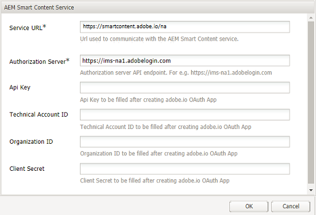

# Configurare l’assegnazione tag delle risorse tramite il Servizio di contenuti avanzati {#configure-asset-tagging-using-the-smart-content-service}

>[!CAUTION]
>
>AEM 6.4 ha raggiunto la fine del supporto esteso e questa documentazione non viene più aggiornata. Per maggiori dettagli, consulta la nostra [periodi di assistenza tecnica](https://helpx.adobe.com/it/support/programs/eol-matrix.html). Trova le versioni supportate [qui](https://experienceleague.adobe.com/docs/).

È possibile integrare [!DNL Adobe Experience Manager] con il Servizio di contenuti avanzati utilizzando [!DNL Adobe Developer Console]. Utilizza questa configurazione per accedere al Servizio di contenuti avanzati da [!DNL Experience Manager].

>[!NOTE]
>
>* I servizi di contenuti avanzati non sono più disponibili per la nuova [!DNL Experience Manager Assets] Clienti on-premise. I clienti on-premise esistenti che dispongono già di questa funzionalità abilitata possono continuare a utilizzare i Servizi di contenuti avanzati.
>* Smart Content Services è disponibile per i servizi esistenti [!DNL Experience Manager Assets] Clienti Managed Services che dispongono già di questa funzionalità abilitata.
>* Nuovo [!DNL Experience Manager Assets] I clienti Managed Services possono seguire le istruzioni riportate in questo articolo per configurare i servizi per contenuti avanzati.

L’articolo descrive le seguenti attività chiave necessarie per configurare il Servizio di contenuti avanzati. Nel back-end, il server di [!DNL Experience Manager] autentica le credenziali del servizio con il gateway di prima di inoltrare la richiesta al Servizio di contenuti avanzati.[!DNL Adobe Developer Console]

1. Crea una configurazione del Servizio di contenuti avanzati in [!DNL Experience Manager] per generare una chiave pubblica. [Ottieni un certificato pubblico](#obtain-public-certificate) per l’integrazione di OAuth.

1. [Crea un’integrazione in Adobe Developer Console](#create-adobe-i-o-integration) e carica la chiave pubblica generata.

1. [Configurare la distribuzione](#configure-smart-content-service) utilizzo della chiave API e di altre credenziali da [!DNL Adobe Developer Console].

1. [Verifica la configurazione](#validate-the-configuration).

1. Facoltativamente, [abilitare l’assegnazione tag automatica al caricamento delle risorse](#enable-smart-tagging-in-the-update-asset-workflow-optional).

## Prerequisiti {#prerequisites}

Prima di utilizzare il Servizio di contenuti avanzati, verifica quanto segue per creare un’integrazione su [!DNL Adobe Developer Console]:

* Devi disporre di un account Adobe ID con privilegi di amministratore dell’organizzazione.

* Il Servizio di contenuti avanzati è abilitato per la tua organizzazione.

Per abilitare i tag avanzati migliorati, oltre a quanto sopra, installa anche l’ [Service Pack di Experience Manager](https://helpx.adobe.com/it/experience-manager/aem-releases-updates.html).

## Creare una configurazione del Servizio di contenuti avanzati per ottenere un certificato pubblico {#obtain-public-certificate}

Un certificato pubblico consente di autenticare il profilo su [!DNL Adobe Developer Console].

1. Nell’interfaccia di [!DNL Experience Manager], accedi a **[!UICONTROL Strumenti]** > **[!UICONTROL Cloud Services]** > **[!UICONTROL Servizi cloud precedenti]**.

1. Nella pagina Cloud Services, fai clic su **[!UICONTROL Configura ora]** sotto **[!UICONTROL Tag avanzati risorse]**.

1. Nella finestra di dialogo **[!UICONTROL Crea configurazione]**, specifica un titolo e un nome per la configurazione di tag avanzati. Fai clic su **[!UICONTROL Crea]**.

1. Nella finestra di dialogo **[!UICONTROL Servizio di contenuti avanzati AEM]**, usa i seguenti valori:

   **[!UICONTROL URL servizio]**: `https://smartcontent.adobe.io/<region where your Experience Manager author instance is hosted>`

   Ad esempio, `https://smartcontent.adobe.io/apac`. Puoi specificare `na`, `emea`oppure `apac` come aree in cui è ospitata l’istanza di authoring di Experience Manager.

   >[!NOTE]
   >
   >Se il provisioning di Experience Manager Managed Service è precedente al 10 settembre 2022, utilizza il seguente URL di servizio:
   >`https://mc.adobe.io/marketingcloud/smartcontent`

   **[!UICONTROL Server autorizzazioni]**: `https://ims-na1.adobelogin.com`

   Lascia vuoti gli altri campi per il momento (dovranno essere riempiti successivamente). Fai clic su **[!UICONTROL OK]**.

   

   *Figura: Finestra di dialogo Servizio di contenuti avanzati per fornire l’URL del servizio di contenuti*

   >[!NOTE]
   >
   >L’URL fornito come [!UICONTROL URL servizio] non è accessibile tramite browser e genera un errore 404. La configurazione funziona correttamente con lo stesso valore del [!UICONTROL URL servizio] parametro . Per informazioni sullo stato generale del servizio e sul programma di manutenzione, consulta [https://status.adobe.com](https://status.adobe.com).

1. Fai clic su **[!UICONTROL Scarica certificato pubblico per integrazione OAuth]** e scarica il file del certificato pubblico `AEM-SmartTags.crt`.

   

   *Figura: Impostazioni del servizio di assegnazione tag avanzati*

### Riconfigura alla scadenza del certificato {#certrenew}

Dopo la scadenza di un certificato, non è più attendibile. Non è possibile rinnovare un certificato scaduto. Per aggiungere un nuovo certificato, effettua le seguenti operazioni.

1. Accedi alla tua implementazione di [!DNL Experience Manager] come amministratore. Fai clic su **[!UICONTROL Strumenti]** > **[!UICONTROL Protezione]** > **[!UICONTROL Utenti]**.

1. Individua e fai clic sull’utente **[!UICONTROL dam-update-service]**. Fai clic su **[!UICONTROL Keystore]** scheda .

1. Elimina il registro chiavi esistente **[!UICONTROL similaritysearch]** con il certificato scaduto. Fai clic su **[!UICONTROL Salva e chiudi]**.

   

   *Figura: per aggiungere un nuovo certificato di sicurezza, elimina la voce esistente `similaritysearch` in Registro chiavi*

1. Vai a **[!UICONTROL Strumenti]** > **[!UICONTROL Cloud Services]** > **[!UICONTROL Servizi cloud precedenti]**. Fai clic su **[!UICONTROL Tag avanzati risorse]** > **[!UICONTROL Mostra configurazioni]** > **[!UICONTROL Configurazioni disponibili]**. Seleziona la configurazione richiesta.

1. Per scaricare un certificato pubblico, fai clic su **[!UICONTROL Scarica certificato pubblico per integrazione OAuth]**.

1. Accedi a [https://console.adobe.io](https://console.adobe.io) e passa ai Servizi di contenuti avanzati esistenti nella pagina **[!UICONTROL Integrazioni]**. Carica il nuovo certificato. Per ulteriori informazioni, consulta le istruzioni in [Creare l’integrazione con la console Adobe Developer](#create-adobe-i-o-integration).

## Creare l’integrazione con la console Adobe Developer {#create-adobe-i-o-integration}

Per utilizzare le API del Servizio di contenuti avanzati, crea un’integrazione nella console Adobe Developer per ottenere [!UICONTROL Chiave API] (generato in [!UICONTROL ID CLIENT] campo dell’integrazione della console Adobe Developer), [!UICONTROL ID ACCOUNT TECNICO], [!UICONTROL ID ORGANIZZAZIONE]e [!UICONTROL SEGRETO CLIENT] per [!UICONTROL Impostazioni del servizio di assegnazione tag avanzati delle risorse] della configurazione cloud in [!DNL Experience Manager].

1. Accedi a [https://console.adobe.io](https://console.adobe.io/) in un browser. Seleziona l’account appropriato e verifica che il ruolo aziendale associato sia quello di amministratore di sistema.

1. Crea un progetto con il nome desiderato. Fai clic su **[!UICONTROL Aggiungi API]**.

1. Sulla **[!UICONTROL Aggiungere un’API]** pagina, seleziona **[!UICONTROL Experience Cloud]** quindi seleziona **[!UICONTROL Contenuto avanzato]**. Fai clic su **[!UICONTROL Avanti]**.

1. Seleziona **[!UICONTROL Carica la chiave pubblica]**. Fornisci il file del certificato scaricato da [!DNL Experience Manager]. Viene visualizzato il messaggio [!UICONTROL Chiavi pubbliche caricate correttamente]. Fai clic su **[!UICONTROL Avanti]**.

   Nella pagina per la [!UICONTROL creazione di una nuova credenziale dell’account di servizio (JWT)] viene visualizzata la chiave pubblica per l’account di servizio appena configurato.

1. Fai clic su **[!UICONTROL Avanti]**.

1. Nella pagina per la **[!UICONTROL selezione dei profili di prodotto]**, seleziona **[!UICONTROL Servizi di contenuti avanzati]**. Fai clic su **[!UICONTROL Salva API configurata]**.

   In una pagina vengono visualizzate ulteriori informazioni sulla configurazione. Tieni aperta questa pagina per copiare e aggiungere questi valori in [!UICONTROL Impostazioni del servizio di assegnazione tag avanzati delle risorse] della configurazione cloud in [!DNL Experience Manager] per configurare tag avanzati.

   

   *Figura: Dettagli dell’integrazione nella console Adobe Developer*

## Configurare il Servizio di contenuti avanzati {#configure-smart-content-service}

Per configurare l’integrazione, utilizza i valori di [!UICONTROL ID ACCOUNT TECNICO], [!UICONTROL ID ORGANIZZAZIONE], [!UICONTROL SEGRETO CLIENT]e [!UICONTROL ID CLIENT] campi dell’integrazione della console Adobe Developer. La creazione di una configurazione cloud di tag avanzati consente l’autenticazione delle richieste API da [!DNL Experience Manager] distribuzione.

1. In [!DNL Experience Manager], passa a **[!UICONTROL Strumenti > Cloud Service > Servizi cloud precedenti]** per aprire la console [!UICONTROL Cloud Services].

1. In **[!UICONTROL Tag avanzati risorse]**, apri la configurazione creata in precedenza. Nella pagina delle impostazioni del servizio, fai clic su **[!UICONTROL Modifica]**.

1. Nella finestra di dialogo **[!UICONTROL Servizio di contenuti avanzati AEM]**, utilizza i valori precompilati per i campi **[!UICONTROL URL servizio]** e **[!UICONTROL Server autorizzazioni]**.

1. Per i campi [!UICONTROL Chiave Api], [!UICONTROL ID account tecnico], [!UICONTROL ID organizzazione]e [!UICONTROL Segreto client], copia e utilizza i seguenti valori generati in [Integrazione con la console Adobe Developer](#create-adobe-i-o-integration).

   | [!UICONTROL Impostazioni servizio tag avanzati di Assets] | [!DNL Adobe Developer Console] campi di integrazione |
   |--- |--- |
   | [!UICONTROL Chiave API] | [!UICONTROL ID CLIENT] |
   | [!UICONTROL ID account tecnico] | [!UICONTROL ID ACCOUNT TECNICO] |
   | [!UICONTROL ID organizzazione] | [!UICONTROL ID ORGANIZZAZIONE] |
   | [!UICONTROL Segreto client] | [!UICONTROL SEGRETO CLIENT] |

## Convalidare la configurazione {#validate-the-configuration}

Dopo aver completato la configurazione, utilizza un MBean JMX per convalidare la configurazione. Per eseguire la convalida, effettua le seguenti operazioni.

1. Accedi al server di [!DNL Experience Manager] all’indirizzo `https://[aem_server]:[port]`.

1. Passa a **[!UICONTROL Strumenti > Operazioni > Console Web]** per aprire la console OSGi. Fai clic su **[!UICONTROL Principale > JMX]**.

1. Fai clic su **[!UICONTROL com.day.cq.dam.similaritysearch.internal.impl]**. Si apre **[!UICONTROL Attività varie SimilaritySearch]**.

1. Fai clic su **[!UICONTROL validateConfigs()]**. Nella finestra di dialogo **[!UICONTROL Validate Configurations]** (Convalida configurazioni), fai clic su **[!UICONTROL Invoke]** (Richiama).

   I risultati della convalida vengono visualizzati nella stessa finestra di dialogo.

## Abilitare l’assegnazione tag avanzati nel flusso di lavoro Risorsa di aggiornamento DAM (facoltativo) {#enable-smart-tagging-in-the-update-asset-workflow-optional}

1. In [!DNL Experience Manager], vai a **[!UICONTROL Strumenti]** > **[!UICONTROL Flusso di lavoro]** > **[!UICONTROL Modelli]**.

1. Nella pagina **[!UICONTROL Modelli flusso di lavoro]**, seleziona il modello del flusso di lavoro **[!UICONTROL Risorsa di aggiornamento DAM]**.

1. Fai clic su **[!UICONTROL Modifica]** nella barra degli strumenti.

1. Per visualizzare i passaggi, espandi il pannello laterale. Trascina il passaggio **[!UICONTROL Risorsa di tag avanzati]** della sezione Flusso di lavoro DAM e inseriscilo dopo il passaggio **[!UICONTROL Elabora miniature]**.

   

   *Figura: Aggiungi il passaggio Risorsa di tag avanzati dopo il passaggio Elabora miniature nel flusso di lavoro Aggiorna risorsa DAM.*

1. Apri il passaggio in modalità di modifica. In **[!UICONTROL Impostazioni avanzate]**, accertati che sia selezionata l’opzione **[!UICONTROL Avanzamento gestore]**.

   

   *Figura: Configura il flusso di lavoro Aggiorna risorsa DAM e aggiungi il passaggio tag avanzati*

1. Nella scheda **[!UICONTROL Argomenti]**, seleziona **[!UICONTROL Ignora errori]** se vuoi che il flusso di lavoro venga completato anche con esito negativo del passaggio di assegnazione tag automatica.

   

   *Figura: Configura il flusso di lavoro Aggiorna risorsa DAM per aggiungere il passaggio tag avanzati e selezionare l&#39;avanzamento del gestore*

   Per assegnare i tag alle risorse quando vengono caricate, a prescindere dal fatto che l’assegnazione tag avanzati sia abilitata o meno per le cartelle, seleziona **[!UICONTROL Ignora flag di tag avanzati]**.

   

   *Figura: Configura il flusso di lavoro Risorsa di aggiornamento DAM per aggiungere il passaggio tag avanzati e selezionare ignora il flag di tag avanzati*

1. Fai clic su **[!UICONTROL OK]** per chiudere il passaggio del processo, quindi salva il flusso di lavoro.

>[!MORELIKETHIS]
>
>* [Gestire tag avanzati](managing-smart-tags.md)
>* [Panoramica e modalità di formazione dei tag avanzati](enhanced-smart-tags.md)
>* [Linee guida e regole per la formazione del Servizio di contenuti avanzati](smart-tags-training-guidelines.md)

