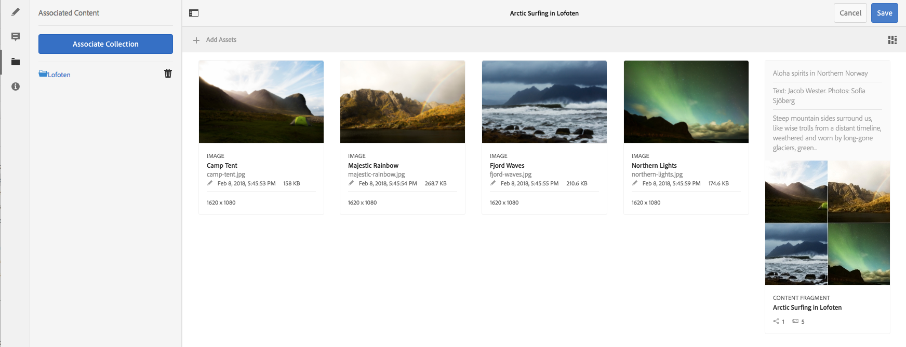

# Contenuto associato {#associated-content}

>[!CAUTION]
>
>Alcune funzionalità dei frammenti di contenuto richiedono l’applicazione di [AEM 6.4 Service Pack 2 (6.4.2.0) o successivo](/help/release-notes/sp-release-notes.md).

Il contenuto associato fornisce la connessione in modo che le risorse (ad es.) possano essere (facoltativamente) utilizzate con il frammento quando viene aggiunto a una pagina di contenuto. Questo offre flessibilità [fornendo una serie di risorse a cui accedere quando si utilizza il frammento di contenuto su una pagina](/help/sites-authoring/content-fragments.md#using-associated-content), riducendo al contempo il tempo necessario per la ricerca della risorsa appropriata.

## Aggiunta di contenuto associato {#adding-associated-content}

>[!NOTE]
>
>Esistono diversi metodi per aggiungere [risorse visive (ad es. immagini)](content-fragments.md#fragments-with-visual-assets) al frammento e/o alla pagina.

Per creare l&#39;associazione è necessario [aggiungere le risorse multimediali a una raccolta](managing-collections-touch-ui.md#adding-assets-to-a-collection). Una volta fatto questo è possibile:

1. Apri il frammento e seleziona **[!UICONTROL Contenuto associato]** dal pannello laterale.

   

1. Seleziona **[!UICONTROL Associa contenuto]** o **[!UICONTROL Associa raccolta]** (a seconda che siano già state associate o meno le raccolte).
1. Seleziona la raccolta richiesta.

   Facoltativamente, è possibile aggiungere il frammento stesso alla raccolta selezionata; questo aiuta il tracciamento.

   

1. Conferma (con il segno di spunta). La raccolta verrà elencata come associata.

   

## Modifica del contenuto associato {#editing-associated-content}

Una volta associata una raccolta puoi:

* **** Rimuove l’associazione.
* **Aggiungi** risorse alla raccolta.
* Seleziona una risorsa per ulteriori azioni.
* Modificare il contenuto.
