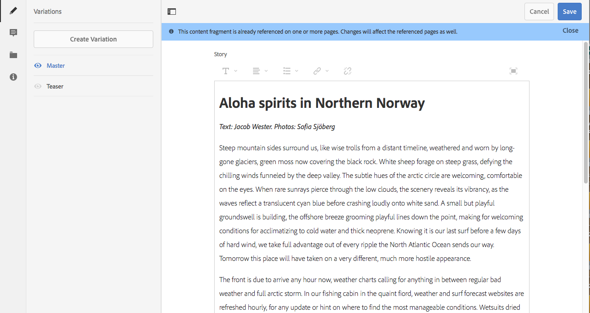

# Gestione dei frammenti di contenuto {#managing-content-fragments}

>[!CAUTION]
>
>Alcune funzionalità per i frammenti di contenuto richiedono l’applicazione di [AEM 6.4 Service Pack 2 (6.4.2.0) o successivo](/help/release-notes/sp-release-notes.md).

I frammenti di contenuto sono memorizzati come **[!UICONTROL risorse]** e sono gestiti principalmente dalla console **[!UICONTROL Risorse]** .

>[!NOTE]
>
>I frammenti di contenuto vengono quindi utilizzati con le pagine di authoring; consultate Authoring delle [pagine con frammenti](/help/sites-authoring/content-fragments.md)di contenuto.

## Creazione di frammenti di contenuto {#creating-content-fragments}

### Creazione di un modello di contenuto {#creating-a-content-model}

[I modelli](content-fragments-models.md) di frammento di contenuto possono essere attivati e creati prima di creare frammenti di contenuto con contenuto strutturato.

>[!NOTE]
>
>Per ulteriori informazioni sui modelli, consulta [Sviluppo di frammenti](/help/sites-developing/customizing-content-fragments.md) di contenuto; utilizzato per i frammenti di contenuto semplici.

### Creazione di un frammento di contenuto {#creating-a-content-fragment}

Il metodo di creazione di un frammento di contenuto è sostanzialmente lo stesso per i frammenti semplici e strutturati:

1. Passa alla cartella **[!UICONTROL Risorse]** in cui desideri creare il frammento.
1. Per aprire la procedura guidata, seleziona **[!UICONTROL Crea]**, quindi **[!UICONTROL Frammento di contenuto]**.
1. Il primo passaggio della procedura guidata richiede di specificare la base del nuovo frammento.

   * Può trattarsi di:

      * [Modello](/help/sites-developing/content-fragment-templates.md) , ad esempio **[!UICONTROL Frammento semplice]**
      * [Modello](content-fragments-models.md) : utilizzato per creare un frammento che richiede contenuto strutturato; ad esempio, il modello **Aeroporto**
   * Vengono visualizzati tutti i modelli disponibili.

   Dopo la selezione, utilizzate **[!UICONTROL Avanti]** per proseguire.

   

1. Nel passaggio **[!UICONTROL Proprietà]** specifica:

   * **[!UICONTROL Base]**

      * **[!UICONTROL Titolo]**

         Titolo del frammento.

         Obbligatorio.

      * **[!UICONTROL Descrizione]**
      * **[!UICONTROL Tag]**
   * **[!UICONTROL Avanzate]**

      * **[!UICONTROL Nome]**

         il nome; verrà utilizzato per formare l&#39;URL.

         Obbligatorio; viene derivato automaticamente dal titolo, ma può essere aggiornato.

1. Seleziona **[!UICONTROL Crea]** per completare l’azione, quindi **[!UICONTROL Apri]** il frammento per la modifica oppure tornare alla console facendo clic su **[!UICONTROL Fine]**.

## Azioni per un frammento di contenuto {#actions-for-a-content-fragment}

Nella console **[!UICONTROL Risorse]** sono disponibili diverse azioni per i frammenti di contenuto:

* Dalla barra degli strumenti; dopo aver selezionato il frammento, sono disponibili tutte le azioni appropriate.
* Come azioni [rapide](/help/sites-authoring/basic-handling.md#quick-actions); un sottoinsieme di azioni disponibili per le singole schede frammento.

Selezionare il frammento per visualizzare la barra degli strumenti con le azioni applicabili:

* **[!UICONTROL Scarica]**

   * Salvare il frammento come file ZIP; potete definire se includere elementi, varianti, metadati.

* **[!UICONTROL Crea]**
* **[!UICONTROL Estrai]**
* **[!UICONTROL Proprietà]**

   * Consente di visualizzare e/o modificare i metadati del frammento.

* **[!UICONTROL Modifica]**

   * Consente di [aprire il frammento per la modifica del contenuto](content-fragments-variations.md) , insieme agli elementi, alle varianti, al contenuto e ai metadati associati.

* **[!UICONTROL Gestisci i tag]**
* **[!UICONTROL Alla raccolta]**

   * Aggiungere il frammento a una raccolta.
   * Questa operazione può essere eseguita anche quando si [associa una raccolta al frammento](content-fragments-assoc-content.md#adding-associated-content).

* **[!UICONTROL Copia/Incolla]**
* **[!UICONTROL Sposta]**
* **[!UICONTROL Pubblicazione rapida]**
* **[!UICONTROL Gestisci pubblicazione]**
* **[!UICONTROL Elimina]**

>[!NOTE]
>
>Molte di queste sono azioni [standard per Risorse](managing-assets-touch-ui.md) e/o per l’app desktop.

## Apertura dell’Editor frammento {#opening-the-fragment-editor}

Per aprire il frammento per la modifica:

>[!CAUTION]
>
>Per modificare un frammento di contenuto è necessario disporre [delle autorizzazioni](/help/sites-developing/customizing-content-fragments.md#asset-permissions)appropriate. In caso di problemi, contattate l&#39;amministratore di sistema.

1. Utilizzate la console **[!UICONTROL Risorse]** per individuare la posizione del frammento di contenuto.
1. Aprire il frammento per la modifica:

   * Toccando o facendo clic sul collegamento del frammento o del frammento (a seconda della vista della console).
   * Selezionare il frammento, quindi **[!UICONTROL Modifica]** dalla barra degli strumenti.

   Viene aperto l’editor frammento:

   

   >[!NOTE]
   >
   >1. Viene visualizzato un messaggio se al frammento è già fatto riferimento in una pagina di contenuto.
      >
      >
   2. Il pannello laterale può essere nascosto o visualizzato utilizzando l’icona **[!UICONTROL Attiva/Disattiva pannello]** laterale.

1. Per spostarsi tra le tre modalità, usate le icone nel pannello laterale:

   * Variazioni: [Modifica dei contenuti](#editing-the-content-of-your-fragment) e [Gestione delle varianti](#creating-and-managing-variations-within-your-fragment)
   * [Annotazioni](content-fragments-variations.md#annotating-a-content-fragment)
   * [Contenuto associato](#associating-content-with-your-fragment)
   * [Metadati](#viewing-and-editing-the-metadata-properties-of-your-fragment)

   

1. Dopo aver apportato le modifiche, usate **[!UICONTROL Salva]** o **[!UICONTROL Annulla]** come necessario.

   >[!NOTE]
   >
   >Sia l’azione **[!UICONTROL Salva]** che **[!UICONTROL Annulla]** causeranno l’uscita dall’editor. Per informazioni complete sul funzionamento di entrambe le opzioni dei frammenti di contenuto, consulta la sezione [Salva, Annulla e Versioni](#save-cancel-and-versions).

## Salva, Annulla e Versioni {#save-cancel-and-versions}

>[!NOTE]
>
>È inoltre possibile [creare, confrontare e ripristinare le versioni dalla Timeline](https://helpx.adobe.com/experience-manager/6-3/assets/using/content-fragments-managing.html#timeline-for-content-fragments).

L&#39;editor dispone di due opzioni:

* **[!UICONTROL Salva]**

   Salvare le modifiche più recenti e uscire dall&#39;editor.

   >[!CAUTION]
   >
   >Per modificare un frammento di contenuto è necessario disporre [delle autorizzazioni](/help/sites-developing/customizing-content-fragments.md#asset-permissions)appropriate. In caso di problemi, contattate l&#39;amministratore di sistema.

   >[!NOTE]
   >
   >Prima di selezionare **[!UICONTROL Salva]**, è possibile restare nell’editor e apportare una serie di modifiche.

   >[!CAUTION]
   >
   >Oltre a salvare semplicemente le modifiche, **[!UICONTROL Salva]** aggiorna anche eventuali riferimenti e garantisce che il dispatcher venga scaricato come necessario. L&#39;elaborazione di queste modifiche può richiedere del tempo. A causa di ciò, può verificarsi un impatto sulle prestazioni di un sistema di grandi dimensioni/complesso/pesantemente caricato.
   >
   >
   >Tenere presente questo aspetto quando si utilizza **[!UICONTROL Salva]** e quindi si reinserisce rapidamente nell’editor frammenti per apportare e salvare ulteriori modifiche.

* **[!UICONTROL Annulla]**

   Uscirà dall’editor senza salvare le modifiche più recenti.

Durante la modifica del frammento di contenuto AEM crea automaticamente delle versioni che garantiscono il ripristino del contenuto precedente in caso di **[!UICONTROL annullamento]** delle modifiche:

1. Quando un frammento di contenuto viene aperto per la modifica AEM verifica l’esistenza del token basato su cookie che indica se esiste una sessione *di* modifica:

   1. Se il token viene trovato, il frammento viene considerato parte della sessione di modifica esistente.
   1. Se il token *non* è disponibile e l&#39;utente avvia la modifica del contenuto, viene creata una versione e viene inviato un token per questa nuova sessione di modifica al client, dove viene salvato in un cookie.

1. In presenza di una sessione di modifica *attiva* , il contenuto in corso di modifica viene automaticamente salvato ogni 600 secondi (impostazione predefinita).

   >[!NOTE]
   >
   >L&#39;intervallo di salvataggio automatico è configurabile utilizzando il `/conf` meccanismo.
   >
   >Valore predefinito, vedere:
   >
   >`/libs/settings/dam/cfm/jcr:content/autoSaveInterval`

1. Se l’utente seleziona **[!UICONTROL Annulla]** modifica, la versione creata all’inizio della sessione di modifica viene ripristinata e il token viene rimosso per terminare la sessione di modifica.
1. Se l’utente seleziona **[!UICONTROL Salva]** le modifiche, gli elementi/varianti aggiornati vengono memorizzati e il token viene rimosso per terminare la sessione di modifica.

## Modifica del contenuto del frammento {#editing-the-content-of-your-fragment}

Dopo aver aperto il frammento, è possibile utilizzare la scheda [Variazioni](content-fragments-variations.md) per creare il contenuto.

## Creazione e gestione di varianti all’interno del frammento {#creating-and-managing-variations-within-your-fragment}

Dopo aver creato il contenuto principale, potete creare e gestire [le varianti](content-fragments-variations.md) di tale contenuto.

## Associazione di contenuto al frammento {#associating-content-with-your-fragment}

È inoltre possibile [associare il contenuto](content-fragments-assoc-content.md) a un frammento. Questa funzione consente una connessione in modo che le risorse (ad es. immagini) possano essere (facoltativamente) utilizzate con il frammento quando questo viene aggiunto a una pagina di contenuto.

## Visualizzazione e modifica dei metadati (proprietà) del frammento {#viewing-and-editing-the-metadata-properties-of-your-fragment}

È possibile visualizzare e modificare le proprietà di un frammento utilizzando la scheda [!UICONTROL Metadati](content-fragments-metadata.md) .

## Timeline per i frammenti di contenuto {#timeline-for-content-fragments}

Oltre alle opzioni standard, [Timeline](managing-assets-touch-ui.md#timeline) fornisce informazioni e azioni specifiche per i frammenti di contenuto:

* Visualizzazione di informazioni su versioni, commenti e annotazioni
* Azioni per le versioni

   * **[!UICONTROL Ripristina questa versione](#reverting-to-a-version)**(selezionare un frammento esistente, quindi una versione specifica)
   * **[!UICONTROL Confronta con corrente](#comparing-fragment-versions)**(selezionare un frammento esistente, quindi una versione specifica)
   * Aggiungere un’ **[!UICONTROL etichetta]** e/o un **[!UICONTROL commento]** (selezionare un frammento esistente, quindi una versione specifica)
   * **[!UICONTROL Salva come versione]** (selezionare un frammento esistente, quindi la freccia su nella parte inferiore della timeline)

* Azioni per le annotazioni

   * **[!UICONTROL Elimina]**

>[!NOTE]
>
>I commenti sono:
>
>* Funzionalità standard per tutte le risorse
>* Realizzato nella timeline
>* Relativa alla risorsa frammento

>
>
Le annotazioni (per i frammenti di contenuto) sono:
>
>* Inserito nell’editor frammento
>* Specifica per un segmento di testo selezionato all&#39;interno del frammento

Ad esempio:

## Confronto delle versioni dei frammenti {#comparing-fragment-versions}

L&#39;azione **[!UICONTROL Confronta con corrente]** è disponibile dalla [!UICONTROL Timeline](https://helpx.adobe.com/experience-manager/6-3/assets/using/content-fragments-managing.html#timeline-for-content-fragments) dopo aver selezionato una versione specifica.

Verrà aperto:

* la versione **[!UICONTROL Corrente]** (più recente) (sinistra)

* la versione selezionata **v&lt;*x.y*>** (destra)

Vengono visualizzati affiancati, dove:

* Eventuali differenze sono evidenziate

   * Testo eliminato - rosso
   * Testo inserito - verde
   * Testo sostituito - blu

* L’icona a schermo intero consente di aprire una delle due versioni da sola; quindi tornate alla visualizzazione parallela
* È possibile **[!UICONTROL ripristinare]** la versione specifica
* **[!UICONTROL Fatto]** , tornerai alla console

>[!NOTE]
>
>Non è possibile modificare il contenuto del frammento durante il confronto dei frammenti.

## Reverting to a Version  {#reverting-to-a-version}

È possibile ripristinare una versione specifica del frammento:

* Direttamente dalla [!UICONTROL timeline](content-fragments-managing.md#timeline-for-content-fragments).

   Selezionate la versione desiderata, quindi l’azione **[!UICONTROL Ripristina versione]** corrente.

* Mentre [confrontate una versione con la versione](content-fragments-managing.md#comparing-fragment-versions) corrente potete **[!UICONTROL tornare]** alla versione selezionata.

## Pubblicazione e riferimento a un frammento {#publishing-and-referencing-a-fragment}

>[!CAUTION]
>
>Se il frammento è basato su un modello, verificare che il [modello sia stato pubblicato](content-fragments-models.md#publishing-a-content-fragment-model).
>
>Se si pubblica un frammento di contenuto per il quale il modello non è ancora stato pubblicato, verrà visualizzato un elenco di selezione e il modello verrà pubblicato insieme al frammento.

I frammenti di contenuto devono essere pubblicati per l’utilizzo nell’ambiente di pubblicazione. Possono essere pubblicati:

* Dopo la creazione; dalla console **[!UICONTROL Risorse]** .
* Quando si [pubblica una pagina che utilizza il frammento](/help/sites-authoring/content-fragments.md#publishing); il frammento verrà elencato nei riferimenti di pagina.

>[!CAUTION]
>
>Dopo aver pubblicato e/o fatto riferimento a un frammento, AEM viene visualizzato un avviso quando un autore riapre il frammento per la modifica. In questo modo viene segnalato che le modifiche apportate al frammento avranno effetto anche sulle pagine di riferimento.

## Eliminazione di un frammento {#deleting-a-fragment}

Per eliminare un frammento:

1. Nella console **[!UICONTROL Risorse]** , andate alla posizione del frammento di contenuto.
1. Selezionare il frammento.

   >[!NOTE]
   >
   >The **[!UICONTROL Delete]** action is not available as a quick action.

1. Select **[!UICONTROL Delete]** from the toolbar.
1. Confermate l’azione **[!UICONTROL Elimina]** .

   >[!CAUTION]
   >
   >Se in una pagina è già presente un riferimento al frammento, verrà visualizzato un messaggio di avviso e sarà necessario confermare che si desidera procedere con **[!UICONTROL Forza eliminazione]**. Il frammento, insieme al relativo componente di frammento di contenuto, verrà eliminato da tutte le pagine di contenuto.

