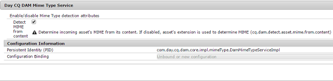

# Utilizzate Apache Tika per rilevare il tipo MIME di risorse digitali {#detecting-mime-type-of-assets-using-apache-tika}

In genere, Risorse Adobe Experience Manager (AEM) rileva il tipo MIME di risorse caricate dall’estensione del file. Se utilizzate Apache Tika per caricare le risorse,  AEM Assets rileva il tipo MIME delle risorse dal flusso di contenuto durante l’operazione di caricamento invece dell’estensione del file.

Questa funzione è disattivata per impostazione predefinita. Per abilitare la funzione, configura il servizio **Day CQ DAM Mime Type** da Configuration Manager.

>[!NOTE]
>
>Il rilevamento del tipo MIME con la libreria Apache Tika richiede molte risorse.

1. Passate a `https://[AEM_server]:[port]/system/console/configMgr` per aprire la console Web di Configuration Manager.
1. Dall&#39;elenco dei servizi, individuare **[!UICONTROL Day CQ DAM Mime Type Service]** e toccare/fare clic sull&#39;icona **[!UICONTROL Edit]** accanto a essa per aprirla in modalità di modifica.

1. Selezionate l&#39;opzione **[!UICONTROL Rileva MIME dal contenuto]** per abilitare l&#39;analisi delle risorse caricate per determinarne il tipo MIME mentre ignorate le estensioni dei file. Per impostazione predefinita, questa opzione è deselezionata.

   

1. Tocca o fai clic su **[!UICONTROL Salva]** per salvare le modifiche.
