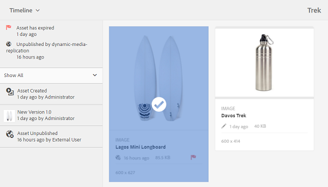
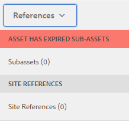
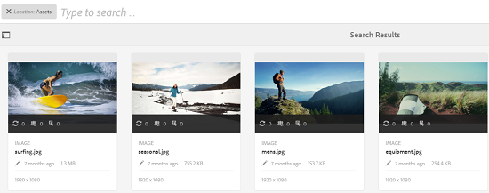
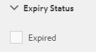
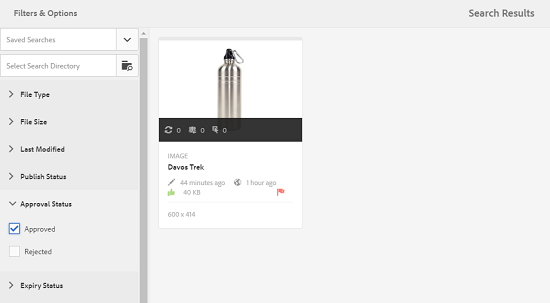

# Digital Rights Management per le risorse {#digital-rights-management-in-assets}

>[!CAUTION]
>
>AEM 6.4 ha raggiunto la fine del supporto esteso e questa documentazione non viene più aggiornata. Per maggiori dettagli, consulta la nostra [periodi di assistenza tecnica](https://helpx.adobe.com/it/support/programs/eol-matrix.html). Trova le versioni supportate [qui](https://experienceleague.adobe.com/docs/).

Le risorse digitali sono spesso associate a una licenza che specifica i termini e la durata dell’utilizzo. Perché [!DNL Adobe Experience Manager Assets] è completamente integrato con [!DNL Experience Manager] Platform, puoi gestire in modo efficiente le informazioni sulla scadenza delle risorse e gli stati delle risorse. È inoltre possibile associare le informazioni sulle licenze alle risorse.

## Scadenza risorse {#asset-expiration}

La scadenza delle risorse è un modo efficace per applicare i requisiti di licenza per le risorse. In questo modo la risorsa pubblicata viene annullata quando scade, evitando così la possibilità di eventuali violazioni della licenza. Un utente senza autorizzazioni di amministratore non può modificare, copiare, spostare, pubblicare e scaricare una risorsa scaduta.

Puoi visualizzare lo stato di scadenza di una risorsa nella [!DNL Assets] nelle viste a schede e a elenco.

*Figura: Nella vista a schede, un flag sulla scheda indica la risorsa scaduta.*

*Figura: Nella vista a elenco, la [!UICONTROL Stato] visualizza la colonna [!UICONTROL Scaduto] striscione.*

Puoi visualizzare lo stato di scadenza di una risorsa nella [!UICONTROL Timeline] nella barra a sinistra.

>[!NOTE]
>
>La data di scadenza di una risorsa viene visualizzata in modo diverso per gli utenti con diversi valori orari.

Puoi anche visualizzare lo stato di scadenza delle risorse nella **[!UICONTROL Riferimenti]** barra. Gestisce gli stati di scadenza delle risorse e le relazioni tra le risorse composte e le risorse secondarie, le raccolte e i progetti a cui si fa riferimento.

1. Passa alla risorsa per la quale desideri visualizzare i riferimenti alle pagine web e alle risorse composte.
1. Seleziona la risorsa e fai clic sul pulsante [!DNL Experience Manager] logo.

   

1. Scegli **[!UICONTROL Riferimenti]** dal menu.

   

   Per le risorse scadute, nella barra Riferimenti viene visualizzato lo stato di scadenza **[!UICONTROL Risorsa scaduta]** in alto.

   

   Se la risorsa è scaduta, nella barra laterale Riferimenti viene visualizzato lo stato **[!UICONTROL Risorse secondarie scadute]**.

   

### Cercare risorse scadute {#search-expired-assets}

Puoi cercare le risorse scadute, incluse le risorse secondarie scadute, nel pannello Ricerca.

1. In [!DNL Assets] nella console, fai clic su **[!UICONTROL Ricerca]** nella barra degli strumenti per visualizzare la casella Omnisearch.

   

1. Con il cursore nella casella Omnisearch, premere il tasto Invio per visualizzare la pagina dei risultati della ricerca.

   

1. Fai clic su [!DNL Experience Manager] per visualizzare il pannello di ricerca.

   

1. Fai clic sul pulsante **[!UICONTROL Stato di scadenza]** per espanderlo.

   

1. Scegli **[!UICONTROL Scaduto]**. Le risorse scadute vengono visualizzate nei risultati della ricerca.

   

Quando scegli la **[!UICONTROL Scaduto]** l&#39;opzione [!DNL Assets] in console vengono visualizzate solo le risorse e le risorse secondarie scadute a cui fanno riferimento le risorse composte. Le risorse composte che fanno riferimento a risorse secondarie scadute non vengono visualizzate immediatamente dopo la scadenza delle risorse secondarie. Vengono invece visualizzati dopo [!DNL Experience Manager] rileva che fanno riferimento a risorse secondarie scadute alla successiva esecuzione della pianificazione.

Se modifichi la data di scadenza di una risorsa pubblicata a una data precedente al ciclo di pianificazione corrente, la pianificazione rileva comunque questa risorsa come una risorsa scaduta la prossima volta che viene eseguita e ne riflette lo stato di conseguenza.

Inoltre, se un errore o un errore impedisce al programmatore di rilevare le risorse scadute nel ciclo corrente, lo scheduler riesamina tali risorse nel ciclo successivo e ne rileva lo stato scaduto.

Per abilitare [!DNL Assets] per visualizzare le risorse composte di riferimento insieme alle risorse secondarie scadute, configura un **[!UICONTROL Notifica di scadenza di Adobe CQ DAM]** workflow in [!DNL Experience Manager] Gestione configurazione.

1. Apri [!DNL Experience Manager] Gestione configurazione.
1. Scegli **[!UICONTROL Notifica di scadenza di Adobe CQ DAM]**. Per impostazione predefinita, **[!UICONTROL Pianificazione basata su tempo]** è selezionata, che pianifica un processo per verificare in un momento specifico se una risorsa è scaduta. Al termine del processo, le risorse con risorse secondarie scadute e risorse di riferimento vengono visualizzate come scadute nei risultati della ricerca.

   

1. Per eseguire il processo periodicamente, cancella il campo **[!UICONTROL Time Based Scheduler Rule (Regola modulo di pianificazione basato sul tempo)]** e modifica il tempo in secondi nel campo **[!UICONTROL Periodic Scheduler (Modulo di pianificazione periodica)]**. L’espressione di esempio ‘0 0 0 &amp;ast; &amp;ast; ?’ attiva il processo alle ore 00.
1. Seleziona **[!UICONTROL invia e-mail]** ricevere e-mail alla scadenza di una risorsa.

   >[!NOTE]
   >
   >Solo il creatore di risorse (la persona che carica una particolare risorsa in [!DNL Assets]) riceve un’e-mail alla scadenza della risorsa. Vedi [come configurare le notifiche e-mail](/help/sites-administering/notification.md) per ulteriori dettagli sulla configurazione delle notifiche e-mail, consulta [!DNL Experience Manager] livello.

1. In **[!UICONTROL Notifica preventiva in secondi]** Specifica l’intervallo di tempo in secondi prima della scadenza di una risorsa quando desideri ricevere una notifica relativa alla scadenza. Gli amministratori o i creatori di risorse ricevono un messaggio prima della scadenza della risorsa che ti informa che la risorsa sta per scadere dopo il tempo specificato.

   Dopo la scadenza della risorsa, riceverai un’altra notifica che conferma la scadenza. Inoltre, le risorse scadute vengono disattivate.

1. Fai clic su **[!UICONTROL Salva]**.

## Stati delle risorse {#asset-states}

La [!DNL Assets] La console può visualizzare vari stati delle risorse. A seconda dello stato corrente di una particolare risorsa, nella relativa vista a schede viene visualizzata un’etichetta che ne descrive lo stato, ad esempio Scaduto, Pubblicato, Approvato, Rifiutato e così via.

1. In [!DNL Assets] interfaccia utente, seleziona una risorsa.

   

1. Fai clic su **[!UICONTROL Pubblica]** dalla barra degli strumenti. Se non vedi **Pubblica** sulla barra degli strumenti, fai clic su **[!UICONTROL Altro]** sulla barra degli strumenti e individua **[!UICONTROL Pubblica]** opzione .

   

1. Scegli **[!UICONTROL Pubblica]** dal menu , quindi chiudi la finestra di dialogo di conferma.
1. Esci dalla modalità di selezione. Lo stato di pubblicazione della risorsa viene visualizzato nella parte inferiore della miniatura della risorsa nella vista a schede. Nella vista a elenco, la colonna Pubblicato visualizza l’ora in cui è stata pubblicata la risorsa.

   

1. Per visualizzare la pagina dei dettagli della relativa risorsa, nella [!DNL Assets] interfaccia, seleziona una risorsa e fai clic su **[!UICONTROL Proprietà]**.

   

1. Nella scheda Avanzate , imposta una data di scadenza per la risorsa dal **[!UICONTROL Scadenza]** campo .

   

   *Figura: [!UICONTROL Avanzate] scheda nella risorsa [!UICONTROL Proprietà] pagina per impostare la scadenza delle risorse.*

1. Fai clic su **[!UICONTROL Salva]** quindi fai clic su **[!UICONTROL Chiudi]** per visualizzare la console Risorse .
1. Lo stato di pubblicazione della risorsa indica uno stato scaduto nella parte inferiore della miniatura della risorsa nella vista a schede. Nella vista a elenco, lo stato della risorsa viene visualizzato come **[!UICONTROL Scaduto]**.

   

1. In [!DNL Assets] console, seleziona una cartella e crea un’attività di revisione nella cartella.
1. Rivedi e approva/rifiuta le risorse nell’attività di revisione e fai clic su **[!UICONTROL Completa]**.
1. Passare alla cartella per la quale è stata creata l&#39;attività di revisione. Lo stato delle risorse approvate o rifiutate viene visualizzato nella parte inferiore della vista a schede. Nella vista a elenco, gli stati di approvazione e scadenza vengono visualizzati nelle colonne appropriate.

   

1. Per cercare le risorse in base al loro stato, fai clic su **[!UICONTROL Ricerca]** per visualizzare la barra Omnisearch.

   

1. Premi Invio e fai clic su [!DNL Experience Manager] per visualizzare il pannello di ricerca.
1. Nel pannello di ricerca, fai clic su **[!UICONTROL Stato di pubblicazione]** e seleziona **[!UICONTROL Pubblicato]** per cercare le risorse pubblicate in [!DNL Assets].

   

1. Fai clic su **[!UICONTROL Stato di approvazione]** e fai clic sull’opzione appropriata per cercare le risorse approvate o rifiutate.

   

1. Per cercare le risorse in base al loro stato di scadenza, seleziona **[!UICONTROL Stato scadenza]** nel pannello di ricerca e scegli l’opzione appropriata.

   

1. Puoi anche cercare le risorse in base a una combinazione di stati in vari facet di ricerca. Ad esempio, puoi cercare le risorse pubblicate che sono state approvate in un’attività di revisione e che non sono ancora scadute selezionando le opzioni appropriate nei facet di ricerca.

   

## Digital Rights Management in [!DNL Assets] {#digital-rights-management-in-assets-1}

Questa funzione applica l’accettazione del contratto di licenza prima di poter scaricare una risorsa con licenza da [!DNL Adobe Experience Manager Assets].

Se selezioni una risorsa protetta e fai clic su **[!UICONTROL Scarica]**, viene reindirizzato a una pagina di licenza per accettare il contratto di licenza. Se non accetti il contratto di licenza, la **[!UICONTROL Scarica]** opzione non disponibile.

Se la selezione contiene più risorse protette, seleziona una risorsa alla volta, accetta il contratto di licenza e procedi con il download.

Un’attività è considerata protetta se una di queste condizioni è soddisfatta:

* Proprietà dei metadati della risorsa `xmpRights:WebStatement` punta al percorso della pagina che contiene il contratto di licenza per la risorsa.
* Valore della proprietà dei metadati della risorsa `adobe_dam:restrictions` è un HTML non elaborato che specifica il contratto di licenza.

>[!NOTE]
>
>La posizione `/etc/dam/drm/licenses` utilizzati per la conservazione delle licenze nelle versioni precedenti di [!DNL Experience Manager] è obsoleto.
>
>Se crei o modifichi pagine di licenza o le porti da precedenti [!DNL Experience Manager] versioni, l’Adobe consiglia di memorizzarle in `/apps/settings/dam/drm/licenses` o `/conf/&ast;/settings/dam/drm/licenses`.

### Scaricare risorse protette da DRM {#downloading-drm-assets}

1. Nella vista a schede, seleziona le risorse da scaricare e fai clic su **[!UICONTROL Scarica]**.
1. Nella pagina **[!UICONTROL Gestione copyright]**, seleziona dall’elenco la risorsa da scaricare.
1. In [!UICONTROL Licenza] riquadro, scegli **[!UICONTROL Accetto]**. Accanto alla risorsa viene visualizzato un segno di spunta. Fai clic sul pulsante **[!UICONTROL Scarica]** opzione .

   >[!NOTE]
   >
   >La **[!UICONTROL Scarica]** l’opzione è abilitata solo quando scegli di accettare il contratto di licenza per una risorsa protetta. Tuttavia, se la selezione include sia risorse protette che non protette, solo le risorse protette sono elencate nel riquadro e nella **[!UICONTROL Scarica]** è abilitata per scaricare le risorse non protette. Per accettare in contemporanea i contratti di licenza per più risorse protette, seleziona le risorse dall’elenco e fai clic su **[!UICONTROL Accetto]**.

   

1. Nella finestra di dialogo, fai clic su **[!UICONTROL Scarica]** per scaricare la risorsa o le relative rappresentazioni.
