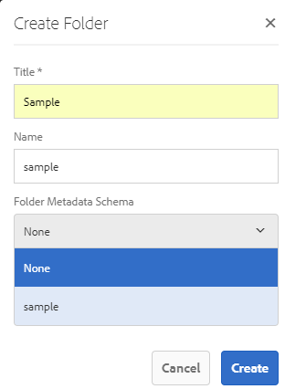

# Schema metadati cartelle {#folder-metadata-schema}

>[!CAUTION]
>
>AEM 6.4 ha raggiunto la fine del supporto esteso e questa documentazione non viene più aggiornata. Per maggiori dettagli, consulta la nostra [periodi di assistenza tecnica](https://helpx.adobe.com/it/support/programs/eol-matrix.html). Trova le versioni supportate [qui](https://experienceleague.adobe.com/docs/).

Questo articolo descrive come creare uno schema di metadati per le cartelle di risorse in [!DNL Experience Manager] Risorse.

Adobe Experience Manager Assets consente di creare schemi di metadati per le cartelle di risorse, che definiscono il layout e i metadati visualizzati nelle pagine delle proprietà della cartella.

>[!NOTE]
>
>Questa funzionalità richiede [!DNL Experience Manager] 6.4 con almeno Service Pack 2 implementato. Per [!DNL Experience Manager] 6.4 dettagli del service pack, vedi questi [note sulla versione](/help/release-notes/sp-release-notes.md).

## Aggiunta di un modulo schema metadati cartella {#add-a-folder-metadata-schema-form}

Utilizza l’editor Forms per Schema metadati cartelle per creare e modificare schemi di metadati per le cartelle.

1. Tocca o fai clic sul pulsante [!DNL Experience Manager] e vai a **[!UICONTROL Strumenti]** > **[!UICONTROL Risorse]**> **[!UICONTROL Schemi metadati cartelle]**.
1. Nella pagina Forms Schema metadati cartelle, tocca o fai clic su **[!UICONTROL Crea]**.
1. Specifica un nome per il modulo, quindi tocca o fai clic su **[!UICONTROL Crea]**. Il nuovo modulo schema è elencato nella pagina Forms schema.

## Modifica dei moduli dello schema metadati della cartella {#edit-folder-metadata-schema-forms}

È possibile modificare un modulo schema metadati appena aggiunto o esistente, che include quanto segue:

* Schede
* Elementi modulo all’interno di schede.

Puoi mappare/configurare questi elementi del modulo su un campo all’interno di un nodo di metadati nell’archivio CRX. È possibile aggiungere nuove schede o nuovi elementi modulo al modulo schema metadati.

1. Nella pagina Forms schema, seleziona il modulo creato, quindi tocca o fai clic sul pulsante **[!UICONTROL Modifica]** dalla barra degli strumenti.
1. Nella pagina Editor schema metadati cartelle, tocca o fai clic sul pulsante **[!UICONTROL +]** per aggiungere una scheda al modulo. Per rinominare la scheda, tocca o fai clic sul nome predefinito e specifica il nuovo nome in **[!UICONTROL Impostazioni]**.

   

   Per aggiungere altre schede, tocca o fai clic sul pulsante **[!UICONTROL +]** icona. Tocca o fai clic su **[!UICONTROL X]** per eliminare una scheda.

1. Nella scheda attiva , aggiungi uno o più componenti dal **[!UICONTROL Crea modulo]** scheda .

   

   Se crei più schede, tocca o fai clic su una scheda specifica per aggiungere componenti.

1. Per configurare un componente, selezionalo e modificane le proprietà nel **[!UICONTROL Impostazioni]** scheda .

   Se necessario, elimina un componente dal **[!UICONTROL Impostazioni]** scheda .

   

1. Tocca o fai clic su **[!UICONTROL Salva]** dalla barra degli strumenti per salvare le modifiche.

### Componenti per la creazione di moduli {#components-to-build-forms}

La **[!UICONTROL Crea modulo]** nella scheda vengono elencati gli elementi del modulo utilizzati nel modulo schema metadati della cartella. La **[!UICONTROL Impostazioni]** visualizza gli attributi per ogni elemento selezionato nella scheda **[!UICONTROL Crea modulo]** scheda . Elenco degli elementi del modulo disponibili nel **[!UICONTROL Crea modulo]** scheda:

| Nome componente | Descrizione |
|---|---|
| [!UICONTROL Intestazione sezione] | Aggiungi un’intestazione di sezione per un elenco di componenti comuni. |
| [!UICONTROL Testo su riga singola] | Aggiungi una proprietà di testo a riga singola. Viene memorizzato come stringa. |
| [!UICONTROL Testo con più valori] | Aggiungi una proprietà di testo con più valori. Viene memorizzato come array di stringhe. |
| [!UICONTROL Numero] | Aggiungi un componente numerico. |
| [!UICONTROL Data] | Aggiungi un componente data . |
| [!UICONTROL A discesa] | Aggiungi un elenco a discesa. |
| [!UICONTROL Tag standard] | Aggiungi un tag. |
| [!UICONTROL Campo nascosto] | Aggiungi un campo nascosto. Viene inviato come parametro POST al momento del salvataggio della risorsa. |

### Modifica degli elementi del modulo {#editing-form-items}

Per modificare le proprietà degli elementi del modulo, tocca o fai clic sul componente e modifica tutte le proprietà o un sottoinsieme delle seguenti nella sezione **[!UICONTROL Impostazioni]** scheda .

**[!UICONTROL Etichetta campo]**: Nome della proprietà di metadati visualizzata nella pagina delle proprietà della cartella.

**[!UICONTROL Mappa su proprietà]**: Questa proprietà specifica il percorso relativo del nodo della cartella nell&#39;archivio CRX in cui viene salvato. Inizia con &quot;**./**&quot;, che indica che il percorso si trova sotto il nodo della cartella.

Di seguito sono riportati i valori validi per questa proprietà:

* `./jcr:content/metadata/dc:title`: Memorizza il valore nel nodo di metadati della cartella come proprietà `dc:title`.

* `./jcr:created`: Visualizza la proprietà JCR nel nodo della cartella. Se configuri queste proprietà in CRXDE, Adobe consiglia di contrassegnarle come Disabilita modifica, perché sono protette. Altrimenti, l&#39;errore &#39; `Asset(s) failed to modify`&quot; si verifica quando salvi le proprietà della risorsa.

Per garantire che il componente sia visualizzato correttamente nel modulo schema metadati, non includere uno spazio nel percorso della proprietà.

**[!UICONTROL Percorso JSON]**: Usarlo per specificare il percorso del file JSON in cui specificare coppie chiave-valore per le opzioni.

**[!UICONTROL Segnaposto]**: Utilizzare questa proprietà per specificare il testo segnaposto pertinente relativo alla proprietà metadati.

**[!UICONTROL Scelte]**: Utilizzare questa proprietà per specificare le scelte in un elenco.

**[!UICONTROL Descrizione]**: Utilizza questa proprietà per aggiungere una breve descrizione per il componente metadati.

**[!UICONTROL Classe]**: Classe oggetto a cui è associata la proprietà.

## Eliminare i moduli di schema metadati della cartella {#delete-folder-metadata-schema-forms}

È possibile eliminare i moduli schema metadati cartelle dalla pagina Forms Schema metadati cartelle. Per eliminare un modulo, selezionalo e tocca o fai clic sull’icona Elimina sulla barra degli strumenti.

## Assegnare uno schema di metadati della cartella {#assign-a-folder-metadata-schema}

È possibile assegnare uno schema di metadati a una cartella dalla pagina Forms Schema metadati cartelle o durante la creazione di una cartella.

Se si configura uno schema di metadati per una cartella, il percorso del modulo schema viene memorizzato in `folderMetadataSchema` della proprietà del nodo della cartella sotto .*/jcr:content*.

### Assegnare a uno schema dalla pagina Schema metadati cartelle {#assign-to-a-schema-from-the-folder-metadata-schema-page}

1. Tocca o fai clic sul pulsante [!DNL Experience Manager] e vai a **[!UICONTROL Strumenti]** > **[!UICONTROL Risorse]** > **[!UICONTROL Schemi metadati cartelle]**.
1. Nella pagina Forms Schema metadati cartelle selezionare il modulo schema da applicare a una cartella.
1. Dalla barra degli strumenti, tocca o fai clic su **[!UICONTROL Applica a cartelle]**.

1. Seleziona la cartella in cui applicare lo schema, quindi tocca o fai clic su **[!UICONTROL Applica]**. Se nella cartella è già applicato uno schema di metadati, un messaggio di avviso segnala che lo schema di metadati esistente sta per essere sovrascritto. Tocca o fai clic su **[!UICONTROL Sovrascrittura]**.
1. Apri le proprietà dei metadati per la cartella a cui hai applicato lo schema metadati.

   

   Per visualizzare i campi di metadati della cartella, tocca o fai clic sulla scheda **[!UICONTROL Folder Metadata (Metadati cartella)]**.

   

### Assegnare uno schema durante la creazione di una cartella {#assign-a-schema-when-creating-a-folder}

È possibile assegnare uno schema di metadati della cartella durante la creazione di una cartella. Se nel sistema è presente almeno uno schema di metadati della cartella, viene visualizzato un elenco aggiuntivo nel **[!UICONTROL Crea cartella]** finestra di dialogo. È possibile selezionare lo schema desiderato. Per impostazione predefinita, non è selezionato alcun schema.

1. Da [!DNL Assets] interfaccia utente, tocca/fai clic **[!UICONTROL Crea]** dalla barra degli strumenti.
1. Specifica un titolo e un nome per la cartella.
1. Dall’elenco Schema metadati cartelle, selezionare lo schema desiderato. Quindi, tocca o fai clic su **[!UICONTROL Crea]**.

   

1. Apri le proprietà dei metadati per la cartella a cui hai applicato lo schema metadati.
1. Per visualizzare i campi di metadati della cartella, tocca o fai clic sulla scheda **[!UICONTROL Folder Metadata (Metadati cartella)]**.

## Utilizzare lo schema metadati della cartella {#use-the-folder-metadata-schema}

Apri le proprietà di una cartella configurata con uno schema di metadati della cartella. Nella pagina delle proprietà della cartella viene visualizzata la scheda **[!UICONTROL Metadati cartella]**. Seleziona questa scheda per visualizzare il modulo schema metadati della cartella.

Immetti i valori dei metadati nei vari campi e tocca o fai clic su **[!UICONTROL Salva]** per memorizzare i valori. I valori specificati vengono memorizzati nel nodo della cartella nell&#39;archivio CRX.

