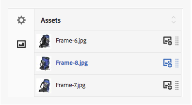

# Set di immagini {#image-sets}

I set di immagini offrono agli utenti un’esperienza di visualizzazione integrata, grazie alla quale gli utenti possono vedere diverse viste di un elemento facendo clic su una miniatura. I set di immagini consentono di presentare visualizzazioni alternative di un elemento e il visualizzatore offre strumenti di zoom per esaminare le immagini da vicino.

I set di immagini sono contrassegnati da un banner con la scritta **[!UICONTROL IMAGESET]**. Inoltre, se il set di immagini è pubblicato, la data di pubblicazione, indicata dall’icona **[!UICONTROL mondo]**, è riportata sul banner insieme all’ultima data di modifica, contrassegnata dall’icona a forma di **[!UICONTROL matita]**.

All’interno del set di immagini, potete anche creare dei campioni creando un set di immagini e aggiungendo delle miniature.

Questa applicazione è particolarmente utile per visualizzare un elemento con un colore, un motivo o una finitura diversi. Per creare un set di immagini con campioni colore, è necessaria un’immagine per ciascun colore, motivo o finitura differente che desiderate presentare agli utenti. È inoltre necessario disporre di un campione di colore, motivo o finitura per ciascun colore, motivo o finitura.

Ad esempio, supponete di voler presentare immagini di berretti con diverse bollette di colore; le bollette sono rosse, verdi e blu. In questo caso, avete bisogno di tre scatti dello stesso berretto. Avete bisogno di uno scatto con un rosso, uno con un verde, e uno con una bolletta blu. È inoltre necessario disporre di un campione colore rosso, verde e blu. I campioni colore fungono da miniature su cui gli utenti possono fare clic nel visualizzatore di set di campioni per visualizzare il berretto con la visiera rossa, quello con la visiera verde o quello con la visiera blu.

>[!NOTE]
>
>Per informazioni sull&#39;interfaccia utente di Risorse, consultate [Gestione delle risorse con l&#39;interfaccia utente touch](managing-assets-touch-ui.md).

## Avvio rapido: Set di immagini {#quick-start-image-sets}

Per iniziare subito a lavorare:

1. [Caricate le immagini primarie per più viste.](#uploading-assets-in-image-sets)

   Per iniziare, caricate le immagini per i set di immagini. Poiché gli utenti possono eseguire lo zoom sulle immagini nel visualizzatore di set di immagini, tenete conto dello zoom quando scegliete le immagini. Accertatevi che la dimensione massima delle immagini sia di almeno 2000 pixel per garantire dettagli di zoom ottimali. Dynamic Media può eseguire il rendering delle immagini fino a 25 megapixel ciascuna. Ad esempio, potete usare un’immagine da 5000 x 5000 megapixel o qualsiasi altra combinazione di dimensioni fino a 25 megapixel.

    AEM Assets supporta molti formati di file immagine, ma si consigliano immagini senza perdita di dati TIFF, PNG ed EPS.

1. [Creare set di immagini.](#creating-image-sets)

   In Set immagini, gli utenti fanno clic sulle miniature nel visualizzatore di set di immagini.

   Per creare un set di immagini nelle risorse, toccate **[!UICONTROL Crea > Set immagini]**. Quindi, aggiungete le immagini e toccate **[!UICONTROL Salva]**.

   È inoltre possibile creare automaticamente i set di immagini mediante i predefiniti per set di batch [predefiniti](/help/assets/config-dms7.md#creating-batch-set-presets-to-auto-generate-image-sets-and-spin-sets).

   **Importante** — I set di batch vengono creati dall’IPS (Image Production System) come parte dell’assimilazione delle risorse e sono disponibili solo in modalità Dynamic Media - Scene7.

   Consultate [Preparazione delle risorse di set di immagini per il caricamento e Caricamento dei file](#uploading-assets-in-image-sets).

   Vedere [Uso dei selettori.](working-with-selectors.md)

1. Aggiungete i predefiniti per visualizzatori di set di immagini [a seconda delle necessità.](managing-viewer-presets.md)

   Gli amministratori possono creare o modificare i predefiniti per visualizzatori di immagini **[!UICONTROL Set Image Presets]**. Per visualizzare il set di immagini con un predefinito per visualizzatori, selezionate il set di immagini e, nel menu a discesa a sinistra, selezionate **[!UICONTROL Visualizzatori]**.

   Per creare o modificare i predefiniti per visualizzatori, consultate **[!UICONTROL Strumenti > Risorse > Predefiniti visualizzatore]**.

1. (Facoltativo) [Visualizzazione di set di immagini](image-sets.md#viewing-image-sets) creati utilizzando i predefiniti per set di batch.
1. [Anteprima set di immagini.](previewing-assets.md)

   Selezionate il set di immagini ed effettuate l’anteprima. Toccate le icone delle miniature per esaminare il set di immagini nel visualizzatore selezionato. Potete scegliere diversi visualizzatori dal menu **[!UICONTROL Visualizzatori]**, disponibile dal menu a discesa della barra a sinistra.

1. [Pubblicare i set di immagini.](publishing-dynamicmedia-assets.md)

   Quando si pubblica un set di immagini, vengono attivate le stringhe URL e Incorpora. Inoltre, è necessario [pubblicare qualsiasi predefinito per visualizzatori personalizzato](managing-viewer-presets.md) creato. I predefiniti per visualizzatori forniti sono già stati pubblicati.

1. [Collegate gli URL all’](linking-urls-to-yourwebapplication.md) applicazione Web o  [incorporate il visualizzatore](embed-code.md) video o immagini.

    AEM Assets crea richieste URL per i set di immagini e le attiva dopo la pubblicazione dei set di immagini. Potete copiare questi URL quando visualizzate l’anteprima delle risorse. In alternativa, potete incorporarli nel sito Web.

   Seleziona il set di immagini, quindi fai clic su **[!UICONTROL Visualizzatori]** dal menu a discesa della barra a sinistra.

   Consulta le sezioni [Collegamento di un set di immagini a una pagina web](linking-urls-to-yourwebapplication.md) e [Incorporamento di un visualizzatore di video o immagini](embed-code.md).

Per modificare i set di immagini, consultate [modifica dei set di immagini.](#editing-image-sets) Inoltre, potete visualizzare e modificare le proprietà [ dei set di ](managing-assets-touch-ui.md#editing-properties)immagini.

In caso di problemi durante la creazione di set, vedere Immagini e set in [Risoluzione di problemi su Dynamic Media - modalità Scene7](troubleshoot-dms7.md#images-and-sets).

## Caricamento delle risorse in set di immagini {#uploading-assets-in-image-sets}

Per iniziare, caricate le immagini per i set di immagini. Poiché gli utenti possono eseguire lo zoom sulle immagini nel visualizzatore di set di immagini, tenete conto dello zoom quando scegliete le immagini. Verifica che le immagini abbiano una dimensione maggiore che sia di almeno 2000 pixel. I set di immagini supportano molti formati di file immagine, ma sono consigliate immagini senza perdita di dati TIFF, PNG ed EPS.

Potete caricare le immagini per i set di immagini come fareste per [caricare qualsiasi altra risorsa in Risorse](managing-assets-touch-ui.md#uploading-assets).

### Preparazione delle risorse di set di immagini per il caricamento {#preparing-image-set-assets-for-upload}

Prima di creare i set di immagini, accertatevi che le immagini siano delle dimensioni e del formato corretti.

Per creare un set di immagini a visualizzazione multipla, sono necessarie immagini che mostrino un elemento da diversi punti di vista o che mostrino diversi aspetti dello stesso elemento. L’obiettivo è quello di evidenziare le funzioni importanti di un elemento in modo che gli utenti possano avere un’immagine completa dell’aspetto o della funzione dell’elemento.

Poiché gli utenti possono eseguire lo zoom delle immagini in set di immagini, accertatevi che la dimensione maggiore delle immagini sia di almeno 2000 pixel. Le risorse supportano molti formati di file immagine, ma sono consigliate immagini senza perdita di dati TIFF, PNG ed EPS.

>[!NOTE]
>
>Inoltre, se usate delle miniature per indicare i campioni di prodotto, dovete effettuare le seguenti operazioni:
>
>È necessario disporre di vignettature o diversi scatti della stessa immagine che la mostrino in diversi colori, motivi o finiture. Sono inoltre necessari file di miniature corrispondenti ai diversi colori, motivi o finiture. Ad esempio, per presentare le miniature con un set di immagini che mostra la stessa giacca in nero, marrone e verde, è necessario disporre di:
>
>* Una ripresa nera, marrone e verde della stessa giacca.
>* Miniatura di colore nera, marrone e verde.

>

## Creazione di set di immagini {#creating-image-sets}

Potete creare i set di immagini tramite l’interfaccia utente o tramite l’API. Questa sezione descrive come creare i set di immagini nell’interfaccia utente.

>[!NOTE]
>
>È inoltre possibile creare automaticamente i set di immagini mediante i predefiniti per set di batch [predefiniti](/help/assets/config-dms7.md#creating-batch-set-presets-to-auto-generate-image-sets-and-spin-sets).

**Importante:i set di** batch vengono creati dall’IPS (Image Production System) come parte dell’assimilazione delle risorse e sono disponibili solo in modalità Dynamic Media - Scene7.

Quando aggiungete delle risorse al set, queste vengono automaticamente aggiunte in ordine alfanumerico. Potete riordinare o ordinare manualmente le risorse dopo averle aggiunte.

>[!NOTE]
>
>I set di immagini non sono supportati per le risorse con `,` (virgola) nel nome del file.

**Per creare un set** di immagini:

1. In **Risorse**, andate nel punto in cui desiderate creare un set di immagini, toccate **[!UICONTROL Crea]** e selezionate **[!UICONTROL Set immagini]**. Puoi anche creare il set dall’interno di una cartella contenente le risorse.

   

1. Nella pagina Editor set di immagini, nel campo **[!UICONTROL Titolo]** immettete un nome per il set di immagini. Il nome viene visualizzato nel banner lungo il set di immagini. Facoltativamente, immettete una descrizione.

   

   >[!NOTE]
   >
   >Quando crei il set di immagini, puoi modificare la miniatura del set o consentire ad AEM di selezionarla automaticamente in base alle risorse del set di immagini. Per selezionare una miniatura, toccate **[!UICONTROL Cambia miniatura]** e selezionate una qualsiasi immagine (per trovare anche le immagini potete passare ad altre cartelle). Se hai selezionato una miniatura e vuoi che AEM ne generi una dal set di immagini, fai clic su **[!UICONTROL Passa alla Miniatura automatica]**.

1. Effettuate una delle seguenti operazioni:

   * Nell&#39;angolo superiore sinistro della pagina **[!UICONTROL Editor set di immagini]**, toccate **[!UICONTROL Aggiungi risorsa]**.
   * Al centro della pagina **[!UICONTROL Editor set di immagini]**, toccate **[!UICONTROL Toccate per aprire il selettore delle risorse]**.

   Toccate per selezionare le risorse da includere nel set di immagini. Le risorse selezionate dispongono di un’icona a forma di segno di spunta. Al termine, nell&#39;angolo superiore destro della pagina, toccare **[!UICONTROL Seleziona]**.

   Con il Selettore risorse, puoi cercare le risorse digitando una parola chiave e toccando **[!UICONTROL Invio]**. Per perfezionare i risultati della ricerca, puoi anche applicare i filtri. Puoi filtrare in base a percorso, raccolta, tipo di file e tag. Seleziona il filtro e tocca l’icona **[!UICONTROL Filtro]** nella barra degli strumenti. Modificare la visualizzazione toccando l&#39;icona **[!UICONTROL Visualizza]** e selezionando **[!UICONTROL Visualizzazione a colonne]**, **[!UICONTROL Visualizzazione a schede]** o **[!UICONTROL Visualizzazione a elenco]**.

   Vedere [Uso dei selettori.](working-with-selectors.md)

   

1. Quando aggiungete delle risorse al set, queste vengono automaticamente aggiunte in ordine alfanumerico. Potete riordinare o ordinare manualmente le risorse dopo averle aggiunte.

   Se necessario, trascinate l&#39;icona **[!UICONTROL Riordina]** di una risorsa a destra del nome file della risorsa per riordinare le immagini verso l&#39;alto o verso il basso nell&#39;elenco dei set.

   

   Se desiderate modificare una miniatura o un campione, toccate l&#39;icona **[!UICONTROL Miniatura]** accanto all&#39;immagine e individuate la miniatura o il campione desiderato. Dopo aver selezionato tutte le immagini, toccate **[!UICONTROL Salva]**.

1. (Facoltativo) Effettuate una delle seguenti operazioni:

   * Per eliminare un&#39;immagine, selezionate l&#39;immagine, quindi toccate **[!UICONTROL Elimina risorsa]**.
   * Per applicare un predefinito, nell’angolo superiore destro della pagina toccate **[!UICONTROL Preset]**, quindi selezionate un predefinito da applicare a tutte le risorse alla volta.

1. Toccate **[!UICONTROL Salva]**. Il set di immagini appena creato viene visualizzato nella cartella in cui è stato creato.

## Visualizzazione dei set di immagini {#viewing-image-sets}

Potete creare i set di immagini nell&#39;interfaccia utente o automaticamente utilizzando i predefiniti per set di batch .

**Importante** — I set di batch vengono creati dagli IPS  [Image Production ] Systems come parte dell’assimilazione delle risorse e sono disponibili solo in modalità Dynamic Media - Scene7.)

Tuttavia, i set creati utilizzando i predefiniti per set di batch, non *vengono visualizzati nell’interfaccia utente.* Potete visualizzare questi set in tre modi diversi. (Questi metodi sono disponibili anche se avete creato i set di immagini nell’interfaccia utente).

* Quando si aprono le proprietà di una singola risorsa. Le proprietà indicano i set di risorse selezionate come membro di (sotto **[!UICONTROL Membro di set]**). Toccate il nome del set per visualizzare l’intero set.

   

* Da un’immagine inclusa in un qualsiasi set. Selezionate il menu **[!UICONTROL Set]** per visualizzare i set di cui la risorsa è membro.

   

* Dalla ricerca è possibile selezionare **[!UICONTROL Filtri]**, quindi espandere **[!UICONTROL Dynamic Media]** e selezionare **[!UICONTROL Set]**.

   La ricerca restituisce i set corrispondenti creati manualmente nell’interfaccia utente o automaticamente tramite i predefiniti per set di batch. Per i set automatizzati, la query di ricerca viene eseguita utilizzando i criteri di ricerca &quot;Inizia con&quot;, diversi dalla ricerca AEM basata sull&#39;utilizzo dei criteri di ricerca &quot;Contiene&quot;. L&#39;impostazione del filtro su **[!UICONTROL Sets]** è l&#39;unico modo per eseguire ricerche nei set automatizzati.

   

>[!NOTE]
>
>È possibile visualizzare i set mediante l&#39;interfaccia utente come descritto in [Modifica di set di immagini](#editing-image-sets).

## Modifica dei set di immagini {#editing-image-sets}

Potete eseguire diverse attività di modifica sui set di immagini, ad esempio:

* Aggiungete immagini al set di immagini.
* Riordinare le immagini nel set di immagini.
* Potete eliminare le risorse nel set di immagini.
* Applicate i predefiniti per visualizzatori.
* Eliminate il set di immagini.

**Per modificare i set** di immagini:

1. Effettuate una delle seguenti operazioni:

   * Passate il puntatore del mouse su una risorsa del set di immagini, quindi toccate **[!UICONTROL Modifica]** (icona a forma di matita).
   * Passate il puntatore del mouse su una risorsa del set di immagini, toccate **[!UICONTROL Seleziona]** (icona a forma di segno di spunta), quindi toccate **[!UICONTROL Modifica]** sulla barra degli strumenti.
   * Toccate una risorsa set di immagini, quindi toccate **[!UICONTROL Modifica]** (icona matita) sulla barra degli strumenti.

1. Per modificare le immagini nel set di immagini, effettuate una delle seguenti operazioni:

   * Per riordinare le risorse, trascinate un’immagine in una nuova posizione (selezionate l’icona di riordinamento per spostare gli elementi).
   * Per ordinare gli elementi in ordine crescente o decrescente, toccate l’intestazione della colonna.
   * Per aggiungere una risorsa o aggiornare una risorsa esistente, toccate il pulsante **[!UICONTROL Aggiungi risorsa]**. Andate a una risorsa, selezionatela, quindi toccate **[!UICONTROL Seleziona]** vicino all&#39;angolo superiore destro della pagina.

   >[!NOTE]
   >Se eliminate l’immagine che AEM usata per la miniatura sostituendola con un’altra immagine, viene comunque visualizzata la risorsa originale.

   * Per eliminare una risorsa, selezionatela, quindi toccate **[!UICONTROL Elimina risorsa]**.
   * Per applicare un predefinito, nell’angolo superiore destro della pagina toccate **[!UICONTROL Preset]**, quindi selezionate un predefinito per visualizzatori.
   * Per aggiungere o modificare una miniatura, selezionate l’icona della miniatura accanto alla parte destra della risorsa. Passate alla nuova miniatura o alla nuova risorsa campione, selezionatela, quindi toccate **[!UICONTROL Seleziona]**.
   * Per eliminare un intero set di immagini, selezionatelo e toccate **[!UICONTROL Elimina]**.

   >[!NOTE]
   >
   >Per modificare le immagini di un Set di immagini, tocca il set e, dalla barra a sinistra, seleziona **[!UICONTROL Membri set]**. Per aprire la finestra di modifica, tocca una singola risorsa con l’icona a forma di matita.****

1. Toccate **[!UICONTROL Salva]** al termine della modifica.

## Anteprima dei set di immagini {#previewing-image-sets}

Consultate [Anteprima delle risorse](previewing-assets.md).

## Pubblicazione di set di immagini {#publishing-image-sets}

Consultate [Pubblicazione di risorse](publishing-dynamicmedia-assets.md).
