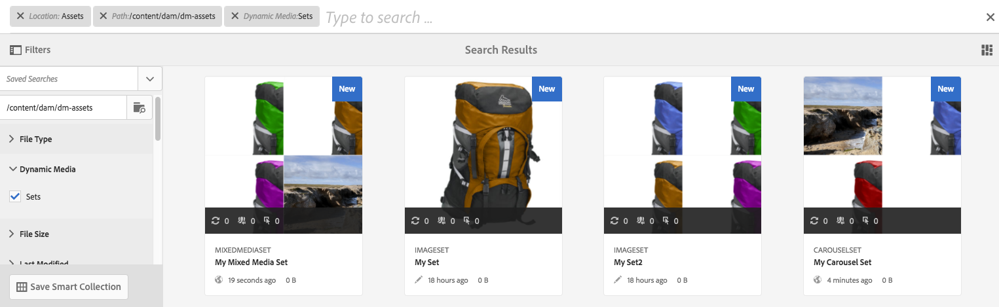

# Set di immagini {#image-sets}

I set di immagini offrono agli utenti un’esperienza di visualizzazione integrata, in cui gli utenti possono vedere diverse viste di un elemento facendo clic su una miniatura. I set di immagini consentono di presentare viste alternative di un elemento e il visualizzatore offre strumenti di zoom per esaminare attentamente le immagini.

I set di immagini sono indicati da un banner con la parola **[!UICONTROL IMAGESET]**. Inoltre, se il set di immagini è pubblicato, la data di pubblicazione, indicata dall’icona **[!UICONTROL mondo]**, è riportata sul banner insieme all’ultima data di modifica, contrassegnata dall’icona a forma di **[!UICONTROL matita]**.

All’interno del set di immagini, puoi anche creare campioni creando un set di immagini e aggiungendo miniature.

Questa applicazione è particolarmente utile quando si desidera mostrare un elemento con un colore, un motivo o una finitura diversi. Per creare un set di immagini con campioni di colore, è necessaria un’immagine per ogni colore, motivo o finitura diversi che si desidera presentare agli utenti. È inoltre necessario un campione di colore, motivo o finitura per ciascun colore, motivo o finitura.

Supponiamo, ad esempio, di voler presentare immagini di tappi con distinte di colore diverse; le bollette sono rosse, verdi e blu. In questo caso, sono necessarie tre riprese dello stesso cappello. Hai bisogno di un colpo con un rosso, uno con un verde, e uno con una bolletta blu. È inoltre necessario un campione di colore rosso, verde e blu. I campioni colore fungono da miniature su cui gli utenti possono fare clic nel visualizzatore dei set di campioni per visualizzare il tappo rosso, verde o blu-bollito.

>[!NOTE]
>
>Per informazioni sull’interfaccia utente di Assets, consulta [Gestione delle risorse con l’interfaccia utente touch](managing-assets-touch-ui.md).

Quando crei un set di immagini, Adobe consiglia le seguenti best practice e applica i seguenti limiti:

| Risorsa - Tipo limite | Best practice | Limite implementato | Modifiche al limite del 31 dicembre 2022 |
| --- | --- | --- | --- |
| **Set di immagini** - Numero di risorse duplicate per set | Nessun duplicato | 100 | 20 |
| **Set di immagini** - Numero massimo di immagini per set | 5-10 immagini per set | 1000 |

Vedi anche [Limiti Dynamic Media](/help/assets/limitations.md).

## Avvio rapido: Set di immagini {#quick-start-image-sets}

Per farti iniziare a lavorare velocemente:

1. [Carica le immagini principali per più visualizzazioni.](#uploading-assets-in-image-sets)

   Per iniziare, carica le immagini per i set di immagini. Poiché gli utenti possono eseguire lo zoom sulle immagini nel Visualizzatore set di immagini, quando scegli le immagini considera lo zoom. Assicurati che le immagini abbiano una dimensione massima di almeno 2000 pixel, per ottenere dettagli di zoom ottimali. Dynamic Media può eseguire il rendering delle immagini fino a 25 megapixel ciascuna. Ad esempio, è possibile utilizzare un&#39;immagine da 5000 x 5000 megapixel o qualsiasi altra combinazione di dimensioni fino a 25 megapixel.

   AEM Assets supporta molti formati di file immagine, ma si consiglia di utilizzare immagini TIFF, PNG e EPS senza perdita di dati.

1. [Crea set di immagini.](#creating-image-sets)

   In Set immagini, gli utenti fanno clic su miniature nel visualizzatore di set di immagini.

   Per creare un set di immagini in Assets, tocca **[!UICONTROL Crea > Set di immagini]**. Quindi, aggiungi immagini e tocca **[!UICONTROL Salva]**.

   È inoltre possibile creare automaticamente set di immagini attraverso [predefiniti per set di batch](/help/assets/config-dms7.md#creating-batch-set-presets-to-auto-generate-image-sets-and-spin-sets).

   **Importante** — I set di batch vengono creati dall’IPS (Image Production System) come parte dell’inserimento delle risorse e sono disponibili solo in modalità Dynamic Media - Scene7.

   Vedi [Preparazione delle risorse dei set di immagini per il caricamento e il caricamento dei file](#uploading-assets-in-image-sets).

   Vedi [Utilizzo dei selettori.](working-with-selectors.md)

1. Aggiungi [Predefiniti visualizzatore per set di immagini](managing-viewer-presets.md), se necessario.

   Gli amministratori possono creare o modificare l&#39;immagine **[!UICONTROL Impostare i predefiniti visualizzatore]**. Per visualizzare il set di immagini con un predefinito visualizzatore, seleziona il set di immagini e fai clic su nel menu a discesa della barra a sinistra **[!UICONTROL Visualizzatori]**.

   Vedi **[!UICONTROL Strumenti > Risorse > Predefiniti visualizzatore]** per creare o modificare i predefiniti visualizzatore.

1. (Facoltativo) [Visualizzazione dei set di immagini](image-sets.md#viewing-image-sets) creati utilizzando i predefiniti per set di batch.
1. [Anteprima set di immagini.](previewing-assets.md)

   Seleziona il set di immagini e puoi visualizzarlo in anteprima. Toccate le icone delle miniature per esaminare il set di immagini nel visualizzatore selezionato. È possibile scegliere diversi visualizzatori dal **[!UICONTROL Visualizzatori]** disponibile dal menu a discesa della barra a sinistra.

1. [Pubblica set di immagini.](publishing-dynamicmedia-assets.md)

   La pubblicazione di un set di immagini attiva l’URL e la stringa di incorporamento. Inoltre, devi [pubblicare qualsiasi predefinito visualizzatore personalizzato](managing-viewer-presets.md) che hai creato. I predefiniti per visualizzatori sono già stati pubblicati.

1. [Collegare gli URL all’applicazione Web](linking-urls-to-yourwebapplication.md) o [Incorporare il visualizzatore di video o immagini](embed-code.md).

   AEM Assets crea chiamate URL per i set di immagini e li attiva dopo la pubblicazione dei set di immagini. Puoi copiare questi URL quando visualizzi l’anteprima delle risorse. In alternativa, è possibile incorporarli sul sito Web.

   Seleziona il set di immagini, quindi fai clic su **[!UICONTROL Visualizzatori]** dal menu a discesa della barra a sinistra.

   Consulta le sezioni [Collegamento di un set di immagini a una pagina web](linking-urls-to-yourwebapplication.md) e [Incorporamento di un visualizzatore di video o immagini](embed-code.md).

Per modificare i set di immagini, vedi [modifica di set di immagini.](#editing-image-sets) Inoltre, puoi visualizzare e modificare [Proprietà del set di immagini](managing-assets-touch-ui.md#editing-properties).

In caso di problemi nella creazione dei set, consulta Immagini e set in [Risoluzione dei problemi Dynamic Media - Modalità Scene7](troubleshoot-dms7.md#images-and-sets).

## Caricamento delle risorse nei set di immagini {#uploading-assets-in-image-sets}

Per iniziare, carica le immagini per i set di immagini. Poiché gli utenti possono eseguire lo zoom sulle immagini nel Visualizzatore set di immagini, quando scegli le immagini considera lo zoom. Verifica che le immagini abbiano una dimensione maggiore che sia di almeno 2000 pixel. I set di immagini supportano molti formati di file immagine, ma si consiglia di utilizzare immagini TIFF, PNG e EPS senza perdita di dati.

È possibile caricare le immagini per i set di immagini come si farebbe per voi [caricare qualsiasi altra risorsa in Assets](managing-assets-touch-ui.md#uploading-assets).

### Preparazione delle risorse del set di immagini per il caricamento {#preparing-image-set-assets-for-upload}

Prima di creare i set di immagini, accertati che le immagini siano delle dimensioni e del formato corretti.

Per creare un set di immagini a più visualizzazioni, è necessario che le immagini mostrino un elemento da diversi punti di vista o che mostrino diversi aspetti dello stesso elemento. L’obiettivo è quello di evidenziare le funzioni importanti di un elemento in modo che i visualizzatori abbiano un’immagine completa dell’aspetto o del funzionamento dell’elemento.

Poiché gli utenti possono eseguire lo zoom delle immagini in Set di immagini, accertati che le immagini abbiano una dimensione maggiore di almeno 2000 pixel. Le risorse supportano molti formati di file immagine, ma si consiglia di utilizzare immagini TIFF, PNG e EPS senza perdita di dati.

>[!NOTE]
>
>Inoltre, se utilizzi le miniature per indicare i campioni di prodotto, devi effettuare le seguenti operazioni:
>
>È necessario disporre di vignette o di diverse immagini della stessa immagine che la mostrano in diversi colori, motivi o finiture. È inoltre necessario disporre di file di miniatura corrispondenti ai diversi colori, motivi o finiture. Ad esempio, per presentare le miniature con un set di immagini che mostra la stessa giacca in nero, marrone e verde, è necessario:
>
>* Un colpo nero, marrone e verde della stessa giacca.
>* Miniatura di colore nero, marrone e verde.
>

## Creazione di set di immagini {#creating-image-sets}

Puoi creare i set di immagini tramite l’interfaccia utente o tramite l’API. Questa sezione descrive come creare i set di immagini nell’interfaccia utente di .

>[!NOTE]
>
>È inoltre possibile creare automaticamente set di immagini attraverso [predefiniti per set di batch](/help/assets/config-dms7.md#creating-batch-set-presets-to-auto-generate-image-sets-and-spin-sets).

**Importante:** I set di batch vengono creati dall’IPS (Image Production System) come parte dell’inserimento delle risorse e sono disponibili solo in modalità Dynamic Media - Scene7.

Quando aggiungi delle risorse al set, queste vengono aggiunte automaticamente in ordine alfanumerico. Puoi riordinare o ordinare manualmente le risorse dopo averle aggiunte.

>[!NOTE]
>
>I set di immagini non sono supportati per le risorse con `,` (virgola) nel nome del file.

Quando crei un set di immagini, Adobe consiglia le seguenti best practice e applica i seguenti limiti:

| Risorsa - Tipo limite | Best practice | Limite implementato | Modifiche al limite del 31 dicembre 2022 |
| --- | --- | --- | --- |
| **Set di immagini** - Numero di risorse duplicate per set | Nessun duplicato | 100 | 20 |
| **Set di immagini** - Numero massimo di immagini per set | 5-10 immagini per set | 1000 |

Vedi anche [Limiti Dynamic Media](/help/assets/limitations.md).

**Per creare un set di immagini**:

1. In **Risorse**, individua il punto in cui vuoi creare un set di immagini e tocca **[!UICONTROL Crea]**, quindi seleziona **[!UICONTROL Set di immagini]**. Puoi anche creare il set dall’interno di una cartella contenente le risorse.

   

1. Nella pagina Editor set di immagini, **[!UICONTROL Titolo]** immettete un nome per il set di immagini. Il nome viene visualizzato nel banner lungo il set di immagini. Facoltativamente, immetti una descrizione.

   

   >[!NOTE]
   >
   >Quando crei il set di immagini, puoi modificare la miniatura del set o consentire ad AEM di selezionarla automaticamente in base alle risorse del set di immagini. Per selezionare una miniatura, tocca **[!UICONTROL Modifica miniatura]** e seleziona qualsiasi immagine (puoi passare ad altre cartelle per trovare anche le immagini). Se hai selezionato una miniatura e vuoi che AEM ne generi una dal set di immagini, fai clic su **[!UICONTROL Passa alla Miniatura automatica]**.

1. Effettua una delle seguenti operazioni:

   * Vicino all&#39;angolo superiore sinistro del **[!UICONTROL Editor set di immagini]** pagina, tocca **[!UICONTROL Aggiungi risorsa]**.
   * Vicino al centro del **[!UICONTROL Editor set di immagini]** pagina, tocca **[!UICONTROL Tocca per aprire il selettore risorse]**.

   Tocca per selezionare le risorse da includere nel set di immagini. Le risorse selezionate dispongono di un’icona a forma di segno di spunta. Al termine della procedura, tocca **[!UICONTROL Seleziona]**.

   Con il Selettore risorse, puoi cercare le risorse digitando una parola chiave e toccando **[!UICONTROL Invio]**. Per perfezionare i risultati della ricerca, puoi anche applicare i filtri. Puoi filtrare in base a percorso, raccolta, tipo di file e tag. Seleziona il filtro e tocca l’icona **[!UICONTROL Filtro]** nella barra degli strumenti. Per modificare la visualizzazione, tocca il pulsante **[!UICONTROL Visualizza]** icona e selezione **[!UICONTROL Vista a colonne]**, **[!UICONTROL Vista a schede]** oppure **[!UICONTROL Vista a elenco]**.

   Vedi [Utilizzo dei selettori.](working-with-selectors.md)

   

1. Quando aggiungi delle risorse al set, queste vengono aggiunte automaticamente in ordine alfanumerico. Puoi riordinare o ordinare manualmente le risorse dopo averle aggiunte.

   Se necessario, trascina le **[!UICONTROL Riordina]** a destra del nome del file della risorsa per riordinare le immagini verso l’alto o verso il basso nell’elenco dei set.

   

   Per modificare una miniatura o un campione, tocca **[!UICONTROL Miniatura]** accanto all’immagine e passa alla miniatura o al campione desiderato. Dopo aver selezionato tutte le immagini, tocca **[!UICONTROL Salva]**.

1. (Facoltativo) Effettua una delle seguenti operazioni:

   * Per eliminare un’immagine, selezionala e tocca **[!UICONTROL Elimina risorsa]**.
   * Per applicare un predefinito, tocca **[!UICONTROL Predefinito]**, quindi seleziona un predefinito da applicare a tutte le risorse contemporaneamente.

1. Tocca **[!UICONTROL Salva]**. Il set di immagini appena creato viene visualizzato nella cartella in cui è stato creato.

## Visualizzazione dei set di immagini {#viewing-image-sets}

È possibile creare set di immagini nell’interfaccia utente o automaticamente utilizzando [predefiniti per set di batch](/help/assets/config-dms7.md#creating-batch-set-presets-to-auto-generate-image-sets-and-spin-sets).

**Importante** — I set di batch vengono creati dall&#39;IPS [Sistema di produzione delle immagini] come parte dell’assimilazione delle risorse e sono disponibili solo in modalità Dynamic Media - Scene7 .)

Tuttavia, i set creati utilizzando i predefiniti per set di batch, sì *not* nell’interfaccia utente. Puoi visualizzare questi set in tre modi diversi. Questi metodi sono disponibili anche se hai creato i set di immagini nell’interfaccia utente di .

* Quando si aprono le proprietà di una singola risorsa. Le proprietà indicano l’impostazione di un membro della risorsa selezionata (in **[!UICONTROL Membro dei set]**). Toccare il nome del set per visualizzare l’intero set.

   

* Da un’immagine inclusa in un qualsiasi set. Seleziona la **[!UICONTROL Set]** per visualizzare i set di cui fa parte la risorsa.

   

* Dalla ricerca, puoi selezionare **[!UICONTROL Filtri]**, quindi espandi **[!UICONTROL Dynamic Media]** e seleziona **[!UICONTROL Set]**.

   La ricerca restituisce i set corrispondenti creati manualmente nell’interfaccia utente o automaticamente tramite i predefiniti per set di batch. Per i set automatizzati, la query di ricerca viene eseguita utilizzando i criteri di ricerca &quot;Inizia con&quot;, diversi dalla ricerca AEM basata sull’utilizzo dei criteri di ricerca &quot;Contiene&quot;. Impostazione del filtro su **[!UICONTROL Set]** è l’unico modo per cercare i set automatizzati.

   

>[!NOTE]
>
>Puoi visualizzare i set tramite l’interfaccia utente descritta in [Modifica dei set di immagini](#editing-image-sets).

## Modifica dei set di immagini {#editing-image-sets}

È possibile eseguire diverse attività di modifica sui set di immagini, ad esempio:

* Aggiungi immagini al set di immagini.
* Riordinare le immagini nel set di immagini.
* Elimina le risorse nel set di immagini.
* Applica i predefiniti visualizzatore.
* Elimina il set di immagini.

**Per modificare i set di immagini**:

1. Effettua una delle seguenti operazioni:

   * Passa il puntatore del mouse su una risorsa del set di immagini, quindi tocca **[!UICONTROL Modifica]** (icona a forma di matita).
   * Passa il puntatore del mouse su una risorsa del set di immagini, quindi tocca **[!UICONTROL Seleziona]** (icona a forma di segno di spunta), quindi tocca **[!UICONTROL Modifica]** sulla barra degli strumenti.
   * Tocca una risorsa del set di immagini, quindi tocca **[!UICONTROL Modifica]** (icona a forma di matita) sulla barra degli strumenti.

1. Per modificare le immagini nel set di immagini, effettuate una delle seguenti operazioni:

   * Per riordinare le risorse, trascinate un’immagine in una nuova posizione (selezionate l’icona di riordino per spostare gli elementi).
   * Per ordinare gli elementi in ordine crescente o decrescente, tocca l’intestazione della colonna.
   * Per aggiungere una risorsa o aggiornare una risorsa esistente, tocca **[!UICONTROL Aggiungi risorsa]**. Passa a una risorsa, selezionala, quindi tocca **[!UICONTROL Seleziona]** nell’angolo superiore destro della pagina.

   >[!NOTE]
   >Se elimini l&#39;immagine che AEM utilizzata per la miniatura sostituendola con un&#39;altra immagine, viene comunque visualizzata la risorsa originale.

   * Per eliminare una risorsa, selezionala e tocca **[!UICONTROL Elimina risorsa]**.
   * Per applicare un predefinito, tocca **[!UICONTROL Predefinito]**, quindi seleziona un predefinito per visualizzatori.
   * Per aggiungere o modificare una miniatura, seleziona l’icona della miniatura accanto alla parte destra della risorsa. Passa alla nuova miniatura o alla nuova risorsa campione, selezionala, quindi tocca **[!UICONTROL Seleziona]**.
   * Per eliminare un intero set di immagini, accedi al set di immagini, selezionalo e tocca **[!UICONTROL Elimina]**.

   >[!NOTE]
   >
   >Per modificare le immagini di un Set di immagini, tocca il set e, dalla barra a sinistra, seleziona **[!UICONTROL Membri set]**. Per aprire la finestra di modifica, tocca una singola risorsa con l’icona a forma di matita.****

1. Tocca **[!UICONTROL Salva]** al termine della modifica.

## Anteprima dei set di immagini {#previewing-image-sets}

Vedi [Anteprima delle risorse](previewing-assets.md).

## Pubblicazione dei set di immagini {#publishing-image-sets}

Vedi [Pubblicazione delle risorse](publishing-dynamicmedia-assets.md).
