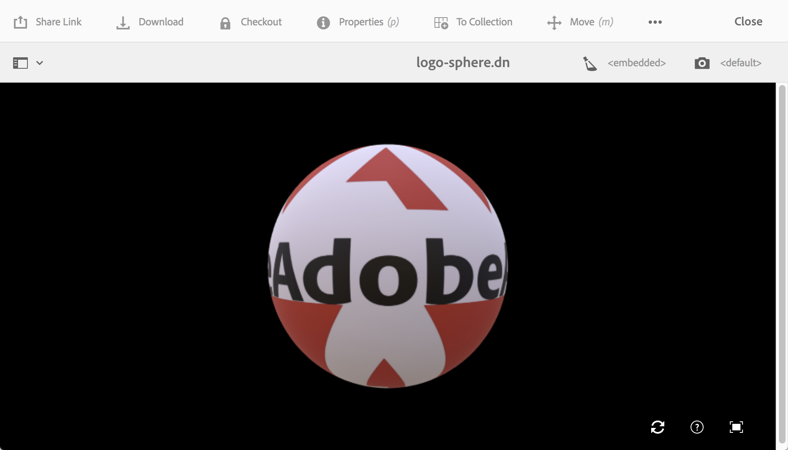

# Installazione e configurazione AEM 3D {#installing-and-configuring-aem-d}

>[!IMPORTANT]
>
>AEM 3D in AEM 6.4 non è più supportato.  Adobe consiglia di utilizzare la funzionalità delle risorse 3D in [AEM come Cloud Service](https://experienceleague.adobe.com/docs/experience-manager-cloud-service/assets/dynamicmedia/assets-3d.html#dynamicmedia) o [AEM 6.5.3 o superiore.](https://experienceleague.adobe.com/docs/experience-manager-65/assets/dynamic/assets-3d.html#dynamic)

L&#39;installazione e la configurazione di AEM 3D (versione 3.0) prevede quanto segue:

1. Installazione della libreria Autodesk® FBX® SDK.
1. Download e installazione del pacchetto di codice 3D nativo.
1. Configurazione del flusso di lavoro di assimilazione delle risorse 3D e riavvio del AEM.
1. Convalida della configurazione di AEM 3D.

Vedere anche [Utilizzo di risorse 3D](assets-3d.md).

Per informazioni su prerequisiti, browser supportati e altre informazioni importanti sulla versione, consulta anche [AEM note sulla versione di Risorse 3D](/help/release-notes/aem3d-release-notes.md).

Vedere anche [Utilizzo del componente Siti 3D](using-the-3d-sites-component.md).

>[!NOTE]
>
>Prima di scaricare e installare il pacchetto 3D, accertatevi di aver installato correttamente tutti i pacchetti AEM prerequisiti. Vedere le [AEM note sulla versione 3D.](install-config-3d.md)

## Installazione della libreria Autodesk FBX SDK {#installing-the-autodesk-fbx-sdk-library}

Il codice AEM 3D nativo richiede la libreria Autodesk FBX per supportare il formato di file FBX. ( Adobe non è attualmente in grado di ridistribuire la libreria.)

Vedere anche [Impostazioni di configurazione avanzate](advanced-config-3d.md).

1. Accedere all&#39;host in cui è installato AEM.

   * Se si tratta di una distribuzione di Windows Server, accedete al server come Amministratore.
   * Se si tratta di un desktop MAC o Windows, accertatevi di disporre dei privilegi di amministratore.

1. Utilizzate il collegamento appropriato per il sistema operativo in uso per scaricare **FBX SDK versione 2016.1.2**

   * **Windows**

      [https://download.autodesk.com/us/fbx_release_older/2016.1.2/fbx20161_2_fbxsdk_vs2010_win.exe](https://download.autodesk.com/us/fbx_release_older/2016.1.2/fbx20161_2_fbxsdk_vs2010_win.exe)

   * **OS X**

      [https://download.autodesk.com/us/fbx_release_older/2016.1.2/fbx20161_2_fbxsdk_clang_mac.pkg.tgz](https://download.autodesk.com/us/fbx_release_older/2016.1.2/fbx20161_2_fbxsdk_clang_mac.pkg.tgz)

   * **Linux**

      [https://download.autodesk.com/us/fbx_release_older/2016.1.2/fbx20161_2_fbxsdk_linux.tar.gz](https://download.autodesk.com/us/fbx_release_older/2016.1.2/fbx20161_2_fbxsdk_linux.tar.gz)

1. Installate l’SDK FBX:

   * Windows. Installate nella stessa unità in cui si trova AEM.
   * Mac. Installate nella stessa partizione in cui si trova AEM.
   * Linux. Estraete il pacchetto scaricato e seguite le istruzioni riportate in `<yourFBXSDKpath>/Install_FbxFileSdk.txt`. Installa l&#39;SDK in `/usr`.

## Download e installazione del pacchetto di codice 3D nativo {#downloading-and-installing-the-native-d-code-package}

>[!NOTE]
>
>Prima di procedere con l&#39;installazione e la configurazione di AEM 3D,  Adobe consiglia di distribuire eventuali service pack applicabili e altri feature pack correlati. Vedere [AEM Note sulla versione 3D](/help/release-notes/aem3d-release-notes.md).

Vedere anche [Impostazioni di configurazione avanzate](advanced-config-3d.md).

**Per installare il pacchetto** di codice 3D nativo:

1. Effettua una delle operazioni seguenti:

   * Se si tratta di una distribuzione di Windows Server, accedete al server come amministratore.
   * Se si tratta di un desktop Mac o Windows, accertatevi di disporre dei privilegi di amministratore.

1. Verificate di disporre di un browser supportato per accedere alle AEM.

   Vedere [Requisiti di sistema](/help/release-notes/aem3d-release-notes.md#system-requirements).

1. Accedere al [portale di distribuzione del software](https://experience.adobe.com/#/downloads/content/software-distribution/en/aem.html). Individuare la versione 3.0.1 del pacchetto di funzioni `AEM-6.4-DynamicMedia-3D` e scaricarlo.

1. In AEM, fate clic su **[!UICONTROL Strumenti > Amministrazione > Distribuzione > Gestione pacchetti]**.

1. Caricate il pacchetto di funzioni scaricato in AEM. Individualo e fai clic su **[!UICONTROL Installa]**.

1. Nella finestra di dialogo **[!UICONTROL Installa pacchetto]**, espandere **Impostazioni avanzate**, quindi impostare **[!UICONTROL Gestione controllo accesso]** su **Unisci**.
1. Fate clic su **[!UICONTROL Installa]** per iniziare l&#39;installazione del pacchetto.

   Il file `sample-3D-content.zip` viene inserito nella cartella principale **[!UICONTROL Risorse]**. Per ulteriori informazioni, vedere [Convalida della configurazione di AEM 3D](#validating-the-setup-of-aem-d).

## Configurazione del flusso di lavoro di assimilazione delle risorse 3D e riavvio AEM {#configuring-the-d-asset-ingestion-workflow-and-restarting-aem}

**Per configurare il flusso di lavoro** di assimilazione delle risorse 3D:

1. In AEM, fare clic sul logo AEM per accedere alla console di navigazione globale, quindi fare clic sull&#39;icona **[!UICONTROL Strumenti]** e passare a **[!UICONTROL Flusso di lavoro > Modelli]**.
1. Nella pagina **[!UICONTROL Workflow Models]**, passare il cursore sul flusso di lavoro **[!UICONTROL DAM Update Asset]** e, quando viene visualizzato il segno di spunta, selezionarlo.

1. Sulla barra degli strumenti, fare clic su **[!UICONTROL Modifica]**.
1. Nella schermata **[!UICONTROL DAM Update Asset]**, nel pannello mobile AEM, fate clic sull&#39;icona **[!UICONTROL Plus]** a destra di Workflow per espandere l&#39;elenco. Selezionare **[!UICONTROL Passaggio processo]** nell&#39;elenco.
1. Trascinare **[!UICONTROL Passaggio processo]** e rilasciarlo nel flusso di lavoro immediatamente prima del componente **[!UICONTROL Flusso di lavoro aggiornamento risorsa DAM Completato]**, vicino alla fine del flusso di lavoro.

   

1. Fate doppio clic sul passaggio del processo appena aggiunto.
1. Nella finestra di dialogo **[!UICONTROL Proprietà passaggio]**, nella scheda **[!UICONTROL Comune]**, nel campo **[!UICONTROL Titolo]** immettere una descrizione appropriata per il processo, ad esempio `Process 3D content`.
1. Fare clic sulla scheda **[!UICONTROL Processo]**.

1. Dal menu a discesa **[!UICONTROL Process]**, selezionare **[!UICONTROL Geometric 3D Object Service]**, quindi selezionare la casella di controllo **[!UICONTROL Handler Advance]**.

   

1. Nell’angolo superiore destro della finestra di dialogo, fate clic sull’icona del segno di spunta per tornare alla pagina Aggiorna risorsa DAM.
1. Nell&#39;angolo superiore destro della pagina **[!UICONTROL DAM Update Asset]**, fare clic su **[!UICONTROL Sync]** per salvare il modello di flusso di lavoro modificato.
1. Riavviate AEM.

   Dopo il riavvio, è possibile caricare il contenuto 3D e AEM elaborarlo.

   Continuare con [Convalida della configurazione di AEM 3D](#validating-the-setup-of-aem-d).

## Convalida dell&#39;impostazione di AEM 3D {#validating-the-setup-of-aem-d}

1. In AEM, fare clic su **[!UICONTROL Strumenti > Risorse]**, quindi scaricare `sample-3D-content.zip` ed espandere il file scaricato. (È ora possibile eliminare `sample-3D-content.zip` in AEM.)

   Assicuratevi di essere nella **[!UICONTROL vista a schede]** per visualizzare il feedback di caricamento ed elaborazione nei passaggi successivi.

1. Create una cartella denominata `test3d` per ricevere il contenuto di prova.
1. Caricate tutti i file da `sample-3D-content/images` alla cartella `test3d`.
1. Attendete il completamento del caricamento e dell’elaborazione. Potrebbe essere necessario aggiornare il browser.

   Caricate i tre file `.fbx` da `sample-3D-content/` alla cartella `test3d`.

   Non caricate ancora i file modello .ma.

1. Nella vista a schede, osservate i banner dei messaggi visualizzati sulle schede delle risorse 3d.

   Ogni risorsa procede attraverso diverse fasi di elaborazione. Quando la **[!UICONTROL Creazione dell&#39;anteprima...]** fase di elaborazione completata, la scheda viene aggiornata con una miniatura. Al termine dell&#39;elaborazione finale, il banner viene sostituito con l&#39;indicatore **[!UICONTROL NEW]**.

   >[!NOTE]
   >
   >Si prevede un utilizzo CPU molto elevato durante l&#39;elaborazione 3D in corso. A seconda della capacità della CPU disponibile, il completamento dell&#39;elaborazione potrebbe richiedere molto tempo.

   

1. Verrà ora illustrato come risolvere le dipendenze dei file.

   Nel banner **[!UICONTROL Dipendenze non risolte]** per la scheda `stage-helipad.fbx`, fate clic sull&#39;icona **[!UICONTROL Punto esclamativo]** per passare alle proprietà della risorsa e aprire la scheda **Dipendenze**.

   

1. Fate clic sull&#39;icona **[!UICONTROL Cartella/Occhiale di ingrandimento]** a destra del nome del file per aprire il browser delle risorse e risolvere le dipendenze come segue:

   

1. Fate clic su **[!UICONTROL Salva]** e **[!UICONTROL Chiudi]** per completare l&#39;elaborazione della risorsa e tornare rispettivamente alla **[!UICONTROL vista a schede]**.
1. Al termine dell&#39;elaborazione, è possibile vedere quanto segue in **[!UICONTROL Vista a schede]**:

   

1. Nella pagina test3d, fate clic sulla scheda `logo-sphere.fbx` per aprire il modello in **[!UICONTROL Visualizzazione dettagli]**.

   Nell&#39;angolo superiore destro della pagina logo-space.fbx, fate clic sull&#39;icona Evidenziatore fase per espandere il menu a discesa, quindi selezionate `stage-spotlights.fbx`.

   

1. Dall&#39;elenco a discesa **[!UICONTROL Stage Spotlight]**, selezionare `stage-helipad.fbx`.

   Utilizzo del pulsante sinistro del mouse per regolare la visualizzazione. Lo sfondo e l’illuminazione del modello cambiano per riflettere la nuova selezione dell’area di visualizzazione.

   

## Configurazione del supporto per  risorse Adobe Dimension {#configuring-support-for-adobe-dimension-assets}

>[!NOTE]
>
>Questa attività di configurazione è facoltativa.

Facoltativamente potete configurare il supporto in AEM 3D per  risorse Adobe Dimension.

È necessario configurare un servizio di conversione esterno per consentire l’assimilazione, l’anteprima e la pubblicazione  risorse Adobe Dimension 3D in AEM. Il servizio converte dal formato proprietario  Adobe Dimension (`.dn`) in una variante di glTF (formattata come file `.glb`) che viene salvata con la risorsa Dn come rappresentazione. La rappresentazione `.glb` viene utilizzata per la visualizzazione basata sul Web della risorsa 3D in  AEM Assets, Siti e Schermate ed è disponibile per il download e l&#39;utilizzo con applicazioni di terze parti.

>[!NOTE]
>
>Il servizio di conversione è ospitato da  Adobe in  Amazon AWS. Dopo aver configurato correttamente il servizio, `.dn` i file caricati in AEM vengono quindi copiati in modo sicuro nel servizio di conversione tramite memorizzazione temporanea in  Amazon S3. Il risultato della conversione viene ritrasferito a AEM tramite l&#39;archiviazione temporanea S3. Tutti i trasferimenti e lo storage sono protetti. Inoltre, il contenuto persiste in S3 e il servizio di conversione solo brevemente (generalmente non più di pochi minuti).

**Per configurare il supporto per  risorse** Adobe Dimension:

1. Per richiedere le credenziali per **AEM3D Services**, contatta il tuo responsabile AEM account di  Adobe, un esperto di provisioning o un rappresentante di supporto.

   >[!NOTE]
   >
   >Per ogni organizzazione è richiesto un solo set di credenziali, indipendentemente dal numero di istanze AEM in cui sono installate le credenziali.

1. Verificate di aver ricevuto le seguenti informazioni:

   * accountId
   * customerId
   * password
   * identityPoolId
   * userPoolId
   * clientId

1. In qualità di Amministratore, accedete all&#39;istanza di AEM autore in cui desiderate installare le credenziali, quindi aprite **[!UICONTROL CRXDE Lite]**.
1. Configura le nuove informazioni sulle credenziali effettuando le seguenti operazioni in CRXDE Lite:

   1. Passare a `/libs/settings/dam/v3D/services/dncr` e impostare la proprietà `clientId` sul nuovo valore.
   1. Passare a `/libs/settings/dam/v3D/services/aws` e impostare le proprietà `accountId`, `customerId`, `identityPoolId` e `userPoolId` sui nuovi valori.
   1. Caricate il nuovo valore della password nella proprietà `encryptedPassword`. Questo valore viene crittografato automaticamente quando si tocca **[!UICONTROL Salva tutto]**.
   1. Toccate **[!UICONTROL Salva tutto]**, ricaricate la pagina, quindi verificate che la proprietà `encryptedPassword` contenga una stringa diversa racchiusa tra parentesi graffe. Questo aspetto indica che la password è crittografata e protetta correttamente.

1. Specificare il formato della rappresentazione di conversione `.glb` effettuando le seguenti operazioni in **[!UICONTROL CRXDE Lite]**:

   1. Passare a `/libs/settings/dam/v3D/services/dncr` in **[!UICONTROL CRXDE Lite]**.
   1. Impostare la proprietà `outputFormat` su `Dn` o su `generic`.

      Se impostata su `Dn`, la conversione `.glb` include estensioni specifiche per  Adobe, come l&#39;illuminazione IBL, per una qualità ottimale quando si visualizzano le risorse Dn in AEM. Tuttavia, il rendering .glb convertito potrebbe non essere eseguito correttamente nelle applicazioni di terze parti.

      Se è impostata su `generic`, la rappresentazione `.glb` è generica senza estensioni specifiche per  Adobe. Questa impostazione consente di utilizzarla in applicazioni di terze parti, mentre la visualizzazione con il visualizzatore AEM 3D sarà visivamente non ottimale.

1. Attivare il formato di file Dn effettuando le seguenti operazioni in **[!UICONTROL CRXDE Lite]**:

   1. Accedi a `/libs/settings/dam/v3D/assetTypes/Dn`.
   1. Impostare la proprietà `Enabled` su true.

1. Convalida la configurazione effettuando le seguenti operazioni:

   1. Aprite  AEM Assets.
   1. Caricare `logo_sphere.dn` nella cartella `test3d`. Il file si trova in `sample-3D-content/models`.

      `sample-3D-content.zip` è stato precedentemente scaricato per la convalida della funzionalità 3D di base.
   1. Tornate alla **[!UICONTROL vista a schede]** e osservate il banner del messaggio mostrato sulla risorsa caricata. Il **[!UICONTROL Formato di conversione...Il banner]** viene visualizzato durante il processo di conversione in corso.
   1. Al termine dell’elaborazione, aprite la risorsa in **[!UICONTROL Visualizzazione dettagli]** per verificare che la risorsa convertita sia visualizzata correttamente e che i controlli di navigazione del visualizzatore siano utilizzabili.

   

   Se sulla risorsa Dn è visualizzato un &quot;Errore di elaborazione&quot; nella **[!UICONTROL vista a schede]** dopo 10-15 minuti, la conversione non è riuscita.

   In tal caso, potete risolvere i problemi di conversione effettuando le seguenti operazioni:

   * Eliminate la risorsa, quindi caricatela di nuovo.
   * Assicurarsi di aver impostato correttamente tutti i parametri di configurazione in **[!UICONTROL CRXDE Lite]**.
   * Verificate che nessun firewall stia bloccando l&#39;accesso al servizio di conversione e agli endpoint AWS.
