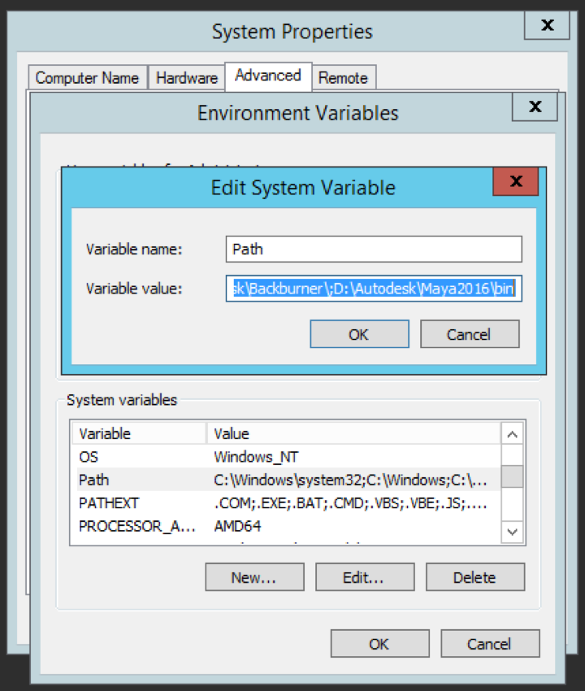
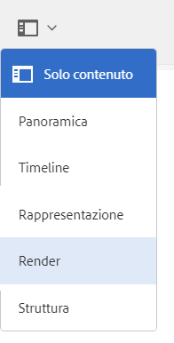

# Integrazione AEM 3D con Autodesk Maya {#integrating-aem-d-with-autodesk-maya}

>[!NOTE]
>
>Questa attività è facoltativa e riguarda solo Windows.

È possibile integrare AEM 3D con il software Autodesk® Maya® per abilitare il supporto per i file Maya nativi (`.MA` e `.MB`) e per consentire il rendering delle risorse 3D in AEM con qualsiasi renderer Maya disponibile.

*Questa integrazione è disponibile solo* per Windows.

Quando si esegue l&#39;integrazione con Autodesk Maya, è necessario installare e configurare Autodesk Maya, aggiungere il percorso alla cartella eseguibile Maya, abilitare Maya per l&#39;inserimento e il rendering e verificare l&#39;integrazione.

Consultate Impostazioni [di configurazione](advanced-config-3d.md)avanzate.

Vedere anche [Integrazione AEM 3D con AutoDesk 3ds Max](integrating-aem-3d-with-autodesk-3ds-max.md).

**Per integrare AEM 3D con Autodesk Maya**:

1. Installate il software Autodesk Maya 2016 sugli stessi server in cui è AEM.

   Dopo l&#39;installazione, verificate di poter aprire e utilizzare Maya e che non vi siano problemi di licenza.

   >[!NOTE]
   >
   >AEM utilizza solo lo strumento di rendering della riga di comando Maya (`render.exe`). Una singola licenza di rete Maya consente fino a cinque server di elaborare o eseguire simultaneamente il rendering dei contenuti Maya.

1. In Maya, abilitare il plug-in Autodesk FBX®.
1. Installate il plug-in di rendering MentalRay o un altro renderer desiderato.

   Dopo l&#39;installazione, verificare che MentalRay sia disponibile in Maya.

1. Aggiungete il percorso alla cartella eseguibile Maya alla variabile di ambiente PATH di Windows.

   Ad esempio, in Windows Server 2012, toccare **[!UICONTROL Start > Pannello di controllo Campaign > Sistema e protezione > Sistema > Impostazioni di sistema avanzate > Variabili** di ambiente. Aggiungete il percorso completo della `Maya2016\bin` cartella alla variabile di `Path`sistema.

   

1. Per abilitare Maya per l&#39;assimilazione e il rendering, aprite **[!UICONTROL CRXDE Lite]** e individuate `/libs/settings/dam/v3D/assetTypes/maya` e impostate la proprietà **[!UICONTROL Enabled]** su `true`.

   

1. Per abilitare il formato di file JT (Siemens PLM Open CAD), andate a `/libs/settings/dam/v3D/assetTypes/jt` e impostate la proprietà **[!UICONTROL Enabled]** su `true`.
1. In AEM, abilitate Maya come renderer. Per iniziare, passa a **[!UICONTROL Strumenti > Generale > CRXDE Lite]**.
1. Dalla pagina **[!UICONTROL CRXDE Lite]** , nel pannello a sinistra, individuate le seguenti opzioni:

   `/libs/settings/dam/v3D/renderers/maya`

   

1. Impostare la proprietà **[!UICONTROL Enabled]** su `true`.

1. Nell’angolo in alto a sinistra della pagina del **[!UICONTROL CRXDE Lite]** , toccate **[!UICONTROL Salva tutto]**.

   Maya ora è abilitata come renderer.

## Verificare l&#39;integrazione di AEM 3D con Autodesk Maya {#testing-the-integration-of-aem-d-with-autodesk-maya}

1. Aprite  AEM Assets, quindi caricate i `.MA` file che si trovano `sample-3D-content/models` nella `test3d` cartella.

   Nota: `sample-3D-content.zip` in precedenza era stato scaricato per la convalida delle funzionalità 3D di base.

1. Tornate alla vista **[!UICONTROL Card** e osservate i banner dei messaggi mostrati sulle risorse caricate.

   Il banner di conversione del formato viene visualizzato mentre Maya converte il `.MA` formato nativo in `.FBX`.

1. Al termine dell’elaborazione, aprite la `logo-sphere.ma` risorsa e selezionate l’ `stage-helipad.ma` area di visualizzazione.

   L&#39;esperienza Anteprima è la stessa di quella con `logo_sphere.fbx` e `stage-helipad.fbx`.

1. Near the upper-left corner of the page, tap or click the drop-down list and then select **[!UICONTROL CRender]**.

   

1. Nell&#39;elenco a discesa **[!UICONTROL Renderer]** , selezionate **[!UICONTROL Autodesk Maya]**, quindi toccate **[!UICONTROL Avvia rendering]**.
1. Vicino all&#39;angolo superiore destro della pagina, toccate o fate clic su **[!UICONTROL Chiudi]** per tornare alla vista **[!UICONTROL Scheda]** .

   Osservate il banner del messaggio sulla risorsa immagine di cui viene eseguito il rendering (`logo-sphere`, a meno che non sia stato specificato un nome immagine diverso). Una barra di avanzamento sul banner mostra l’avanzamento del rendering.

   >[!NOTE]
   >
   >Il rendering richiede molta CPU e può richiedere alcuni minuti per il completamento

1. Al termine del rendering, aprite la risorsa immagine di cui è stato effettuato il rendering.

   Verificate che l’immagine di cui è stato effettuato il rendering corrisponda ragionevolmente all’immagine visualizzata al momento del clic su **[!UICONTROL Rendering]**.

## Abilitazione Di Formati Aggiuntivi Supportati Da Maya {#enabling-additional-formats-supported-by-maya}

(Facoltativo) Maya supporta una serie di formati di input 3D, ciascuno dei quali può essere attivato in modo AEM riconoscere il tipo di file. Quando è attivata, AEM invia il file a Maya per convertirlo in un formato intermedio che può essere acquisito direttamente da AEM.

A seconda del formato, il supporto delle funzioni potrebbe essere limitato (ad esempio, i materiali potrebbero non essere passati attraverso) e la qualità/fedeltà potrebbe essere limitata (ad esempio, facce invertite).  Adobe supporta solo il meccanismo generale, ma non una conversione di formato specifica.

Consulta Formati di importazione dati [supportati | Maya](https://knowledge.autodesk.com/support/maya/learn-explore/caas/CloudHelp/cloudhelp/2016/ENU/Maya/files/GUID-69BC066D-D4D8-4B12-900C-CF42E798A5D6-htm.html) per informazioni sui formati supportati da Maya.

**Per abilitare formati aggiuntivi supportati da AEM**:

1. Utilizzando **[!UICONTROL CRXDE Lite]**, andate a `/libs/settings/dam/v3D/assetTypes`.
1. Crea una copia del **[!UICONTROL nodo jt]** . Fate clic con il pulsante destro del mouse sul nodo **[!UICONTROL jt]** e selezionate **[!UICONTROL Copia]**, quindi fate clic con il pulsante destro del mouse sulla cartella **[!UICONTROL assetTypes]** e selezionate **[!UICONTROL Incolla]**. Questo dovrebbe generare un nuovo nodo `/apps/cq-scene7-v3D/config/assetTypes/Copy of jt`.
1. Rinominare il nuovo nodo per assegnargli un nome univoco che rappresenta il tipo di file da aggiungere. È possibile utilizzare il suffisso del file o qualsiasi altro identificatore univoco.

1. Impostare la proprietà **[!UICONTROL Enabled]** del nuovo nodo su `true`.

1. Impostate la proprietà **[!UICONTROL Extension]** della nuova nota sul suffisso o estensione del file del formato da aggiungere.
1. Impostare la proprietà **[!UICONTROL MimeType]** su un valore appropriato. `application/x-` seguito dal valore della proprietà **[!UICONTROL Extension]** deve funzionare per la maggior parte dei tipi di file.
1. Assicurarsi che la proprietà **[!UICONTROL Conversion]** sia impostata su `fbx` e su **[!UICONTROL IngestRegime]** su `Maya`.
1. Fate clic su **[!UICONTROL Salva tutto]** in alto a sinistra nella pagina.

La schermata seguente illustra un formato di file aggiunto, utilizzando COLLADA DAE come esempio:

