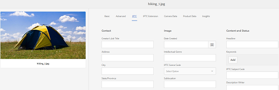

# Supporto per i metadati IPTC {#support-for-iptc-metadata}

>[!CAUTION]
>
>AEM 6.4 ha raggiunto la fine del supporto esteso e questa documentazione non viene più aggiornata. Per maggiori dettagli, consulta la nostra [periodi di assistenza tecnica](https://helpx.adobe.com/it/support/programs/eol-matrix.html). Trova le versioni supportate [qui](https://experienceleague.adobe.com/docs/).

Scopri come Adobe Experience Manager Assets supporta i metadati IPTC, le valutazioni creative e le parole chiave aggiunte alle risorse tramite Adobe Bridge e altre app Creative.

Adobe Experience Manager Assets supporta lo standard di metadati IPTC, ampiamente utilizzato per descrivere le risorse. In questo modo, [!DNL Experience Manager Assets] Migliora l&#39;accettazione delle sue immagini tra vari partiti, tra cui fotografi, agenzie creative, biblioteche, musei e così via.

Lo schema metadati predefinito per le risorse ora incorpora gli schemi di metadati IPTC Core e IPTC Extension per definire proprietà di metadati complete che consentono agli utenti di aggiungere dati precisi e affidabili su persone, posizioni e prodotti visualizzati in un&#39;immagine. Supporta inoltre date, nomi e identificatori relativi alla creazione dell&#39;immagine e un modo flessibile per esprimere le informazioni sui diritti.

La pagina Proprietà per le risorse ora include schede separate per visualizzare i metadati IPTC Core e IPTC Extension nei campi modificabili.

1. Dall’interfaccia utente Assets, seleziona un’immagine.
1. Tocca o fai clic su **[!UICONTROL Proprietà]** dalla barra degli strumenti.
1. Nella pagina Proprietà , tocca o fai clic sul pulsante **[!UICONTROL IPTC]** scheda per visualizzare i metadati IPTC della risorsa.
1. Se necessario, modifica le proprietà dei metadati IPTC.

   

1. Per visualizzare i metadati dell’estensione IPTC della risorsa, tocca o fai clic sulla scheda **[!UICONTROL Estensione IPTC]**.
1. Modifica le proprietà dei metadati dell’estensione ITPC, a seconda delle necessità.
1. Tocca o fai clic su **[!UICONTROL Salva e chiudi]** per salvare le modifiche.

## Supporto per valutazione creativa {#creative-rating-support}

Oltre a visualizzare le valutazioni dei singoli utenti e le valutazioni aggregate, la pagina Proprietà visualizza ora le valutazioni assegnate alle risorse tramite Adobe Bridge e altre app Creative

Queste valutazioni sono disponibili nella sezione **[!UICONTROL Valutazione creativa]** della scheda **[!UICONTROL Avanzate]**.

Questa valutazione è una proprietà di sola lettura e ha un intervallo compreso tra 1 e 5. Puoi cercare le risorse in base al loro rating creativo dal pannello di ricerca.

Tuttavia, questa proprietà non è attualmente indicizzata per evitare conflitti con le modifiche personalizzate apportate dagli utenti.

## Supporto parole chiave {#keyword-support}

La **[!UICONTROL IPTC]** Nella scheda della pagina Proprietà sono inoltre visualizzate le parole chiave aggiunte alle risorse tramite Adobe Bridge e altre app Creative. È inoltre possibile modificare queste parole chiave e aggiungere ulteriori parole chiave dal **[!UICONTROL IPTC]** scheda .

