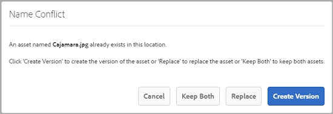
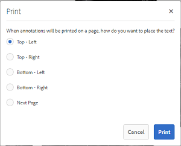

# Gestione delle risorse digitali {#managing-assets-with-the-touch-optimized-ui}

Scopri le diverse attività di gestione e modifica delle risorse che puoi eseguire utilizzando l’interfaccia utente ottimizzata per il tocco di Risorse AEM.

Questo articolo descrive come gestire e modificare le risorse tramite l’interfaccia utente ottimizzata per il tocco di Adobe Experience Manager (AEM) Assets. Per informazioni elementari sull&#39;interfaccia utente, consultate Gestione di [base dell&#39;interfaccia](/help/sites-authoring/basic-handling.md)touch. Per gestire i frammenti di contenuto, consulta [Gestione delle risorse dei frammenti](content-fragments-managing.md) di contenuto.

## Creare le cartelle {#create-folders}

Quando organizzate una raccolta di risorse, ad esempio tutte `Nature` le immagini, potete creare delle cartelle per mantenerle unite. Potete usare le cartelle per classificare e organizzare le risorse. Risorse AEM non richiede l’organizzazione di risorse in cartelle per migliorare il funzionamento.

>[!NOTE]
>
>* La condivisione di una cartella di risorse di tipo non `sling:OrderedFolder` è supportata quando si condivide con Marketing Cloud. Se desiderate condividere una cartella, non selezionate Ordinato al momento della creazione di una cartella.
>* Experience Manager non consente l&#39;uso di `subassets` parole come nome di una cartella. È una parola chiave riservata al nodo che contiene risorse secondarie per le risorse composte.

1. Andate alla posizione nella cartella delle risorse digitali in cui desiderate creare una nuova cartella.
1. Nel menu, fate clic su **[!UICONTROL Crea]**. Selezionate **[!UICONTROL Nuova cartella]**.
1. Nel campo **[!UICONTROL Titolo]** , inserite un nome di cartella. Per impostazione predefinita, DAM utilizza il titolo fornito come nome della cartella. Una volta creata la cartella, potete ignorare l’impostazione predefinita e specificare un altro nome di cartella.
1. Fai clic su **[!UICONTROL Crea]**. La cartella viene visualizzata nella cartella delle risorse digitali.

I seguenti caratteri (elenco separato da spazi) non sono supportati:

* il nome del file di risorse non deve contenere `* / : [ \ \ ] | # % { } ? &`
* il nome della cartella di risorse non deve contenere `* / : [ \ \ ] | # % { } ? \" . ^ ; + & \t`

## Upload assets {#uploading-assets}

Puoi caricare vari tipi di risorse (immagini, file PDF, file RAW e così via) dalla cartella locale o da un’unità di rete a Risorse AEM.

>[!NOTE]
>
>In modalità Contenuti multimediali dinamici - Scene7, potete caricare solo risorse le cui dimensioni file sono pari o inferiori a 2 GB.

Potete scegliere di caricare le risorse nelle cartelle a cui è stato assegnato o meno un profilo di elaborazione.

Per le cartelle a cui è assegnato un profilo di elaborazione, il nome del profilo viene visualizzato sulla miniatura nella vista a schede. Nella vista a elenco, il nome del profilo viene visualizzato nella colonna Profilo **[!UICONTROL di]** elaborazione. Consultate Profili di elaborazione.

Prima di caricare una risorsa, accertatevi che sia in un formato supportato.

**Per caricare le risorse**:

1. Nell’interfaccia Web Risorse, passa alla posizione in cui desideri aggiungere le risorse digitali.
1. Per caricare le risorse, effettuate una delle seguenti operazioni:

   * Sulla barra degli strumenti, toccate l&#39;icona **[!UICONTROL Crea]** . Quindi, dal menu, toccate **[!UICONTROL File]**. Se necessario, potete rinominare il file nella finestra di dialogo visualizzata.
   * In un browser che supporta HTML5, trascinate le risorse direttamente sull’interfaccia. La finestra di dialogo per rinominare il file non viene visualizzata.
   

   Per selezionare più file, premete il tasto Ctrl/Comando e selezionate le risorse nella finestra di dialogo del selettore file. Da un iPad, potete selezionare un solo file alla volta.

   Potete mettere in pausa il caricamento di risorse di grandi dimensioni (superiori a 500 MB) e riprenderlo più tardi dalla stessa pagina. Toccate l’icona **[!UICONTROL Pausa]** accanto alla barra di avanzamento che viene visualizzata all’avvio del caricamento.

   

   È possibile configurare la dimensione sopra la quale una risorsa viene considerata una risorsa grande. Ad esempio, potete configurare il sistema affinché consideri le risorse superiori ai 1000 MB (invece dei 500 MB) come risorse grandi. In questo caso, il pulsante **[!UICONTROL Pausa]** nella barra di avanzamento viene visualizzato quando vengono caricate risorse di dimensioni superiori a 1000 MB.

   Il pulsante **[!UICONTROL Pausa]]**non viene visualizzato se un file maggiore di 1000 MB viene caricato con un file inferiore a 1000 MB. Tuttavia, se annullate il caricamento di file di dimensioni inferiori a 1000 MB, viene visualizzato il pulsante**[!UICONTROL Pausa ]**.

   Per modificare il limite di dimensioni, configurare la `chunkUploadMinFileSize` proprietà del `fileupload`nodo nell&#39;archivio CRX.

   Quando fate clic sull&#39;icona **[!UICONTROL Pausa]** , viene visualizzata un&#39;icona **[!UICONTROL Riproduci]** . Per riprendere il caricamento, fate clic sull’icona **[!UICONTROL Riproduci]** .

   

   Per annullare un caricamento in corso, fate clic sul `X` pulsante accanto alla barra di avanzamento. Quando annullate l’operazione di caricamento, Risorse AEM elimina la parte parzialmente caricata della risorsa.

   La possibilità di riprendere il caricamento è particolarmente utile in situazioni con larghezza di banda ridotta e problemi di rete, in cui il caricamento di una risorsa di grandi dimensioni richiede molto tempo. Potete mettere in pausa l’operazione di caricamento e continuare in seguito quando la situazione migliora. Quando si riprende, il caricamento inizia dal punto in cui è stato messo in pausa.

   Durante l’operazione di caricamento, AEM salva le porzioni della risorsa caricata come blocchi di dati nell’archivio CRX. Al termine del caricamento, AEM consolida questi blocchi in un unico blocco di dati nell’archivio.

   Per configurare l’attività di pulizia per i processi di caricamento dei blocchi non ancora completati, passate a `https://[aem_server]:[port]/system/console/configMgr/org.apache.sling.servlets.post.impl.helper.ChunkCleanUpTask`.

   Se caricate una risorsa con lo stesso nome di una già disponibile nel percorso in cui state caricando la risorsa, viene visualizzata una finestra di dialogo di avviso.

   Potete scegliere di sostituire una risorsa esistente, crearne un’altra o tenerle entrambe rinominando la nuova risorsa caricata. Se sostituite una risorsa esistente, i metadati della risorsa e le eventuali modifiche e cronologia precedenti (ad esempio annotazioni, ritagli e così via) vengono eliminati. Se scegliete di mantenere entrambe le risorse, la nuova risorsa viene rinominata.

   

   >[!NOTE]
   >
   >Quando selezionate **[!UICONTROL Sostituisci]** nella finestra di dialogo Conflitto **** nome, l’ID risorsa viene rigenerato per la nuova risorsa. Questo ID è diverso dall’ID della risorsa precedente.
   >
   >Se **[!UICONTROL Asset Insights]** è abilitato per il tracciamento di impression/clic con Adobe Analytics, questo ID risorsa rigenerato invalida i dati acquisiti per la risorsa in Adobe Analytics.

   Se la risorsa caricata esiste in Risorse AEM, la finestra di dialogo **[!UICONTROL Duplicati rilevati]** avverte che stai tentando di caricare una risorsa duplicata. La finestra di dialogo viene visualizzata solo se il valore di checksum SHA 1 del binario della risorsa esistente corrisponde al valore di checksum della risorsa caricata. In questo caso, i nomi delle attività sono irrilevanti. In altre parole, la finestra di dialogo può essere visualizzata anche per le risorse con nomi diversi se i valori SHA 1 per i rispettivi binari sono gli stessi.

   >[!NOTE]
   >
   >La finestra di dialogo **[!UICONTROL Duplicati rilevati]** viene visualizzata solo quando è abilitata la funzione Rilevamento **** duplicati. Per abilitare la funzione **[!UICONTROL Rilevamento]** duplicato, consultate [Abilitazione del rilevamento](duplicate-detection.md)duplicato.

   

   Toccate **[!UICONTROL Mantieni]** per mantenere la risorsa duplicata in Risorse AEM. Toccate **[!UICONTROL Elimina]** per eliminare la risorsa duplicata caricata.

   Risorse AEM impedisce il caricamento di risorse con caratteri proibiti nei loro nomi file. Se provate a caricare una risorsa che include i caratteri non consentiti, Risorse AEM visualizza un messaggio di avviso relativo alla presenza di caratteri proibiti nel nome del file e interrompe il caricamento fino a quando questi caratteri non vengono rimossi o caricati con un nome consentito.

   Per rispettare convenzioni di denominazione dei file specifiche per la vostra azienda, nella finestra di dialogo **[!UICONTROL Carica risorse]** potete specificare nomi lunghi per i file caricati.

   

   Tuttavia, i seguenti caratteri (elenco separato da spazi) non sono supportati:
   * il nome del file di risorse non deve contenere `* / : [ \ \ ] | # % { } ? &`
   * il nome della cartella di risorse non deve contenere `* / : [ \ \ ] | # % { } ? \" . ^ ; + & \t`
   Inoltre, l’interfaccia Risorse mostra la risorsa più recente caricata o la cartella creata per la prima volta in tutte le viste (vista **[!UICONTROL a]** schede, vista **** Elenco e vista **** Colonna).

   Spesso, durante il caricamento simultaneo di risorse grandi o più risorse, gli indicatori visivi consentono di valutare l’avanzamento. Nella finestra di dialogo **[!UICONTROL Stato]** caricamento vengono visualizzati il numero di file caricati correttamente e i file che non sono stati caricati correttamente.

   

   Se annulli l’operazione di caricamento prima del caricamento dei file, Risorse AEM interrompe il caricamento del file corrente e aggiorna il contenuto. Tuttavia, i file già caricati non vengono eliminati.

### Caricamenti seriali {#serial-uploads}

Il caricamento di numerose risorse in massa richiede notevoli risorse di sistema, il che può avere un impatto negativo sulle prestazioni della distribuzione AEM. I potenziali colli di bottiglia possono essere la connessione Internet, le operazioni di lettura/scrittura su disco, le limitazioni del browser Web sul numero di richieste POST su caricamento simultaneo di risorse. L&#39;operazione di caricamento in blocco può non riuscire o terminare prematuramente. In altre parole, le risorse AEM potrebbero perdere alcuni file durante l’assimilazione di un gruppo di file o potrebbero non essere in grado di assimilare alcun file.

Per ovviare a questa situazione, Risorse AEM acquisisce una risorsa alla volta (caricamento seriale) durante un’operazione di caricamento in blocco, invece di caricare simultaneamente tutte le risorse.

Per impostazione predefinita, il caricamento seriale delle risorse è attivato. Per disattivare la funzione e consentire il caricamento simultaneo, sovrapponete il `fileupload` nodo in CRXDe e impostate il valore della `parallelUploads` proprietà su `true`.

### Caricare le risorse mediante FTP {#uploading-assets-using-ftp}

Dynamic Media consente il caricamento batch delle risorse tramite server FTP. Se intendete caricare risorse di grandi dimensioni (>1 GB) o intere cartelle e sottocartelle, usate l’FTP. Potete anche impostare il caricamento FTP in modo che avvenga su base programmata ricorrente.

>[!NOTE]
>
>In modalità Contenuti multimediali dinamici - Scene7, potete caricare solo risorse le cui dimensioni file sono pari o inferiori a 2 GB.

>[!NOTE]
>
>Per caricare le risorse mediante FTP in Contenuti multimediali dinamici - Pacchetto di funzioni di installazione in modalità Scene7 (FP) 18912 sull’autore di AEM. Contattate il supporto Adobe per accedere al FP-18912 e completare la configurazione dell&#39;account FTP. Consultate [Installazione del feature pack 18912 per la migrazione](/help/assets/bulk-ingest-migrate.md)in massa delle risorse.
Se utilizzate l’FTP per caricare le risorse, le impostazioni di caricamento specificate in AEM vengono ignorate. Vengono invece utilizzate le regole di elaborazione dei file, come definite in Dynamic Media Classic.

**Per caricare le risorse tramite FTP**

1. Utilizzando il client FTP desiderato, effettuate l&#39;accesso al server FTP utilizzando il nome utente e la password FTP ricevuti dall&#39;e-mail di provisioning. Nel client FTP, caricate i file o le cartelle sul server FTP.
1. [Accedete a Dynamic Media Classic](https://www.adobe.com/marketing-cloud/experience-manager/scene7-login.html) utilizzando le credenziali ricevute dall&#39;e-mail di provisioning. Nella barra di navigazione globale, toccate **[!UICONTROL Carica]**.

1. Nella pagina **[!UICONTROL Carica]** , nell’angolo in alto a sinistra, toccate la scheda **[!UICONTROL Mediante FTP]** .
1. Sul lato sinistro della pagina, scegliete una cartella FTP da cui caricare i file; sul lato destro della pagina, scegliete una cartella di destinazione.
1. Nell’angolo inferiore destro della pagina, toccate Opzioni **** processo e impostate le opzioni desiderate in base alle risorse nella cartella selezionata.

   Consultate Opzioni [processo di](#upload-job-options)caricamento.

   >[!NOTE]
   >
   >Quando caricate le risorse tramite FTP, le opzioni di caricamento impostate in Dynamic Media Classic (Scene7) hanno la precedenza sui parametri di elaborazione delle risorse impostati in AEM.

1. Nell’angolo inferiore destro della finestra di dialogo Opzioni **[!UICONTROL processo di]** caricamento, toccate **[!UICONTROL Salva]**.
1. Nell’angolo inferiore destro della pagina **[!UICONTROL Carica]** , toccate **[!UICONTROL Invia caricamento]**.

   Per visualizzare l’avanzamento del caricamento, nella barra di navigazione globale toccate **[!UICONTROL Processi]**. Nella pagina **[!UICONTROL Processi]** viene visualizzato l’avanzamento del caricamento. Potete continuare a lavorare in AEM e tornare alla pagina Processi in Dynamic Media Classic in qualsiasi momento per controllare un processo in corso di elaborazione.

   Per annullare un processo di caricamento in corso, toccate **[!UICONTROL Annulla]** accanto alla **[!UICONTROL durata]** .

#### Opzioni processo di caricamento {#upload-job-options}

| Opzione Carica | Sottoopzione | Descrizione |
|---|---|---|
| Nome processo |  | Il nome predefinito precompilato nel campo di testo include la parte del nome immessa dall&#39;utente e la data e l&#39;ora. Per questo processo di caricamento potete usare il nome predefinito o immettere un nome personalizzato per la creazione.  Il processo e gli altri processi di caricamento e pubblicazione vengono registrati nella pagina Processi, dove è possibile controllarne lo stato. |
| Pubblica dopo il caricamento |  | Pubblica automaticamente le risorse caricate. |
| Sovrascrivi in qualsiasi cartella, nome come risorsa base, indipendentemente dall’estensione |  | Selezionate questa opzione se desiderate che i file caricati sostituiscano quelli esistenti con gli stessi nomi. Il nome di questa opzione può essere diverso, a seconda delle impostazioni in Impostazione **[!UICONTROL applicazione > Impostazioni]** **[!UICONTROL generali >]** Carica nell’applicazione **[!UICONTROL >]** Sovrascrivi immagini ****. |
| Decomprimi file ZIP o TAR al caricamento |  |  |
| Opzioni processo |  | Toccate o fate clic su Opzioni **** processo per aprire la finestra di dialogo Opzioni [!UICONTROL processo di] caricamento e scegliete le opzioni che interessano l’intero processo di caricamento. Queste opzioni sono le stesse per tutti i tipi di file. Potete scegliere le opzioni predefinite per caricare i file dalla pagina Impostazioni generali applicazione. Per aprire questa pagina, scegliete **[!UICONTROL Configurazione]** > Impostazione **** applicazione. Toccate il pulsante Opzioni **[!UICONTROL di caricamento]** predefinite per aprire la finestra di dialogo Opzioni [!UICONTROL processo di] caricamento. |
|  | Quando  | Selezionate Una tantum o Periodico. Per impostare un processo periodico, scegliete un’opzione Ripeti (Quotidianamente, Settimanalmente, Mensilmente o Personalizzato) per specificare quando eseguire il processo di caricamento FTP. Quindi specificate le opzioni di pianificazione in base alle esigenze. |
|  | Includi sottocartelle | Caricate tutte le sottocartelle all’interno della cartella che desiderate caricare. I nomi della cartella e delle relative sottocartelle caricate vengono inseriti automaticamente in Risorse AEM. |
|  | Opzioni di ritaglio | Per ritagliare manualmente dai lati di un’immagine, selezionate il menu Ritaglio e scegliete Manuale. Immettete quindi il numero di pixel da ritagliare da ogni lato o da uno dei lati dell’immagine. La quantità di immagine che viene ritagliata dipende dall’impostazione ppi (pixel per pollice) nel file immagine. Ad esempio, se l’immagine viene visualizzata a 150 ppi e immettete 75 nelle caselle di testo, viene ritagliato mezzo pollice da ogni lato.  Per ritagliare automaticamente i pixel dello spazio bianco da un’immagine, aprite il menu Ritaglio, scegliete Manuale e immettete i valori in pixel nei campi In alto, A destra, In basso e A sinistra per ritagliare dai lati. Potete anche scegliere Rifila dal menu Ritaglio e scegliere le seguenti opzioni:  **Rifila in base a** <ul><li>**Colore** - Scegliete l’opzione Colore. Dal menu Angolo scegliete quindi l’angolo dell’immagine con il colore che rappresenta meglio quello dello spazio bianco da ritagliare.</li><li>**Trasparenza** - Scegliete l’opzione Trasparenza.  **Tolleranza** - Trascinate il cursore per specificare una tolleranza da 0 a 1. Per rifilare in base al colore, specificate 0 per ritagliare i pixel solo se corrispondono esattamente al colore selezionato nell’angolo dell’immagine. Con valori più vicini a 1 viene invece tollerata una maggiore differenza di colore. Per rifilare in base alla trasparenza, l’impostazione 0 ritaglia i pixel solo se sono trasparenti. Con valori più vicini a 1 viene invece tollerata una minore trasparenza.</li></ul> Tenete presente che queste opzioni di ritaglio non sono distruttive. |
|  | Opzioni profilo colore | Scegliete una conversione del colore quando create file ottimizzati per la distribuzione:<ul><li>Mantenimento colore predefinito: mantiene i colori dell’immagine sorgente ogni volta che le immagini contengono informazioni sullo spazio colore; non esiste alcuna conversione del colore. Quasi tutte le immagini presentano già il profilo colore appropriato. Tuttavia, se un’immagine sorgente CMYK non contiene un profilo colore incorporato, i colori vengono convertiti nello spazio colore sRGB (standard Rosso Verde Blu). sRGB è lo spazio colore consigliato per la visualizzazione di immagini sulle pagine Web.</li><li>Mantieni spazio colore originale: Mantiene i colori originali senza alcuna conversione colore. Per le immagini senza un profilo colore incorporato, qualsiasi conversione colore viene effettuata utilizzando i profili colore predefiniti configurati nelle impostazioni di pubblicazione. I profili colore potrebbero non essere allineati con il colore nei file creati con questa opzione. Pertanto, si consiglia di utilizzare l’opzione Mantenimento colore predefinito.</li><li>Personalizzato da > Per  aprire i menu in modo da poter scegliere uno spazio colore Converti da e Converti in. Questa opzione avanzata ha la priorità sulle informazioni di colore incorporate nel file sorgente. Selezionate questa opzione quando tutte le immagini che state inviando contengono dati di profilo colore errati o mancanti.</li></ul> |
|  | Opzioni di modifica delle immagini | Potete mantenere le maschere di ritaglio nelle immagini e scegliere un profilo colore.  Consultate [Impostazione delle opzioni di modifica delle immagini al momento del caricamento](#setting-image-editing-options-at-upload). |
|  | Opzioni PostScript | Potete rasterizzare i file PostScript®, ritagliare i file, mantenere lo sfondo trasparente, scegliere una risoluzione e uno spazio colore.  Consultate [Impostazione delle opzioni](#setting-postscript-and-illustrator-upload-options)di caricamento PostScript e Illustrator. |
|  | Opzioni Photoshop | Potete creare modelli da file di Adobe® Photoshop®, mantenere i livelli, specificare i nomi dei livelli, estrarre del testo e specificare il modo in cui le immagini vengono ancorate ai modelli.  I modelli non sono supportati in AEM.  Consultate [Impostazione delle opzioni](#setting-photoshop-upload-options)di caricamento di Photoshop. |
|  | Opzioni PDF | Potete rasterizzare i file, estrarre parole di ricerca e collegamenti, generare automaticamente un eCatalog, impostare la risoluzione e scegliere uno spazio colore.  Gli eCatalog non sono supportati in AEM.   Consultate [Impostazione delle opzioni](#setting-pdf-upload-options)di caricamento PDF. |
|  | Opzioni Illustrator | Potete rasterizzare i file Adobe Illustrator®, conservare gli sfondi trasparenti, scegliere una risoluzione e uno spazio colore.  Consultate [Impostazione delle opzioni](#setting-postscript-and-illustrator-upload-options)di caricamento PostScript e Illustrator. |
|  | Opzioni eVideo | Potete transcodificare un file video scegliendo un predefinito per video.  Consultate [Impostazione delle opzioni](#setting-evideo-upload-options)di caricamento per eVideo. |
|  | Predefiniti set di batch | Per creare un set di immagini o un set 360 gradi dai file caricati, fate clic sulla colonna Attivo per il predefinito che desiderate usare. Potete selezionare più predefiniti. Potete creare i predefiniti nella pagina Impostazione applicazione/Predefiniti set di batch di Dynamic Media Classic.  Consultate [Configurazione dei predefiniti per set di batch per la generazione automatica di set di immagini e set](config-dms7.md#creating-batch-set-presets-to-auto-generate-image-sets-and-spin-sets) 360 gradi per ulteriori informazioni sulla creazione di predefiniti per set di batch.  Consultate [Impostazione dei predefiniti per set di batch al momento del caricamento](#setting-batch-set-presets-at-upload). |

#### Impostazione delle opzioni di modifica delle immagini al momento del caricamento {#setting-image-editing-options-at-upload}

Quando caricate dei file immagine, inclusi i file AI, EPS e PSD, potete effettuare le seguenti operazioni di modifica nella finestra di dialogo Opzioni **[!UICONTROL processo di]** caricamento:

* Ritagliare lo spazio bianco dal bordo delle immagini (vedere la descrizione nella tabella precedente).
* Ritagliare manualmente dai lati delle immagini (vedere la descrizione nella tabella precedente).
* Scegliete un profilo colore (consultate la descrizione dell’opzione nella tabella precedente).
* Create una maschera da un tracciato di ritaglio.
* Rendere le immagini più nitide con opzioni di maschera di contrasto
* Foratura sfondo

| Opzione | Sottoopzione | Descrizione |
|---|---|---|
| Crea maschera dal tracciato di ritaglio |  | Create una maschera per l’immagine in base alle informazioni del tracciato di ritaglio. Questa opzione si applica alle immagini create con applicazioni di modifica delle immagini in cui è stato creato un tracciato di ritaglio. |
| Maschera di contrasto |  | Consente di regolare un effetto filtro di nitidezza sull’immagine ricampionata finale, controllando l’intensità dell’effetto, il raggio dell’effetto (in pixel) e una soglia di contrasto da ignorare.  Questo effetto utilizza le stesse opzioni del filtro Maschera di contrasto di Photoshop. Contrariamente a quanto suggerisce il nome, Maschera di contrasto è un filtro di nitidezza. In Maschera di contrasto, impostate le opzioni desiderate. Le opzioni di impostazione sono descritte di seguito: |
|  | Quantità | Controlla la quantità di contrasto applicata ai pixel lungo i bordi.  Lo consideri come l&#39;intensità dell&#39;effetto. La differenza principale tra i valori di Maschera di contrasto negli elementi multimediali dinamici e i valori di quantità in Adobe Photoshop, è che Photoshop ha un intervallo compreso tra 1% e 500%. Nel supporto dinamico, invece, l’intervallo di valori è compreso tra 0,0 e 5,0. Il valore 5.0 equivale approssimativamente al 500% in Photoshop; un valore pari a 0,9 equivale a 90% e così via. |
|  | Raggio | Controlla il raggio dell’effetto. L&#39;intervallo di valori è compreso tra 0 e 250.  L’effetto viene eseguito su tutti i pixel di un’immagine e si irradia da tutti i pixel in tutte le direzioni. Il raggio viene misurato in pixel. Ad esempio, per ottenere un effetto di nitidezza simile per un’immagine da 2000 x 2000 pixel e da 500 x 500 pixel, occorre impostare un raggio di due pixel sull’immagine da 2000 x 2000 pixel e un raggio di un pixel sull’immagine da 500 x 500 pixel. Per un’immagine con più pixel viene utilizzato un valore maggiore. |
|  | Soglia | Soglia è un intervallo di contrasto che viene ignorato quando viene applicato il filtro Maschera di contrasto. È importante in modo che non venga introdotto alcun &quot;disturbo&quot; a un’immagine quando questo filtro viene utilizzato. L’intervallo di valori è compreso tra 0 e 255, ossia il numero di incrementi di luminosità in un’immagine in scala di grigio. 0=nero, 128=grigio al 50% e 255=bianco.  Ad esempio, con un valore di soglia pari a 12 vengono ignorate le variazioni lievi di luminosità nell’incarnato, per evitare l’aggiunta di disturbo, ma viene aumentato il contrasto lungo i bordi delle aree di contrasto, ad esempio nelle quali le ciglia si incontrano con l’incarnato.  Ad esempio, se avete una foto del volto di un altro utente, Maschera di contrasto agisce sulle parti contrastanti dell’immagine, ad esempio dove si incontrano le ciglia e la pelle per creare un’area di contrasto evidente e l’incarnato uniforme. Anche l’incarnato più uniforme presenta lievi variazioni nei valori di luminosità. Se non utilizzate un valore di soglia, il filtro accentuerà tali lievi modifiche nei pixel dell’interfaccia. A sua volta, viene creato un effetto rumoroso e indesiderato, mentre il contrasto sulle ciglia viene aumentato, migliorando la nitidezza.  Per evitare questo problema, viene introdotto un valore di soglia che indica al filtro di ignorare i pixel con modifiche lievi del contrasto, come appunto nel caso dell’incarnato uniforme.  Nell’immagine precedentemente illustrata, osservate la texture accanto alle zip. Il disturbo dell’immagine è causato dal fatto che i valori di soglia erano troppo bassi per eliminarlo. |
|  | Monocromatico | Selezionate per applicare la maschera di contrasto alla luminosità dell’immagine (intensità).  Deselezionate questa opzione per applicare la maschera di contrasto separatamente a ciascun componente di colore. |
| Foratura sfondo |  | Rimuove automaticamente lo sfondo di un’immagine al momento del caricamento. Questa tecnica è utile per attirare l&#39;attenzione su un particolare oggetto e farlo risaltare da uno sfondo occupato. Selezionate questa opzione per attivare o disattivare la funzione Foratura sfondo e le seguenti opzioni secondarie: |
|  | Angoli | Obbligatorio.  Angolo dell’immagine utilizzato per definire il colore di sfondo da forare.  Potete scegliere tra **In alto a sinistra**, In **basso a sinistra**, **In alto a destra** o In **basso a destra**. |
|  | Metodo di riempimento | Obbligatorio.  Controlla la trasparenza dei pixel dalla posizione Angolo impostata.  Potete scegliere tra i seguenti metodi di riempimento: <ul><li>**Riempimento** : rende trasparenti tutti i pixel che corrispondono all’angolo specificato e sono collegati.</li><li>**Corrispondenza pixel** : rende trasparenti tutti i pixel corrispondenti, indipendentemente dalla loro posizione sull’immagine.</li></ul> |
|  | Tolleranza | Facoltativo.  Controlla la quantità consentita di variazione nella corrispondenza del colore dei pixel in base alla posizione Angolo impostata.  Usate un valore pari a 0,0 per far corrispondere esattamente i colori dei pixel oppure un valore pari a 1,0 per consentire la massima variazione. |

#### Impostare le opzioni di caricamento di PostScript e Illustrator {#setting-postscript-and-illustrator-upload-options}

Quando caricate i file immagine PostScript (EPS) o Illustrator (AI), potete formattarli in vari modi. Potete rasterizzare i file, mantenere lo sfondo trasparente, scegliere una risoluzione e uno spazio colore. Le opzioni per formattare i file PostScript e Illustrator sono disponibili nella finestra di dialogo Opzioni processo di caricamento delle opzioni PostScript e Illustrator.

| Opzione | Sottoopzione | Descrizione |
|---|---|---|
| Elaborazione |  | Scegliete **[!UICONTROL Rasterizza]** per convertire la grafica vettoriale nel file in formato bitmap. |
| Mantieni sfondo trasparente nell’immagine di rendering |  | Mantenere la trasparenza dello sfondo del file. |
| Risoluzione |  | Determina l’impostazione della risoluzione. Questa impostazione determina la quantità di pixel visualizzati per pollice nel file. |
| Spazio colore |  | Dal menu Spazio colore scegliete una delle seguenti opzioni di spazio colore: |
|  | Rileva automaticamente | Conserva lo spazio colore del file. |
|  | Forza come RGB | Effettua la conversione nello spazio colore RGB. |
|  | Forza come CMYK | Effettua la conversione nello spazio colore CMYK. |
|  | Forza come scala di grigio | Effettua la conversione nello spazio colore Scala di grigio. |

#### Impostare le opzioni di caricamento di Photoshop {#setting-photoshop-upload-options}

I file PSD (Photoshop Document) vengono usati più spesso per creare modelli di immagine. Quando caricate un file PSD, potete creare automaticamente dal file un modello di immagine (selezionate l’opzione Crea modello nella schermata Carica).

Dynamic Media crea più immagini da un file PSD con livelli, se usate il file per creare un modello; crea un’immagine per ciascun livello.

Usate le opzioni **** Ritaglio e le opzioni **[!UICONTROL Profilo]** colore descritte sopra, con le opzioni di caricamento di Photoshop.

>[!NOTE]
>
>I modelli non sono supportati in AEM.

| Opzione | Sottoopzione | Descrizione |
|---|---|---|
| Mantieni livelli |  | Estrae i livelli eventualmente presenti nel file PSD in singole risorse. I livelli delle risorse restano associati al file PSD. Per visualizzarli, aprite il file PSD in visualizzazione Dettagli e selezionate il pannello dei livelli. |
| Crea modello |  | Crea un modello dai livelli presenti nel file PSD. |
| Estrai testo |  | Estrae il testo in modo che gli utenti possano cercare il testo in un visualizzatore. |
| Estendere i livelli alle dimensioni dello sfondo |  | Estende le dimensioni dei livelli di immagine estratti alle dimensioni del livello di sfondo. |
| Denominazione dei livelli |  | I livelli nel file PSD vengono caricati come immagini separate. |
|  | Nome livello | Denomina le immagini in base ai nomi dei rispettivi livelli nel file PSD. Ad esempio, un livello denominato Price Tag nel file PSD originale diventa un’immagine denominata Price Tag. Tuttavia, se i nomi dei livelli nel file PSD sono nomi di livello predefiniti di Photoshop (Sfondo, Livello 1, Livello 2 e così via), le immagini vengono denominate in base ai numeri dei rispettivi livelli nel file PSD, non in base ai nomi dei livelli predefiniti. |
|  | Photoshop e numero livello | Denomina le immagini in base ai numeri dei rispettivi livelli nel file PSD, ignorando i nomi dei livelli originali. Le immagini vengono denominate con il nome del file Photoshop e un numero del livello aggiunto. Ad esempio, il secondo livello di un file denominato Spring Ad.psd è denominato Spring Ad_2 anche se in Photoshop tale livello aveva un nome non predefinito. |
|  | Photoshop e nome livello | Denomina le immagini dopo il file PSD seguito dal nome o dal numero del livello. Il numero del livello viene utilizzato se i nomi dei livelli nel file PSD sono nomi di livello predefiniti di Photoshop. Ad esempio, un livello denominato Price Tag in un file PSD denominato SpringAd è denominato Spring Ad_Price Tag. Un livello con il nome predefinito Layer 2 è denominato Spring Ad_2. |
| Ancoraggio |  | Specificate in che modo le immagini vengono ancorate nei modelli generati dalla composizione a livelli generata dal file PSD. Per impostazione predefinita, l’ancoraggio è al centro. Un ancoraggio centrale consente alle immagini sostitutive di riempire al meglio lo stesso spazio, indipendentemente dalle proporzioni dell’immagine sostitutiva. Le immagini con proporzioni diverse che sostituiscono l’immagine, quando fanno riferimento al modello e utilizzano la sostituzione dei parametri, occupano in modo efficace lo stesso spazio. Passate a un’impostazione diversa se l’applicazione richiede che le immagini sostitutive riempiano lo spazio allocato nel modello. |

#### Impostazione delle opzioni di caricamento PDF {#setting-pdf-upload-options}

Quando caricate un file PDF, potete formattarlo in vari modi. Potete ritagliare le pagine, estrarre le parole di ricerca, immettere una risoluzione in pixel per pollice e scegliere uno spazio colore. I file PDF contengono spesso un margine di rifilo, indicatori di taglio, crocini di registro e altri indicatori di stampa. Potete ritagliare questi indicatori dai lati delle pagine mentre caricate un file PDF.

>[!NOTE]
>
>Gli eCatalog non sono supportati in AEM.

Scegliete tra le seguenti opzioni:

| Opzione | Sottoopzione | Descrizione |
|---|---|---|
| Elaborazione | Rasterizza | (Impostazione predefinita) Estrae le pagine del file PDF e converte la grafica vettoriale in immagini bitmap. Scegliete questa opzione per creare un eCatalog. |
| Estrai | Cerca parole | Estrae le parole dal file PDF in modo che sia possibile effettuare ricerche nel file mediante parole chiave in un visualizzatore di eCatalog. |
|  | Collegamenti | Estrae i collegamenti dai file PDF e li converte in mappe immagine utilizzate in un visualizzatore di eCatalog. |
| Genera automaticamente eCatalog da PDF con più pagine |  | Crea automaticamente un eCatalog dal file PDF. L’eCatalog viene denominato in base al file PDF caricato. Questa opzione è disponibile solo se il file PDF viene rasterizzato durante il caricamento. |
| Risoluzione |  | Determina l’impostazione della risoluzione. Questa impostazione determina la quantità di pixel visualizzati per pollice nel file PDF. Il valore predefinito è 150. |
| Spazio colore |  | Dal menu Spazio colore scegliete uno spazio colore per il file PDF. La maggior parte dei file PDF contiene immagini a colori sia RGB che CMYK. Lo spazio colore RGB è preferibile per la visualizzazione online. |
|  | Rileva automaticamente | Conserva lo spazio colore del file PDF. |
|  | Forza come RGB | Effettua la conversione nello spazio colore RGB. |
|  | Forza come CMYK | Effettua la conversione nello spazio colore CMYK. |
|  | Forza come scala di grigio | Effettua la conversione nello spazio colore Scala di grigio. |

#### Impostare le opzioni di caricamento di eVideo {#setting-evideo-upload-options}

Potete transcodificare un file video scegliendo tra diversi predefiniti per video.

| Opzione | Sottoopzione | Descrizione |
|---|---|---|
| Video adattivo |  | Un predefinito di codifica singolo che funziona con qualsiasi proporzione per creare video da distribuire a dispositivi mobili, tablet e computer desktop. I video sorgente caricati e codificati con questo predefinito sono impostati su un’altezza specifica. Tuttavia, la larghezza viene ridimensionata automaticamente per mantenere le proporzioni del video.  Come procedura ottimale si consiglia di utilizzare la codifica per video adattivi. |
| Predefiniti codifica singola | Ordina predefiniti di codifica | Selezionate Nome o Dimensione per ordinare i predefiniti di codifica elencati in Desktop, Mobile e Tablet per nome o per dimensione di risoluzione. |
|  | Desktop | Create un file MP4 per distribuire un&#39;esperienza video in streaming o progressiva ai computer desktop. Selezionate una o più proporzioni con la dimensione di risoluzione e la velocità dati di destinazione desiderate. |
|  | Mobile | Create un file MP4 da distribuire su iPhone o dispositivi mobili Android. Selezionate una o più proporzioni con la dimensione di risoluzione e la velocità dati di destinazione desiderate. |
|  | Tablet | Create un file MP4 da distribuire su dispositivi iPad o tablet Android. Selezionate una o più proporzioni con la dimensione di risoluzione e la velocità dati di destinazione desiderate. |

#### Imposta predefiniti per set di batch al caricamento {#setting-batch-set-presets-at-upload}

Per creare automaticamente un set di immagini o un set 360 gradi dalle immagini caricate, fate clic sulla colonna Attivo **** [!UICONTROL per il predefinito che desiderate usare. Potete selezionare più predefiniti.

Consultate [Configurazione dei predefiniti per set di batch per la generazione automatica di set di immagini e set](config-dms7.md#creating-batch-set-presets-to-auto-generate-image-sets-and-spin-sets) 360 gradi per ulteriori informazioni sulla creazione di predefiniti per set di batch.

### Caricamenti in streaming {#streamed-uploads}

Se carichi numerose risorse, le chiamate di I/O al server AEM aumentano drasticamente, riducendo l’efficienza del caricamento e causando anche timeout. Risorse AEM supporta il caricamento in streaming delle risorse. Il caricamento in streaming riduce l&#39;I/O del disco durante l&#39;operazione di caricamento, evitando la memorizzazione delle risorse in una cartella temporanea sul server prima di copiarla nell&#39;archivio. Al contrario, i dati vengono trasferiti direttamente nella directory archivio. In questo modo, si riduce il tempo necessario per caricare risorse di grandi dimensioni e la possibilità di timeout. Per impostazione predefinita, il caricamento in streaming è abilitato in Risorse AEM.

Il caricamento dello streaming è disattivato per AEM in esecuzione su un server JEE con la versione servlet-api inferiore a 3.1.

### Estrai archivio ZIP contenente le risorse {#extract-zip-archive-containing-assets}

Potete caricare gli archivi ZIP come qualsiasi altra risorsa supportata. Le stesse regole del nome file si applicano ai file ZIP. AEM consente di estrarre un archivio ZIP in una posizione DAM.

Selezionate un archivio ZIP alla volta, fate clic su **[!UICONTROL Estrai archivio]** e selezionate una cartella di destinazione. Selezionare un&#39;opzione per gestire eventuali conflitti. Se le risorse nel file ZIP sono già presenti nella cartella di destinazione, potete selezionare una delle seguenti opzioni: saltate l’estrazione, sostituite i file esistenti, mantenete entrambe le risorse rinominando o create una nuova versione.

Al termine dell’estrazione, AEM invia una notifica all’utente nell’area di notifica. Mentre AEM estrae il file ZIP, potete tornare al lavoro senza interrompere l’estrazione.

Alcune limitazioni della funzione sono:

* Se nella destinazione esiste una cartella con lo stesso nome, le risorse del file ZIP vengono estratte nella cartella esistente.

* Se annullate l’estrazione, le risorse già estratte non vengono eliminate.

* Non potete selezionare due file ZIP contemporaneamente ed estrarli. Potete estrarre un solo archivio ZIP alla volta.

## Visualizzare le risorse {#previewing-assets}

**Per visualizzare in anteprima le risorse**:

1. Dall’interfaccia utente Risorse, andate alla posizione della risorsa da visualizzare in anteprima.
1. Toccate la risorsa desiderata per aprirla.

1. Nella modalità di anteprima, le opzioni di zoom sono disponibili per i tipi [di immagini](assets-formats.md#supported-raster-image-formats) supportati (con modifica interattiva).

   Per ingrandire una risorsa, toccate **[!UICONTROL +]** (o toccate la lente di ingrandimento della risorsa). Per ridurre la visualizzazione, toccate **[!UICONTROL -]**. Quando ingrandite, potete osservare da vicino qualsiasi area dell’immagine eseguendo il panning. La freccia **[!UICONTROL Ripristina zoom]** consente di tornare alla visualizzazione originale.

   

   Toccate il pulsante **[!UICONTROL Ripristina]** per ripristinare le dimensioni originali della visualizzazione.

   

>[!MORELIKETHIS]
>
>* [Visualizzare in anteprima le risorse](/help/assets/previewing-assets.md)multimediali dinamiche.
>* [Visualizzare le risorse](managing-linked-subassets.md#viewing-subassets)secondarie.

## Modifica proprietà {#editing-properties}

1. Andate alla posizione della risorsa di cui desiderate modificare i metadati.

1. Selezionate la risorsa, quindi toccate **[!UICONTROL Proprietà]** dalla barra degli strumenti per visualizzare le proprietà della risorsa. In alternativa, scegliete l’azione rapida **[!UICONTROL Proprietà]** sulla scheda delle risorse.

   

1. Nella pagina **[!UICONTROL Proprietà]** , modificate le proprietà dei metadati in varie schede. Ad esempio, nella scheda **[!UICONTROL Base]** , modificare il titolo, la descrizione e così via.

   Il layout della pagina **[!UICONTROL Proprietà]** e le proprietà dei metadati disponibili dipendono dallo schema di metadati sottostante. Per informazioni su come modificare il layout della pagina **[!UICONTROL Proprietà]** , consultate Schemi [di](metadata-schemas.md)metadati.

1. Per pianificare una data/ora specifica per l’attivazione della risorsa, utilizza il selettore data posto accanto al campo **[!UICONTROL On Time (All’ora)]**.

   

1. Per disattivare la risorsa dopo una determinata durata, scegliete la data e l’ora di disattivazione dal selettore data accanto al campo **[!UICONTROL Ora]** disattivazione.

   La data di disattivazione deve essere successiva alla data di attivazione di una risorsa. Dopo la [!UICONTROL disattivazione], una risorsa e le relative rappresentazioni non sono disponibili né tramite l’interfaccia Web di Assets né tramite l’API HTTP.

   

1. Nel campo **[!UICONTROL Tag]** , selezionare uno o più tag. Per aggiungere un tag personalizzato, digitate il nome del tag nella casella e premete **[!UICONTROL Invio]**. Il nuovo tag viene salvato in AEM.

   YouTube richiede che i tag vengano pubblicati e che sia disponibile un collegamento a YouTube (se è possibile trovare un collegamento appropriato).
Per creare i tag, è necessario disporre dell&#39;autorizzazione di scrittura per `/content/cq:tags/default` l&#39;archivio CRX.

1. To provide a rating to the asset, tap the **[!UICONTROL Advanced]** tab and then tap the star at the appropriate position to assign the desired rating.

   

   Il punteggio assegnato alla risorsa viene visualizzato in **[!UICONTROL Valutazioni]** personali. La valutazione media che la risorsa ricevuta dagli utenti che hanno valutato la risorsa viene visualizzata in **[!UICONTROL Valutazione]**. Inoltre, la suddivisione dei punteggi di rating che contribuiscono al punteggio medio è visualizzata in Disaggregazione **[!UICONTROL valutazione]**. Potete cercare le risorse in base alla media dei punteggi di valutazione.

1. Per visualizzare le statistiche di utilizzo della risorsa, toccate la scheda **[!UICONTROL Approfondimenti]** .

   Le statistiche di utilizzo includono quanto segue:

   * Numero di volte in cui la risorsa è stata visualizzata o scaricata.
   * Canali/dispositivi attraverso i quali è stata utilizzata la risorsa.
   * Soluzioni creative in cui la risorsa è stata utilizzata di recente.
   Per ulteriori dettagli, consulta [Informazioni approfondite](touch-ui-asset-insights.md)sulle risorse.

1. Toccate **[!UICONTROL Salva e chiudi]**.
1. Passa all’interfaccia utente Risorse. Le proprietà dei metadati modificate, inclusi titolo, descrizione, valutazioni e così via, vengono visualizzate nella scheda delle risorse nella vista a schede e nelle relative colonne nella vista a elenco.

## Copiare le risorse {#copying-assets}

Quando copiate una risorsa o una cartella, viene copiata l’intera risorsa o la cartella, insieme alla relativa struttura del contenuto. Una risorsa o una cartella copiata viene duplicata nel percorso di destinazione. La risorsa nella posizione di origine non viene modificata.

Alcuni attributi univoci per una particolare copia di una risorsa non vengono riportati avanti. Alcuni esempi sono:

* ID risorsa, data e ora di creazione, versioni e cronologia delle versioni. Alcune di queste proprietà sono indicate dalle proprietà `jcr:uuid`, `jcr:created`e `cq:name`.

* L’ora di creazione e i percorsi di riferimento sono univoci per ciascuna risorsa e per ciascuna delle relative rappresentazioni.

Le altre proprietà e informazioni sui metadati vengono mantenute. Durante la copia di una risorsa non viene creata una copia parziale.

1. Nell’interfaccia utente Risorse, seleziona una o più risorse, quindi tocca l’icona **[!UICONTROL Copia]** dalla barra degli strumenti. In alternativa, scegliete l’azione rapida **[!UICONTROL Copia]** dalla scheda delle risorse.

   

   >[!NOTE]
   >
   >Se utilizzate l’azione rapida **[!UICONTROL Copia]** , potete copiare una sola risorsa alla volta.

1. Andate alla posizione in cui desiderate copiare le risorse.

   >[!NOTE]
   >
   >Se copiate una risorsa nella stessa posizione, AEM genera automaticamente una variante del nome. Ad esempio, se copiate una risorsa con il titolo Quadrato, AEM genera automaticamente il titolo della copia come Quadrato1.

1. Toccate l&#39;icona della risorsa **[!UICONTROL Incolla]** dalla barra degli strumenti:

   

   Le risorse vengono copiate in questa posizione.

   >[!NOTE]
   >
   >L’icona **[!UICONTROL Incolla]** è disponibile nella barra degli strumenti fino al completamento dell’operazione Incolla.

### Spostare o rinominare le risorse {#moving-or-renaming-assets}

1. Andate alla posizione della risorsa da spostare.

1. Select the asset, and tap the **[!UICONTROL Move]** icon from the toolbar.

   

1. Nella procedura guidata **[!UICONTROL Sposta risorse]** , effettuate una delle seguenti operazioni:

   * Dopo averlo spostato, specificate il nome della risorsa. Quindi toccate **[!UICONTROL Avanti]** per proseguire.
   * Toccate **[!UICONTROL Annulla]** per interrompere il processo.
   >[!NOTE]
   >
   >Potete specificare lo stesso nome per la risorsa se nella nuova posizione non è presente alcuna risorsa con lo stesso nome. Tuttavia, se spostate la risorsa in una posizione in cui esiste una risorsa con lo stesso nome, usate un nome diverso. Se usate lo stesso nome, il sistema genera automaticamente una variante del nome. Ad esempio, se la risorsa ha il nome Square, il sistema genera il nome Square1 per la relativa copia.

   >[!NOTE]
   >
   >I seguenti caratteri (elenco separato da spazi) non sono supportati:
   >* il nome del file di risorse non deve contenere `* / : [ \ \ ] | # % { } ? &`
   >* il nome della cartella di risorse non deve contenere `* / : [ \ \ ] | # % { } ? \" . ^ ; + & \t`

1. Nella pagina **[!UICONTROL Seleziona destinazione]** , effettuate una delle seguenti operazioni:

   * Navigate to the new location for the assets, and then tap **[!UICONTROL Next]** to proceed.
   * Toccate **[!UICONTROL Indietro]** per tornare alla pagina **[!UICONTROL Rinomina]** .

1. Se le risorse che state spostando dispongono di pagine, risorse o raccolte di riferimento, accanto alla scheda **[!UICONTROL Seleziona destinazione]** viene visualizzata la scheda **[!UICONTROL Regola riferimenti]** .

   Nella pagina **[!UICONTROL Regola riferimenti]** , effettuate una delle seguenti operazioni:

   * Specificate i riferimenti da modificare in base ai nuovi dettagli, quindi toccate **[!UICONTROL Sposta]** per proseguire.
   * Nella colonna **[!UICONTROL Regola]** , selezionate o deselezionate i riferimenti alle risorse.
   * Toccate **[!UICONTROL Indietro]** per tornare alla pagina **[!UICONTROL Seleziona destinazione]** .
   * Toccate **[!UICONTROL Annulla]** per interrompere l’operazione di spostamento.
   Se non aggiornate i riferimenti, continueranno a indicare il percorso precedente della risorsa. Se regolate i riferimenti, questi vengono aggiornati al nuovo percorso della risorsa.

## Gestire le rappresentazioni {#managing-renditions}

1. Potete aggiungere o rimuovere rappresentazioni per una risorsa, tranne l’originale. Andate alla posizione della risorsa per la quale desiderate aggiungere o rimuovere le rappresentazioni.

1. Toccate la risorsa per aprire la pagina della risorsa.

   

1. Toccate l&#39;icona Navigazione **** globale e selezionate **[!UICONTROL Rappresentazioni]** dall&#39;elenco.

   

1. Nel pannello **[!UICONTROL Rappresentazioni]** , visualizzate l’elenco delle rappresentazioni generate per la risorsa.

   

   >[!NOTE]
   >
   >Per impostazione predefinita, Risorse AEM non visualizza la rappresentazione originale della risorsa in modalità di anteprima. Gli amministratori possono utilizzare le sovrapposizioni per configurare Risorse AEM in modo da visualizzare le rappresentazioni originali in modalità di anteprima.

1. Selezionate una rappresentazione per visualizzare o eliminare la rappresentazione.

   **Eliminazione di una rappresentazione**

   Selezionate una rappresentazione dal pannello **[!UICONTROL Rappresentazioni]** , quindi toccate l&#39;icona **[!UICONTROL Elimina rappresentazione]** dalla [barra degli strumenti](/help/sites-authoring/basic-handling.md).

   

   **Caricamento di una nuova rappresentazione**

   Navigate to the asset details page for the asset, and tap the **[!UICONTROL Add Rendition]** icon in the toolbar to upload a new rendition for the asset.

   

   >[!NOTE]
   >
   >Se selezioni un rendering dal pannello **[!UICONTROL Rendering]**, la barra degli strumenti cambia contesto, visualizzando solo le azioni del rendering specifico. Options, such as the **[!UICONTROL Upload Rendition]** icon is not displayed. Per visualizzare queste opzioni nella barra degli strumenti, vai alla pagina dei dettagli della risorsa.

   Potete configurare le dimensioni per la rappresentazione da visualizzare nella pagina dei dettagli di un’immagine o di una risorsa video. In base alle dimensioni specificate, Risorse AEM visualizza la rappresentazione con le dimensioni esatte o più vicine.

   To configure rendition dimensions of an image at the asset detail level, overlay the **[!UICONTROL renditionpicker]** node `libs/dam/gui/content/assets/assetpage/jcr:content/body/content/content/items/assetdetail/items/col1/items/assetview/renditionpicker` and configure the value of the width property.  Per personalizzare il rendering sulla pagina dei dettagli della risorsa in base alle dimensioni dell’immagine, configura la proprietà **[!UICONTROL size (Long) in KB (dimensione (lunga) in KB)]** al posto della larghezza. For size-based customization, the property **[!UICONTROL preferOriginal]** assigns preference to the original if the size of the matched rendition is greater than the original.

   Analogamente, potete personalizzare l’immagine della pagina **[!UICONTROL Annotazione]** sovrapponendo `libs/dam/gui/content/assets/annotate/jcr:content/body/content/content/items/content/renditionpicker`.

   

   Per configurare le dimensioni di rappresentazione per una risorsa video, andate al nodo **[!UICONTROL Videopicker]** nell’archivio CRX nella posizione `/libs/dam/gui/content/assets/assetpage/jcr:content/body/content/content/items/assetdetail/items/col1/items/assetview/videopicker`, sovrapponete il nodo e modificate la proprietà appropriata.

   >[!NOTE]
   >
   >Le annotazioni video sono supportate solo sui browser con formati video compatibili con HTML5. Inoltre, a seconda del browser, sono supportati diversi formati video.

Per informazioni sulle risorse secondarie, consultate [gestire le risorse](managing-linked-subassets.md)secondarie.

## Delete assets {#deleting-assets}

Per risolvere o rimuovere i riferimenti in entrata da altre pagine, aggiornate i riferimenti pertinenti prima di eliminare una risorsa.

Inoltre, disattivate il pulsante Forza eliminazione con una sovrapposizione, per impedire agli utenti di eliminare le risorse di riferimento e di lasciare i collegamenti interrotti.

Per poter eliminare una risorsa è necessario disporre delle autorizzazioni di eliminazione per la risorsa DAM o la risorsa. Se disponete solo di autorizzazioni di modifica, potete modificare solo i metadati della risorsa e aggiungere delle annotazioni alla risorsa. Tuttavia, non potete eliminare la risorsa o i relativi metadati.

**Per eliminare le risorse**:

1. Andate alla posizione delle risorse da eliminare.

1. Select the asset, and tap the **[!UICONTROL Delete]** icon from the toolbar.

   

1. Nella finestra di dialogo di conferma, toccate:

   * **[!UICONTROL Annulla]** per interrompere l’azione
   * **[!UICONTROL Elimina]** per confermare l’azione in base ai seguenti elementi:

      * Se la risorsa non dispone di riferimenti, viene eliminata.
      * Se la risorsa dispone di riferimenti, un messaggio di errore vi informa che **[!UICONTROL Una o più risorse dispongono di riferimenti]**. Potete selezionare **[!UICONTROL Forza eliminazione]** o **[!UICONTROL Annulla]**.
   >[!NOTE]
   >
   >Per risolvere o rimuovere i riferimenti in entrata da altre pagine, aggiornate i riferimenti pertinenti prima di eliminare una risorsa.
   >
   >Inoltre, disattivate il pulsante **[!UICONTROL Forza eliminazione]** utilizzando una sovrapposizione per impedire agli utenti di eliminare le risorse di riferimento e di lasciare i collegamenti interrotti.

## Scaricare le risorse {#downloading-assets}

See [Download assets from AEM](download-assets-from-aem.md)

## Publish assets {#publishing-assets}

Se pubblicate una risorsa in fase di elaborazione, viene pubblicato solo il contenuto originale. Mancano le rappresentazioni. Attendere il completamento dell’elaborazione, quindi pubblicare o pubblicare nuovamente la risorsa al termine dell’elaborazione.

Se la cartella da pubblicare include una cartella vuota, la cartella vuota non verrà pubblicata.

Per ulteriori informazioni specifiche per gli elementi multimediali dinamici, consultate [Pubblicazione di risorse](publishing-dynamicmedia-assets.md)multimediali dinamiche.

**Per pubblicare le risorse**:

1. Andate alla posizione delle risorse o della cartella che desiderate pubblicare.

1. Either select the **[!UICONTROL Publish]** quick action from the asset card, or select the asset and tap the **[!UICONTROL Quick Publish]** icon from the toolbar.
1. Se la risorsa fa riferimento ad altre risorse, i relativi riferimenti sono elencati nella procedura guidata. Vengono visualizzati solo i riferimenti non pubblicati o modificati dall’ultima pubblicazione o dall’annullamento della pubblicazione. Scegliete i riferimenti da pubblicare.

   

1. Toccate **[!UICONTROL Pubblica]** per confermare l’attivazione delle risorse.

## Annullare la pubblicazione delle risorse {#unpublishing-assets}

Per annullare la pubblicazione di una risorsa complessa, annullate la pubblicazione solo della risorsa. Evitate di annullare la pubblicazione dei riferimenti, in quanto ad essi potrebbero fare riferimento altre risorse pubblicate.

**Per annullare la pubblicazione delle risorse**:

1. Andate alla posizione della risorsa o della cartella di risorse che desiderate rimuovere dall’ambiente di pubblicazione (Annulla pubblicazione).

1. Selezionate la risorsa o la cartella da annullare la pubblicazione, quindi toccate l’icona **[!UICONTROL Gestisci pubblicazione]** dalla barra degli strumenti.

   

1. Selezionate l’azione **[!UICONTROL Annulla pubblicazione]** dall’elenco.

   

1. Per annullare la pubblicazione della risorsa in un secondo momento, selezionate **[!UICONTROL Annulla pubblicazione più tardi]**, quindi selezionate una data per annullare la pubblicazione della risorsa.
1. Pianificate una data in cui la risorsa non sarà disponibile dall’ambiente di pubblicazione.
1. Se la risorsa fa riferimento ad altre risorse, scegliete i riferimenti da annullare la pubblicazione. Toccate **[!UICONTROL Annulla pubblicazione]**.
1. Nella finestra di dialogo di conferma, effettuate una delle seguenti operazioni:

   * Toccate **[!UICONTROL Annulla]** per interrompere l’azione
   * Toccate **[!UICONTROL Annulla pubblicazione]** per confermare che le risorse non sono più pubblicate (non sono più disponibili nell’ambiente di pubblicazione) alla data specificata.

## Creare un gruppo utenti chiuso {#closed-user-group}

Un gruppo di utenti chiuso viene usato per limitare l’accesso a specifiche cartelle di risorse pubblicate da AEM. Se create un gruppo di utenti chiuso per una cartella, l’accesso alla cartella (comprese le risorse e le sottocartelle) è limitato solo ai membri o ai gruppi assegnati. Per accedere alla cartella, devono accedere utilizzando le credenziali di protezione.

I CUG consentono di limitare l’accesso alle risorse. Potete anche configurare una pagina di login per la cartella.

**Per creare un gruppo** utenti chiuso:

1. Selezionate una cartella dall’interfaccia utente Risorse e toccate l’icona **[!UICONTROL Proprietà]** dalla barra degli strumenti per visualizzare la pagina delle proprietà.
1. Dalla scheda **[!UICONTROL Autorizzazioni]** , aggiungete membri o gruppi in Gruppo **[!UICONTROL utenti]** chiuso.

   

1. Per visualizzare una schermata di login quando gli utenti accedono alla cartella, selezionate l’opzione **[!UICONTROL Abilita]** . Quindi, selezionate il percorso di una pagina di accesso in AEM e salvate le modifiche.

   

   Se non specificate il percorso di una pagina di accesso, AEM visualizza la pagina di accesso predefinita nell’istanza di pubblicazione.

1. Pubblicate la cartella, quindi provate ad accedervi dall’istanza di pubblicazione. Viene visualizzata una schermata di login.
1. Se siete un membro CUG, immettete le vostre credenziali di protezione. La cartella viene visualizzata dopo l’autenticazione da parte di AEM.

## Cercare risorse {#searching-assets}

La ricerca di base è dettagliata nella sezione [Ricerca e filtro](/help/sites-authoring/search.md#search-and-filter) . Usate il pannello **[!UICONTROL Ricerca]** per cercare risorse, tag e metadati. È possibile cercare parti di una stringa utilizzando l&#39;asterisco carattere jolly. Inoltre, potete personalizzare il pannello **[!UICONTROL Ricerca]** utilizzando i facet Ricerca.

Per le risorse caricate di recente, i relativi metadati (inclusi titoli, tag e così via) non sono immediatamente disponibili nell’elenco dei suggerimenti che vengono visualizzati quando digitate nella casella di ricerca Omnico.

Questo perché Risorse AEM attende la scadenza di un periodo di timeout (per impostazione predefinita, 1 ora) prima di eseguire un processo in background, per indicizzare i metadati per tutte le risorse caricate/aggiornate di recente e aggiungerli all’elenco dei suggerimenti.

## Usa azioni rapide {#quick-actions}

Le icone delle azioni rapide sono disponibili per una singola risorsa alla volta. A seconda del dispositivo, effettuate le seguenti operazioni per visualizzare le icone delle azioni rapide:

* Dispositivi touch: Toccate e tenete premuto. Ad esempio, su un iPad potete toccare e tenere premuto un contenuto per visualizzare le azioni rapide.
* Dispositivi non touch: Puntatore al passaggio del mouse. Ad esempio, su un dispositivo desktop, se passate il puntatore sulla miniatura della risorsa viene visualizzata la barra delle azioni rapide.

### Spostarsi e selezionare le risorse {#navigating-and-selecting-assets}

Potete visualizzare, navigare e selezionare le risorse tramite una qualsiasi delle viste disponibili (scheda, colonna, elenco) tramite l&#39;icona **[!UICONTROL Seleziona]** . **[!UICONTROL Selezionate]** viene visualizzata come azione rapida nella vista a schede.

Nella visualizzazione a elenco, quando si passa il puntatore del mouse sull’icona **[!UICONTROL Seleziona]** viene visualizzata la prima miniatura dei nomi delle risorse o della cartella nell’elenco.

Come per la vista a elenco, **[!UICONTROL Seleziona]** viene visualizzato quando passi l’icona del mouse sulla miniatura prima dei nomi delle risorse o della cartella nella vista a colonne.

Per ulteriori informazioni, consulta [Visualizzazione e selezione delle risorse](/help/sites-authoring/basic-handling.md#viewing-and-selecting-resources).

## Modificare le immagini {#editing-images}

Gli strumenti di modifica nell’interfaccia di Risorse AEM consentono di effettuare piccoli processi di modifica sulle risorse di immagine. Potete ritagliare, ruotare, capovolgere ed eseguire altri processi di modifica sulle immagini. Potete anche aggiungere mappe immagine alle risorse.

La modifica delle immagini è supportata per i file con i seguenti formati:

* BMP
* GIF
* PNG
* JPEG

Per alcuni componenti, la modalità **[!UICONTROL Schermo]** intero dispone di opzioni aggiuntive.

Per modificare un file TXT, impostare **[!UICONTROL Day CQ Link Externalizer]** dall&#39;interno di Configuration Manager.

Potete anche aggiungere mappe immagine utilizzando l’editor immagini. Per informazioni dettagliate, consultate [Aggiunta di mappe](image-maps.md)immagine.

**Per modificare le immagini**:

1. Per aprire una risorsa in modalità di modifica, effettuate una delle seguenti operazioni:

   * Selezionate la risorsa e fate clic sull’icona **[!UICONTROL Modifica]** nella barra degli strumenti.
   * Toccate l&#39;opzione **[!UICONTROL Modifica]** che viene visualizzata su una risorsa nella vista a schede.
   * Nella pagina della risorsa, toccate l’icona **[!UICONTROL Modifica]** nella barra degli strumenti.
   

1. Per ritagliare l’immagine, toccate **[!UICONTROL Ritaglia]**.

   

1. Seleziona l’opzione desiderata dall’elenco. L’area di ritaglio viene visualizzata sull’immagine in base all’opzione scelta. L’opzione **[!UICONTROL Mano libera]** consente di ritagliare l’immagine senza limitazioni di proporzioni.

   

1. Selezionate l’area da ritagliare e ridimensionatela o riposizionatela sull’immagine.
1. Per ritagliare l’immagine, usate l’opzione **[!UICONTROL Fine]** nell’angolo in alto a destra. Toccando **[!UICONTROL Fine]** si attiva anche la rigenerazione delle rappresentazioni.

   

1. Use the **[!UICONTROL Undo]** and **[!UICONTROL Redo]** icons on the top right to revert to the un-cropped image or retain the cropped image, respectively.

   

1. Toccate l’icona **[!UICONTROL Ruota]** appropriata per ruotare l’immagine in senso orario o antiorario.

   

1. Toccate l’icona **[!UICONTROL Rifletti]** appropriata per riflettere l’immagine in orizzontale o verticale.

   

1. Tap the **[!UICONTROL Finish]** icon to save the changes.

   

## Utilizzo della timeline {#timeline}

La **[!UICONTROL timeline]** consente di visualizzare vari eventi per un elemento selezionato, ad esempio flussi di lavoro attivi per una risorsa, commenti, annotazioni, registri attività e versioni.

Nella console Raccolte, l&#39;elenco **[!UICONTROL Mostra tutto]** contiene opzioni per visualizzare solo commenti e flussi di lavoro. Inoltre, la timeline viene visualizzata solo per le raccolte di livello principale elencate nella console. Non viene visualizzato se vi spostate all&#39;interno di una qualsiasi delle raccolte.

**[!UICONTROL La timeline]** contiene diverse [opzioni specifiche per i frammenti](content-fragments-managing.md#timeline-for-content-fragments)di contenuto; questa funzionalità richiede [AEM 6.4 Service Pack 2 (6.4.2.0)](/help/release-notes/sp-release-notes.md) o versione successiva.

**Per utilizzare la timeline**:

1. Aprite la pagina della risorsa per una risorsa o selezionatela nell’interfaccia utente delle risorse.
1. Toccate l&#39;icona Navigazione **** globale e scegliete **Timeline]** dall&#39;elenco.

   

1. Nell&#39;elenco visualizzato, utilizzare l&#39;elenco **[!UICONTROL Mostra tutto]** per filtrare i risultati in base a commenti, versioni, flussi di lavoro e attività.

   

## Aggiunta di annotazioni {#annotating}

Le annotazioni sono commenti o note esplicative aggiunti alle immagini o ai video. Le annotazioni consentono agli addetti al marketing di collaborare e lasciare commenti sulle risorse.

Le annotazioni video sono supportate solo sui browser con formati video compatibili con HTML5. I formati video supportati da Risorse AEM dipendono dal browser.

Per i frammenti di contenuto, [le annotazioni vengono create nell’editor](content-fragments-variations.md#annotating-a-content-fragment); questa funzionalità richiede [AEM 6.4 Service Pack 2 (6.4.2.0)](/help/release-notes/sp-release-notes.md) o versione successiva.

Potete aggiungere più annotazioni prima di salvarle.

Potete aggiungere annotazioni alle risorse video. Durante l&#39;annotazione dei video, il lettore si mette in pausa per consentire di inserire delle annotazioni in un fotogramma. Per informazioni dettagliate, consultate [Gestione delle risorse](managing-video-assets.md)video.

Potete inoltre aggiungere annotazioni a una raccolta. Tuttavia, se una raccolta contiene raccolte figlie, potete aggiungere solo annotazioni o commenti alla raccolta principale. L&#39;opzione **[!UICONTROL Annota]** non è disponibile per le raccolte figlie.

**Per aggiungere annotazioni**:

1. Andate alla posizione della risorsa alla quale desiderate aggiungere delle annotazioni.
1. Toccate l’icona **[!UICONTROL Annota]** da una delle seguenti opzioni:

   * [Azioni rapide](managing-assets-touch-ui.md#quick-actions)
   * Dalla barra degli strumenti dopo aver selezionato la risorsa o aver aperto la pagina della risorsa
   

1. Aggiungi un commento nella casella **[!UICONTROL Commento]** posta nella parte inferiore della timeline. Alternatively, mark up an area on the image and add an annotation in the **[!UICONTROL Add Annotation]** dialog box.

   

1. Per notificare all’utente un’annotazione, specificate l’indirizzo e-mail dell’utente e aggiungete il commento. Ad esempio, per notificare ad Aaron McDonald un&#39;annotazione, immettete @aa. I suggerimenti per tutti gli utenti corrispondenti vengono visualizzati in un elenco. Selezionare l&#39;indirizzo e-mail di Aaron dall&#39;elenco per contrassegnarlo con il commento. Analogamente, potete assegnare tag a più utenti in qualsiasi punto dell’annotazione, prima o dopo.

   >[!NOTE]
   >
   >Per un utente non amministratore, i suggerimenti vengono visualizzati solo se l&#39;utente dispone delle autorizzazioni di lettura `/home` in CRXDE.

   

1. Dopo aver aggiunto l’annotazione, toccate **[!UICONTROL Aggiungi]** per salvarla. Una notifica per l’annotazione viene inviata ad Aaron.

   

1. Toccate **[!UICONTROL Chiudi]** per uscire dalla modalità **[!UICONTROL Annotazione]** .
1. Per visualizzare la notifica, accedi a Risorse AEM con le credenziali di Aaron MacDonald e tocca l’icona **[!UICONTROL Notifiche]** per visualizzare la notifica.

1. Per scegliere un colore diverso in modo da poter differenziare gli utenti, toccate l’icona **[!UICONTROL Profilo]** e toccate Preferenze **** personali.

   

1. Specify the desired color in the **[!UICONTROL Annotation Color]** box, then tap **[!UICONTROL Accept]**.

   

### Visualizzare le annotazioni salvate {#viewing-saved-annotations}

1. Per visualizzare le annotazioni salvate per una risorsa, andate alla posizione della risorsa e aprite la pagina della risorsa.

1. Toccate l&#39;icona Navigazione **** globale e toccate **[!UICONTROL Timeline]** dall&#39;elenco.

   

1. Dall’elenco **[!UICONTROL Mostra tutti]** nella timeline, seleziona **[!UICONTROL Commenti]** per filtrare i risultati in base alle annotazioni.

   

1. Toccate un commento nel pannello **[!UICONTROL Timeline]** per visualizzare l’annotazione corrispondente sull’immagine.

   

1. Toccate **[!UICONTROL Elimina]** per rimuovere un particolare commento.

### Stampa annotazioni {#printing-annotations}

Se una risorsa dispone di annotazioni o è stata sottoposta a un flusso di lavoro di revisione, potete stampare la risorsa insieme alle annotazioni e rivedere lo stato come file PDF per la revisione offline.

Potete anche scegliere di stampare solo le annotazioni o lo stato della revisione.

Il rendering delle annotazioni lunghe potrebbe non essere corretto nel file PDF. Per un rendering ottimale, Adobe consiglia di limitare le annotazioni a 50 parole.

Per stampare le annotazioni e verificare lo stato, toccate l&#39;icona **[!UICONTROL Stampa]** e seguite le istruzioni della procedura guidata. L’icona **[!UICONTROL Stampa]** viene visualizzata nella barra degli strumenti solo se alla risorsa è stata assegnata almeno un’annotazione o uno stato di revisione.

1. Nell’interfaccia utente delle risorse, apri la pagina di anteprima per una risorsa.
1. Effettua una delle operazioni seguenti:

   * Per stampare tutte le annotazioni e lo stato della revisione, passare al punto 4.
   * Per stampare annotazioni specifiche e verificare lo stato, aprite la [timeline](managing-assets-touch-ui.md#timeline) e quindi passate al punto 3.

1. Per stampare annotazioni specifiche, selezionate le annotazioni dalla **[!UICONTROL timeline]**.

   

   Per stampare solo lo stato della revisione, selezionatelo dalla **[!UICONTROL timeline]**.

   

1. Sulla barra degli strumenti, toccare l&#39;icona **[!UICONTROL Stampa]** .

   

1. Nella finestra di dialogo **[!UICONTROL Stampa]** , scegliete la posizione in cui visualizzare le annotazioni o lo stato della revisione sul PDF. Ad esempio, se si desidera che le annotazioni o lo stato vengano stampati in alto a destra della pagina contenente l’immagine stampata, utilizzare l’impostazione **[!UICONTROL In alto a sinistra]** (impostazione predefinita).

   

   È possibile scegliere altre impostazioni a seconda della posizione in cui si desidera che le annotazioni o lo stato vengano visualizzati nel PDF stampato. If you want the annotations or status to appear in a page that is separate from the printed asset, choose **[!UICONTROL Next Page]**.

1. Toccate **[!UICONTROL Stampa]**. A seconda dell’opzione scelta al punto 2, il PDF generato visualizza le annotazioni o lo stato nella posizione specificata. Ad esempio, se scegli di stampare sia le annotazioni che lo stato di revisione utilizzando l’impostazione **[!UICONTROL In alto a sinistra]**, l’output generato sarà simile al file PDF qui riportato.

   

1. Scaricate o stampate il PDF utilizzando le opzioni in alto a destra.

   

   >[!NOTE]
   >
   >Se la risorsa dispone di risorse secondarie, potete stampare tutte le risorse secondarie insieme alle relative specifiche annotazioni a livello di pagina.

   Per modificare l&#39;aspetto del file PDF di cui è stato effettuato il rendering, ad esempio il colore, la dimensione e lo stile del font, il colore dello sfondo dei commenti e degli stati, aprire la configurazione **[!UICONTROL PDF]** Annotation da **[!UICONTROL Configuration Manager]** e modificare le opzioni desiderate. Ad esempio, per modificare il colore di visualizzazione dello stato approvato, modificate il codice colore nel campo corrispondente. Per informazioni sulla modifica del colore font delle annotazioni, vedere [Annotazione](managing-assets-touch-ui.md#annotating).

   

   Tornare al file PDF di cui è stato effettuato il rendering e aggiornarlo. Il PDF aggiornato riflette le modifiche apportate.

**Per stampare le annotazioni in lingue**straniere:
Se una risorsa include annotazioni in lingue straniere (in particolare nelle lingue non latine), per poter stampare tali annotazioni è innanzitutto necessario configurare CQ-DAM-Handler-Gibson Font Manager Service nel server AEM. Quando si configura CQ-DAM-Handler-Gibson Font Manager Service, fornire il percorso in cui si trovano i font per le lingue desiderate.

1. Aprite la pagina di configurazione **[!UICONTROL CQ-DAM-Handler-Gibson Font Manager Service]** dall’URL [https://&lt;server>:&lt;porta>/system/console/configMgr/com.day.cq.dam.handler.gibson.fontmanager.impl.FontManagerServiceImpl](http://localhost:4502/system/console/configMgr/com.day.cq.dam.handler.gibson.fontmanager.impl.FontManagerServiceImpl).
1. Per configurare il servizio **** CQ-DAM-Handler-Gibson Font Manager, effettuate una delle seguenti operazioni:

   * Nell&#39;opzione della directory Font **[!UICONTROL di]** sistema, specificate il percorso completo della directory dei font nel sistema. Ad esempio, se siete un utente Mac, potete specificare il percorso come `/Library/Fonts` nell&#39;opzione di directory **[!UICONTROL Font]** di sistema. AEM recupera i font da questa directory.
   * Create una directory denominata **fonts** all&#39;interno della cartella **[!UICONTROL crx-quickstart]** . **[!UICONTROL Il servizio]** CQ-DAM-Handler-Gibson Font Manager recupera automaticamente i font nella posizione `crx-quickstart/fonts`. Potete ignorare questo percorso predefinito dall&#39;opzione di directory Font **[!UICONTROL di]** Adobe Server.
   * Create una nuova cartella per i font nel sistema e memorizzate i font desiderati nella cartella. Quindi, specificate il percorso completo della cartella nell&#39;opzione di directory Font **** cliente.

1. Accedete alla configurazione PDF **** Annotation dall&#39;URL [https://&lt;server>:&lt;porta>/system/console/configMgr/com.day.cq.dam.core.impl.annotation.pdf.AnnotationPdfConfig](http://localhost:4502/system/console/configMgr/com.day.cq.dam.core.impl.annotation.pdf.AnnotationPdfConfig).
1. Configurare il PDF **** Annotazione con il set di font-family corretto nel modo seguente:

   * Includere la stringa `<font_family_name_of_custom_font, sans-serif>` nell&#39;opzione font-family. Ad esempio, se desiderate stampare le annotazioni in CJK (cinese, giapponese e coreano), includete la stringa `Arial Unicode MS, Noto Sans, Noto Sans CJK JP, sans-serif` nell&#39;opzione font-family. Se desiderate stampare le annotazioni in hindi, scaricate il font appropriato e configurate la famiglia di font come Arial Unicode MS, Noto Sans, Noto Sans CJK JP, Noto Sans Devanagari, sans-serif.

1. Riavviate l’istanza di AEM.

Esempio di configurazione di AEM per la stampa di annotazioni in CJK (cinese, giapponese e coreano):

1. Scaricate i font Google Noto CJK dai seguenti collegamenti e archiviateli nella directory dei font configurata in Font Manager Service.

   * Tutti in un font Super CJK: [https://www.google.com/get/noto/help/cjk/](https://www.google.com/get/noto/help/cjk/)
   * Noto Sans (per le lingue europee): [https://www.google.com/get/noto/](https://www.google.com/get/noto/)
   * Nessun font per una lingua selezionata: [https://www.google.com/get/noto/](https://www.google.com/get/noto/)

1. Configurate il file PDF di annotazione impostando il parametro font-family su `Arial Unicode MS, Noto Sans, Noto Sans CJK JP, sans-serif`. Questa configurazione è disponibile per impostazione predefinita e funziona per tutte le lingue europee e CJK.
1. Se la lingua scelta è diversa dalle lingue indicate al punto 2, aggiungere una voce appropriata (separate da virgola) alla famiglia di font predefinita.

## Creazione di versioni delle risorse {#asset-versioning}

Il controllo delle versioni crea un’istantanea delle risorse digitali in un momento preciso. Il controllo delle versioni consente di ripristinare le risorse a uno stato precedente in un secondo momento. Ad esempio, se desiderate annullare una modifica apportata a una risorsa, ripristinate la versione non modificata della risorsa.

Di seguito sono riportati gli scenari in cui si creano le versioni:

* Puoi modificare un’immagine in un’altra applicazione e caricarla in Risorse AEM. Viene creata una versione dell’immagine in modo che l’immagine originale non venga sovrascritta.
* Potete modificare i metadati di una risorsa.
* L’app desktop AEM consente di estrarre una risorsa esistente e salvare le modifiche. Una nuova versione viene creata ogni volta che la risorsa viene salvata.

Potete inoltre abilitare il controllo automatico delle versioni tramite un flusso di lavoro. Quando create una versione per una risorsa, i metadati e le rappresentazioni vengono salvati insieme alla versione. Le rappresentazioni sono alternative per il rendering delle stesse immagini, ad esempio una rappresentazione PNG di un file JPEG caricato.

La funzione di controllo delle versioni consente di effettuare le seguenti operazioni:

* Create una versione di una risorsa.
* Visualizzare la revisione corrente per una risorsa.
* Ripristinare una versione precedente della risorsa.

**Per creare la versione** delle risorse:

1. Andate alla posizione della risorsa per la quale desiderate creare una versione e fate clic su di essa per aprire la pagina della risorsa.

1. Fate clic sull&#39;icona Navigazione **** globale, quindi scegliete **[!UICONTROL Timeline]** dal menu.

   

1. Fate clic su **[!UICONTROL Azioni]** in basso per visualizzare le azioni disponibili sulla risorsa.

1. Fate clic su **[!UICONTROL Salva come versione]** per creare una versione per la risorsa.

   

1. Aggiungete un&#39;etichetta e un commento, quindi fate clic su **[!UICONTROL Crea]** per creare una versione. In alternativa, toccate **[!UICONTROL Annulla]** per uscire dall&#39;operazione.

   

1. To view the new version, open the **[!UICONTROL Show All]** list in the timeline from the asset details page or the [!DNL Assets] interface, and choose **[!UICONTROL Versions]**.

   

1. Selezionate una versione specifica della risorsa per visualizzarla in anteprima o consentirne la visualizzazione nell’interfaccia utente delle risorse.

   

   >[!NOTE]
   >
   >Potete anche selezionare la risorsa dalla vista  Elenco o [Colonna](/help/sites-authoring/basic-handling.md#viewing-and-selecting-resources).

1. Aggiungi un’etichetta e un commento alla versione per ripristinare la versione specifica nell’interfaccia utente delle risorse.

   

1. To generate a preview for the version, click **[!UICONTROL Preview Version]**.
1. Per visualizzare questa versione nell’interfaccia utente delle risorse, seleziona **[!UICONTROL Ripristina questa versione]**.
1. Per confrontare due versioni, andate alla pagina delle risorse e fate clic sulla versione da confrontare con la versione corrente.

   

1. Dalla timeline, selezionate la versione da confrontare e trascinate il cursore verso sinistra per sovrapporre la versione corrente alla versione corrente e confrontarla.

   

### Avviare un flusso di lavoro su una risorsa {#starting-a-workflow-on-an-asset}

Consultate [Applicare un flusso di lavoro a una risorsa](/help/assets/assets-workflow.md#apply-a-workflow-to-an-aem-asset)AEM.

## Informazioni sulle raccolte {#collections}

Una raccolta è un set ordinato di risorse. Utilizzate le raccolte per condividere le risorse tra gli utenti.

* Una raccolta può includere risorse da posizioni diverse perché contiene solo riferimenti a tali risorse. Ciascuna raccolta mantiene l&#39;integrità referenziale delle risorse.
* Potete condividere le raccolte con più utenti con diversi livelli di privilegi, tra cui la modifica, la visualizzazione e così via.

Un utente può avere accesso a più raccolte. Le raccolte sono dei tipi seguenti, in base al modo in cui vengono raccolte le risorse:

* Una raccolta con un elenco **** statico di riferimenti di risorse, cartelle e altre raccolte.

* Una raccolta che utilizza criteri **di** ricerca e compila in modo dinamico le risorse in base ai criteri. Si chiama **Smart Collection**.

Consultate [Gestione raccolte](managing-collections-touch-ui.md) per informazioni dettagliate sulla gestione delle raccolte.

>[!NOTE]
>
>Per creare o modificare le risorse, è necessario disporre dei diritti di accesso appropriati per l’account.
