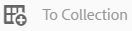
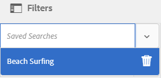

# Gestire le raccolte {#managing-collections}

Una raccolta è un set di risorse all’interno di Adobe Experience Manager Assets. Utilizza le raccolte per condividere le risorse tra gli utenti. Il set può essere una raccolta statica o una raccolta dinamica basata sui risultati della ricerca.

A differenza delle cartelle, una raccolta può includere risorse da posizioni diverse. Puoi condividere raccolte con vari utenti a cui sono assegnati diversi livelli di privilegi, tra cui visualizzazione, modifica e così via.

Puoi condividere più raccolte con un utente. Ogni raccolta contiene riferimenti alle risorse. L’integrità referenziale delle risorse viene mantenuta tra le raccolte.

Le raccolte sono dei tipi seguenti, in base alla modalità di raccolta delle risorse:

* Una raccolta contenente un elenco di riferimento statico di risorse, cartelle e altre raccolte.
* Una raccolta avanzata che include in modo dinamico le risorse in base a un criterio di ricerca.

## Accedere alla console Raccolte {#navigating-the-collections-console}

Per aprire le **[!UICONTROL Raccolte]**, tocca o fai clic sul logo di Experience Manager. Dalla pagina di navigazione, passa a **[!UICONTROL Risorse]** > **[!UICONTROL Raccolte]**.

## Creare una raccolta {#creating-a-collection}

È possibile creare una raccolta con [riferimenti statici](#creating-a-collection-with-static-references) o in base a un [filtro basato su criteri di ricerca](#creating-a-smart-collection). Puoi anche creare una raccolta da una Lightbox.

### Creare una raccolta con riferimenti statici {#creating-a-collection-with-static-references}

Puoi creare una raccolta con riferimenti statici, ad esempio una raccolta con riferimenti a risorse, cartelle, raccolte, set 360 gradi e set di immagini.

1. Passa alla console **[!UICONTROL Raccolte]** .
1. Dalla barra degli strumenti, tocca o fai clic su **[!UICONTROL Crea]**.
1. Nella pagina **[!UICONTROL Crea raccolta]**, immetti un titolo e una descrizione facoltativa per la raccolta.
1. Aggiungi i membri alla raccolta e assegna le autorizzazioni appropriate. In alternativa, per consentire a tutti gli utenti di accedere alla raccolta, seleziona **[!UICONTROL Raccolta pubblica]**.

   >[!NOTE]
   >
   >Per consentire ai membri di condividere le raccolte con altri utenti, fornisci al gruppo `dam-users` le autorizzazioni di lettura nel percorso `home/users`. Concedi l&#39;autorizzazione agli utenti nella posizione `/content/dam/collections` per consentire agli utenti di visualizzare le raccolte negli elenchi a comparsa. In alternativa, imposta l’utente come parte del gruppo `dam-users` .

1. (Facoltativo) Aggiungi una miniatura per la raccolta.
1. Tocca o fai clic su **[!UICONTROL Crea]**, quindi tocca o fai clic su **[!UICONTROL OK]** per chiudere la finestra di dialogo. Una raccolta con il titolo e le proprietà specificati viene aperta nella console Raccolte.

   >[!NOTE]
   >
   >Risorse di Experience Manager consente di creare attività di revisione per una raccolta, in modo analogo a come si creano le attività di revisione per una cartella di risorse.

   Per aggiungere risorse alla raccolta, passa all’interfaccia utente Assets. Per informazioni dettagliate, consulta [Aggiungere risorse a una raccolta](/help/assets/managing-collections-touch-ui.md#adding-assets-to-a-collection).

### Creare raccolte con zona di rilascio {#create-collections-using-dropzone}

Puoi trascinare le risorse dall’interfaccia utente di Assets in una raccolta. Puoi anche creare una copia di una raccolta e trascinarvi le risorse.

1. Dall’interfaccia utente Assets, seleziona le risorse da aggiungere a una raccolta.
1. Trascina le risorse nella zona **[!UICONTROL Rilascia raccolta]** .

   

   Rilasciare il pulsante del mouse quando la zona di rilascio diventa attiva e la relativa etichetta diventa **[!UICONTROL Rilascia per aggiungere]**.

   

   In alternativa, tocca o fai clic sull&#39;icona **[!UICONTROL To Collection]** nella barra degli strumenti.

   

1. Nella pagina **[!UICONTROL Aggiungi a raccolta]**, tocca o fai clic sull’icona **[!UICONTROL Crea raccolta]** dalla barra degli strumenti.

   Se vuoi aggiungere le risorse a una raccolta esistente, selezionala dalla pagina, quindi tocca o fai clic su **[!UICONTROL Aggiungi]**. Per impostazione predefinita, è selezionata la raccolta aggiornata più di recente.

1. Nella finestra di dialogo **[!UICONTROL Crea nuova raccolta]**, specifica un nome per la raccolta. Se vuoi che la raccolta sia accessibile a tutti gli utenti, seleziona **[!UICONTROL Raccolta pubblica]**.
1. Tocca o fai clic su **[!UICONTROL Continua]** per creare la raccolta.

### Creare una raccolta avanzata {#creating-a-smart-collection}

Una raccolta avanzata utilizza un criterio di ricerca per popolare dinamicamente le risorse. È possibile creare una raccolta avanzata utilizzando solo file e non cartelle o file e cartelle.

Per creare una raccolta avanzata, effettua le seguenti operazioni:

1. Passa all’interfaccia utente Assets e tocca o fai clic sull’icona di ricerca.

1. Immettere la parola chiave search nella casella Omnisearch e premere Invio. Apri il pannello Filtri e applica un filtro di ricerca.

1. Dall&#39;elenco **[!UICONTROL File e cartelle]**, selezionare **[!UICONTROL File]**.

   

1. Tocca o fai clic su **[!UICONTROL Salva raccolta avanzata]**.
1. Specifica un nome per la raccolta. Seleziona **[!UICONTROL Public]** per aggiungere il gruppo DAM Users con il ruolo Visualizzatore alla raccolta avanzata.

   

   >[!NOTE]
   >
   >Se selezioni **[!UICONTROL Public]**, la raccolta avanzata diventa disponibile a tutti coloro che dispongono del ruolo di proprietario dopo averlo creato. Se deselezioni l’opzione **[!UICONTROL Public]** , il gruppo di utenti DAM non è più associato alla raccolta avanzata.

1. Per creare la raccolta avanzata, tocca/fai clic su **[!UICONTROL Salva]**, quindi chiudi la finestra messaggio per completare il processo.

   La nuova raccolta avanzata viene aggiunta anche all&#39;elenco **[!UICONTROL Ricerche salvate]**.

   

   L’etichetta del pulsante **[!UICONTROL Create Smart Selection (Crea selezione avanzata)]** diventa **[!UICONTROL Edit Smart Selection (Modifica selezione avanzata)]**. Per modificare le impostazioni della raccolta avanzata, seleziona **[!UICONTROL File]** dall’elenco **[!UICONTROL File e cartelle]**. Quindi tocca o fai clic sul pulsante **[!UICONTROL Edit Smart Selection (Modifica selezione avanzata)]**.

   

## Aggiungere risorse a una raccolta {#adding-assets-to-a-collection}

Puoi aggiungere risorse a una raccolta contenente un elenco di risorse o cartelle a cui si fa riferimento. Le raccolte avanzate utilizzano una query di ricerca per popolare le risorse. Pertanto, i riferimenti statici a risorse e cartelle non sono applicabili a tali risorse.

1. Nell’interfaccia utente Assets, seleziona la risorsa e tocca o fai clic sull’icona **[!UICONTROL To Collection]** nella barra degli strumenti.

   

   In alternativa, puoi trascinare la risorsa nell’area **[!UICONTROL Rilascia raccolta]** sull’interfaccia. Aggiungi le risorse quando l&#39;etichetta della regione cambia in **[!UICONTROL Rilascia a Aggiungi]**.

1. Nella pagina **[!UICONTROL Aggiungi alla raccolta]** , seleziona la raccolta alla quale desideri aggiungere la risorsa.

1. Tocca o fai clic su **[!UICONTROL Aggiungi]**, quindi chiudi il messaggio di conferma. La risorsa viene aggiunta alla raccolta.

## Modificare una raccolta avanzata {#editing-a-smart-collection}

Le raccolte avanzate vengono create salvando una ricerca in modo da poter modificare il loro contenuto modificando i parametri di ricerca della [ricerca salvata](#editing-saved-searches).

1. Nell’interfaccia utente Assets, tocca o fai clic sull’icona di ricerca nella barra degli strumenti.

   

1. Con il cursore nella casella Omnisearch, premere il tasto Return.

1. Tocca o fai clic sull’icona Navigazione globale per visualizzare il pannello Filtri .

1. Dall’elenco **[!UICONTROL Ricerche salvate]**, seleziona la raccolta avanzata da modificare. Nel pannello Ricerca sono visualizzati i filtri configurati per la ricerca salvata.

   

1. Dall&#39;elenco **[!UICONTROL File e cartelle]**, selezionare **[!UICONTROL File]**.

1. Se necessario, modifica uno o più filtri. Tocca o fai clic su **[!UICONTROL Modifica raccolta avanzata]**.

   Puoi anche modificare il nome della raccolta avanzata.

   

1. Tocca o fai clic su **[!UICONTROL Salva]**. Viene visualizzata la finestra di dialogo **[!UICONTROL Modifica raccolta avanzata]**.

1. Tocca o fai clic su **[!UICONTROL Sovrascrivi]** per sostituire la raccolta avanzata originale con la raccolta modificata. In alternativa, selezionare **[!UICONTROL Salva con nome]** per salvare separatamente la raccolta modificata.

1. Nella finestra di dialogo di conferma, tocca o fai clic su **[!UICONTROL Salva]** per completare il processo.

## Visualizzare e modificare i metadati della raccolta {#viewing-and-editing-collection-metadata}

I metadati della raccolta includono dati sulla raccolta, compresi eventuali tag aggiunti.

1. Dalla console Raccolte, seleziona una raccolta e tocca o fai clic sull’icona **[!UICONTROL Proprietà]** nella barra degli strumenti.
1. Nella pagina **[!UICONTROL Metadati raccolta]**, seleziona le schede **[!UICONTROL Base]** e **[!UICONTROL Avanzate]** per visualizzare i metadati della raccolta.
1. Modifica i metadati, se necessario, quindi tocca o fai clic su **[!UICONTROL Salva e chiudi]** nella barra degli strumenti per salvare le modifiche.

### Modificare i metadati di più raccolte in blocco {#editing-collection-metadata-in-bulk}

Puoi modificare i metadati di più raccolte contemporaneamente. Questa funzionalità consente di replicare rapidamente i metadati comuni in più raccolte.

1. Nella console Raccolte , seleziona una o più raccolte di cui desideri modificare i metadati.
1. Dalla barra degli strumenti, tocca o fai clic su **[!UICONTROL Proprietà]**.
1. Nella pagina **[!UICONTROL Metadati raccolta]**, modifica i metadati nelle schede **[!UICONTROL Base]** e **[!UICONTROL Avanzate]**, secondo necessità.
1. Per visualizzare le proprietà dei metadati per una raccolta specifica, deseleziona le raccolte rimanenti nell’elenco delle raccolte. I campi dell’editor di metadati sono compilati con i metadati per la raccolta specifica.

   >[!NOTE]
   >
   >* Nella pagina delle proprietà della raccolta, puoi rimuovere le raccolte dall’elenco delle raccolte deselezionandole. Nell’elenco delle raccolte sono selezionate tutte le raccolte per impostazione predefinita. I metadati per le raccolte rimosse non vengono aggiornati.
   >* Nella parte superiore dell’elenco, seleziona la casella di controllo accanto a **[!UICONTROL Titolo]** per passare dalla selezione delle raccolte alla cancellazione dell’elenco.

1. Tocca o fai clic su **[!UICONTROL Salva e chiudi]** nella barra degli strumenti, quindi chiudi la finestra di dialogo di conferma per completare il processo.
1. Per aggiungere i nuovi metadati a quelli esistenti, seleziona **[!UICONTROL Modalità di aggiunta]**. Se non selezioni questa opzione, i nuovi metadati sostituiranno quelli già esistenti nei campi. Tocca o fai clic su **[!UICONTROL Invia]**.

   >[!NOTE]
   >
   >I metadati aggiunti per le raccolte selezionate sovrascrivono i metadati precedenti per queste raccolte. Utilizza la modalità [!UICONTROL Aggiungi] per aggiungere nuovi valori ai metadati esistenti nei campi che possono contenere più valori. I campi con valore singolo vengono sempre sovrascritti. Tutti i tag aggiunti nel campo [!UICONTROL Tag] vengono aggiunti all’elenco esistente di tag nei metadati.

Per personalizzare la pagina dei metadati [!UICONTROL Proprietà], inclusa l&#39;aggiunta, la modifica, l&#39;eliminazione delle proprietà dei metadati, utilizza l&#39;editor schema.

>[!TIP]
>
>Il metodo di modifica collettiva funziona per le risorse disponibili in una raccolta. Per le risorse disponibili tra le cartelle o che corrispondono a un criterio comune, è possibile aggiornare in massa i metadati dopo la ricerca di queste risorse.

## Raccolte di ricerca {#searching-collections}

Puoi cercare le raccolte dalla console Raccolte . Quando esegui una ricerca con parole chiave nella casella di ricerca Omnisearch, [!DNL Experience Manager] Risorse cerca i nomi delle raccolte, i metadati e i tag aggiunti alle raccolte.

Se cerchi raccolte dal livello principale, nei risultati della ricerca vengono restituite solo singole raccolte. Le risorse o le cartelle all’interno delle raccolte sono escluse. In tutti gli altri casi (ad esempio, all’interno di una singola raccolta o in una gerarchia di cartelle), vengono restituite tutte le risorse, le cartelle e le raccolte pertinenti.

## Ricerca nelle raccolte {#searching-within-collections}

Nella console Raccolte, tocca o fai clic su una raccolta per aprirla.

All’interno di una raccolta, la ricerca è limitata alle risorse (e ai relativi tag e metadati) all’interno della raccolta che stai visualizzando. Quando esegui una ricerca all’interno di una cartella, vengono restituite tutte le risorse e le cartelle secondarie corrispondenti all’interno della cartella corrente. Quando esegui una ricerca all’interno di una raccolta, vengono restituite solo le risorse, le cartelle e le altre raccolte corrispondenti ai membri diretti della raccolta.

## Modificare le impostazioni della raccolta {#editing-collection-settings}

È possibile modificare le impostazioni della raccolta, ad esempio titolo e descrizione, o aggiungere membri a una raccolta.

1. Seleziona una raccolta e tocca o fai clic sull&#39;icona **[!UICONTROL Impostazioni]** nella barra degli strumenti. In alternativa, utilizza l&#39;azione rapida **[!UICONTROL Impostazioni]** dalla miniatura della raccolta.
1. Nella pagina **[!UICONTROL Impostazioni raccolta]**, puoi modificare le impostazioni della raccolta. Ad esempio, modifica il titolo della raccolta, le descrizioni, i membri e le autorizzazioni, come descritto in [Aggiunta di raccolte](#creating-a-collection).

1. Per salvare le modifiche, tocca o fai clic su **[!UICONTROL Salva]**.

## Eliminare una raccolta {#deleting-a-collection}

1. Dalla console Raccolte , seleziona una o più raccolte e tocca o fai clic sull’icona Elimina nella barra degli strumenti.

1. Nella finestra di dialogo, tocca o fai clic su **[!UICONTROL Elimina]** per confermare l’eliminazione.

   >[!NOTE]
   >
   >È inoltre possibile eliminare le raccolte avanzate eliminando le ricerche salvate](#deleting-saved-searches).[

## Scaricare una raccolta {#downloading-a-collection}

Quando scarichi una raccolta, viene scaricata l’intera gerarchia delle risorse all’interno della raccolta, incluse le cartelle e le raccolte secondarie.

1. Dalla console Raccolte , seleziona una o più raccolte da scaricare.
1. Dalla barra degli strumenti, tocca o fai clic sull’icona di download.
1. Nella finestra di dialogo **[!UICONTROL Scarica]**, tocca o fai clic su **[!UICONTROL Scarica]**. Se desideri scaricare i rendering delle risorse all’interno della raccolta, seleziona **[!UICONTROL Rendering]**. Seleziona l’opzione **[!UICONTROL E-mail]** per inviare una notifica e-mail al proprietario della raccolta.

   Quando selezioni una raccolta da scaricare, viene scaricata la gerarchia completa delle cartelle sotto la raccolta. Per includere ogni raccolta scaricata (incluse le risorse nelle raccolte secondarie nidificate sotto la raccolta principale) in una singola cartella, seleziona **[!UICONTROL Crea una cartella separata per ogni risorsa]**.

## Creare raccolte nidificate {#creating-nested-collections}

È possibile aggiungere una raccolta a un&#39;altra raccolta, creando in tal modo una raccolta nidificata.

1. Dalla console Raccolte, seleziona la raccolta o il gruppo di raccolte desiderato, quindi tocca o fai clic sull’icona **[!UICONTROL To Collection]** nella barra degli strumenti.

   

1. Dalla pagina **[!UICONTROL Aggiungi alla raccolta]**, seleziona la raccolta in cui aggiungere la raccolta.

   >[!NOTE]
   >
   >La raccolta aggiornata più di recente è selezionata per impostazione predefinita nella pagina **[!UICONTROL Aggiungi alla raccolta]** .

1. Tocca o fai clic su **[!UICONTROL Aggiungi]**. Un messaggio conferma che la raccolta viene aggiunta alla raccolta di destinazione nella pagina **[!UICONTROL Seleziona destinazione]** . Chiudi il messaggio per completare il processo.

>[!NOTE]
>
>Le raccolte avanzate non possono essere nidificate. In altre parole, le raccolte avanzate non possono contenere altre raccolte.

## Ricerche salvate {#saved-searches}

Nell’interfaccia utente Assets, puoi cercare o filtrare le risorse in base a determinate regole, criteri di ricerca o facet di ricerca personalizzata. Se salvi queste ricerche come **[!UICONTROL Ricerche salvate]**, puoi accedervi in un secondo momento dall’elenco **[!UICONTROL Ricerche salvate]** nel pannello Filtro. La creazione di una ricerca salvata genera anche una raccolta avanzata.

### Creare ricerche salvate {#creating-saved-searches}

Le ricerche salvate vengono create quando generi una raccolta avanzata. Le raccolte avanzate vengono aggiunte automaticamente all’elenco **[!UICONTROL Ricerche salvate]**. La query delle Ricerche salvate per la raccolta viene salvata nella proprietà `dam:query` in crxde nella posizione relativa `/content/dam/collections/`. Non ci sono limiti alle ricerche che puoi salvare e alle ricerche salvate visualizzate nell’elenco.

>[!NOTE]
>
>Puoi condividere le raccolte avanzate nello stesso modo in cui condividi le raccolte statiche.

### Modifica ricerche salvate {#editing-saved-searches}

La modifica delle ricerche salvate equivale alla modifica delle raccolte avanzate. Per informazioni dettagliate, consulta [Modifica di una raccolta avanzata](/help/assets/managing-collections-touch-ui.md#editing-a-smart-collection).

### Eliminare le ricerche salvate {#deleting-saved-searches}

1. Nell’interfaccia utente Assets, tocca o fai clic sull’icona di ricerca nella barra degli strumenti.

   

1. Con il cursore nel campo Omnisearch, premere il tasto Invio.

1. Tocca o fai clic sull’icona Navigazione globale per visualizzare il pannello Filtri .

1. Dall’elenco **[!UICONTROL Ricerche salvate]**, tocca o fai clic sull’icona Elimina accanto alla raccolta avanzata da eliminare.

   

1. Nella finestra di dialogo, tocca o fai clic su **[!UICONTROL Elimina]** per eliminare la ricerca salvata.

## Esecuzione di un flusso di lavoro su una raccolta {#running-a-workflow-on-a-collection}

Puoi eseguire un flusso di lavoro per le risorse all’interno di una raccolta. Se la raccolta contiene raccolte nidificate, il flusso di lavoro viene eseguito anche sulle risorse all’interno delle raccolte nidificate. Tuttavia, se la raccolta e la raccolta nidificata contengono risorse duplicate, il flusso di lavoro viene eseguito una sola volta per tali risorse.

1. Dalla console Raccolte , seleziona una raccolta in cui desideri eseguire un flusso di lavoro.
1. Tocca o fai clic sull&#39;icona di navigazione globale e scegli **[!UICONTROL Timeline]** dall&#39;elenco.
1. Dalla timeline, tocca o fai clic sull’icona del cursore verso il basso, quindi tocca o fai clic su **[!UICONTROL Avvia flusso di lavoro]**.

   

1. Nella sezione **[!UICONTROL Avvia flusso di lavoro]**, seleziona un modello di flusso di lavoro dall’elenco. Ad esempio, scegli il modello **[!UICONTROL Risorsa di aggiornamento DAM]**.
1. Inserisci un titolo per il flusso di lavoro e tocca o fai clic su **[!UICONTROL Avvia]**.
1. Nella finestra di dialogo, tocca o fai clic su **[!UICONTROL Procedi]**. Il flusso di lavoro viene eseguito su tutte le risorse della raccolta.

>[!MORELIKETHIS]
>
>* [Configurare le notifiche e-mail di Experience Manager Assets](/help/sites-administering/notification.md#assetsconfig)
>* [Creare un&#39;attività di revisione per le raccolte](bulk-approval.md)

