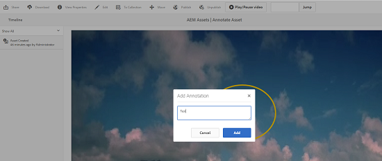

# Gestire le risorse video {#managing-video-assets}

>[!CAUTION]
>
>AEM 6.4 ha raggiunto la fine del supporto esteso e questa documentazione non viene più aggiornata. Per maggiori dettagli, consulta la nostra [periodi di assistenza tecnica](https://helpx.adobe.com/it/support/programs/eol-matrix.html). Trova le versioni supportate [qui](https://experienceleague.adobe.com/docs/).

Scopri come gestire e modificare le risorse video in Risorse Adobe Experience Manager. Inoltre, se disponi della licenza per utilizzare Dynamic Media, consulta [Documentazione video su Dynamic Media](video.md).

## Caricare e visualizzare in anteprima le risorse video {#uploading-and-previewing-video-assets}

[!DNL Experience Manager] Assets genera anteprime per le risorse video con l’estensione MP4. Se il formato della risorsa non è MP4, installa il pacchetto FFmpeg per generare un&#39;anteprima. FFmpeg crea rappresentazioni video di tipo OGG e MP4. Puoi visualizzare in anteprima queste rappresentazioni nel [!DNL Experience Manager] Interfaccia utente di Assets.

1. Nella cartella o nelle sottocartelle Risorse digitali, individua il percorso in cui desideri aggiungere le risorse digitali.
1. Per caricare la risorsa, tocca o fai clic su **[!UICONTROL Crea]** dalla barra degli strumenti, quindi scegli **[!UICONTROL File]**. In alternativa, puoi rilasciarlo direttamente nell’area delle risorse. Vedi [Caricamento delle risorse](managing-assets-touch-ui.md#uploading-assets) per informazioni dettagliate sull’operazione di caricamento.
1. Per visualizzare un video in anteprima nella vista a schede, tocca **[!UICONTROL Play]** sulla risorsa video.

   

   È possibile mettere in pausa o riprodurre il video nel **[!UICONTROL Scheda]** visualizza solo. Il pulsante Riproduci/Pausa non è disponibile nel **[!UICONTROL Elenco]** visualizza.

1. Tocca **[!UICONTROL Modifica]** sulla scheda per visualizzare in anteprima il video nella **[!UICONTROL Dettagli]** visualizza.

   Il video viene riprodotto nel lettore video nativo del browser. È possibile riprodurre, mettere in pausa, controllare il volume e ingrandire il video a schermo intero.

   

## Configurazione per caricare risorse di dimensioni superiori a 2 GB {#configuration-to-upload-video-assets-that-are-larger-than-gb}

Per impostazione predefinita, la [!DNL Experience Manager] Le risorse non consentono di caricare risorse di dimensioni superiori a 2 GB a causa di un limite di dimensione del file. Tuttavia, puoi sovrascrivere questo limite andando in CRXDE Lite e creando un nodo sotto il `/apps` directory. Il nodo deve avere lo stesso nome del nodo, la struttura della directory e le proprietà del nodo confrontabili dell&#39;ordine.

Oltre a [!DNL Experience Manager] Configurazione delle risorse, modifica le seguenti configurazioni per caricare risorse di grandi dimensioni:

* Aumenta il tempo di scadenza del token. Vedi [!UICONTROL Servlet CSRF Granite Adobe] nella console Web all&#39;indirizzo `https://[aem_server]:[port]/system/console/configMgr`. Per ulteriori informazioni, consulta [Protezione CSRF](/help/sites-developing/csrf-protection.md).
* Aumenta il `receiveTimeout` nella configurazione del Dispatcher. Per ulteriori informazioni, consulta [Configurazione di Experience Manager Dispatcher](https://experienceleague.adobe.com/docs/experience-manager-dispatcher/using/configuring/dispatcher-configuration.html#renders-options).

>[!NOTE]
>
>La [!DNL Experience Manager] L&#39;interfaccia utente classica non ha un limite di dimensione del file di due gigabyte. Inoltre, il flusso di lavoro end-to-end per video di grandi dimensioni non è completamente supportato.

Per configurare un limite di dimensione file più elevato, esegui i seguenti passaggi nel `/apps` directory.

1. In AEM, tocca **[!UICONTROL Strumenti > Generale > CRXDE Lite]**.
1. In **[!UICONTROL CRXDE Lite]** nella finestra della directory a sinistra, vai a `/libs/dam/gui/content/assets/jcr:content/actions/secondary/create/items/fileupload`. Per visualizzare la finestra della directory, tocca `>>` icona.
1. Dalla barra degli strumenti, tocca **[!UICONTROL Nodo di sovrapposizione]**. In alternativa, seleziona **[!UICONTROL Sovrapponi nodo]** dal menu di scelta rapida.
1. Nella finestra di dialogo **[!UICONTROL Sovrapponi nodo]**, tocca **[!UICONTROL OK]**.

   

1. Aggiorna il browser. Il nodo di sovrapposizione `/apps/dam/gui/content/assets/jcr:content/actions/secondary/create/items/fileupload` è selezionato.
1. In **[!UICONTROL Proprietà]** immetti il valore appropriato in byte per aumentare il limite di dimensione alle dimensioni desiderate. Ad esempio, immetti `32212254720` per aumentare il limite di dimensione a 30 GB.

1. Dalla barra degli strumenti, tocca **[!UICONTROL Salva tutto]**.
1. All’interno di AEM, tocca **[!UICONTROL Strumenti > Operazioni > Console web]**.
1. Sulla **[!UICONTROL Bundle della console Web di Adobe Experience Manager]** sotto **[!UICONTROL Nome]** colonna della tabella, individuare e toccare **[!UICONTROL Adobe Granite Workflow External Process Job Handler]**.
1. In **[!UICONTROL Adobe Granite Workflow External Process Job Handler]** imposta i secondi per entrambi **[!UICONTROL Timeout predefinito]** e **[!UICONTROL Timeout massimo]** campi `18000` (cinque ore).
1. Tocca **[!UICONTROL Salva]**.
1. In AEM, tocca **[!UICONTROL Strumenti > Flusso di lavoro > Modelli]**.
1. Sulla **[!UICONTROL Modelli di flusso di lavoro]** pagina, seleziona **[!UICONTROL Codifica video Dynamic Media]**, quindi tocca **[!UICONTROL Modifica]**.
1. Sulla **[!UICONTROL Flusso di lavoro]** , tocca due volte **[!UICONTROL Processo di Dynamic Media Video Service]** componente.
1. Nella finestra di dialogo **[!UICONTROL Step Properties (Proprietà passo)]**, nella scheda **[!UICONTROL Common (Comune)]**, espandi **[!UICONTROL Impostazioni avanzate]**.
1. Nel campo **[!UICONTROL Timeout]**, specifica un valore di `18000`, quindi tocca **[!UICONTROL OK]** per tornare alla pagina del flusso di lavoro **[!UICONTROL Codifica video elementi multimediali dinamici]**.
1. Vicino alla parte superiore della pagina, sotto il **[!UICONTROL Codifica video Dynamic Media]** titolo della pagina, tocca **[!UICONTROL Salva]**.

## Pubblicare risorse video {#publishing-video-assets}

Dopo la pubblicazione, le risorse video sono disponibili per l’inclusione in una pagina web tramite un URL o per l’incorporamento in una pagina web. Vedi [Pubblicare le risorse](publishing-dynamicmedia-assets.md).

## Annotare risorse video {#annotating-video-assets}

1. Dalla console Risorse, tocca **[!UICONTROL Modifica]** sulla scheda della risorsa per visualizzare la pagina dei dettagli della risorsa.
1. Tocca **[!UICONTROL Anteprima]** per riprodurre il video.
1. Per annotare il video, tocca il **[!UICONTROL Annota]** pulsante . Nel video viene aggiunta un’annotazione al particolare punto temporale (fotogramma).

   Durante l&#39;annotazione, potete disegnare sull&#39;area di lavoro e includere un commento nel disegno. I commenti vengono salvati automaticamente in Risorse Adobe Experience Manager.

   

   Per uscire dalla procedura guidata dell’annotazione, tocca **[!UICONTROL Chiudi]**.

1. Per passare a un punto specifico del video, specifica il tempo in secondi nel campo di testo e fai clic su **[!UICONTROL Salto]**. Ad esempio, per saltare i primi 20 secondi del video, immetti `20` nel campo di testo.

   

1. Fate clic su un’annotazione per visualizzarla nella timeline. Tocca **[!UICONTROL Elimina]** per rimuovere l’annotazione dalla timeline.

   
