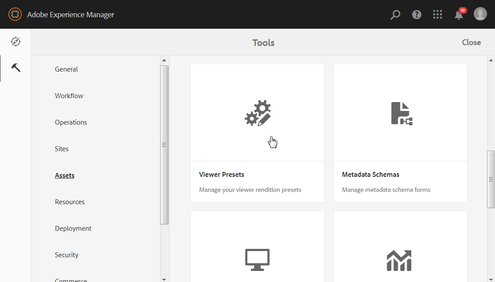

# Managing Dynamic Media viewer presets {#managing-viewer-presets}

Un predefinito per visualizzatori Dynamic Media è una raccolta di impostazioni che determinano in che modo gli utenti possono visualizzare le risorse multimediali sullo schermo del computer e sui dispositivi mobili. Un amministratore può creare dei predefiniti per visualizzatori. Sono disponibili impostazioni per una serie di opzioni di configurazione del visualizzatore. Ad esempio, potete modificare le dimensioni di visualizzazione o il comportamento di zoom del visualizzatore.

Per istruzioni su come creare e personalizzare i predefiniti per visualizzatori HTML5, consultate l’SDK per visualizzatori HTML5 di *Adobe Scene7*. L’SDK è disponibile nel server di pubblicazione IS incorporato nell’SDK stesso. Ogni versione della libreria include una propria documentazione SDK.

Percorso: `<scene7_domain>/s7sdk/<library_version>/docs/jsdocs/index.html`.\
Ad esempio, 3.5 SDK: [https://s7d1.scene7.com/s7sdk/3.5/docs/jsdoc/index.html](https://s7d1.scene7.com/s7sdk/3.5/docs/jsdoc/index.html)

Consultate anche la guida [di riferimento visualizzatori](https://docs.adobe.com/content/help/en/dynamic-media-developer-resources/library/home.html)Adobe.

Questa sezione descrive come creare, modificare e gestire i predefiniti per visualizzatori. Potete applicare un predefinito per visualizzatori a una risorsa ogni volta che la visualizzate in anteprima. See [Applying Viewer Presets](viewer-presets.md).

>[!NOTE]
>
>Tenete presente che la modifica di eventuali predefiniti per visualizzatori *predefiniti* non è uno scenario supportato. Se tentate di modificare un predefinito per visualizzatori preimpostato, vi verrà richiesto di salvare il predefinito per visualizzatori con un nuovo nome.

## Accessibilità da tastiera per i visualizzatori {#keyboard-accessibility-for-viewers}

Tutti i visualizzatori integrati supportano l&#39;accessibilità da tastiera.

Vedere anche Accessibilità e navigazione [da](https://docs.adobe.com/content/help/en/dynamic-media-developer-resources/library/c-keyboard-accessibility.html)tastiera.

## Managing Dynamic Media viewer presets {#managing-presets}

You can add, edit, delete, publish, unpublish, and preview viewer presets in AEM by tapping **[!UICONTROL Tools > Assets > Viewer Presets]**.

>[!NOTE]
>
>Per impostazione predefinita, quando selezionate Visualizzatori nella visualizzazione Dettagli di una risorsa, il sistema mostra 15 predefiniti per visualizzatori. Puoi aumentare questo limite. Consulta la sezione [Aumento del numero di predefiniti visualizzatore](#increasing-the-number-of-viewer-presets-that-display).

## Supporto visualizzatore per pagine Web reattive {#viewer-support-for-responsive-designed-web-pages}

Diverse pagine Web hanno esigenze diverse. Ad esempio, a volte desiderate una pagina Web che fornisca un collegamento per aprire il visualizzatore HTML5 in una finestra browser separata. In altri casi, potrebbe essere necessario incorporare il visualizzatore HTML5 direttamente nella pagina host. In quest’ultimo caso, la pagina Web potrebbe avere un layout statico. Oppure può essere *reattivo* e visualizzato in modo diverso su dispositivi diversi o per diverse dimensioni della finestra del browser. Per soddisfare queste esigenze, tutti i visualizzatori HTML5 predefiniti forniti con Dynamic Media supportano sia le pagine Web statiche che quelle reattive.

Per ulteriori informazioni su come incorporare visualizzatori reattivi nelle pagine Web, consultate Libreria [immagini](https://docs.adobe.com/content/help/en/dynamic-media-developer-resources/image-serving-api/image-serving-api/responsive-static-image-library/c-about-responsive-static-image-library.html) reattiva nella guida *API di* Image Serving.

>[!NOTE]
>
>Prima di iniziare a utilizzarli, è necessario pubblicare tutti i visualizzatori inclusi.\
>See [Publishing Viewer Presets.](#publishing-viewer-presets)

## Compatibilità del sistema dei predefiniti per visualizzatori  {#viewer-preset-system-compatibility}

Tutti i predefiniti per visualizzatori forniti con Dynamic Media sono completamente compatibili con i seguenti sistemi:

* Desktop
* Apple iPhone
* Apple iPad
* Smartphone Android
* Tablet Android
* Per i video, è disponibile un supporto aggiuntivo per la riproduzione MP4 per [Blackberry](https://developer.blackberry.com/devzone/develop/supported_media/bb_media_support_at_a_glance.html#kba1328730952678) e [Windows Phone 8](https://msdn.microsoft.com/library/windows/apps/ff462087%28v=vs.105%29.aspx).

### Tipi di contenuti multimediali per i predefiniti per visualizzatori {#rich-media-types-for-viewer-presets}

Gli amministratori possono aggiungere e personalizzare i seguenti tipi di contenuti multimediali quando creano nuovi predefiniti per visualizzatori.

| Tipi di contenuti multimediali | Descrizione |
|:---|:---|
| **Set carosello** | I punti attivi, le mappe immagine o entrambi vengono aggiunti a una serie di due o più immagini. Un cliente può scorrere le immagini a sinistra o a destra e quindi fare clic su un punto di attivazione su un&#39;immagine per ulteriori dettagli o per acquistare direttamente dalla categoria, dalla pagina principale o dalle pagine di destinazione di un sito Web. |
| **Zoom a comparsa** | Visualizza una seconda immagine dell’area ingrandita accanto all’immagine originale. Nessun controllo da utilizzare: gli utenti possono spostare la selezione sull’area da visualizzare. |
|  | Quando calcolate l’utilizzo di larghezza di banda totale per questo visualizzatore, tenete presente che nel visualizzatore vengono servite sia l’immagine principale che l’immagine a comparsa. Le dimensioni dell’immagine principale (larghezza e altezza dell’area di visualizzazione) e il fattore di zoom determinano le dimensioni dell’immagine a comparsa. Per evitare che le dimensioni del file a comparsa diventino eccessive, bilanciate i due valori seguenti: se l’immagine principale è di grandi dimensioni, riducete il fattore di zoom. Larghezza a comparsa e Altezza comparsa determinano le dimensioni della finestra a comparsa, ma non dell’immagine a comparsa caricata nel visualizzatore. |
|  | Ad esempio, se le dimensioni dell’immagine principale sono 350 x 350 pixel, con un fattore di zoom pari a 3 l’immagine a comparsa risultante sarà di 1050 x 1050 pixel. Se le dimensioni dell’immagine principale sono 300 x 300 pixel, con un fattore di zoom pari a 4 l’immagine a comparsa sarà di 1200 x 1200 pixel. A seconda dell’impostazione di qualità JPEG (le impostazioni consigliate sono comprese tra 80 e 90), potete ridurre notevolmente la dimensione del file. I fattori di zoom consigliati sono compresi tra 2,5 e 4, a seconda delle dimensioni dell’immagine principale. |
| **Zoom in linea** | Visualizza un’immagine dell’area ingrandita all’interno del visualizzatore originale. Nessun controllo da utilizzare. In altre parole, gli utenti spostano la selezione sull&#39;area da visualizzare. |
| **Set immagini** | Nel visualizzatore di set di immagini, gli utenti possono vedere diverse viste o varianti di colore di un elemento facendo clic su una miniatura. Questo visualizzatore offre anche strumenti di zoom per esaminare le immagini da vicino. |
| **Immagine interattiva** | Gli hotspot vengono aggiunti a porzioni di un&#39;immagine su cui il cliente può fare clic per ulteriori dettagli o per acquistare direttamente dalla categoria del sito Web, dalla home page o dalle pagine di destinazione. |
| **Video interattivo** | Le miniature vengono aggiunte ai segmenti della timeline di un video al quale un cliente può fare clic per ulteriori dettagli o per acquistare direttamente dalla categoria, dalla pagina principale o dalle pagine di destinazione di un sito Web. |
| **File multimediali diversi** | Consente di visualizzare diversi tipi di supporti in un visualizzatore. Potete includere set 360 gradi, set di immagini, immagini e video. |
| **Immagine panoramica** | I visualizzatori Panoramic Image (Immagine panoramica) e PanoramicVR (VR panoramico) consentono di riprodurre immagini panoramiche sferiche per consentire agli utenti di visualizzare a 360° una stanza, una proprietà, un luogo o un paesaggio. |
|  | Affinché un’immagine caricata possa essere definita come panorama sferico, deve avere una o entrambe le caratteristiche seguenti: <ul><li>Proporzioni di 2:1.</li><li>Etichettate con le parole chiave equirettangolari, sferiche e panoramiche o sferiche e panoramiche. Consultate [Utilizzo dei tag](../sites-authoring/tags.md).</li></ul> |
|  | Sia le proporzioni che i criteri delle parole chiave si applicano alle risorse panoramiche per la pagina dei dettagli delle risorse che per il componente WCM &quot;File multimediali panoramici&quot;. |
|  | Importante: Questo visualizzatore è disponibile solo in modalità Dynamic Media - Scene7. |
| **Set 360 gradi** | Fornisce diverse viste di un’immagine in modo che gli utenti possano ruotare l’oggetto per esaminare i diversi lati e angolazioni. |
| **Video** | Riproduce video con streaming a bitrate progressivo o adattivo. Lo streaming con bitrate adattivo esegue automaticamente il rilevamento del dispositivo e della larghezza di banda per trasmettere il video di qualità ottimale nel formato corretto. |
| **Zoom verticale** | Il visualizzatore zoom verticale consente di ottimizzare l’esperienza di visualizzazione di un prodotto per offrire agli utenti la migliore rappresentazione di un prodotto. La posizione verticale dei campioni effettua le seguenti operazioni: <ul><li>Assicurarsi che i campioni siano al di sopra della piega. Con i campioni orizzontali, a seconda delle dimensioni dello schermo del ’ desktop dell’utente, i campioni non erano visibili finché l’utente non scorreva la pagina verso il basso. Posizionando i campioni in verticale nel visualizzatore, questi vengono visualizzati indipendentemente dalle dimensioni dello schermo dell’utente.</li><li>Ottimizza le dimensioni dell’immagine principale. Con i campioni orizzontali, è necessario riservare spazio sulla pagina per assicurarsi che siano visibili. Questo posizionamento ha ridotto le dimensioni dell&#39;immagine principale. Con un layout di campioni verticale, tuttavia, non è necessario allocare questo spazio. Potete quindi ingrandire le dimensioni dell’immagine principale.</li></ul> |
| **Zoom** | Consente agli utenti di ingrandire l’area facendo clic su di essa. Gli utenti possono fare clic sui controlli per ingrandire, ridurre e ripristinare le dimensioni predefinite dell’immagine. |

## Elenco di predefiniti per visualizzatori forniti con Scene7 {#list-of-out-of-the-box-viewer-presets}

La tabella seguente identifica tutti i predefiniti per visualizzatori predefiniti forniti con Dynamic Media.

Consulta anche <!-- [SAVE THIS REFERENCE Viewers Reference Library Examples](https://marketing.adobe.com/resources/help/en_US/s7/vlist/vlist.html) and --> [Live Demos](https://landing.adobe.com/en/na/dynamic-media/ctir-2755/live-demos.html).

Per informazioni sui browser Web e sulle versioni del sistema operativo supportati per i visualizzatori, consultate le Note sulla versione dei visualizzatori.

Consultate *Note* sulla versione dei visualizzatori nel sommario della guida di riferimento ai [visualizzatori](https://docs.adobe.com/content/help/en/dynamic-media-developer-resources/library/home.html).

>[!NOTE]
>
>Tutti i predefiniti per visualizzatori integrati in Dynamic Media sono già attivati (attivato), ma è necessario pubblicarli.\
>See [Publishing Viewer Presets](#publishing-viewer-presets).
>
>Eventuali nuovi predefiniti per visualizzatori creati e aggiunti devono essere attivati ** e pubblicati.\
>Consultate [Attivazione o disattivazione dei predefiniti](#activating-or-deactivating-viewer-presets) per visualizzatori e [Pubblicazione dei predefiniti](#publishing-viewer-presets)per visualizzatori.

| Titolo predefinito per visualizzatori | Tipo | Nome file CSS |
|:---|:---|:---|
| Carousel_Dotted_dark | Carousel_Set | html5_carouselviewer_dotted_dark.css |
| Carousel_Dotted_light | Carousel_Set | html5_carouselviewer_dotted_light.css |
| Carousel_Numeric_dark | Carousel_Set | html5_carouselviewer_numeric_dark.css |
| Carousel_Numeric_light | Carousel_Set | html5_carouselviewer_numeric_light.css |
| A comparsa | Flyout_Zoom | html5_flyoutviewer.css |
| ImageSet_dark | Set immagini | html5_zoomviewer_dark.css |
| ImageSet_light | Set immagini | html5_zoomviewer_light.css |
| InlineMixedMedia_dark | Mixed_Media | html5_inlinemixedmediaviewer_dark.css |
| InlineMixedMedia_light | Mixed_Media | html5_inlinemixedmediaviewer_light.css |
| InlineZoom | Flyout_Zoom | html5_inlinezoomviewer.css |
| MixedMedia_dark | Mixed_Media | html5_mixedmediaviewer_dark.css |
| MixedMedia_light | Mixed_Media | html5_mixedmediaviewer_light.css |
| Immagine panoramica | Panoramic_Image | html5_panoramicimage.css |
| PanoramicImageVR | Panoramic_Image | html5_panoramicimage.css |
| Shoppable_Banner | Interactive_Image | html5_interactiveimage.css |
| Shoppable_Video_dark | Interactive_Video | html5_interactivevideoviewer_dark.css |
| Shoppable_Video_light | Interactive_Video | html5_interactivevideovewer_light.css |
| SpinSet_dark | Spin_Set | html5_spinviewer_dark.css |
| SpinSet_light | Spin_Set | html5_spinviewer_light.css |
| Video (include il supporto per sottotitoli codificati) | Video | html5_videoviewer.css |
| Video_social (include il supporto per sottotitoli codificati e social media) | Video | html5_videoviewersocial.css |
| Zoom_dark | Zoom | html5_basiczoomviewer_dark.css |
| Zoom_light | Zoom | html5_basiczoomviewer_light.css |
| ZoomVertical_dark | Vertical_Zoom | html5_zoomverticalviewer_dark.css |
| ZoomVertical_light | Vertical_Zoom | html5_zoomverticalviewer_light.css |

### Matrice di gesti supportati dai visualizzatori per dispositivi mobili {#supported-mobile-viewers-gestures-matrix}

La tabella seguente identifica i gesti del visualizzatore mobile supportati sui dispositivi iOS, Android 2.x e Android 3.x.

| Gesto | Zoom a comparsa | Zoom | Set 360 gradi |
|---|---|---|---|
| **Trascinamento** | Pannelli | Pannelli | Pannelli |
| **Toccare** | Visualizza la finestra a comparsa | Mostra o nasconde l’interfaccia utente | Mostra o nasconde l’interfaccia utente |
| **Doppio tocco** | Non applicabile | Effettua uno zoom in o reimposta | Effettua uno zoom in o reimposta |
| **Pizzico** | Non applicabile | Effettua uno zoom in (solo iOS e Android 3x) | Effettua uno zoom in (solo iOS e Android 3x) |
| **Chiudi con il dito** | Non applicabile | Effettua uno zoom out (solo iOS e Android 3x) | Effettua uno zoom out (solo iOS e Android 3x) |
| **Passaggio del dito** | Fa scorrere la barra dei campioni | Fa scorrere le immagini | Rotazione |
| **Flick** | Fa scorrere la barra dei campioni | Fa scorrere le immagini | Rotazione |

## Aumento del numero di predefiniti per visualizzatori Dynamic Media da visualizzare {#increasing-the-number-of-viewer-presets-that-display}

AEM mostra un’ampia varietà di predefiniti per visualizzatori quando visualizzate una risorsa da Visualizzazione **[!UICONTROL dettagli > Visualizzatori]**. Potete aumentare o diminuire il numero di visualizzatori.

**Per aumentare il numero di predefiniti per visualizzatori Dynamic Media visualizzati**:

1. Passate a **[!UICONTROL CRXDE Lite]** ([http://localhost:4502/crx/de](http://localhost:4502/crx/de)).
1. Andate al nodo di elenco dei predefiniti per visualizzatori in `/libs/dam/gui/coral/content/commons/sidepanels/viewerpresets/viewerpresetslist`

   

1. Nella proprietà **[!UICONTROL limit]**, modifica **[!UICONTROL Valore]**, che corrisponde a 15 per impostazione predefinita, inserendo un numero a piacere.
1. Andate all&#39;origine dati del predefinito per visualizzatori in `/libs/dam/gui/coral/content/commons/sidepanels/viewerpresets/viewerpresetslist/datasource`

   

1. Nella proprietà **[!UICONTROL limit]** , modificare il numero in base al numero desiderato, ad esempio `{empty requestPathInfo.selectors[1] ? "20" : requestPathInfo.selectors[1]}`
1. Toccate **[!UICONTROL Salva tutto]**.

## Creazione di un nuovo predefinito per visualizzatori Dynamic Media {#creating-a-new-viewer-preset}

La creazione di predefiniti per visualizzatori consente di applicare diverse impostazioni per visualizzare e interagire con le risorse. Tuttavia, non è necessario creare nuovi predefiniti per visualizzatori. Se preferite, potete usare i predefiniti per visualizzatori predefiniti forniti già con AEM Assets.

Se scegliete di creare un nuovo predefinito per visualizzatori, dopo averlo salvato, lo stato del visualizzatore viene attivato automaticamente (impostato su **attivato**) nella pagina Predefiniti **** visualizzatore. Questo stato significa che è visibile nel componente **[!UICONTROL Dynamic Media]** e nel componente Supporto **** interattivo e ogni volta che visualizzate l’anteprima di un’immagine o di un video.

Alcuni predefiniti per visualizzatori dispongono di impostazioni esclusive che possono influenzare l’utilizzo e il comportamento generale del visualizzatore. A seconda del predefinito per visualizzatori che state creando, potete essere consapevoli di queste considerazioni speciali.

Consultate Considerazioni [speciali per la creazione di un predefinito](#special-considerations-for-creating-an-interactive-viewer-preset)per visualizzatori interattivi.

Consultate Considerazioni [speciali per la creazione di un predefinito](#special-considerations-for-creating-a-carousel-banner-viewer-preset)per visualizzatori di banner carosello.

**Per creare un nuovo predefinito** per visualizzatori Dynamic Media:

1. In the upper-left corner of AEM, tap the AEM logo, then in the left rail, tap **[!UICONTROL Tools > Assets > Viewer Presets]**.

   

1. Nella pagina **[!UICONTROL Predefiniti]** visualizzatore, toccate **[!UICONTROL Crea]** nella barra degli strumenti.
1. In the **[!UICONTROL New Viewer Preset]** dialog box, in the **[!UICONTROL Preset Name]** field, enter the name of the new preset. Choose a name carefully--they are not editable after you tap **[!UICONTROL Create]**.

   Quando salvate il predefinito in una fase successiva, il nome viene visualizzato nella pagina Predefiniti visualizzatore, sotto l’intestazione della colonna Titolo **** predefinito.

1. Nel menu a discesa **[!UICONTROL Rich Media Type]** (Tipo **[!UICONTROL contenuto multimediale avanzato), selezionate il tipo di predefinito per visualizzatori da creare, quindi toccate]** Creanell’angolo in alto a destra della pagina.

   Consultate Tipi di [contenuti multimediali avanzati per i predefiniti](#rich-media-types-for-viewer-presets)per visualizzatori.

1. On the **Edit Viewer Preset** page, tap the **[!UICONTROL Appearance]** tab.
1. Effettua una delle operazioni seguenti:

   * In the **[!UICONTROL Selected Type]** pull-down menu, select a component whose visual design you want to customize. In alternativa, potete toccare qualsiasi elemento visivo nel visualizzatore per selezionarlo per la configurazione.

      L&#39;editor visivo consente di visualizzare l&#39;effetto di una determinata proprietà su uno stile. È sufficiente impostare o regolare una qualsiasi proprietà per vedere immediatamente quale effetto ha sul visualizzatore utilizzando l’esempio a sinistra dell’editor.

      Le proprietà di stile CSS per ciascun tipo di predefinito per visualizzatori sono descritte nell’argomento della guida &quot;Personalizzazione *&lt;nome_visualizzatore>* visualizzatore&quot; nella Guida di riferimento dei [visualizzatori](https://docs.adobe.com/content/help/en/dynamic-media-developer-resources/library/home.html).

      Ad esempio, se state creando un predefinito per visualizzatori di tipo `Mixed_Media`, consultate [Personalizzazione del visualizzatore](https://docs.adobe.com/content/help/en/dynamic-media-developer-resources/library/viewers-aem-assets-dmc/mixed-media/customing-mixed-media/c-html5-mixedmedia-viewer-customizingviewer.html) di file multimediali diversi per un elenco e una descrizione di ciascuna proprietà.

   * Se hai definito le impostazioni stile in un file CSS separato, puoi caricarlo in AEM Assets. Tap **[!UICONTROL Import CSS]** below the **[!UICONTROL Selected Type]** pull-down menu (you may need to scroll the visual editor up to see it) to find the uploaded CSS file and associate it with the viewer preset.

      Quando importate un file CSS, l&#39;editor visivo verifica se il CSS utilizza i marcatori visualizzatore corretti. Ad esempio, se create un visualizzatore zoom, tutte le regole CSS importate devono essere definite utilizzando il nome della classe del visualizzatore `.s7mixedmediaviewer` definito su un elemento visualizzatore principale.

      Potete importare CSS arbitrario, a mano, purché definisca correttamente i marcatori CSS per un determinato visualizzatore. (I marcatori CSS sono descritti in qualsiasi argomento della guida &quot;Personalizzazione *&lt;nome visualizzatore>* visualizzatore&quot; nella Guida di riferimento dei [visualizzatori](https://docs.adobe.com/content/help/en/dynamic-media-developer-resources/library/home.html). Ad esempio, per informazioni sui marcatori CSS per il visualizzatore zoom, consultate [Personalizzazione del visualizzatore](https://docs.adobe.com/content/help/en/dynamic-media-developer-resources/library/viewers-aem-assets-dmc/zoom/customizing-zoom/c-html5-20-zoom-viewer-customizingviewer.html)zoom. È tuttavia possibile che l&#39;editor visivo non comprenda alcuni valori CSS. In tali casi, l&#39;editor visivo tenta di ignorare gli errori in modo che il CSS possa funzionare comunque.
   >[!NOTE]
   >
   >Se preferisci modificare il CSS direttamente nel relativo modulo non elaborato, tocca **[!UICONTROL Mostra/Nascondi CSS]** nel menu a discesa Tipo selezionato (potrebbe essere necessario scorrere l’editor visivo per visualizzare l’opzione).****
   >
   >Come nell’editor visivo, quando apportate una modifica a una proprietà direttamente nel CSS, potete vedere immediatamente quale effetto produce sull’esempio del visualizzatore. Inoltre, la stessa proprietà viene automaticamente aggiornata nello stesso momento nell&#39;editor visivo. Potete quindi utilizzare l&#39;editor CSS non elaborato o l&#39;editor visivo oppure entrambi in modo intercambiabile.

   >[!NOTE]
   >
   >Per la grafica di un pulsante, scegliete l&#39;immagine 2x e caricate la grafica ad alta risoluzione. Quando lavorate con immagini interattive e banner acquistabili, potete anche scegliere tra diversi pulsanti out-of-the-box.

1. (Optional) Near the top of the **[!UICONTROL Edit Viewer Preset]** page, tap **[!UICONTROL Desktop]**, **[!UICONTROL Tablet]**, or **[!UICONTROL Phone]** to uniquely define visual styles for different device and screen types.
1. On the **[!UICONTROL Edit Viewer Preset]** page, tap the **Behavior** tab. In alternativa, puoi toccare o fare clic su qualsiasi elemento visivo del visualizzatore per configurarlo.
1. Dal menu a discesa **[!UICONTROL Tipo selezionato]**, scegli un componente di cui vuoi modificare i comportamenti.

   A molti componenti nell’editor visivo è associata una descrizione dettagliata. Queste descrizioni vengono visualizzate all’interno di caselle blu quando si espande un componente per visualizzarne i parametri associati.

   Alcuni tipi di Visualizzatore dispongono di componenti che consentono di specificare i comandi Image Server in un campo di testo **Comando IS**. Per un elenco dei comandi utilizzabili, consulta la sezione [Riferimento API di Server immagini](https://docs.adobe.com/content/help/en/dynamic-media-developer-resources/image-serving-api/image-serving-api/c-is-home.html).

   >[!NOTE]
   >
   >**Se utilizzi un dispositivo touch, ad esempio un telefono o un tablet...**
   >
   >Dopo aver digitato un valore nel campo di testo, toccate altrove nell&#39;interfaccia utente per inviare la modifica e chiudere la tastiera virtuale. Se toccate **[!UICONTROL Invio]**, non viene eseguita alcuna azione.

1. Near the upper-right corner of the page, tap **[!UICONTROL Save]**.
1. Pubblicate il nuovo predefinito per visualizzatori. Per poter usare il predefinito nel sito Web, è necessario pubblicarlo.

   See [Publishing Viewer Presets](#publishing-viewer-presets).

## Considerazioni speciali per la creazione di un predefinito per visualizzatori interattivi {#special-considerations-for-creating-an-interactive-viewer-preset}

**Modalità di visualizzazione per le miniature delle immagini nel pannello**

When you create or edit an Interactive Video viewer preset, you have the choice of which **[!UICONTROL Display Mode]** setting to use when you select `InteractiveSwatches` from the **[!UICONTROL Selected Component]** pull-down menu under the **[!UICONTROL Behavior]** tab. La modalità di visualizzazione selezionata influisce su come e quando vengono visualizzate le miniature durante la riproduzione del video. You can choose either a `segment`display mode (default) or a `continuous`display mode.

| Modalità di visualizzazione | Descrizione |
|---|---|
| [!UICONTROL Segmento] | [!UICONTROL Segmento] è la modalità di visualizzazione predefinita per i predefiniti per visualizzatori video interattivi inclusi Shoppable_Video_light e Shoppable_Video_dark e per tutti i predefiniti per visualizzatori video interattivi creati appositamente. |
|  | In questa modalità, se a un segmento video sono assegnate meno miniature rispetto al numero di punti visibili nel pannello di visualizzazione, le miniature dei segmenti secondari successivi o precedenti non vengono trascinate per riempire eventuali punti vuoti nel pannello. In altre parole, mantiene la visualizzazione dei campioni assegnati al segmento video specifico. |
| [!UICONTROL Continuo] | In modalità di visualizzazione [!UICONTROL continua] , se il numero di miniature in un segmento è inferiore al numero visibile nel pannello, il visualizzatore include automaticamente la visualizzazione delle miniature del segmento successivo o del segmento precedente, nei casi in cui viene visualizzata l’ultima miniatura. |

**Il comportamento di scorrimento automatico nel visualizzatore video interattivo**

Il comportamento di scorrimento automatico delle miniature nel visualizzatore video interattivo funziona indipendentemente dalla modalità di visualizzazione scelta.

When you create or edit an interactive video viewer preset, you access **[!UICONTROL Auto Scroll]** from the **[!UICONTROL Behavior]** tab. Nella scheda Comportamento, seleziona il menu a discesa **[!UICONTROL Componenti selezionati]** e tocca **[!UICONTROL InteractiveSwatches]**. The **[!UICONTROL Auto Scroll]** check box is listed below the IS Command text field.

Se nel predefinito visualizzatore disattivi **[!UICONTROL Scorrimento automatico]** deselezionando la casella di controllo, durante la riproduzione del video da parte dell’utente il pannello visualizza solo la prima miniatura per l’intera durata del video. Tuttavia, un utente può scorrere manualmente le miniature utilizzando le icone di freccia su e giù, se necessario.

Durante la riproduzione del video, se hai abilitato tramite selezione l’opzione **[!UICONTROL Scorrimento automatico]** nel predefinito visualizzatore, le immagini in miniatura assegnate a un segmento video scorrono all’inizio di un segmento. Tuttavia, in alcuni casi, determinate miniature all’interno di un segmento vengono visualizzate con una durata raddoppiata rispetto alle altre miniature precedenti o successive. Questo comportamento si verifica perché il numero di miniature in un segmento è maggiore rispetto al numero visibile nel pannello e non è divisibile in modo uniforme.

Ad esempio, supponete di avere un segmento video di 30 secondi. Ci sono nove miniature da visualizzare in totale nei 30 secondi. Il browser viene ridimensionato in modo che nel pannello di visualizzazione siano presenti quattro miniature visibili. Il segmento di tempo video di 30 secondi è diviso in tre sottosegmenti. La tabella seguente mostra la suddivisione delle miniature visualizzate per un determinato sottosegmento di tempo:

| **Sottosegmento video** | **Tempo del sottosegmento in secondi** | **Miniature visibili nel pannello** |
|---|---|---|
| 1 | 0-10 | 1, 2, 3, 4 |
| 2 | 10-20 | 4, 5, 6, 7 |
| 3 | 20-30 | 6, 7, 8, 9 |

Il sottosegmento video 3 non si estende oltre le miniature ad esso assegnate. Le miniature 4, 6 e 7 sono visibili nel pannello due volte più a lungo delle altre miniature.

La logica usata dal visualizzatore per il numero di miniature visualizzate nel pannello in base al numero di posizioni disponibili è la seguente:

* Numero di sottosegmenti = arrotondamento al sottosegmento successivo (numero di miniature/numero di slot visibili nel pannello delle miniature, in base alle dimensioni della finestra del browser).

   Utilizzando l&#39;esempio nella tabella precedente, 9 miniature / 4 slot = 2,25; la logica del visualizzatore lo arrotonda a 3 sottosegmenti.

* Numero di miniature = arrotondamento alla miniatura successiva (numero di miniature/numero di sottosegmenti video).

   Utilizzando l&#39;esempio nella tabella precedente, 9 miniature / 3 sottosegmenti video = 3 miniature.

* Durata del sottosegmento = durata video totale/numero di sottosegmenti video.

   Utilizzando l’esempio nella tabella precedente, 30 secondi / 3 sottosegmenti video = 10 secondi di visualizzazione di ciascun sottosegmento video.

### Considerazioni speciali per la creazione di un predefinito per visualizzatori per banner carosello {#special-considerations-for-creating-a-carousel-banner-viewer-preset}

Quando create i predefiniti per visualizzatori Carosello Banner, è possibile accedere alle modifiche dello stile dei punti di attivazione nel modo seguente:

|  | **Descrizione** | **Azioni** |
|---|---|---|
| **Icona punto di attivazione** | Modifica dell’icona utilizzata per il punto di attivazione | Per modificare l&#39;immagine dell&#39;icona del punto di attivazione, nella scheda **[!UICONTROL Aspetto]** , nel componente **** selezionato, toccate **[!UICONTROL ImageMapEffect]**. Seleziona **[!UICONTROL Sfondo]** alla voce **[!UICONTROL Icona]** e, nel campo **[!UICONTROL Immagine]**, individua l’immagine di sfondo desiderata. |

## Attivazione o disattivazione dei predefiniti per visualizzatori Dynamic Media {#activating-or-deactivating-viewer-presets}

I predefiniti per visualizzatori disponibili nell’interfaccia utente dipendono da quelli attivi in modalità Autore. Per impostazione predefinita, un predefinito per visualizzatori è *attivato* dopo averlo creato. Se disattivate il predefinito, questo non verrà visualizzato in modalità Autore. Se il predefinito viene pubblicato. verranno sempre pubblicati indipendentemente dal fatto che siano attivati o disattivati. Potete disattivare i predefiniti per visualizzatori se l’elenco diventa troppo ingombrante o se non desiderate che sia disponibile un predefinito per visualizzatori da usare.

**Per attivare o disattivare i predefiniti** per visualizzatori Dynamic Media:

1. In the upper-left corner of AEM, tap the AEM logo, then in the left rail, tap **[!UICONTROL Tools > Assets > Viewer Presets]**.
1. Nella pagina Predefinito **[!UICONTROL per]** visualizzatori, nell’intestazione della colonna **[!UICONTROL Stato]** , toccate l’opzione per attivare o disattivare un predefinito per visualizzatori.

   I predefiniti per visualizzatori attivati presentano l’interruttore a destra, all’interno di una casella blu; i predefiniti per visualizzatori disattivati presentano l’interruttore a sinistra, all’interno di una casella di colore grigio chiaro.

## Publishing Dynamic Media viewer presets {#publishing-viewer-presets}

Attivando (o *attivando*) lo stato di un predefinito per visualizzatori significa che è visibile nel componente Dynamic Media, nel componente Supporto interattivo e ogni volta che visualizzate una risorsa.

Tuttavia, per distribuire una risorsa con un predefinito per visualizzatori, è necessario pubblicare anche il predefinito per visualizzatori. All viewer presets must be activated *and* published to obtain URL or embed code for an asset. Devi attivare e pubblicare tutti i predefiniti visualizzatore che sono forniti con i Dynamic Media. I predefiniti visualizzatore personalizzati che crei e aggiungi vengono attivati automaticamente, ma devono anche essere pubblicati.

Consultate [Attivazione o disattivazione dei predefiniti](#activating-or-deactivating-viewer-presets)per visualizzatori.

Consultate anche [Anteprima delle risorse](previewing-assets.md).

**Per pubblicare i predefiniti** per visualizzatori Dynamic Media:

1. In the upper-left corner of AEM, tap the AEM logo, then in the left rail, tap **[!UICONTROL Tools > Assets > Viewer Presets]**.
1. Selezionate uno o più predefiniti per visualizzatori da pubblicare.
1. Sulla barra degli strumenti, toccate l’icona **[!UICONTROL Pubblica]** .

## Sorting Dynamic Media viewer presets {#sorting-viewer-presets}

**Per ordinare i predefiniti** per visualizzatori Dynamic Media:

1. Nell’angolo in alto a sinistra di AEM, tocca il logo AEM, quindi, nella barra a sinistra, seleziona **Strumenti** (icona a forma di martello) > **[!UICONTROL Risorse > Predefiniti visualizzatore]**.
1. Per ordinare in base all’intestazione della colonna, fai clic su **[!UICONTROL Titolo del predefinito]**, **[!UICONTROL Tipo]**, **[!UICONTROL Pubblicato]** o **[!UICONTROL Stato]**. Ad esempio, fai clic su **[!UICONTROL Tipo]** per ordinare i tipi di predefiniti visualizzatore in ordine alfabetico o inverso.

## Editing Dynamic Media viewer presets {#editing-viewer-presets}

Tenete presente che la modifica di eventuali predefiniti per visualizzatori *predefiniti* non è uno scenario supportato. Se modificate un predefinito per visualizzatori preimpostato, vi verrà richiesto di salvarlo con un nuovo nome.

**Per modificare i predefiniti** per visualizzatori Dynamic Media:

1. In the upper-left corner of AEM, tap the AEM logo, then in the left rail, tap **[!UICONTROL Tools > Assets > Viewer Presets]**.
1. Selezionate un predefinito selezionando la casella a sinistra del titolo del predefinito per visualizzatori.
1. Sulla barra degli strumenti, toccate **[!UICONTROL Modifica]**.
1. Nella pagina **[!UICONTROL Modifica predefinito]** per visualizzatori apportate le modifiche desiderate per il predefinito per visualizzatori.
1. Effettua una delle operazioni seguenti:

   * Toccate **[!UICONTROL Salva]** per salvare le modifiche e tornare alla pagina Predefinito **[!UICONTROL per]** visualizzatori.
   * Toccate **[!UICONTROL Annulla]** per annullare le modifiche apportate e tornare alla pagina Predefinito **[!UICONTROL per]** visualizzatori.

## Eliminazione dei predefiniti per visualizzatori Dynamic Media personalizzati {#deleting-custom-viewer-presets}

Potete eliminare i predefiniti per visualizzatori creati e aggiunti ad Dynamic Media.

**Per eliminare i predefiniti** per visualizzatori Dynamic Media personalizzati:

1. In the upper-left corner of AEM, tap the AEM logo, then in the left rail, tap **[!UICONTROL Tools > Assets > Viewer Presets]**.
1. Nella pagina Predefiniti **[!UICONTROL per]** visualizzatori, selezionate un **[!UICONTROL predefinito]** e toccate l’icona **[!UICONTROL Cestino]** .
1. Toccate **[!UICONTROL Elimina]**.

## Applicazione di un predefinito per visualizzatori Dynamic Media a una risorsa {#applying-a-viewer-preset-to-an-asset}

Se hai già pubblicato sia la risorsa che il visualizzatore selezionato, dopo aver selezionato un predefinito visualizzatore vengono visualizzati i pulsanti **[!UICONTROL URL]** e **[!UICONTROL Incorpora]**.

**Per applicare un predefinito per visualizzatori Dynamic Media a una risorsa**:

1. Aprite la risorsa e, accanto all’angolo superiore sinistro della pagina, toccate il menu a discesa, quindi selezionate **[!UICONTROL Visualizzatori]**.

   >[!NOTE]
   >
   >Se hai già pubblicato sia la risorsa che il visualizzatore selezionato, dopo aver selezionato un predefinito visualizzatore vengono visualizzati i pulsanti **[!UICONTROL URL]** e **[!UICONTROL Incorpora]**.

1. Selezionate un predefinito per visualizzatori dal riquadro a sinistra per applicarlo alla risorsa.

   Potete [copiare l’URL da condividere](linking-urls-to-yourwebapplication.md) con altri utenti.

## Distribuzione delle risorse con predefiniti per visualizzatori Dynamic Media {#delivering-assets-with-viewer-presets}

Per ottenere gli URL per i predefiniti per visualizzatori, consultate [Collegamento di URL all’applicazione](linking-urls-to-yourwebapplication.md)Web. Consultate anche [Incorporamento del visualizzatore video in una pagina](embed-code.md)Web.

Se utilizzate AEM come WCM, potete aggiungere risorse utilizzando i predefiniti per visualizzatori direttamente sulla pagina. See [Adding Dynamic Media Assets to Pages](adding-dynamic-media-assets-to-pages.md).
