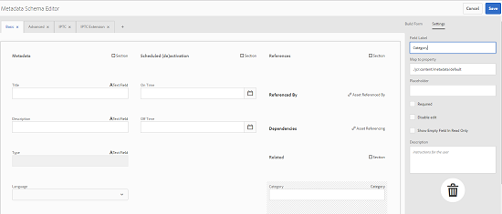
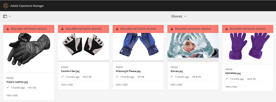

# Schemi metadati {#metadata-schemas}

In [!DNL Experience Manager Assets]uno schema di metadati definisce il layout della pagina delle proprietà e le proprietà dei metadati visualizzate per le risorse che utilizzano lo schema specifico. Le proprietà dei metadati includono titolo, descrizione, tipi MIME, tag e così via. È possibile utilizzare l&#39;editor Moduli schema metadati per modificare gli schemi esistenti o aggiungere schemi di metadati personalizzati.

Per visualizzare e modificare la pagina delle proprietà di una risorsa, effettuate le seguenti operazioni:

1. Tocca o fai clic su **[!UICONTROL Visualizza proprietà]** dalle azioni rapide nella sezione delle risorse nella vista a schede.

   

   In alternativa, seleziona una risorsa e tocca o fai clic sull’icona **[!UICONTROL Proprietà]** nella barra degli strumenti.

   

1. Potete modificare le varie proprietà di metadati modificabili nelle schede disponibili. Tuttavia, non è possibile modificare il [!UICONTROL tipo] di risorsa nella scheda [!UICONTROL Base] della pagina delle proprietà.

   

   Per modificare il tipo MIME di una risorsa, utilizzate un modulo schema di metadati personalizzato o modificate un modulo esistente. Per ulteriori informazioni, vedere [Modifica dei moduli](metadata-schemas.md#editing-metadata-schema-forms) dello schema metadati. Se modificate lo schema di metadati per un determinato tipo MIME, il layout della pagina delle proprietà per le risorse con il tipo MIME corrente e tutti i sottotipi di risorse vengono modificati. Ad esempio, modificando uno `jpeg` schema in `default/image` viene modificato solo il layout dei metadati (proprietà risorsa) per le risorse con tipo MIME `IMAGE/JPEG`. Tuttavia, se modificate lo schema predefinito, le modifiche apportate modificheranno il layout dei metadati per tutti i tipi di risorse.

## Moduli schema metadati {#default-metadata-schema-forms}

Per visualizzare un elenco di moduli/modelli, nell&#39; [!DNL Experience Manager] interfaccia passare a **[!UICONTROL Strumenti]** > **[!UICONTROL Risorse]** > Schemi di **[!UICONTROL metadati]**.

[!DNL Experience Manager] fornisce i seguenti modelli di modulo Schema metadati:

| Modelli |  | Descrizione |
|---|---|---|
| [!UICONTROL impostazione predefinita] |  | Modulo schema metadati di base per le risorse. |
|  | I seguenti moduli secondari ereditano le proprietà del modulo [!UICONTROL predefinito] : |  |
|  | [!UICONTROL dm_video] | Modulo schema per video Dynamic Media. |
|  | <ul><li> [!UICONTROL immagine]</li></ul> | Modulo schema per risorse con tipo MIME &quot;image&quot;, ad esempio immagine/jpeg, immagine/png e così via.   Il modulo [!UICONTROL immagine] include i seguenti modelli di modulo figlio: <ul><li> [!UICONTROL jpeg]: Modulo schema per risorse con [!UICONTROL jpeg]di tipo secondario.</li> <li>[!UICONTROL tiff]: Modulo schema per le risorse con sottotipo [!UICONTROL tiff].</li></ul> |
|  | <ul><li> [!UICONTROL applicazione]</li></ul> | Modulo schema per risorse con tipo MIME &quot;application&quot;, ad esempio application/ pdf, application/ zip e così via.  [!UICONTROL pdf]: Modulo schema per risorse con sottotipo pdf. |
|  | <ul><li>[!UICONTROL video]</li></ul> | Modulo schema per risorse con tipo MIME &quot;video&quot;, ad esempio video/avi, video/mp4 e così via. |
| [!UICONTROL collection] |  | Modulo schema per le raccolte. |
| [!UICONTROL contentFragment] |  | Modulo schema per frammenti di contenuto. |
| [!UICONTROL forms] |  | Questo modulo schema si riferisce a [Adobe Experience Manager Forms](/help/forms/home.md). |

>[!NOTE]
>
>Per visualizzare i moduli secondari di un modulo schema, fare clic o toccare il nome del modulo schema.

## Aggiunta di uno schema di metadati {#adding-a-metadata-schema-form}

1. Per aggiungere un modello personalizzato all’elenco, fate clic su **[!UICONTROL Crea]** dalla barra degli strumenti.

   >[!NOTE]
   >
   >I modelli non modificati presentano un’icona a forma di lucchetto. Se personalizzate uno dei modelli, l&#39;icona Blocca prima che il modello scompaia.

1. Nella finestra di dialogo, immettere il titolo del modulo schema e fare clic su **[!UICONTROL Crea]** per completare il processo di creazione del modulo.

   

## Modificare i moduli dello schema di metadati {#editing-metadata-schema-forms}

È possibile modificare un modulo di schema di metadati appena aggiunto o esistente. Il modulo schema metadati include quanto segue:

* Schede
* Elementi del modulo all&#39;interno delle schede.

È possibile mappare/configurare questi elementi del modulo su un campo all’interno di un nodo di metadati nell’archivio CRX.

È possibile aggiungere nuove schede o elementi del modulo al modulo schema di metadati. Le schede e gli elementi del modulo derivati dall&#39;elemento padre sono nello stato bloccato. Non è possibile modificarle a livello di figlio.

1. In the **[!UICONTROL Schema Forms]** page, select the check box before a form and then click **[!UICONTROL Edit]** on the toolbar.

   

1. Nella pagina **[!UICONTROL Editor schema metadati]**, personalizza la pagina delle proprietà della risorsa trascinando uno o più componenti dall’elenco dei tipi di componenti della scheda **[!UICONTROL Genera modulo]** alla scheda **[!UICONTROL Base]**.

   

1. Per configurare un componente, selezionatelo e modificatene le proprietà nella scheda **[!UICONTROL Impostazioni]** .

### Componenti nella scheda Genera modulo {#components-within-the-build-form-tab}

Nella scheda **[!UICONTROL Genera modulo]** sono elencati gli elementi del modulo utilizzati nel modulo schema. La scheda **[!UICONTROL Impostazioni]** fornisce gli attributi di ogni elemento selezionato nella scheda **[!UICONTROL Modulo]** di creazione. Nella tabella seguente sono elencati gli elementi del modulo disponibili nella scheda **[!UICONTROL Genera modulo]** :

| Nome componente | Descrizione |
|---|---|
| [!UICONTROL Intestazione sezione] | Aggiungere un&#39;intestazione di sezione per un elenco di componenti comuni. |
| [!UICONTROL Testo su riga singola] | Aggiungere una proprietà di testo a riga singola. È memorizzato come stringa. |
| [!UICONTROL Testo con più valori] | Aggiungete una proprietà di testo con più valori. È memorizzato come array di stringhe. |
| [!UICONTROL Numero] | Aggiungere un componente numero. |
| [!UICONTROL Data] | Aggiungere un componente data. |
| [!UICONTROL A discesa] | Aggiungere un elenco a discesa. |
| [!UICONTROL Tag standard] | Aggiungi un tag. |
| [!UICONTROL Tag avanzati] | Aggiungete nuove funzionalità di ricerca aggiungendo automaticamente tag di metadati. |
| [!UICONTROL Campo nascosto] | Aggiungere un campo nascosto. Viene inviato come parametro POST al momento del salvataggio della risorsa. |
| [!UICONTROL Risorsa con riferimento da] | Aggiungete questo componente per visualizzare l’elenco delle risorse a cui fa riferimento la risorsa. |
| [!UICONTROL Risorsa con riferimento a] | Aggiungi per visualizzare un elenco delle risorse che fanno riferimento alla risorsa. |
| [!UICONTROL Riferimenti sui prodotti] | Aggiungi per visualizzare l’elenco dei prodotti collegati alla risorsa. |
| [!UICONTROL Valutazione risorsa] | Aggiungi a opzioni di visualizzazione per la valutazione della risorsa. |
| [!UICONTROL Metadati contestuali] | Aggiungi per controllare la visualizzazione di altre schede di metadati nella pagina delle proprietà delle risorse. |

### Modificare il componente metadati {#editing-the-metadata-component}

Per modificare le proprietà di un componente di metadati sul modulo, fate clic sul componente e modificate tutte o un sottoinsieme delle seguenti proprietà nella scheda **[!UICONTROL Impostazioni]** .

**Etichetta** campo: Nome della proprietà di metadati visualizzata nella pagina delle proprietà della risorsa.

**Mappa su proprietà**: Questa proprietà specifica il percorso/nome relativo al nodo della risorsa in cui viene salvato nell&#39;archivio CRX. Inizia con `./` perché indica che il percorso si trova sotto il nodo della risorsa.

Di seguito sono riportati i valori validi per questa proprietà:

* `./jcr:content/metadata/dc:title`: memorizza il valore come proprietà nel nodo di metadati della risorsa `dc:title`.

* `./jcr:created`: Visualizza la proprietà JCR nel nodo della risorsa. Se configuri queste proprietà come View Properties (Visualizza proprietà), è consigliabile contrassegnarle con l’opzione Disattiva modifica, in quanto sono protette. Otherwise, the error [!UICONTROL Asset(s) failed to modify] results when you save the asset&#39;s properties.

Per garantire che il componente venga visualizzato correttamente nel modulo dello schema di metadati, il percorso della proprietà non deve includere spazi.

**Segnaposto**: Utilizzare questa proprietà per specificare il testo segnaposto relativo alla proprietà metadata.

**Obbligatorio**: Utilizzare questa proprietà per contrassegnare una proprietà di metadati come obbligatoria nella pagina delle proprietà.

**Disattiva modifica**: Utilizzare questa proprietà per rendere non modificabile una proprietà di metadati nella pagina delle proprietà.

**Mostra campo vuoto in sola** lettura: Contrassegnate questa proprietà per visualizzare una proprietà di metadati nella pagina delle proprietà anche se non ha alcun valore. Per impostazione predefinita, quando una proprietà di metadati non ha alcun valore, non viene elencata nella pagina delle proprietà.

**Mostra elenco ordinato**: Utilizzare questa proprietà per visualizzare un elenco ordinato di scelte

**Scelte**: Utilizzare questa proprietà per specificare le scelte in un elenco

**Descrizione** : Utilizzate questa proprietà per aggiungere una breve descrizione per il componente di metadati.

**Classe**: Classe oggetto a cui è associata la proprietà.

**Icona** Elimina Fare clic su questa icona per eliminare un componente dal modulo schema.

>[!NOTE]
>
>Il componente Campo nascosto non include questi attributi. ma include proprietà quali Nome, Valore, Etichetta campo e Descrizione. I valori per il componente Campo nascosto vengono inviati come parametro POST ogni volta che la risorsa viene salvata. Non viene salvato come metadati per la risorsa.

Se selezioni l’opzione **[!UICONTROL Obbligatorio]**, puoi cercare le risorse per le quali mancano i metadati obbligatori. Dal pannello **[!UICONTROL Filtri]**, espandi il predicato **[!UICONTROL Convalida metadati]** e seleziona l’opzione **[!UICONTROL Non valido]**. Nei risultati della ricerca vengono visualizzate le risorse per le quali mancano i metadati obbligatori, che sono stati configurati dal modulo schema.

Se aggiungete il componente Metadati contestuali a qualsiasi scheda di un modulo dello schema, il componente viene visualizzato come un elenco nella pagina delle proprietà delle risorse a cui è applicato lo schema specifico. L’elenco include tutte le altre schede eccetto la scheda a cui è stato applicato il componente Metadati contestuali. Attualmente, questa funzione fornisce funzionalità di base per controllare la visualizzazione dei metadati in base al contesto.

Per includere una scheda qualsiasi nella pagina delle proprietà, oltre alla scheda in cui è applicato il componente Metadati contestuali, selezionare la scheda dall&#39;elenco. La scheda viene aggiunta alla pagina delle proprietà.

### Specificare le proprietà nel file JSON {#specifying-properties-in-json-file}

Invece di specificare le proprietà delle opzioni nella scheda **[!UICONTROL Impostazioni]**, puoi definire le opzioni in un file JSON, specificando le coppie chiave-valore corrispondenti. Nel campo **[!UICONTROL Percorso JSON]**, specifica il percorso del file JSON.

### Aggiunta o eliminazione di una scheda nel modulo schema {#adding-deleting-a-tab-in-the-schema-form}

L’editor dello schema consente di aggiungere o eliminare una scheda. Per impostazione predefinita, il modulo schema predefinito include le schede **[!UICONTROL Base]**, **[!UICONTROL Avanzate]**, **[!UICONTROL IPTC]** ed **[!UICONTROL Estensione IPTC]**.

Fare clic `+` per aggiungere una nuova scheda a un modulo schema. Per impostazione predefinita, la nuova scheda ha il nome `Unnamed-1`. Potete modificare il nome dalla scheda **[!UICONTROL Impostazioni]** . Fare clic `X` per eliminare una scheda.

## Eliminazione di moduli schema metadati {#deleting-metadata-schema-forms}

AEM consente di eliminare solo i moduli schema personalizzati. Non consente di eliminare i moduli/modelli di schema predefiniti. Tuttavia, è possibile eliminare qualsiasi modifica personalizzata in questi moduli.

Per eliminare un modulo, selezionarlo e fare clic sull&#39;icona **[!UICONTROL Elimina]** .

>[!NOTE]
>
>Dopo aver eliminato le modifiche personalizzate a un modulo predefinito, l&#39;icona a forma di lucchetto viene nuovamente visualizzata nell&#39;interfaccia Schema metadati per indicare che il modulo è stato ripristinato allo stato predefinito.

>[!NOTE]
>
>Non è possibile eliminare i moduli di schema di metadati out-of-the-box in AEM Assets.

## Moduli schema per tipi MIME {#schema-forms-for-mime-types}

I AEM Assets forniscono moduli predefiniti per vari tipi MIME. Tuttavia, è possibile aggiungere moduli personalizzati per risorse di vari tipi MIME.

### Aggiunta di nuovi moduli per i tipi MIME {#adding-new-forms-for-mime-types}

Crea un nuovo modulo con il tipo appropriato. For example, to add a new template for the `image/png` subtype, create the form under the `image` forms. Il titolo del modulo schema è il nome del sottotipo. In this case, the title is `png`.

### Utilizzare un modello di schema esistente per vari tipi MIME {#using-an-existing-schema-template-for-various-mime-types}

È possibile utilizzare un modello esistente per un tipo MIME diverso. Ad esempio, utilizzare il `image/jpeg` modulo per le risorse di tipo MIME `image/png`.

In questo caso, create un nuovo nodo `/etc/dam/metadataeditor/mimetypemappings` nell&#39;archivio CRX. Specificare un nome per il nodo e definire le seguenti proprietà:

| Nome | Descrizione | Tipo | Valore |
|---|---|---|---|
| `exposedmimetype` | Nome del modulo esistente da mappare | `String` | `image/jpeg` |
| `mimetypes` | Elenco di tipi MIME che utilizzano il modulo definito nell&#39; `exposedmimetype` attributo | `String` | `image/png` |

I AEM Assets mappano i seguenti tipi MIME e moduli di schema:

| Modulo schema | Tipi MIME |
|---|---|
| image/jpeg | image/pjpeg |
| image/tiff | image/x-tiff |
| application/pdf | application/postscript |
| application/x-ImageSet | Multipart/Related; type=application/x-ImageSet |
| application/x-SpinSet | Multipart/Related; type=application/x-SpinSet |
| application/x-MixedMediaSet | Multipart/Related; type=application/x-MixedMediaSet |
| video/quicktime | video/x-quicktime |
| video/mpeg4 | video/mp4 |
| video/avi | video/avi, video/msvideo, video/x-msvideo |
| video/wmv | video/x-ms-wmv |
| video/flv | video/x-flv |

## Come concedere l’accesso agli schemi di metadati {#granting-access-to-metadata-schemas}

La funzione dello schema di metadati è disponibile solo per gli amministratori. Tuttavia, gli amministratori possono fornire l’accesso agli utenti non amministratori fornendo le autorizzazioni **[!UICONTROL Crea]**, **[!UICONTROL Modifica]** ed **[!UICONTROL Elimina]** sulla `/conf` cartella.

## Applicare metadati specifici per le cartelle {#applying-folder-specific-metadata}

AEM Assets consente di definire una variante di uno schema di metadati e applicarlo a una cartella specifica.

Ad esempio, potete definire una variante dello schema di metadati predefinito e applicarlo a una cartella. Quando applicate lo schema modificato, questo sostituisce lo schema di metadati predefinito originale applicato alle risorse all&#39;interno della cartella.

Solo le risorse caricate nella cartella a cui è applicato lo schema saranno conformi ai metadati modificati definiti nello schema di metadati della variante.

Le risorse in altre cartelle a cui è applicato lo schema originale continuano a essere conformi ai metadati definiti nello schema originale.

L’ereditarietà dei metadati per risorse si basa sullo schema applicato alla cartella di primo livello nella gerarchia. In altre parole, se una cartella non contiene sottocartelle, le risorse all’interno della cartella ereditano i metadati dallo schema applicato alla cartella.

Se la cartella dispone di una sottocartella, le risorse all’interno della sottocartella ereditano i metadati dallo schema applicato a livello di sottocartella se viene applicato uno schema diverso a livello di sottocartella. Tuttavia, se a livello di sottocartella non viene applicato alcuno schema o lo stesso schema, le risorse della sottocartella ereditano i metadati dallo schema applicato a livello di cartella principale.

1. Fai clic sul logo AEM, quindi seleziona **[!UICONTROL Strumenti > Risorse > Schemi di metadati]**. Viene visualizzata la pagina **[!UICONTROL Moduli schema metadati]**.
1. Selezionare la casella di controllo prima di un modulo, ad esempio il modulo di metadati predefinito, quindi fare clic o toccare l&#39;icona **[!UICONTROL Copia]** e salvarlo come modulo personalizzato. Specificare un nome personalizzato per il modulo, ad esempio `my_default`. In alternativa, è possibile creare un modulo personalizzato.

   

1. Nella pagina Moduli **[!UICONTROL schema]** metadati, selezionare il `my_default` modulo, quindi fare clic su **[!UICONTROL Modifica]**.

1. Nella pagina Editor **[!UICONTROL schema]** metadati, aggiungere un campo di testo al modulo schema. Ad esempio, aggiungere un campo con l&#39;etichetta **[!UICONTROL Categoria]**.

   

1. Fai clic su **[!UICONTROL Salva]**. Il modulo modificato è elencato nella pagina Moduli schema **[!UICONTROL metadati]** .
1. Toccate o fate clic su **[!UICONTROL Applica alle cartelle]** nella barra degli strumenti per applicare i metadati personalizzati a una cartella.

   

1. Selezionare la cartella in cui applicare lo schema modificato, quindi fare clic o toccare **[!UICONTROL Applica]**.

   

1. Se alla cartella è applicato un altro schema di metadati, viene visualizzato un messaggio di avviso che informa che lo schema di metadati esistente sta per essere sovrascritto. Fate clic su **[!UICONTROL Sovrascrivi]**.
1. Fate clic su **[!UICONTROL OK]** per chiudere il messaggio di riuscita.
1. Andate alla cartella a cui avete applicato lo schema di metadati modificato.

## Definire i metadati obbligatori {#defining-mandatory-metadata}

Potete definire i campi obbligatori a livello di cartella, che vengono applicati alle risorse caricate nella cartella. Se caricate risorse con metadati mancanti per i campi obbligatori definiti in precedenza, sulle risorse nella vista Scheda viene visualizzata un’indicazione visiva dei metadati mancanti.

>[!NOTE]
>
>Un campo di metadati può essere definito come obbligatorio in base al valore di un altro campo. Nella vista Schede, AEM non visualizza il messaggio di avviso relativo ai metadati mancanti per tali campi di metadati obbligatori.

1. Fai clic sul logo AEM, quindi seleziona **[!UICONTROL Strumenti > Risorse > Schemi di metadati]**. Viene visualizzata la pagina **[!UICONTROL Moduli schema metadati]**.
1. Salvare il modulo di metadati predefinito come modulo personalizzato. Ad esempio, salvatelo con nome `my_default`.

   

1. Modificare il modulo personalizzato. Aggiungere un campo obbligatorio. Ad esempio, aggiungere un campo **Categoria** e rendere il campo obbligatorio.

   

1. Fai clic su **[!UICONTROL Salva]**. Il modulo modificato è elencato nella pagina Moduli schema **[!UICONTROL metadati]** . Per applicare i metadati personalizzati a una cartella, selezionate il modulo e toccate o fate clic su **[!UICONTROL Applica alle cartelle]** nella barra degli strumenti.

1. Individuate la cartella e caricate alcune risorse con metadati mancanti per il campo obbligatorio aggiunto al modulo personalizzato. Nella vista a schede delle risorse viene visualizzato un messaggio per i metadati mancanti per il campo obbligatorio.

   

1. (Facoltativo) Accesso `http://[server]:[port]/system/console/components/`. Configura e abilita `com.day.cq.dam.core.impl.MissingMetadataNotificationJob` il componente disabilitato per impostazione predefinita. Impostate la frequenza con cui AEM verifica la validità dei metadati sulle risorse.
Questa configurazione aggiunge una proprietà `hasValidMetadata` a jcr:content delle risorse. Con questa proprietà, AEM può filtrare i risultati in una ricerca.

>[!NOTE]
>
>Se una risorsa viene aggiunta dopo il controllo pianificato, non viene segnalata `hasValidMetadata` fino al controllo pianificato successivo. Le risorse non vengono visualizzate nei risultati di ricerca intermedi.

>[!Caution]
>
>I controlli di convalida dei metadati richiedono molte risorse e possono avere un impatto sulle prestazioni del sistema. Pianificare i controlli di conseguenza. Se la distribuzione AEM presenta problemi di prestazioni, provate a disattivare questo processo.
