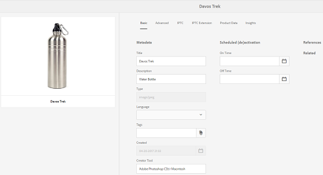
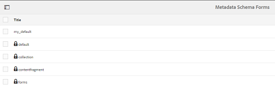

# Schemi metadati {#metadata-schemas}

In [!DNL Experience Manager Assets], uno schema di metadati definisce il layout della pagina delle proprietà e le proprietà dei metadati visualizzate per le risorse che utilizzano lo schema specifico. Le proprietà dei metadati includono titolo, descrizione, tipi MIME, tag e così via. Puoi utilizzare l’editor Forms per lo schema metadati per modificare gli schemi esistenti o aggiungere schemi di metadati personalizzati.

Per visualizzare e modificare la pagina delle proprietà di una risorsa, effettua le seguenti operazioni:

1. Tocca o fai clic su **[!UICONTROL Visualizza proprietà]** dalle azioni rapide sulla tessera della risorsa nella vista a schede.

   

   In alternativa, seleziona una risorsa e tocca o fai clic sull’icona **[!UICONTROL Proprietà]** nella barra degli strumenti.

   

1. Puoi modificare le varie proprietà dei metadati modificabili nelle schede disponibili. Tuttavia, non è possibile modificare la risorsa [!UICONTROL Tipo] nella scheda [!UICONTROL Base] della pagina delle proprietà.

   

   Per modificare il tipo MIME di una risorsa, utilizza un modulo schema metadati personalizzato o modifica un modulo esistente. Per ulteriori informazioni, consulta [Modifica dello schema metadati Forms](metadata-schemas.md#editing-metadata-schema-forms) . Se modifichi lo schema metadati per un determinato tipo MIME, il layout della pagina delle proprietà per le risorse con il tipo MIME corrente e tutti i sottotipi di risorse vengono modificati. Ad esempio, la modifica di uno schema `jpeg` in `default/image` modifica solo il layout di metadati (proprietà delle risorse) per le risorse con tipo MIME `IMAGE/JPEG`. Tuttavia, se modifichi lo schema predefinito, le modifiche apportate modificheranno il layout dei metadati per tutti i tipi di risorse.

## Moduli schema metadati {#default-metadata-schema-forms}

Per visualizzare un elenco di moduli/modelli, nell’interfaccia [!DNL Experience Manager] passa a **[!UICONTROL Strumenti]** > **[!UICONTROL Risorse]** > **[!UICONTROL Schemi di metadati]**.

[!DNL Experience Manager] fornisce i seguenti modelli di modulo schema metadati:

| Modelli |  | Descrizione |
|---|---|---|
| [!UICONTROL impostazione predefinita] |  | Il modulo schema metadati di base per le risorse. |
|  | I seguenti moduli secondari ereditano le proprietà del modulo [!UICONTROL predefinito] : |  |
|  | <ul><li> [!UICONTROL dm_video]</li></ul> | Modulo schema per video Dynamic Media. |
|  | <ul><li> [!UICONTROL immagine]</li></ul> | Modulo schema per le risorse con il tipo MIME &quot;image&quot;, ad esempio image/jpeg, image/png e così via.   L’  immagine presenta i seguenti modelli di modulo figlio: <ul><li> [!UICONTROL jpeg]: Modulo schema per risorse con  [!UICONTROL jpeg] di sottotipo.</li> <li>[!UICONTROL tiff]: Modulo schema per le risorse con sottotipo  [!UICONTROL tiff].</li></ul> |
|  | <ul><li> [!UICONTROL applicazione]</li></ul> | Modulo di schema per le risorse con tipo MIME &quot;application&quot;, ad esempio application/ pdf, application/ zip e così via.  [!UICONTROL pdf]: Modulo schema per risorse con pdf di sottotipo. |
|  | <ul><li>[!UICONTROL video]</li></ul> | Modulo di schema per le risorse con tipo MIME &quot;video&quot;, ad esempio video/avi, video/mp4 e così via. |
| [!UICONTROL collection] |  | Modulo schema per le raccolte. |
| [!UICONTROL contentfragment] |  | Modulo schema per frammenti di contenuto. |
| [!UICONTROL forms] |  | Questo modulo schema si riferisce a [Adobe Experience Manager Forms](/help/forms/home.md). |

>[!NOTE]
>
>Per visualizzare i moduli secondari di un modulo schema, fare clic o toccare il nome del modulo schema.

## Aggiungere un modulo schema metadati {#adding-a-metadata-schema-form}

1. Per aggiungere un modello personalizzato all’elenco, fai clic su **[!UICONTROL Crea]** nella barra degli strumenti.

   >[!NOTE]
   >
   >I modelli non modificati presentano un’icona a forma di lucchetto. Se personalizzate uno dei modelli, l’icona Blocca prima che il modello scompaia.

1. Nella finestra di dialogo, immetti il titolo del modulo schema e fai clic su **[!UICONTROL Crea]** per completare il processo di creazione del modulo.

   

## Modifica dei moduli schema metadati {#editing-metadata-schema-forms}

È possibile modificare un modulo schema metadati nuovo aggiunto o esistente. Il modulo schema metadati include quanto segue:

* Schede
* Elementi modulo all’interno di schede.

Puoi mappare/configurare questi elementi del modulo su un campo all’interno di un nodo di metadati nell’archivio CRX.

È possibile aggiungere nuove schede o nuovi elementi modulo al modulo schema metadati. Le schede e gli elementi del modulo derivati dall&#39;elemento padre sono nello stato bloccato. Non è possibile modificarli a livello di bambino.

1. Nella pagina **[!UICONTROL Forms schema]**, seleziona la casella di controllo prima di un modulo, quindi fai clic su **[!UICONTROL Modifica]** sulla barra degli strumenti.

   

1. Nella pagina **[!UICONTROL Editor schema metadati]**, personalizza la pagina delle proprietà della risorsa trascinando uno o più componenti dall’elenco dei tipi di componenti della scheda **[!UICONTROL Genera modulo]** alla scheda **[!UICONTROL Base]**.

   

1. Per configurare un componente, selezionalo e modificane le proprietà nella scheda **[!UICONTROL Impostazioni]** .

### Componenti nella scheda Genera modulo {#components-within-the-build-form-tab}

La scheda **[!UICONTROL Genera modulo]** elenca gli elementi del modulo utilizzati nel modulo schema. La scheda **[!UICONTROL Impostazioni]** fornisce gli attributi di ogni elemento selezionato nella scheda **[!UICONTROL Genera modulo]** . Nella tabella seguente sono elencati gli elementi del modulo disponibili nella scheda **[!UICONTROL Genera modulo]** :

| Nome componente | Descrizione |
|---|---|
| [!UICONTROL Intestazione sezione] | Aggiungi un’intestazione di sezione per un elenco di componenti comuni. |
| [!UICONTROL Testo su riga singola] | Aggiungi una proprietà di testo a riga singola. Viene memorizzato come stringa. |
| [!UICONTROL Testo con più valori] | Aggiungi una proprietà di testo con più valori. Viene memorizzato come array di stringhe. |
| [!UICONTROL Numero] | Aggiungi un componente numerico. |
| [!UICONTROL Data] | Aggiungi un componente data . |
| [!UICONTROL A discesa] | Aggiungi un elenco a discesa. |
| [!UICONTROL Tag standard] | Aggiungi un tag. |
| [!UICONTROL Tag avanzati] | Aggiungi per migliorare le funzionalità di ricerca aggiungendo automaticamente tag di metadati. |
| [!UICONTROL Campo nascosto] | Aggiungi un campo nascosto. Viene inviato come parametro POST al momento del salvataggio della risorsa. |
| [!UICONTROL Risorsa con riferimento da] | Aggiungi questo componente per visualizzare l’elenco delle risorse a cui fa riferimento la risorsa. |
| [!UICONTROL Risorsa con riferimento a] | Aggiungi per visualizzare un elenco di risorse che fanno riferimento alla risorsa. |
| [!UICONTROL Riferimenti sui prodotti] | Aggiungi per visualizzare l’elenco dei prodotti collegati alla risorsa. |
| [!UICONTROL Valutazione risorsa] | Aggiungi per visualizzare le opzioni di valutazione della risorsa. |
| [!UICONTROL Metadati contestuali] | Aggiungi per controllare la visualizzazione di altre schede di metadati nella pagina delle proprietà delle risorse. |

### Modifica del componente metadati {#editing-the-metadata-component}

Per modificare le proprietà di un componente metadati sul modulo, fai clic sul componente e modifica tutte o un sottoinsieme delle seguenti proprietà nella scheda **[!UICONTROL Impostazioni]** .

**Etichetta** campo: Nome della proprietà di metadati visualizzata nella pagina delle proprietà della risorsa.

**Mappa su proprietà**: Questa proprietà specifica il percorso/nome relativo al nodo della risorsa in cui viene salvato nell&#39;archivio CRX. Inizia con `./` perché indica che il percorso si trova sotto il nodo della risorsa.

Di seguito sono riportati i valori validi per questa proprietà:

* `./jcr:content/metadata/dc:title`: memorizza il valore come proprietà nel nodo di metadati della risorsa `dc:title`.

* `./jcr:created`: Visualizza la proprietà JCR nel nodo della risorsa. Se configuri queste proprietà come View Properties (Visualizza proprietà), è consigliabile contrassegnarle con l’opzione Disattiva modifica, in quanto sono protette. In caso contrario, l&#39;errore [!UICONTROL Risorse non è riuscito a modificare i risultati] quando si salvano le proprietà della risorsa.

Per garantire che il componente sia visualizzato correttamente nel modulo schema metadati, il percorso della proprietà non deve includere spazi.

**Segnaposto**: Utilizzare questa proprietà per specificare il testo segnaposto pertinente relativo alla proprietà metadati.

**Obbligatorio**: Utilizzare questa proprietà per contrassegnare una proprietà di metadati come obbligatoria nella pagina delle proprietà.

**Disattiva modifica**: Utilizzare questa proprietà per rendere non modificabile una proprietà metadati nella pagina delle proprietà.

**Mostra Campo Vuoto In Sola** Lettura: Contrassegna questa proprietà per visualizzare una proprietà di metadati nella pagina delle proprietà anche se non ha valore. Per impostazione predefinita, quando una proprietà di metadati non ha alcun valore, non viene elencata nella pagina delle proprietà.

**Mostra elenco ordinato**: Utilizzare questa proprietà per visualizzare un elenco ordinato di scelte

**Scelte**: Utilizzare questa proprietà per specificare le scelte in un elenco

**Descrizione** : Utilizza questa proprietà per aggiungere una breve descrizione per il componente metadati.

**Classe**: Classe oggetto a cui è associata la proprietà.

**Icona EliminaFai clic su questa icona per eliminare un componente dal modulo schema.** 

>[!NOTE]
>
>Il componente Campo nascosto non include questi attributi. ma include proprietà quali Nome, Valore, Etichetta campo e Descrizione. I valori per il componente Campo nascosto vengono inviati come parametro POST ogni volta che la risorsa viene salvata. Non viene salvato come metadati per la risorsa.

Se selezioni l’opzione **[!UICONTROL Obbligatorio]**, puoi cercare le risorse per le quali mancano i metadati obbligatori. Dal pannello **[!UICONTROL Filtri]**, espandi il predicato **[!UICONTROL Convalida metadati]** e seleziona l’opzione **[!UICONTROL Non valido]**. Nei risultati della ricerca vengono visualizzate le risorse per le quali mancano i metadati obbligatori, che sono stati configurati dal modulo schema.

Se aggiungi il componente Metadati contestuali a una qualsiasi scheda di qualsiasi modulo di schema, il componente viene visualizzato come un elenco nella pagina delle proprietà delle risorse a cui viene applicato lo schema specifico. L’elenco include tutte le altre schede eccetto la scheda a cui è stato applicato il componente Metadati contestuali . Attualmente, questa funzione fornisce funzionalità di base per controllare la visualizzazione dei metadati in base al contesto.

Per includere una scheda nella pagina delle proprietà oltre alla scheda in cui è applicato il componente Metadati contestuali , selezionala dall’elenco. La scheda viene aggiunta alla pagina delle proprietà.

### Specificare le proprietà nel file JSON {#specifying-properties-in-json-file}

Invece di specificare le proprietà delle opzioni nella scheda **[!UICONTROL Impostazioni]**, puoi definire le opzioni in un file JSON, specificando le coppie chiave-valore corrispondenti. Nel campo **[!UICONTROL Percorso JSON]**, specifica il percorso del file JSON.

### Aggiunta o eliminazione di una scheda nel modulo schema {#adding-deleting-a-tab-in-the-schema-form}

L’editor dello schema consente di aggiungere o eliminare una scheda. Per impostazione predefinita, il modulo schema predefinito include le schede **[!UICONTROL Base]**, **[!UICONTROL Avanzate]**, **[!UICONTROL IPTC]** ed **[!UICONTROL Estensione IPTC]**.

Fare clic su `+` per aggiungere una nuova scheda a un modulo schema. Per impostazione predefinita, la nuova scheda ha il nome `Unnamed-1`. Puoi modificare il nome dalla scheda **[!UICONTROL Impostazioni]** . Fai clic su `X` per eliminare una scheda.

## Eliminare i moduli schema metadati {#deleting-metadata-schema-forms}

AEM consente di eliminare solo i moduli schema personalizzati. Non consente di eliminare i moduli/modelli di schema predefiniti. Tuttavia, è possibile eliminare qualsiasi modifica personalizzata in questi moduli.

Per eliminare un modulo, selezionarlo e fare clic sull&#39;icona **[!UICONTROL Elimina]**.

>[!NOTE]
>
>Dopo aver eliminato le modifiche personalizzate a un modulo predefinito, l’icona a forma di lucchetto viene visualizzata nuovamente nell’interfaccia Schema metadati per indicare che il modulo è tornato allo stato predefinito.

>[!NOTE]
>
>Non è possibile eliminare i moduli di schema metadati predefiniti in AEM Assets.

## Moduli schema per tipi MIME {#schema-forms-for-mime-types}

AEM Assets fornisce moduli predefiniti per vari tipi MIME pronti all’uso. Tuttavia, puoi aggiungere moduli personalizzati per risorse di vari tipi MIME.

### Aggiungere nuovi moduli per i tipi MIME {#adding-new-forms-for-mime-types}

Crea un nuovo modulo con il tipo appropriato. Ad esempio, per aggiungere un nuovo modello per il sottotipo `image/png`, creare il modulo sotto i moduli `image`. Il titolo del modulo schema è il nome del sottotipo. In questo caso, il titolo è `png`.

### Utilizza un modello di schema esistente per vari tipi MIME {#using-an-existing-schema-template-for-various-mime-types}

Puoi utilizzare un modello esistente per un tipo MIME diverso. Ad esempio, utilizza il modulo `image/jpeg` per le risorse di tipo MIME `image/png`.

In questo caso, crea un nuovo nodo in `/etc/dam/metadataeditor/mimetypemappings` nell’archivio CRX. Specifica un nome per il nodo e definisci le seguenti proprietà:

| Nome | Descrizione | Tipo | Valore |
|---|---|---|---|
| `exposedmimetype` | Nome del modulo esistente da mappare | `String` | `image/jpeg` |
| `mimetypes` | Elenco dei tipi MIME che utilizzano il modulo definito nell’attributo `exposedmimetype` | `String` | `image/png` |

AEM Assets mappa i seguenti tipi MIME e moduli di schema:

| Modulo schema | Tipi MIME |
|---|---|
| image/jpeg | image/pjpeg |
| image/tiff | image/x-tiff |
| application/pdf | application/postscript |
| application/x-ImageSet | Multipart/Related; type=application/x-ImageSet |
| application/x-SpinSet | Multipart/Related; type=application/x-SpinSet |
| application/x-MixedMediaSet | Multipart/Related; type=application/x-MixedMediaSet |
| video/quicktime | video/x-quicktime |
| video/mpeg4 | video/mp4 |
| video/avi | video/avi, video/msvideo, video/x-msvideo |
| video/wmv | video/x-ms-wmv |
| video/flv | video/x-flv |

## Concedere l’accesso agli schemi di metadati {#granting-access-to-metadata-schemas}

La funzione schema metadati è disponibile solo per gli amministratori. Tuttavia, gli amministratori possono fornire l&#39;accesso agli utenti non amministratori fornendo le autorizzazioni **[!UICONTROL Create]**, **[!UICONTROL Modify]** e **[!UICONTROL Delete]** sulla cartella `/conf`.

## Applicare metadati specifici per le cartelle {#applying-folder-specific-metadata}

AEM Assets consente di definire una variante di uno schema di metadati e di applicarlo a una cartella specifica.

Ad esempio, puoi definire una variante dello schema metadati predefinito e applicarlo a una cartella. Quando si applica lo schema modificato, questo sostituisce lo schema metadati predefinito originale applicato alle risorse all’interno della cartella.

Solo le risorse caricate nella cartella a cui viene applicato lo schema saranno conformi ai metadati modificati definiti nello schema dei metadati della variante.

Le risorse in altre cartelle in cui viene applicato lo schema originale continuano a conformarsi ai metadati definiti nello schema originale.

L’ereditarietà dei metadati da parte delle risorse si basa sullo schema applicato alla cartella di primo livello nella gerarchia. In altre parole, se una cartella non contiene sottocartelle, le risorse all’interno della cartella ereditano i metadati dallo schema applicato alla cartella.

Se la cartella dispone di una sottocartella, le risorse all’interno della sottocartella ereditano i metadati dallo schema applicato a livello di sottocartella se viene applicato uno schema diverso a livello di sottocartella. Se tuttavia non viene applicato alcuno schema o lo stesso schema a livello di sottocartella, le risorse della sottocartella ereditano i metadati dallo schema applicato a livello di cartella principale.

1. Fai clic sul logo AEM, quindi seleziona **[!UICONTROL Strumenti > Risorse > Schemi di metadati]**. Viene visualizzata la pagina **[!UICONTROL Moduli schema metadati]**.
1. Selezionare la casella di controllo prima di un modulo, ad esempio il modulo metadati predefinito, quindi fare clic o toccare l&#39;icona **[!UICONTROL Copia]** e salvarlo come modulo personalizzato. Specifica un nome personalizzato per il modulo, ad esempio `my_default`. In alternativa, è possibile creare un modulo personalizzato.

   

1. Nella pagina **[!UICONTROL Forms schema metadati]**, selezionare il modulo `my_default`, quindi fare clic su **[!UICONTROL Modifica]**.

1. Nella pagina **[!UICONTROL Editor schema metadati]** , aggiungi un campo di testo al modulo schema. Ad esempio, aggiungi un campo con l’etichetta **[!UICONTROL Categoria]**.

   

1. Fai clic su **[!UICONTROL Salva]**. Il modulo modificato è elencato nella pagina **[!UICONTROL Forms schema metadati]**.
1. Tocca o fai clic su **[!UICONTROL Applica a cartelle]** nella barra degli strumenti per applicare i metadati personalizzati a una cartella.

   

1. Seleziona la cartella in cui applicare lo schema modificato, quindi tocca o fai clic su **[!UICONTROL Applica]**.

   

1. Se alla cartella è stato applicato lo schema di altri metadati, viene visualizzato un messaggio di avviso che informa che lo schema di metadati esistente sta per essere sovrascritto. Fare clic su **[!UICONTROL Sovrascrivi]**.
1. Fai clic su **[!UICONTROL OK]** per chiudere il messaggio di successo.
1. Passa alla cartella alla quale hai applicato lo schema di metadati modificato.

## Definire i metadati obbligatori {#defining-mandatory-metadata}

Puoi definire campi obbligatori a livello di cartella, che vengono applicati alle risorse caricate nella cartella. Se carichi risorse con metadati mancanti per i campi obbligatori definiti in precedenza, nella vista Scheda viene visualizzata un’indicazione visiva dei metadati mancanti sulle risorse.

>[!NOTE]
>
>Un campo di metadati può essere definito obbligatorio in base al valore di un altro campo. Nella vista Schede, AEM non visualizza il messaggio di avviso relativo ai metadati mancanti per tali campi di metadati obbligatori.

1. Fai clic sul logo AEM, quindi seleziona **[!UICONTROL Strumenti > Risorse > Schemi di metadati]**. Viene visualizzata la pagina **[!UICONTROL Moduli schema metadati]**.
1. Salvare il modulo metadati predefinito come modulo personalizzato. Ad esempio, salvarlo come `my_default`.

   

1. Modificare il modulo personalizzato. Aggiungi un campo obbligatorio. Ad esempio, aggiungi un campo **Categoria** e rendi obbligatorio il campo.

   

1. Fai clic su **[!UICONTROL Salva]**. Il modulo modificato è elencato nella pagina **[!UICONTROL Forms schema metadati]**. Per applicare i metadati personalizzati a una cartella, seleziona il modulo e tocca o fai clic su **[!UICONTROL Applica a cartelle]** nella barra degli strumenti.

1. Passa alla cartella e carica alcune risorse con metadati mancanti per il campo obbligatorio aggiunto al modulo personalizzato. Nella vista a schede delle risorse viene visualizzato un messaggio per i metadati mancanti del campo obbligatorio.

   

1. (Facoltativo) Accedi a `http://[server]:[port]/system/console/components/`. Configura e attiva il componente `com.day.cq.dam.core.impl.MissingMetadataNotificationJob` disattivato per impostazione predefinita. Imposta una frequenza con cui AEM verifica la validità dei metadati sulle risorse.
Questa configurazione aggiunge una proprietà `hasValidMetadata` a jcr:content delle risorse. Utilizzando questa proprietà, AEM filtrare i risultati in una ricerca.

>[!NOTE]
>
>Se una risorsa viene aggiunta dopo il controllo pianificato, la risorsa non viene contrassegnata con `hasValidMetadata` fino al controllo pianificato successivo. Le risorse non vengono visualizzate nei risultati di ricerca intermedi.

>[!CAUTION]
>
>I controlli di convalida dei metadati richiedono molte risorse e possono influire sulle prestazioni del sistema. Pianifica i controlli di conseguenza. Se la distribuzione AEM presenta problemi di prestazioni, prova a disabilitare questo processo.
