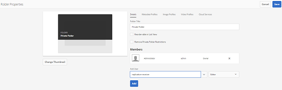

# Condivisione di cartelle private {#private-folder-sharing}

Potete creare una cartella privata nell’interfaccia utente di Adobe Experience Manager (AEM) Assets, disponibile esclusivamente per voi. Potete condividere questa cartella privata con altri utenti e assegnare loro vari privilegi. In base al livello di privilegio assegnato, gli utenti possono eseguire varie attività sulla cartella, ad esempio visualizzare le risorse all’interno della cartella o modificarle.

1. Nella console Risorse, toccate o fate clic su **[!UICONTROL Crea]** nella barra degli strumenti, quindi scegliete **[!UICONTROL Cartella]** dal menu.

   

1. Nella finestra di dialogo **[!UICONTROL Aggiungi cartella]** , immettete un titolo e un nome (facoltativi) per la cartella e selezionate **[!UICONTROL Privato]**.

   

1. Tocca o fai clic su **[!UICONTROL Crea]**. Nell’interfaccia utente viene creata una cartella privata.

   

1. Per condividere la cartella con altri utenti e assegnare loro i privilegi, seleziona la cartella e tocca o fai clic sull’icona **[!UICONTROL Proprietà]** nella barra degli strumenti.

   

   >[!NOTE]
   >
   >La cartella non è visibile ad altri utenti finché non la condividete.

1. In the Folder Prperties page, select a user from the **[!UICONTROL Add User]** list, assign a role to the user on your private folder, and click **[!UICONTROL Add]**.

   

   >[!NOTE]
   >
   >Potete assegnare diversi ruoli, ad esempio Editor, Proprietario o Visualizzatore all’utente con il quale condividete la cartella. Se assegnate un ruolo Proprietario all’utente, quest’ultimo dispone dei privilegi di Modifica sulla cartella. Inoltre, l’utente può condividere la cartella con altri utenti. Se assegnate un ruolo Editor, l’utente può modificare le risorse presenti nella cartella privata. Se assegnate un ruolo Visualizzatore, l’utente può visualizzare solo le risorse presenti nella propria cartella privata.

1. Fai clic su **[!UICONTROL Salva]**. A seconda del ruolo assegnato, all’utente viene assegnato un set di privilegi nella cartella privata quando accede a  AEM Assets.
1. Fate clic su **[!UICONTROL OK]** per chiudere il messaggio di conferma.
1. L’utente con il quale condividete la cartella riceve una notifica di condivisione. Accedete a  AEM Assets con le credenziali dell&#39;utente per visualizzare la notifica.

   

1. Toccate o fate clic sull&#39;icona Notifica per aprire l&#39;elenco delle notifiche.

   

1. Toccate o fate clic sulla voce relativa alla cartella privata condivisa dall’amministratore per aprire la cartella.

>[!NOTE]
>
>Per creare una cartella privata, è necessario disporre delle autorizzazioni di lettura e modifica ACL per la cartella principale in cui si desidera creare una cartella privata. Se non siete un amministratore, queste autorizzazioni non sono abilitate per impostazione predefinita su */content/dam*. In questo caso, ottenete prima queste autorizzazioni per l’ID utente o il gruppo prima di tentare di creare cartelle private o visualizzare le impostazioni delle cartelle.

