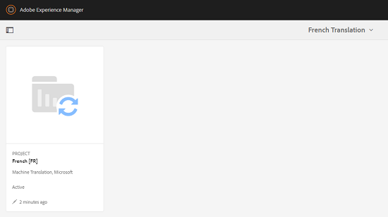

# Risorse correlate {#related-assets}

Risorse Adobe Experience Manager (AEM) consente di correlare manualmente le risorse in base alle esigenze dell’organizzazione mediante la funzione Risorse correlate. Ad esempio, potete collegare un file di licenza a una risorsa o un&#39;immagine/video su un argomento simile. Potete correlare le risorse che condividono alcuni attributi comuni. Potete anche usare la funzione per creare relazioni sorgente/derivate tra le risorse. Ad esempio, se si dispone di un file PDF generato da un file INDD, è possibile collegare il file PDF al relativo file INDD di origine.

In questo modo, potete condividere un file a bassa risoluzione (ad esempio PDF/JPG) con fornitori/agenzie e rendere disponibile il file ad alta risoluzione (ad esempio INDD) solo su richiesta.

## Relazione delle risorse {#relating-assets}

1. Dall’interfaccia Risorse, aprite la pagina delle proprietà di una risorsa da correlare.

   

   In alternativa, selezionate la risorsa dalla vista a elenco.

   

   Potete anche selezionare la risorsa da una raccolta.

   

1. Per mettere in relazione un&#39;altra risorsa con la risorsa selezionata, toccate o fate clic sull&#39;icona **[!UICONTROL Relate]** nella barra degli strumenti.

   

1. Effettua una delle operazioni seguenti:

   * Per correlare il file di origine della risorsa, selezionate **[!UICONTROL Origine]** dall&#39;elenco.
   * Per correlare un file derivato, selezionare **[!UICONTROL Derivato]** dall&#39;elenco.
   * Per creare una relazione bidirezionale tra le risorse, selezionate **[!UICONTROL Altro]** dall’elenco.

   

1. Dalla schermata **[!UICONTROL Seleziona risorsa]**, andate alla posizione della risorsa da correlare e selezionatela.

   

1. Tocca o fai clic sull&#39;icona **[!UICONTROL Conferma]**.
1. Toccate o fate clic su **[!UICONTROL OK]** per chiudere la finestra di dialogo. A seconda della relazione scelta nel passaggio 3, la risorsa correlata è elencata in una categoria appropriata nella sezione **[!UICONTROL Correlati]**. Ad esempio, se la risorsa correlata è il file di origine della risorsa corrente, viene elencata in **[!UICONTROL Source]**.

   

1. Per scollegare una risorsa, toccate o fate clic sull&#39;icona **[!UICONTROL Annulla relazione]** nella barra degli strumenti.

   

1. Selezionate le risorse da scollegare dalla finestra di dialogo **[!UICONTROL Rimuovi relazioni]**, quindi toccate o fate clic su **[!UICONTROL Annulla relazione]**.

   

1. Toccate o fate clic su **[!UICONTROL OK]** per chiudere la finestra di dialogo. Le risorse per le quali hai rimosso le relazioni vengono eliminate dall&#39;elenco delle risorse correlate nella sezione **[!UICONTROL Correlati]**.

## Traduzione di risorse correlate {#translating-related-assets}

La creazione di relazioni sorgente/derivate tra risorse mediante la funzione Risorse correlate è utile anche nei flussi di lavoro di traduzione. Quando eseguite un flusso di lavoro di traduzione su una risorsa derivata,  AEM Assets recupera automaticamente tutte le risorse a cui fa riferimento il file sorgente e le include per la traduzione. In questo modo, la risorsa a cui fa riferimento la risorsa di origine viene convertita insieme alle risorse sorgente e derivate. Ad esempio, in uno scenario in cui la copia in lingua inglese include una risorsa derivata e il relativo file di origine come mostrato.

Se il file di origine è correlato a un’altra risorsa,  AEM Assets recupera la risorsa di riferimento e la include per la conversione.

1. Traducete le risorse presenti nella cartella di origine in una lingua di destinazione seguendo la procedura indicata in [Crea un nuovo progetto di traduzione](translation-projects.md#create-a-new-translation-project). Ad esempio, in questo caso, potete tradurre le risorse in francese.
1. Dalla pagina Progetti, aprite la cartella di traduzione.

   

1. Toccate o fate clic sulla sezione del progetto per aprire la pagina dei dettagli.

   

1. Toccate o fate clic sulle ellissi sotto la scheda Processo di traduzione per visualizzare lo stato della traduzione.

   

1. Selezionate la risorsa, quindi toccate o fate clic su **[!UICONTROL Mostra in risorse]** nella barra degli strumenti per visualizzare lo stato di conversione della risorsa.

   

1. Per verificare se le risorse correlate all’origine sono state tradotte, toccate o fate clic sulla risorsa sorgente.

   

1. Selezionate la risorsa correlata all&#39;origine, quindi toccate o fate clic su **[!UICONTROL Mostra in risorse]**. Viene visualizzata la risorsa correlata convertita.

   
