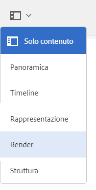

# Rendering delle risorse 3D {#rendering-d-assets}

È possibile eseguire il rendering delle risorse 3D che sono state manipolate e salvate in AEM per creare immagini 2D da utilizzare sulle pagine di contenuto web.

Vedi [Modifica del contenuto della pagina](/help/sites-authoring/qg-page-authoring.md#editing-your-page-content).

## Considerazioni sulle prestazioni durante il rendering di risorse 3D {#performance-considerations-when-rendering-d-assets}

Il rendering di contenuti 3D consuma notevoli risorse del server, come la CPU e la memoria. In tal caso, il rendering spesso può richiedere una notevole quantità di tempo. I tempi di rendering variano in modo significativo a seconda di vari fattori, oltre alle ovvie dimensioni del modello e all&#39;hardware del server:

* **Selezione del motore di rendering**.

   Il modulo di rendering Rapid Refine™ predefinito in AEM 3D offre una certa qualità per tempi di rendering più rapidi. Eppure, produce risultati di alta qualità per molte applicazioni. I motori di rendering forniti tramite applicazioni di terze parti (ad esempio V-Ray™ o NVIDIA® Mental Ray® distribuito in Autodesk® Maya® o Autodesk® 3ds Max®) sono ampiamente configurabili e il compromesso tra prestazioni e qualità viene effettuato al momento della progettazione dell’area di visualizzazione.

* **IBL rispetto all&#39;illuminazione tradizionale**.

   Anche se questo fattore è di minore importanza per il modulo di rendering Rapid Refine predefinito, i moduli di rendering di terze parti come Mental Ray sono sostanzialmente più lenti con le aree di visualizzazione IBL, rispetto a quando si usano luci puntiformi o faretti tradizionali.

Il modulo di rendering Rapid Refine richiede in genere alcuni minuti per il rendering di immagini più grandi. Tuttavia, i moduli di rendering di terze parti spesso impiegano molti minuti, anche ore, se configurati per la massima qualità.

I lavori di conversione, elaborazione e rendering vengono messi in coda sul server in base alle necessità, per evitare sovraccarichi. Il messaggio &quot;In attesa del rendering...&quot; viene visualizzato sulle risorse caricate di recente nella Vista a schede. Questo stato indica che altri lavori di elaborazione o rendering devono terminare prima che il lavoro di rendering corrente possa iniziare.

>[!NOTE]
>
>Una risorsa 3D viene sempre renderizzata con i materiali originali, indipendentemente da quali materiali siano mostrati nella visualizzazione interattiva AEM 3D. Questa funzionalità si applica sia al modulo di rendering Rapid Refine integrato che a tutti i moduli di rendering nativi.

**Per renderizzare le risorse 3D**:

1. Apri una risorsa 3D per la visualizzazione.

   Vedi [Visualizzazione delle risorse 3D](viewing-3d-assets.md).

1. Da Adobe Experience Manager, nella pagina di **[!UICONTROL Navigazione]**, tocca **[!UICONTROL Asset]**.
1. Near the upper-right corner of the page, from the **[!UICONTROL View]** drop-down list, tap **[!UICONTROL Card View]**.
1. Passa all’oggetto 3D che desideri renderizzare.
1. Tocca la scheda dell&#39;oggetto 3D per aprirla nella pagina dei dettagli della risorsa.
1. Nell&#39;angolo in alto a sinistra della pagina, tocca il menu a discesa, poi seleziona **[!UICONTROL Rendering]**.

   

1. Near the upper-right corner of the asset details page, tap the **[!UICONTROL Stage Selector]** icon (spotlight), then select a stage name with the background and lighting that you want to apply to the 3D object.

   Vedi [Utilizzo delle aree di visualizzazione in AEM 3D](about-the-use-of-stages-in-aem-3d.md).

   

   **[!UICONTROL Icona Selettore area di visualizzazione]**

1. On the **[!UICONTROL Render]** drop-down list on the left side of the asset details page, select a renderer.

   Il modulo di rendering predefinito **Rapid Refine** è sempre disponibile. Se l’area di visualizzazione selezionata è un formato nativo, nell&#39;elenco viene reso disponibile anche il corrispondente modulo di rendering di terze parti.

   Vedi [Utilizzo delle aree di visualizzazione in AEM 3D](about-the-use-of-stages-in-aem-3d.md).

1. Effettua le seguenti operazioni:

   * In the **[!UICONTROL Width]** and **[!UICONTROL Height]** fields, enter the pixel width and height that you want your image rendered.
   * In the **[!UICONTROL Image Name]** field, enter the name of the rendered image.
   * In the **[!UICONTROL Export Path]** field, enter the path where you want the rendered image stored. Or, tap the **[!UICONTROL Browse]** icon and navigate to a location.
   * (Optional) Select or deselect the **[!UICONTROL Overwrite existing imag]e **check box.

1. Near the upper-right corner of the asset details page, tap the **[!UICONTROL Camera Selector]** icon. Seleziona una visualizzazione della videocamera da applicare all&#39;immagine renderizzata.

   Le barre sinistra e destra o le barre superiore e inferiore sono un indicatore visivo di quali parti della visualizzazione saranno renderizzate. Quando la videocamera viene fornita dall’area di visualizzazione selezionata, è possibile selezionare una videocamera predefinita.

   

   **[!UICONTROL Icona Selettore videocamera]**

1. Tocca **[!UICONTROL Avvia rendering]** per iniziare il processo di rendering.

   Viene visualizzato temporaneamente un messaggio per indicare che il rendering è stato avviato. Per comodità, questo messaggio include anche un collegamento alla cartella di output selezionata in modo da potervi accedere direttamente.

