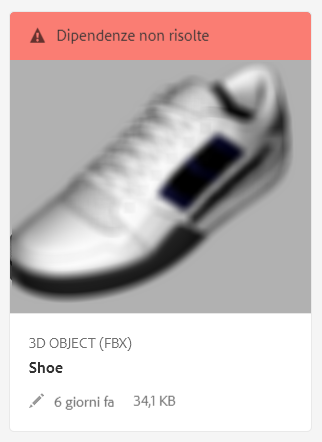
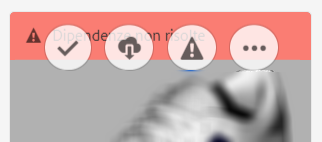

# Risoluzione delle dipendenze dei file {#resolving-file-dependencies}

Le dipendenze principali dei file del modello 3D, come i file di mappe texture, vengono automaticamente risolte quando possibile. Questa funzionalità viene eseguita effettuando una ricerca AEM nelle cartelle Risorse vicine per trovare file con gli stessi nomi presenti nel file 3D. If one or more dependencies are unresolvable during the Creating preview processing stage, the asset&#39;s card displays the following red banner message in the **[!UICONTROL Card View]**:

**Per risolvere le dipendenze dei file**:

1. In the **[!UICONTROL Card View]**, hover the pointer over the **[!UICONTROL Unresolved Dependencies]** banner message on the card, then tap the **[!UICONTROL Exclamation Point]** icon.

   

1. On the **[!UICONTROL Metadata Properties]** page, tap the **[!UICONTROL Dependencies]** tab.

   The files that AEM could not auto-resolve are listed under the **[!UICONTROL Original Paths]** column, in red.

1. Esegui una o più delle seguenti operazioni:

   * **Individua e seleziona le dipendenze**. (Questa opzione presuppone che siano già stati caricati i file di dipendenza.

      1. Tap the **[!UICONTROL File Browse]** icon to the left of the red path.
      1. On the **[!UICONTROL Select Content]** page, navigate to the missing file, then tap on the file&#39;s card to select it.
      1. In the upper-left corner of the **[!UICONTROL Select Content]** page, tap **[!UICONTROL Close]** (X icon) to return to the **[!UICONTROL View Properties]** page.
   * **Carica le dipendenze**. (Questa opzione presuppone che ancora non siano stati caricati i file mancanti.)

      1. Osserva i percorsi e i nomi dei file mancanti.
      1. Vicino all’angolo superiore destro della pagina delle proprietà, tocca **[!UICONTROL Chiudi]**.

   After the files are uploaded return to **[!UICONTROL View Properties > Dependencies]** page. Le risorse appena caricate sono ora correttamente elencate come risorse di riferimento.

   * **Ignora le dipendenze**.

      If a missing dependency is no longer needed, under the **[!UICONTROL Referenced Asset]** column, in the text field to the left of the missing file, type `n/a` so that AEM 3D ignores the file.

1. Near the upper-right corner of the **[!UICONTROL View Properties]** page, tap **[!UICONTROL Save]**.
1. Tocca **[!UICONTROL Chiudi]****[!UICONTROL per tornare alla Vista a schede]**.

   La risorsa viene rielaborata automaticamente con le nuove dipendenze risolte.

