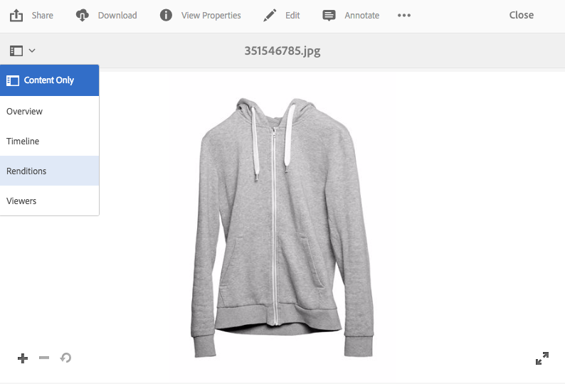

# Distribuzione di immagini ottimizzate per un sito reattivo {#delivering-optimized-images-for-a-responsive-site}

Utilizzate la funzione di codice reattivo quando desiderate condividere il codice per il servizio reattivo con il vostro sviluppatore Web. Potete copiare il codice reattivo (**[!UICONTROL RESS]**) negli Appunti per condividerlo con lo sviluppatore Web.

Questa funzione è utile se il sito Web si trova su un sito Web WCM di terze parti. Tuttavia, se il sito Web è AEM, un server immagini esterno esegue il rendering dell’immagine e la trasmette alla pagina Web.

Consultate anche [Incorporamento del visualizzatore video in una pagina Web.](embed-code.md)

See also [Linking URLs to your Web Application.](linking-urls-to-yourwebapplication.md)

**Per fornire immagini ottimizzate per un sito** reattivo:

1. Andate all&#39;immagine per la quale desiderate fornire il codice reattivo e, nel menu a discesa, toccate **[!UICONTROL Rendering]**.

   

1. Seleziona un predefinito per immagini reattive. Vengono visualizzati i pulsanti **[!UICONTROL URL]** e **[!UICONTROL RESS]**.

   

   >[!NOTE]
   >
   >Per poter rendere disponibili i pulsanti **[!UICONTROL URL]** o **[!UICONTROL RESS]**, la risorsa selezionata *e* il predefinito immagine o il predefinito visualizzatore devono essere pubblicati.
   >
   >Contenuti multimediali dinamici - La modalità ibrida richiede la pubblicazione di predefiniti per immagini; Contenuti multimediali dinamici - La modalità Scene7 pubblica automaticamente i predefiniti per immagini.

1. Toccate **[!UICONTROL RESS]**.

   

1. Nella finestra di dialogo **[!UICONTROL Incorpora immagine]** reattiva, selezionate e copiate il testo del codice reattivo, quindi incollatelo nel sito Web per accedere alla risorsa reattiva.
1. Modificate i punti di interruzione predefiniti nel codice da incorporare in modo che corrispondano a quelli del sito Web reattivo direttamente nel codice. Inoltre, provate le diverse risoluzioni immagine trasmesse in punti di interruzione di pagina diversi.

## Utilizzo di HTTP/2 per distribuire le risorse multimediali dinamiche {#using-http-to-delivery-your-dynamic-media-assets}

HTTP/2 è il nuovo protocollo Web aggiornato che migliora il modo in cui i browser e i server comunicano. Fornisce un trasferimento più rapido delle informazioni e riduce la quantità di potenza di elaborazione necessaria. La distribuzione delle risorse Dynamic Media è supportata mediante HTTP/2, che fornisce una risposta e tempi di caricamento migliori.

Per informazioni dettagliate sull’utilizzo di HTTP/2 con l’account per contenuti multimediali dinamici, consultate Consegna di contenuti  HTTP2.
