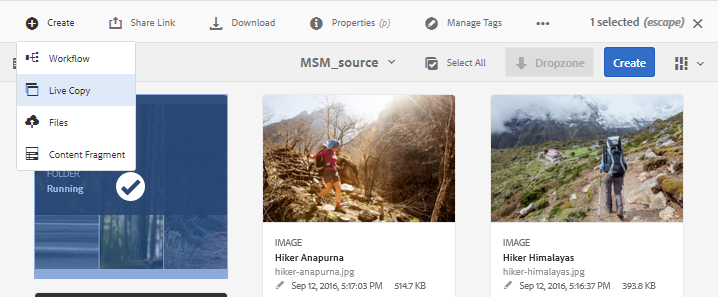
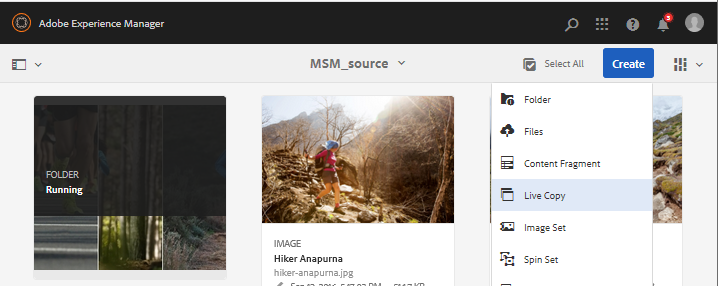

# Riutilizzare le risorse con MSM per le risorse {#reuse-assets-using-msm-for-assets}

La funzionalità Multi Site Manager (MSM) in  Adobe Experience Manager (AEM) consente agli utenti di riutilizzare contenuti creati una volta e riutilizzati in più posizioni Web. Lo stesso è disponibile per le risorse digitali come MSM per la funzionalità Assets. Utilizzando MSM per Assets, puoi:

* Create una volta e quindi copiate le risorse da riutilizzare in altre aree del sito.
* Mantenete più copie in sincronizzazione e aggiornate la copia principale originale una volta per inviare le modifiche alle copie figlio.
* Apportate modifiche locali sospendendo temporaneamente o permanentemente il collegamento tra risorse padre e risorse figlio.

## Prerequisiti {#msm-prerequisites}

Per utilizzare MSM per Assets, installa almeno Service Pack 5. Per ulteriori informazioni, consulta le note sulla versione.
[note sulla](/help/release-notes/assets.md)versione.

## Comprendere i vantaggi e i concetti {#understand-benefits-concepts}

### Come funziona e vantaggi {#how-it-works-the-benefits}

Per comprendere gli scenari di utilizzo per riutilizzare lo stesso contenuto (testo e risorse) in più posizioni Web, consultate [possibili scenari](/help/sites-administering/msm.md#possible-scenarios)MSM. AEM gestisce un collegamento tra la risorsa originale e le relative copie collegate, denominate Live Copy (LC). Il collegamento mantenuto consente di trasferire le modifiche centralizzate a molte copie dal vivo. Questo consente di velocizzare gli aggiornamenti eliminando i limiti di gestione delle copie duplicate. La propagazione delle modifiche è senza errori e centralizzata. Questa funzione consente di aggiornare le copie in diretta selezionate. Gli utenti possono scollegare il collegamento, ossia interrompere l’ereditarietà, e apportare modifiche locali che non verranno sovrascritte al successivo aggiornamento della copia principale e al rollout delle modifiche. Lo scollegamento può essere eseguito per alcuni campi di metadati selezionati o per un’intera risorsa. Consente la flessibilità di aggiornare localmente le risorse che sono state originariamente ereditate da una copia principale.

MSM mantiene una relazione live tra la risorsa di origine e le sue copie in tempo reale in modo che:

* Le modifiche apportate alle risorse sorgente vengono applicate anche alle copie in diretta, ossia le copie in diretta vengono sincronizzate con l’origine.

* Potete aggiornare le copie in diretta sospendendo la relazione in diretta o rimuovendo l&#39;ereditarietà per alcuni campi limitati. Le modifiche all&#39;origine non vengono più applicate alla Live Copy.

### Glossario di MSM per i termini di Risorse {#glossary-msm-for-assets}

* **Origine:** Le risorse o le cartelle originali. Copia principale da cui derivano le copie in diretta.

* **Live Copy:** La copia delle risorse/cartelle sorgente in sincronizzazione con la relativa origine. Le copie in diretta possono essere fonte di ulteriori copie in diretta. Vedere [come creare LCs](#create-live-copy-asset).

* **Ereditarietà:** Un collegamento/riferimento tra una risorsa/cartella Live Copy e la relativa origine utilizzata dal sistema per ricordare dove inviare gli aggiornamenti. L’ereditarietà esiste a un livello granulare per i campi di metadati. L’ereditarietà può essere rimossa per i campi di metadati selettivi, mantenendo al contempo la relazione live tra l’origine e la copia dal vivo.

* **Rollout**: Un&#39;azione che trasmette le modifiche apportate alla sorgente a valle alle sue copie live. È possibile aggiornare una o più copie live in una sola volta mediante l&#39;azione di rollout. Consultate [Rollout](#rollout-action).

* **Configurazione rollout:** Regole che determinano le proprietà da sincronizzare, come e quando. Queste configurazioni vengono applicate durante la creazione di copie live; può essere modificato successivamente; e un figlio può ereditare la configurazione di rollout dalla risorsa principale. Per MSM for Assets, usa solo la configurazione rollout standard. Le altre configurazioni di rollout non sono disponibili per MSM for Assets.

* **Sincronizza:** Un&#39;altra azione, oltre al rollout, che porta la parità tra l&#39;origine e la sua live copy inviando gli aggiornamenti dall&#39;origine alle Live Copy. Viene avviata la sincronizzazione per una particolare Live Copy e l&#39;azione richiama le modifiche dall&#39;origine. Utilizzando questa azione, è possibile aggiornare solo una delle Live Copy. Consultate [Sincronizzazione delle azioni](#about-synchronize-action).

* **Sospendi:** Rimuovete temporaneamente la relazione dal vivo tra una Live Copy e la risorsa o la cartella di origine. È possibile riprendere la relazione. Consultate [Azione](#suspend-and-resume-relationship)di sospensione.

* **Riprendi:** Riprende la relazione live in modo che una Live Copy riceva nuovamente gli aggiornamenti dall&#39;origine. Consulta [Azione](#suspend-and-resume-relationship)di ripresa.

* **Reimposta:** Con l’azione Reimposta, la Live Copy diventa nuovamente una replica dell’origine sovrascrivendo eventuali modifiche locali. Inoltre rimuove le cancellazioni dell’ereditarietà e ripristina l’ereditarietà in tutti i campi di metadati. Per apportare modifiche locali in futuro, è necessario annullare nuovamente l&#39;ereditarietà di campi specifici. Consulta Modifiche [locali a LC](#make-local-modifications-to-live-copy).

* **Scollega:** Rimuovete in modo irreversibile la relazione dal vivo di una risorsa/cartella Live Copy. Dopo l&#39;azione di scollegamento, le copie live non potranno mai ricevere gli aggiornamenti dall&#39;origine e non saranno più una live copy. Vedere [Rimozione della relazione](#remove-live-relationship).

## Creare una Live Copy di una risorsa {#create-live-copy-asset}

Per creare una Live Copy da una o più risorse o cartelle sorgente, effettuate le seguenti operazioni:

* **Metodo 1**: Selezionate le risorse sorgente e fate clic su **[!UICONTROL Crea > Live Copy]** dalla barra degli strumenti nella parte superiore.
* **Metodo 2**: Nell’interfaccia utente di AEM, fai clic su **[!UICONTROL Crea > Live Copy]** nell’angolo in alto a destra dell’interfaccia.

Potete creare copie dal vivo di una risorsa o di una cartella una per volta. Potete creare delle copie dal vivo derivate da una risorsa o da una cartella che è una Live Copy stessa.

I frammenti di contenuto (CF) non sono supportati per il caso di utilizzo. Quando tentano di creare le loro copie dal vivo, i CF vengono copiati come accade senza alcuna relazione. Gli CF copiati sono un&#39;istantanea nel tempo e non si aggiornano quando gli CF originali vengono aggiornati.

Per creare copie live con il primo metodo, attenetevi alla seguente procedura:

1. Selezionate le risorse o le cartelle sorgente. Dalla barra degli strumenti, fate clic su **[!UICONTROL Crea > Live Copy]**.
   
1. Selezionate la risorsa o la cartella sorgente. Fai clic su **[!UICONTROL Avanti]**.
1. Fornire titolo e nome. Le risorse non hanno elementi figlio. Quando create una Live Copy di cartelle, potete scegliere di includere o escludere gli elementi figlio.
1. Selezionate una configurazione di rollout. Fai clic su **[!UICONTROL Crea]**.

Per creare copie live con il secondo metodo, attenetevi alla seguente procedura:

1. Nell’interfaccia di AEM, dall’angolo in alto a destra, fate clic su **[!UICONTROL Crea > Live Copy]**.
   
1. Selezionate la risorsa o la cartella sorgente. Fai clic su **[!UICONTROL Avanti]**.
1. Selezionate la cartella di destinazione. Fai clic su **[!UICONTROL Avanti]**.
1. Fornire titolo e nome. Le risorse non hanno elementi figlio. Quando create una Live Copy di cartelle, potete scegliere di includere o escludere gli elementi figlio.
1. Selezionate una configurazione di rollout. Fai clic su **[!UICONTROL Crea]**.

>[!NOTE]
>
>Quando si sposta un&#39;origine o una Live Copy, le relazioni vengono mantenute. Quando una Live Copy viene eliminata, le relazioni vengono rimosse.

## Visualizzare le varie proprietà e gli stati di origine e live copy {#view-properties-statuses-source-and-lc}

Potete visualizzare le informazioni e gli stati relativi a MSM della Live Copy, ad esempio relazione, sincronizzazione, rollout e molto altro dalle varie aree dell&#39;interfaccia utente di AEM. Per risorse e cartelle funzionano i due metodi seguenti:

* Selezionate la risorsa Live Copy e cercate le informazioni nella relativa pagina **[!UICONTROL Proprietà]** .
* Seleziona la cartella di origine e trova le informazioni dettagliate di ciascuna Live Copy dalla **[!UICONTROL Live Copy Console]**.

>[!TIP]
>
>To check the status of a few separate live copies, use the first method that is see the **[!UICONTROL Properties]** page. To check statuses of many live copies, use the second method, that is, see **[!UICONTROL Relationship Status]** page.

### Informazioni e stato di una Live Copy {#information-status-of-one-lc}

Per verificare le informazioni e gli stati di una risorsa Live Copy o di una cartella, effettuate le seguenti operazioni.

1. Selezionate una risorsa Live Copy o una cartella. Click **[!UICONTROL Properties]** from the toolbar. In alternativa, utilizzare la scelta rapida da tastiera `p`.
1. Click **[!UICONTROL Live Copy]**. Potete controllare il percorso dell&#39;origine, lo stato di sospensione, lo stato di sincronizzazione, l&#39;ultima data di rollout e l&#39;utente che ha eseguito l&#39;ultimo rollout.
   
1. Potete attivare o disattivare se le risorse secondarie prendono in prestito la configurazione della Live Copy.
1. Potete scegliere l&#39;opzione per la Live Copy per ereditare la configurazione di rollout dall&#39;elemento padre o modificare la configurazione.

### Informazioni e stati di tutte le copie in diretta di una cartella {#information-status-of-all-lcs-of-folder}

In AEM è disponibile una console per controllare le statue di tutte le copie in diretta di una cartella sorgente. In questa console viene visualizzato lo stato di tutte le risorse figlio.

1. Selezionate una cartella sorgente. Click **[!UICONTROL Properties]** from the toolbar. In alternativa, utilizzare la scelta rapida da tastiera `p`.
1. Fai clic su **[!UICONTROL Origine Live Copy]**. Per aprire la console, fai clic su **[!UICONTROL Panoramica Live Copy]**. Questo dashboard offre uno stato di primo livello per tutte le risorse figlie.
   
1. Per visualizzare informazioni dettagliate su ciascuna risorsa della cartella Live Copy, seleziona la risorsa in questione, quindi dalla barra degli strumenti fai clic su **[!UICONTROL Stato di relazione]**.
   

>[!TIP]
>
>È possibile visualizzare rapidamente gli stati delle Live Copy di altre cartelle senza dover consultare troppo. È sufficiente cambiare la cartella nell&#39;elenco a comparsa nella parte superiore centrale dell&#39;interfaccia Panoramica **[!UICONTROL di]** Live Copy.

### Azioni rapide dalla barra laterale Riferimenti per la sorgente {#quick-actions-from-references-rail-for-source}

Per una risorsa o una cartella sorgente, potete visualizzare le informazioni seguenti ed effettuare le seguenti operazioni direttamente dalla barra laterale Riferimenti:

* Visualizzare i percorsi delle copie dal vivo.
* Aprite o visualizzate una Live Copy specifica nell’interfaccia utente di AEM.
* Sincronizzate gli aggiornamenti con una Live Copy specifica.
* Sospendi la relazione o modifica la configurazione di rollout per una Live Copy specifica.
* Accedete alla console della panoramica Live Copy.

Select the source asset or folder, open the left rail, and click **[!UICONTROL References]**. In alternativa, seleziona una risorsa o una cartella e utilizza la scelta rapida da tastiera `Alt + 4`.

Per una Live Copy specifica, fate clic su **[!UICONTROL Modifica Live Copy]** per sospendere la relazione o modificare la configurazione del rollout.

### Azioni rapide dalla barra laterale Riferimenti per la Live Copy {#quick-actions-from-references-rail-for-live-copy}

Per una risorsa o una cartella Live Copy, potete visualizzare le informazioni seguenti ed effettuare le seguenti operazioni direttamente dalla barra laterale Riferimenti:

* Visualizzare il percorso della relativa origine.
* Aprite o visualizzate una Live Copy specifica nell’interfaccia utente di AEM.
* Implementate gli aggiornamenti.

Seleziona una risorsa o una cartella Live Copy, apri la barra a sinistra e fai clic su **[!UICONTROL Riferimenti]**. In alternativa, seleziona una risorsa o una cartella e utilizza la scelta rapida da tastiera `Alt + 4`.

## Propagare le modifiche dall’origine alle Live Copy {#propagate-modifications-from-source-to-live-copies}

Dopo che un&#39;origine è stata modificata, le modifiche possono essere propagate alle Live Copy tramite un&#39;azione di sincronizzazione o un&#39;azione di rollout. Per comprendere la differenza tra entrambe le azioni, consultare il [glossario](#glossary-msm-for-assets).

### Azione di rollout {#rollout-action}

Potete avviare un’azione di rollout dalla risorsa di origine e aggiornare tutte o alcune copie attive selezionate.

1. Selezionate una risorsa Live Copy o una cartella. Click **[!UICONTROL Properties]** from the toolbar. In alternativa, utilizzare la scelta rapida da tastiera `p`.
1. Fai clic su **[!UICONTROL Origine Live Copy]**. Click **[!UICONTROL Rollout]** from the toolbar.
1. Selezionate le Live Copy da aggiornare. Fate clic su **[!UICONTROL Rollout]**.
1. Per distribuire gli aggiornamenti apportati alle risorse figlio, selezionate Origine **[!UICONTROL rollout e tutti gli elementi figlio]**.
   

>[!NOTE]
>
>Le modifiche apportate in una risorsa di origine vengono distribuite solo alle copie live direttamente correlate. Se una Live Copy viene derivata da un’altra Live Copy, le modifiche non vengono implementate nella Live Copy derivata.

In alternativa, potete avviare un’azione di rollout dalla barra laterale [!UICONTROL Riferimenti] dopo aver selezionato una Live Copy specifica. Per ulteriori informazioni, consultate Azioni [rapide dalla barra laterale Riferimenti per la Live Copy](#quick-actions-from-references-rail-for-live-copy). In questo metodo di rollout, vengono aggiornati solo la Live Copy selezionata e facoltativamente i relativi elementi figlio.

### Informazioni sull&#39;azione di sincronizzazione {#about-synchronize-action}

Un&#39;azione di sincronizzazione richiama le modifiche da un&#39;origine solo alla Live Copy selezionata. L’azione di sincronizzazione rispetta e mantiene le modifiche locali apportate dopo l’annullamento dell’ereditarietà. Le modifiche locali non vengono sovrascritte e l&#39;ereditarietà annullata non viene ripristinata. Puoi avviare un&#39;azione di sincronizzazione in tre modi.

| Posizione nell’interfaccia AEM | Quando e perché utilizzare | Come utilizzare |
|---|---|---|
| [!UICONTROL Barra dei riferimenti] | Sincronizzazione rapida quando la sorgente è già selezionata. | Consultate Azioni [rapide dalla barra laterale Riferimenti per la sorgente](#quick-actions-from-references-rail-for-source) |
| Barra degli strumenti nella pagina [!UICONTROL Proprietà] | Avviate una sincronizzazione quando avete già le proprietà Live Copy aperte. | Consultate [Sincronizzazione di una Live Copy](#synchronize-live-copy) |
| [!UICONTROL Console Panoramica] Live Copy | Sincronizzate rapidamente più risorse (non necessariamente tutte) quando la cartella sorgente è selezionata o è già aperta la console Panoramica  Live Copy. L’azione di sincronizzazione viene avviata per una risorsa alla volta, ma rappresenta un modo più rapido per eseguire la sincronizzazione per più risorse contemporaneamente. | Consultate [Azioni su più risorse in una cartella Live Copy](#take-actions-on-many-assets-in-lcfolder) |

### Sincronizzazione di una Live Copy {#synchronize-live-copy}

Per avviare un’azione di sincronizzazione, apri la pagina **[!UICONTROL Proprietà]** di una Live Copy, fai clic su **[!UICONTROL Live Copy]** e nella barra degli strumenti seleziona l’azione desiderata.

Per conoscere gli stati e le informazioni relativi a un’azione di sincronizzazione, consultate [Informazioni e stati di tutte le copie live di una cartella](#information-status-of-all-lcs-of-folder).

>[!NOTE]
>
>Se la relazione è sospesa, l’azione di sincronizzazione non è disponibile nella barra degli strumenti. Mentre l’azione di sincronizzazione è disponibile nella barra [!UICONTROL Riferimenti] , le modifiche non vengono propagate anche dopo un rollout di successo.

## Sospendi e riprendi relazione {#suspend-and-resume-relationship}

Potete sospendere temporaneamente la relazione per impedire a una Live Copy di ricevere le modifiche apportate alla risorsa o alla cartella di origine. È inoltre possibile riprendere la relazione affinché la Live Copy inizi a ricevere le modifiche dall&#39;origine.

Per sospendere o riprendere, apri la pagina **[!UICONTROL Proprietà]** di una Live Copy, fai clic su **[!UICONTROL Live Copy]** e nella barra degli strumenti fai clic sull’azione desiderata.

In alternativa, puoi sospendere o riprendere rapidamente le relazioni tra più risorse in una cartella Live Copy della console **[!UICONTROL Panoramica Live Copy]**. Consulta la sezione [Azioni su numerose risorse presenti nelle cartelle Live Copy](#take-actions-on-many-assets-in-lcfolder).

## Apportate modifiche locali a una Live Copy {#make-local-modifications-to-live-copy}

Una Live Copy è una replica dell&#39;origine originale al momento della creazione. I valori dei metadati di una Live Copy vengono ereditati dall&#39;origine. I campi di metadati mantengono l’ereditarietà singolarmente con i rispettivi campi della risorsa sorgente.

Tuttavia, puoi apportare modifiche locali a una Live Copy per cambiare alcune proprietà selezionate. Per eseguire modifiche locali, annulla l’ereditarietà della proprietà desiderata. Quando l’ereditarietà di uno o più campi di metadati viene annullata, si mantiene la relazione live della risorsa e l’ereditarietà degli altri campi di metadati. Qualsiasi sincronizzazione o rollout non sovrascrive le modifiche locali. Per farlo, apri la pagina **[!UICONTROL Proprietà]** di una risorsa Live Copy e fai clic sull’icona **[!UICONTROL Annulla ereditarietà]** posta accanto a un campo di metadati.

Potete annullare tutte le modifiche locali e ripristinare lo stato della risorsa all’origine. L’azione Reimposta sostituisce in modo irrevocabile e immediato tutte le modifiche locali e ripristina l’ereditarietà in tutti i campi di metadati. Per ripristinare, dalla pagina **[!UICONTROL Proprietà]** di una risorsa Live Copy, fate clic su **[!UICONTROL Ripristina]** nella barra degli strumenti.

## Rimuovi relazione diretta {#remove-live-relationship}

È possibile rimuovere completamente la relazione tra un&#39;origine e una Live Copy utilizzando l&#39;azione Scollega. Una volta scollegata, la live copy diventa una risorsa o una cartella autonoma. Viene visualizzata come nuova risorsa nell’interfaccia di AEM, subito dopo lo scollegamento. Per scollegare una Live Copy dall&#39;origine, attenetevi alla seguente procedura.

1. Selezionate una risorsa o una cartella Live Copy. Click **[!UICONTROL Properties]** from the toolbar. In alternativa, utilizzare la scelta rapida da tastiera p.
1. Click **[!UICONTROL Live Copy]**. Fare clic su **[!UICONTROL Scollega]** nella barra degli strumenti. Fate clic su **[!UICONTROL Scollega]** dalla finestra di dialogo visualizzata.
   

>[!CAUTION]
>
>La relazione viene rimossa non appena si fa clic su [!UICONTROL Scollega] dalla finestra di dialogo. Non è possibile annullare l’operazione facendo clic su [!UICONTROL Annulla] nella pagina Proprietà.

Alternatively, you can quickly detach multiple assets in a live copy folder from the **[!UICONTROL Live Copy Overview]** console. Consulta la sezione [Azioni su numerose risorse presenti nelle cartelle Live Copy](#take-actions-on-many-assets-in-lcfolder).

## Azioni su più risorse in una cartella Live Copy {#take-actions-on-many-assets-in-lcfolder}

Se in una cartella di Live Copy sono presenti più risorse, l’avvio di azioni su ciascuna risorsa può risultare noioso. Puoi avviare rapidamente le azioni di base su più risorse dalla console Live Copy. I metodi indicati sopra continuano a funzionare per singole risorse.

1. Selezionate una cartella sorgente. Click **[!UICONTROL Properties]** from the toolbar. In alternativa, utilizzare la scelta rapida da tastiera p.
1. Fai clic su Origine Live Copy. Per aprire la console, fai clic su **[!UICONTROL Panoramica Live Copy]**.
1. In questo dashboard, seleziona una risorsa Live Copy da una cartella Live Copy. Nella barra degli strumenti, scegli le azioni desiderate. The actions available are **[!UICONTROL Edit]**, **[!UICONTROL Synchronize]**, **[!UICONTROL Reset]**, **[!UICONTROL Suspend]**, and **[!UICONTROL Detach]**. Potete avviare rapidamente queste azioni su qualsiasi risorsa presente in un numero qualsiasi di cartelle di Live Copy che si trovano in una relazione live con la cartella sorgente selezionata.
   

## Estendi MSM per risorse {#extend-msm-for-assets}

AEM consente di estendere le funzionalità tramite le API Java MSM. Per Assets, l&#39;estensione funziona esattamente come con MSM per Site. Per informazioni dettagliate, vedere [Estensione dell&#39;MSM](../sites-developing/extending-msm.md) e le sezioni seguenti per informazioni su attività specifiche:

* [Panoramica delle API](../sites-developing/extending-msm.md#overview-of-the-java-api)
* [Creare una nuova azione di sincronizzazione](../sites-developing/extending-msm.md#creating-a-new-synchronization-action)
* [Creare una nuova configurazione di rollout](../sites-developing/extending-msm.md#creating-a-new-rollout-configuration)
* [Creare e utilizzare una semplice classe LiveActionFactory](../sites-developing/extending-msm.md#creating-and-using-a-simple-liveactionfactory-class)

>[!NOTE]
>
>* Blueprint in MSM for Site è denominata origine Live Copy in MSM for Assets.
>* La rimozione del passaggio dei capitoli nella procedura guidata di creazione del sito non è supportata in MSM for Assets.
>* La configurazione dei blocchi MSM sulle proprietà della pagina (interfaccia touch) non è supportata in MSM for Assets.

## Impatto delle attività di gestione delle risorse sulle copie in diretta {#impact-of-asset-management-tasks-on-live-copies}

Le copie e le origini dal vivo sono risorse o cartelle che possono essere gestite, in una certa misura, come risorse digitali. Alcune attività di gestione delle risorse in AEM hanno un impatto specifico sulle copie live.

* Copiando una Live Copy, viene creata una risorsa Live Copy con la stessa origine della prima live copy.
* Quando si sposta un&#39;origine o la sua Live Copy, la relazione live viene mantenuta.
* L&#39;azione di modifica non funziona per le risorse Live Copy.
* L’azione di estrazione non è disponibile per le risorse Live Copy.
* Per la cartella di origine, è disponibile l&#39;opzione per creare le attività di revisione.
* Quando visualizzate l’elenco delle risorse nelle viste a elenco e a colonne, viene visualizzata una risorsa o una cartella Live Copy con il comando Live Copy. Questo consente di identificare facilmente le copie dal vivo in una cartella.

## Confronta MSM per risorse e siti {#compare-msm-for-assets-and-sites}

In più scenari, MSM for Assets corrisponde al comportamento di MSM per la funzionalità Sites. Alcune delle principali differenze da sottolineare sono:

* In Siti puoi confrontare un modello e la relativa Live Copy, ma non è possibile in Risorse confrontare un’origine con la sua Live Copy.
* I siti in genere hanno elementi figlio, ma le risorse no. L’opzione per includere o escludere elementi figlio non è presente quando si creano copie live di singole risorse.
* La rimozione del passaggio dei capitoli nella procedura guidata di creazione del sito non è supportata in MSM for Assets.
* La configurazione dei blocchi MSM sulle proprietà della pagina (interfaccia touch) non è supportata in MSM for Assets.
* Per MSM for Assets, usa solo la configurazione rollout standard. Le altre configurazioni di rollout non sono disponibili per MSM for Assets.

## Limitazioni di MSM per Assets {#limitations-of-msm-for-assets}

Di seguito sono riportati i limiti con MSM per Assets.

* I frammenti di contenuto (CF) non sono supportati per il caso di utilizzo. Quando tentano di creare le loro copie dal vivo, i CF vengono copiati così come non esiste alcuna relazione. Gli CF copiati sono un&#39;istantanea nel tempo e non si aggiornano quando gli CF originali vengono aggiornati.
