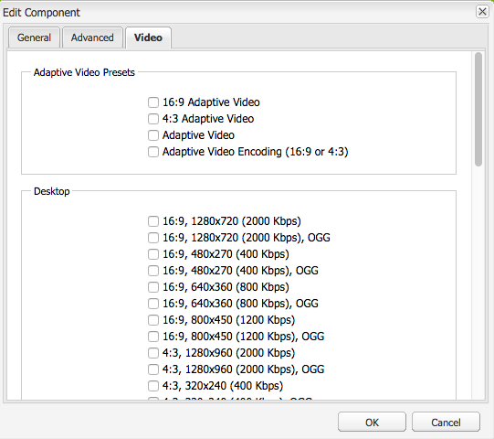
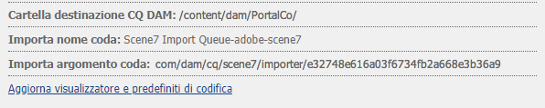
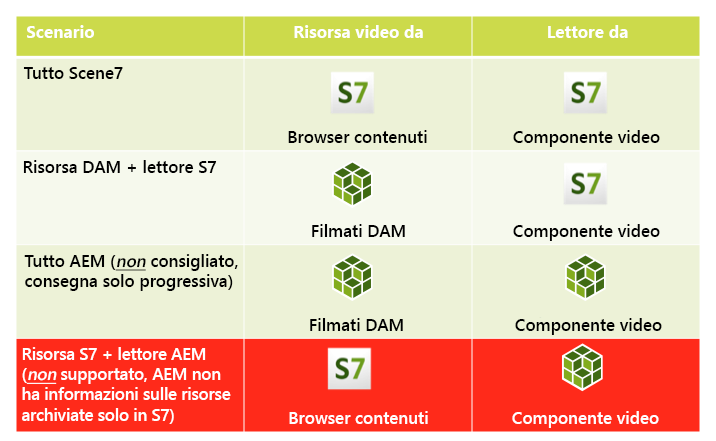
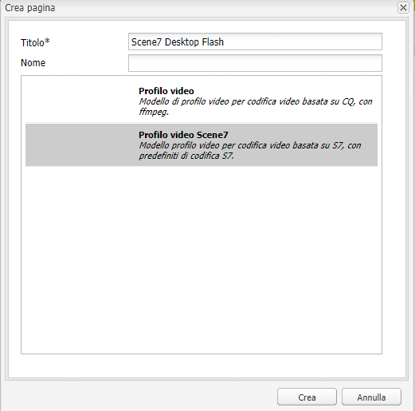
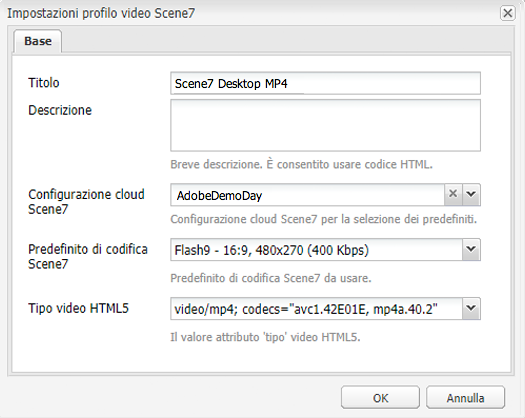

# Video {#video}

Le risorse consentono una gestione centralizzata delle risorse video in cui è possibile caricare i video direttamente su Risorse per la codifica automatica in Dynamic Media Classic. Puoi anche accedere ai video Dynamic Media Classic direttamente da Risorse per l’authoring delle pagine.

L&#39;integrazione video di Dynamic Media Classic estende la portata dei video ottimizzati a tutti gli schermi (rilevamento automatico della periferica e della larghezza di banda).

Il componente **[!UICONTROL Scene7 Video]** esegue automaticamente il rilevamento del dispositivo e della larghezza di banda per riprodurre il formato corretto e la qualità video corretta su computer desktop, tablet e dispositivi mobili.

Potete includere i set video adattivi anziché solo singole risorse video. Un set video adattivo è un contenitore per tutte le rappresentazioni video necessarie per riprodurre video senza problemi su più schermi. Un set video adattivo raggruppa versioni dello stesso video codificate con diversi bitrate e formati. Ad esempio, 400, 800 e 1000 kbps. Potete usare un set video adattivo, insieme al componente video S7, per lo streaming di video adattivi su più tipi di schermo. Ad esempio, dispositivi desktop, iOS, Android, BlackBerry e Windows Mobile.

Per ulteriori informazioni, consultate la [documentazione Dynamic Media Classic sui set video adattivi.](https://experienceleague.adobe.com/docs/experience-manager-cloud-service/assets/dynamicmedia/video-profiles.html#dynamicmedia)

## Informazioni su FFMPEG e Dynamic Media Classic {#about-ffmpeg-and-scene}

Il processo di codifica video predefinito si basa sull’utilizzo dell’integrazione con i profili video basata su FFMPEG. Di conseguenza, il flusso di lavoro di assimilazione DAM predefinito contiene le due seguenti fasi del flusso di lavoro basate su ffmpeg:

* Miniature FFMPEG
* Codifica FFMPEG

L&#39;attivazione e la configurazione dell&#39;integrazione con Dynamic Media Classic non rimuove o disattiva automaticamente questi due passaggi del flusso di lavoro dal flusso di lavoro di caricamento out-of-the-box DAM. Se nel Experience Manager è già utilizzata la codifica video basata su FFMPEG, è probabile che sia installato FFMPEG negli ambienti di authoring. In questo caso, un nuovo video caricato con DAM verrebbe codificato due volte: una volta dall&#39;encoder FFMPEG e una dall&#39;integrazione con Dynamic Media Classic.

Se è stata configurata la codifica video basata su FFMPEG in AEM e FFMPEG, è possibile rimuovere i due flussi di lavoro FFMPEG dai flussi di lavoro di assimilazione DAM.

## Formati supportati {#supported-formats}

Il componente video Scene7 supporta i seguenti formati:

* F4V H.264
* MP4 H.264

## Decidere dove caricare il video {#deciding-where-to-upload-your-video}

La decisione su dove caricare le risorse video dipende da quanto segue:

* Hai bisogno di un flusso di lavoro per la risorsa video?
* Hai bisogno della funzione di controllo delle versioni per la risorsa video?

Se la risposta è “sì” ad almeno una di queste domande, carica il video direttamente in Adobe DAM. Se la risposta è &quot;no&quot; a entrambe le domande, caricate il video direttamente in Dynamic Media Classic. Il flusso di lavoro per ogni scenario è descritto nelle sezioni successive.

### Se caricate il video direttamente in  Adobe DAM {#if-you-are-uploading-your-video-directly-to-adobe-dam}

Se avete bisogno di un flusso di lavoro o di un controllo delle versioni per le risorse, caricate prima  Adobe DAM. Di seguito è riportato il flusso di lavoro consigliato:

1. Caricate la risorsa video in  Adobe DAM e codificatela e pubblicatela automaticamente in Dynamic Media Classic.
1. In  Experience Manager, accedete alle risorse video in WCM nella scheda **[!UICONTROL Filmati]** di Content Finder.
1. Creazione con il componente **[!UICONTROL Scene7 Video]** o **[!UICONTROL Foundation Video]**.

### Se stai caricando il video in Scene7 {#if-you-are-uploading-your-video-to-scene}

Se non avete bisogno di un flusso di lavoro o di un controllo delle versioni per le risorse, caricate le risorse su Scene7. Di seguito è riportato il flusso di lavoro consigliato:

1. In Dynamic Media Classic, [impostare un caricamento e una codifica FTP pianificati su Scene7 (automatizzato del sistema)](https://experienceleague.adobe.com/docs/dynamic-media-classic/using/upload-publish/uploading-files.html#preparing-your-assets-and-folders-for-uploading).
1. In  Experience Manager, accedete alle risorse video in WCM nella scheda **[!UICONTROL Scene7]** di Content Finder.
1. Creare contenuti con il componente **[!UICONTROL Scene7 Video]**.

## Configurazione dell’integrazione con video Scene7 {#configuring-integration-with-scene-video}

Per configurare i predefiniti universali:

1. In **[!UICONTROL Servizi cloud]**, accedi alla tua configurazione di **[!UICONTROL Scene7]** e fai clic su **[!UICONTROL Modifica]**.
1. Seleziona la scheda **[!UICONTROL Video]**.

   

   >[!NOTE]
   >
   >La scheda **[!UICONTROL Video]** non viene visualizzata se la pagina non ha una configurazione cloud.

1. Seleziona il profilo di codifica video adattivo, uno dei profili di codifica per video singolo preconfigurati oppure un profilo di codifica video personalizzato.

   >[!NOTE]
   >
   >Per ulteriori informazioni sul significato dei predefiniti per video, consultate la [documentazione di Dynamic Media Classic](https://experienceleague.adobe.com/docs/dynamic-media-classic/using/setup/application-setup.html#video-presets-for-encoding-video-files).
   >
   >Adobe consiglia di selezionare entrambi i set video adattivi per la configurazione dei predefiniti universali o di selezionare l’opzione **[!UICONTROL Codifica video adattiva]**.

1. I profili di codifica selezionati vengono applicati automaticamente a tutti i video caricati nella cartella di destinazione CQ DAM impostata per questa configurazione cloud di Scene7. Puoi impostare più configurazioni cloud di Scene7 con diverse cartelle di destinazione, per applicare profili di codifica diversi a seconda delle esigenze.

## Aggiornamento del visualizzatore e dei predefiniti di codifica  {#updating-viewer-and-encoding-presets}

Se i predefiniti sono stati aggiornati in Scene7, è necessario aggiornare i predefiniti per visualizzatori e di codifica per i video in  Experience Manager. In tali casi, andate alla configurazione Scene7 nella configurazione cloud e fate clic su **[!UICONTROL Aggiorna il visualizzatore e i predefiniti di codifica]**.

## Caricamento del video principale su Scene7 da  Adobe DAM {#uploading-your-master-video}

1. Individua la cartella di destinazione CQ DAM in cui hai impostato la configurazione cloud con i profili di codifica di Scene7.
1. Fai su **[!UICONTROL Carica]** per caricare il video principale. Il caricamento e la codifica dei video sono completi al termine del flusso di lavoro DAM Update Asset (Aggiorna risorsa DAM) e dopo che **[!UICONTROL Pubblica su Scene7]** ha un segno di spunta.

   >[!NOTE]
   >
   >La generazione delle miniature video richiede del tempo.

   Trascinando il video principale DAM sul componente video, si accede a *all* rappresentazioni proxy codificate Scene7 per la distribuzione.

## Componente video di base e componente video di Scene7 {#foundation-video-component-versus-scene-video-component}

Quando usate  Experience Manager, potete accedere sia al componente Video disponibile in Siti che al componente video Scene7. Questi componenti non sono intercambiabili.

Il componente video di Scene7 funziona solo per i video di Scene7. Il componente foundation funziona con i video memorizzati da  Experience Manager (utilizzando ffmpeg) e video Scene7.

La seguente matrice spiega quando utilizzare il componente:

>[!NOTE]
>
>Il componente video S7 utilizza il profilo video universale. Tuttavia, potete ottenere il lettore video basato su HTML5 in  Experience Manager. Copiate in modo semplice il codice da incorporare del lettore video HTML5 out-of-box e inseritelo nella pagina del Experience Manager .

##  componente video Experience Manager {#aem-video-component}

Anche se per visualizzare i video Scene7 si consiglia di usare il componente video Scene7, per completezza usate i video Scene7 con il componente Video Foundation.

###  Confronto tra video e video Scene7 {#aem-video-and-scene-video-comparison}

La tabella seguente fornisce un confronto di alto livello tra le funzionalità supportate tra il componente Video di Experience Manager Foundation  e il componente Video di Scene7:

|  | Video  base Experience Manager | Video di Scene7 |
|---|---|---|
| Approccio | Primo approccio HTML5. Flash viene utilizzato solo per il fallback non HTML5. | Flash è utilizzato sulla maggior parte dei computer desktop. HTML5 è usato per dispositivi mobili e tablet. |
| Consegna | Progressivo | Streaming adattivo |
| Tracciamento | Sì | Sì |
| Estensibilità | Sì | Sì (con [Documentazione API SDK per visualizzatori HTML5](https://s7d1.scene7.com/s7sdk/3.10/docs/jsdoc/index.html)) |
| Video mobile | Sì | Sì |

### Impostazione  {#setting-up}

#### Creazione di profili video {#creating-video-profiles}

Le diverse codifiche video vengono create in base ai predefiniti di codifica Scene7 selezionati nella configurazione cloud di Scene7. Affinché il componente Video di base possa utilizzarli, è necessario creare un profilo video per ciascun predefinito di codifica Scene7 selezionato. Questo metodo consente al componente video di selezionare di conseguenza le rappresentazioni DAM.

>[!NOTE]
>
>Per la pubblicazione, i nuovi profili video e le relative modifiche devono essere attivati.

1. In  Experience Manager, toccare **[!UICONTROL Strumenti] > [!UICONTROL Console di configurazione]**.
1. Dalla **[!UICONTROL console di configurazione]** passare a **[!UICONTROL Strumenti > DAM > Profili video]** nella struttura di navigazione.
1. Create un profilo video Scene7. In **[!UICONTROL Nuovo...]** elenco a discesa, selezionare **[!UICONTROL Crea pagina]**, quindi selezionare il modello Profilo video Scene7. Assegna un nome alla nuova pagina del profilo video e fai clic su **[!UICONTROL Crea]**.

   

1. Modifica il nuovo profilo video. Seleziona prima la configurazione cloud. Quindi seleziona lo stesso predefinito di codifica selezionato nella configurazione cloud.

   

   | Proprietà | Descrizione |
   |---|---|
   | Configurazione cloud Scene7 | Configurazione cloud da utilizzare per i predefiniti di codifica. |
   | Predefinito di codifica Scene7 | Il predefinito di codifica con cui mappare il profilo video. |
   | Tipo video HTML5 | Questa proprietà consente di impostare il valore della proprietà type dell’elemento sorgente video HTML5. Queste informazioni non vengono fornite dai predefiniti di codifica S7, ma sono necessarie per la corretta esecuzione del rendering dei video mediante l’elemento video HTML5. Viene fornito un elenco dei formati più comuni, che può tuttavia essere sovrascritto per altri formati. |

   Ripeti questo passaggio per tutti i predefiniti di codifica selezionati nella configurazione cloud da usare nel componente video.

#### Configurazione della progettazione {#configuring-design}

Il componente **[!UICONTROL Foundation Video]** deve sapere quali profili video usare per creare l&#39;elenco delle sorgenti video. Aprite la finestra di dialogo di progettazione dei componenti video e configurate la progettazione dei componenti per l’utilizzo dei nuovi profili video.

>[!NOTE]
>
>Se utilizzate il componente **[!UICONTROL Foundation Video]** su una pagina mobile, ripetete questi passaggi nella progettazione della pagina mobile.

>[!NOTE]
>
>Le modifiche apportate alla progettazione richiedono l’attivazione della progettazione, in modo che possano avere effetto al momento della pubblicazione.

1. Aprire la finestra di dialogo di progettazione del componente **[!UICONTROL Foundation Video]** e passare alla scheda **[!UICONTROL Profili]**. Quindi eliminate i profili predefiniti e aggiungete i nuovi profili video S7. L&#39;ordine dell&#39;elenco dei profili nella finestra di dialogo della progettazione definisce l&#39;ordine dell&#39;elemento delle sorgenti video durante il rendering.
1. Per i browser che non supportano HTML5, il componente video consente di configurare un fallback di Flash. Aprite la finestra di dialogo di progettazione dei componenti video e passate alla scheda **[!UICONTROL Flash]**. Configurate le impostazioni dell&#39;Flash Player e assegnate un profilo di fallback per l&#39;Flash Player.

#### Elenco di controllo {#checklist}

1. Create una configurazione di S7 Cloud. Accertatevi che i predefiniti di codifica video siano impostati e che sia in esecuzione l’importazione.
1. Crea un profilo video S7 per ogni predefinito di codifica video selezionato nella configurazione cloud.
1. I profili video devono essere attivati.
1. Configurare la progettazione del componente **[!UICONTROL Foundation Video]** sulla pagina.
1. Dopo aver apportato le modifiche, attiva la progettazione.

