# Aggiungere componenti Dynamic Media Classic alle pagine {#adding-scene-features-to-your-page}

Adobe Dynamic Media Classic è una soluzione in hosting per la gestione, l’ottimizzazione, la pubblicazione e la distribuzione di risorse multimediali sul web, su dispositivi mobili, e-mail, schermi collegati a Internet e la stampa.

Puoi visualizzare AEM risorse pubblicate in Dynamic Media Classic in diversi visualizzatori:

* Zoom
* A comparsa
* Video
* Modello immagini
* Immagine

Puoi pubblicare risorse digitali direttamente da AEM a Dynamic Media Classic e le risorse digitali da Dynamic Media Classic a AEM.

Questo documento descrive come pubblicare risorse digitali da AEM a Dynamic Media Classic e viceversa. Sono inoltre descritti nel dettaglio i visualizzatori. Per informazioni sulla configurazione di AEM per Dynamic Media Classic, consulta [Integrazione di Dynamic Media Classic con AEM](/help/sites-administering/scene7.md).

Consulta anche [Aggiunta di mappe immagine](image-maps.md).

Per ulteriori informazioni sull’utilizzo dei componenti video con AEM, consulta [Video](video.md).

>[!NOTE]
>
>Se le risorse Dynamic Media Classic non vengono visualizzate correttamente, assicurati che gli elementi multimediali dinamici siano [disattivato](config-dynamic.md#disabling-dynamic-media) e quindi aggiorna la pagina.

## Pubblicazione manuale in Dynamic Media Classic dalle risorse {#manually-publishing-to-scene-from-assets}

Puoi pubblicare risorse digitali in Dynamic Media Classic come segue:

* [Nell’interfaccia utente classica dalla console Assets](/help/sites-classic-ui-authoring/manage-assets-classic-s7.md#publishing-from-the-assets-console)
* [Nell’interfaccia utente classica da una risorsa](/help/sites-classic-ui-authoring/manage-assets-classic-s7.md#publishing-from-an-asset)
* [Nell’interfaccia utente classica dall’esterno della cartella di CQ Target](/help/sites-classic-ui-authoring/manage-assets-classic-s7.md#publishing-assets-from-outside-the-cq-target-folder)

>[!NOTE]
>
>AEM pubblicato in Dynamic Media Classic in modo asincrono. Dopo aver fatto clic su **[!UICONTROL Pubblica]** La pubblicazione della risorsa in Dynamic Media Classic potrebbe richiedere alcuni secondi.

## Componenti Dynamic Media Classic {#scene-components}

I seguenti componenti Dynamic Media Classic sono disponibili in AEM:

* Zoom
* Zoom a comparsa
* Modello immagini
* Immagine
* Video

>[!NOTE]
>
>Questi componenti non sono disponibili per impostazione predefinita e devono essere selezionati in **[!UICONTROL Progettazione]** prima dell&#39;utilizzo.

Una volta resi disponibili in **[!UICONTROL Progettazione]** , puoi aggiungere i componenti alla pagina come qualsiasi altro componente AEM. Le risorse non ancora pubblicate in Dynamic Media Classic vengono pubblicate in Dynamic Media Classic se si trovano in una cartella sincronizzata, in una pagina o con una configurazione cloud di Dynamic Media Classic.

>[!NOTE]
>
>Se crei e sviluppa visualizzatori personalizzati e utilizzi Content Finder, devi aggiungere esplicitamente la **[!UICONTROL allowfullscreen]** parametro .

### Avviso sulla fine del ciclo di vita dei visualizzatori Flash {#flash-viewers-end-of-life-notice}

A partire dal 31 gennaio 2017, Adobe Dynamic Media Classic ha terminato il supporto per la piattaforma di visualizzazione dei Flash.

### Aggiunta di un componente Dynamic Media Classic (Scene7) a una pagina {#adding-a-scene-component-to-a-page}

L’aggiunta di un componente Dynamic Media Classic (Scene7) a una pagina equivale all’aggiunta di un componente a qualsiasi pagina. I componenti Dynamic Media Classic sono descritti in dettaglio nelle sezioni seguenti.

**Aggiunta di un componente Dynamic Media Classic (Scene7) a una pagina**:

1. In AEM, apri la pagina in cui desideri aggiungere il componente Dynamic Media Classic (Scene7).

1. Se non sono disponibili componenti Dynamic Media Classic, fai clic su **[!UICONTROL Progettazione]** , tocca un componente con un bordo blu e tocca **[!UICONTROL Elemento padre]** e quindi la **[!UICONTROL Configurazione]** icona. In **[!UICONTROL Parsys (Progettazione)]**, seleziona tutti i componenti Dynamic Media Classic per renderli disponibili e fai clic su **[!UICONTROL OK]**.

   

1. Fai clic su **[!UICONTROL Modifica]** per tornare a **[!UICONTROL Modifica]** modalità.

1. Trascina un componente dal gruppo Dynamic Media Classic nella barra laterale sulla pagina nella posizione desiderata.

1. Fai clic sul pulsante **[!UICONTROL Configurazione]** per aprire il componente.

1. Se necessario, modifica il componente, quindi fai clic su **[!UICONTROL OK]** per salvare le modifiche.
1. Trascina l’immagine o il video dal browser del contenuto sul componente Dynamic Media Classic aggiunto alla pagina.

   >[!NOTE]
   >
   >Solo nell’interfaccia utente touch, devi trascinare l’immagine o il video sul componente Dynamic Media Classic inserito nella pagina. La selezione e la modifica del componente Dynamic Media Classic e quindi la scelta della risorsa non sono supportate.

### Aggiunta di esperienze di visualizzazione interattive a un sito reattivo {#adding-interactive-viewing-experiences-to-a-responsive-website}

Una progettazione reattiva per le risorse significa che queste si adattano a seconda di dove vengono visualizzate. Grazie alla progettazione reattivo, le stesse risorse possono essere visualizzate in modo efficace su dispositivi diversi.

Vedi anche [Progettazione reattiva per le pagine web](/help/sites-developing/responsive.md).

**Per aggiungere un’esperienza di visualizzazione interattiva a un sito reattivo**:

1. Accedi a AEM e assicurati di [Cloud Services Adobe Dynamic Media Classic configurati](/help/sites-administering/scene7.md#configuring-scene-integration) e che i componenti Dynamic Media Classic sono disponibili.

   >[!NOTE]
   >
   >Se i componenti Dynamic Media Classic non sono disponibili, assicurati [per attivarli in modalità Progettazione](/help/sites-authoring/default-components-designmode.md).

1. In un sito web con **[!UICONTROL Dynamic Media Classic]** componenti abilitati, trascina **[!UICONTROL Immagine]** alla pagina.
1. Seleziona il componente e tocca l’icona di configurazione.
1. In **[!UICONTROL Impostazioni Dynamic Media Classic]** regola i punti di interruzione.

   

1. Verifica che i visualizzatori si ridimensionino in modo reattivo e che tutte le interazioni siano ottimizzate per desktop, tablet e dispositivi mobili.

### Impostazioni comuni a tutti i componenti Dynamic Media Classic {#settings-common-to-all-scene-components}

Anche se le opzioni di configurazione variano, le seguenti sono comuni a tutti [!UICONTROL Dynamic Media Classic] componenti:

* **[!UICONTROL Riferimento file]**
Individuare un file a cui fare riferimento. Il riferimento al file mostra l’URL della risorsa e non necessariamente l’URL completo di Dynamic Media Classic, inclusi i comandi e i parametri dell’URL. Non è possibile aggiungere comandi e parametri URL Dynamic Media Classic in questo campo. che devono essere aggiunti attraverso la funzionalità corrispondente nel componente.
* **[!UICONTROL Larghezza]**
Consente di impostare la larghezza.
* **[!UICONTROL Altezza]**
Consente di impostare l&#39;altezza.

Per impostare queste opzioni di configurazione, apri (fai doppio clic) un componente Dynamic Media Classic, ad esempio quando apri una **[!UICONTROL Zoom]** componente:

### Zoom {#zoom}

Il componente Zoom di HTML5 visualizza un’immagine più grande quando si preme il pulsante **[!UICONTROL +]** pulsante .

La risorsa dispone di strumenti di zoom nella parte inferiore. Tocca **[!UICONTROL +]** per ingrandire. Tocca **[!UICONTROL -]** ridurre. Tocca **[!UICONTROL x]** oppure la freccia di reimpostazione dello zoom riporta l’immagine alle dimensioni originali in cui era stata importata. Toccare le frecce diagonali per visualizzarle a schermo intero. Tocca **[!UICONTROL Modifica]** per configurare il componente . Con questo componente puoi configurare [impostazioni comuni a tutti [!UICONTROL Dynamic Media Classic] componenti](#settings-common-to-all-scene-components).

### A comparsa {#flyout}

In HTML5 **[!UICONTROL A comparsa]** componente, la risorsa viene visualizzata come schermata divisa; ha lasciato la risorsa nella dimensione specificata; a destra viene visualizzata la parte dello zoom. Tocca **[!UICONTROL Modifica]** per configurare il componente . Con questo componente puoi configurare [impostazioni comuni a tutti i componenti Dynamic Media Classic](#settings-common-to-all-scene-components).

>[!NOTE]
>
>Se **[!UICONTROL A comparsa]** il componente utilizza una dimensione personalizzata, quindi la dimensione personalizzata viene utilizzata e la configurazione reattiva del componente viene disabilitata.
>
>Se **[!UICONTROL A comparsa]** il componente utilizza le dimensioni predefinite, come impostato nel **[!UICONTROL Visualizzazione Struttura]**, quindi viene utilizzata la dimensione predefinita e il componente si estende per adattarsi alle dimensioni del layout di pagina con l’impostazione reattiva del componente abilitata. Tieni presente, tuttavia, che esiste un limite alla configurazione reattiva del componente. Quando utilizzi la funzione **[!UICONTROL A comparsa]** componente con configurazione reattiva, non utilizzarlo con dilatazione pagina completa. In caso contrario, la **[!UICONTROL A comparsa]** può estendersi oltre il bordo destro della pagina.

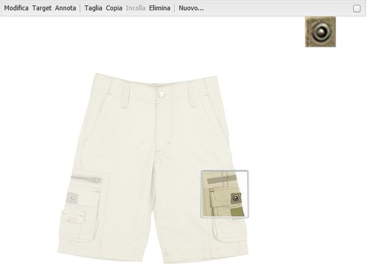

### Immagine {#image}

Dynamic Media Classic **[!UICONTROL Immagine]** consente di aggiungere funzionalità Dynamic Media Classic alle immagini, ad esempio modificatori Dynamic Media Classic, predefiniti per immagini o visualizzatori e nitidezza. Dynamic Media Classic **[!UICONTROL Immagine]** è simile ad altri componenti immagine in AEM con funzionalità Dynamic Media Classic speciali. In questo esempio, l’immagine ha il modificatore URL Dynamic Media Classic, **&amp;op_invert=1** applicato.

* **[!UICONTROL Titolo, Testo Alt]**
In **[!UICONTROL Avanzate]** , aggiungi un titolo all’immagine e il testo Alt per gli utenti che hanno disattivato la grafica.

* **[!UICONTROL URL, Apri in]**
Puoi impostare una risorsa da per aprire un collegamento. Imposta l’**[!UICONTROL URL]** e in **[!UICONTROL Apri in]** indica se desideri aprirlo nella stessa finestra o in una nuova finestra.

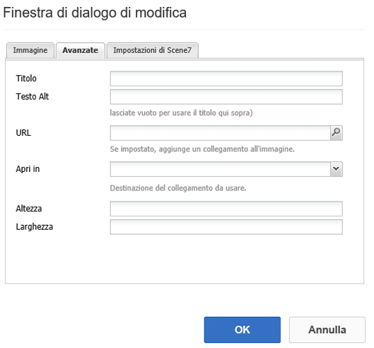

* **[!UICONTROL Predefinito visualizzatore]**
Seleziona un predefinito per visualizzatori dal menu a discesa. Se il predefinito per visualizzatori che cerchi non è visibile, potrebbe essere necessario renderlo visibile. Consulta [Gestione dei predefiniti per visualizzatori](/help/assets/managing-viewer-presets.md). Non è possibile selezionare un predefinito per visualizzatori se si utilizza un predefinito per immagini, e viceversa.

* **[!UICONTROL Configurazione Dynamic Media Classic]**
Seleziona la configurazione Dynamic Media Classic da utilizzare per recuperare i predefiniti immagine attivi da SPS.

* **[!UICONTROL Predefinito immagine]**
Seleziona un predefinito per immagini dal menu a discesa. Se il predefinito per immagini che cerchi non è visibile, potrebbe essere necessario renderlo visibile. Consulta [Gestione dei predefiniti per immagini](/help/assets/managing-image-presets.md). Non è possibile selezionare un predefinito per visualizzatori se si utilizza un predefinito per immagini, e viceversa.

* **[!UICONTROL Formato di uscita]**
Seleziona il formato di output dell&#39;immagine, ad esempio jpeg. A seconda del formato di output selezionato, è possibile che siano disponibili ulteriori opzioni di configurazione. Consulta [Best practice sui predefiniti per immagini](/help/assets/managing-image-presets.md#image-preset-options).

* **[!UICONTROL Nitidezza]**
Selezionare la modalità di nitidezza dell&#39;immagine. La regolazione della nitidezza è descritta in dettaglio in [Best practice sui predefiniti per immagini](/help/assets/managing-image-presets.md#image-preset-options) e [Best practice sulla nitidezza](/help/assets/assets/sharpening_images.pdf).

* **[!UICONTROL Modificatori URL]**
È possibile modificare gli effetti immagine fornendo ulteriori comandi immagine Dynamic Media Classic. Tali situazioni vengono descritte in [Predefiniti per immagini](/help/assets/managing-image-presets.md) e nella [Guida ai comandi](https://experienceleague.adobe.com/docs/dynamic-media-developer-resources/image-serving-api/image-serving-api/http-protocol-reference/command-reference/c-command-reference.html).

* **[!UICONTROL Punti di interruzione]**
Se il sito web è reattivo, è necessario regolare i punti di interruzione. I punti di interruzione devono essere separati da virgole ( , ).

### Modello immagini {#image-template}

[Modelli immagine Dynamic Media Classic](https://experienceleague.adobe.com/docs/dynamic-media-classic/using/template-basics/creating-template.html#creating-the-initial-template) sono contenuti Photoshop a più livelli importati in Dynamic Media Classic, dove il contenuto e le proprietà sono stati parametrizzati per la variabilità. Il componente **[!UICONTROL Modello immagini]** consente di importare immagini e modificare il testo in modo dinamico in AEM. Inoltre, è possibile configurare il componente **[!UICONTROL Modello immagini]** in modo che utilizzi valori contestuali ClientContext, affinché ogni utente possa avere un’esperienza personalizzata dell’immagine.

Tocca **[!UICONTROL Modifica]** per configurare il componente . Puoi configurare [impostazioni comuni a tutti i componenti Dynamic Media Classic](#settings-common-to-all-scene-components) nonché altre impostazioni descritte in questa sezione.

* **[!UICONTROL Riferimento file, larghezza, altezza]**
Consulta le impostazioni comuni a tutti i componenti Dynamic Media Classic.

   >[!NOTE]
   >
   >I comandi e i parametri URL di Dynamic Media Classic non possono essere aggiunti direttamente all’URL di riferimento del file. Possono essere definiti solo nell’interfaccia utente del componente del pannello **[!UICONTROL Parametri]**.

* **[!UICONTROL Titolo, Testo Alt]**
Nella scheda Modello immagini di Dynamic Media Classic , aggiungi un titolo all’immagine e il testo Alt per gli utenti che hanno disattivato la grafica.

* **[!UICONTROL URL, Apri in]**
Puoi impostare una risorsa da per aprire un collegamento. Imposta l’URL e in Apri in indica se desideri aprirlo nella stessa finestra o in una nuova finestra.

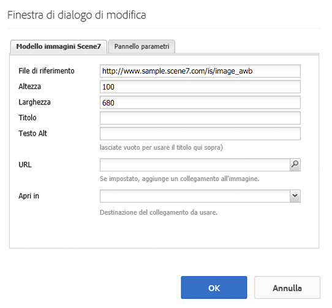

* **[!UICONTROL Pannello Parametri]**
Durante l’importazione di un’immagine, i parametri vengono precompilati con le informazioni provenienti dall’immagine. Se non vi sono contenuti modificabili dinamicamente, questa finestra è vuota.

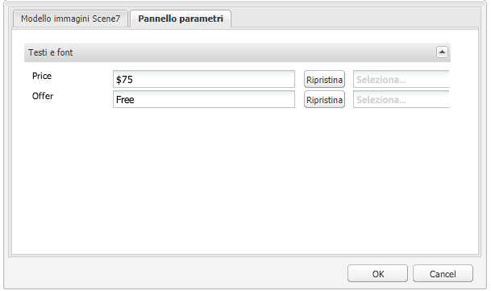

#### Modifica dinamica del testo {#changing-text-dynamically}

Per modificare il testo in modo dinamico, immetti un nuovo testo nei campi e fai clic su **[!UICONTROL OK]**. In questo esempio, il **[!UICONTROL Prezzo]** è ora di $50 e la spedizione è di 99 centesimi.

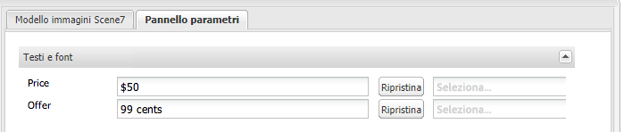

Il testo nell’immagine cambia. Per ripristinare il testo al valore originale, tocca **[!UICONTROL Reimposta]** accanto al campo .

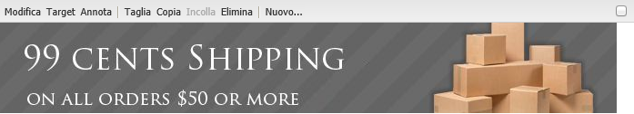

#### Modifica del testo in base a un valore personalizzato ClientContext {#changing-text-to-reflect-the-value-of-a-client-context-value}

Per collegare un campo a un valore di contesto client, tocca **[!UICONTROL Seleziona]** per aprire il menu di scelta rapida ClientContext, seleziona il contesto client e tocca **[!UICONTROL OK]**. In questo esempio, il nome cambia perché è collegato al nome formattato nel profilo.

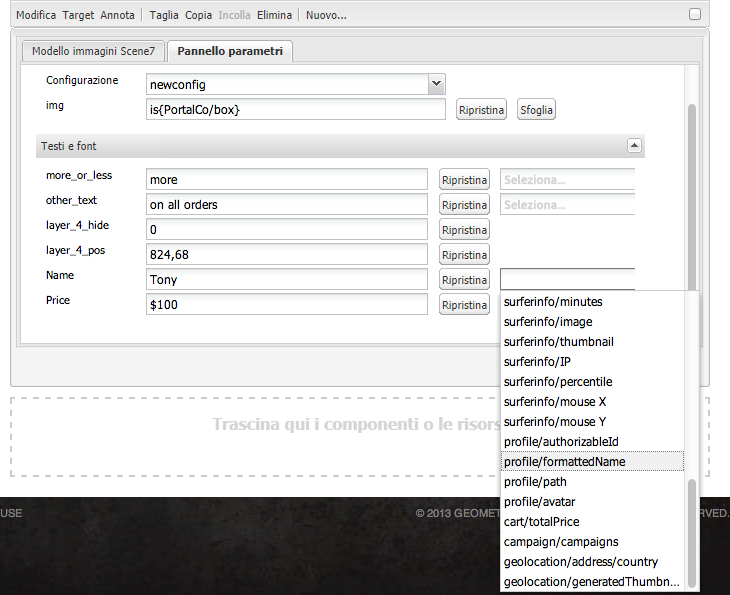

Il testo si aggiorna con il nome dell’utente attualmente connesso. Per ripristinare il testo al valore originale, fai clic su **[!UICONTROL Ripristina]** accanto al campo.

#### Collegamento al modello di immagine di Dynamic Media Classic {#making-the-scene-image-template-a-link}

1. Sulla pagina con Dynamic Media Classic **[!UICONTROL Modello immagini]** componente, tocca **[!UICONTROL Modifica]**.
1. In **[!UICONTROL URL]** , immetti l’URL a cui gli utenti indirizzano quando l’immagine viene toccata. In **[!UICONTROL Apri in]** selezionare se si desidera aprire la destinazione (una nuova finestra o una stessa finestra).

   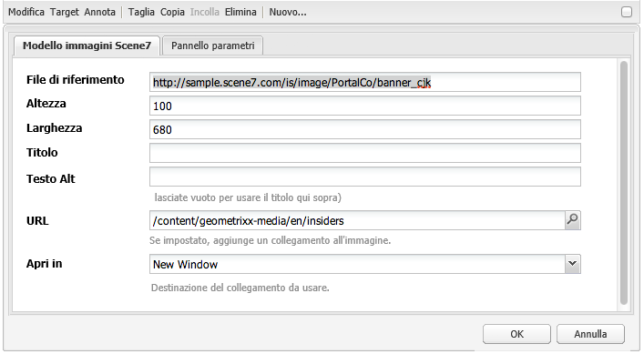

1. Tocca **[!UICONTROL OK]**.

### Componente video {#video-component}

Dynamic Media Classic **[!UICONTROL Video]** Il componente (disponibile nella sezione Dynamic Media Classic della barra laterale) utilizza il rilevamento del dispositivo e della larghezza di banda per distribuire il video corretto a ogni schermata. Questo componente è un lettore video HTML5; è un singolo visualizzatore che può essere usato su più canali.

Può essere utilizzato per set video adattivi, per un singolo video MP4 o per un singolo video F4V.

Vedi [Video](s7-video.md) per ulteriori informazioni sul funzionamento dei video con l’integrazione Dynamic Media Classic. Inoltre, vedi [il componente Video di Dynamic Media Classic e il componente Video di base](s7-video.md).

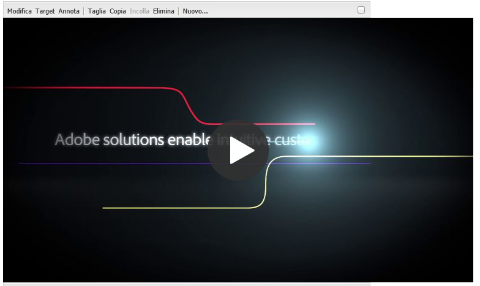

### Limitazioni note per il componente video {#known-limitations-for-the-video-component}

Adobe DAM e WCM mostrano se è stato caricato un video principale. Non mostrano queste risorse proxy:

* Rendering codificati in Dynamic Media Classic
* Set video adattivi Dynamic Media Classic

Quando utilizzi un set di video adattivo con il componente video Dynamic Media Classic, devi ridimensionare il componente per adattarlo alle dimensioni del video.

## Browser dei contenuti Dynamic Media Classic {#scene-content-browser}

Il browser dei contenuti Dynamic Media Classic consente di visualizzare i contenuti da Dynamic Media Classic direttamente in AEM. Per accedere al browser del contenuto, nella **[!UICONTROL Content Finder]**, seleziona **[!UICONTROL Dynamic Media Classic]** nell’interfaccia touch o nella **[!UICONTROL S7]** nell’interfaccia utente classica. La funzionalità è identica nelle due interfacce utente.

Se si dispone di più configurazioni, per impostazione predefinita AEM visualizza la [configurazione predefinita](/help/sites-administering/scene7.md#configuring-a-default-configuration). Puoi selezionare diverse configurazioni direttamente nel browser dei contenuti di Dynamic Media Classic nel menu a discesa.

>[!NOTE]
>
>* Le risorse che si trovano nella cartella ad-hoc non verranno visualizzate nel browser dei contenuti di Dynamic Media Classic.
>* Quando [Anteprima protetta abilitata](/help/sites-administering/scene7.md#configuring-the-state-published-unpublished-of-assets-pushed-to-scene), le risorse pubblicate e non pubblicate in Dynamic Media Classic vengono visualizzate nel browser dei contenuti di Dynamic Media Classic.
>* Se non vedi **[!UICONTROL Dynamic Media Classic]** o **[!UICONTROL S7]** come opzione nel browser del contenuto, è necessario [configurare Dynamic Media Classic per lavorare con AEM](/help/sites-administering/scene7.md).
>* Per i video, il browser dei contenuti Dynamic Media Classic supporta:
   >   * Set di video adattivo: contenitore di tutte le rappresentazioni video necessarie per consentirne la riproduzione su diversi tipi di schermi
   >   * Singolo video MP4
   >   * Singolo video F4V

### Esplorazione dei contenuti nell’interfaccia touch {#browsing-content-in-the-touch-optimized-ui}

È possibile accedere al browser dei contenuti nell’interfaccia touch o classica. Attualmente l’ottimizzazione touch presenta le seguenti limitazioni:

* FXG e risorse di Flash da Dynamic Media Classic non sono supportati.

Sfoglia le risorse Dynamic Media Classic selezionando **[!UICONTROL Dynamic Media Classic]** dal terzo menu a discesa. Dynamic Media Classic non viene visualizzato nell’elenco se non hai configurato l’integrazione Dynamic Media Classic/AEM.

>[!NOTE]
>
>* Il browser dei contenuti di Dynamic Media Classic carica circa 100 risorse e le ordina per nome.
>* Se hai impostato un server di anteprima sicuro, il browser utilizzerà tale server di anteprima per eseguire il rendering di miniature e risorse.

>

Inoltre, puoi sfogliare le informazioni sulla risoluzione, le dimensioni, i giorni successivi alla modifica e il nome del file passando il cursore sulla risorsa nel browser.

* Per i set video adattivi e i modelli, non vengono generate informazioni sulle dimensioni per le miniature.
* Per i set video adattivi, non viene generata alcuna risoluzione per le miniature.

### Ricerca di risorse Dynamic Media Classic con il browser dei contenuti {#searching-for-scene-assets-with-the-content-browser}

La ricerca di risorse Dynamic Media Classic è simile alla ricerca AEM risorse, ma quando effettui una ricerca viene visualizzata una visualizzazione remota delle risorse nel sistema Dynamic Media Classic, anziché importarle direttamente in AEM.

Per visualizzare e cercare le risorse è possibile utilizzare l’interfaccia touch o classica. A seconda dell’interfaccia, la modalità di ricerca è leggermente diversa.

Durante la ricerca in una qualsiasi delle interfacce utente, è possibile filtrare in base ai seguenti criteri (mostrati qui nell’interfaccia touch):

* **[!UICONTROL Immetti le parole chiave]**
È possibile cercare le risorse per nome. Durante la ricerca, immetti le parole chiave con cui inizia il nome del file. Ad esempio, se digiti la parola “nuoto” verranno cercati i nomi dei file delle risorse che iniziano con queste lettere, in questo ordine. Tocca Invio dopo aver digitato il termine per trovare la risorsa.

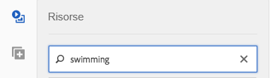

* **[!UICONTROL Cartella/percorso]**
Il nome della cartella visualizzata si basa sulla configurazione selezionata. Per espandere i livelli inferiori, tocca l’icona della cartella e seleziona una sottocartella, quindi tocca il segno di spunta per selezionarla.

Se si immette una parola chiave e si seleziona una cartella, AEM esegue la ricerca in tale cartella e in tutte le relative sottocartelle. Tuttavia, se non si immettono parole chiave durante la ricerca, la selezione della cartella mostrerà solo le risorse in quella cartella, senza includere le sottocartelle.

Per impostazione predefinita, AEM cerca nella cartella selezionata e in tutte le sue sottocartelle.

* **[!UICONTROL Tipo di risorsa]**
Seleziona **[!UICONTROL Dynamic Media Classic]** per sfogliare il contenuto Dynamic Media Classic. Questa opzione è disponibile solo se Dynamic Media Classic è stato configurato.

* **[!UICONTROL Configurazione]**
Se hai più di una configurazione Dynamic Media Classic definita in [!UICONTROL Cloud Services], puoi selezionarlo qui. Di conseguenza, la cartella cambierà in base alla configurazione scelta.

* **[!UICONTROL Tipo di risorsa]**
Nel browser Dynamic Media Classic, puoi filtrare i risultati per includere uno dei seguenti elementi: immagini, modelli, video e set video adattivi. Se non si seleziona alcun tipo di risorsa, per impostazione predefinita AEM ricerca tutti i tipi di risorsa.

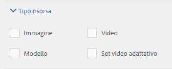

>[!NOTE]
>
>* Nell’interfaccia classica, è anche possibile cercare **Flash** e **FXG**. Al momento questi non sono disponibili come filtro di ricerca nell’interfaccia touch.
>
>* Durante la ricerca di video, si cerca una singola rappresentazione. I risultati restituiscono il rendering originale (solo &amp;ast;.mp4) e il rendering codificato.
>* Durante la ricerca di un set video adattivo, stai cercando la cartella e tutte le sottocartelle, ma solo se hai aggiunto una parola chiave alla ricerca. Se non hai aggiunto una parola chiave, AEM non cerca nelle sottocartelle.

>

* **[!UICONTROL Stato di pubblicazione]**
Puoi filtrare le risorse in base allo stato di pubblicazione: **[!UICONTROL Non pubblicato]** o **[!UICONTROL Pubblicato]**. Se non selezioni nessuna **[!UICONTROL Stato di pubblicazione]**, AEM per impostazione predefinita esegue la ricerca in tutti gli stati di pubblicazione.

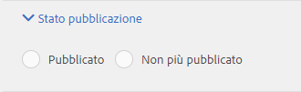
