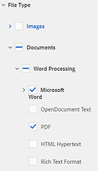

# Ricerca di risorse in AEM {#search-assets-in-aem}

Scoprite come trovare le risorse necessarie in AEM utilizzando il pannello Filtri e come utilizzare le risorse visualizzate nella ricerca.

Usate il pannello Filtri per cercare risorse, cartelle, tag e metadati. È possibile cercare parti di una stringa utilizzando l&#39;asterisco carattere jolly.

Il pannello Filtri offre diverse opzioni per la ricerca di risorse e cartelle in diversi modi anziché in un ordine tassonomico generico.

Potete eseguire una ricerca in base alle seguenti opzioni (predicati):

* Tipo di file
* Dimensione file
* Nome campo
* Ultima modifica
* Stato
* Orientamento
* Stile
* Approfondimenti

<!-- TBD keystroke 65 article and port applicable changes here. This content goes. -->

Potete personalizzare il pannello Filtri e aggiungere o rimuovere i predicati di ricerca utilizzando i facet [di](search-facets.md)ricerca. Per visualizzare il pannello Filtri, effettuare le seguenti operazioni:

1. Nell’interfaccia utente Risorse, tocca o fai clic sull’icona  search_per visualizzare la casella di ricerca Omnico.
1. Inserite il termine da cercare e premete Invio. In alternativa, è sufficiente premere Invio senza immettere alcun termine di ricerca. Non inserire spazi iniziali, altrimenti la ricerca non funziona.

1. Toccate o fate clic sull&#39;icona GlobalNav. Viene visualizzato il pannello Filtri.

   

   A seconda del tipo di elementi ricercati, il numero di corrispondenze è indicato nella parte superiore dei risultati della ricerca.

   

## Ricerca di tipi di file {#search-for-file-types}

Il pannello Filtri consente di aggiungere maggiore granularità alla ricerca e rende più versatile la funzionalità di ricerca. Potete facilmente approfondire fino al livello di dettaglio desiderato.

Ad esempio, se cercate un’immagine, usate il predicato **[!UICONTROL Tipo]** file per scegliere se un’immagine bitmap o vettoriale deve essere impostata.

È possibile limitare ulteriormente l&#39;ambito della ricerca specificando il tipo MIME per l&#39;immagine.

Allo stesso modo, quando cercate documenti, potete specificare il formato, ad esempio PDF o MS Word.

## Ricerca in base alle dimensioni del file {#search-based-on-file-size}

Usate il predicato Dimensione **** file per cercare le risorse in base alle loro dimensioni. Potete specificare i limiti inferiore e superiore dell’intervallo di dimensioni per limitare la ricerca. È inoltre possibile specificare l&#39;unità di misura, ad esempio Kilobyte, Megabyte e così via.

## Ricerca in base all’ultima modifica delle risorse {#search-based-on-when-assets-are-last-modified}

Se gestite le risorse di lavoro in corso o monitorate un flusso di lavoro di revisione, potete cercare quando una risorsa è stata modificata per l’ultima volta in base a indicatori di ora precisi. Ad esempio, specificate le date prima o dopo le quali le risorse sono state modificate.

Potete inoltre utilizzare le seguenti opzioni per ottenere un livello più elevato di granularità nella ricerca:

## Ricerca in base allo stato {#search-based-on-status}

Utilizzate il predicato **Stato** per cercare le risorse in base a vari tipi di stato, ad esempio Pubblica, Approvazione, Checkout e Scadenza.

Ad esempio, durante il monitoraggio della pubblicazione delle risorse, potete utilizzare l’opzione appropriata per cercare le risorse pubblicate.

Durante il monitoraggio dello stato di revisione delle risorse, utilizzate l&#39;opzione appropriata per individuare le risorse approvate o in attesa di approvazione.

## Ricerca basata sui dati Insights {#search-based-on-insights-data}

Utilizzate il predicato **Insights** per cercare risorse in base alle statistiche di utilizzo ottenute da varie app Creative. I dati di utilizzo sono raggruppati nelle seguenti categorie:

* Valutazione dell&#39;utilizzo
* Impression
* Clic
* Canali multimediali in cui appaiono le risorse

