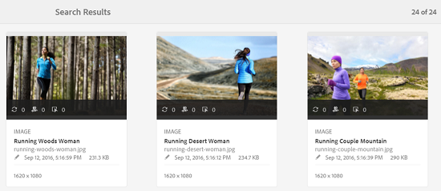

# Cercare risorse in [!DNL Experience Manager] {#search-assets-in-aem}

Scopri come trovare le risorse necessarie in [!DNL Experience Manager] utilizzando il pannello Filtri e come utilizzare le risorse visualizzate nella ricerca.

Usa il pannello Filtri per cercare risorse, cartelle, tag e metadati. È possibile cercare parti di una stringa utilizzando l&#39;asterisco con carattere jolly.

Il pannello Filtri offre diverse opzioni per cercare risorse e cartelle in diversi modi anziché in un ordine tassonomico generico.

Puoi eseguire ricerche in base alle seguenti opzioni (predicati):

* Tipo di file
* Dimensione file
* Nome campo
* Ultima modifica
* Stato
* Orientamento
* Stile
* Approfondimenti

<!-- TBD keystroke 65 article and port applicable changes here. This content goes. -->

Puoi personalizzare il pannello Filtri e aggiungere/rimuovere i predicati di ricerca utilizzando [facet di ricerca](search-facets.md). Per visualizzare il pannello Filtri, esegui questi passaggi:

1. Nell’interfaccia utente Assets, tocca o fai clic su  nella barra degli strumenti per visualizzare la casella di ricerca Omnisearch.
1. Inserisci il termine di ricerca e premi Invio. In alternativa, è sufficiente premere Invio senza inserire alcun termine di ricerca. Non inserire spazi iniziali, altrimenti la ricerca non funziona.

1. Tocca o fai clic sull’icona di Navigazione globale . Viene visualizzato il pannello Filtri .

   

   A seconda del tipo di elementi ricercati, il numero di corrispondenze è indicato nella parte superiore dei risultati della ricerca.

   

## Ricerca di tipi di file {#search-for-file-types}

Il pannello Filtri consente di aggiungere maggiore granularità all’esperienza di ricerca e rende più versatile la funzionalità di ricerca. È possibile espandere facilmente il livello di dettaglio desiderato.

Ad esempio, se cerchi un&#39;immagine, utilizza il predicato **[!UICONTROL Tipo file]** per scegliere se desideri un&#39;immagine bitmap o un&#39;immagine vettoriale.

Puoi limitare ulteriormente l’ambito della ricerca specificando il tipo MIME per l’immagine.

Allo stesso modo, durante la ricerca di documenti, è possibile specificare il formato, ad esempio PDF o MS Word.

## Ricerca in base alle dimensioni del file {#search-based-on-file-size}

Utilizza il predicato **Dimensione file** per cercare le risorse in base alle loro dimensioni. È possibile specificare i limiti inferiori e superiori dell’intervallo di dimensioni per limitare la ricerca. È inoltre possibile specificare l’unità di misura, ad esempio Kilobyte, Megabyte e così via.

## Ricerca in base all’ultima modifica apportata alle risorse {#search-based-on-when-assets-are-last-modified}

Se gestisci le risorse in corso di lavorazione o controlli un flusso di lavoro di revisione, puoi cercare l’ultima modifica di una risorsa in base a marche temporali precise. Ad esempio, specifica le date prima o dopo le quali le risorse sono state modificate.

Puoi inoltre utilizzare le seguenti opzioni per ottenere un livello di granularità più elevato nella ricerca:

## Ricerca in base allo stato {#search-based-on-status}

Utilizza il predicato **Stato** per cercare le risorse in base a vari tipi di stato, ad esempio Pubblica, Approvazione, Pagamento e Scadenza.

Ad esempio, durante il monitoraggio della pubblicazione delle risorse, puoi utilizzare l’opzione appropriata per cercare le risorse pubblicate.

Quando monitori lo stato di revisione delle risorse, utilizza l’opzione appropriata per individuare le risorse approvate o quelle in attesa di approvazione.

## Ricerca basata sui dati Approfondimenti {#search-based-on-insights-data}

Utilizza il predicato **Insights** per cercare le risorse in base alle statistiche di utilizzo ottenute da varie app Creative. I dati di utilizzo sono raggruppati nelle seguenti categorie:

* Punteggio di utilizzo
* Impression
* Clic
* Canali multimediali in cui vengono visualizzate le risorse

