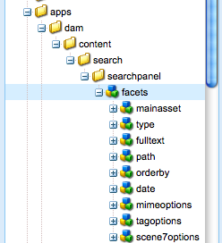

# Estensione della ricerca delle risorse {#extending-assets-search}

Puoi estendere le funzionalità di ricerca di Adobe Experience Manager (AEM) Assets. In questo caso,  AEM Assets cerca le risorse in base alle stringhe.

La ricerca viene eseguita tramite l&#39;interfaccia QueryBuilder, in modo da personalizzare la ricerca con diversi predicati. Potete sovrapporre il set predefinito di predicati nella seguente directory: `/apps/dam/content/search/searchpanel/facets`.

Potete anche aggiungere schede aggiuntive al pannello di amministrazione  AEM Assets.

>[!CAUTION]
>
>A partire da AEM 6.4, l’interfaccia classica è obsoleta. Per un annuncio, consultate [Funzioni](../release-notes/deprecated-removed-features.md)obsolete e rimosse. È consigliabile utilizzare l’interfaccia touch. Per le personalizzazioni, consultate Facet di [ricerca](search-facets.md).

## Sovrapposizione {#overlaying}

Per sovrapporre i predicati preconfigurati, copiate il `facets` nodo da `/libs/dam/content/search/searchpanel` a `/apps/dam/content/search/searchpanel/` o specificate un&#39;altra `facetURL` proprietà nella configurazione del pannello di ricerca (l&#39;impostazione predefinita è `/libs/dam/content/search/searchpanel/facets.overlay.infinity.json`).



>[!NOTE]
>
>Per impostazione predefinita, la struttura di directory in / `apps` non esiste e deve essere creata. Assicurarsi che i tipi di nodo corrispondano a quelli in / `libs`.


## Aggiunta di schede {#adding-tabs}

Potete aggiungere ulteriori schede di ricerca configurandole nell&#39; AEM Assets Admin. Per creare schede aggiuntive:

1. Create la struttura delle cartelle `/apps/wcm/core/content/damadmin/tabs,`se non esiste già, quindi copiate il `tabs` nodo da `/libs/wcm/core/content/damadmin` e incollatelo.
1. Create e configurate la seconda scheda, come desiderato.

   >[!NOTE]
   >
   >Quando create un secondo pannello siteadminsearch, accertatevi di impostare una `id` proprietà per evitare conflitti tra i moduli.

## Creazione di predicati personalizzati {#creating-custom-predicates}

 AEM Assets viene fornito con un set di predicati predefiniti che possono essere utilizzati per personalizzare una pagina Condivisione risorse. In questo modo potete personalizzare una condivisione di risorse in [Creazione e configurazione di una pagina](assets-finder-editor.md#creating-and-configuring-an-asset-share-page)di condivisione di risorse.

Oltre a utilizzare i predicati preesistenti, AEM sviluppatori possono anche creare i propri predicati utilizzando l&#39;API [](/help/sites-developing/querybuilder-api.md)Query Builder.

La creazione di predicati personalizzati richiede conoscenze di base sul framework [](https://helpx.adobe.com/experience-manager/6-4/sites/developing/using/reference-materials/widgets-api/index.html)Widget.

La procedura ottimale consiste nel copiare e regolare un predicato esistente. I predicati di esempio si trovano in `/libs/cq/search/components/predicates`.

### Esempio: Creare un semplice predicato di proprietà {#example-build-a-simple-property-predicate}

Per creare un predicato di proprietà:

1. Ad esempio, potete creare una cartella di componenti nella directory dei progetti `/apps/geometrixx/components/titlepredicate`.
1. Aggiungi `content.xml`:

   ```xml
   <?xml version="1.0" encoding="UTF-8"?>
   <jcr:root xmlns:sling="https://sling.apache.org/jcr/sling/1.0"
    xmlns:cq="https://www.day.com/jcr/cq/1.0"
    xmlns:jcr="https://www.jcp.org/jcr/1.0"
       jcr:primaryType="cq:Component"
       jcr:title="Title Predicate"
       sling:resourceSuperType="foundation/components/parbase"
       allowedParents="[*/parsys]"
       componentGroup="Search"/>
   ```

1. Aggiungi `titlepredicate.jsp`.

   ```xml
   <%--
     Sample title predicate component
   
   --%><%@ page import="java.util.Calendar" %><%
   %><%@include file="/libs/foundation/global.jsp"%><%
   
       // A unique id is necessary in case this predicate is inserted multiple times on the same page
       String elemId = "cq-predicate-" +  Long.toString(Calendar.getInstance().getTimeInMillis());
   
   %><div class="predicatebox">
   
       <div class="title">Title</div>
   
       <%-- The wrapper for the form elements. All items will be append to this wrapper. --%>
       <div id="<%= elemId %>" class="content"></div>
   
   </div><script type="text/javascript">
   
       CQ.Ext.onLoad(function() {
   
           var predicateName = "property";
           var propertyName = "jcr:content/metadata/dc:title";
           var elemId = "<%= elemId %>";
   
           // Get the page wide available QueryBuilder.
           var qb = CQ.search.Util.getQueryBuilder();
   
           // createId adds a counter to the predicate name - useful in case this predicate
           // is inserted multiple times on the same page.
           var id = qb.createId(predicateName);
   
           // Hidden field that defines the property to search for; in our case this
           // is the "dc:title" metadata. The name "property" (or "1_property", "2_property" etc.)
           // indicates the server to use the property predicate
           // (com.day.cq.search.eval.JcrPropertyPredicateEvaluator).
           qb.addField({
               "xtype": "hidden",
               "renderTo": elemId,
               "name": id,
               "value": propertyName
           });
   
           // The visible text field. The name has to be like the one of the hidden field above
           // plus the ".value" suffix.
           qb.addField({
               "xtype": "textfield",
               "renderTo": elemId,
               "name": id + ".value"
           });
   
           // Depending on the predicate additional parameters allow to configure the
           // predicate. Here we add an operation parameter to create a "like" query.
           // Again note the name set to the id and a suffix.
           qb.addField({
               "xtype": "hidden",
               "renderTo": elemId,
               "name": id + ".operation",
               "value": "like"
           });
   
       });
   
   </script>
   ```

1. Per rendere disponibile il componente, devi essere in grado di modificarlo. To make a component editable, in CRXDE, add a node `cq:editConfig` of primary type `cq:EditConfig`. Per rimuovere i paragrafi, aggiungi una proprietà con più valori `cq:actions` che presenta un singolo valore **DELETE**.
1. Passate al browser e nella pagina di esempio (ad esempio, `press.html`) passate alla modalità di progettazione e attivate il nuovo componente per il sistema di paragrafi di predicato (ad esempio, **a sinistra**).

1. In modalità **Modifica** , il nuovo componente è ora disponibile nella barra laterale (nel gruppo **Ricerca** ). Inserite il componente nella colonna **Predicati** e digitate una parola di ricerca, ad esempio **Romboidale** , quindi fate clic sulla lente di ingrandimento per avviare la ricerca.

   >[!NOTE]
   >
   >Durante la ricerca, accertarsi di digitare esattamente il termine, compreso il caso corretto.

### Esempio: Creare un semplice predicato di gruppo {#example-build-a-simple-group-predicate}

Per creare un predicato di gruppo:

1. Ad esempio, potete creare una cartella di componenti nella directory dei progetti `/apps/geometrixx/components/picspredicate`.
1. Aggiungi `content.xml`:

   ```xml
   <?xml version="1.0" encoding="UTF-8"?>
   <jcr:root xmlns:sling="https://sling.apache.org/jcr/sling/1.0"
    xmlns:cq="https://www.day.com/jcr/cq/1.0"
    xmlns:jcr="https://www.jcp.org/jcr/1.0"
       jcr:primaryType="cq:Component"
       jcr:title="Image Formats"
       sling:resourceSuperType="foundation/components/parbase"
       allowedParents="[*/parsys]"
       componentGroup="Search"/>
   ```

1. Aggiungi `titlepredicate.jsp`:

   ```java
   <%--
   
     Sample group predicate component
   
   --%><%@ page import="java.util.Calendar" %><%
   %><%@include file="/libs/foundation/global.jsp"%><%
   
       // A unique id is necessary in case this predicate is inserted multiple times on the same page.
       String elemId = "cq-predicate-" +  Long.toString(Calendar.getInstance().getTimeInMillis());
   
   %><div class="predicatebox">
   
       <div class="title">Image Formats</div>
   
       <%-- The wrapper for the form elements. All items will be append to this wrapper. --%>
       <div id="<%= elemId %>" class="content"></div>
   
   </div><script type="text/javascript">
   
       CQ.Ext.onLoad(function() {
   
           var predicateName = "property";
           var propertyName = "jcr:content/metadata/dc:format";
           var elemId = "<%= elemId %>";
   
           // Get the page wide available QueryBuilder.
           var qb = CQ.search.Util.getQueryBuilder();
   
           // Create a unique group ID; will return e.g. "1_group".
           var groupId = qb.createGroupId();
   
           // Hidden field that defines the property to search for  - in our case "dc:format" -
           // and declares the group of predicates. "property" in the name ("1_group.property")
           // indicates to the server to use the "property predicate"
           // (com.day.cq.search.eval.JcrPropertyPredicateEvaluator).
           qb.addField({
               "xtype": "hidden",
               "renderTo": "<%= elemId %>",
               "name": groupId + "." + predicateName, // 1_group.property
               "value": propertyName
           });
   
           // Declare to combine the multiple values using OR.
           qb.add(new CQ.Ext.form.Hidden({
               "name": groupId + ".p.or",  // 1_group.p.or
               "value": "true"
           }));
   
           // The options
           var options = [
               { "label":"JPEG", "value":"image/jpeg"},
               { "label":"PNG",  "value":"image/png" },
               { "label":"GIF",  "value":"image/gif" }
           ];
   
           // Build a checkbox for each option.
           for (var i = 0; i < options.length; i++) {
               qb.addField({
                   "xtype": "checkbox",
                   "renderTo": "<%= elemId %>",
                   // 1_group.property.0_value, 1_group.property.1_value etc.
                   "name": groupId + "." +  predicateName + "." + i + "_value",
                   "inputValue": options[i].value,
                   "boxLabel": options[i].label,
                   "listeners": {
                       "check": function() {
                           // Submit the search form when checking/unchecking a checkbox.
                           qb.submit();
                       }
                   }
               });
           }
   
       });
   ```

1. Per rendere disponibile il componente, devi essere in grado di modificarlo. To make a component editable, in CRXDE, add a node `cq:editConfig` of primary type `cq:EditConfig`. Per rimuovere i paragrafi, aggiungi una proprietà con più valori `cq:actions` che presenta un singolo valore `DELETE`.
1. Passate al browser e nella pagina di esempio (ad esempio, `press.html`) passate alla modalità di progettazione e attivate il nuovo componente per il sistema di paragrafi di predicato (ad esempio, **a sinistra**).
1. In modalità **Modifica** , il nuovo componente è ora disponibile nella barra laterale (nel gruppo **Ricerca** ). Inserite il componente nella colonna **Predicati** .

### Widget predicato installati {#installed-predicate-widgets}

I seguenti predicati sono disponibili come widget ExtJS preconfigurati.

### FulltextPredicate {#fulltextpredicate}

| Proprietà | Tipo | Descrizione |
|---|---|---|
| predicateName | Stringa | Nome del predicato. Impostazione predefinita `fulltext` |
| searchCallback | Funzione | Callback per attivare la ricerca sull&#39;evento `keyup`. Impostazione predefinita `CQ.wcm.SiteAdmin.doSearch` |

### PropertyPredicate {#propertypredicate}

| Proprietà | Tipo | Descrizione |
|---|---|---|
| predicateName | Stringa | Nome del predicato. Impostazione predefinita `property` |
| propertyName | Stringa | Nome della proprietà JCR. Impostazione predefinita `jcr:title` |
| defaultValue | Stringa | Valore predefinito precompilato. |

### PathPredicate {#pathpredicate}

| Proprietà | Tipo | Descrizione |
|---|---|---|
| predicateName | Stringa | Nome del predicato. Impostazione predefinita `path` |
| rootPath | Stringa | Percorso principale del predicato. Impostazione predefinita `/content/dam` |
| pathFieldPredicateName | Stringa | Impostazione predefinita `folder` |
| showFlatOption | Booleano | Flag per visualizzare la casella di controllo `search in subfolders`. Valori predefiniti per true. |

### DatePredicate {#datepredicate}

| Proprietà | Tipo | Descrizione |
|---|---|---|
| predicateName | Stringa | Nome del predicato. Impostazione predefinita `daterange` |
| propertyName | Stringa | Nome della proprietà JCR. Impostazione predefinita `jcr:content/jcr:lastModified` |
| defaultValue | Stringa | Valore predefinito precompilato |

### OptionsPredicate {#optionspredicate}

| Proprietà | Tipo | Descrizione |
|---|---|---|
| titolo | Stringa | Aggiunge un altro titolo superiore |
| predicateName | Stringa | Nome del predicato. Impostazione predefinita `daterange` |
| propertyName | Stringa | Nome della proprietà JCR. Impostazione predefinita `jcr:content/metadata/cq:tags` |
| collassare | Stringa | Comprimi livello. Impostazione predefinita `level1` |
| triggerSearch | Booleano | Flag per l’attivazione della ricerca al momento della verifica. Il valore predefinito è false |
| searchCallback | Funzione | Callback per attivare la ricerca. Impostazione predefinita `CQ.wcm.SiteAdmin.doSearch` |
| searchTimeoutTime | Numero | Timeout prima che searchCallback venga attivato. Il valore predefinito è 800 ms |

## Personalizzazione dei risultati di ricerca {#customizing-search-results}

La presentazione dei risultati della ricerca in una pagina Condivisione risorse è regolata dall’obiettivo selezionato.  AEM Assets viene fornito con una serie di obiettivi predefiniti che possono essere utilizzati per personalizzare una pagina Condivisione risorse. In questo modo potete personalizzare una condivisione di risorse in [Creazione e configurazione di una pagina](assets-finder-editor.md#creating-and-configuring-an-asset-share-page)di condivisione di risorse.

Oltre a utilizzare ottiche preesistenti, AEM sviluppatori possono anche creare ottiche proprie.
