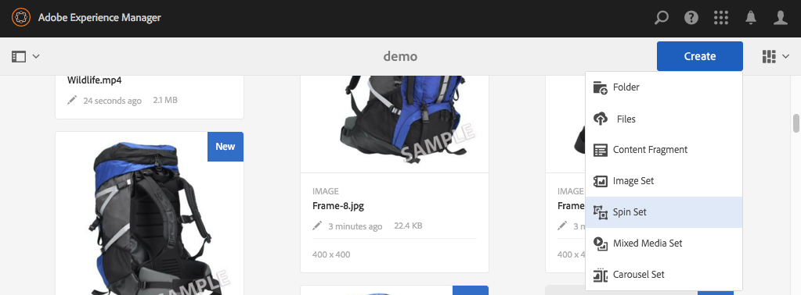

# Set 360 gradi {#spin-sets}

Un set 360 gradi simula la rotazione reale di un oggetto per esaminarlo. I set 360 gradi consentono di visualizzare gli elementi da qualsiasi angolo, ottenendo i dettagli visivi chiave da qualsiasi angolazione.

Un set 360 gradi simula un’esperienza di visualizzazione a 360 gradi. Dynamic Media offre set 360 gradi con asse singolo in cui gli utenti possono ruotare un elemento. Inoltre, gli utenti possono effettuare lo zoom &quot;a mano libera&quot; e scorrere qualsiasi visualizzazione con pochi semplici clic del mouse. In questo modo, gli utenti possono esaminare un elemento più da vicino da un particolare punto di vista.

Spin Sets are designated by a banner with the word **[!UICONTROL SPINSET]**. In addition, if the Spin Set is published, then the publish date, indicated by the **[!UICONTROL World]** icon is on the banner along with the last modification date, indicated by the **[!UICONTROL Pencil]** icon displays.

>[!NOTE]
>
>Per informazioni sull’interfaccia utente di Assets, consulta [Gestione delle risorse con l’interfaccia](managing-assets-touch-ui.md)touch.

## Avvio rapido: Set 360 gradi {#quick-start-spin-sets}

Per iniziare rapidamente a usare i set 360 gradi, effettuate le seguenti operazioni:

1. [Caricate le immagini per più viste.](#uploading-assets-for-spin-sets)

   Per un set 360 gradi monodimensionale, sono necessari almeno 8-12 scatti di un elemento e 16-24 scatti per un set 360 gradi bidimensionale. Le riprese devono essere effettuate a intervalli regolari per dare l’impressione che l’elemento stia ruotando e sia capovolto. Ad esempio, se un set 360 gradi monodimensionale include 12 scatti, ruotate l’elemento di 30 gradi (360/12) per ciascuna ripresa.

1. [Creare set 360 gradi.](#creating-spin-sets)

   Per creare un set 360 gradi, selezionate **[!UICONTROL Crea > Set]** 360 gradi, quindi assegnate un nome al set, scegliete le risorse e ordinate le immagini nell’ordine in cui appariranno.

   See [Working with Selectors](working-with-selectors.md).

   >[!NOTE]
   >
   >You can also create Spin Sets automatically through [batch set presets](/help/assets/config-dms7.md#creating-batch-set-presets-to-auto-generate-image-sets-and-spin-sets).
   *I set di batch vengono creati dall’IPS (Image Production System) come parte dell’assimilazione delle risorse e sono disponibili solo in modalità* Dynamic Media - Scene7.

1. Impostate i predefiniti per visualizzatori di set 360 gradi in base alle vostre esigenze.

   Gli amministratori possono creare o modificare i predefiniti per visualizzatori di set 360 gradi. To see your Spin Set with a Viewer preset, select the Spin Set, and in the left-rail drop-down menu, select **[!UICONTROL Viewers]**.

   Consultate **[!UICONTROL Strumenti > Risorse > Predefiniti]** visualizzatore per creare o modificare i predefiniti per visualizzatori.

   Consultate [Aggiunta e modifica dei predefiniti per visualizzatori.](managing-viewer-presets.md)

1. [Visualizzazione di set](#viewing-spin-sets)360 gradi

   Potete visualizzare e accedere ai set creati mediante i predefiniti per set di batch in tre modi diversi. (i set creati utilizzando i predefiniti per set di batch *non* vengono visualizzati nell’interfaccia utente).

1. [Anteprima set 360 gradi](previewing-assets.md)

   Selezionate il set 360 gradi ed effettuate l’anteprima. Ruotate il set 360 gradi. Potete scegliere diversi visualizzatori dal menu **[!UICONTROL Visualizzatori]** , disponibile dal menu a discesa della barra a sinistra.

1. [Pubblicare Set 360 gradi](publishing-dynamicmedia-assets.md)

   La pubblicazione di un set 360 gradi attiva l’ordine in cui le immagini vengono visualizzate in un set 360 gradi. Accertatevi di ordinarli in modo che la rotazione sia una vista a 360 gradi uniforme.**[!UICONTROL Stringa URL]** e **[!UICONTROL Incorpora]** . Inoltre, dovete [pubblicare il predefinito](managing-viewer-presets.md)per visualizzatori.

1. [Collegare gli URL all’applicazione](linking-urls-to-yourwebapplication.md) Web o [incorporare il visualizzatore](embed-code.md)video o immagini.

    AEM Assets crea richieste URL per i set 360 gradi e le attiva dopo la pubblicazione dei set 360 gradi. Potete copiare questi URL quando visualizzate l’anteprima delle risorse. In alternativa, potete incorporarli nel sito Web.

   Seleziona il set a 360 gradi, quindi fai clic su **[!UICONTROL Visualizzatori]** nel menu a discesa della barra a sinistra.

   Consulta le sezioni [Collegamento di un set 360 gradi a una pagina web](linking-urls-to-yourwebapplication.md) e [Incorporamento di un visualizzatore di video o immagini](embed-code.md).

Se necessario, potete [modificare i set](#editing-spin-sets)360 gradi. Inoltre, potete visualizzare e modificare le proprietà [del set](managing-assets-touch-ui.md#editing-properties)360 gradi.

## Caricamento delle risorse per i set 360 gradi {#uploading-assets-for-spin-sets}

Per un set 360 gradi monodimensionale, sono necessari almeno 8-12 scatti di un elemento e 16-24 scatti per un set 360 gradi bidimensionale. Le riprese devono essere effettuate a intervalli regolari per dare l’impressione che l’elemento stia ruotando e sia capovolto. Ad esempio, se un set 360 gradi monodimensionale include 12 scatti, ruotate l’elemento di 30 gradi (360/12) per ciascuna ripresa.

Potete caricare le immagini per i set 360 gradi come fareste per [caricare qualsiasi altra risorsa in  AEM Assets](managing-assets-touch-ui.md).

### Linee guida per lo scatto di immagini per set 360 gradi {#guidelines-for-shooting-spin-set-images}

Di seguito sono riportate alcune best practice per le immagini dei set 360 gradi. In generale, più immagini si trovano in un set 360 gradi, migliore sarà l’effetto di rotazione dell’immagine. Tuttavia, l’inclusione di molte immagini nel set aumenta anche il tempo necessario al caricamento delle immagini. AEM consigliate le seguenti linee guida per lo scatto di immagini da usare nei set 360 gradi:

* Utilizzate almeno 8-12 immagini in un set 360 gradi monodimensionale e 16-24 immagini in un set 360 gradi bidimensionale. Per poter ruotare di 360 gradi è necessario disporre di almeno 8 immagini. I set 360 gradi monodimensionali sono più comuni quando la creazione di set 360 gradi bidimensionali richiede molta manodopera.
* Utilizzare un formato senza perdita di dati; Si consigliano TIFF e PNG.
* Mascherate tutte le immagini in modo che l’elemento venga visualizzato su uno sfondo bianco puro o su un altro sfondo ad alto contrasto. Se necessario, aggiungete ombre.
* Accertatevi che i dettagli del prodotto siano ben illuminati e messi a fuoco.
* Scattare immagini per capi di abbigliamento di moda con un manichino o un modello. Spesso il manichino è completamente mascherato (utilizzando un manichino in vetro) oppure nell’immagine è visibile un manichino/un set di cornici stilizzato. Potete creare un set 360 gradi su un modello definendo il numero di angoli. Contrassegnare ogni angolo con nastro sul pavimento per guidare il modello a passo e guardare nella direzione di ogni ripresa.

## Creazione di set 360 gradi {#creating-spin-sets}

Ordine in cui le immagini vengono visualizzate in un set 360 gradi Accertatevi di ordinarli in modo che la rotazione sia una vista a 360 gradi uniforme.

>[!NOTE]
>
>Puoi anche creare in automatico i set 360 gradi da [predefiniti set di batch](/help/assets/config-dms7.md#creating-batch-set-presets-to-auto-generate-image-sets-and-spin-sets).
I set di batch vengono creati dall’IPS (Image Production System) come parte dell’assimilazione delle risorse e sono disponibili solo in modalità Dynamic Media - Scene7.
>
>Consultate &quot;Creazione di predefiniti per set di batch per generare automaticamente set di immagini e set 360 gradi&quot; in [Configurazione di elementi multimediali dinamici - Modalità](/help/assets/config-dms7.md#creating-batch-set-presets-to-auto-generate-image-sets-and-spin-sets)Scene7.

**Per creare dei set 360 gradi:**

1. In Assets, navigate to where you want to create a spin set, tap **[!UICONTROL Create]**, and select **[!UICONTROL Spin Set**. Puoi anche creare il set dall’interno di una cartella contenente le risorse.

   

1. Nella pagina Editor **[!UICONTROL set]** 360 gradi, immettete un nome per il set 360 gradi nel campo **[!UICONTROL Titolo]** . Il nome viene visualizzato nel banner lungo il set 360 gradi. Facoltativamente, immettete una descrizione.

   

   Quando create il set 360 gradi, potete modificare la miniatura del set 360 gradi o consentire AEM selezionare la miniatura automaticamente in base alle risorse del set 360 gradi. Per selezionare una miniatura, toccate **[!UICONTROL Cambia miniatura]**. Selezionate un’immagine (per trovare le immagini potete spostarvi anche in altre cartelle). If you have selected a thumbnail and then decide that you want AEM to generate one from the spin set, select **[!UICONTROL Switch to Automatic thumbnail]**.

1. Effettuate una delle seguenti operazioni:

   * Nell’angolo in alto a sinistra della pagina Editor **[!UICONTROL set]** 360 gradi, toccate **[!UICONTROL Aggiungi risorsa]**.
   * Al centro della pagina Editor **[!UICONTROL set]** 360 gradi, toccate **[!UICONTROL Toccate per aprire il selettore]** risorse.

   Toccate per selezionare le risorse da includere nel set 360 gradi. Le risorse selezionate dispongono di un’icona a forma di segno di spunta. When you are finished, near the upper-right corner of the page, tap **[!UICONTROL Select]**.

   Con il Selettore risorse, puoi cercare le risorse digitando una parola chiave e toccando **[!UICONTROL Invio]**. Per perfezionare i risultati della ricerca, puoi anche applicare i filtri. Puoi filtrare in base a percorso, raccolta, tipo di file e tag. Seleziona il filtro e tocca l’icona **[!UICONTROL Filtro]** nella barra degli strumenti. Per modificare la visualizzazione, nell’angolo superiore destro della pagina toccate l’icona **[!UICONTROL Visualizza]** , quindi toccate Visualizzazione **** colonne, Visualizzazione **** a schede o Visualizzazione **** elenco.

   See [Working with Selectors](working-with-selectors.md).

   

1. Quando aggiungete delle risorse al set, queste vengono automaticamente aggiunte in ordine alfanumerico. Potete riordinare o ordinare manualmente le risorse dopo averle aggiunte. Se necessario, trascinate l’icona **[!UICONTROL Riordinamento]** di una risorsa a destra del nome file della risorsa per riordinare le immagini verso l’alto o verso il basso nell’elenco dei set.

   

1. (Facoltativo) Effettuate una delle seguenti operazioni:

   * Per eliminare un’immagine, selezionatela, quindi toccate **[!UICONTROL Elimina risorsa]**.
   * To apply a preset, near the upper-right corner of the page, tap **[!UICONTROL Preset]**, then select a preset to apply to all the assets at once.

1. Toccate **[!UICONTROL Salva]**. Il set 360 gradi appena creato viene visualizzato nella cartella in cui è stato creato.

## Visualizzazione di set 360 gradi {#viewing-spin-sets}

Potete creare i set 360 gradi nell’interfaccia utente o automaticamente utilizzando i predefiniti per set di [batch](/help/assets/config-dms7.md#creating-batch-set-presets-to-auto-generate-image-sets-and-spin-sets). Tuttavia, i set creati utilizzando i predefiniti per set di batch *non* vengono visualizzati nell’interfaccia utente. Potete accedere ai set creati mediante i predefiniti per set di batch in tre modi diversi. (Questi metodi sono disponibili anche se avete creato i set 360 gradi nell’interfaccia utente).

Potete inoltre visualizzare i set mediante l’interfaccia utente come descritto in [Modifica di set](#editing-spin-sets)360 gradi.

**Per visualizzare i set 360 gradi:**

1. Quando si aprono le proprietà di una singola risorsa. Le proprietà indicano i set di cui la risorsa selezionata è membro (in **[!UICONTROL Membro dei set]**). Toccate il nome del set per visualizzare l’intero set.

   

1. Da un’immagine inclusa in un qualsiasi set. Select the **[!UICONTROL Sets]** menu to display the sets that the asset is a member of.

   

1. From search, you can select **[!UICONTROL Filters]**, then expand **[!UICONTROL Dynamic Media]** and select **[!UICONTROL Sets]**.

   La ricerca restituisce i set corrispondenti creati manualmente nell’interfaccia utente o automaticamente tramite i predefiniti per set di batch. Per i set automatizzati, la query di ricerca viene eseguita utilizzando **[!UICONTROL Inizia con]** criteri di ricerca diversi dalla ricerca AEM basata sull&#39;utilizzo dei criteri di ricerca **[!UICONTROL Contiene]** . L&#39;impostazione del filtro su **[!UICONTROL Set]** è l&#39;unico modo per eseguire ricerche nei set automatizzati.

   

## Modifica dei set 360 gradi {#editing-spin-sets}

Potete eseguire diverse attività di modifica sui set 360 gradi, ad esempio:

* Aggiungete immagini al set 360 gradi.
* Riordinare le immagini nel set 360 gradi.
* Potete eliminare le risorse nel set 360 gradi.
* Applicate i predefiniti per visualizzatori.
* Eliminate il set 360 gradi.

**Per modificare un set 360 gradi:**

1. Effettuate una delle seguenti operazioni:

   * Passate il puntatore del mouse su una risorsa set 360 gradi, quindi toccate **[!UICONTROL Modifica]** (icona matita).
   * Passate il puntatore del mouse su una risorsa set 360 gradi, toccate **[!UICONTROL Seleziona]** (icona a forma di segno di spunta), quindi toccate **[!UICONTROL Modifica]** nella barra degli strumenti.
   * Toccate una risorsa set 360 gradi, quindi toccate **[!UICONTROL Modifica]** (icona matita) nella barra degli strumenti.

1. Per modificare il set 360 gradi, effettuate una delle seguenti operazioni:

   * Per riordinare le immagini, trascinate un’immagine in una nuova posizione (selezionate l’icona di riordinamento per spostare gli elementi).
   * Per ordinare gli elementi in ordine crescente o decrescente, toccate l’intestazione della colonna.
   * Per aggiungere una risorsa o aggiornare una risorsa esistente, toccate **[!UICONTROL Aggiungi risorsa]**. Andate a una risorsa, selezionatela, quindi toccate **[!UICONTROL Seleziona]** vicino all&#39;angolo superiore destro.
Se eliminate l’immagine che AEM usata per la miniatura sostituendola con un’altra immagine, viene comunque visualizzata la risorsa originale.
   * Per eliminare una risorsa, selezionatela e toccate **[!UICONTROL Elimina risorsa]**.
   * Per applicare un predefinito, toccate l’icona **[!UICONTROL Predefinito]** e selezionate un predefinito.
   * Per eliminare un intero set 360 gradi, selezionatelo e selezionate **[!UICONTROL Elimina]**

      >[!NOTE]
      >* You can edit the images in a Spin Set by navigating to the set, tap **[!UICONTROL Set Members]** in the left rail, and then tap the **[!UICONTROL Edit]** (pencil icon) on an individual asset to open the editing window.

1. Al termine della modifica, fate clic su **[!UICONTROL Salva]** .

## Anteprima dei set 360 gradi {#previewing-spin-sets}

Consultate [Anteprima delle risorse](previewing-assets.md).

## Pubblicazione di set 360 gradi {#publishing-spin-sets}

Consultate [Pubblicazione delle risorse](publishing-dynamicmedia-assets.md).
