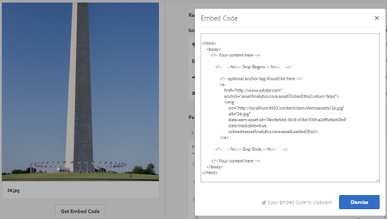

# Informazioni sulla risorsa {#asset-insights}

Scopri come la funzione Asset Insights consente di monitorare le valutazioni degli utenti e le statistiche di utilizzo delle risorse utilizzate nei siti Web di terze parti, nelle campagne di marketing e  Adobe  soluzioni creative.

La funzione Asset Insights consente di monitorare le valutazioni degli utenti e le statistiche di utilizzo delle risorse utilizzate nei siti Web di terze parti, nelle campagne di marketing e  Adobi  soluzioni creative per ricavare informazioni sulle loro prestazioni e popolarità.

Assets Insights acquisisce i dettagli dell’attività dell’utente, ad esempio il numero di volte in cui una risorsa viene valutata, su cui è stato fatto clic e le impression (numero di volte in cui la risorsa viene caricata sul sito Web). Esso assegna i punteggi alle risorse in base a tali statistiche. Puoi usare le statistiche relative a valutazioni e prestazioni per selezionare le risorse più utilizzate da includere nei cataloghi, nelle campagne di marketing e così via. Puoi anche formulare criteri per l’archiviazione e il rinnovo delle licenze per le risorse in base a tali statistiche.

Per acquisire le statistiche di utilizzo per le risorse da un sito Web, è necessario includere il codice da incorporare per la risorsa nel codice del sito Web.

Per consentire a Informazioni sulle risorse di visualizzare le statistiche di utilizzo per le risorse, configurate prima la funzione da cui recuperare i dati di reporting [!DNL Adobe Analytics]. Per informazioni dettagliate, consultate [Configurare approfondimenti](touch-ui-configuring-asset-insights.md)risorse.

>[!NOTE]
>
>Le informazioni approfondite sono supportate e fornite solo per le immagini.

## Visualizzare le statistiche per una risorsa {#viewing-statistics-for-an-asset}

Potete visualizzare i punteggi di Asset Insights dalla pagina dei metadati.

1. Dall’interfaccia utente di Risorse, selezionate la risorsa, quindi toccate o fate clic sull’icona **[!UICONTROL Proprietà]** nella barra degli strumenti.
1. Dalla pagina Proprietà, tocca o fai clic sulla scheda **[!UICONTROL Insights]** (Approfondimenti).
1. Consultate i dettagli di utilizzo della risorsa nella scheda **[!UICONTROL Insights]** (Approfondimenti). La sezione **[!UICONTROL Punteggio]** descrive l’utilizzo totale delle risorse e le risorse a livello di prestazioni di una risorsa.

   La valutazione dell&#39;utilizzo descrive il numero di volte in cui la risorsa viene utilizzata in varie soluzioni.

   Il punteggio **[!UICONTROL Impression]** indica quante volte la risorsa viene caricata sul sito Web. Il numero visualizzato in **[!UICONTROL Clic]** indica quante volte è possibile fare clic sulla risorsa.

1. Consultate la sezione Statistiche **[!UICONTROL di]** utilizzo per sapere di quali entità faceva parte la risorsa e di quali soluzioni creative ha utilizzato di recente. Maggiore è l’utilizzo, maggiori saranno le probabilità che la risorsa sia popolare tra gli utenti. I dati di utilizzo vengono visualizzati sotto le intestazioni seguenti:

   * **[!UICONTROL Risorsa]**: Il numero di volte in cui la risorsa faceva parte di una raccolta o di una risorsa composta
   * **[!UICONTROL Web e dispositivi mobili]**: Il numero di volte in cui la risorsa faceva parte di siti Web e app
   * **[!UICONTROL Social]**: Il numero di volte in cui la risorsa è stata utilizzata nelle soluzioni, come  Adobe Social e  Adobe Campaign
   * **[!UICONTROL E-mail]**: Numero di volte in cui la risorsa è stata utilizzata nelle campagne e-mail

   

   >[!NOTE]
   >
   >Poiché la funzione Asset Insights in genere raccoglie i dati delle soluzioni da  Adobe Analytics in modo periodico, la sezione Soluzioni potrebbe non visualizzare i dati più recenti. Il periodo di tempo per il quale i dati vengono visualizzati dipende dalla pianificazione dell&#39;operazione di recupero eseguita da Asset Insights per recuperare i dati Analytics.

1. Per visualizzare graficamente le statistiche sulle prestazioni della risorsa in un arco di tempo, seleziona il periodo nella sezione **[!UICONTROL Statistiche di prestazioni]**. I dettagli, compresi clic e impression, vengono visualizzati come linee di tendenza di un grafico.

   

   >[!NOTE]
   >
   >A differenza dei dati nella sezione Soluzioni, nella sezione Statistiche prestazioni vengono visualizzati i dati più recenti.

1. Per ottenere il codice da incorporare per la risorsa che includete nei siti Web per ottenere i dati sulle prestazioni, toccate o fate clic su **[!UICONTROL Ottieni codice]** da incorporare sotto la miniatura della risorsa. Per ulteriori informazioni su come includere il codice da incorporare nelle pagine Web di terze parti, consultate [Utilizzo del tracciatore di pagina e codice da incorporare nelle pagine](touch-ui-using-page-tracker.md)Web.

   

## Visualizzare le statistiche aggregate per le risorse {#viewing-aggregate-statistics-for-assets}

Dalla **[!UICONTROL Visualizzazione approfondimenti]** puoi visualizzare simultaneamente un punteggio di tutte le risorse presenti all’interno di una cartella.

1. Nell’interfaccia utente Risorse, passa alla cartella contenente le risorse per le quali vuoi visualizzare informazioni.
1. Toccate o fate clic sull&#39;icona Layout dalla barra degli strumenti, quindi scegliete Visualizzazione **[!UICONTROL approfondimenti]**.
1. Nella pagina vengono visualizzati i punteggi di utilizzo delle risorse. Confronta le valutazioni delle varie risorse e trai informazioni approfondite.

## Pianificazione processo in background {#scheduling-background-job}

Asset Insights recupera i dati di utilizzo delle risorse dalle suite di rapporti di  Adobe Analytics in modo periodico. Per impostazione predefinita, Asset Insights esegue un processo in background ogni 24 ore alle 2 del mattino fino ai dati di recupero. Tuttavia, potete modificare sia la frequenza che l’ora configurando il servizio **[!UICONTROL sincronizzazione dei processi]** di sincronizzazione delle prestazioni delle risorse di Adobe CQ DAM dalla console Web.

1. Tocca il logo AEM e vai a **[!UICONTROL Strumenti > Operazioni > Console web]**.
1. Aprite la configurazione del servizio **[!UICONTROL servizio di sincronizzazione dei processi]** di prestazioni delle risorse Adobe CQ DAM.

   

1. Specificate la frequenza di pianificazione desiderata e l&#39;ora di inizio del processo nell&#39;espressione utilità di pianificazione delle proprietà. Salva le modifiche.
