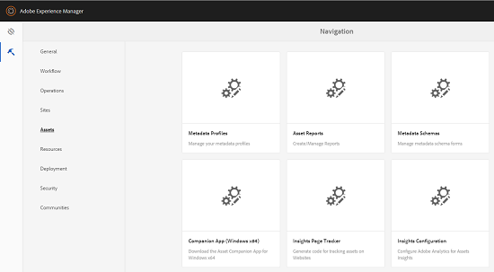

# Configurazione di approfondimenti sulle risorse {#configuring-asset-insights}

Adobe Experience Manager (AEM) Assets recupera i dati di utilizzo AEM risorse utilizzate da siti Web di terze parti da  Adobe Analytics. Per abilitare Asset Insights per recuperare questi dati e generare approfondimenti, configura innanzitutto la funzione da integrare con  Adobe Analytics.

>[!NOTE]
>
>Le informazioni approfondite sono supportate e fornite solo per le immagini.

1. In AEM, fai clic su **[!UICONTROL Strumenti > Risorse]**.

   

1. Fai clic sulla scheda **[!UICONTROL Configurazione approfondimenti]**.
1. Nella procedura guidata, selezionate un centro dati e fornite le credenziali, incluso il nome dell&#39;organizzazione, il nome utente e la password.

   

1. Tocca o fai clic su **[!UICONTROL Autentica]**.
1. Dopo aver AEM autenticato le credenziali, dall’elenco Suite **[!UICONTROL di]** rapporti, scegliete una suite di rapporti Adobe Analytics  da cui recuperare i dati in Asset Insights. Fate clic su **[!UICONTROL Aggiungi]**.
1. Dopo aver impostato AEM suite di rapporti, tocca o fai clic su **[!UICONTROL Fine]**.

## Tracciatore pagina {#page-tracker}

Dopo aver configurato l’account Analytics, viene generato il codice Page Tracker. Per abilitare Assets Insights a tracciare AEM risorse utilizzate in siti Web di terze parti, includi il codice di tracciamento delle pagine nel codice del sito Web. Utilizzate l&#39;utility Page Tracker in  AEM Assets per generare il codice di tracciamento pagina. Per ulteriori informazioni su come includere il codice Tracciatore pagina nelle pagine Web di terze parti, vedere [Utilizzo del tracciatore pagina e codice da incorporare nelle pagine](touch-ui-using-page-tracker.md)Web.

1. In AEM, click the **[!UICONTROL Tools > Assets]**.

   

1. Nella pagina **[!UICONTROL Navigazione]**, fai clic sulla scheda **[!UICONTROL Tracciamento pagina approfondimenti]**.
1. Fate clic sull&#39;icona **[!UICONTROL Scarica]** per scaricare il codice tracciatore di pagina.