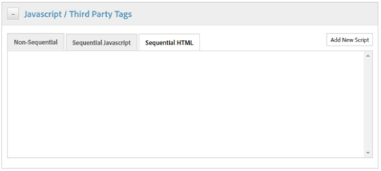

# Abilitazione di approfondimenti sulle risorse tramite DTM {#enabling-asset-insights-through-dtm}

 Gestione tag dinamica dei Adobi è uno strumento che attiva i tuoi strumenti di marketing digitale. È disponibile gratuitamente per  clienti Adobe Analytics. Puoi personalizzare il codice di tracciamento per abilitare soluzioni CMS di terze parti all’utilizzo di Asset Insights oppure puoi utilizzare DTM per inserire tag Asset Insights. Le informazioni approfondite sono supportate e fornite solo per le immagini.

>[!CAUTION]
>
> DTM Adobe è obsoleto a favore di  Adobe Experience Platform Launch e raggiungerà presto [fine del ciclo di vita](https://medium.com/launch-by-adobe/dtm-plans-for-a-sunset-3c6aab003a6f).  Adobe consiglia di [utilizzare Launch per informazioni approfondite sulle risorse](https://experienceleague.adobe.com/docs/experience-manager-learn/assets/advanced/asset-insights-launch-tutorial.html).

Per abilitare Asset Insights tramite Gestione dinamica dei tag, effettuate le seguenti operazioni:

1. Toccate/fate clic sul logo AEM, quindi andate a **[!UICONTROL Strumenti > Risorse > Configurazione approfondimenti]**.
1. [Configurare AEM&#39;istanza con il Cloud Service DTM](../sites-administering/dtm.md)

   Il token API dovrebbe essere disponibile dopo l&#39;accesso a [https://dtm.adobe.com](https://dtm.adobe.com/) e visitare **[!UICONTROL Impostazioni account]** dall&#39;icona Profilo. Questo passaggio non è richiesto dal punto di vista di Asset Insights, perché l&#39;integrazione di  AEM Sites con Asset Insights è ancora in corso.

1. Accedete a [https://dtm.adobe.com](https://dtm.adobe.com/) e selezionate una Società, a seconda delle necessità.
1. Creare/aprire una proprietà Web esistente

   * Selezionate la scheda **[!UICONTROL Proprietà Web]**, quindi toccate o fate clic su **[!UICONTROL Aggiungi proprietà]**.
   * Aggiornate i campi come appropriato, quindi toccate o fate clic su **[!UICONTROL Crea proprietà]** (consultate [documentation](https://helpx.adobe.com/experience-manager/using/dtm.html)).

   

1. Nella scheda **[!UICONTROL Regole]**, selezionare **[!UICONTROL Regole di caricamento pagina]** dal riquadro di navigazione e toccare o fare clic su **[!UICONTROL Crea nuova regola]**.

   

1. Espandere **[!UICONTROL Javascript /Tag di terze parti]**. Quindi toccate/fate clic su **[!UICONTROL Aggiungi nuovo script]** nella scheda **[!UICONTROL HTML sequenziale]** per aprire la finestra di dialogo Script.

   

1. Toccate/fate clic sul logo AEM, quindi andate a **[!UICONTROL Strumenti > Risorse]**.
1. Toccate/fate clic su **[!UICONTROL Insights Page Tracker]**, copiate il codice di tracciamento, quindi incollatelo nella finestra di dialogo Script aperta al punto 6. Salva le modifiche.

   >[!NOTE]
   >
   >* `AppMeasurement.js` è stato rimosso. È previsto che sia disponibile tramite lo strumento Adobe Analytics  di Gestione dinamica dei tag.
   >* La chiamata a `assetAnalytics.dispatcher.init()` viene rimossa. La funzione verrà chiamata una volta terminato il caricamento dello strumento Adobe Analytics  DTM.
   >* A seconda di dove è ospitato Asset Insights Page Tracker (ad esempio AEM, CDN e così via), l&#39;origine della sorgente dello script potrebbe richiedere delle modifiche.
   >* Per il Tracker di pagina ospitato AEM, l&#39;origine deve puntare a un&#39;istanza di pubblicazione utilizzando il nome host dell&#39;istanza del dispatcher.


1. Aprire [https://dtm.adobe.com](https://dtm.adobe.com). Fare clic su Panoramica nella proprietà Web e quindi su Aggiungi strumento o aprire uno strumento Adobe Analytics  esistente. Durante la creazione dello strumento, potete impostare il metodo di configurazione su Automatico.

   

   Selezionate le suite di rapporti Staging/Produzione, a seconda delle necessità.

1. Espandere **[!UICONTROL Library Management]** e assicurarsi che **[!UICONTROL Load Library at]** sia impostato su **[!UICONTROL Page Top]**.

   

1. Espandete **[!UICONTROL Personalizza codice pagina]** e toccate o fate clic su **[!UICONTROL Apri editor]**.

   

1. Incollate il seguente codice nella finestra:

   ```java
   var sObj;
   
   if (arguments.length > 0) {
     sObj = arguments[0];
   } else {
     sObj = _satellite.getToolsByType('sc')[0].getS();
   }
   _satellite.notify('in assetAnalytics customInit');
   (function initializeAssetAnalytics() {
     if ((!!window.assetAnalytics) && (!!assetAnalytics.dispatcher)) {
       _satellite.notify('assetAnalytics ready');
       /** NOTE:
           Copy over the call to 'assetAnalytics.dispatcher.init()' from Assets Pagetracker
           Be mindful about changing the AppMeasurement object as retrieved above.
       */
       assetAnalytics.dispatcher.init(
             "",  /** RSID to send tracking-call to */
             "",  /** Tracking Server to send tracking-call to */
             "",  /** Visitor Namespace to send tracking-call to */
             "",  /** listVar to put comma-separated-list of Asset IDs for Asset Impression Events in tracking-call, e.g. 'listVar1' */
             "",  /** eVar to put Asset ID for Asset Click Events in, e.g. 'eVar3' */
             "",  /** event to include in tracking-calls for Asset Impression Events, e.g. 'event8' */
             "",  /** event to include in tracking-calls for Asset Click Events, e.g. 'event7' */
             sObj  /** [OPTIONAL] if the webpage already has an AppMeasurement object, please include the object here. If unspecified, Pagetracker Core shall create its own AppMeasurement object */
             );
       sObj.usePlugins = true;
       sObj.doPlugins = assetAnalytics.core.updateContextData;
       assetAnalytics.core.optimizedAssetInsights();
     }
     else {
       _satellite.notify('assetAnalytics not available. Consider updating the Custom Page Code', 4);
     }
   })();
   ```

   * La regola di caricamento delle pagine in Gestione dinamica dei tag include solo il codice pagetracker.js. Tutti i campi `assetAnalytics` sono considerati sostituzioni per i valori predefiniti. Non sono richiesti per impostazione predefinita.
   * Il codice chiama `assetAnalytics.dispatcher.init()` dopo aver verificato che `_satellite.getToolsByType('sc')[0].getS()` sia inizializzato e che `assetAnalytics,dispatcher.init` sia disponibile. Pertanto, potete saltare l’aggiunta al punto 11.
   * Come indicato nei commenti all&#39;interno del codice Tracciatore pagina insights (**[!UICONTROL Strumenti > Risorse > Tracciatore pagina Insights]**), quando il Tracker pagina non crea un oggetto `AppMeasurement`, i primi tre argomenti (RSID, Server di tracciamento e Spazio dei nomi dei visitatori) sono irrilevanti. Vengono invece passate stringhe vuote per evidenziare questo problema.

      Gli argomenti rimanenti corrispondono a ciò che è configurato nella pagina Insights Configuration (**[!UICONTROL Strumenti > Risorse > Insights Configuration]**).

   * L&#39;oggetto AppMeasurement viene recuperato eseguendo query su `satelliteLib` per tutti i motori di SiteCatalyst disponibili. Se sono configurati più tag, modificare l&#39;indice del selettore di array in modo appropriato. Le voci dell&#39;array sono ordinate in base agli strumenti di SiteCatalyst disponibili nell&#39;interfaccia DTM.

1. Salvare e chiudere la finestra Editor di codice, quindi salvare le modifiche nella configurazione dello strumento.
1. Nella scheda **[!UICONTROL Approvazioni]**, approvare entrambe le approvazioni in sospeso. Il tag DTM è pronto per essere inserito nella pagina Web. Per informazioni dettagliate su come inserire tag DTM nelle pagine Web, vedere [Integrazione di DTM nei modelli di pagina personalizzati](https://blogs.adobe.com/experiencedelivers/experience-management/integrating-dtm-custom-aem6-page-template/).
