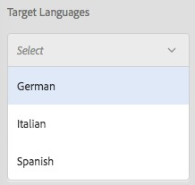

# Creazione di progetti di traduzione {#creating-translation-projects}

Per creare una copia per lingua, attiva uno dei seguenti flussi di lavoro di copia per lingua disponibili nella barra laterale Riferimenti nell’interfaccia utente Assets:

**Creare e tradurre**

In questo flusso di lavoro, le risorse da tradurre vengono copiate nella directory principale della lingua in cui desideri tradurre. Inoltre, a seconda delle opzioni selezionate, viene creato un progetto di traduzione per le risorse nella console Progetti . A seconda delle impostazioni, il progetto di traduzione può essere avviato manualmente o può essere eseguito automaticamente non appena viene creato il progetto di traduzione.

**Aggiorna copie per lingua**

Puoi eseguire questo flusso di lavoro per tradurre un gruppo aggiuntivo di risorse e includerlo in una copia per lingua per una specifica impostazione internazionale. In questo caso, le risorse tradotte vengono aggiunte alla cartella di destinazione che contiene già risorse tradotte in precedenza.

>[!NOTE]
>
>I file binari delle risorse sono tradotti solo se il fornitore di servizi di traduzione supporta la traduzione dei file binari.

>[!NOTE]
>
>Se avvii un flusso di lavoro di traduzione per risorse complesse, come file PDF e InDesign, le relative risorse secondarie o rappresentazioni (se presenti) non vengono inviate per la traduzione.

## Creare e tradurre un flusso di lavoro {#create-and-translate-workflow}

Utilizza il flusso di lavoro Crea e traduci per generare copie per lingua per una particolare lingua per la prima volta. Il flusso di lavoro fornisce le seguenti opzioni:

* Crea solo struttura
* Crea un nuovo progetto di traduzione
* Aggiungi a progetto di traduzione esistente

### Crea solo struttura {#create-structure-only}

Utilizza l’opzione **Crea solo struttura** per creare una gerarchia di cartelle di destinazione all’interno della directory principale lingua di destinazione, in modo che corrisponda alla gerarchia della cartella di origine all’interno della directory principale lingua di origine. In questo caso, le risorse di origine vengono copiate nella cartella di destinazione. Tuttavia, non viene generato alcun progetto di traduzione.

1. Nell’interfaccia utente di Assets, seleziona la cartella di origine per la quale vuoi creare una struttura nella directory principale della lingua di destinazione.
1. Apri il riquadro **[!UICONTROL Riferimenti]** e tocca o fai clic su **[!UICONTROL Copie per lingua]** sotto **[!UICONTROL Copie]**.

   

1. Tocca o fai clic su **[!UICONTROL Crea e traduci]** in basso.

   

1. Dall’elenco **[!UICONTROL Lingue di destinazione]**, seleziona la lingua per la quale vuoi creare una struttura di cartelle.

   

1. Dall’elenco **[!UICONTROL Progetto]**, scegli **[!UICONTROL Crea solo struttura]**.

   

1. Tocca o fai clic su **[!UICONTROL Crea]**. La nuova struttura per la lingua di destinazione è elencata in **[!UICONTROL Copie per lingua]**.

   

1. Tocca o fai clic sulla struttura dell’elenco, quindi tocca o fai clic su **[!UICONTROL Mostra in Assets]** per accedere alla struttura delle cartelle nella lingua di destinazione.

   

### Crea un nuovo progetto di traduzione {#create-a-new-translation-project}

Se utilizzi questa opzione, le risorse da tradurre vengono copiate nella directory principale della lingua in cui desideri tradurre. A seconda delle opzioni selezionate, viene creato un progetto di traduzione per le risorse nella console Progetti . A seconda delle impostazioni, il progetto di traduzione può essere avviato manualmente o viene eseguito automaticamente non appena viene creato il progetto di traduzione.

1. Nell’interfaccia utente Assets, seleziona la cartella di origine per la quale vuoi creare una copia in lingua.
1. Apri il riquadro **[!UICONTROL Riferimenti]** e tocca o fai clic su **[!UICONTROL Copie per lingua]** sotto **[!UICONTROL Copie]**.

   

1. Tocca o fai clic su **[!UICONTROL Crea e traduci]** in basso.

   

1. Nell’elenco **[!UICONTROL Lingue di destinazione]**, seleziona le lingue per le quali vuoi creare una struttura di cartelle.

   

1. Dall’elenco **[!UICONTROL Progetto]**, seleziona **[!UICONTROL Crea un nuovo progetto di traduzione]**.

   

1. Nel campo **[!UICONTROL Titolo progetto]**, inserisci un titolo.

   

1. Tocca o fai clic su **[!UICONTROL Crea]**. Le risorse della cartella di origine vengono copiate nelle cartelle di destinazione per le impostazioni internazionali selezionate al passaggio 4.

   

1. Per passare alla cartella, seleziona la copia per lingua e fai clic su **[!UICONTROL Mostra in Assets]**.

   

1. Passa alla console Progetti . La cartella di traduzione viene copiata nella console Progetti .

   

1. Apri la cartella per visualizzare il progetto di traduzione.

   

1. Tocca o fai clic sul progetto per aprire la pagina dei dettagli.

   

1. Per visualizzare lo stato del lavoro di traduzione, fai clic sull&#39;ellissi nella parte inferiore della sezione **[!UICONTROL Processo di traduzione]** .

   

   Per ulteriori dettagli sugli stati dei processi, consulta [Monitoraggio dello stato di un processo di traduzione](/help/sites-administering/tc-manage.md#monitoring-the-status-of-a-translation-job).

1. Passa all’interfaccia utente Assets e apri la pagina Proprietà per ciascuna risorsa tradotta per visualizzare i metadati tradotti.

   

   >[!NOTE]
   >
   >Questa funzione è disponibile sia per le risorse che per le cartelle. Quando una risorsa viene selezionata al posto di una cartella, l’intera gerarchia di cartelle nella directory principale lingua viene copiata per creare una copia per la lingua della risorsa.

### Aggiungi a progetto di traduzione esistente {#add-to-existing-translation-project}

Se utilizzi questa opzione, il flusso di lavoro di traduzione viene eseguito per le risorse aggiunte alla cartella di origine dopo aver eseguito un flusso di lavoro di traduzione precedente. Solo le risorse appena aggiunte vengono copiate nella cartella di destinazione che contiene le risorse tradotte in precedenza. In questo caso non viene creato alcun nuovo progetto di traduzione.

1. Nell’interfaccia utente Assets, passa alla cartella di origine contenente le risorse non tradotte.
1. Seleziona una risorsa da tradurre e apri il **[!UICONTROL riquadro Riferimento]**. Nella sezione **[!UICONTROL Copie per lingua]** viene visualizzato il numero di copie di traduzione attualmente disponibili.
1. Nella sezione **[!UICONTROL Copie per lingua]**, tocca o fai clic su **[!UICONTROL Copie]**. Viene visualizzato un elenco delle copie di traduzione disponibili.
1. Tocca o fai clic su **[!UICONTROL Crea e traduci]** in basso.

   

1. Nell’elenco **[!UICONTROL Lingue di destinazione]**, seleziona le lingue per le quali vuoi creare una struttura di cartelle.

   

1. Dall’elenco **[!UICONTROL Progetto]**, seleziona **[!UICONTROL Aggiungi al progetto di traduzione esistente]** per eseguire il flusso di lavoro di traduzione nella cartella.

   

   >[!NOTE]
   >
   >Se scegli l’opzione **[!UICONTROL Aggiungi al progetto di traduzione esistente]**, il progetto di traduzione viene aggiunto a un progetto preesistente solo se le impostazioni del progetto corrispondono esattamente alle impostazioni del progetto preesistente. In caso contrario, viene creato un nuovo progetto.

1. Dall’elenco **[!UICONTROL Progetto di traduzione esistente]** , seleziona un progetto per aggiungere la risorsa da tradurre.

   

1. Tocca o fai clic su **[!UICONTROL Crea]**. Le risorse da tradurre vengono aggiunte alla cartella di destinazione. La cartella aggiornata è elencata nella sezione **[!UICONTROL Copie per lingua]**.

   

1. Passa alla console Progetti e apri il progetto di traduzione esistente a cui hai aggiunto.
1. Tocca o fai clic sulla pagina dei dettagli del progetto di traduzione.

   

1. Tocca o fai clic sui puntini di sospensione nella parte inferiore della sezione **Processo di traduzione** per visualizzare le risorse nel flusso di lavoro di traduzione. Nell’elenco dei processi di traduzione vengono visualizzate anche le voci per i metadati risorsa e i tag. Queste voci indicano che anche i metadati e i tag per le risorse vengono tradotti.

   >[!NOTE]
   >
   >Se elimini la voce per tag o metadati, non vengono tradotti tag o metadati per nessuna delle risorse.

   >[!NOTE]
   >
   >Se utilizzi la traduzione automatica, i file binari delle risorse non vengono tradotti.

   >[!NOTE]
   >
   >Se la risorsa aggiunta al processo di traduzione include le risorse secondarie, selezionale e rimuoverle affinché la traduzione prosegua senza problemi.

1. Per avviare la traduzione delle risorse, tocca o fai clic sulla freccia nella sezione **[!UICONTROL Processo di traduzione]** e seleziona **[!UICONTROL Avvia]** dall’elenco.

   

   Un messaggio notifica l’inizio del processo di traduzione.

   

1. Per visualizzare lo stato del lavoro di traduzione, tocca o fai clic sui puntini di sospensione nella parte inferiore della sezione **[!UICONTROL Processo di traduzione]** .

   

   Per ulteriori dettagli, consulta [Monitoraggio dello stato di un lavoro di traduzione](/help/sites-administering/tc-manage.md#monitoring-the-status-of-a-translation-job).

1. Al termine della traduzione, lo stato diventa Pronto per la revisione. Passa all’interfaccia utente Assets e apri la pagina Proprietà per ciascuna risorsa tradotta per visualizzare i metadati tradotti.

## Aggiorna copie per lingua {#update-language-copies}

Esegui questo flusso di lavoro per tradurre qualsiasi set aggiuntivo di risorse e includerlo in una copia della lingua per una particolare impostazione internazionale. In questo caso, le risorse tradotte vengono aggiunte alla cartella di destinazione che contiene già risorse tradotte in precedenza. A seconda della scelta delle opzioni, viene creato un progetto di traduzione o viene aggiornato un progetto di traduzione esistente per le nuove risorse. Il flusso di lavoro per la copia in lingua di aggiornamento include le seguenti opzioni:

* Crea un nuovo progetto di traduzione
* Aggiungi a progetto di traduzione esistente

### Crea un nuovo progetto di traduzione {#create-a-new-translation-project-1}

Se utilizzi questa opzione, viene creato un progetto di traduzione per il set di risorse per il quale desideri aggiornare una copia per lingua.

1. Dall’interfaccia utente Assets, seleziona la cartella di origine in cui hai aggiunto una risorsa.
1. Apri il riquadro **[!UICONTROL Riferimenti]** e, per visualizzare l’elenco delle copie per lingua, in **[!UICONTROL Copie]**, tocca o fai clic su **[!UICONTROL Copie per lingua]**.
1. Seleziona la casella di controllo che precede **[!UICONTROL Copie per lingua]**, quindi fai clic sulla cartella di destinazione che corrisponde alle impostazioni internazionali appropriate.

   

1. Tocca o fai clic su **[!UICONTROL Aggiorna copie della lingua]** in basso.

   

1. Dall’elenco **[!UICONTROL Progetto]**, scegli **[!UICONTROL Crea un nuovo progetto di traduzione]**.

   

1. Nel campo **[!UICONTROL Titolo progetto]**, inserisci un titolo.

   

1. Tocca o fai clic su **[!UICONTROL Avvia]**.
1. Passa alla console Progetti . La cartella di traduzione viene copiata nella console Progetti .

   

1. Apri la cartella per visualizzare il progetto di traduzione.

   

1. Tocca o fai clic sul progetto per aprire la pagina dei dettagli.

   

1. Per avviare la traduzione delle risorse, fai clic sulla freccia nel riquadro **[!UICONTROL Processo di traduzione]** e seleziona **[!UICONTROL Avvia]** dall’elenco.

   

   Un messaggio notifica l’inizio del processo di traduzione.

   

1. Per visualizzare lo stato del lavoro di traduzione, tocca o fai clic sui puntini di sospensione nella parte inferiore della sezione **[!UICONTROL Processo di traduzione]** .

   

   Per ulteriori dettagli sugli stati dei processi, consulta [Monitoraggio dello stato di un processo di traduzione](../sites-administering/tc-manage.md#monitoring-the-status-of-a-translation-job).

1. Passa all’interfaccia utente Assets e apri la pagina Proprietà per ciascuna risorsa tradotta per visualizzare i metadati tradotti.

### Aggiungi a progetto di traduzione esistente {#add-to-existing-translation-project-1}

Se utilizzi questa opzione, il set di risorse viene aggiunto a un progetto di traduzione esistente per aggiornare la copia per lingua relativa alle impostazioni internazionali selezionate.

1. Dall’interfaccia utente Assets, seleziona la cartella di origine in cui hai aggiunto una cartella di risorse.
1. Apri il riquadro **[!UICONTROL Riferimenti]** e, per visualizzare l’elenco delle copie per lingua, in **[!UICONTROL Copie]**, tocca o fai clic su **[!UICONTROL Copie per lingua]**.

   

1. Per selezionare tutte le copie della lingua, seleziona la casella di controllo che precede **[!UICONTROL Copie per lingua]**. Deseleziona le altre copie, ad eccezione della copia (o copie) per lingua corrispondente alle impostazioni internazionali verso cui vuoi tradurre.

   

1. Tocca o fai clic su **[!UICONTROL Aggiorna copie della lingua]** in basso.

   

1. Dall’elenco **[!UICONTROL Progetto]**, scegli **[!UICONTROL Aggiungi al progetto di traduzione esistente]**.

   

1. Dall’elenco **[!UICONTROL Progetto di traduzione esistente]** , seleziona un progetto per aggiungere la risorsa da tradurre.

   

1. Tocca o fai clic su **[!UICONTROL Avvia]**.
1. Per completare il resto della procedura, vedi i passaggi 9-14 di [Aggiungi al progetto di traduzione esistente](translation-projects.md#add-to-existing-translation-project) .

## Creazione di copie temporanee della lingua {#creating-temporary-language-copies}

Quando esegui un flusso di lavoro di traduzione per aggiornare una copia in lingua con le versioni modificate delle risorse originali, la copia in lingua esistente viene conservata fino all’approvazione delle risorse tradotte. AEM Assets archivia le risorse appena tradotte in una posizione temporanea e aggiorna la copia in lingua esistente dopo che le risorse sono state esplicitamente approvate. Se si rifiutano le risorse, la copia in lingua rimane invariata.

1. Tocca o fai clic sulla cartella principale di origine di **[!UICONTROL Copie per lingua]** per la quale hai già creato una copia per lingua, quindi tocca o fai clic su **[!UICONTROL Mostra in Assets]** per aprire la cartella in AEM Assets.

   

1. Dall’interfaccia utente di Assets, seleziona una risorsa già tradotta e tocca o fai clic sull’icona **[!UICONTROL Modifica]** nella barra degli strumenti per aprire la risorsa in modalità di modifica.

   

1. Modifica la risorsa e salva le modifiche.
1. Esegui i passaggi 2-14 della procedura [Aggiungi al progetto di traduzione esistente](#add-to-existing-translation-project) per aggiornare la copia per lingua.
1. Tocca o fai clic sui puntini di sospensione nella parte inferiore della sezione **[!UICONTROL Processo di traduzione]** . Dall’elenco delle risorse nella pagina **[!UICONTROL Processo di traduzione]**, puoi visualizzare chiaramente la posizione temporanea in cui è memorizzata la versione tradotta della risorsa.

   

1. Seleziona la casella di controllo accanto a **[!UICONTROL Titolo]**.
1. Dalla barra degli strumenti, tocca o fai clic su **[!UICONTROL Accetta traduzione]**, quindi tocca o fai clic su **[!UICONTROL Accetta]** nella finestra di dialogo, così da sovrascrivere la risorsa tradotta nella cartella di destinazione con la versione tradotta della risorsa modificata.

   

   >[!NOTE]
   >
   >Per abilitare il flusso di lavoro di traduzione per aggiornare le risorse di destinazione, accetta sia la risorsa che i metadati.

   Tocca o fai clic su **[!UICONTROL Rifiuta traduzione]** per mantenere la versione tradotta originariamente nella directory principale delle impostazioni internazionali di destinazione e rifiutare la versione modificata.

   

1. Passa alla console Risorse e apri la pagina Proprietà per ciascuna risorsa tradotta per visualizzare i metadati tradotti.

Per suggerimenti su come tradurre i metadati per le risorse in modo efficiente, consulta questa pagina archiviata sui [5 passaggi per tradurre in modo efficiente i metadati](https://web.archive.org/web/20181217033517/https://blogs.adobe.com/experiencedelivers/experience-management/translate_aemassets_metadata/).
