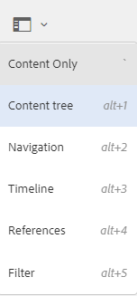

# Miglioramenti dell’esperienza utente in Assets {#user-experience-enhancements-in-assets}

[!DNL Experience Manager] 6.4 Assets include diversi miglioramenti a livello di usabilità che forniscono un’esperienza utente fluida e migliorano la produttività. L&#39;aumento della velocità con cui è possibile creare/gestire i contenuti destinati al mercato migliora la velocità dei contenuti aziendali.

L’interfaccia è più reattiva e consente di gestire in modo efficiente un ampio portafoglio di risorse. È possibile eseguire rapidamente ricerche, visualizzazioni, ordinamenti e scorrere in modo fluido un lungo elenco di elementi.

Puoi personalizzare le diverse viste (a schede, a elenco e a colonne). Ad esempio, puoi configurare la dimensione delle miniature da visualizzare nella vista a schede. Nella vista Elenco, puoi configurare il livello di dettaglio da visualizzare per le risorse nell’elenco. [!DNL Experience Manager] 6.4 Assets include una nuova vista ad albero che consente di navigare comodamente nell’archivio delle risorse e di trovarle.

## Caricamento pigro {#lazy-loading}

Quando sfoglia/cerchi risorse in [!DNL Experience Manager] 6.4 Assets, vengono visualizzate fino a 200 risorse alla volta. È possibile scorrere i risultati più velocemente, il che è particolarmente utile quando si esplora un lungo elenco di risultati. Poiché un numero significativo di risorse viene caricato alla volta, l’esperienza di navigazione è fluida.

Se tocchi/fai clic su una risorsa per visualizzarne la pagina dei dettagli, puoi tornare alla pagina dei risultati semplicemente toccando/facendo clic sul pulsante Indietro nella barra degli strumenti.

## Miglioramenti alla vista a schede {#card-view-improvements}

A seconda del dispositivo utilizzato e della quantità di dettagli necessari, è possibile ridimensionare le miniature delle risorse nella vista Scheda. In questo modo, puoi personalizzare la visualizzazione e controllare il numero di miniature visualizzate.

Per ridimensionare le miniature nella vista a schede, effettuate le seguenti operazioni:

1. Tocca o fai clic sull’icona Layout nella barra degli strumenti, quindi scegli l’opzione **[!UICONTROL Visualizza impostazioni]** .

   

1. Dalla finestra di dialogo **[!UICONTROL Visualizza impostazioni]**, seleziona la dimensione della miniatura desiderata, quindi tocca o fai clic su **[!UICONTROL Aggiorna]**.

   

1. Esamina le miniature visualizzate nella dimensione scelta.

   

Nella vista a schede sono ora visualizzate informazioni aggiuntive, ad esempio lo stato di pubblicazione.

## Miglioramenti alla vista a elenco {#list-view-improvements}

Nella vista Elenco, la prima colonna visualizza ora i nomi dei file delle risorse per impostazione predefinita. Vengono inoltre visualizzate informazioni aggiuntive, ad esempio lo stato di pubblicazione ed elaborazione e le impostazioni internazionali.

Puoi scegliere di configurare la quantità di dettagli da visualizzare. Tocca o fai clic sull’icona Layout, scegli l’opzione **[!UICONTROL Visualizza impostazioni]** e specifica le colonne da visualizzare nella finestra di dialogo **[!UICONTROL Visualizza impostazioni]**.

## Miglioramenti alla vista a colonne {#column-view-improvements}

Oltre alle viste a schede e a elenco, ora puoi passare alla pagina dei dettagli di una risorsa dalla vista a colonne. Seleziona una risorsa dalla vista Colonna, quindi tocca o fai clic su **[!UICONTROL Maggiori dettagli]** nello snapshot della risorsa.

## Vista a albero {#tree-view}

[!DNL Experience Manager] 6.4 Assets include una vista ad albero che consente di navigare comodamente nella gerarchia delle risorse e passare alla risorsa o alla cartella desiderata.

Per aprire la visualizzazione Struttura, tocca o fai clic sull&#39;icona Navigazione globale in `Assets UI` e scegli **[!UICONTROL Struttura contenuto]** dal menu.

Dalla gerarchia dei contenuti, accedi alla risorsa desiderata.

## Navigazione dei dettagli delle risorse {#navigating-asset-details}

La pagina dei dettagli della risorsa ora include i pulsanti Precedente e Successivo nella barra degli strumenti, per consentire la visualizzazione di tutte le immagini in una cartella in successione.

A seconda del dispositivo, è inoltre possibile scorrere o utilizzare i tasti freccia sulla tastiera per spostarsi avanti e indietro tra le immagini.

A seconda del layout scelto, puoi aprire la pagina dei dettagli di una risorsa nei seguenti modi:

| **Visualizza** | **Come aprire la pagina dei dettagli della risorsa** |
|---|---|
| [!UICONTROL Vista a schede] | Tocca o fai clic sulla porzione di risorsa. |
| [!UICONTROL Vista a elenco] | Tocca o fai clic sulla voce della riga relativa alla risorsa nell’elenco. |
| [!UICONTROL Vista a colonne] | Tocca o fai clic sul pulsante **[!UICONTROL Maggiori dettagli]** dallo snapshot della risorsa. |

Utilizza i pulsanti Precedente/Successivo per spostarsi avanti e indietro tra le risorse.

