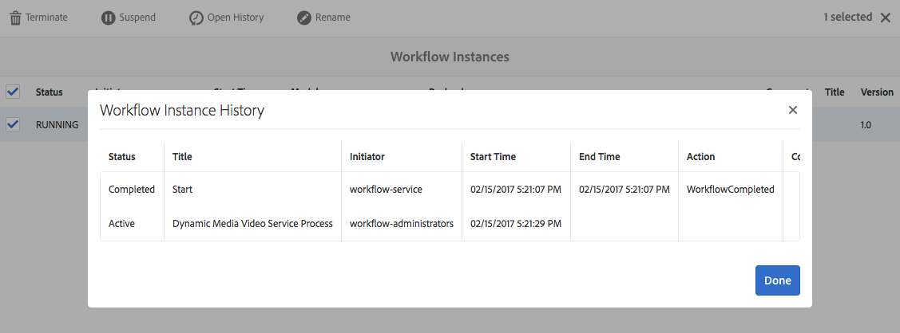

# Video {#video}

Questa sezione descrive come lavorare con i video in Dynamic Media.

## Avvio rapido: Video {#quick-start-videos}

La seguente descrizione dettagliata del flusso di lavoro è stata creata per consentirvi di imparare a usare rapidamente i set video adattivi in Dynamic Media. Dopo ogni passaggio sono presenti riferimenti incrociati alle intestazioni degli argomenti in cui è possibile trovare ulteriori informazioni.

>[!NOTE]
>
>Prima di lavorare con i video in Dynamic Media, accertatevi che l&#39;amministratore AEM abbia già attivato e configurato Cloud Services Dynamic Media.
>
>* Vedere [Configurazione di Cloud Services Dynamic Media in Configurazione di Dynamic Media - Modalità ibrida.](/help/assets/config-dynamic.md)
>* Vedere [Configurazione di Dynamic Media - Modalità Scene7](config-dms7.md) e [Risoluzione di problemi Dynamic Media - Modalità Scene7](troubleshoot-dms7.md)

>


1. **Caricate i** video Dynamic Media effettuando le seguenti operazioni:

   * Create un profilo di codifica video personalizzato. Oppure, potete semplicemente utilizzare il profilo predefinito di codifica video adattiva fornito con Dynamic Media.

      * [Creazione di un profilo](video-profiles.md) di codifica video.
      * Ulteriori informazioni sulle [Best practice per la codifica video](#best-practices-for-encoding-videos).
   * Associate il profilo di elaborazione video a una o più cartelle in cui intendete caricare i video principali.

      * [Applicazione di un profilo video alle cartelle](video-profiles.md#applying-a-video-profile-to-folders).
      * Ulteriori informazioni sulle [Best practice per l&#39;organizzazione delle risorse digitali per l&#39;utilizzo dei profili di elaborazione](organize-assets.md#organize-using-folders).
      * Ulteriori informazioni su [Organizzazione delle risorse digitali](organize-assets.md).
   * Caricate i video principali nelle cartelle. Potete caricare file video fino a 15 GB ciascuno. Quando aggiungete dei video alla cartella, questi vengono codificati in base al profilo di elaborazione video assegnato alla cartella.

      * [Caricate i video](managing-video-assets.md#uploading-and-previewing-video-assets).
      * Ulteriori informazioni su [Formati di file di input supportati](assets-formats.md#supported-multimedia-formats).
   * Monitorate l&#39;avanzamento della codifica video [dalla visualizzazione della risorsa o del flusso di lavoro.](#monitoring-video-encoding-and-youtube-publishing-progress)


1. **Per gestire i** video Dynamic Media, effettuate una delle seguenti operazioni:

   * Organizzare, sfogliare ed effettuare ricerche nelle risorse video

      * [Organizzazione delle risorse digitali](organize-assets.md)

         Ulteriori informazioni sulle [Best practice per l&#39;organizzazione delle risorse digitali per l&#39;utilizzo dei profili di elaborazione](organize-assets.md#organize-using-folders)

      * [Ricerca di risorse video ](search-video-assets.md) o  [Ricerca di risorse](managing-assets-touch-ui.md#searching-assets)
   * Anteprima e pubblicazione delle risorse video

      * Visualizzate il video sorgente e le rappresentazioni codificate del video insieme alle miniature associate:

         [Anteprima dei ](managing-video-assets.md#uploading-and-previewing-video-assets) video o  [Anteprima delle risorse](previewing-assets.md)

         [Visualizzazione delle rappresentazioni video](video-renditions.md)

         [Gestione delle rappresentazioni video](managing-assets-touch-ui.md#managing-renditions)

      * [Gestire i predefiniti per visualizzatori](managing-viewer-presets.md)
      * [Pubblicazione delle risorse](publishing-dynamicmedia-assets.md)
   * Utilizzo dei metadati video

      * Visualizzate le proprietà di una rappresentazione video codificata come il frame rate, il bitrate audio e video e il codec:

         [Visualizzazione delle proprietà di rappresentazione video](video-renditions.md)

      * Modificate le proprietà del video come titolo, descrizione e tag, campi di metadati personalizzati:

         [Modifica delle proprietà video](managing-assets-touch-ui.md#editing-properties)

      * [Gestione dei metadati per le risorse digitali](metadata.md)
      * [Schemi metadati](metadata-schemas.md)
   * Rivedere, approvare e annotare i video

      * [Aggiunta di annotazioni ](managing-video-assets.md#annotating-video-assets) ai video o  [Annotazione delle risorse](managing-assets-touch-ui.md#annotating)
      * [Applicazione di flussi di lavoro alle risorse o ](assets-workflow.md) Avvio di un  [flusso di lavoro su una risorsa](managing-assets-touch-ui.md#starting-a-workflow-on-an-asset)
      * [Verificare le risorse delle cartelle](bulk-approval.md)
      * [Progetti](/help/sites-authoring/projects.md)


1. **Pubblicate i** video Dynamic Media effettuando una delle seguenti operazioni:

   * Se utilizzate Adobe Experience Manager come sistema di gestione dei contenuti Web, potete aggiungere video direttamente alle pagine Web.

      * [Aggiunta di video alle pagine](adding-dynamic-media-assets-to-pages.md) Web.
   * Se utilizzate un sistema di gestione dei contenuti Web di terze parti, potete collegare o incorporare video nelle pagine Web.

      * Integrare video con l’URL:

         [Collegamento di URL all’applicazione web](linking-urls-to-yourwebapplication.md).
      * Integrare video utilizzando il codice da incorporare nella pagina Web:

         [Incorporamento del visualizzatore video in una pagina](embed-code.md) Web.
   * [Pubblicazione di video su YouTube](#publishing-videos-to-youtube).
   * [Generazione di rapporti](#viewing-video-reports) video.
   * [Aggiunta di sottotitoli a video](#adding-captions-to-video).


## Utilizzo di video in Dynamic Media {#working-with-video-in-dynamic-media}

Video in Dynamic Media è una soluzione end-to-end che semplifica la pubblicazione di video adattivi di alta qualità per lo streaming su schermi diversi, inclusi desktop, iOS, Android, Blackberry e dispositivi mobili Windows. Un set video adattivo raggruppa versioni dello stesso video codificate con diversi bitrate e formati quali 400, 800 e 1000 kbps. Il computer desktop o il dispositivo mobile rileva la larghezza di banda disponibile.

Ad esempio, su un dispositivo mobile iOS, rileva una larghezza di banda come 3G, 4G o Wi-Fi. Quindi, seleziona automaticamente il video con la codifica corretta tra i vari bitrate video presenti nel set video adattivo. Il video viene trasmesso in streaming a computer desktop, dispositivi mobili o tablet.

Inoltre, la qualità video viene modificata automaticamente in modo dinamico se le condizioni della rete cambiano sul desktop o sul dispositivo mobile. Inoltre, se un cliente passa alla modalità a schermo intero su un computer desktop, il set video adattivo risponde utilizzando una risoluzione migliore, in modo da migliorare l’esperienza di visualizzazione del cliente. L’utilizzo di set video adattivi offre la migliore riproduzione possibile per i clienti che riproducono video Dynamic Media su schermi e dispositivi diversi.

La logica utilizzata da un lettore video per determinare quale video codificato riprodurre o selezionare durante la riproduzione si basa sul seguente algoritmo:

1. Il lettore video carica il frammento video iniziale in base al bitrate più vicino al valore impostato per il bitrate iniziale nel lettore stesso.
1. Il lettore video passa alla velocità della larghezza di banda in base ai seguenti criteri:

   1. Player sceglie il flusso di larghezza di banda più alto al di sotto o uguale alla larghezza di banda stimata.
   1. Il lettore considera solo l&#39;80% della larghezza di banda disponibile. Tuttavia, se sta cambiando, è più conservativo solo al 70% per evitare sopravvalutazioni e tornare immediatamente indietro.

Per informazioni tecniche dettagliate sull&#39;algoritmo, vedere [https://android.googlesource.com/platform/frameworks/av/+/master/media/libstagefright/httplive/LiveSession.cpp](https://android.googlesource.com/platform/frameworks/av/+/master/media/libstagefright/httplive/LiveSession.cpp)

Per gestire video singoli e set video adattivi, sono supportati i seguenti elementi:

* Caricamento di video da numerosi formati video e formati audio supportati e codifica di video in formato MP4 H.264 per la riproduzione su più schermi. Potete usare i predefiniti per video adattivi preimpostati, i predefiniti di codifica per video singoli o personalizzare la codifica per controllare la qualità e le dimensioni del video.

   * Quando viene generato un set video adattivo, questo include i video MP4.
   * **Nota**: I video principali/sorgente non vengono aggiunti a un set video adattivo.

* Sottotitoli video in tutti i visualizzatori video HTML5.
* Organizzate, sfogliate e cercate i video con il supporto completo dei metadati per una gestione efficiente delle risorse video.
* Distribuite set video adattivi sia sul Web che su computer desktop e dispositivi mobili, inclusi iPhone, iPad, Android, Blackberry e Windows Phone.

Lo streaming video adattivo è supportato su diverse piattaforme iOS. Consultate la [Guida di riferimento dei visualizzatori di Adobi ](https://experienceleague.adobe.com/docs/dynamic-media-developer-resources/library/home.html).

Dynamic Media supporta la riproduzione di video mobile per video MP4 H.264. Per un elenco dei dispositivi BlackBerry che supportano questo formato video, consultate: [Formati video supportati su Blackberry](https://support.blackberry.com/kb/articleDetail?ArticleNumber=000005482).

Per un elenco dei dispositivi Windows che supportano questo formato video, consultate: [Formati video supportati su Windows Phone](https://msdn.microsoft.com/library/windows/apps/ff462087%28v=vs.105%29.aspx)

* Riproducete il video usando i predefiniti per visualizzatori video di Dynamic Media, inclusi i seguenti:

   * Visualizzatori per singoli video.
   * Visualizzatori per file multimediali diversi che combinano video e immagini.

* Configurate i lettori video per soddisfare le vostre esigenze di branding.
* Integrare video nel sito Web, nel sito mobile o nell’applicazione mobile con un semplice URL o codice da incorporare.

<!-- See [Dynamic video playback](https://s7d9.scene7.com/s7/uvideo.jsp?asset=GeoRetail/Mop_AVS&config=GeoRetail/Universal_Video1&stageSize=640,480). -->

Consultate anche [Informazioni sui visualizzatori HTML5](https://experienceleague.adobe.com/docs/dynamic-media-developer-resources/library/viewers-for-aem-assets-only/c-html5-aem-asset-viewers.html?lang=en#viewers-for-aem-assets-only) nella guida di riferimento dei visualizzatori Dynamic Media per l’Adobe .

## Procedura consigliata: Utilizzo del visualizzatore video HTML5 {#best-practice-using-the-html-video-viewer}

I predefiniti per visualizzatori video Dynamic Media HTML5 sono lettori video affidabili. Potete utilizzarli per evitare molte delle problematiche più comuni relative alla riproduzione di video HTML5 e ai dispositivi mobili, ad esempio la mancanza di distribuzione con streaming adattivo e la portata limitata del browser desktop.

Dal punto di vista della progettazione del lettore, è possibile progettare tutte le funzionalità del lettore video utilizzando gli strumenti di sviluppo Web standard. Ad esempio, potete progettare pulsanti, controlli e sfondo personalizzato con immagine poster utilizzando HTML5 e CSS per raggiungere i clienti con un aspetto personalizzato.

Dal lato della riproduzione del visualizzatore, viene rilevata automaticamente la capacità video del browser. Viene quindi trasmesso il video con streaming HLS (streaming video adattivo). Oppure, se tali metodi di consegna non sono presenti, viene utilizzato lo progressivo HTML5.

Combinando in un singolo lettore la possibilità di progettare i componenti di riproduzione in HTML5 e CSS, di usufruire di riproduzione incorporata e di utilizzare lo streaming adattativo e progressivo a seconda delle funzionalità del browser, i contenuti multimediali potranno essere visti dagli utenti desktop e mobili e potranno così godere di un’esperienza video ottimizzata.

Consultate anche [I visualizzatori HTML5](https://experienceleague.adobe.com/docs/dynamic-media-developer-resources/library/viewers-for-aem-assets-only/c-html5-aem-asset-viewers.html) nella guida di riferimento dei visualizzatori di Adobi .

### Riproduzione di video su computer desktop e dispositivi mobili mediante il visualizzatore video HTML5 {#playback-of-video-on-desktop-computers-and-mobile-devices-using-the-html-video-viewer}

Per lo streaming di video adattivi per desktop e dispositivi mobili, i video utilizzati per il cambio di bitrate si basano su tutti i video MP4 presenti nel set video adattivo.

La riproduzione video si verifica utilizzando lo streaming video HLS (HTTP Live Streaming) o lo scaricamento progressivo del video. Nelle versioni precedenti di AEM, come 6.0, 6.1 e 6.2, i video venivano trasmessi in streaming via HTTP.

Tuttavia, in AEM 6.3 e versioni successive, i video vengono ora trasmessi in streaming attraverso il protocollo HTTPS (ovvero lo streaming video HLS), perché l&#39;URL del servizio gateway DM utilizza sempre anche il protocollo HTTPS. Notate che non vi è alcun impatto del cliente in questo comportamento predefinito. In altre parole, lo streaming video si verifica sempre attraverso HTTPS, a meno che non sia supportato dal browser. (vedere la tabella seguente). Quindi,

* Se disponete di un sito Web HTTPS con streaming video HTTPS, lo streaming è corretto.
* Se disponete di un sito Web HTTP con streaming video HTTPS, lo streaming è corretto e il browser Web non presenta problemi di contenuto misto.

HLS (HTTP Live Streaming) è uno standard Apple per lo streaming di video adattivi che regola automaticamente la riproduzione in base alla capacità di larghezza di banda della rete. Consente inoltre al cliente di &quot;cercare&quot; in qualsiasi punto del video senza dover attendere il resto del video da scaricare (consultate anche HTTP Live Streaming).

Il video progressivo viene distribuito scaricando e memorizzando localmente il video sullo schermo desktop o sul dispositivo mobile di un utente.

La tabella seguente riassume il dispositivo, il browser e il metodo di riproduzione dei video su computer desktop e dispositivi mobili che utilizzano il visualizzatore video Dynamic Media.

<table> 
 <tbody> 
  <tr> 
   <td><strong>Dispositivo</strong></td>
   <td><strong>Browser</strong></td>
   <td><strong>Modalità di riproduzione video</strong></td>
  </tr>
  <tr> 
   <td>Desktop</td>
   <td>Internet Explorer 9 e 10</td>
   <td>Download progressivo.</td>
  </tr>
  <tr> 
   <td>Desktop</td>
   <td>Internet Explorer 11+</td>
   <td>In Windows 8 e Windows 10 - Forza l'uso di HTTPS ogni volta che viene richiesto HLS. Limitazione nota: HTTP su HLS non funziona in questa combinazione browser/sistema operativo<br /> <br /> In Windows 7 - Download progressivo. Utilizza la logica standard per selezionare il protocollo HTTP rispetto a HTTPS.</td>
  </tr>
  <tr> 
   <td>Desktop</td>
   <td>Firefox 23-44</td>
   <td>Download progressivo.</td>
  </tr>
  <tr> 
   <td>Desktop</td>
   <td>Firefox 45 o versione successiva</td>
   <td>Streaming video HLS.</td>
  </tr>
  <tr> 
   <td>Desktop</td>
   <td>Effetto cromatura</td>
   <td>Streaming video HLS.</td>
  </tr>
  <tr> 
   <td>Desktop</td>
   <td>Safari (Mac)</td>
   <td>Streaming video HLS.</td>
  </tr>
  <tr> 
   <td>Mobile</td>
   <td>Chrome (Android 6 o versione precedente)</td>
   <td>Download progressivo.</td>
  </tr>
  <tr> 
   <td>Mobile</td>
   <td>Chrome (Android 7 o successivo)</td>
   <td>Streaming video HLS.</td>
  </tr>
  <tr> 
   <td>Mobile</td>
   <td>Android (browser predefinito)</td>
   <td>Download progressivo.</td>
  </tr>
  <tr> 
   <td>Mobile</td>
   <td>Safari (iOS)</td>
   <td>Streaming video HLS.</td>
  </tr>
  <tr> 
   <td>Mobile</td>
   <td>Chrome (iOS)</td>
   <td>Streaming video HLS.</td>
  </tr>
  <tr> 
   <td>Mobile</td>
   <td>Blackberry</td>
   <td>Streaming video HLS.</td>
  </tr>
 </tbody>
</table>

## Architettura della soluzione video Dynamic Media {#architecture-of-dynamic-media-video-solution}

L’immagine seguente mostra il flusso di lavoro di authoring complessivo dei video caricati e codificati tramite DMGGateway e resi disponibili per l’uso pubblico.


## Architettura di pubblicazione ibrida per i video {#hybrid-publishing-architecture-for-videos}


## Procedure ottimali per la codifica dei video {#best-practices-for-encoding-videos}

Se hai attivato gli elementi multimediali dinamici e hai impostato Cloud Services per i video flusso di lavoro, **[!UICONTROL Codifica video elementi multimediali dinamici]** ti consente di eseguire la codifica dei video. Questo flusso di lavoro acquisisce la cronologia del processo del flusso di lavoro e le informazioni di errore. Consulta la sezione [Monitoraggio della codifica video e stato della pubblicazione su YouTube](#monitoring-video-encoding-and-youtube-publishing-progress). Se avete attivato Dynamic Media e impostato i servizi Video Cloud, il flusso di lavoro **[!UICONTROL Dynamic Media Encode Video]** diventa automaticamente attivo quando caricate un video. (Se non si utilizza Dynamic Media, il flusso di lavoro **[!UICONTROL DAM Update Asset]** diventa effettivo.)

Di seguito sono riportati alcuni suggerimenti per la codifica di file video sorgente.

Per consigli sulla codifica video, consultate i seguenti riferimenti:

* Articolo: *Streaming 101: Nozioni di base — Codec, larghezza di banda, velocità dati e risoluzione:* [www.adobe.com/go/learn_s7_streaming101_en](https://www.adobe.com/go/learn_s7_streaming101_en).
* Video: *Nozioni di base sulla codifica video:* [www.adobe.com/go/learn_s7_encoding_en](https://www.adobe.com/go/learn_s7_encoding_en).

### File video sorgente {#source-video-files}

Quando codificate un file video, usate un file video sorgente della massima qualità possibile. Evitate di usare file video codificati in precedenza perché sono già compressi e un’ulteriore codifica comporterebbe la creazione di video di qualità inferiore.

La tabella seguente riassume le dimensioni consigliate, le proporzioni e il bitrate minimo che i file video sorgente dovrebbero avere prima di codificarli:

| Dimensione | Proporzioni | Bitrate minimo |
|--- |--- |--- |
| 1024x768 | 4:3 | 4500 kbps per la maggior parte dei video. |
| 1280x720 | 16:9 | 3000 - 6000 kbps, a seconda della quantità di movimento presente nel video. |
| 1920 X 1080 | 16:9 | 6000 - 8000 kbps, a seconda della quantità di movimento presente nel video. |

### Ottenimento dei metadati di un file {#obtaining-a-file-s-metadata}

Per ottenere i metadati di un file potete visualizzarne i metadati utilizzando uno strumento di modifica video o un’applicazione progettata per ottenere i metadati. Seguono istruzioni per l’utilizzo di MediaInfo, un’applicazione di terze parti che consente di ottenere i metadati di un file video:

1. Vai a questa pagina Web: [https://mediaarea.net/en/MediaInfo](https://mediaarea.net/en/MediaInfo).
1. Selezionate e scaricate il programma di installazione per la versione GUI in uso, quindi seguite le istruzioni di installazione.
1. Dopo l&#39;installazione, fare clic con il pulsante destro del mouse sul file video (solo Windows) e selezionare **[!UICONTROL MediaInfo]** oppure aprire **[!UICONTROL MediaInfo]** e trascinare il file video nell&#39;applicazione. Vengono visualizzati tutti i metadati associati al file video, inclusi larghezza, altezza e fotogrammi al secondo.

### Proporzioni {#aspect-ratio}

Quando scegliete o create un predefinito di codifica video per il file video principale, accertatevi che il predefinito abbia le stesse proporzioni del file video principale. Le proporzioni sono il rapporto tra la larghezza e l’altezza del video.

Per determinare le proporzioni di un file video, ottenete i metadati del file e prendete nota dei valori di larghezza e altezza (consultate Ottenimento dei metadati di un file sopra). Quindi utilizzate questa formula per determinare le proporzioni:

*larghezza/altezza = proporzioni*

Nella tabella seguente è illustrato come i risultati della formula si traducono in scelte di proporzioni comuni:

| Risultato della formula | Proporzioni |
|--- |--- |
| 1,33 | 4:3 |
| 0,75 | 3:4 |
| 1,78 | 16:9 |
| 0,56 | 9:16 |

Ad esempio, un video di 1440 larghezza x 1080 altezza ha proporzioni pari a 1440/1080 o 1,33. In questo caso, scegliete un predefinito di codifica video con proporzioni 4:3 per codificare il file video.

### Bitrate {#bitrate}

Bitrate è la quantità di dati codificati per creare un secondo di riproduzione video. Il bitrate viene misurato in kilobit al secondo (Kbps).

Poiché tutti i codec usano la compressione con perdita di dati, il bitrate è il fattore più importante nella qualità video. Con la compressione con perdita di dati, più comprimete un file video, più la qualità viene ridotta. Per questo motivo, a parità di tutte le altre caratteristiche (risoluzione, frequenza fotogrammi e codec), minore è il bitrate, minore sarà la qualità del file compresso.

Quando selezionate una codifica bitrate, potete scegliere due tipi:

* **Codifica**  bitrate costante (CBR) - Durante la codifica CBR, il bitrate o il numero di bit al secondo viene mantenuto invariato durante l&#39;intero processo di codifica. La codifica CBR persiste quando la velocità dati impostata viene impostata sull’intero video. Inoltre, la codifica CBR non ottimizza i file multimediali per la qualità, ma consente di risparmiare spazio di archiviazione.

   Usate CBR se il video contiene un livello di movimento simile per l’intero video. CBR è utilizzato soprattutto per lo streaming di contenuti video. Consultate anche [Utilizzo di parametri di codifica video personalizzati](video-profiles.md#using-custom-added-video-encoding-parameters).

* **Codifica**  a bitrate variabile (VBR) - La codifica VBR regola la velocità dati verso il basso e il limite superiore impostato, in base ai dati richiesti dal compressore. Ciò significa che durante un processo di codifica VBR il bitrate del file multimediale aumenta o diminuisce dinamicamente in base alle esigenze del bitrate dei file multimediali.

   La codifica VBR richiede più tempo, ma produce i risultati più favorevoli; la qualità del file multimediale è superiore. VBR è utilizzato soprattutto per la distribuzione http progressiva dei contenuti video.

**Quando utilizzare VBR e CRB?**
Quando si tratta di selezionare VBR e CBR, si consiglia quasi sempre di utilizzare VBR per i file multimediali. VBR offre file di qualità superiore con bitrate competitivi. Quando usate il VBR, accertatevi di utilizzarlo con una codifica a due passate e impostate il bitrate massimo su 1,5 volte il bitrate video di destinazione.

Quando scegliete un predefinito di codifica video, prendete in considerazione la velocità di connessione dell’utente finale di destinazione. Scegliete un predefinito con una velocità dati pari all’80% di quella velocità. Ad esempio, se la velocità di connessione dell’utente finale di destinazione è di 1000 Kbps, il predefinito migliore è uno con una velocità dati video di 800 Kbps.

Questa tabella descrive la velocità dati delle velocità di connessione tipiche.

| Velocità (Kbps) | Tipo di connessione |
|--- |--- |
| 256 | Connessione remota. |
| 800 | Connessione mobile tipica. Per questa connessione, eseguite il targeting di una velocità dati compresa tra 400 e 800 per esperienze 3G. |
| 2000 | Connessione desktop tipica a banda larga. Per questa connessione, eseguite il targeting di una velocità dati nell&#39;intervallo 800-2000 Kbps, con una media di 1200-1500 Kbps per la maggior parte delle destinazioni. |
| 5000 | Connessione a banda larga elevata tipica. La codifica in questo intervallo superiore non è consigliata perché la maggior parte dei consumatori non può distribuire video a questa velocità. |

### Risoluzione {#resolution}

**La** risoluzione descrive l’altezza e la larghezza di un file video, in pixel. La maggior parte dei video sorgente viene memorizzata ad alta risoluzione (ad esempio, 1920 x 1080). Per lo streaming, il video sorgente viene compresso in una risoluzione più piccola (640 x 480 o inferiore).

La risoluzione e la velocità dati sono due fattori strettamente correlati che determinano la qualità video. Per mantenere la stessa qualità video, più elevato è il numero di pixel in un file video (più alta è la risoluzione), più alta deve essere la velocità dati. Ad esempio, considerate il numero di pixel per fotogramma in una risoluzione 320 x 240 e un file video con risoluzione 640 x 480:

| Risoluzione | Pixel per fotogramma |
|--- |--- |
| 320 x 240 | 76.800 |
| 640 x 480 | 307.200 |

Il file da 640x480 ha quattro volte più pixel per fotogramma. Per ottenere la stessa velocità dati per queste due risoluzioni, occorre applicare una compressione quattro volte maggiore al file da 640x480, riducendo la qualità del video. Pertanto, una velocità dati video di 250 Kbps produce una visualizzazione di alta qualità a una risoluzione di 320 x 240, ma non a una risoluzione di 640 x 480.

In generale, maggiore è la velocità dati utilizzata, migliore sarà l’aspetto del video e maggiore sarà la risoluzione utilizzata, maggiore sarà la velocità dati necessaria per mantenere la qualità di visualizzazione (rispetto a risoluzioni più basse).

Poiché risoluzione e velocità dati sono collegati, durante la codifica video sono disponibili due opzioni:

* Scegliete una velocità dati e quindi effettuate la codifica alla risoluzione più elevata, in base alla velocità dati scelta.
* Scegliete una risoluzione e quindi effettuate la codifica alla velocità dati necessaria per ottenere video di alta qualità alla risoluzione scelta.

Quando scegliete (o create) un predefinito di codifica video per il file video principale, usate questa tabella per ottenere la risoluzione corretta:

| Risoluzione | Altezza (pixel) | Dimensione schermo |
|--- |--- |--- |
| 240p | 240 | Schermo molto piccolo |
| 300p | 300 | Schermo piccolo tipico per dispositivi mobili |
| 360p | 360 | Schermo piccolo |
| 480p | 480 | Schermo medio |
| 720p | 720 | Schermo grande |
| 1080p | 1080 | Schermo grande ad alta definizione |

### Fps (fotogrammi al secondo) {#fps-frames-per-second}

Negli Stati Uniti e in Giappone, la maggior parte dei video è riprodotta a 29,97 fotogrammi al secondo (fps); in Europa, la maggior parte dei video viene riprodotta a 25 fps. I film sono ripresi a 24 fps.

Scegliete un predefinito di codifica video con un valore fps pari a quello del file video principale. Ad esempio, se il video principale è di 25 fps, scegliete un predefinito di codifica da 25 fps. Per impostazione predefinita, per tutte le codifiche personalizzate viene utilizzato il valore fps del file video principale. Per questo motivo, non è necessario specificare l’impostazione fps quando create un predefinito di codifica video.

### Dimensioni di codifica video {#video-encoding-dimensions}

Per risultati ottimali, selezionate dimensioni di codifica tali che il video sorgente sia un multiplo intero di tutti i video codificati.

Per calcolare questo rapporto, dividete la larghezza sorgente per la larghezza codificata per ottenere il rapporto di larghezza. Quindi, dividete l’altezza sorgente per l’altezza codificata per ottenere il rapporto di altezza.

Se il rapporto risultante è un numero intero, significa che il video viene ridimensionato in modo ottimale. Se il rapporto risultante non è un numero intero, influisce sulla qualità del video e gli artefatti di pixel superflui vengono visualizzati. Questo effetto è particolarmente evidente quando il video contiene del testo.

Ad esempio, supponete che il video sorgente sia 1920 x 1080. Nella tabella seguente, i tre video codificati forniscono le impostazioni di codifica ottimali da usare.

<table> 
 <tbody> 
  <tr> 
   <th><p>Tipo video</p> </th> 
   <th><p>Larghezza x altezza</p> </th> 
   <th><p>Rapporto larghezza</p> </th> 
   <th><p>Rapporto altezza</p> </th> 
  </tr>
  <tr> 
   <td><p>Origine</p> </td> 
   <td><p>1920x1080</p> </td> 
   <td><p>1</p> </td> 
   <td><p>3</p> </td> 
  </tr> 
  <tr> 
   <td><p>Codificato</p> </td> 
   <td><p>960 x 540</p> </td> 
   <td><p>2</p> </td> 
   <td><p>2</p> </td> 
  </tr> 
  <tr> 
   <td><p>Codificato</p> </td> 
   <td><p>640 x 360</p> </td> 
   <td><p>3</p> </td> 
   <td><p>1</p> </td> 
  </tr> 
  <tr> 
   <td><p>Codificato</p> </td> 
   <td><p>480 x 270</p> </td> 
   <td><p>4</p> </td> 
   <td><p>4</p> </td> 
  </tr> 
 </tbody> 
</table>

### Formato di file video codificato {#encoded-video-file-format}

Dynamic Media consiglia di utilizzare i predefiniti di codifica video MP4 H.264. Poiché i file MP4 utilizzano il codec video H.264, il video è di alta qualità ma la dimensione file è ridotta.

## Pubblicazione di video su YouTube {#publishing-videos-to-youtube}

Potete pubblicare risorse video locali AEM direttamente su un canale YouTube precedentemente creato.

Per pubblicare le risorse video su YouTube, potete impostare  AEM Assets con i tag . Potete associare questi tag a un canale YouTube. Se il tag di una risorsa video corrisponde al tag di un canale YouTube, il video viene pubblicato su YouTube. Se la risorsa video non dispone di un tag, non viene pubblicata su YouTube.

La pubblicazione su YouTube ignora il sistema del profilo di elaborazione in AEM e, di conseguenza, anche il profilo di codifica video. Questo bypass si verifica perché YouTube ha una propria codifica, pertanto non è necessario un profilo di elaborazione video. Nella maggior parte dei casi, tuttavia, si prevede che le risorse video siano già state sottoposte a un profilo di elaborazione video. Se si ignora il profilo di elaborazione video e lo si pubblica direttamente su YouTube, significa semplicemente che la risorsa video in AEM risorsa non ottiene una miniatura visualizzabile. Questo significa anche che se eseguite in modalità di esecuzione per i contenuti multimediali dinamici, i video non codificati non funzioneranno con nessuno dei tipi di risorse Dynamic Media.

La pubblicazione di risorse video sui server YouTube comporta l’esecuzione delle seguenti attività per garantire l’autenticazione sicura da server a server con YouTube:

1. [Configurazione delle impostazioni di Google Cloud](#configuring-google-cloud-settings)
1. [Creazione di un canale YouTube](#creating-a-youtube-channel)
1. [Aggiunta di tag per la pubblicazione](#adding-tags-for-publishing)
1. [Abilitazione dell&#39;agente di replica di pubblicazione di YouTube](#enabling-the-youtube-publish-replication-agent)
1. [Configurazione di YouTube in AEM](#setting-up-youtube-in-aem)
1. [(Facoltativo) Automatizzare l’impostazione delle proprietà predefinite di YouTube per i video caricati](#optional-automating-the-setting-of-default-youtube-properties-for-your-uploaded-videos)
1. [Pubblicazione di video sul canale YouTube](#publishing-videos-to-your-youtube-channel)
1. [(Facoltativo) Verifica del video pubblicato su YouTube](video.md#optional-verifying-the-published-video-on-youtube)
1. [Collegamento degli URL di YouTube all’applicazione Web](#linking-youtube-urls-to-your-web-application)

Potete anche [annullare la pubblicazione dei video per rimuoverli da YouTube](#unpublishing-videos-to-remove-them-from-youtube).

### Configurazione delle impostazioni di Google Cloud {#configuring-google-cloud-settings}

Per pubblicare contenuti su YouTube, è necessario un account Google. Se avete un account GMAIL allora avete già un account Google. Se non avete un account Google, potete facilmente crearne uno. L’account è necessario perché sono necessarie le credenziali per pubblicare le risorse video su YouTube. Se avete già creato un account, saltate questa attività e passate a [Creazione di un canale YouTube](#creating-a-youtube-channel).

>[!NOTE]
>
>I seguenti passaggi erano accurati al momento della scrittura. Tuttavia, Google aggiorna periodicamente i loro siti web senza preavviso. Di conseguenza, questi passaggi possono essere leggermente diversi.

**Per configurare le impostazioni** di Google Cloud:

1. Create un nuovo account Google.

   [https://accounts.google.com/SignUp?service=mail](https://accounts.google.com/SignUp?service=mail)

   Se disponete già di un account Google, passate al passaggio successivo.

1. Andate a [https://cloud.google.com/](https://cloud.google.com/).
1. Nella pagina della piattaforma Google Cloud, nella parte superiore, tocca **[!UICONTROL Console]**. Potrebbe essere necessario **Accedere** utilizzando le credenziali dell&#39;account Google.
1. Nella pagina **[!UICONTROL Dashboard]**, tocca **[!UICONTROL Crea progetto]**.
1. Nella finestra di dialogo **[!UICONTROL Nuovo progetto]**, immettere il nome di un progetto.

   L&#39;ID progetto si basa sul nome del progetto. Scegliere con attenzione il nome del progetto; non può essere modificato dopo la creazione. Inoltre, dovrete immettere di nuovo lo stesso ID progetto quando in seguito avrete impostato YouTube in Adobe Experience Manager. Potrebbe essere utile annotare l&#39;ID del progetto.
1. Toccate **[!UICONTROL Crea]**.

1. Nella **[!UICONTROL Dashboard]** del progetto, nella scheda **[!UICONTROL Guida introduttiva]**, toccare **[!UICONTROL Abilita API e ottenere credenziali come chiavi]**.
1. Vicino alla parte superiore della pagina **[!UICONTROL Dashboard]**, toccare **[!UICONTROL Abilita API]**.
1. Nella pagina **[!UICONTROL Library]**, nelle API di YouTube, toccare **[!UICONTROL YouTube Data API]**.
1. Vicino alla parte superiore della pagina **[!UICONTROL YouTube Data API v3]**, toccate **[!UICONTROL Abilita]** per attivarla.
1. Per utilizzare l&#39;API, potrebbero essere necessarie delle credenziali. Se necessario, toccare **[!UICONTROL Crea credenziali]**.
1. Da **[!UICONTROL Da dove chiamerete l&#39;API?]** dall’elenco a discesa, selezionate Server  **[!UICONTROL Web (ad es. node.js, Tomcat)]**.
1. In **[!UICONTROL Quali dati accederai?]** selezionate Dati **** utente.
1. Toccare **[!UICONTROL Quali credenziali sono necessarie?]**.
1. Nell&#39;intestazione **[!UICONTROL Crea un ID client OAuth 2.0]**, immettete un nome univoco.
1. Nel campo di testo sotto l&#39;intestazione **[!UICONTROL Origini Javascript autorizzate]**, immettere il percorso seguente, sostituendo il proprio dominio e numero di porta nel percorso, quindi premere **[!UICONTROL Invio]** per aggiungere il percorso all&#39;elenco:

   `https://<servername.domain>:<port_number>`

   Esempio, `https://1a2b3c.mycompany.com:4321`

   **Nota**: L’esempio di percorso riportato sopra è solo a scopo illustrativo.

1. Nel campo di testo sotto l&#39;intestazione **[!UICONTROL URI di reindirizzamento autorizzati]**, immettere quanto segue, sostituendo nel percorso il proprio dominio e numero di porta, quindi premere Invio per aggiungere il percorso all&#39;elenco:

   `https://<servername.domain>:<port#>/etc/cloudservices/youtube.youtubecredentialcallback.json`

   Esempio, `https://1a2b3c.mycompany.com:4321/etc/cloudservices/youtube.youtubecredentialcallback.json`

   **Nota**: L’esempio di percorso riportato sopra è solo a scopo illustrativo.

1. Toccate **[!UICONTROL Crea ID client]**.
1. Nella pagina Credenziali, nella sezione **[!UICONTROL Impostare la schermata di consenso OAuth 2.0]**, selezionare l&#39;indirizzo Gmail che si sta utilizzando.
1. Nel campo di testo sotto l&#39;intestazione **[!UICONTROL Nome prodotto visualizzato agli utenti]**, immettete ciò che desiderate visualizzare nella schermata di consenso.

   La schermata di consenso viene visualizzata all&#39;amministratore AEM quando esegue l&#39;autenticazione su YouTube; AEM contatterà YouTube per l&#39;autorizzazione.

1. Toccate **[!UICONTROL Continue]**.
1. Sotto l&#39;intestazione **[!UICONTROL Download delle credenziali]**, toccare **[!UICONTROL Download]**.
1. Salvate il file `client_id.json`.

   Sarà necessario questo file json scaricato quando si configura YouTube in Adobe Experience Manager più avanti.

1. Toccate **[!UICONTROL Chiudi]**.

   Ora creerete un canale YouTube.

### Creazione di un canale YouTube {#creating-a-youtube-channel}

Per pubblicare i video su YouTube è necessario disporre di uno o più canali. Se avete già creato un canale YouTube, potete saltare questa attività e passare a **Aggiunta di tag per la pubblicazione**.

>[!CAUTION]
>
>Assicurarsi di aver già impostato uno o più canali in YouTube &amp;ast;before&amp;ast; i canali vengono aggiunti in Impostazioni YouTube in AEM (vedere [Configurazione di YouTube in AEM](#setting-up-youtube-in-aem) sotto). In caso contrario, non viene visualizzato alcun avviso di nessun canale esistente. Tuttavia, l&#39;autenticazione Google continua a verificarsi quando aggiungete un canale, ma non è possibile scegliere quale canale viene inviato.

**Per creare un canale** YouTube:

1. Andate a [https://www.youtube.com](https://www.youtube.com/) ed effettuate l&#39;accesso utilizzando le credenziali del vostro account Google.
1. Nell&#39;angolo superiore destro della pagina YouTube, toccate l&#39;immagine del profilo (potrebbe anche essere visualizzata come una lettera all&#39;interno di un cerchio colorato in tinta unita), quindi toccate **[!UICONTROL Impostazioni YouTube]** (icona circolare dell&#39;ingranaggio).
1. Nella pagina **[!UICONTROL Panoramica]**, nell&#39;intestazione **[!UICONTROL Ulteriori funzionalità]**, toccare **[!UICONTROL Visualizza tutti i canali oppure creare un nuovo canale]**.
1. Nella pagina **[!UICONTROL Canali]**, toccare **[!UICONTROL Crea un nuovo canale]**.
1. Nella pagina **[!UICONTROL Account marchio]**, nel campo **[!UICONTROL Nome account marchio]**, immettete un nome business o un altro nome canale scelto per pubblicare le risorse video, quindi toccate **[!UICONTROL Crea]**.

   Ricordate il nome inserito qui perché dovrete immetterlo di nuovo quando si configura YouTube in AEM.

1. (Facoltativo) Se necessario, aggiungete altri canali.

   A questo punto potrete aggiungere dei tag per la pubblicazione.

### Aggiunta di tag per la pubblicazione di {#adding-tags-for-publishing}

Per pubblicare i video su YouTube, AEM associa i tag a uno o più canali YouTube. Per aggiungere tag per la pubblicazione, consultate [Amministrazione di tag](/help/sites-administering/tags.md).

Oppure, se intendete utilizzare i tag predefiniti in AEM, potete saltare questa attività e passare a [Abilitazione dell&#39;agente di replica di pubblicazione di YouTube](#enabling-the-youtube-publish-replication-agent).

### Abilitazione dell&#39;agente di replica di pubblicazione di YouTube {#enabling-the-youtube-publish-replication-agent}

1. Nell&#39;angolo superiore sinistro di AEM, toccare il logo AEM, quindi nella barra a sinistra, toccare **[!UICONTROL Strumenti > Distribuzione > Replica > Agenti in Autore]**.
1. Nella pagina **[!UICONTROL Agenti autore]**, tocca **[!UICONTROL Pubblicazione su YouTube (youtube)]**.
1. Sulla barra degli strumenti, a destra di Impostazioni, toccare **[!UICONTROL Modifica]**.
1. Selezionare la casella di controllo **[!UICONTROL Abilitato]** per attivare l&#39;agente di replica.
1. toccare **[!UICONTROL OK]**.

   Ora installerete YouTube in AEM.

### Configurazione di YouTube in AEM {#setting-up-youtube-in-aem}

1. Nell&#39;angolo superiore sinistro di AEM, toccare il logo AEM, quindi nella barra a sinistra, toccare **[!UICONTROL Strumenti > Distribuzione > Cloud Services]**.
1. Sotto l&#39;intestazione **[!UICONTROL Servizi di terze parti]**, in YouTube, toccare **[!UICONTROL Configura ora]**.
1. Nella finestra di dialogo **[!UICONTROL Crea configurazione]**, immettete un titolo (obbligatorio) e un nome (facoltativo) nei rispettivi campi.
1. Toccate **[!UICONTROL Crea]**.
1. Nella finestra di dialogo **[!UICONTROL Impostazioni account YouTube]**, nel campo **[!UICONTROL Nome applicazione]** immettere l&#39;ID progetto Google.

   Hai specificato l&#39;ID progetto quando hai inizialmente configurato le impostazioni di Google Cloud in precedenza.

   Lasciate aperta la finestra di dialogo **[!UICONTROL Impostazioni account YouTube]**; ritornerete su di esso tra un momento.

1. Utilizzando un editor di testo normale, aprite il file JSON scaricato e salvato in precedenza nell&#39;attività Configurazione delle impostazioni di Google Cloud.
1. Selezionate e copiate l’intero testo JSON.
1. Tornate alla finestra di dialogo **[!UICONTROL Impostazioni account YouTube]**. Nel campo **[!UICONTROL Configurazione JSON]**, incolla il testo JSON.
1. Toccate **[!UICONTROL OK]**.

   Ora configurerete i canali di YouTube in AEM.

1. A destra di **[!UICONTROL Canali disponibili]**, tocca **[!UICONTROL +]** (icona del segno più).
1. Nella finestra di dialogo **[!UICONTROL Impostazioni canale YouTube]**, nel campo **[!UICONTROL Titolo]**, immettere il nome del canale creato nell&#39;attività **C[!UICONTROL che crea un canale YouTube]** precedente.

   Se necessario, potete aggiungere una descrizione.

1. Toccate **[!UICONTROL OK]**.
1. Viene visualizzata l&#39;autenticazione YouTube/Google. Se non hai ancora effettuato l&#39;accesso all&#39;account Google Cloud, salta questo passaggio.

   * Immettete il nome utente e la password Google associati all’ID progetto Google e il testo JSON sopra.
   * A seconda di quanti canali l’account dispone di due o più elementi. Selezionate un canale. Non selezionate l’indirizzo e-mail.
   * Nella pagina successiva, toccare **[!UICONTROL Accetta]** per consentire l&#39;accesso a questo canale.

1. Toccate **[!UICONTROL Consenti]**.

   Ora verranno impostati i tag per la pubblicazione.

1. **Impostazione dei tag per la pubblicazione**  - Sugli  **[!UICONTROL Cloud Services >]** YouTubepage, toccate l’icona  **** Pencilicon per modificare l’elenco dei tag da usare.
1. Toccate l&#39;icona dell&#39;elenco a discesa (verso il basso) per visualizzare l&#39;elenco dei tag disponibili in AEM.
1. Toccate uno o più tag per aggiungerli.

   Per eliminare un tag aggiunto, selezionatelo e toccate **[!UICONTROL X]**.

1. Dopo aver aggiunto i tag desiderati, toccate **[!UICONTROL OK]**.

   Ora potete pubblicare i video sul vostro canale YouTube.

### (Facoltativo) Automatizzazione dell&#39;impostazione delle proprietà predefinite di YouTube per i video caricati {#optional-automating-the-setting-of-default-youtube-properties-for-your-uploaded-videos}

Potete automatizzare l’impostazione delle proprietà di YouTube al caricamento dei video. A tal fine, potete creare un profilo di elaborazione dei metadati in AEM.

Per creare il profilo di elaborazione dei metadati, devi prima copiare i valori dai campi **[!UICONTROL Etichetta campo]**, **[!UICONTROL Mappa su proprietà]** e **[!UICONTROL Scelte]**, tutti disponibili in Schemi metadati per i video. Quindi, puoi aggiungere i valori per creare il tuo profilo di elaborazione dei metadati video di YouTube.

**Per automatizzare facoltativamente l’impostazione delle proprietà predefinite di YouTube per i video** caricati:

1. Nell&#39;angolo superiore sinistro di AEM, toccate il logo AEM, quindi nella barra a sinistra toccate **[!UICONTROL Strumenti > Risorse > Schemi metadati]**.
1. Toccate **[!UICONTROL default]**. (Non aggiungere un segno di spunta alla casella di selezione a sinistra di &quot;default&quot;).
1. Nella pagina **[!UICONTROL default]**, selezionate la casella a sinistra di **[!UICONTROL video]**, quindi toccate **[!UICONTROL Edit]**.
1. Nella pagina **[!UICONTROL Editor schema metadati]**, toccate la scheda **[!UICONTROL Avanzate]**.
1. Sotto l&#39;intestazione Pubblicazione su YouTube, toccate **[!UICONTROL Categoria YouTube]**. (Non toccate l’elenco a discesa Categoria YouTube.)
1. Sul lato destro della pagina, nella scheda **[!UICONTROL Impostazioni]**, effettuare le seguenti operazioni:

   * Nel campo di testo **[!UICONTROL Etichetta campo]**, selezionare e copiare il valore.

      Incollate il valore copiato in un editor di testo aperto. Questo valore sarà necessario in seguito, al momento della creazione del profilo di elaborazione dei metadati. Lasciate aperto l’editor di testo.

   * Nel campo di testo **[!UICONTROL Mappa su proprietà]**, selezionare e copiare il valore.

      Incollate il valore copiato nell’editor di testo aperto. Questo valore sarà necessario in seguito, al momento della creazione del profilo di elaborazione dei metadati. Lasciate aperto l’editor di testo.

   * In **[!UICONTROL Scelte]**, selezionare e copiare il valore predefinito che si desidera utilizzare (come Persone e Blog o Scienza e Tecnologia).

      Incollate il valore copiato nell’editor di testo aperto. Questo valore sarà necessario in seguito, al momento della creazione del profilo di elaborazione dei metadati. Lasciate aperto l’editor di testo.

1. Sotto l&#39;intestazione Pubblicazione su YouTube, toccate **[!UICONTROL Privacy su YouTube]**. (Non toccate l’elenco a discesa Privacy di YouTube.)
1. Sul lato destro della pagina, nella scheda **[!UICONTROL Impostazioni]**, effettuare le seguenti operazioni:

   * Nel campo di testo **[!UICONTROL Etichetta campo]**, selezionare e copiare il valore.

      Incollate il valore copiato in un editor di testo aperto. Questo valore sarà necessario in seguito, al momento della creazione del profilo di elaborazione dei metadati. Lasciate aperto l’editor di testo.

   * Nel campo di testo **[!UICONTROL Mappa su proprietà]**, selezionare e copiare il valore.

      Incollate il valore copiato nell’editor di testo aperto. Questo valore sarà necessario in seguito, al momento della creazione del profilo di elaborazione dei metadati. Lasciate aperto l’editor di testo.

   * In **[!UICONTROL Scelte]**, selezionare e copiare il valore predefinito che si desidera utilizzare. Tenere presente che le opzioni sono raggruppate in coppie di due. Il campo inferiore della coppia è il valore predefinito che si desidera copiare, ad esempio pubblico, non elencato o privato.

      Incollate il valore copiato nell’editor di testo aperto. Questo valore sarà necessario in seguito, al momento della creazione del profilo di elaborazione dei metadati. Lasciate aperto l’editor di testo.

1. Nell&#39;angolo superiore destro della pagina **[!UICONTROL Editor schema metadati]**, toccare **[!UICONTROL Annulla]**.
1. Nell&#39;angolo superiore sinistro di AEM, toccate il logo AEM, quindi nella barra a sinistra toccate **[!UICONTROL Strumenti > Risorse > Profili metadati]**.

1. Nella pagina **[!UICONTROL Profili metadati]**, nell&#39;angolo superiore destro della pagina, toccare **[!UICONTROL Crea]**. Nella finestra di dialogo **[!UICONTROL Aggiungi profilo metadati]**, nel campo di testo **[!UICONTROL Titolo profilo]** immettere il nome `YouTube Video`.
1. Nella pagina **[!UICONTROL Editor profilo metadati]**, toccate la scheda **[!UICONTROL Avanzate]**.
1. Aggiungete i valori di Pubblicazione su YouTube copiati al profilo effettuando le seguenti operazioni:

   * Sul lato destro della pagina, toccate la scheda **[!UICONTROL Crea modulo]**.
   * Trascinare a sinistra il componente etichettato **[!UICONTROL Intestazione sezione]** e rilasciarlo nell&#39;area del modulo.
   * Toccate **[!UICONTROL Etichetta campo]** per selezionare il componente.
   * Sul lato destro della pagina, nella scheda **[!UICONTROL Impostazioni]**, nel campo di testo **[!UICONTROL Etichetta campo]** immettere `YouTube Publishing`.
   * Toccate la scheda **[!UICONTROL Crea modulo]**, quindi trascinate il componente con l&#39;etichetta **[!UICONTROL Testo su riga singola]** e rilasciatelo sotto l&#39;intestazione **[!UICONTROL Pubblicazione su YouTube]** appena creata.
   * Toccate **[!UICONTROL Etichetta campo]** per selezionare il componente.
   * Sul lato destro della pagina, nella scheda **[!UICONTROL Impostazioni]**, incollare i valori **[!UICONTROL Pubblicazione su YouTube]** (**[!UICONTROL Etichetta campo]** e **[!UICONTROL Mappa su proprietà]**) copiati in precedenza nei rispettivi campi del modulo. Incollare il valore **[!UICONTROL Scelte]** nel campo **[!UICONTROL Valore predefinito]**.

1. Aggiungete i valori di privacy di YouTube copiati al profilo effettuando le seguenti operazioni:

   * Sul lato destro della pagina, toccate la scheda **[!UICONTROL Crea modulo]**.
   * Trascinare a sinistra il componente etichettato **[!UICONTROL Intestazione sezione]** e rilasciarlo nell&#39;area del modulo.
   * Toccate **[!UICONTROL Etichetta campo]** per selezionare il componente.
   * Sul lato destro della pagina, nella scheda Impostazioni, nel campo di testo Etichetta campo, immettere `YouTube Privacy`.
   * Toccate la scheda **[!UICONTROL Crea modulo]**, quindi trascinate il componente con l&#39;etichetta **[!UICONTROL Testo su riga singola]** e rilasciatelo sotto l&#39;intestazione **[!UICONTROL Privacy su YouTube]** appena creata.
   * Toccate **[!UICONTROL Etichetta campo]** per selezionare il componente.
   * Sul lato destro della pagina, nella scheda **[!UICONTROL Impostazioni]**, incollare i valori **[!UICONTROL Pubblicazione su YouTube]** (**[!UICONTROL Etichetta campo]** e **[!UICONTROL Mappa su proprietà]**) copiati in precedenza nei rispettivi campi del modulo. Incollare il valore **[!UICONTROL Scelte]** nel campo **[!UICONTROL Valore predefinito]**.

1. Nell&#39;angolo superiore destro della pagina, toccare **[!UICONTROL Salva]**.
1. Applicate il profilo di metadati Pubblicazione su YouTube alle cartelle in cui desiderate caricare i video. Dovrete avere sia il profilo metadati che il profilo video impostato.

   Consulta le sezioni [Profili di metadati](metadata-profiles.md) e [Profili video](video-profiles.md).

### Pubblicazione di video sul canale YouTube {#publishing-videos-to-your-youtube-channel}

A questo punto potete associare i tag aggiunti in precedenza alle risorse video. Questo processo consente AEM sapere quali risorse pubblicare sul canale YouTube.

Per pubblicare contenuti da YouTube, AEM utilizza il flusso di lavoro **[!UICONTROL Pubblica su YouTube]**, che consente di monitorare l&#39;avanzamento e visualizzare eventuali informazioni sugli errori.
Consulta la sezione [Monitoraggio della codifica video e stato della pubblicazione su YouTube](#monitoring-video-encoding-and-youtube-publishing-progress).

**Per pubblicare i video sul canale** YouTube:

1. In AEM, individuate una risorsa video da pubblicare sul canale YouTube.
1. Selezionate la risorsa video.

   Indipendentemente dalla risorsa video selezionata, ad esempio il video sorgente originale o una rappresentazione codificata, il video sorgente originale viene sempre caricato.

1. Sulla barra degli strumenti, toccare **[!UICONTROL Proprietà]**.
1. Nella scheda **[!UICONTROL Base]**, nell&#39;intestazione Metadati, toccare **[!UICONTROL Sfoglia]** a destra del campo **[!UICONTROL Tag]**.
1. Nella pagina **[!UICONTROL Seleziona tag]**, passare ai tag da utilizzare e selezionare uno o più tag.
1. Nell&#39;angolo superiore destro della pagina, toccate l&#39;icona **[!UICONTROL Confirm]** (Conferma).
1. Nell&#39;angolo superiore destro della pagina delle proprietà del video, toccate **[!UICONTROL Salva]**.
1. Sulla barra degli strumenti, toccate **[!UICONTROL Pubblica > Pubblica]**.

   Facoltativamente, potete verificare il video pubblicato sul canale YouTube.

### (Facoltativo) Verifica del video pubblicato su YouTube {#optional-verifying-the-published-video-on-youtube}

Potete monitorare l’avanzamento della pubblicazione su YouTube (o dell’annullamento della pubblicazione).

Consulta la sezione [Monitoraggio della codifica video e stato della pubblicazione su YouTube](#monitoring-video-encoding-and-youtube-publishing-progress).

I tempi di pubblicazione possono variare notevolmente a seconda dei numerosi fattori che includono il formato del video principale, la dimensione del file e il traffico di caricamento. Il processo di pubblicazione può richiedere da qualche minuto a diverse ore. Inoltre, tenete presente che il rendering di formati con risoluzione più elevata avviene molto più lentamente. Ad esempio, 720p e 1080p richiedono un tempo di visualizzazione notevolmente maggiore rispetto a 480p.

Dopo otto ore se viene ancora visualizzato un messaggio di stato in cui è indicato **[!UICONTROL Caricato (elaborazione, attendere)]**, provare a rimuovere il video dal nostro sito e caricarlo di nuovo.

### Collegamento degli URL di YouTube all&#39;applicazione Web {#linking-youtube-urls-to-your-web-application}

Potete ottenere una stringa URL di YouTube generata da Dynamic Media dopo la pubblicazione del video. Quando copiate l’URL di YouTube, questo viene inserito negli Appunti e può quindi essere incollato nelle pagine del sito Web o dell’applicazione.

L’URL di YouTube non è disponibile per la copia finché non avete pubblicato la risorsa video su YouTube.

**Per collegare gli URL di YouTube all’applicazione** Web:

1. Andate alla risorsa video YouTube *pubblicata* di cui desiderate copiare l&#39;URL, quindi selezionatela.

   Gli URL di YouTube sono disponibili solo per copiare *dopo* le risorse video su YouTube per la prima *pubblicazione*.

1. Sulla barra degli strumenti, toccare **[!UICONTROL Proprietà]**.
1. Toccate la scheda **[!UICONTROL Avanzate]**.
1. Sotto l&#39;intestazione **[!UICONTROL Pubblicazione su YouTube]**, nell&#39; **[!UICONTROL URL di YouTube]** Elenco, selezionate e copiate il testo dell&#39;URL nel browser Web per visualizzare l&#39;anteprima della risorsa o per aggiungere contenuti alla pagina Web.

### Annullamento della pubblicazione di video per rimuoverli da YouTube {#unpublishing-videos-to-remove-them-from-youtube}

Quando annullate la pubblicazione di una risorsa video in AEM, il video viene rimosso da YouTube.

>[!CAUTION]
>
>Se rimuovete un video direttamente da YouTube, AEM è inconsapevole e continua a comportarsi come se il video fosse ancora pubblicato su YouTube. Annullate sempre la pubblicazione di una risorsa video da YouTube tramite AEM.

Per rimuovere contenuti da YouTube, AEM utilizza il flusso di lavoro **[!UICONTROL Annulla pubblicazione da YouTube]**, che consente di monitorare l&#39;avanzamento e visualizzare eventuali informazioni sugli errori.
Consulta la sezione [Monitoraggio della codifica video e stato della pubblicazione su YouTube](#monitoring-video-encoding-and-youtube-publishing-progress).

**Per annullare la pubblicazione di un video e rimuoverlo da YouTube**:

1. Nell&#39;angolo superiore sinistro di AEM, toccare il logo AEM, quindi nella barra a sinistra, toccare **[!UICONTROL Strumenti > Risorse]**.
1. Andate alle risorse video che desiderate annullare la pubblicazione dal canale YouTube.
1. In una modalità di selezione delle risorse, selezionate una o più risorse video pubblicate.
1. Sulla barra degli strumenti, toccate **[!UICONTROL Annulla pubblicazione > Annulla pubblicazione]**.

## Monitoraggio della codifica video e stato di pubblicazione su YouTube {#monitoring-video-encoding-and-youtube-publishing-progress}

Quando caricate un nuovo video in una cartella con codifica video applicata o pubblicate il video su YouTube, potete monitorare l’avanzamento (o il fallimento) della codifica video o della pubblicazione su YouTube in diversi modi. L&#39;avanzamento effettivo della pubblicazione su YouTube è disponibile solo tramite i registri, ma se non riesce o ha esito positivo è elencato in modi aggiuntivi descritti nella procedura seguente. Inoltre, potete ricevere notifiche e-mail quando un flusso di lavoro di pubblicazione YouTube o una codifica video viene completata o interrotta.

### Monitoraggio dell&#39;avanzamento {#monitoring-progress}

Per monitorare l’avanzamento (compresa la codifica non riuscita/Pubblicazione su YouTube):

1. Visualizzate l’avanzamento della codifica video nella cartella delle risorse:

   * In **[!UICONTROL Vista a schede]**, l&#39;avanzamento della codifica video viene visualizzato sulla risorsa in percentuale. In caso di errore, queste informazioni vengono visualizzate anche sulla risorsa.

      

   * In **[!UICONTROL Visualizzazione elenco]**, l&#39;avanzamento della codifica video viene visualizzato nella colonna **[!UICONTROL Stato elaborazione]**. In caso di errore, il messaggio viene visualizzato nella stessa colonna.

      

      Questa colonna non viene visualizzata per impostazione predefinita. Per abilitare la colonna, selezionare **[!UICONTROL Visualizza impostazioni]** dal menu a discesa **[!UICONTROL Visualizzazioni]**, quindi aggiungere la colonna **[!UICONTROL Stato elaborazione]** e toccare **[!UICONTROL Aggiorna]**.

      

1. Visualizzare l’avanzamento nei dettagli della risorsa. Quando toccate una risorsa, aprite il menu a discesa e selezionate **[!UICONTROL Timeline]**. Per restringere il campo alle attività del flusso di lavoro come la codifica o la pubblicazione su YouTube, selezionate **[!UICONTROL Flussi di lavoro]**.

   

   Eventuali informazioni sul flusso di lavoro, ad esempio la codifica, vengono visualizzate nella timeline. Per la pubblicazione su YouTube, la timeline **[!UICONTROL Workflow]** include anche il nome del canale YouTube e l’URL del video YouTube. Inoltre, nella timeline **[!UICONTROL Workflow]** vengono visualizzate tutte le notifiche di errore.

   >[!NOTE]
   >
   >Potrebbero essere necessari tempi lunghi per la registrazione dei messaggi di errore/errore a causa di più configurazioni del flusso di lavoro in **[!UICONTROL tentativi]**, **[!UICONTROL ritorni tentativi]** e **[!UICONTROL timeout]** da [http://localhost:4502/system/console/configMgr](http://localhost:4502/system/console/configMgr), ad esempio:
   >
   >* Configurazione coda di lavoro Apache Sling
   >* Gestore processo esterno flusso di lavoro di granito  Adobe
   >* Coda timeout flusso di lavoro Granite

   > 
   >In queste configurazioni è possibile regolare le proprietà dei **[!UICONTROL nuovi tentativi]**, dei **[!UICONTROL tentativi ritardati]** e del **[!UICONTROL timeout]**.

1. Per i flussi di lavoro in corso, vedere **Istanze di flusso di lavoro** disponibili da **[!UICONTROL Strumenti > Flusso di lavoro > Istanze]**.

   >[!NOTE]
   >
   >Potrebbe essere necessario disporre dei diritti amministrativi per accedere al menu **[!UICONTROL Strumenti]**.

   

   Selezionare l&#39;istanza e toccare **[!UICONTROL Apri cronologia]**.

   

   Nell&#39;area **[!UICONTROL Istanze flusso di lavoro]** è inoltre possibile sospendere, terminare o rinominare i flussi di lavoro. Per ulteriori informazioni, vedere [Gestione dei flussi di lavoro](/help/sites-administering/workflows-administering.md).

1. Per i processi non riusciti, vedere **Errori del flusso di lavoro** disponibili da **[!UICONTROL Strumenti > Flusso di lavoro > Errori]**. In **[!UICONTROL Errore flusso di lavoro]** sono elencate tutte le attività del flusso di lavoro che hanno generato errori.

   >[!NOTE]
   >
   >Potrebbe essere necessario disporre dei diritti amministrativi per accedere al menu **[!UICONTROL Strumenti]**.

   

   >[!NOTE]
   >
   >Potrebbe essere necessario molto tempo prima che il messaggio di errore venga finalmente registrato a causa di più configurazioni del flusso di lavoro su **[!UICONTROL tentativi]**, **[!UICONTROL ritorni di tentativi]** e **[!UICONTROL timeout]** da [http://localhost:4502/system/console/configMgr](http://localhost:4502/system/console/configMgr), ad esempio:
   >
   >* Configurazione coda di lavoro Apache Sling
   >* Gestore processo esterno flusso di lavoro di granito  Adobe
   >* Coda timeout flusso di lavoro Granite

   >
   >In queste configurazioni è possibile regolare le proprietà dei **[!UICONTROL nuovi tentativi]**, dei **[!UICONTROL tentativi ritardati]** e del **[!UICONTROL timeout]**.

1. Per i flussi di lavoro completati, vedere **[!UICONTROL Workflow Archive]** disponibile da **[!UICONTROL Strumenti > Workflow > Archive]**. **[!UICONTROL Archivio flussi di lavoro]** elenca tutte le attività del flusso di lavoro che sono state completate.

   Potrebbe essere necessario disporre dei diritti amministrativi per accedere al menu **[!UICONTROL Strumenti]**.

   

1. Potete ricevere notifiche e-mail relative a processi di workflow interrotti o non riusciti. Queste notifiche e-mail possono essere configurate da un amministratore.
Vedere [Configurazione delle notifiche e-mail](#configuring-e-mail-notifications).

#### Configurazione delle notifiche e-mail {#configuring-e-mail-notifications}

Potrebbe essere necessario disporre dei diritti amministrativi per accedere al menu **[!UICONTROL Strumenti]**.

La modalità di configurazione delle notifiche dipende dal tipo di notifiche per i processi di codifica o pubblicazione su YouTube:

* Per i processi di codifica, è possibile accedere alla pagina di configurazione per tutte AEM notifiche e-mail del flusso di lavoro all&#39;indirizzo **[!UICONTROL Strumenti > Operazioni > Console Web]** e cercare **[!UICONTROL Servizio di notifica e-mail flusso di lavoro giornaliero]**. Vedere [Configurazione delle notifiche e-mail in AEM](/help/sites-administering/notification.md). È possibile selezionare o deselezionare le caselle di controllo per **[!UICONTROL Notifica su Interrompi]** o **[!UICONTROL Notifica su Completa]** di conseguenza.

* Per i processi di pubblicazione su YouTube, effettuate le seguenti operazioni:

1. In AEM, selezionare **[!UICONTROL Strumenti > Flusso di lavoro > Modelli]**.
1. Selezionate il flusso di lavoro **[!UICONTROL Pubblica su YouTube]**, quindi toccate **[!UICONTROL Modifica]**.
1. Fare clic con il pulsante destro del mouse sul passaggio del flusso di lavoro **[!UICONTROL Caricamento di YouTube]**, quindi toccare **[!UICONTROL Modifica]**.
1. Toccate la scheda **[!UICONTROL Argument]s**.
1. È possibile selezionare o deselezionare le seguenti caselle di controllo:

   * **[!UICONTROL Inizio pubblicazione]**
   * **[!UICONTROL Errore di pubblicazione]**
   * **[!UICONTROL Completamento]** pubblicazione, che include informazioni su canali e URL

   Deselezionando una casella di controllo non si riceverà la notifica e-mail specificata dal flusso di lavoro di pubblicazione di YouTube.

   >[!NOTE]
   >
   >Questi messaggi e-mail sono specifici di YouTube e si aggiungono alle notifiche e-mail generiche per i flussi di lavoro. Di conseguenza, potete ricevere due set di notifiche e-mail: la notifica generica disponibile nel **Day CQ Workflow Notification Service** e una specifica per YouTube a seconda delle impostazioni di configurazione.

## Visualizzazione dei rapporti video {#viewing-video-reports}

I rapporti video sono disponibili quando si esegue Dynamic Media - Modalità ibrida; i rapporti non sono disponibili quando si esegue la modalità Dynamic Media - Scene7.

I rapporti video mostrano diverse metriche aggregate in un determinato periodo di tempo per monitorare che *i video pubblicati *singoli e aggregati abbiano le stesse prestazioni previste. I seguenti dati delle metriche principali sono aggregati per tutti i video pubblicati nell’intero sito Web:

* Inizio video
* Percentuale completata
* Tempo medio su video
* Tempo totale su video
* Video per visita

È anche elencata una tabella di tutti i video *pubblicati*, in modo da poter tenere traccia dei video visualizzati principali sul sito Web in base al numero totale di avvii video.

Quando toccate un nome video nell’elenco, questo mostra il rapporto di mantenimento (a discesa) del video sotto forma di grafico a linee. Il grafico mostra il numero di visualizzazioni per un dato momento di tempo durante la riproduzione del video. Quando si riproduce il video, la barra verticale tiene traccia della sincronizzazione con l’indicatore del tempo presente nel lettore. Le perdite nei dati del grafico a linee indicano dove il pubblico si allontana dal suo disinteresse.

Se il video è stato codificato all’esterno di Adobe Experience Manager Dynamic Media, il grafico a discesa di mantenimento dell’audience e i dati Percentuale riproduzione nella tabella non sono disponibili.

Vedere anche [Configurazione di Cloud Services Dynamic Media](/help/assets/config-dynamic.md).

>[!NOTE]
>
>I dati di monitoraggio e reporting si basano esclusivamente sull’utilizzo del lettore video Dynamic Media e del relativo predefinito per lettori video. Non è quindi possibile tenere traccia e generare rapporti sui video riprodotti da altri lettori video.

Per impostazione predefinita, la prima volta che inserite i rapporti video, il rapporto mostra i dati video a partire dal primo del mese corrente e termina con la data del mese corrente. Tuttavia, puoi ignorare l’intervallo di date predefinito specificando il tuo intervallo di date. La volta successiva che immettete Rapporti video, viene utilizzato l’intervallo di date specificato.

Affinché i rapporti video funzionino correttamente, viene automaticamente creato un ID Suite di rapporti quando sono configurati Cloud Services Dynamic Media. Allo stesso tempo, l’ID suite di rapporti viene inviato al server di pubblicazione in modo che sia disponibile per la funzione Copia URL quando visualizzate in anteprima le risorse. Tuttavia, questo richiede che il server di pubblicazione sia già configurato. Se il server di pubblicazione non è configurato, potete comunque pubblicare il rapporto video, ma dovrete tornare alla configurazione di Dynamic Media Cloud e toccare **OK**.

**Per visualizzare i rapporti** video:

1. Nell&#39;angolo superiore sinistro di AEM, toccate il logo AEM, quindi nella barra a sinistra toccate **[!UICONTROL Strumenti > Risorse > Rapporti video]**.
1. Nella pagina Rapporti video, effettuate una delle seguenti operazioni:

   * Nell&#39;angolo superiore destro, toccate l&#39;icona **[!UICONTROL Aggiorna rapporto video]**.

      È necessario utilizzare Aggiorna solo se la data di fine del rapporto è il giorno corrente. In questo modo, potrai vedere il tracciamento video che si è verificato dall’ultima volta che hai eseguito il rapporto.

   * Vicino all&#39;angolo superiore destro, toccate l&#39;icona **[!UICONTROL Date Picker]**.

      Specificate l&#39;intervallo di date iniziale e finale per il quale desiderate i dati video, quindi toccate **[!UICONTROL Esegui rapporto]**.
   La casella di gruppo **[!UICONTROL Metriche principali]** identifica diverse misurazioni aggregate per tutti i video *pubblicati* presenti sul sito.

1. Nella tabella in cui sono elencati i primi video pubblicati, toccate un nome video per riprodurre il video e visualizzate il rapporto (a discesa) di mantenimento dell’audience del video.

### Visualizzazione di rapporti video basati su un visualizzatore video creato con l’SDK per visualizzatori HTML5 di Dynamic Media {#viewing-video-reports-based-on-a-video-viewer-that-you-created-using-the-scene-hmtl-viewer-sdk}

Se utilizzate un visualizzatore video fornito da Dynamic Media o se avete creato un predefinito per visualizzatori basato su un visualizzatore video preconfigurato, non è necessario effettuare ulteriori passaggi per visualizzare i rapporti video. Tuttavia, se avete creato un visualizzatore video personalizzato basato sull’API SDK per visualizzatori HTML5, utilizzate i seguenti passaggi per fare in modo che il visualizzatore video invii eventi di tracciamento ad Dynamic Media Video Reports.

Per creare visualizzatori video personalizzati, utilizzate la [ Guida di riferimento visualizzatori Dynamic Media per Adobi](https://experienceleague.adobe.com/docs/dynamic-media-developer-resources/library/home.html) e l&#39;API SDK per visualizzatori HTML5](https://s7d1.scene7.com/s7sdk/3.10/docs/jsdoc/index.html).[

Per visualizzare i rapporti video basati su un visualizzatore video creato mediante l’API SDK per visualizzatori HTML5:

1. Passate a qualsiasi risorsa video pubblicata.
1. Seleziona **[!UICONTROL Visualizzatori]** dall’elenco a discesa dell’angolo in alto a sinistra della pagina della risorsa.
1. Selezionate un predefinito per visualizzatori video e copiate il codice da incorporare.
1. Nel codice da incorporare, trovate la riga con quanto segue:

   `videoViewer.setParam("config2", "<value>");`

   Il parametro `config2` consente il tracciamento nei visualizzatori HTML5. È anche un predefinito specifico per la società che contiene le informazioni di configurazione per Video Reporting e per le configurazioni Adobe Analytics  specifiche per il cliente.

   Il valore corretto per il parametro config2 si trova sia nella funzione **[!UICONTROL Incorpora codice]** che in copia **[!UICONTROL URL]**. Nell’URL dal comando di copia **[!UICONTROL URL]**, il parametro da cercare è `&config2=<value>`. Il valore è quasi sempre `companypreset`, ma in alcuni casi può anche essere `companypreset-1`, `companypreset-2` e così via.

1. Nel codice del visualizzatore video personalizzato, aggiungete AppMeasurementBridge .jsp alla pagina del visualizzatore effettuando le seguenti operazioni:

   * Innanzitutto, stabilite se è necessario il parametro `&preset`.

      Se il parametro `config2` è `companypreset`, *non* è necessario `&preset=parameter`.

      Se `config2` non è altro, impostate il parametro predefinito come parametro `config2`. Ad esempio, se `config2=companypreset-2`, aggiungi `&param2=companypreset-2` all&#39;URL AppMeasurementBridge.jsp.

   * Quindi, aggiungete lo script AppMeasurementBridge.jsp:

      `<script language="javascript" type="text/javascript" src="https://s7d1.scene7.com/s7viewers/AppMeasurementBridge.jsp?company=robindallas&preset=companypreset-2"></script>`

1. Create il componente TrackingManager effettuando le seguenti operazioni:

   * Dopo aver chiamato `s7sdk.Util.init();` create un&#39;istanza TrackingManager per tenere traccia degli eventi aggiungendo quanto segue:

      `var trackingManager = new s7sdk.TrackingManager();`

   * Connetti i componenti a TrackingManager effettuando le seguenti operazioni:

      Nel gestore di eventi `s7sdk.Event.SDK_READY`, allegare il componente che si desidera tracciare a TrackingManager.

      Ad esempio, se il componente è `videoPlayer`, aggiungi

      `trackingManager.attach(videoPlayer);`

      per allegare il componente a trackingManager. Per tenere traccia di più visualizzatori su una pagina, utilizzate più componenti di gestione del tracciamento.

   * Create l&#39;oggetto AppMeasurementBridge aggiungendo quanto segue:

      ```
      var appMeasurementBridge = new AppMeasurementBridge(); appMeasurementBridge.setVideoPlayer(videoPlayer);
      ```

   * Aggiungete la funzione di tracciamento aggiungendo quanto segue:

      ```
      trackingManager.setCallback(appMeasurementBridge.track, 
       appMeasurementBridge);
      ```
   L&#39;oggetto appMeasurementBridge dispone di una funzione di tracciamento incorporata. Tuttavia, puoi fornire un supporto personalizzato per più sistemi di monitoraggio o altre funzionalità.

<!--    For more information, see *Using the TrackingManager Component* in the *Scene7 HTML5 Viewer SDK User Guide* available for download from [Adobe Developer Connection](https://help.adobe.com/en_US/scene7/using/WSef8d5860223939e2-43dedf7012b792fc1d5-8000.html). -->

## Aggiunta di sottotitoli a video {#adding-captions-to-video}

Per ampliare il pubblico potenziale dei vostri video nel mercato globale, potete aggiungere sottotitoli a singoli video o a set di video adattivi. Aggiungendo i sottotitoli si evita la necessità di doppiare l’audio o di utilizzare gli altoparlanti nativi per registrare nuovamente l’audio per ogni lingua diversa. Il video viene riprodotto nella lingua in cui è stato registrato. I sottotitoli in lingua straniera vengono visualizzati in modo da consentire agli utenti di lingue diverse di comprendere la porzione audio.

I sottotitoli consentono inoltre una maggiore accessibilità mediante l’uso di sottotitoli codificati per utenti non udenti o non udenti.

>[!NOTE]
>
>Il lettore video utilizzato deve supportare la visualizzazione delle didascalie.

Dynamic Media è in grado di convertire i file di sottotitoli in formato JSON (JavaScript Object Notation). Questa conversione consente di incorporare il testo JSON in una pagina Web come trascrizione nascosta ma completa del video. I motori di ricerca possono quindi individuare e indicizzare i contenuti per rendere i video più facilmente individuabili e fornire ai clienti ulteriori dettagli sul contenuto video.

Per ulteriori informazioni sull&#39;utilizzo della funzione JSON in un URL, consultate [Serving static (non-image) contents](https://experienceleague.adobe.com/docs/dynamic-media-developer-resources/image-serving-api/image-serving-api/c-serving-static-nonimage-contents.html#image-serving-api) (Distribuzione di contenuti statici (non immagini) in *Dynamic Media Image Serving and Rendering API Help*).

**Per aggiungere sottotitoli o sottotitoli al video**:

1. Usate un’applicazione o un servizio di terze parti per creare il file di sottotitoli o sottotitoli video.

   Verificate che il file creato sia conforme allo standard WebVTT (Web Video Text Tracks). L’estensione del nome file dei sottotitoli è .vtt. Per ulteriori informazioni sullo standard per sottotitoli WebVTT,

   Vedere [WebVTT: Il formato Web Video Text Tracks](https://dev.w3.org/html5/webvtt/).

   Esistono strumenti e servizi gratuiti e avanzati che potete utilizzare per creare file di sottotitoli o sottotitoli all’esterno di Dynamic Media. Ad esempio, per creare un semplice file di sottotitoli video senza alcuno stile, potete utilizzare il seguente strumento online gratuito per la creazione e modifica di sottotitoli:

   [WebVTT Caption Maker](https://testdrive-archive.azurewebsites.net/Graphics/CaptionMaker/Default.html)

   Per risultati ottimali, usate lo strumento in Internet Explorer 9 o versione successiva, Google Chrome o Safari.

   Nello strumento, nel campo **[!UICONTROL Immettere l&#39;URL del file video]**, incollare l&#39;URL copiato del file video e quindi toccare **[!UICONTROL Carica]**. Consulta la sezione [Ottenere l’URL per una risorsa](linking-urls-to-yourwebapplication.md#obtaining-a-url-for-an-asset) per conoscere l’URL del file video stesso, che potrai incollare nel campo **[!UICONTROL Enter URL of video file (Inserisci URL del file video)]**. A quel punto, Internet Explorer, Chrome o Safari possono riprodurre il video in modalità nativa.

   Seguite ora le istruzioni visualizzate dal sito per creare e salvare il file WebVTT. Al termine, copiate il contenuto del file dei sottotitoli e incollatelo in un editor di testo normale, quindi salvatelo con l’estensione .vtt.

   >[!NOTE]
   >
   >Per il supporto globale dei sottotitoli video in più lingue, tenete presente che lo standard WebVTT richiede la creazione di file .vtt e chiamate separati per ogni lingua da supportare.

   In genere, è consigliabile assegnare al file VTT dei sottotitoli lo stesso nome del file video, aggiungendo il suffisso con le impostazioni internazionali della lingua, ad esempio -EN, -FR, -DE e così via. In questo modo è possibile automatizzare la generazione degli URL video utilizzando il sistema di gestione dei contenuti Web esistente.

1. In AEM, caricate il file di sottotitoli WebVTT in DAM.
1. Andate alla risorsa video *pubblicata* che desiderate associare al file di sottotitoli che avete caricato.

   Gli URL sono disponibili per la copia solo *dopo* la prima *pubblicazione* delle risorse.

   Vedere [Pubblicazione delle risorse.](publishing-dynamicmedia-assets.md)

1. Effettua una delle operazioni seguenti:

   * Per un’esperienza di visualizzazione con video a comparsa, toccate **[!UICONTROL URL]**. Nella finestra di dialogo URL, selezionate e copiate l’URL negli Appunti, quindi passate l’URL in un semplice editor di testo. Aggiungete l’URL del video copiato con la sintassi seguente:

      `&caption=<server_path>/is/content/<path_to_caption.vtt_file,1>`

      Osservate la `,1` alla fine del percorso della didascalia. Subito dopo l’estensione .vtt nel percorso, potete attivare o disattivare il pulsante dei sottotitoli nella barra del lettore video impostando rispettivamente `,1` o `,0`.

   * Per un’esperienza di visualizzazione con video incorporato, toccate **[!UICONTROL Incorpora codice]**. Nella finestra di dialogo Incorpora codice, selezionate e copiate il codice da incorporare negli Appunti, quindi incollate il codice in un semplice editor di testo. Aggiungete il codice da incorporare copiato con la sintassi seguente:

      `videoViewer.setParam("caption","<path_to_caption.vtt_file,1>");`

      Osservate la `,1` alla fine del percorso della didascalia. Subito dopo l’estensione .vtt nel percorso, potete attivare o disattivare il pulsante dei sottotitoli nella barra del lettore video impostando rispettivamente `,1` o `,0`.

## Aggiunta di marcatori capitolo a video {#adding-chapter-markers-to-video}

Per semplificare la visualizzazione e la navigazione dei video di formato esteso, potete aggiungere marcatori capitolo a singoli video o a set video adattivi. Quando un utente riproduce il video, può toccare i marcatori capitolo nella timeline del video (detta anche cursore di scorrimento video) per navigare facilmente fino al punto di interesse oppure passare immediatamente a nuovi contenuti, dimostrazioni, esercitazioni e così via.

>[!NOTE]
>
>Il lettore video utilizzato deve supportare l’uso di marcatori di capitolo. I lettori video Dynamic Media supportano i marcatori capitolo, ma l&#39;utilizzo di lettori video di terze parti potrebbe non essere supportato.

Potete anche creare e personalizzare con capitoli il vostro visualizzatore video anziché utilizzare un predefinito per visualizzatori video. Per istruzioni su come creare un visualizzatore HTML5 con navigazione dei capitoli, nell’API SDK per visualizzatori HTML5  Adobe, fate riferimento all’intestazione &quot;Personalizzazione del comportamento mediante modificatori&quot; nelle classi `s7sdk.video.VideoPlayer` e `s7sdk.video.VideoScrubber`. Consultate la documentazione [HTML5 Viewer SDK API]((https://s7d1.scene7.com/s7sdk/3.10/docs/jsdoc/index.html)).

Potete creare un elenco di capitoli per il video nello stesso modo in cui create le didascalie. In altre parole, potete creare un file WebVTT. Tuttavia, si noti che questo file deve essere separato da qualsiasi file di sottotitoli WebVTT eventualmente utilizzato; non è possibile combinare didascalie e capitoli in un unico file WebVTT.

È possibile utilizzare l&#39;esempio seguente come esempio del formato utilizzato per creare un file WebVTT con navigazione dei capitoli:

### File WebVTT con navigazione dei capitoli video {#webvtt-file-with-video-chapter-navigation}

```xml
WEBVTT 
Chapter 1 
00:00.000 --> 01:04.364 
The bicycle store behind it all. 
Chapter 2 
01:04.364 --> 02:00.944 
Creative Cloud. 
Chapter 3 
02:00.944 --> 03:02.937 
Ease of management for a working solution. 
Chapter 4 
03:02.937 --> 03:35.000 
Cost-efficient access to rapidly evolving technology.
```

Nell&#39;esempio precedente, `Chapter 1` è l&#39;identificatore del cue point ed è facoltativo. Il tempo di cue point di `00:00:000 --> 01:04:364` specifica il tempo di inizio e di fine del capitolo, in formato `00:00:000`. Le ultime tre cifre sono millisecondi e, se necessario, possono essere lasciate come `000`. Il titolo del capitolo di `The bicycle store behind it all` è la descrizione effettiva del contenuto del capitolo. L’identificatore del cue point, il cue point iniziale e il titolo del capitolo vengono visualizzati in un pop-up del lettore video quando un utente passa il puntatore del mouse su un cue point visivo nella timeline del video.

Poiché usate un visualizzatore video HTML5, accertatevi che il file dei capitoli creato segua lo standard WebVTT (Web Video Text Tracks). L’estensione del nome file del capitolo è .vtt. Per ulteriori informazioni sullo standard per sottotitoli WebVTT,

Vedere [WebVTT: Il formato Web Video Text Tracks](https://dev.w3.org/html5/webvtt/)

**Per aggiungere marcatori capitolo al video:**

1. Utilizzando un semplice editor di testo esterno AEM, create il file video del capitolo.

   Per il supporto globale dei capitoli video in lingue diverse dall’inglese, tenete presente che lo standard WebVTT richiede la creazione di file .vtt e chiamate separati per ogni lingua da supportare.

1. Salvate il file `.vtt` in codifica UTF8 per evitare problemi con la rappresentazione dei caratteri nel testo del titolo del capitolo.

   In genere, è consigliabile assegnare al file VTT dei capitoli lo stesso nome del file video, aggiungendo il suffisso captions. In questo modo è possibile automatizzare la generazione degli URL video utilizzando il sistema di gestione dei contenuti Web esistente.
1. In AEM, caricate il file WebVTT dei capitoli.

   Consulta [Caricamento delle risorse](managing-assets-touch-ui.md#uploading-assets).

1. Effettua una delle operazioni seguenti:

   <table> 
     <tbody> 
      <tr> 
       <td>Per un’esperienza visualizzatore video a comparsa</td> 
       <td> 
       <ol> 
       <li>Andate alla risorsa <i>video pubblicata </i>che desiderate associare al file dei capitoli che avete caricato. Gli URL sono disponibili per la copia solo <i>dopo</i> la prima <i>pubblicazione</i> delle risorse. Vedere <a href="/help/assets/publishing-dynamicmedia-assets.md">Pubblicazione delle risorse.</a></li> 
       <li>Dal menu a discesa, toccate <strong>Visualizzatori</strong>.</li> 
       <li>Nella barra a sinistra, toccate il nome del predefinito per visualizzatori video. L’anteprima del video viene aperta in una pagina separata.</li> 
       <li>Nella barra a sinistra, nella parte inferiore, toccate <strong>URL</strong>.</li> 
       <li>Nella finestra di dialogo URL, selezionate e copiate l’URL negli Appunti, quindi passate l’URL in un semplice editor di testo.</li> 
       <li>Aggiungete l'URL del video copiato con la sintassi seguente per associarlo all'URL copiato al file del capitolo:<br /> <br /> <code>&amp;navigation=&lt;<i>full_copied_URL_path_to_chapter_file</i>.vtt&gt;</code><br /> </li> 
      </ol> </td> 
      </tr> 
      <tr> 
       <td>Per un’esperienza visualizzatore video incorporata<br /> </td> 
       <td> 
       <ol> 
       <li>Andate alla risorsa <i>video pubblicata </i>che desiderate associare al file dei capitoli che avete caricato. Gli URL sono disponibili per la copia solo <i>dopo</i> la prima <i>pubblicazione</i> delle risorse. Vedere <a href="/help/assets/publishing-dynamicmedia-assets.md">Pubblicazione delle risorse.</a></li> 
       <li>Dal menu a discesa, toccate <strong>Visualizzatori</strong>.</li> 
       <li>Nella barra a sinistra, toccate il nome del predefinito per visualizzatori video. L’anteprima del video viene aperta in una pagina separata.</li> 
       <li>Nella barra a sinistra, nella parte inferiore, toccare <strong>Incorpora</strong>.</li> 
       <li>Nella finestra di dialogo Incorpora codice, selezionate e copiate l’intero codice negli Appunti, quindi incollatelo in un semplice editor di testo.</li> 
       <li>Aggiungete il codice da incorporare del video con la sintassi seguente per associarlo all’URL copiato al file del capitolo:<br /> <br /> <code>videoViewer.setParam("navigation","&lt;<i>full_copied_URL_path_to_chapter_file</i>.vtt&gt;"</code></li> 
      </ol> </td> 
      </tr> 
     </tbody> 
    </table>

## Le miniature video {#about-video-thumbnails}

Potete scegliere tra dieci immagini in miniatura generate automaticamente da Dynamic Media e aggiunte al video. Il lettore video visualizza la miniatura selezionata quando una risorsa video viene utilizzata con il componente Dynamic Media nell’ambiente di authoring  AEM Sites,  AEM Mobile o  AEM Screens. La miniatura funge da immagine statica che rappresenta al meglio il contenuto dell’intero video e incoraggia ulteriormente gli utenti a toccare il pulsante Riproduci.

In base al tempo totale del video, Dynamic Media cattura dieci immagini in miniatura (impostazione predefinita) a 1%, 11%, 21%, 31%, 41%, 51%, 61%, 71%, 81% e 91% nel video. Le dieci miniature persistono e se successivamente scegliete un’altra miniatura, non è necessario rigenerare la serie. Visualizzate l’anteprima delle dieci miniature, quindi selezionate quella da usare con il video. Se desiderate passare all’impostazione predefinita, potete usare CRXDE Lite per configurare l’intervallo di tempo in cui vengono generate le miniature. Ad esempio, se desiderate generare solo una serie di quattro immagini in miniatura con spaziatura uniforme dal video, potete configurare l’intervallo temporale a 24%, 49%, 74% e 99%.

È consigliabile aggiungere una miniatura video in qualsiasi momento dopo aver caricato il video, ma prima di pubblicarlo sul sito Web.

Se preferite, potete scegliere di caricare una miniatura personalizzata per rappresentare il video anziché utilizzare una miniatura generata da Dynamic Media. Ad esempio, potete creare una miniatura personalizzata con il titolo del video, un’immagine di apertura accattivante o un’immagine molto specifica acquisita dal video. La miniatura video personalizzata caricata deve avere una risoluzione massima di 1280 x 720 pixel (larghezza minima di 640 pixel) e non deve essere superiore a 2 MB.

>[!NOTE]
>
>Le miniature video personalizzate sono disponibili solo quando si esegue Dynamic Media - Modalità ibrida.

### Aggiunta di una miniatura video {#adding-a-video-thumbnail}

1. Passate a una risorsa video caricata per la quale desiderate aggiungere una miniatura video.
1. Nella modalità di selezione delle risorse, toccate la risorsa video dalla **[!UICONTROL Visualizzazione elenco]** o dalla **[!UICONTROL Visualizzazione a schede]**.
1. Sulla barra degli strumenti, toccate l&#39;icona **[!UICONTROL Visualizza proprietà]** (un cerchio contenente un &quot;i&quot;).
1. Nella pagina **[!UICONTROL Properties]** del video, toccare **[!UICONTROL Change Thumbnail]** (Cambia miniatura).
1. Nella pagina **[!UICONTROL Change Thumbnail]**, sulla barra degli strumenti, toccare **[!UICONTROL Select Frame]**.

   Dynamic Media genera le miniature di una serie dal video, in base all’intervallo di tempo predefinito o all’intervallo personalizzato.

1. Visualizzate l’anteprima delle miniature generate, quindi selezionate quella da aggiungere al video.
1. Toccate **[!UICONTROL Salva modifica]**.

   L’immagine in miniatura del video viene aggiornata con la miniatura selezionata. Se successivamente si decide di modificare l&#39;immagine in miniatura, è possibile tornare alla pagina **[!UICONTROL Change Thumbnail]** e selezionarne una nuova.

   Se avete configurato nuovi intervalli di tempo predefiniti o avete caricato un nuovo video per sostituire il video esistente, dovrete fare in modo che Dynamic Media rigeneri le miniature.

   Consultate [Configurazione dell&#39;intervallo di tempo predefinito per la generazione delle miniature video](#configuring-the-default-time-interval-that-video-thumbnails-are-generated).

#### Configurazione dell&#39;intervallo di tempo predefinito per la generazione delle miniature video {#configuring-the-default-time-interval-that-video-thumbnails-are-generated}

Quando configurate e salvate il nuovo intervallo di tempo predefinito, la modifica viene applicata automaticamente solo ai video caricati in futuro. Il nuovo predefinito non viene applicato automaticamente ai video caricati in precedenza. Per i video esistenti, dovete rigenerare le miniature.

Consultate [Aggiunta di una miniatura video](#adding-a-video-thumbnail).

Per configurare l’intervallo di tempo predefinito per la generazione delle miniature video,

1. In AEM, tocca **[!UICONTROL Strumenti > Generale > CRXDE Lite]**.

1. Nella pagina CRXDE Lite, nel pannello delle directory a sinistra, andate a `o etc/dam/imageserver/configuration/jcr:content/settings.`

   se il pannello della directory non è visibile, potrebbe essere necessario toccare l&#39;icona >> a sinistra della scheda Home.

1. Nel pannello inferiore destro, nella scheda **[!UICONTROL Proprietà]**, toccate due volte `thumbnailtime`.
1. Nella finestra di dialogo Modifica miniatura, usate i campi di testo per immettere valori di intervallo come percentuali.

   * Toccate l&#39;icona più (+) per aggiungere uno o più campi del valore dell&#39;intervallo. Potrebbe essere necessario scorrere fino alla parte inferiore della finestra di dialogo per visualizzare l&#39;icona.
   * Toccate l&#39;icona meno (-) a destra del campo del valore di un intervallo per eliminarlo dall&#39;elenco.
   * Toccate l’icona freccia su e freccia giù per riordinare i valori degli intervalli.

1. Toccate **[!UICONTROL OK]** per tornare alla scheda **[!UICONTROL Proprietà]**.
1. Vicino all&#39;angolo superiore sinistro della pagina CRXDE Lite, toccare **[!UICONTROL Salva tutto]**, quindi toccare l&#39;icona **[!UICONTROL Indietro Home]** nell&#39;angolo superiore sinistro per tornare alla AEM.

   Vedere [Aggiunta di una miniatura video.](#adding-a-video-thumbnail)

### Aggiunta di una miniatura video personalizzata {#adding-a-custom-video-thumbnail}

>[!NOTE]
>
>Questa funzione è disponibile solo quando si esegue Dynamic Media - Modalità ibrida.

1. Passate a una risorsa video caricata per la quale desiderate aggiungere una miniatura video.
1. Nella modalità di selezione delle risorse, toccate la risorsa video dalla **[!UICONTROL Visualizzazione elenco]** o dalla **[!UICONTROL Visualizzazione a schede]**.
1. Sulla barra degli strumenti, toccate l&#39;icona **[!UICONTROL Visualizza proprietà]** (un cerchio contenente un &quot;i&quot;).
1. Nella pagina **[!UICONTROL Properties]** del video, toccare **[!UICONTROL Change Thumbnail]** (Cambia miniatura).
1. Nella pagina **[!UICONTROL Change Thumbnail]**, sulla barra degli strumenti, toccare **[!UICONTROL Upload New Thumbnail]** (Carica nuova miniatura).
1. Individuate l&#39;immagine della miniatura da usare, selezionatela, quindi toccate **[!UICONTROL Apri]** per iniziare a caricare l&#39;immagine in AEM
1. Dopo che l&#39;immagine è stata caricata correttamente, nella pagina **[!UICONTROL Change Thumbnail]**, toccare **[!UICONTROL Save Changes]**.

   La miniatura personalizzata viene aggiunta al video.
